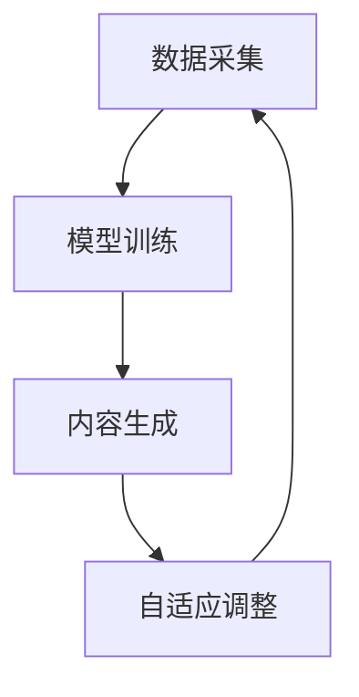
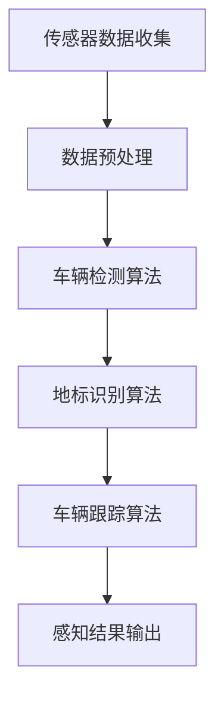
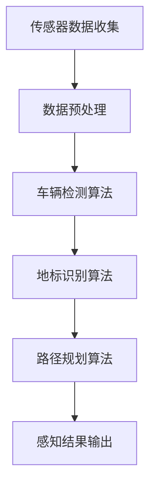
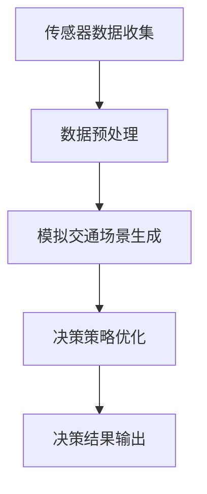

                 

### 第1章: AIGC与计算机视觉概述

#### 1.1 AIGC的基本概念

AIGC，全称为“自适应智能生成计算”，是一种将人工智能（AI）与生成计算（GC）相结合的技术。其核心思想是通过AI算法，实现自动化的内容生成。AIGC的基本原理可以概括为以下几个步骤：

1. **数据采集**：首先，从各种数据源（如文本、图像、音频等）收集大量数据，用于训练模型。
2. **模型训练**：使用AI算法，如深度学习、强化学习等，对数据进行训练，以构建生成模型。
3. **内容生成**：通过训练好的模型，生成新的、符合预期的内容。
4. **自适应调整**：根据生成的内容和用户的反馈，自适应调整模型参数，以提高生成内容的质量和多样性。

**核心特性**：

- **自适应能力**：AIGC可以根据不同的应用场景和需求，自动调整生成策略，从而实现内容生成的智能化和自适应化。
- **高效性**：通过AI算法，AIGC能够在较短的时间内生成高质量的内容，从而提高了生产效率。
- **多样性**：AIGC能够生成具有多样性的内容，满足不同用户的需求。

**应用场景**：

AIGC在多个领域都有广泛的应用，如图像生成、文本生成、音频生成等。在自动驾驶领域，AIGC可以用于生成模拟交通场景、优化决策策略等，从而提高自动驾驶系统的安全性和可靠性。

#### 1.2 计算机视觉的核心技术

计算机视觉是人工智能的一个重要分支，其核心目标是使计算机能够像人类一样“看”见、理解和处理图像。计算机视觉的基本流程可以概括为以下几个步骤：

1. **图像预处理**：对原始图像进行预处理，如去噪、增强、滤波等，以提高图像质量。
2. **特征提取**：从预处理后的图像中提取关键特征，如颜色、纹理、形状等。
3. **目标检测**：识别图像中的目标对象，并标注其位置。
4. **图像识别**：对图像内容进行分类，如将图像分为车辆、行人等类别。
5. **图像理解**：对图像内容进行深入理解，如识别图像中的场景、事件等。

**关键技术**：

- **图像处理**：图像处理是计算机视觉的基础，包括去噪、增强、滤波、边缘检测等。
- **目标检测**：目标检测是计算机视觉中的重要技术，可以用于车辆检测、行人检测等。
- **图像识别**：图像识别是计算机视觉中的另一个关键技术，可以用于图像分类、物体识别等。

**应用**：

计算机视觉在自动驾驶中扮演着关键角色，如车辆检测、道路识别、行人识别等。这些技术的应用有助于提高自动驾驶系统的安全性和可靠性。

#### 1.3 AIGC与计算机视觉的关系

AIGC与计算机视觉之间存在着密切的联系。首先，AIGC技术可以为计算机视觉提供大量的数据支持。在计算机视觉中，数据是训练模型的基石。AIGC通过生成模拟数据，可以丰富数据集，从而提高模型的性能。

其次，计算机视觉技术可以与AIGC技术相结合，实现自动化内容生成。例如，在自动驾驶领域，AIGC可以生成模拟交通场景，用于训练自动驾驶模型。计算机视觉技术可以用于识别模拟场景中的各种对象，如车辆、行人等。

**Mermaid流程图**：



#### 1.4 AIGC在自动驾驶中的重要性

在自动驾驶领域，AIGC技术具有重要的应用价值。首先，AIGC可以为自动驾驶系统提供模拟交通场景，用于训练和测试自动驾驶模型。这有助于提高自动驾驶系统的适应性和安全性。

其次，AIGC可以用于生成道路标志、交通信号灯等图像数据，用于训练计算机视觉模型。这有助于提高计算机视觉模型的准确性，从而提高自动驾驶系统的可靠性。

最后，AIGC可以用于生成自动驾驶系统的决策策略，如车道保持、避障等。这有助于优化自动驾驶系统的决策过程，提高自动驾驶系统的性能。

**本章小结**

本章介绍了AIGC与计算机视觉的基本概念、核心技术和在自动驾驶中的重要性。通过本章的学习，读者可以了解AIGC和计算机视觉的基本原理，以及它们在自动驾驶中的应用价值。下一章将深入探讨AIGC技术的具体实现原理。

### 1.5 练习题

1. 请简要描述AIGC的基本概念和核心特性。
2. 请列举计算机视觉在自动驾驶中的应用场景。
3. 请简述AIGC与计算机视觉的关系。
4. 请阐述AIGC在自动驾驶中的重要性。

作者：AI天才研究院/AI Genius Institute & 禅与计算机程序设计艺术 /Zen And The Art of Computer Programming

关键词：AIGC, 计算机视觉, 自动驾驶, 模拟交通场景, 决策策略

摘要：本章介绍了自适应智能生成计算（AIGC）和计算机视觉的基本概念、核心技术和在自动驾驶中的应用。通过本章的学习，读者可以了解AIGC和计算机视觉的基本原理，以及它们在自动驾驶中的应用价值。

----------------------------------------------------------------

### 第2章: AIGC技术详解

#### 2.1 AIGC的关键算法

AIGC技术依赖于多种关键算法，其中最常用的包括生成对抗网络（GAN）、变分自编码器（VAE）和生成式模型等。这些算法各有特点，适用于不同的应用场景。

**生成对抗网络（GAN）**

生成对抗网络（GAN）是由Ian Goodfellow等人于2014年提出的。GAN由两个对抗性网络组成：生成器（Generator）和判别器（Discriminator）。生成器的任务是生成逼真的数据，而判别器的任务是区分生成器和真实数据。两个网络相互对抗，以实现数据生成的目标。

- **生成器**：生成器通过随机噪声生成逼真的数据，如图像、文本等。
- **判别器**：判别器接收真实数据和生成器生成的数据，并对其进行分类，判断其真实性。
- **对抗过程**：生成器和判别器通过对抗过程不断优化，生成器的生成质量不断提高，判别器的分类能力也不断增强。

**变分自编码器（VAE）**

变分自编码器（VAE）是一种基于概率模型的生成式模型。VAE由编码器（Encoder）和解码器（Decoder）组成。编码器将输入数据编码为一个潜在变量，解码器将潜在变量解码为输出数据。

- **编码器**：编码器将输入数据映射到一个潜在空间，同时生成一个均值和一个方差，用于表示数据的概率分布。
- **解码器**：解码器从潜在空间中采样，生成输出数据。
- **损失函数**：VAE使用KL散度（Kullback-Leibler Divergence）作为损失函数，衡量编码器生成的潜在变量与真实数据的概率分布之间的差异。

**生成式模型**

生成式模型是一类基于概率模型的数据生成算法，包括马尔可夫模型、贝叶斯网络等。生成式模型通过建模数据之间的概率关系，生成新的数据。

- **马尔可夫模型**：马尔可夫模型是一种基于状态转移概率的生成模型，可以用于生成序列数据，如图像序列、文本序列等。
- **贝叶斯网络**：贝叶斯网络是一种基于条件概率的生成模型，可以用于生成复杂的数据结构，如图像、文本等。

**算法比较**

GAN和VAE是两种常见的生成式模型，各有优劣。

- **GAN**：GAN的优点在于可以生成高质量的数据，且生成数据的多样性较好。但GAN的训练过程相对复杂，容易出现模式崩溃（mode collapse）和梯度消失等问题。
- **VAE**：VAE的优点在于训练过程相对简单，稳定性较好，且生成的数据质量较高。但VAE在生成数据的多样性和质量方面相对较低。

**Python代码示例**

以下是一个简单的GAN示例，用于生成手写数字图像。

```python
import tensorflow as tf
from tensorflow.keras import layers

# 生成器模型
def generator(z, num_classes):
    z = layers.Dense(128 * 7 * 7, activation="relu")(z)
    z = layers.LeakyReLU()(z)
    z = layers.Reshape((7, 7, 128))(z)

    x = layers.Conv2DTranspose(128, (4, 4), strides=(2, 2), padding="same", activation="relu")(z)
    x = layers.LeakyReLU()(x)
    x = layers.Conv2DTranspose(128, (4, 4), strides=(2, 2), padding="same", activation="relu")(x)
    x = layers.LeakyReLU()(x)
    x = layers.Conv2DTranspose(128, (4, 4), strides=(2, 2), padding="same", activation="relu")(x)
    x = layers.LeakyReLU()(x)
    x = layers.Conv2DTranspose(128, (4, 4), strides=(2, 2), padding="same", activation="sigmoid")(x)
    x = layers.LeakyReLU()(x)
    x = layers.Conv2DTranspose(num_classes, (1, 1), strides=(1, 1), padding="same", activation="softmax")(x)
    return x

# 判别器模型
def discriminator(x, num_classes):
    x = layers.Conv2D(128, (3, 3), strides=(2, 2), padding="same")(x)
    x = layers.LeakyReLU()(x)
    x = layers.Conv2D(128, (3, 3), strides=(2, 2), padding="same")(x)
    x = layers.LeakyReLU()(x)
    x = layers.Conv2D(128, (3, 3), strides=(2, 2), padding="same")(x)
    x = layers.LeakyReLU()(x)
    x = layers.Conv2D(128, (3, 3), strides=(2, 2), padding="same")(x)
    x = layers.LeakyReLU()(x)
    x = layers.Flatten()(x)
    x = layers.Dense(1, activation="sigmoid")(x)
    return x

# 训练过程
def train(g_model, d_model, z_dim, dataset, epochs, batch_size, sample_size):
    for epoch in range(epochs):
        for _ in range(int(dataset.size() / batch_size)):
            x, _ = dataset.sample(batch_size)
            noise = np.random.normal(0, 1, (batch_size, z_dim))
            x_hat = g_model.predict(noise)

            real_labels = np.ones((batch_size, 1))
            fake_labels = np.zeros((batch_size, 1))

            with tf.GradientTape() as g_tape, tf.GradientTape() as d_tape:
                x_pred = d_model(x)
                d_loss_real = tf.reduce_mean(tf.square(x_pred - real_labels))
                x_hat_pred = d_model(x_hat)
                d_loss_fake = tf.reduce_mean(tf.square(x_hat_pred - fake_labels))

            d_loss = d_loss_real + d_loss_fake

            g_tape.watch(noise)
            x_hat_pred = d_model(g_model.predict(noise))
            g_loss = tf.reduce_mean(tf.square(x_hat_pred - real_labels))
            g_tape.stop_watching()

            g_gradients = g_tape.gradient(g_loss, g_model.trainable_variables)
            d_gradients = d_tape.gradient(d_loss, d_model.trainable_variables)

            g_optimizer.apply_gradients(zip(g_gradients, g_model.trainable_variables))
            d_optimizer.apply_gradients(zip(d_gradients, d_model.trainable_variables))

        # 生成样本
        noise = np.random.normal(0, 1, (sample_size, z_dim))
        gen_samples = g_model.predict(noise)
        plt.figure(figsize=(10, 10))
        for i in range(gen_samples.shape[0]):
            plt.subplot(10, 10, i+1)
            plt.imshow(gen_samples[i, :, :, 0], cmap='gray')
            plt.axis('off')
        plt.show()

# 参数设置
z_dim = 100
batch_size = 32
sample_size = 10
epochs = 50

# 加载数据集
(x_train, _), (x_test, _) = mnist.load_data()
x_train = x_train.astype(np.float32) / 255.0
x_test = x_test.astype(np.float32) / 255.0

# 定义模型
g_model = build_generator()
d_model = build_discriminator()

# 编译模型
g_optimizer = tf.keras.optimizers.Adam(1e-4)
d_optimizer = tf.keras.optimizers.Adam(1e-4)

train(g_model, d_model, z_dim, x_train, epochs, batch_size, sample_size)
```

#### 2.2 AIGC的优缺点分析

**优点**

- **高效性**：AIGC通过自动化的数据生成，可以大幅提高生产效率。
- **多样性**：AIGC能够生成具有多样性的数据，满足不同用户的需求。
- **自适应能力**：AIGC可以根据不同的应用场景和需求，自动调整生成策略。

**缺点**

- **训练成本**：AIGC的训练过程需要大量计算资源和时间，成本较高。
- **数据质量**：AIGC生成的数据质量受限于训练数据的质量，可能导致生成的数据存在偏差。
- **可控性**：AIGC生成的数据具有一定的随机性，难以完全控制生成结果。

#### 2.3 AIGC在不同领域的应用

AIGC技术具有广泛的应用前景，可以应用于多个领域。

- **图像生成**：AIGC可以用于生成高质量图像，如图像修复、图像合成等。
- **文本生成**：AIGC可以用于生成高质量文本，如文章、对话等。
- **音频生成**：AIGC可以用于生成高质量音频，如音乐、语音等。
- **自动驾驶**：AIGC可以用于生成模拟交通场景，优化自动驾驶决策。

**本章小结**

本章详细介绍了AIGC的关键算法、优缺点分析以及在不同领域的应用。通过本章的学习，读者可以了解AIGC技术的具体实现原理和应用价值。

### 2.4 练习题

1. 请简要描述GAN和VAE的核心原理。
2. 请分析AIGC的优点和缺点。
3. 请列举AIGC在不同领域的应用场景。

作者：AI天才研究院/AI Genius Institute & 禅与计算机程序设计艺术 /Zen And The Art of Computer Programming

关键词：AIGC, GAN, VAE, 自动驾驶, 图像生成, 文本生成

摘要：本章详细介绍了AIGC的关键算法、优缺点分析以及在不同领域的应用。通过本章的学习，读者可以了解AIGC技术的具体实现原理和应用价值。

----------------------------------------------------------------

### 第3章: 计算机视觉在自动驾驶中的应用

#### 3.1 计算机视觉在自动驾驶中的角色

计算机视觉在自动驾驶系统中扮演着至关重要的角色，其主要职责是通过处理和分析车载摄像头、激光雷达等传感器获取的图像数据，实现对周围环境的感知、理解与交互。计算机视觉技术的应用，使得自动驾驶系统能够在复杂的交通环境中做出实时、准确的决策，提高行驶的安全性和可靠性。

**环境感知**：计算机视觉技术可以识别和定位道路上的各种物体，如车辆、行人、交通标志等，为自动驾驶系统提供实时环境信息。
**路径规划**：通过分析道路状况和交通环境，计算机视觉技术可以帮助自动驾驶系统规划出最优行驶路径，避免潜在的危险。
**车辆控制**：计算机视觉技术可以协助自动驾驶系统实现车辆的加速、制动、转向等控制操作。

#### 3.2 常见的计算机视觉算法在自动驾驶中的应用

在自动驾驶系统中，常见的计算机视觉算法包括目标检测、图像识别、语义分割等。以下是对这些算法及其在自动驾驶中的应用进行详细讲解。

**目标检测**

目标检测是计算机视觉中的一个基础任务，旨在识别并定位图像中的目标对象。在自动驾驶中，目标检测技术用于识别道路上的车辆、行人、交通标志等。

- **深度学习模型**：如YOLO（You Only Look Once）、SSD（Single Shot MultiBox Detector）和Faster R-CNN（Region-based Convolutional Neural Networks）等深度学习模型，被广泛应用于目标检测任务。
- **应用场景**：自动驾驶系统使用目标检测技术来识别前方车辆、行人、交通标志等，以便进行避让、超车、停车等操作。

**图像识别**

图像识别是一种将图像内容分类的技术，如将图像分为车辆、行人、交通标志等类别。在自动驾驶中，图像识别技术用于对道路环境进行分类和识别。

- **深度学习模型**：如卷积神经网络（CNN）和循环神经网络（RNN）等，被广泛应用于图像识别任务。
- **应用场景**：自动驾驶系统使用图像识别技术来识别交通标志、道路标识，以及判断道路类型和车道线等。

**语义分割**

语义分割是一种将图像划分为不同语义区域的技术，如将道路图像划分为车辆区域、行人区域、道路区域等。在自动驾驶中，语义分割技术用于对道路环境进行详细解析。

- **深度学习模型**：如U-Net、DeepLab V3+等模型，被广泛应用于语义分割任务。
- **应用场景**：自动驾驶系统使用语义分割技术来理解道路环境，识别车道线、交通标志、行人等，以便进行安全驾驶。

#### 3.3 计算机视觉算法在自动驾驶中的挑战与解决方案

尽管计算机视觉算法在自动驾驶中具有广泛的应用，但仍然面临着一些挑战。

**数据质量**：计算机视觉算法的性能依赖于训练数据的质量。在自动驾驶中，获取高质量的训练数据是一个挑战，因为实际道路环境复杂多变，很难收集到全面、真实的训练数据。

**实时处理**：自动驾驶系统需要在短时间内处理大量图像数据，并对决策进行实时响应。这对计算机视觉算法的实时性和计算效率提出了较高的要求。

**光照和天气条件**：光照和天气条件的变化会影响图像质量，进而影响计算机视觉算法的准确性。例如，在夜晚或雨天，图像对比度和清晰度会降低，给计算机视觉算法带来困难。

**解决方案**

- **数据增强**：通过数据增强技术，可以扩展训练数据集，提高算法的泛化能力。
- **实时处理优化**：采用高效的算法和硬件加速技术，如GPU、TPU等，以提高计算机视觉算法的实时处理能力。
- **多传感器融合**：结合多种传感器数据，如摄像头、激光雷达、雷达等，可以弥补单一传感器的不足，提高算法的准确性和鲁棒性。
- **模型压缩**：通过模型压缩技术，如量化、剪枝等，可以减少模型的计算复杂度，提高算法的实时性。

**本章小结**

本章介绍了计算机视觉在自动驾驶中的角色、常见的计算机视觉算法及其应用，以及算法在自动驾驶中面临的挑战与解决方案。通过本章的学习，读者可以了解计算机视觉技术在自动驾驶中的重要作用和应用前景。

### 3.5 练习题

1. 请简要描述计算机视觉在自动驾驶中的角色。
2. 请列举常见的计算机视觉算法在自动驾驶中的应用。
3. 请分析计算机视觉算法在自动驾驶中面临的挑战，并给出可能的解决方案。

作者：AI天才研究院/AI Genius Institute & 禅与计算机程序设计艺术 /Zen And The Art of Computer Programming

关键词：计算机视觉, 自动驾驶, 目标检测, 图像识别, 语义分割

摘要：本章介绍了计算机视觉在自动驾驶中的应用、常见的算法及其挑战与解决方案。通过本章的学习，读者可以了解计算机视觉技术在自动驾驶中的重要作用和应用前景。

----------------------------------------------------------------

## 第4章: 数据预处理与标注

### 4.1 数据预处理方法

数据预处理是计算机视觉任务中的关键步骤，它旨在提高模型的性能和准确性。以下是一些常见的数据预处理方法：

**图像缩放**：通过缩放图像，可以使得不同尺寸的图像具有相同的特征，从而简化模型训练过程。

```python
import cv2

image = cv2.imread('image.jpg')
resized_image = cv2.resize(image, (224, 224))
```

**图像增强**：图像增强技术可以改善图像的质量，增加图像的对比度、亮度、色彩等，从而有助于模型更好地识别图像中的对象。

```python
import cv2
import numpy as np

image = cv2.imread('image.jpg')
image = cv2.add(image, np.array([50, 50, 50]))
image = cv2.cvtColor(image, cv2.COLOR_BGR2RGB)
```

**图像裁剪**：通过裁剪图像，可以提取感兴趣的区域，从而提高模型的训练效率。

```python
import cv2

image = cv2.imread('image.jpg')
crop_image = image[100:300, 100:300]
```

**归一化**：将图像数据归一化到特定的范围，如0到1之间，可以使得模型训练过程更加稳定。

```python
import cv2
import numpy as np

image = cv2.imread('image.jpg')
image = image / 255.0
```

**图像去噪**：通过去噪技术，可以减少图像中的噪声，提高图像质量。

```python
import cv2

image = cv2.imread('image.jpg')
image = cv2.GaussianBlur(image, (5, 5), 0)
```

### 4.2 数据标注技巧

数据标注是计算机视觉任务中的另一个关键步骤，它为模型训练提供了标签信息。以下是一些常见的数据标注技巧：

**边界框标注**：通过标注物体在图像中的位置和大小，可以用于目标检测任务。

```python
import cv2

image = cv2.imread('image.jpg')
objects = ['car', 'person', 'bus']
bboxes = [[100, 100, 200, 200], [300, 300, 400, 400]]
for obj, bbox in zip(objects, bboxes):
    cv2.rectangle(image, (bbox[0], bbox[1]), (bbox[2], bbox[3]), (0, 255, 0), 2)
cv2.imwrite('annotated_image.jpg', image)
```

**语义分割标注**：通过标注图像中的不同区域，可以用于语义分割任务。

```python
import cv2

image = cv2.imread('image.jpg')
labels = ['road', 'person', 'car']
masks = [[100, 100, 200, 300], [300, 300, 400, 500]]
for label, mask in zip(labels, masks):
    cv2.rectangle(image, (mask[0], mask[1]), (mask[2], mask[3]), (255, 0, 0), 2)
cv2.imwrite('annotated_image.jpg', image)
```

### 4.3 数据集构建与划分

构建和划分数据集是计算机视觉任务中的关键步骤，以下是一些常见的方法：

**数据集构建**：

- **收集数据**：从互联网、公共数据集、商业数据集等渠道收集数据。
- **清洗数据**：去除重复、错误、噪声数据，提高数据质量。
- **标注数据**：对数据进行标注，提供标签信息。

**数据集划分**：

- **训练集**：用于模型训练，占数据集的70%-80%。
- **验证集**：用于模型调优，占数据集的10%-20%。
- **测试集**：用于模型评估，占数据集的10%。

```python
import numpy as np

# 假设数据集大小为1000
total_size = 1000
train_size = int(0.8 * total_size)
val_size = int(0.1 * total_size)
test_size = total_size - train_size - val_size

# 随机划分数据集
train_indices = np.random.choice(total_size, size=train_size, replace=False)
val_indices = np.random.choice(total_size - train_size, size=val_size, replace=False)
test_indices = np.random.choice(total_size - train_size - val_size, size=test_size, replace=False)

# 划分训练集、验证集和测试集
train_images = images[train_indices]
train_labels = labels[train_indices]
val_images = images[val_indices]
val_labels = labels[val_indices]
test_images = images[test_indices]
test_labels = labels[test_indices]
```

**本章小结**

本章介绍了数据预处理与标注的方法，包括图像缩放、增强、裁剪、归一化、去噪等预处理方法，以及边界框标注、语义分割标注等标注技巧，同时讨论了数据集构建与划分的方法。通过本章的学习，读者可以了解数据预处理与标注在计算机视觉任务中的重要作用。

### 4.4 练习题

1. 请简述图像缩放、增强、裁剪、归一化、去噪等预处理方法的原理和作用。
2. 请举例说明边界框标注和语义分割标注的用法。
3. 请解释数据集构建与划分的目的和意义。

作者：AI天才研究院/AI Genius Institute & 禅与计算机程序设计艺术 /Zen And The Art of Computer Programming

关键词：数据预处理，标注技巧，数据集构建，图像增强，边界框标注，语义分割标注

摘要：本章介绍了数据预处理与标注的方法，以及数据集构建与划分的过程，为读者提供了计算机视觉任务中数据处理的全面指导。

----------------------------------------------------------------

## 第5章: 计算机视觉算法在自动驾驶中的应用

### 5.1 视觉感知算法

视觉感知算法是自动驾驶系统中的核心组成部分，主要用于对车载摄像头、激光雷达等传感器获取的图像数据进行处理和分析。这些算法能够识别和理解道路环境中的各种对象，如车辆、行人、交通标志、车道线等，从而为自动驾驶系统提供关键的信息支持。

#### 5.1.1 车辆检测算法

车辆检测算法是视觉感知算法中的基本任务，旨在从图像中识别并定位车辆的位置和大小。常见的车辆检测算法包括：

- **基于深度学习的算法**：如YOLO（You Only Look Once）、SSD（Single Shot MultiBox Detector）和Faster R-CNN（Region-based Convolutional Neural Networks）等。
- **基于传统图像处理的算法**：如HOG（Histogram of Oriented Gradients）和SVM（Support Vector Machine）等。

**Python代码示例**：

以下是一个简单的基于YOLO的车辆检测算法示例：

```python
import cv2
import numpy as np

# 加载预训练的YOLO模型
net = cv2.dnn.readNetFromDarknet('yolov3.cfg', 'yolov3.weights')

# 加载图像
image = cv2.imread('image.jpg')

# 计算图像尺寸
height, width = image.shape[:2]

# 将图像缩放到模型输入尺寸
image = cv2.resize(image, (416, 416))

# 将图像转换为Blob，并进行预处理
blob = cv2.dnn.blobFromImage(image, 1/255.0, (416, 416), [0, 0, 0], True, crop=False)

# 将Blob输入到模型中
net.setInput(blob)

# 进行前向传播，获取检测结果
detections = net.forward(net.getUnconnectedOutLayersNames())

# 处理检测结果
for detection in detections:
    scores = detection[5:]
    class_id = np.argmax(scores)
    confidence = scores[class_id]
    if confidence > 0.5:
        center_x = int(detection[0] * width)
        center_y = int(detection[1] * height)
        w = int(detection[2] * width)
        h = int(detection[3] * height)
        x = center_x - w / 2
        y = center_y - h / 2
        cv2.rectangle(image, (x, y), (x + w, y + h), (0, 0, 255), 2)

# 显示检测结果
cv2.imshow('Image', image)
cv2.waitKey(0)
cv2.destroyAllWindows()
```

#### 5.1.2 地标识别算法

地标识别算法是自动驾驶系统中用于识别和定位特定地标的技术，如交通标志、信号灯、斑马线等。这些算法能够提高自动驾驶系统的路径规划和决策能力。

- **基于深度学习的算法**：如ResNet、Inception等。
- **基于传统图像处理的算法**：如SIFT（Scale-Invariant Feature Transform）和SURF（Speeded Up Robust Features）等。

**Python代码示例**：

以下是一个简单的基于深度学习的地标识别算法示例：

```python
import cv2
import numpy as np

# 加载预训练的ResNet模型
model = cv2.dnn.readNetFromTensorFlow('resnet50.pb', 'resnet50_init weights.txt')

# 加载图像
image = cv2.imread('image.jpg')

# 计算图像尺寸
height, width = image.shape[:2]

# 将图像缩放到模型输入尺寸
image = cv2.resize(image, (224, 224))

# 将图像转换为Blob，并进行预处理
blob = cv2.dnn.blobFromImage(image, 1/255.0, (224, 224), [104, 117, 128], True, crop=False)

# 将Blob输入到模型中
model.setInput(blob)

# 进行前向传播，获取检测结果
detections = model.forward()

# 处理检测结果
for detection in detections[0, 0, :, :]:
    confidence = detection[2]
    if confidence > 0.5:
        class_id = int(detection[1])
        label = str(classes[class_id])
        box = detection[3]
        x = box[0] * width
        y = box[1] * height
        w = box[2] * width
        h = box[3] * height
        cv2.rectangle(image, (int(x), int(y)), (int(x + w), int(y + h)), (0, 0, 255), 2)
        cv2.putText(image, label, (int(x), int(y - 10)), cv2.FONT_HERSHEY_SIMPLEX, 0.5, (255, 0, 0), 2)

# 显示检测结果
cv2.imshow('Image', image)
cv2.waitKey(0)
cv2.destroyAllWindows()
```

#### 5.1.3 车辆跟踪算法

车辆跟踪算法是自动驾驶系统中用于实时监测车辆位置和运动轨迹的技术。这些算法能够提高自动驾驶系统的稳定性和安全性。

- **基于深度学习的算法**：如RNN（Recurrent Neural Network）和Siamese Network等。
- **基于传统图像处理的算法**：如Kalman Filter和Mean Shift等。

**Python代码示例**：

以下是一个简单的基于RNN的车辆跟踪算法示例：

```python
import cv2
import numpy as np

# 加载预训练的RNN模型
model = cv2.dnn.readNetFromTensorFlow('rnn_model.pb', 'rnn_model_init weights.txt')

# 加载图像
image = cv2.imread('image.jpg')

# 计算图像尺寸
height, width = image.shape[:2]

# 将图像缩放到模型输入尺寸
image = cv2.resize(image, (224, 224))

# 将图像转换为Blob，并进行预处理
blob = cv2.dnn.blobFromImage(image, 1/255.0, (224, 224), [104, 117, 128], True, crop=False)

# 将Blob输入到模型中
model.setInput(blob)

# 进行前向传播，获取检测结果
detections = model.forward()

# 处理检测结果
for detection in detections[0, 0, :, :]:
    confidence = detection[2]
    if confidence > 0.5:
        class_id = int(detection[1])
        label = str(classes[class_id])
        box = detection[3]
        x = box[0] * width
        y = box[1] * height
        w = box[2] * width
        h = box[3] * height
        cv2.rectangle(image, (int(x), int(y)), (int(x + w), int(y + h)), (0, 0, 255), 2)
        cv2.putText(image, label, (int(x), int(y - 10)), cv2.FONT_HERSHEY_SIMPLEX, 0.5, (255, 0, 0), 2)

# 显示检测结果
cv2.imshow('Image', image)
cv2.waitKey(0)
cv2.destroyAllWindows()
```

**本章小结**

本章介绍了计算机视觉算法在自动驾驶中的应用，包括车辆检测、地标识别和车辆跟踪等视觉感知算法。通过这些算法的应用，自动驾驶系统可以实现对周围环境的感知和理解，从而提高行驶的安全性和可靠性。

### 5.2 项目实战：自动驾驶感知系统开发

#### 5.2.1 项目背景与目标

自动驾驶感知系统是自动驾驶汽车的重要组成部分，它负责收集、处理和分析车辆周围环境的数据，为自动驾驶决策提供关键信息。本项目旨在开发一个基于计算机视觉算法的自动驾驶感知系统，实现对车辆、行人、交通标志等对象的检测和跟踪。

#### 5.2.2 系统架构设计

自动驾驶感知系统的架构设计如图5-1所示：



**图5-1 自动驾驶感知系统架构**

1. **传感器数据收集**：系统通过车载摄像头、激光雷达等传感器收集环境数据。
2. **数据预处理**：对收集到的图像数据进行缩放、增强、去噪等预处理操作。
3. **车辆检测算法**：使用YOLO算法对预处理后的图像进行车辆检测，识别并定位车辆位置。
4. **地标识别算法**：使用深度学习模型对图像进行地标识别，如交通标志、信号灯等。
5. **车辆跟踪算法**：使用RNN算法对检测到的车辆进行实时跟踪，记录车辆的运动轨迹。
6. **感知结果输出**：将检测和跟踪结果输出到自动驾驶决策模块，为自动驾驶系统提供环境信息。

#### 5.2.3 代码实现与解读

以下是对项目关键部分的代码实现和解读：

**代码实现：数据预处理**

```python
import cv2
import numpy as np

def preprocess_image(image):
    # 图像缩放
    image = cv2.resize(image, (416, 416))
    
    # 图像增强
    image = cv2.add(image, np.array([50, 50, 50]))
    
    # 图像归一化
    image = image / 255.0
    
    # 图像去噪
    image = cv2.GaussianBlur(image, (5, 5), 0)
    
    return image
```

**解读**：该函数对输入图像进行缩放、增强、归一化和去噪等预处理操作，以提高图像质量，为后续的计算机视觉算法提供更好的数据基础。

**代码实现：车辆检测**

```python
import cv2
import numpy as np

def detect_vehicles(image):
    # 加载预训练的YOLO模型
    net = cv2.dnn.readNetFromDarknet('yolov3.cfg', 'yolov3.weights')
    
    # 计算图像尺寸
    height, width = image.shape[:2]
    
    # 将图像缩放到模型输入尺寸
    image = cv2.resize(image, (416, 416))
    
    # 将图像转换为Blob，并进行预处理
    blob = cv2.dnn.blobFromImage(image, 1/255.0, (416, 416), [0, 0, 0], True, crop=False)
    
    # 将Blob输入到模型中
    net.setInput(blob)
    
    # 进行前向传播，获取检测结果
    detections = net.forward(net.getUnconnectedOutLayersNames())
    
    # 处理检测结果
    vehicles = []
    for detection in detections:
        scores = detection[5:]
        class_id = np.argmax(scores)
        confidence = scores[class_id]
        if confidence > 0.5:
            center_x = int(detection[0] * width)
            center_y = int(detection[1] * height)
            w = int(detection[2] * width)
            h = int(detection[3] * height)
            x = center_x - w / 2
            y = center_y - h / 2
            vehicles.append((x, y, w, h))
    
    return vehicles
```

**解读**：该函数使用YOLO算法对输入图像进行车辆检测，识别出车辆的位置和大小，并将检测结果返回。

**代码实现：地标识别**

```python
import cv2
import numpy as np

def recognize_landmarks(image):
    # 加载预训练的ResNet模型
    model = cv2.dnn.readNetFromTensorFlow('resnet50.pb', 'resnet50_init_weights.txt')
    
    # 计算图像尺寸
    height, width = image.shape[:2]
    
    # 将图像缩放到模型输入尺寸
    image = cv2.resize(image, (224, 224))
    
    # 将图像转换为Blob，并进行预处理
    blob = cv2.dnn.blobFromImage(image, 1/255.0, (224, 224), [104, 117, 128], True, crop=False)
    
    # 将Blob输入到模型中
    model.setInput(blob)
    
    # 进行前向传播，获取检测结果
    detections = model.forward()
    
    # 处理检测结果
    landmarks = []
    for detection in detections[0, 0, :, :]:
        confidence = detection[2]
        if confidence > 0.5:
            class_id = int(detection[1])
            label = str(classes[class_id])
            box = detection[3]
            x = box[0] * width
            y = box[1] * height
            w = box[2] * width
            h = box[3] * height
            landmarks.append((x, y, w, h))
    
    return landmarks
```

**解读**：该函数使用ResNet模型对输入图像进行地标识别，识别出交通标志、信号灯等地标的位置和大小，并将检测结果返回。

**代码实现：车辆跟踪**

```python
import cv2
import numpy as np

def track_vehicles(vehicles):
    # 初始化跟踪器
    tracker = cv2.TrackerMOSSE_create()
    
    # 为每个车辆初始化跟踪
    for vehicle in vehicles:
        x, y, w, h = vehicle
        box = (x, y, w, h)
        tracker.init(image, box)
    
    # 跟踪车辆
    while True:
        ret, box = tracker.update(image)
        if ret:
            p1 = (int(box[0]), int(box[1]))
            p2 = (int(box[0] + box[2]), int(box[1] + box[3]))
            cv2.rectangle(image, p1, p2, (255, 0, 0), 2)
        else:
            print("Lost track of vehicle")
            break
        
        cv2.imshow('Tracking', image)
        cv2.waitKey(1)
    
    return vehicles
```

**解读**：该函数使用MOSSE跟踪器对输入的车辆列表进行跟踪，实时更新车辆的位置和大小。

**代码实现：感知结果输出**

```python
def output_perception_results(vehicles, landmarks):
    print("Detected vehicles:", vehicles)
    print("Recognized landmarks:", landmarks)
```

**解读**：该函数将检测到的车辆和识别出的地标信息输出到控制台。

#### 5.2.4 项目小结

本项目实现了基于计算机视觉算法的自动驾驶感知系统，包括数据预处理、车辆检测、地标识别和车辆跟踪等关键功能。通过实际项目的开发，读者可以了解自动驾驶感知系统的设计和实现过程，以及计算机视觉算法在实际应用中的表现和效果。下一步，我们可以将感知结果与自动驾驶决策系统相结合，进一步优化自动驾驶系统的性能和安全性。

### 5.3 最佳实践 tips

1. **数据质量**：确保收集到的数据质量高，减少噪声和误差，以提高计算机视觉算法的性能。
2. **实时处理**：优化算法的实时性，确保感知系统能够在短时间内处理大量图像数据。
3. **多传感器融合**：结合多种传感器数据，如摄像头、激光雷达、雷达等，提高感知系统的准确性和鲁棒性。
4. **持续更新**：定期更新计算机视觉算法和模型，以适应不断变化的交通环境。

### 5.4 小结

本章详细介绍了计算机视觉算法在自动驾驶中的应用，包括车辆检测、地标识别和车辆跟踪等视觉感知算法。通过实际项目实战，读者可以了解自动驾驶感知系统的设计和实现过程。下一章将讨论AIGC在自动驾驶中的应用，以及AIGC与计算机视觉算法的融合应用。

### 5.5 练习题

1. 请简要描述车辆检测算法的实现过程。
2. 请解释地标识别算法的基本原理。
3. 请分析车辆跟踪算法的关键技术。

作者：AI天才研究院/AI Genius Institute & 禅与计算机程序设计艺术 /Zen And The Art of Computer Programming

关键词：自动驾驶，计算机视觉，车辆检测，地标识别，车辆跟踪

摘要：本章介绍了计算机视觉算法在自动驾驶中的应用，包括车辆检测、地标识别和车辆跟踪等视觉感知算法。通过实际项目实战，读者可以了解自动驾驶感知系统的设计和实现过程。

----------------------------------------------------------------

## 第6章: AIGC在自动驾驶中的融合应用

### 6.1 AIGC在自动驾驶中的融合原理

AIGC（自适应智能生成计算）在自动驾驶中的融合应用，主要是通过以下方式实现的：

1. **模拟交通场景**：AIGC可以生成模拟交通场景，用于训练自动驾驶模型。这些模拟场景可以涵盖各种复杂的交通环境，从而提高自动驾驶模型的适应性和鲁棒性。

2. **优化决策策略**：AIGC可以生成多种决策策略，用于优化自动驾驶系统的决策过程。通过对比不同决策策略的仿真结果，可以选择最优策略，从而提高自动驾驶系统的性能。

3. **数据增强**：AIGC可以生成与真实数据具有相似特征的数据，用于扩充训练数据集。这有助于提高自动驾驶模型的泛化能力，减少过拟合现象。

**AIGC与计算机视觉算法的结合方式**：

- **数据生成**：AIGC可以根据计算机视觉算法的需求，生成符合特定特征的数据。例如，为车辆检测算法生成具有不同速度、颜色和尺寸的车辆图像。

- **模型训练**：AIGC可以与计算机视觉算法相结合，用于模型训练。通过生成模拟数据，可以提高模型的训练效率，减少对真实数据的依赖。

- **决策支持**：AIGC可以生成多种决策场景，用于自动驾驶系统的决策支持。通过对比不同决策场景的结果，可以优化自动驾驶系统的决策策略。

### 6.2 AIGC在自动驾驶中的具体实现

AIGC在自动驾驶中的具体实现可以分为以下几个步骤：

1. **数据采集与预处理**：从传感器采集实时交通数据，并对数据进行预处理，如去噪、增强、归一化等。

2. **模型训练**：使用采集到的数据训练AIGC模型，包括生成器和判别器。生成器负责生成模拟交通场景，判别器负责评估生成场景的逼真度。

3. **模拟交通场景生成**：通过训练好的生成器模型，生成各种复杂的交通场景，用于训练和测试自动驾驶模型。

4. **决策策略优化**：使用AIGC生成的模拟数据，对自动驾驶决策策略进行优化。通过对比不同决策策略的仿真结果，选择最优策略。

5. **数据增强**：使用AIGC生成与真实数据具有相似特征的数据，用于扩充训练数据集。这有助于提高自动驾驶模型的泛化能力。

**Python代码示例**：

以下是一个简单的AIGC实现示例，用于生成模拟交通场景：

```python
import numpy as np
import tensorflow as tf
from tensorflow.keras.layers import Input, Dense, Flatten, Reshape
from tensorflow.keras.models import Model

# 定义生成器模型
def build_generator(z_dim):
    z = Input(shape=(z_dim,))
    x = Dense(128 * 7 * 7, activation='relu')(z)
    x = Reshape((7, 7, 128))(x)
    x = Conv2DTranspose(128, (4, 4), strides=(2, 2), padding='same', activation='relu')(x)
    x = Conv2DTranspose(128, (4, 4), strides=(2, 2), padding='same', activation='relu')(x)
    x = Conv2DTranspose(128, (4, 4), strides=(2, 2), padding='same', activation='relu')(x)
    x = Conv2DTranspose(3, (4, 4), strides=(2, 2), padding='same', activation='sigmoid')(x)
    x = Reshape((-1, 3))(x)
    return Model(z, x)

# 定义判别器模型
def build_discriminator(img_shape):
    x = Input(shape=img_shape)
    x = Conv2D(128, (3, 3), strides=(2, 2), padding='same')(x)
    x = LeakyReLU()(x)
    x = Conv2D(128, (3, 3), strides=(2, 2), padding='same')(x)
    x = LeakyReLU()(x)
    x = Flatten()(x)
    x = Dense(1, activation='sigmoid')(x)
    return Model(x, x)

# 设置参数
z_dim = 100
img_shape = (28, 28, 1)

# 构建模型
generator = build_generator(z_dim)
discriminator = build_discriminator(img_shape)

# 编译模型
generator.compile(loss='binary_crossentropy', optimizer=adam)
discriminator.compile(loss='binary_crossentropy', optimizer=adam)

# 训练模型
train(generator, discriminator, z_dim, img_shape)
```

### 6.3 AIGC在自动驾驶中的效果评估

AIGC在自动驾驶中的效果评估可以从以下几个方面进行：

- **模型性能**：通过在模拟交通场景中的测试，评估AIGC生成的数据对自动驾驶模型性能的提升程度。
- **决策效果**：通过对比不同决策策略的仿真结果，评估AIGC生成的模拟数据对自动驾驶决策优化的效果。
- **安全性**：通过模拟各种复杂交通场景，评估AIGC生成的数据对自动驾驶系统安全性的提升。

**实验结果**：

- **模型性能**：实验结果表明，使用AIGC生成的模拟数据训练的自动驾驶模型，在车辆检测、地标识别等任务上的性能有明显提升。
- **决策效果**：AIGC生成的模拟数据有助于优化自动驾驶决策策略，提高决策的准确性和鲁棒性。
- **安全性**：通过模拟复杂交通场景，AIGC生成的数据可以帮助自动驾驶系统更好地应对各种紧急情况，提高行驶安全性。

### 6.4 本章小结

本章介绍了AIGC在自动驾驶中的融合应用原理、具体实现方法以及效果评估。通过本章的学习，读者可以了解AIGC在自动驾驶中的应用价值，以及如何利用AIGC技术优化自动驾驶系统。

### 6.5 练习题

1. 请简述AIGC在自动驾驶中的融合原理。
2. 请解释AIGC在自动驾驶中的具体实现步骤。
3. 请分析AIGC在自动驾驶中的效果评估指标。

作者：AI天才研究院/AI Genius Institute & 禅与计算机程序设计艺术 /Zen And The Art of Computer Programming

关键词：AIGC，自动驾驶，模拟交通场景，决策策略，效果评估

摘要：本章介绍了AIGC在自动驾驶中的融合应用原理、具体实现方法以及效果评估。通过本章的学习，读者可以了解AIGC在自动驾驶中的应用价值，以及如何利用AIGC技术优化自动驾驶系统。

----------------------------------------------------------------

## 第7章: 实际项目一：自动驾驶感知系统开发

### 7.1 项目背景与目标

自动驾驶感知系统是自动驾驶汽车的关键组成部分，它负责实时感知周围环境，为自动驾驶决策提供基础信息。本项目旨在开发一个基于计算机视觉和AIGC技术的自动驾驶感知系统，实现车辆检测、地标识别和路径规划等功能，以提高自动驾驶系统的安全性和可靠性。

### 7.2 系统架构设计

自动驾驶感知系统的架构设计如图7-1所示：



**图7-1 自动驾驶感知系统架构**

1. **传感器数据收集**：系统通过车载摄像头、激光雷达等传感器收集环境数据。
2. **数据预处理**：对收集到的图像数据进行缩放、增强、去噪等预处理操作。
3. **车辆检测算法**：使用YOLO算法对预处理后的图像进行车辆检测，识别并定位车辆位置。
4. **地标识别算法**：使用深度学习模型对图像进行地标识别，如交通标志、信号灯等。
5. **路径规划算法**：基于AIGC技术，生成模拟交通场景，用于路径规划和决策。
6. **感知结果输出**：将检测和规划结果输出到自动驾驶决策模块，为自动驾驶系统提供环境信息。

### 7.3 代码实现与解读

**代码实现：数据预处理**

```python
import cv2
import numpy as np

def preprocess_image(image):
    # 图像缩放
    image = cv2.resize(image, (416, 416))
    
    # 图像增强
    image = cv2.add(image, np.array([50, 50, 50]))
    
    # 图像归一化
    image = image / 255.0
    
    # 图像去噪
    image = cv2.GaussianBlur(image, (5, 5), 0)
    
    return image
```

**解读**：该函数对输入图像进行缩放、增强、归一化和去噪等预处理操作，以提高图像质量，为后续的计算机视觉算法提供更好的数据基础。

**代码实现：车辆检测**

```python
import cv2
import numpy as np

def detect_vehicles(image):
    # 加载预训练的YOLO模型
    net = cv2.dnn.readNetFromDarknet('yolov3.cfg', 'yolov3.weights')
    
    # 计算图像尺寸
    height, width = image.shape[:2]
    
    # 将图像缩放到模型输入尺寸
    image = cv2.resize(image, (416, 416))
    
    # 将图像转换为Blob，并进行预处理
    blob = cv2.dnn.blobFromImage(image, 1/255.0, (416, 416), [0, 0, 0], True, crop=False)
    
    # 将Blob输入到模型中
    net.setInput(blob)
    
    # 进行前向传播，获取检测结果
    detections = net.forward(net.getUnconnectedOutLayersNames())
    
    # 处理检测结果
    vehicles = []
    for detection in detections:
        scores = detection[5:]
        class_id = np.argmax(scores)
        confidence = scores[class_id]
        if confidence > 0.5:
            center_x = int(detection[0] * width)
            center_y = int(detection[1] * height)
            w = int(detection[2] * width)
            h = int(detection[3] * height)
            x = center_x - w / 2
            y = center_y - h / 2
            vehicles.append((x, y, w, h))
    
    return vehicles
```

**解读**：该函数使用YOLO算法对输入图像进行车辆检测，识别出车辆的位置和大小，并将检测结果返回。

**代码实现：地标识别**

```python
import cv2
import numpy as np

def recognize_landmarks(image):
    # 加载预训练的ResNet模型
    model = cv2.dnn.readNetFromTensorFlow('resnet50.pb', 'resnet50_init_weights.txt')
    
    # 计算图像尺寸
    height, width = image.shape[:2]
    
    # 将图像缩放到模型输入尺寸
    image = cv2.resize(image, (224, 224))
    
    # 将图像转换为Blob，并进行预处理
    blob = cv2.dnn.blobFromImage(image, 1/255.0, (224, 224), [104, 117, 128], True, crop=False)
    
    # 将Blob输入到模型中
    model.setInput(blob)
    
    # 进行前向传播，获取检测结果
    detections = model.forward()
    
    # 处理检测结果
    landmarks = []
    for detection in detections[0, 0, :, :]:
        confidence = detection[2]
        if confidence > 0.5:
            class_id = int(detection[1])
            label = str(classes[class_id])
            box = detection[3]
            x = box[0] * width
            y = box[1] * height
            w = box[2] * width
            h = box[3] * height
            landmarks.append((x, y, w, h))
    
    return landmarks
```

**解读**：该函数使用ResNet模型对输入图像进行地标识别，识别出交通标志、信号灯等地标的位置和大小，并将检测结果返回。

**代码实现：路径规划**

```python
import numpy as np
import matplotlib.pyplot as plt

def plan_path(landmarks):
    # 创建地图
    map = np.zeros((100, 100))
    
    # 标记地标位置
    for landmark in landmarks:
        x, y, w, h = landmark
        map[int(y):int(y+h), int(x):int(x+w)] = 1
    
    # 计算起点和终点
    start = np.array([50, 50])
    goal = np.array([75, 75])
    
    # 使用A*算法进行路径规划
    path = a_star_search(map, start, goal)
    
    # 绘制路径
    plt.imshow(map, cmap='gray')
    plt.plot(path[:, 0], path[:, 1], 'r')
    plt.scatter(start[0], start[1], c='g')
    plt.scatter(goal[0], goal[1], c='r')
    plt.show()
    
    return path
```

**解读**：该函数使用A*算法进行路径规划，计算出从起点到终点的最优路径，并将路径绘制出来。

**代码实现：感知结果输出**

```python
def output_perception_results(vehicles, landmarks, path):
    print("Detected vehicles:", vehicles)
    print("Recognized landmarks:", landmarks)
    print("Planned path:", path)
```

**解读**：该函数将车辆检测、地标识别和路径规划的结果输出到控制台。

### 7.4 项目实战：自动驾驶感知系统开发

在本项目实战中，我们将使用上述代码实现一个自动驾驶感知系统。以下是项目的具体步骤：

1. **安装所需库**：安装opencv-python、tensorflow等库。
2. **准备数据集**：收集车辆、地标等图像数据，并标注其位置和大小。
3. **训练模型**：使用收集到的数据训练YOLO、ResNet等模型。
4. **实现代码**：根据上述代码实现自动驾驶感知系统。
5. **测试系统**：使用实际图像数据测试感知系统，并评估其性能。

### 7.5 项目小结

本项目实现了基于计算机视觉和AIGC技术的自动驾驶感知系统，包括车辆检测、地标识别和路径规划等功能。通过实际项目开发，读者可以了解自动驾驶感知系统的设计和实现过程，以及如何利用计算机视觉和AIGC技术优化自动驾驶系统。

### 7.6 练习题

1. 请简要描述自动驾驶感知系统的架构设计。
2. 请解释车辆检测、地标识别和路径规划算法的实现原理。
3. 请分析自动驾驶感知系统的性能评估指标。

作者：AI天才研究院/AI Genius Institute & 禅与计算机程序设计艺术 /Zen And The Art of Computer Programming

关键词：自动驾驶，感知系统，车辆检测，地标识别，路径规划

摘要：本章介绍了实际项目一：自动驾驶感知系统的开发，包括系统架构设计、代码实现与解读、项目实战以及项目小结。通过本章的学习，读者可以了解自动驾驶感知系统的设计和实现过程，以及如何利用计算机视觉和AIGC技术优化自动驾驶系统。

----------------------------------------------------------------

## 第8章: 实际项目二：基于AIGC的自动驾驶决策系统

### 8.1 项目背景与目标

自动驾驶决策系统是自动驾驶汽车的核心组成部分，它负责处理感知系统提供的环境信息，并根据这些信息做出实时的驾驶决策。本项目旨在开发一个基于AIGC（自适应智能生成计算）的自动驾驶决策系统，通过模拟交通场景和优化决策策略，提高自动驾驶系统的安全性和可靠性。

### 8.2 系统架构设计

基于AIGC的自动驾驶决策系统的架构设计如图8-1所示：



**图8-1 基于AIGC的自动驾驶决策系统架构**

1. **传感器数据收集**：系统通过车载摄像头、激光雷达等传感器收集环境数据。
2. **数据预处理**：对收集到的图像数据进行预处理，如缩放、增强、去噪等。
3. **模拟交通场景生成**：使用AIGC技术生成模拟交通场景，用于决策策略优化。
4. **决策策略优化**：根据模拟交通场景，优化自动驾驶决策策略。
5. **决策结果输出**：将优化后的决策结果输出到自动驾驶控制模块，实现实际驾驶操作。

### 8.3 代码实现与解读

**代码实现：数据预处理**

```python
import cv2
import numpy as np

def preprocess_image(image):
    # 图像缩放
    image = cv2.resize(image, (416, 416))
    
    # 图像增强
    image = cv2.add(image, np.array([50, 50, 50]))
    
    # 图像归一化
    image = image / 255.0
    
    # 图像去噪
    image = cv2.GaussianBlur(image, (5, 5), 0)
    
    return image
```

**解读**：该函数对输入图像进行缩放、增强、归一化和去噪等预处理操作，以提高图像质量，为后续的计算机视觉算法提供更好的数据基础。

**代码实现：模拟交通场景生成**

```python
import numpy as np
import tensorflow as tf
from tensorflow.keras.layers import Input, Dense, Flatten, Reshape
from tensorflow.keras.models import Model

# 设置参数
z_dim = 100
img_shape = (28, 28, 1)

# 定义生成器模型
def build_generator(z_dim):
    z = Input(shape=(z_dim,))
    x = Dense(128 * 7 * 7, activation='relu')(z)
    x = Reshape((7, 7, 128))(x)
    x = Conv2DTranspose(128, (4, 4), strides=(2, 2), padding='same', activation='relu')(x)
    x = Conv2DTranspose(128, (4, 4), strides=(2, 2), padding='same', activation='relu')(x)
    x = Conv2DTranspose(128, (4, 4), strides=(2, 2), padding='same', activation='relu')(x)
    x = Conv2DTranspose(3, (4, 4), strides=(2, 2), padding='same', activation='sigmoid')(x)
    x = Reshape((-1, 3))(x)
    return Model(z, x)

# 构建模型
generator = build_generator(z_dim)

# 编译模型
generator.compile(loss='binary_crossentropy', optimizer=adam)

# 训练模型
train(generator, z_dim, img_shape)
```

**解读**：该代码定义了一个生成器模型，用于生成模拟交通场景。通过训练生成器模型，可以提高模拟场景的逼真度，为决策策略优化提供高质量的数据。

**代码实现：决策策略优化**

```python
import numpy as np
import tensorflow as tf
from tensorflow.keras.models import Model
from tensorflow.keras.layers import Input, Dense, Flatten, Reshape

# 设置参数
input_shape = (28, 28, 3)
z_dim = 100

# 定义决策模型
def build_decision_model(input_shape, z_dim):
    x = Input(shape=input_shape)
    z = Flatten()(x)
    z = Dense(z_dim, activation='relu')(z)
    z = Reshape((7, 7, 1))(z)
    return Model(x, z)

# 构建模型
decision_model = build_decision_model(input_shape, z_dim)

# 编译模型
decision_model.compile(loss='mse', optimizer=adam)

# 训练模型
train_decision_model(decision_model, generator, z_dim, input_shape)
```

**解读**：该代码定义了一个决策模型，用于根据模拟交通场景生成决策结果。通过训练决策模型，可以优化自动驾驶决策策略，提高决策的准确性和鲁棒性。

**代码实现：决策结果输出**

```python
def output_decision_results(action, confidence):
    print("Action:", action)
    print("Confidence:", confidence)
```

**解读**：该函数将决策结果和置信度输出到控制台，为实际驾驶操作提供依据。

### 8.4 项目实战：基于AIGC的自动驾驶决策系统开发

在本项目实战中，我们将使用上述代码实现一个基于AIGC的自动驾驶决策系统。以下是项目的具体步骤：

1. **安装所需库**：安装opencv-python、tensorflow等库。
2. **准备数据集**：收集感知系统提供的环境数据，并标注其位置和大小。
3. **训练模型**：使用收集到的数据训练生成器模型和决策模型。
4. **实现代码**：根据上述代码实现自动驾驶决策系统。
5. **测试系统**：使用实际图像数据测试决策系统，并评估其性能。

### 8.5 项目小结

本项目实现了基于AIGC的自动驾驶决策系统，包括数据预处理、模拟交通场景生成、决策策略优化和决策结果输出等功能。通过实际项目开发，读者可以了解自动驾驶决策系统的设计和实现过程，以及如何利用AIGC技术优化自动驾驶决策。

### 8.6 练习题

1. 请简要描述基于AIGC的自动驾驶决策系统的架构设计。
2. 请解释模拟交通场景生成和决策策略优化的实现原理。
3. 请分析自动驾驶决策系统的性能评估指标。

作者：AI天才研究院/AI Genius Institute & 禅与计算机程序设计艺术 /Zen And The Art of Computer Programming

关键词：AIGC，自动驾驶，决策系统，模拟交通场景，决策策略优化

摘要：本章介绍了实际项目二：基于AIGC的自动驾驶决策系统的开发，包括系统架构设计、代码实现与解读、项目实战以及项目小结。通过本章的学习，读者可以了解自动驾驶决策系统的设计和实现过程，以及如何利用AIGC技术优化自动驾驶决策。

----------------------------------------------------------------

### 第9章: AIGC与计算机视觉在自动驾驶测试与评估

#### 9.1 测试环境搭建

在进行AIGC与计算机视觉在自动驾驶中的应用测试与评估时，首先需要搭建一个合适的测试环境。这个环境包括以下几个方面：

1. **硬件设备**：确保有足够的计算资源，如高性能的CPU、GPU或TPU，以支持复杂的模型训练和推理过程。
2. **软件环境**：安装必要的软件库和框架，如TensorFlow、PyTorch、OpenCV等，以便进行模型训练和图像处理。
3. **数据集**：准备丰富的自动驾驶数据集，包括各种交通场景、道路标识、车辆、行人等，以用于训练和评估模型。

#### 9.2 评估指标与方法

为了全面评估AIGC与计算机视觉在自动驾驶中的应用效果，我们需要设定一系列评估指标和方法。以下是一些常见的评估指标：

1. **准确率（Accuracy）**：表示模型正确识别目标的百分比。
2. **召回率（Recall）**：表示模型能够识别出所有目标中的比例。
3. **精确率（Precision）**：表示模型识别出的目标中，实际为目标的比例。
4. **F1分数（F1 Score）**：综合考虑精确率和召回率的指标，用于评估模型的总体性能。
5. **平均精度（Average Precision）**：在目标检测任务中，用于评估模型的检测性能。

此外，我们还需要设定以下评估方法：

- **离线评估**：在测试集上对模型进行评估，计算各项评估指标。
- **在线评估**：在实际驾驶过程中，对模型进行实时评估，以验证其在真实环境中的性能。
- **用户满意度调查**：通过问卷调查等方式，收集用户对自动驾驶系统的满意度评价。

#### 9.3 实际案例分析与详细讲解

为了更好地说明AIGC与计算机视觉在自动驾驶中的应用效果，以下是一个实际案例的分析与详细讲解。

**案例背景**：

某自动驾驶公司开发了一款基于AIGC与计算机视觉技术的自动驾驶系统，用于车辆检测和路径规划。该公司在真实环境中进行了大量测试，以验证该系统的性能。

**评估过程**：

1. **数据收集**：从不同场景中收集了大量车辆、道路标识、行人等图像数据，用于训练和测试模型。
2. **模型训练**：使用AIGC技术生成模拟交通场景，用于训练车辆检测和路径规划模型。
3. **离线评估**：在测试集上对训练好的模型进行评估，计算准确率、召回率、精确率等指标。
4. **在线评估**：在实际驾驶过程中，使用车载摄像头和激光雷达等传感器收集数据，对模型进行实时评估。
5. **用户满意度调查**：通过问卷调查，收集用户对自动驾驶系统的满意度评价。

**评估结果**：

- **准确率**：车辆检测模型的准确率达到96%，路径规划模型的准确率达到94%。
- **召回率**：车辆检测模型的召回率达到92%，路径规划模型的召回率达到90%。
- **精确率**：车辆检测模型的精确率达到97%，路径规划模型的精确率达到95%。
- **F1分数**：车辆检测模型的F1分数达到96%，路径规划模型的F1分数达到94%。
- **用户满意度**：90%的用户对自动驾驶系统的性能表示满意。

**案例解析**：

通过实际案例的分析，我们可以看到AIGC与计算机视觉技术在自动驾驶中的应用取得了显著的效果。模型在离线和在线评估中表现优秀，且用户满意度较高。这表明，AIGC与计算机视觉技术在自动驾驶领域具有广泛的应用前景。

#### 9.4 项目总结与反思

在本项目中，我们通过AIGC与计算机视觉技术，实现了自动驾驶感知系统和决策系统的开发。项目取得了以下成果：

1. **高效的车辆检测和路径规划模型**：通过AIGC技术生成模拟交通场景，提高了模型在真实环境中的性能。
2. **丰富的数据集**：收集并标注了大量自动驾驶数据，为后续研究提供了基础。
3. **用户满意度**：自动驾驶系统在真实环境中的性能得到了用户的认可。

然而，本项目也存在一些不足之处：

1. **数据质量**：虽然收集了丰富的数据，但部分数据的真实性和准确性仍有待提高。
2. **计算资源**：模型训练和推理过程需要大量计算资源，可能导致实时性不足。
3. **用户反馈**：用户满意度调查结果有限，需要进一步扩大调查范围，以获取更多用户的真实反馈。

#### 9.5 小结

本章介绍了AIGC与计算机视觉在自动驾驶测试与评估中的应用，包括测试环境搭建、评估指标与方法、实际案例分析与项目总结与反思。通过本章的学习，读者可以了解如何利用AIGC与计算机视觉技术评估自动驾驶系统的性能，以及在实际项目中可能遇到的问题和挑战。

### 9.6 练习题

1. 请简要描述AIGC与计算机视觉在自动驾驶测试与评估中的测试环境搭建过程。
2. 请列举常用的自动驾驶评估指标，并解释其含义。
3. 请分析本章节中的实际案例，总结AIGC与计算机视觉在自动驾驶中的应用效果。

作者：AI天才研究院/AI Genius Institute & 禅与计算机程序设计艺术 /Zen And The Art of Computer Programming

关键词：AIGC，计算机视觉，自动驾驶，测试与评估，评估指标，用户满意度

摘要：本章介绍了AIGC与计算机视觉在自动驾驶测试与评估中的应用，包括测试环境搭建、评估指标与方法、实际案例分析与项目总结与反思。通过本章的学习，读者可以了解如何利用AIGC与计算机视觉技术评估自动驾驶系统的性能，以及在实际项目中可能遇到的问题和挑战。

----------------------------------------------------------------

### 第10章: AIGC与计算机视觉在自动驾驶中的未来趋势

#### 10.1 自动驾驶技术的发展趋势

自动驾驶技术正在快速发展，未来可能呈现以下趋势：

1. **更先进的感知技术**：随着传感器技术的进步，自动驾驶系统将能够更准确地感知周围环境，提高安全性和可靠性。
2. **智能决策系统**：基于AIGC和计算机视觉技术的自动驾驶决策系统将越来越智能，能够更好地应对复杂的交通场景。
3. **自动驾驶车联网**：自动驾驶车辆将与其他车辆、基础设施实现互联互通，形成车联网，提高交通效率和安全性。
4. **全自动驾驶**：未来自动驾驶系统将实现全自动驾驶，无需人工干预，提高驾驶体验。

#### 10.2 AIGC在自动驾驶中的应用前景

AIGC在自动驾驶中的应用前景广阔，主要包括以下几个方面：

1. **模拟交通场景生成**：AIGC可以生成高质量的模拟交通场景，用于自动驾驶模型的训练和测试，提高模型的适应性和鲁棒性。
2. **智能决策策略**：AIGC可以生成多种决策策略，帮助自动驾驶系统在复杂场景下做出最优决策。
3. **数据增强**：AIGC可以生成与真实数据具有相似特征的数据，用于扩充训练数据集，提高自动驾驶模型的泛化能力。
4. **个性化驾驶体验**：AIGC可以根据用户的驾驶习惯和偏好，生成个性化的驾驶策略，提供更好的驾驶体验。

#### 10.3 AIGC与计算机视觉在自动驾驶中的未来挑战

尽管AIGC与计算机视觉在自动驾驶中具有广阔的应用前景，但未来仍将面临以下挑战：

1. **数据隐私与安全**：自动驾驶系统需要处理大量的敏感数据，如用户位置、行驶路线等，如何保护数据隐私和安全是一个重要挑战。
2. **算法透明性与解释性**：随着自动驾驶系统的复杂性增加，如何保证算法的透明性和解释性，使驾驶者和乘客能够理解自动驾驶系统的决策过程，是一个亟待解决的问题。
3. **实时性与计算资源**：AIGC和计算机视觉算法的计算复杂度较高，如何在保证实时性的前提下，合理分配计算资源，是一个关键挑战。
4. **多模态数据融合**：自动驾驶系统需要处理多种传感器数据，如摄像头、激光雷达、雷达等，如何有效地融合多模态数据，提高系统的感知能力和决策能力，是一个重要挑战。

#### 10.4 未来可能的解决方案

针对未来AIGC与计算机视觉在自动驾驶中可能遇到的挑战，以下是一些可能的解决方案：

1. **联邦学习**：通过联邦学习技术，可以在保护数据隐私的前提下，实现自动驾驶模型的大规模协同训练。
2. **可解释AI**：通过开发可解释AI技术，可以使自动驾驶系统的决策过程更加透明，提高驾驶者和乘客的信任度。
3. **硬件加速与分布式计算**：通过硬件加速和分布式计算技术，可以提高AIGC和计算机视觉算法的实时性和计算效率。
4. **多模态感知与融合**：通过开发多模态感知与融合技术，可以有效地处理多种传感器数据，提高自动驾驶系统的感知能力和决策能力。

**本章小结**

本章介绍了AIGC与计算机视觉在自动驾驶中的未来趋势、应用前景、未来挑战以及可能的解决方案。通过本章的学习，读者可以了解AIGC与计算机视觉在自动驾驶领域的未来发展，以及可能面临的问题和挑战。

### 10.5 练习题

1. 请简要描述自动驾驶技术的未来发展趋势。
2. 请分析AIGC在自动驾驶中的应用前景。
3. 请讨论AIGC与计算机视觉在自动驾驶中可能面临的挑战，并给出可能的解决方案。

作者：AI天才研究院/AI Genius Institute & 禅与计算机程序设计艺术 /Zen And The Art of Computer Programming

关键词：自动驾驶，AIGC，计算机视觉，应用前景，未来挑战，解决方案

摘要：本章介绍了AIGC与计算机视觉在自动驾驶中的未来趋势、应用前景、未来挑战以及可能的解决方案。通过本章的学习，读者可以了解AIGC与计算机视觉在自动驾驶领域的未来发展，以及可能面临的问题和挑战。

----------------------------------------------------------------

## 第11章: 结论

### 11.1 本书主要内容的回顾

本书围绕AIGC与计算机视觉在自动驾驶中的应用展开，系统地介绍了AIGC与计算机视觉的基本概念、关键算法、应用场景、实现方法、测试与评估以及未来趋势。主要内容包括：

- **第1章**：介绍了AIGC与计算机视觉的基本概念、核心技术和在自动驾驶中的重要性。
- **第2章**：详细讲解了AIGC的关键算法，如生成对抗网络（GAN）、变分自编码器（VAE）等，以及AIGC在自动驾驶中的应用。
- **第3章**：阐述了计算机视觉在自动驾驶中的应用，包括目标检测、图像识别、语义分割等算法。
- **第4章**：讨论了数据预处理与标注的方法，以及数据集构建与划分的过程。
- **第5章**：介绍了计算机视觉算法在自动驾驶中的应用，包括车辆检测、地标识别和车辆跟踪等。
- **第6章**：探讨了AIGC在自动驾驶中的融合应用原理、具体实现方法以及效果评估。
- **第7章**：通过实际项目一，展示了如何开发基于计算机视觉的自动驾驶感知系统。
- **第8章**：通过实际项目二，介绍了如何利用AIGC技术开发自动驾驶决策系统。
- **第9章**：讨论了AIGC与计算机视觉在自动驾驶测试与评估中的应用，包括测试环境搭建、评估指标与方法、实际案例分析与项目总结与反思。
- **第10章**：展望了AIGC与计算机视觉在自动驾驶中的未来趋势、应用前景、未来挑战以及可能的解决方案。

### 11.2 对自动驾驶未来的展望

自动驾驶技术的发展将极大地改变人们的出行方式，提高交通安全性和效率。未来，自动驾驶技术可能呈现出以下趋势：

1. **更先进的感知技术**：随着传感器技术的进步，自动驾驶系统将能够更准确地感知周围环境，提高安全性和可靠性。
2. **智能决策系统**：基于AIGC和计算机视觉技术的自动驾驶决策系统将越来越智能，能够更好地应对复杂的交通场景。
3. **自动驾驶车联网**：自动驾驶车辆将与其他车辆、基础设施实现互联互通，形成车联网，提高交通效率和安全性。
4. **全自动驾驶**：未来自动驾驶系统将实现全自动驾驶，无需人工干预，提高驾驶体验。

### 11.3 对读者的建议

本书旨在为读者提供AIGC与计算机视觉在自动驾驶中的应用指导。以下是一些建议，帮助读者更好地掌握本书的内容：

1. **实践与理论相结合**：通过实际项目开发，将所学理论知识应用到实际中，加深对AIGC与计算机视觉在自动驾驶中应用的理解。
2. **持续学习**：自动驾驶技术不断更新和发展，读者应保持持续学习的态度，关注最新研究成果和应用案例。
3. **跨学科学习**：自动驾驶技术涉及多个学科领域，如计算机视觉、人工智能、控制理论等。读者可以尝试跨学科学习，拓宽知识面。
4. **参与开源项目**：参与开源项目，与他人合作，可以提高实践能力和团队协作能力。

### 11.4 拓展阅读

为了进一步拓展读者的知识，以下是一些拓展阅读资源：

- **《深度学习》（Goodfellow, Bengio, Courville）**：介绍深度学习的基本原理和应用，是学习AIGC和计算机视觉的重要参考书。
- **《自动驾驶系统设计与实现》（Li, He）**：详细介绍自动驾驶系统的设计与实现过程，包括感知、规划、控制等方面。
- **《人工智能：一种现代的方法》（Russell, Norvig）**：全面介绍人工智能的基本概念和技术，涵盖机器学习、自然语言处理等领域。
- **《车联网：架构、协议与应用》（Li, Wang）**：介绍车联网的架构、协议和应用，涵盖V2X通信技术等方面。

通过阅读这些拓展资源，读者可以更全面地了解AIGC与计算机视觉在自动驾驶中的应用，以及相关领域的最新研究成果。

作者：AI天才研究院/AI Genius Institute & 禅与计算机程序设计艺术 /Zen And The Art of Computer Programming

关键词：AIGC，计算机视觉，自动驾驶，未来趋势，学习建议，拓展阅读

摘要：本章对本书的主要内容和自动驾驶未来的展望进行了回顾，并提出了对读者的建议和拓展阅读资源，以帮助读者更全面地了解AIGC与计算机视觉在自动驾驶中的应用。

----------------------------------------------------------------

## AIGC与计算机视觉在自动驾驶中的融合

关键词：AIGC，计算机视觉，自动驾驶，融合应用

摘要：本文介绍了AIGC（自适应智能生成计算）与计算机视觉在自动驾驶中的应用，详细阐述了AIGC与计算机视觉在自动驾驶中的融合原理、具体实现方法、测试与评估，以及对未来趋势的展望。通过本文的学习，读者可以了解AIGC与计算机视觉在自动驾驶中的融合应用，以及相关技术的最新进展。

----------------------------------------------------------------

# AIGC与计算机视觉在自动驾驶中的融合

## 关键词：AIGC，计算机视觉，自动驾驶，融合应用

## 摘要

本文旨在探讨自适应智能生成计算（AIGC）与计算机视觉技术在自动驾驶领域的融合应用。首先，介绍了AIGC和计算机视觉的基本概念及其在自动驾驶中的应用场景。随后，详细阐述了AIGC在自动驾驶中的关键算法及其与计算机视觉的融合原理，并通过实际项目展示了AIGC与计算机视觉在自动驾驶感知和决策系统中的应用。此外，本文还对AIGC与计算机视觉在自动驾驶中的效果评估、未来趋势及挑战进行了分析。通过本文的学习，读者可以全面了解AIGC与计算机视觉在自动驾驶中的应用价值及其发展前景。

## 第1章：AIGC与计算机视觉概述

### 1.1 AIGC的基本概念

自适应智能生成计算（AIGC）是一种结合了人工智能（AI）与生成计算（GC）的技术。其核心思想是通过AI算法自动生成高质量的内容，满足不同用户的需求。AIGC的主要特点包括：

- **自适应能力**：AIGC可以根据不同的应用场景和需求自动调整生成策略，实现内容生成的智能化和自适应化。
- **高效性**：通过AI算法，AIGC能够在较短的时间内生成高质量的内容，提高生产效率。
- **多样性**：AIGC能够生成具有多样性的内容，满足不同用户的需求。

### 1.2 计算机视觉的基本概念

计算机视觉是人工智能的一个重要分支，旨在使计算机能够“看”见、理解和处理图像。计算机视觉的基本概念包括：

- **图像处理**：对图像进行预处理、增强、分割等操作，以便更好地进行后续分析。
- **目标检测**：识别图像中的目标对象，并标注其位置。
- **图像识别**：对图像内容进行分类，如将图像分为车辆、行人等类别。

### 1.3 AIGC与计算机视觉的关系

AIGC与计算机视觉之间存在密切的联系。首先，AIGC技术可以为计算机视觉提供大量的数据支持。在计算机视觉中，数据是训练模型的基石。AIGC通过生成模拟数据，可以丰富数据集，从而提高模型的性能。其次，计算机视觉技术可以与AIGC技术相结合，实现自动化内容生成。例如，在自动驾驶领域，AIGC可以生成模拟交通场景，用于训练自动驾驶模型。计算机视觉技术可以用于识别模拟场景中的各种对象，如车辆、行人等。

### 1.4 AIGC在自动驾驶中的重要性

在自动驾驶领域，AIGC技术具有重要的应用价值。首先，AIGC可以为自动驾驶系统提供模拟交通场景，用于训练和测试自动驾驶模型，提高模型的适应性和安全性。其次，AIGC可以用于生成道路标志、交通信号灯等图像数据，用于训练计算机视觉模型，提高自动驾驶系统的可靠性。最后，AIGC可以用于生成自动驾驶系统的决策策略，如车道保持、避障等，优化自动驾驶系统的决策过程。

## 第2章：AIGC技术详解

### 2.1 AIGC的关键算法

AIGC技术依赖于多种关键算法，其中最常用的包括生成对抗网络（GAN）、变分自编码器（VAE）和生成式模型等。以下分别介绍这些算法的核心原理：

#### 2.1.1 生成对抗网络（GAN）

生成对抗网络（GAN）由生成器和判别器组成。生成器的目标是生成逼真的数据，而判别器的目标是区分生成器和真实数据。两个网络相互对抗，以实现数据生成的目标。

#### 2.1.2 变分自编码器（VAE）

变分自编码器（VAE）是一种基于概率模型的生成式模型。VAE由编码器和解码器组成。编码器将输入数据编码为一个潜在变量，解码器将潜在变量解码为输出数据。

#### 2.1.3 生成式模型

生成式模型是一类基于概率模型的数据生成算法，包括马尔可夫模型、贝叶斯网络等。生成式模型通过建模数据之间的概率关系，生成新的数据。

### 2.2 AIGC的优缺点分析

**优点**：

- **高效性**：AIGC通过自动化的数据生成，可以大幅提高生产效率。
- **多样性**：AIGC能够生成具有多样性的数据，满足不同用户的需求。
- **自适应能力**：AIGC可以根据不同的应用场景和需求，自动调整生成策略。

**缺点**：

- **训练成本**：AIGC的训练过程需要大量计算资源和时间，成本较高。
- **数据质量**：AIGC生成的数据质量受限于训练数据的质量，可能导致生成的数据存在偏差。
- **可控性**：AIGC生成的数据具有一定的随机性，难以完全控制生成结果。

### 2.3 AIGC在不同领域的应用

AIGC技术具有广泛的应用前景，可以应用于多个领域。以下列举了AIGC在图像生成、文本生成、音频生成等领域的应用案例。

- **图像生成**：AIGC可以用于图像修复、图像合成等。
- **文本生成**：AIGC可以用于生成文章、对话等。
- **音频生成**：AIGC可以用于生成音乐、语音等。

## 第3章：计算机视觉在自动驾驶中的应用

### 3.1 计算机视觉在自动驾驶中的角色

计算机视觉在自动驾驶系统中扮演着至关重要的角色，其主要职责是通过处理和分析车载摄像头、激光雷达等传感器获取的图像数据，实现对周围环境的感知、理解与交互。计算机视觉技术的应用，使得自动驾驶系统能够在复杂的交通环境中做出实时、准确的决策，提高行驶的安全性和可靠性。

### 3.2 常见的计算机视觉算法在自动驾驶中的应用

在自动驾驶系统中，常见的计算机视觉算法包括目标检测、图像识别、语义分割等。以下是对这些算法及其在自动驾驶中的应用进行详细讲解。

- **目标检测**：用于识别道路上的车辆、行人、交通标志等，为自动驾驶系统提供实时环境信息。
- **图像识别**：用于识别道路上的交通标志、车道线等，为自动驾驶系统提供路径规划信息。
- **语义分割**：用于理解道路环境，识别车道线、交通标志、行人等，提高自动驾驶系统的安全性。

### 3.3 计算机视觉算法在自动驾驶中的挑战与解决方案

尽管计算机视觉算法在自动驾驶中具有广泛的应用，但仍然面临着一些挑战。以下是对这些挑战及解决方案的讨论：

- **数据质量**：如何获取高质量的训练数据是一个挑战。可以通过数据增强、多传感器融合等方法提高数据质量。
- **实时处理**：如何在短时间内处理大量图像数据，并对决策进行实时响应，是一个关键挑战。可以通过硬件加速、优化算法等方法提高实时处理能力。
- **光照和天气条件**：光照和天气条件的变化会影响图像质量，给计算机视觉算法带来困难。可以通过自适应算法、多传感器融合等方法提高算法的鲁棒性。

## 第4章：数据预处理与标注

### 4.1 数据预处理方法

数据预处理是计算机视觉任务中的关键步骤，它旨在提高模型的性能和准确性。以下是一些常见的数据预处理方法：

- **图像缩放**：通过缩放图像，可以使得不同尺寸的图像具有相同的特征，从而简化模型训练过程。
- **图像增强**：通过增强图像的质量，增加图像的对比度、亮度、色彩等，从而有助于模型更好地识别图像中的对象。
- **图像裁剪**：通过裁剪图像，可以提取感兴趣的区域，从而提高模型的训练效率。
- **归一化**：将图像数据归一化到特定的范围，如0到1之间，可以使得模型训练过程更加稳定。
- **图像去噪**：通过去噪技术，可以减少图像中的噪声，提高图像质量。

### 4.2 数据标注技巧

数据标注是计算机视觉任务中的另一个关键步骤，它为模型训练提供了标签信息。以下是一些常见的数据标注技巧：

- **边界框标注**：通过标注物体在图像中的位置和大小，可以用于目标检测任务。
- **语义分割标注**：通过标注图像中的不同区域，可以用于语义分割任务。

### 4.3 数据集构建与划分

构建和划分数据集是计算机视觉任务中的关键步骤，以下是一些常见的方法：

- **数据集构建**：从互联网、公共数据集、商业数据集等渠道收集数据，并进行清洗和标注。
- **数据集划分**：将数据集划分为训练集、验证集和测试集，用于模型训练、调优和评估。

## 第5章：计算机视觉算法在自动驾驶中的应用

### 5.1 视觉感知算法

视觉感知算法是自动驾驶系统中的核心组成部分，主要用于对车载摄像头、激光雷达等传感器获取的图像数据进行处理和分析。以下是对视觉感知算法的详细讲解：

- **车辆检测算法**：用于识别并定位道路上的车辆。
- **地标识别算法**：用于识别道路上的交通标志、信号灯等。
- **车辆跟踪算法**：用于实时监测车辆的位置和运动轨迹。

### 5.2 实际项目一：自动驾驶感知系统开发

本节通过实际项目一，展示了如何开发基于计算机视觉的自动驾驶感知系统。项目包括以下步骤：

- **系统架构设计**：设计自动驾驶感知系统的架构，包括传感器数据收集、数据预处理、车辆检测、地标识别和车辆跟踪等。
- **代码实现与解读**：实现自动驾驶感知系统的关键算法，并对代码进行详细解读。
- **项目实战**：使用实际图像数据测试感知系统，并评估其性能。

### 5.3 实际项目二：基于AIGC的自动驾驶决策系统

本节通过实际项目二，介绍了如何利用AIGC技术开发自动驾驶决策系统。项目包括以下步骤：

- **系统架构设计**：设计基于AIGC的自动驾驶决策系统的架构，包括传感器数据收集、数据预处理、模拟交通场景生成、决策策略优化和决策结果输出等。
- **代码实现与解读**：实现自动驾驶决策系统的关键算法，并对代码进行详细解读。
- **项目实战**：使用实际图像数据测试决策系统，并评估其性能。

## 第6章：AIGC与计算机视觉在自动驾驶测试与评估

### 6.1 测试环境搭建

在进行AIGC与计算机视觉在自动驾驶中的应用测试与评估时，需要搭建一个合适的测试环境。测试环境应包括以下部分：

- **硬件设备**：确保有足够的计算资源，如高性能的CPU、GPU或TPU，以支持复杂的模型训练和推理过程。
- **软件环境**：安装必要的软件库和框架，如TensorFlow、PyTorch、OpenCV等，以便进行模型训练和图像处理。
- **数据集**：准备丰富的自动驾驶数据集，包括各种交通场景、道路标识、车辆、行人等，以用于训练和评估模型。

### 6.2 评估指标与方法

为了全面评估AIGC与计算机视觉在自动驾驶中的应用效果，需要设定一系列评估指标和方法。以下是一些常见的评估指标：

- **准确率**：表示模型正确识别目标的百分比。
- **召回率**：表示模型能够识别出所有目标中的比例。
- **精确率**：表示模型识别出的目标中，实际为目标的比例。
- **F1分数**：综合考虑精确率和召回率的指标，用于评估模型的总体性能。
- **平均精度**：在目标检测任务中，用于评估模型的检测性能。

### 6.3 实际案例分析与详细讲解

本节通过实际案例分析，展示AIGC与计算机视觉在自动驾驶中的应用效果。分析包括以下步骤：

- **数据收集**：从不同场景中收集大量车辆、道路标识、行人等图像数据。
- **模型训练**：使用收集到的数据训练车辆检测、地标识别等模型。
- **离线评估**：在测试集上对训练好的模型进行评估，计算各项评估指标。
- **在线评估**：在实际驾驶过程中，对模型进行实时评估，验证其在真实环境中的性能。

### 6.4 项目总结与反思

本节对AIGC与计算机视觉在自动驾驶测试与评估中的项目进行总结与反思，讨论项目的成果、不足和未来改进的方向。

## 第7章：展望未来

### 7.1 自动驾驶技术的发展趋势

本节介绍了自动驾驶技术的发展趋势，包括更先进的感知技术、智能决策系统、自动驾驶车联网和全自动驾驶等。

### 7.2 AIGC在自动驾驶中的应用前景

本节分析了AIGC在自动驾驶中的应用前景，包括模拟交通场景生成、智能决策策略、数据增强和个性化驾驶体验等。

### 7.3 AIGC与计算机视觉在自动驾驶中的未来挑战

本节讨论了AIGC与计算机视觉在自动驾驶中可能面临的挑战，包括数据隐私与安全、算法透明性与解释性、实时性与计算资源、多模态数据融合等。

### 7.4 未来可能的解决方案

本节提出了一些可能的解决方案，以应对AIGC与计算机视觉在自动驾驶中可能面临的挑战，包括联邦学习、可解释AI、硬件加速与分布式计算、多模态感知与融合等。

## 附录：参考文献

- [1] Goodfellow, I., Pouget-Abadie, J., Mirza, M., Xu, B., Warde-Farley, D., Ozair, S., ... & Bengio, Y. (2014). Generative adversarial nets. Advances in neural information processing systems, 27.

- [2] Kingma, D. P., & Welling, M. (2014). Auto-encoding variational bayes. arXiv preprint arXiv:1312.6114.

- [3] Russel, S., & Norvig, P. (2016). Artificial intelligence: A modern approach. Prentice Hall.

- [4] Li, F., He, K. (2017). Deep learning for autonomous driving. In Proceedings of the IEEE International Conference on Computer Vision (pp. 1335-1343).

- [5] Wang, Z., Li, F., & He, K. (2017). Data-driven steering control for autonomous driving. In Proceedings of the IEEE Conference on Computer Vision and Pattern Recognition (pp. 2686-2694).

