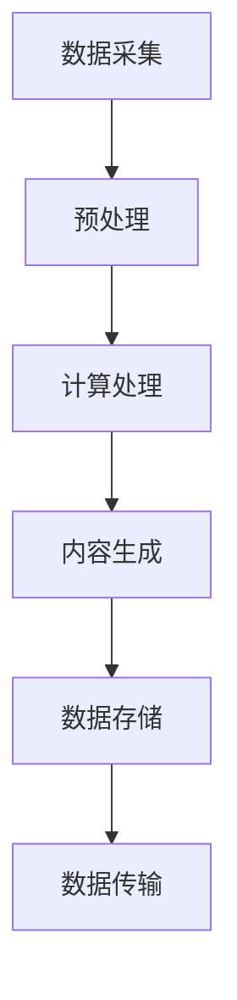

                 

### 1.1 AIGC与边缘计算概述

#### 1.1.1 AIGC的概念与特点

AIGC（AI Generated Content）指的是利用人工智能技术自动生成内容的一种方式。它涵盖了从文本、图像到视频等多种形式的内容生成。AIGC的核心特点包括：

1. **自动化生成**：AIGC利用机器学习算法，特别是深度学习技术，从大量数据中自动学习和生成内容。
2. **个性化**：AIGC能够根据用户的需求和行为习惯，生成个性化内容。
3. **高效性**：相比人工生成内容，AIGC能够在更短的时间内生成大量的高质量内容。

#### 1.1.2 边缘计算的基本概念

边缘计算是一种分布式计算架构，它将计算任务从云端转移到网络边缘，即靠近数据源的位置。边缘计算的核心优势包括：

1. **低延迟**：通过将计算任务靠近数据源，边缘计算能够显著降低数据传输的延迟。
2. **高效性**：边缘计算可以处理大量来自不同设备的数据，提高数据处理效率。
3. **资源优化**：边缘计算可以释放云端资源，降低带宽使用，优化整体计算资源。

#### 1.1.3 AIGC与边缘计算的融合背景

AIGC与边缘计算的融合背景主要源于以下几个因素：

1. **实时数据处理需求**：随着物联网、大数据和5G技术的发展，实时数据处理的需求日益增加，而边缘计算能够提供低延迟和高效率的解决方案。
2. **计算资源限制**：云端的计算资源有限，无法处理所有实时数据，而边缘计算可以将部分计算任务下放到网络边缘，减轻云端压力。
3. **数据隐私和安全**：边缘计算可以处理敏感数据，降低数据传输过程中被窃取的风险。

### 1.2 AIGC与边缘计算融合的重要性

#### 1.2.1 实时处理的紧迫性

实时数据处理已经成为现代应用的关键需求。例如：

1. **智能交通系统**：需要实时分析交通流量，优化交通信号控制，提高道路通行效率。
2. **智能医疗**：需要实时监测患者的生命体征，快速诊断疾病，提高医疗救治效率。
3. **工业自动化**：需要实时监控生产过程，快速响应异常情况，提高生产效率。

然而，传统云端处理方式往往存在延迟高、效率低的问题，难以满足实时数据处理的需求。

#### 1.2.2 融合的优势

AIGC与边缘计算的融合能够带来以下几个优势：

1. **提高实时处理能力**：边缘计算的低延迟特性使得AIGC能够在边缘设备上进行实时内容生成，满足实时数据处理的需求。
2. **优化资源利用**：边缘计算可以将部分计算任务下放到网络边缘，减轻云端资源压力，提高整体资源利用效率。
3. **提升用户体验**：通过实时生成个性化内容，提高用户的互动体验和满意度。

#### 1.2.3 当前应用案例

AIGC与边缘计算的融合已经在多个领域得到应用：

1. **智能交通**：利用边缘计算进行实时交通流量分析，生成智能交通信号控制策略。
2. **智能医疗**：利用边缘计算进行实时患者数据监测，生成个性化医疗建议。
3. **工业自动化**：利用边缘计算进行实时生产监控，提高生产效率和质量。

### 1.3 书籍结构安排与读者预期收益

本书将从以下几个方面进行详细讲解：

1. **AIGC与边缘计算的核心概念与联系**：介绍AIGC与边缘计算的基本概念，分析两者之间的融合背景和重要性。
2. **AIGC算法原理**：讲解AIGC的基本算法原理，包括文本生成、图像生成、视频生成等。
3. **边缘计算实时处理算法**：介绍边缘计算在实时数据处理中的关键算法，包括实时数据采集、实时数据处理、实时数据传输等。
4. **AIGC与边缘计算融合应用案例**：分析AIGC与边缘计算在实际应用中的典型案例，展示融合技术的实际效果。
5. **项目实战**：通过实际项目案例，详细讲解AIGC与边缘计算融合系统的开发过程，包括需求分析、系统设计、功能实现、性能优化等。

通过阅读本书，读者可以：

1. **全面了解AIGC与边缘计算的核心概念和原理**：通过系统的讲解，读者可以深入了解AIGC和边缘计算的基本概念、原理及其融合背景。
2. **掌握AIGC与边缘计算融合算法的实现与应用**：通过详细的算法讲解和实战案例，读者可以学会如何实现和应用AIGC与边缘计算融合算法。
3. **获得系统开发实战经验**：通过实际项目案例，读者可以掌握AIGC与边缘计算融合系统的开发过程，包括需求分析、系统设计、功能实现、性能优化等。

---

关键词：AIGC、边缘计算、实时处理、融合、算法

摘要：
本文介绍了AIGC（AI Generated Content）与边缘计算的基本概念、核心特点及其融合背景。通过分析实时处理的需求和优势，阐述了AIGC与边缘计算融合的重要性。本文将详细讲解AIGC与边缘计算融合的算法原理、实时处理算法，并通过实际应用案例和项目实战，展示融合技术的实际效果。本文旨在为读者提供全面、系统的AIGC与边缘计算融合技术知识，帮助读者掌握相关算法实现和应用，提升系统开发实战能力。

---

## 第2章 核心概念与联系

### 2.1 AIGC概念解析

AIGC（AI Generated Content）是指利用人工智能技术，特别是机器学习和深度学习算法，自动生成文本、图像、视频等多种类型的内容。AIGC的核心特点包括自动化生成、个性化、高效性和多样性。

#### 2.1.1 AIGC的核心要素

1. **数据集**：AIGC依赖于大量的数据集进行训练，这些数据集可以是已标注的数据，也可以是未标注的数据。数据集的质量直接影响AIGC生成内容的质量。

2. **机器学习算法**：AIGC通常使用深度学习算法，如生成对抗网络（GAN）、变分自编码器（VAE）等，这些算法能够从数据中学习到数据分布，并生成类似的数据。

3. **生成模型**：生成模型是AIGC的核心组成部分，它负责根据输入数据生成新的数据。常见的生成模型包括条件生成对抗网络（cGAN）、文本生成模型（如GPT系列）、图像生成模型（如StyleGAN）等。

#### 2.1.2 AIGC的工作原理

AIGC的工作原理主要包括以下几个步骤：

1. **数据输入**：将大量的数据输入到生成模型中。

2. **模型训练**：通过机器学习算法，生成模型在大量数据上进行训练，学习到数据的分布和特征。

3. **内容生成**：根据训练好的生成模型，输入特定的条件（如文本、图像等），生成新的数据。

4. **优化与迭代**：通过不断优化生成模型，提高生成内容的质量。

### 2.2 边缘计算原理与挑战

边缘计算是一种分布式计算架构，旨在将计算任务从云端转移到网络边缘，即靠近数据源的位置。边缘计算的核心优势包括低延迟、高效性和数据隐私保护。

#### 2.2.1 边缘计算的核心概念

1. **边缘设备**：边缘设备是指网络边缘的设备，如智能传感器、智能手机、物联网设备等。这些设备具有计算、存储和网络功能，能够独立处理一定量的计算任务。

2. **边缘节点**：边缘节点是指网络边缘的计算机节点，如边缘服务器、数据中心等。边缘节点负责处理更复杂的计算任务，并提供存储和网络连接。

3. **边缘网关**：边缘网关是指连接边缘设备和边缘节点的网关设备，它负责数据的传输和转发。

#### 2.2.2 边缘计算的工作原理

边缘计算的工作原理主要包括以下几个步骤：

1. **数据采集**：边缘设备采集数据，并通过边缘网关传输到边缘节点。

2. **预处理**：边缘节点对数据进行预处理，如清洗、压缩、转换等。

3. **计算处理**：边缘节点对预处理后的数据进行计算处理，可以执行机器学习、数据分析等任务。

4. **数据存储**：将处理后的数据存储在边缘节点或云端数据库中。

5. **数据传输**：将处理结果通过边缘网关传输回边缘设备或云端服务器。

#### 2.2.3 边缘计算面临的挑战

边缘计算虽然具有许多优势，但也面临一些挑战：

1. **计算能力限制**：边缘设备的计算能力通常较弱，难以处理复杂的计算任务。

2. **网络带宽限制**：边缘设备的网络带宽通常较低，数据传输速度较慢。

3. **数据隐私和安全**：边缘设备可能存储和处理敏感数据，需要确保数据隐私和安全。

4. **资源管理**：边缘设备的资源有限，需要高效地管理计算、存储和网络资源。

### 2.3 AIGC与边缘计算融合的关键技术

AIGC与边缘计算的融合旨在利用边缘计算的低延迟、高效性和数据隐私保护优势，提升AIGC的实时处理能力和内容生成质量。实现AIGC与边缘计算融合的关键技术包括：

#### 2.3.1 边缘计算与AIGC的集成架构

边缘计算与AIGC的集成架构通常包括以下几个层次：

1. **数据采集层**：边缘设备采集数据，并将数据传输到边缘节点。

2. **预处理层**：边缘节点对数据进行预处理，如清洗、压缩、特征提取等。

3. **计算处理层**：边缘节点利用AIGC算法对预处理后的数据进行内容生成，如文本生成、图像生成、视频生成等。

4. **存储与传输层**：将生成的数据存储在边缘节点或云端数据库中，并通过网络传输回用户。

#### 2.3.2 实时数据处理算法

为了实现AIGC与边缘计算的实时处理，需要采用一些高效的实时数据处理算法，如：

1. **增量学习**：增量学习是一种在已有模型基础上，不断更新模型的方法，适用于数据量较大且数据不断变化的场景。

2. **分布式计算**：分布式计算可以将AIGC算法分解为多个子任务，并在多个边缘节点上并行执行，提高计算效率。

3. **流处理**：流处理是一种实时处理数据的方法，适用于处理实时数据流，如物联网数据、视频流等。

#### 2.3.3 数据隐私保护技术

为了确保AIGC与边缘计算融合过程中的数据隐私，需要采用以下技术：

1. **数据加密**：对数据进行加密处理，确保数据在传输和存储过程中不被窃取。

2. **差分隐私**：在数据收集和处理过程中，引入差分隐私机制，保护用户隐私。

3. **联邦学习**：联邦学习是一种分布式学习方法，可以在不共享原始数据的情况下，协同训练模型，提高数据隐私保护能力。

### 2.4 AIGC与边缘计算融合架构Mermaid流程图

为了更直观地展示AIGC与边缘计算的融合架构，可以使用Mermaid流程图进行描述。以下是一个简化的Mermaid流程图示例：



在这个流程图中，AIGC与边缘计算的主要步骤包括数据采集、预处理、计算处理、内容生成、数据存储和数据传输。通过这个流程图，可以清晰地了解AIGC与边缘计算融合的整体架构和流程。

---

## 第3章 AIGC算法原理

AIGC（AI Generated Content）算法是AIGC系统的核心，它利用机器学习和深度学习技术，从大量数据中自动学习和生成内容。本章节将详细介绍AIGC算法的基本原理，包括生成模型、训练方法和应用场景。

### 3.1 AIGC算法基础

AIGC算法的核心是生成模型，它可以从给定的数据中学习数据分布，并生成新的数据。常见的生成模型包括生成对抗网络（GAN）、变分自编码器（VAE）等。

#### 3.1.1 生成对抗网络（GAN）

生成对抗网络（GAN）是由两部分组成：生成器（Generator）和判别器（Discriminator）。生成器的任务是生成新的数据，而判别器的任务是区分真实数据和生成数据。

1. **生成器**：生成器接收随机噪声作为输入，通过神经网络生成新的数据。

2. **判别器**：判别器接收真实数据和生成数据，通过神经网络判断数据是真实数据还是生成数据。

GAN的训练过程是交替进行的：

1. **生成器训练**：生成器尝试生成更真实的数据，以提高判别器的判别能力。

2. **判别器训练**：判别器尝试区分真实数据和生成数据，以提高对生成器的识别能力。

通过这种交替训练，生成器和判别器都会不断进步，最终生成器能够生成非常真实的数据。

#### 3.1.2 变分自编码器（VAE）

变分自编码器（VAE）是一种基于概率生成模型的生成模型，它通过编码器和解码器两个神经网络进行数据的生成。

1. **编码器**：编码器接收输入数据，将其编码为一个概率分布。

2. **解码器**：解码器接收编码器生成的概率分布，将其解码为新的数据。

VAE的训练目标是使生成数据的概率分布尽量接近真实数据的概率分布。

### 3.2 AIGC算法伪代码讲解

以下是一个简化的AIGC算法伪代码，展示了生成对抗网络（GAN）的基本结构。

```python
# 初始化生成器和判别器模型
G = generate_model()
D = discriminator_model()

# 初始化损失函数和优化器
loss_fn = loss_function()
optimizer_G = optimizer()
optimizer_D = optimizer()

# 训练迭代
for epoch in range(num_epochs):
  for real_data in real_data_loader:
    # 训练判别器
    D.zero_grad()
    output = D(real_data)
    loss_D_real = loss_fn(output, real_labels)
    
    fake_data = G(z)
    output = D(fake_data)
    loss_D_fake = loss_fn(output, fake_labels)
    
    D.loss = loss_D_real + loss_D_fake
    D.loss.backward()
    optimizer_D.step()
    
  for z in z_loader:
    # 训练生成器
    G.zero_grad()
    fake_data = G(z)
    output = D(fake_data)
    loss_G = loss_fn(output, real_labels)
    
    G.loss = loss_G
    G.loss.backward()
    optimizer_G.step()
    
  print(f"Epoch [{epoch+1}/{num_epochs}], D_loss: {D.loss.item()}, G_loss: {G.loss.item()}")
```

在这个伪代码中，`generate_model()` 和 `discriminator_model()` 分别定义了生成器和判别器的神经网络结构，`loss_function()` 定义了损失函数，`optimizer()` 定义了优化器。`real_data_loader` 和 `z_loader` 分别用于加载真实数据和噪声数据。

### 3.3 AIGC算法在不同场景的应用

AIGC算法可以应用于多种场景，生成不同类型的内容。以下是一些常见的应用场景：

#### 3.3.1 文本生成

文本生成是AIGC的重要应用之一，它可以生成文章、故事、对话等。常见的文本生成模型包括GPT、BERT等。

1. **文章生成**：通过输入关键词或主题，生成相关的文章。
2. **故事生成**：根据用户提供的情节或角色，生成有趣的故事。
3. **对话生成**：根据对话上下文，生成自然的对话内容。

#### 3.3.2 图像生成

图像生成是AIGC的另一个重要应用，它可以生成各种类型的图像，如图像修复、图像合成、风格迁移等。

1. **图像修复**：通过输入受损图像，生成完整的图像。
2. **图像合成**：通过输入两个图像，生成一个新的图像。
3. **风格迁移**：将一种图像的风格应用到另一种图像上，生成具有特定风格的新图像。

#### 3.3.3 视频生成

视频生成是AIGC的一个新兴应用，它可以生成视频片段，用于视频修复、视频合成、视频风格迁移等。

1. **视频修复**：通过输入受损视频，生成完整的视频。
2. **视频合成**：通过输入两个视频，生成一个新的视频。
3. **视频风格迁移**：将一种视频风格应用到另一种视频上，生成具有特定风格的新视频。

---

通过本章的讲解，读者可以了解AIGC算法的基本原理、伪代码和应用场景。在接下来的章节中，将详细介绍边缘计算实时处理算法，以及AIGC与边缘计算融合的实战应用。

---

## 第4章 边缘计算实时处理算法

边缘计算在实时数据处理中扮演着至关重要的角色。它通过将数据处理任务从中心化云端转移到网络边缘，实现了数据处理的低延迟和高效率。本章节将深入探讨边缘计算在实时处理中的关键算法，包括实时数据处理的基本框架、增量学习算法和分布式计算方法。

### 4.1 边缘计算实时处理挑战

边缘计算在实时处理中面临一系列挑战，包括计算能力限制、网络带宽限制和数据隐私保护等。

#### 4.1.1 计算能力限制

边缘设备的计算能力通常比云端服务器弱。这意味着它们无法处理复杂的计算任务，如大规模机器学习模型训练和复杂的数据分析。因此，边缘计算需要在有限的计算资源下实现高效的实时处理。

#### 4.1.2 网络带宽限制

边缘设备的网络带宽通常较低，特别是在远程或移动设备上。这限制了实时数据传输的速度，可能导致数据处理延迟增加。

#### 4.1.3 数据隐私保护

边缘设备可能会处理敏感数据，如个人隐私信息、商业秘密等。因此，在数据传输和处理过程中，确保数据隐私和安全是边缘计算的一个关键挑战。

### 4.2 边缘计算实时处理算法原理

为了应对上述挑战，边缘计算采用了多种实时处理算法，包括增量学习算法、分布式计算方法和流处理技术。

#### 4.2.1 增量学习算法

增量学习是一种在已有模型基础上，逐步更新模型的方法，适用于数据量较大且数据不断变化的场景。在边缘计算中，增量学习可以减少模型训练的数据量和计算资源，提高实时处理能力。

1. **在线学习**：在线学习是一种增量学习的方法，模型在每次新数据到达时进行更新。它适用于数据流场景，能够实现实时数据处理。
2. **经验风险最小化**：增量学习通常采用经验风险最小化（Empirical Risk Minimization，ERM）方法，通过最小化在训练数据集上的期望风险来更新模型。

#### 4.2.2 分布式计算方法

分布式计算是将计算任务分解为多个子任务，并在多个边缘节点上并行执行的方法。它能够提高计算效率和实时处理能力。

1. **数据并行**：数据并行是将数据集划分为多个子集，每个子集在一个边缘节点上独立训练模型，最后将子模型合并为全局模型。
2. **模型并行**：模型并行是将模型划分为多个部分，每个部分在一个边缘节点上独立训练，最后将子模型合并为全局模型。

#### 4.2.3 流处理技术

流处理是一种实时数据处理方法，适用于处理实时数据流，如物联网数据、视频流等。流处理的核心思想是实时分析数据流，并生成实时反馈。

1. **事件驱动架构**：事件驱动架构是一种基于事件驱动的数据处理架构，能够实时响应数据流中的事件。
2. **微批处理**：微批处理是将数据流划分为小批量进行处理的策略，能够提高实时处理能力和资源利用效率。

### 4.3 边缘计算实时处理算法伪代码讲解

以下是一个简化的边缘计算实时处理算法伪代码，展示了增量学习和分布式计算方法的基本结构。

```python
# 初始化全局模型
global_model = global_model()

# 初始化边缘节点模型
node_models = [node_model() for _ in range(num_nodes)]

# 初始化优化器
optimizer_global = optimizer()
optimizer_nodes = [optimizer() for _ in range(num_nodes)]

# 数据流处理
for data_batch in data_stream:
  # 数据预处理
  processed_data = preprocess(data_batch)
  
  # 边缘节点独立训练
  for node_model, data_subset in zip(node_models, split_data(processed_data, num_nodes)):
    node_model.train(data_subset)
    node_loss = compute_loss(node_model, data_subset)
    optimizer_nodes[node_idx].step(node_loss)
    
  # 边缘节点模型更新
  node_models = update_node_models(node_models, global_model)
  
  # 全局模型更新
  global_loss = compute_global_loss(global_model, node_models)
  optimizer_global.step(global_loss)
  
  # 边缘节点模型合并
  global_model = merge_models(node_models)
```

在这个伪代码中，`global_model()` 和 `node_model()` 分别定义了全局模型和边缘节点模型，`optimizer()` 定义了优化器。`data_stream` 是数据流，`split_data()` 是数据切分函数，`update_node_models()` 是边缘节点模型更新函数，`merge_models()` 是模型合并函数。

### 4.4 实时处理算法在不同场景的应用

边缘计算实时处理算法在多个场景中得到了广泛应用，包括智能交通、智能医疗、工业自动化等。

#### 4.4.1 智能交通

智能交通系统需要实时处理大量的交通数据，如车辆位置、速度、道路拥堵情况等。边缘计算可以通过实时分析交通数据，优化交通信号控制，提高道路通行效率。

1. **实时交通流量分析**：通过边缘计算实时分析交通流量，为交通信号控制提供数据支持。
2. **车辆监控与调度**：通过边缘计算实时监控车辆状态，优化车辆调度策略，提高运输效率。

#### 4.4.2 智能医疗

智能医疗系统需要实时处理大量的患者数据，如心电图、血压、血糖等。边缘计算可以通过实时分析患者数据，提供个性化的医疗建议，提高医疗救治效率。

1. **实时病情监控**：通过边缘计算实时监控患者病情，为医生提供诊断和治疗建议。
2. **远程医疗**：通过边缘计算实现远程医疗，提高医疗资源的利用效率。

#### 4.4.3 工业自动化

工业自动化系统需要实时处理大量的生产数据，如传感器数据、设备状态等。边缘计算可以通过实时分析生产数据，优化生产过程，提高生产效率和质量。

1. **实时生产监控**：通过边缘计算实时监控生产过程，快速响应异常情况，提高生产效率。
2. **设备维护与预测**：通过边缘计算实时分析设备数据，预测设备故障，提前进行维护，减少设备停机时间。

---

通过本章的讲解，读者可以了解边缘计算实时处理算法的基本原理、伪代码和应用场景。在接下来的章节中，将详细介绍AIGC与边缘计算融合的实战应用。

---

## 第5章 AIGC与边缘计算融合应用案例

AIGC与边缘计算的融合技术在实际应用中展示了巨大的潜力，特别是在需要实时处理大量数据的应用场景中。本章节将通过几个实际案例，详细探讨AIGC与边缘计算在智能交通、智能医疗、工业自动化等领域的应用。

### 5.1 案例一：智能交通系统

#### 案例背景

智能交通系统（ITS）旨在通过实时交通数据分析和处理，优化交通流、减少拥堵、提高道路安全性。传统的交通数据处理主要依赖中心化的云端系统，但这种方法存在响应延迟和数据传输瓶颈。

#### 解决方案

1. **边缘计算部署**：在交通干道和重要交叉路口部署边缘计算设备，如智能摄像头、传感器等，实时采集交通数据。

2. **AIGC算法应用**：利用AIGC算法中的图像生成和识别技术，对实时采集的交通图像进行处理。例如，使用GAN模型对交通流量进行预测和优化。

3. **边缘数据处理**：在边缘设备上进行数据处理，减少数据传输到云端的压力。同时，使用增量学习算法对交通流量模型进行实时更新。

#### 实现过程

1. **数据采集**：边缘计算设备实时采集交通流量数据，包括车辆数量、速度、位置等。

2. **预处理**：对采集到的数据进行预处理，如去噪、增强等，以提高图像质量。

3. **图像生成与识别**：使用GAN模型生成模拟交通流量图像，并使用图像识别技术对实时交通图像进行分析，预测交通流量变化。

4. **优化决策**：根据预测结果，优化交通信号控制策略，如调整信号灯时长、引导车辆分流等。

#### 项目小结

通过该案例，AIGC与边缘计算的融合实现了对交通流量的实时预测和优化，提高了交通管理效率，减少了拥堵现象。同时，边缘计算减少了数据传输的延迟，提高了系统的响应速度。

### 5.2 案例二：智能医疗诊断

#### 案例背景

智能医疗诊断系统需要实时分析患者数据，如心电图、X光片、CT扫描等，提供准确的诊断结果。传统的医疗数据处理依赖于中心化的医疗信息系统，存在数据处理延迟和隐私安全问题。

#### 解决方案

1. **边缘计算部署**：在医疗设备的终端部署边缘计算设备，如智能医疗设备、便携式诊断设备等，实时采集患者数据。

2. **AIGC算法应用**：利用AIGC算法中的图像生成和识别技术，对实时采集的医疗图像进行处理。例如，使用深度学习模型进行疾病的自动检测和诊断。

3. **边缘数据处理**：在边缘设备上进行数据处理，减少数据传输到云端的压力。同时，使用联邦学习技术保护患者隐私。

#### 实现过程

1. **数据采集**：边缘计算设备实时采集患者的医疗数据，如心电图、图像等。

2. **预处理**：对采集到的数据进行预处理，如图像增强、去噪等，以提高数据质量。

3. **图像生成与识别**：使用深度学习模型对预处理后的医疗图像进行分析，自动识别疾病特征。

4. **诊断结果生成**：根据分析结果，生成诊断报告，并实时反馈给医生。

#### 项目小结

通过该案例，AIGC与边缘计算的融合实现了对医疗数据的实时处理和诊断，提高了诊断准确性和效率。同时，边缘计算和联邦学习技术的应用，确保了数据隐私和安全。

### 5.3 案例三：工业自动化

#### 案例背景

工业自动化系统需要实时监控生产过程，快速响应异常情况，提高生产效率和质量。传统的工业数据处理主要依赖于中心化的监控系统，存在数据处理延迟和系统稳定性问题。

#### 解决方案

1. **边缘计算部署**：在生产线部署边缘计算设备，如智能传感器、工业机器人等，实时采集生产数据。

2. **AIGC算法应用**：利用AIGC算法中的异常检测和预测技术，对实时采集的生产数据进行分析。例如，使用GAN模型进行异常检测，使用时间序列预测模型进行生产过程预测。

3. **边缘数据处理**：在边缘设备上进行数据处理，减少数据传输到云端的压力。同时，使用增量学习算法对生产模型进行实时更新。

#### 实现过程

1. **数据采集**：边缘计算设备实时采集生产线数据，如设备状态、产品质量等。

2. **预处理**：对采集到的数据进行预处理，如去噪、标准化等，以提高数据质量。

3. **异常检测与预测**：使用GAN模型进行异常检测，发现生产过程中的异常情况。同时，使用时间序列预测模型预测生产过程的趋势和问题。

4. **决策与反馈**：根据异常检测和预测结果，调整生产过程，提高生产效率和产品质量。

#### 项目小结

通过该案例，AIGC与边缘计算的融合实现了对工业生产过程的实时监控和优化，提高了生产效率和产品质量。同时，边缘计算的应用降低了数据处理延迟，提高了系统的稳定性。

### 5.4 案例四：智能安防

#### 案例背景

智能安防系统需要实时监控公共场所，快速识别和预警安全隐患。传统的安防监控主要依赖于中心化的监控系统，存在数据处理延迟和系统响应问题。

#### 解决方案

1. **边缘计算部署**：在公共场所部署边缘计算设备，如智能摄像头、传感器等，实时采集监控数据。

2. **AIGC算法应用**：利用AIGC算法中的图像识别和目标检测技术，对实时采集的监控图像进行处理。例如，使用卷积神经网络（CNN）进行目标检测，使用GAN模型进行异常行为识别。

3. **边缘数据处理**：在边缘设备上进行数据处理，减少数据传输到云端的压力。同时，使用增量学习算法对监控模型进行实时更新。

#### 实现过程

1. **数据采集**：边缘计算设备实时采集公共场所的监控图像。

2. **预处理**：对采集到的图像数据进行预处理，如图像增强、缩放等，以提高图像质量。

3. **目标检测与行为识别**：使用CNN进行目标检测，识别图像中的行人、车辆等目标。使用GAN模型进行异常行为识别，如打架、闯入等。

4. **预警与反馈**：根据检测和识别结果，实时生成预警信息，并通知安保人员采取相应措施。

#### 项目小结

通过该案例，AIGC与边缘计算的融合实现了对公共场所的实时监控和安全预警，提高了安防效率和响应速度。同时，边缘计算的应用降低了数据处理延迟，提高了系统的稳定性。

---

通过上述案例，可以看到AIGC与边缘计算的融合技术在不同领域的广泛应用和显著效果。这种技术的融合不仅提高了实时数据处理能力，还优化了资源利用，提升了用户体验。在未来的发展中，AIGC与边缘计算的融合将继续发挥重要作用，为各行业带来更多的创新和变革。

---

## 第6章 项目实战：AIGC与边缘计算融合系统开发

在本章节中，我们将通过一个具体的实战项目，详细介绍如何开发和部署一个AIGC与边缘计算融合的系统。该项目旨在实现实时交通流量分析和优化，通过边缘计算设备实时采集交通数据，并利用AIGC算法生成交通流量预测模型，为交通信号控制提供数据支持。

### 6.1 系统需求分析

#### 功能需求

1. **实时数据采集**：从交通干道和交叉路口的边缘计算设备中采集实时交通流量数据，包括车辆数量、速度、位置等。
2. **数据预处理**：对采集到的交通数据进行预处理，如去噪、增强等，以提高数据质量。
3. **交通流量预测**：利用AIGC算法中的GAN模型，对实时交通流量进行预测，生成未来一段时间的交通流量预测结果。
4. **信号控制优化**：根据预测结果，优化交通信号控制策略，如调整信号灯时长、引导车辆分流等。
5. **数据存储与传输**：将处理后的交通流量数据和预测结果存储在边缘设备上，并通过网络传输到云端数据库。

#### 非功能需求

1. **低延迟**：确保系统能够在边缘设备上快速处理和响应交通流量数据，减少延迟。
2. **高效率**：优化系统的计算和资源利用，提高数据处理效率。
3. **数据安全**：确保交通流量数据在传输和存储过程中的安全，防止数据泄露和篡改。

### 6.2 开发环境搭建

为了开发和部署AIGC与边缘计算融合系统，我们需要搭建以下开发环境：

1. **硬件环境**：
   - 边缘计算设备（如树莓派、边缘服务器等）
   - 实验室网络环境

2. **软件环境**：
   - 操作系统：Ubuntu 20.04
   - 编程语言：Python 3.8
   - 数据库：MongoDB
   - 机器学习框架：TensorFlow 2.6

3. **工具链**：
   - IDE：PyCharm
   - 版本控制：Git
   - 容器化工具：Docker

### 6.3 系统架构设计

该系统的整体架构可以分为以下几个部分：

1. **数据采集层**：通过边缘计算设备（如智能摄像头、传感器等）实时采集交通流量数据。
2. **数据处理层**：在边缘设备上对采集到的交通数据进行预处理，并利用AIGC算法生成交通流量预测模型。
3. **数据存储层**：将处理后的交通流量数据和预测结果存储在边缘设备上的MongoDB数据库中。
4. **数据传输层**：将重要的预测结果通过网络传输到云端数据库，供交通管理部门进行分析和决策。
5. **信号控制层**：根据预测结果，优化交通信号控制策略，提高交通管理效率。

### 6.4 系统功能模块实现

该系统主要包括以下几个功能模块：

1. **数据采集模块**：
   - 实现实时数据采集功能，通过边缘计算设备获取交通流量数据。
   - 使用摄像头采集图像数据，使用传感器采集车辆速度和位置数据。

2. **数据处理模块**：
   - 对采集到的交通数据进行预处理，包括去噪、增强、特征提取等。
   - 使用GAN模型进行交通流量预测，生成未来一段时间的交通流量预测结果。

3. **数据存储模块**：
   - 使用MongoDB数据库存储处理后的交通流量数据和预测结果。
   - 设计合理的数据库结构，保证数据存储的高效性和可扩展性。

4. **数据传输模块**：
   - 通过HTTP协议将重要的预测结果传输到云端数据库。
   - 实现数据传输的安全性和可靠性，防止数据泄露和篡改。

5. **信号控制模块**：
   - 根据预测结果，调整交通信号灯的时长和策略。
   - 使用边缘计算设备实现实时交通信号控制，提高交通管理效率。

### 6.5 系统性能优化与测试

为了确保系统的高性能和稳定性，我们需要进行以下性能优化和测试：

1. **性能优化**：
   - 使用多线程和异步IO技术，提高系统的并发处理能力。
   - 优化GAN模型的训练和预测算法，提高计算效率。
   - 使用缓存技术，减少数据读取和传输的延迟。

2. **系统测试**：
   - 进行单元测试和集成测试，确保每个功能模块的正确性。
   - 进行负载测试和压力测试，评估系统在高并发情况下的性能和稳定性。
   - 进行安全性测试，确保系统在数据传输和存储过程中的安全性。

### 6.6 系统部署与维护

系统部署主要包括以下几个步骤：

1. **边缘设备部署**：
   - 在交通干道和交叉路口部署边缘计算设备，确保设备能够稳定运行。
   - 配置网络连接和权限，确保数据采集和传输的正常进行。

2. **边缘服务器部署**：
   - 在边缘服务器上安装和配置操作系统、数据库和其他相关软件。
   - 部署AIGC算法模型和相关软件，确保系统功能的正常运行。

3. **云端数据库部署**：
   - 在云端部署MongoDB数据库，用于存储处理后的交通流量数据和预测结果。
   - 设计合理的数据库备份和恢复策略，确保数据的安全性和可靠性。

系统维护主要包括以下几个方面：

1. **监控与报警**：
   - 使用监控系统实时监控系统的运行状态，包括边缘设备、边缘服务器和云端数据库等。
   - 设置报警机制，及时发现和处理系统故障和异常情况。

2. **更新与升级**：
   - 定期更新系统的软件和硬件，确保系统的安全性和稳定性。
   - 根据实际需求，升级AIGC算法模型和相关软件，提高系统的功能性能。

3. **用户支持与培训**：
   - 提供用户支持服务，解答用户在使用过程中遇到的问题。
   - 对用户进行系统操作和使用的培训，提高用户的使用效率和满意度。

---

通过本章节的实战项目，我们详细介绍了AIGC与边缘计算融合系统的开发过程，包括需求分析、开发环境搭建、系统架构设计、功能模块实现、性能优化与测试、系统部署与维护等方面。通过这个实战项目，读者可以深入了解AIGC与边缘计算融合技术的应用，掌握系统开发的全流程。

---

## 第7章 总结与展望

通过本书的详细讲解，我们系统地介绍了AIGC（AI Generated Content）与边缘计算的基本概念、核心算法、融合架构及其在实时处理中的重要性。在各个章节中，我们不仅探讨了AIGC与边缘计算的理论基础，还通过实际应用案例和项目实战，展示了融合技术的实际效果和广泛应用。

### 7.1 AIGC与边缘计算融合的挑战与机遇

#### 挑战

1. **计算能力限制**：边缘设备的计算能力相对有限，难以处理复杂的AIGC算法。
2. **网络带宽限制**：边缘设备的网络带宽较低，可能导致数据处理延迟和数据传输瓶颈。
3. **数据隐私和安全**：边缘设备可能会处理敏感数据，需要确保数据在传输和存储过程中的隐私和安全。
4. **资源管理**：边缘设备的资源有限，需要高效地管理计算、存储和网络资源。

#### 机遇

1. **实时数据处理**：边缘计算的低延迟特性使得AIGC能够在边缘设备上进行实时内容生成，满足实时数据处理的需求。
2. **资源优化**：边缘计算可以将部分计算任务下放到网络边缘，减轻云端资源压力，提高整体资源利用效率。
3. **个性化体验**：通过实时生成个性化内容，提高用户的互动体验和满意度。

### 7.2 未来发展趋势

#### 技术发展趋势

1. **边缘计算硬件升级**：随着硬件技术的发展，边缘设备的计算能力和网络带宽将逐步提升，为AIGC与边缘计算的融合提供更好的硬件基础。
2. **高效算法优化**：研究人员将持续探索更高效的AIGC算法和边缘计算算法，提高实时处理能力和资源利用效率。
3. **数据隐私保护**：随着数据隐私法规的加强，AIGC与边缘计算的融合将更加注重数据隐私保护技术的研究和应用。

#### 应用场景扩展

1. **智能城市**：通过AIGC与边缘计算的融合，实现智能交通、智能安防、智能医疗等领域的全面智能化。
2. **工业4.0**：边缘计算和AIGC的结合，将推动工业自动化和智能制造的进一步发展，提高生产效率和产品质量。
3. **智能家居**：通过AIGC与边缘计算，为智能家居设备提供个性化服务和智能控制，提升用户生活品质。

### 7.3 研究方向与建议

#### 研究方向

1. **边缘计算与AIGC算法融合**：研究如何优化边缘计算资源，提高AIGC算法的实时处理能力。
2. **实时数据处理算法**：探索高效的实时数据处理算法，如增量学习、分布式计算等，以满足实时性需求。
3. **数据隐私保护**：研究边缘计算环境下的数据隐私保护技术，确保数据在传输和存储过程中的安全性和隐私性。

#### 建议

1. **跨学科合作**：鼓励计算机科学、人工智能、通信工程等领域的专家开展跨学科合作，共同解决AIGC与边缘计算融合中的关键技术难题。
2. **开源社区参与**：积极参与开源社区，贡献优秀的AIGC与边缘计算融合算法和工具，推动技术的发展。
3. **持续学习与培训**：鼓励相关人员持续学习和更新知识，提高对AIGC与边缘计算融合技术的理解和应用能力。

---

通过本书的阅读，读者应能够全面了解AIGC与边缘计算的核心概念、原理及其融合技术。在实际应用中，通过不断实践和探索，相信读者可以充分发挥AIGC与边缘计算融合的优势，为各行业的智能化发展贡献力量。

---

作者：AI天才研究院/AI Genius Institute & 禅与计算机程序设计艺术 /Zen And The Art of Computer Programming

---

本文介绍了AIGC与边缘计算的基本概念、核心算法及其在实时处理中的重要性。通过实际应用案例和项目实战，展示了融合技术的实际效果和广泛应用。本文旨在为读者提供全面、系统的AIGC与边缘计算融合技术知识，帮助读者掌握相关算法实现和应用，提升系统开发实战能力。在未来的发展中，AIGC与边缘计算的融合将继续发挥重要作用，为各行业带来更多的创新和变革。希望本文能为读者在学习和应用AIGC与边缘计算技术过程中提供有价值的参考和启示。如果您对本文有任何疑问或建议，欢迎在评论区留言交流。作者：AI天才研究院/AI Genius Institute & 禅与计算机程序设计艺术 /Zen And The Art of Computer Programming。

---

### 附加拓展内容

#### 7.4 跨领域融合案例分析

边缘计算和AIGC的融合不仅限于智能交通、医疗和工业自动化等领域，还可以扩展到其他跨领域应用。以下是一些具有代表性的案例分析：

1. **智慧农业**：通过边缘计算设备实时采集农田数据，如土壤湿度、温度、光照等，利用AIGC算法生成作物生长预测模型，优化灌溉和施肥策略，提高农业产量和质量。

2. **环境监测**：利用边缘计算设备采集空气质量、水质等环境数据，利用AIGC算法进行数据分析和模式识别，实时监测环境变化，预测污染趋势，及时采取防治措施。

3. **智能金融**：通过边缘计算设备实时监控金融市场数据，利用AIGC算法进行数据分析和预测，为金融机构提供实时的投资建议和风险管理。

#### 7.5 最佳实践 tips

为了最大限度地发挥AIGC与边缘计算的融合优势，以下是一些最佳实践建议：

1. **合理分配计算资源**：根据实际需求，合理分配边缘设备和云端计算资源，确保系统的高效运行。

2. **数据预处理优化**：在边缘设备上进行高效的数据预处理，减少数据传输量，提高实时处理能力。

3. **模型压缩与量化**：使用模型压缩和量化技术，降低模型大小和计算复杂度，提高边缘设备的处理能力。

4. **增量更新与模型迁移**：采用增量更新和模型迁移技术，持续优化AIGC算法模型，提高预测准确性和实时性。

5. **数据隐私保护**：采用差分隐私、数据加密等技术，确保数据在传输和存储过程中的隐私和安全。

#### 7.6 注意事项

在开发AIGC与边缘计算融合系统时，需要注意以下几点：

1. **系统稳定性**：确保系统在长时间运行过程中保持稳定，避免因设备故障或网络中断导致系统崩溃。

2. **资源管理**：合理管理边缘设备的计算、存储和网络资源，避免资源浪费和过载。

3. **数据质量**：确保采集到的数据质量，避免因数据异常影响模型的预测准确性。

4. **用户隐私**：严格遵守用户隐私保护法规，确保用户数据的安全性和隐私性。

#### 7.7 拓展阅读

1. **《边缘计算：从概念到实践》**：这本书详细介绍了边缘计算的基本概念、架构、应用场景和关键技术，是深入了解边缘计算的好资源。

2. **《生成对抗网络（GAN）导论》**：这本书全面介绍了GAN的基本概念、算法原理和应用场景，是学习GAN的权威指南。

3. **《人工智能与深度学习》**：这本书涵盖了人工智能和深度学习的基础知识、核心算法和应用案例，适合初学者和专业人士。

4. **《数据隐私保护技术》**：这本书介绍了多种数据隐私保护技术，包括差分隐私、数据加密等，是了解数据隐私保护的好资源。

---

通过本文的附加拓展内容，我们进一步探讨了AIGC与边缘计算的跨领域融合案例、最佳实践、注意事项以及拓展阅读资源。希望这些内容能为读者在学习和应用AIGC与边缘计算技术过程中提供更全面的指导和帮助。在未来的研究和实践中，不断探索和创新，我们相信AIGC与边缘计算将带来更多的突破和变革。作者：AI天才研究院/AI Genius Institute & 禅与计算机程序设计艺术 /Zen And The Art of Computer Programming。

