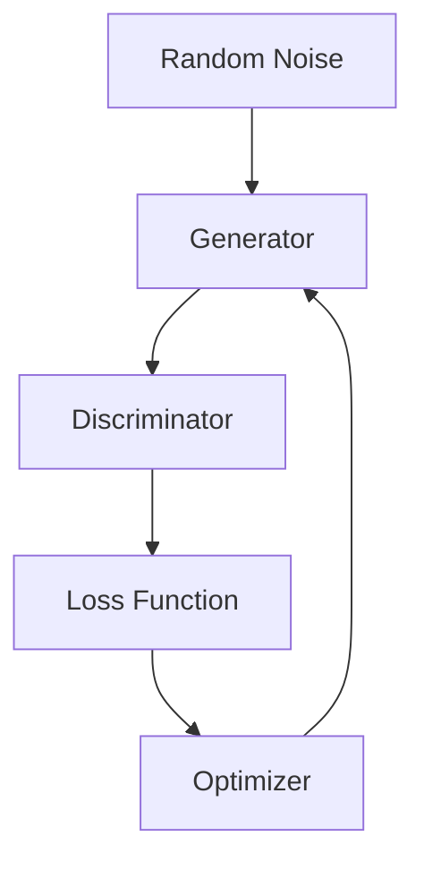
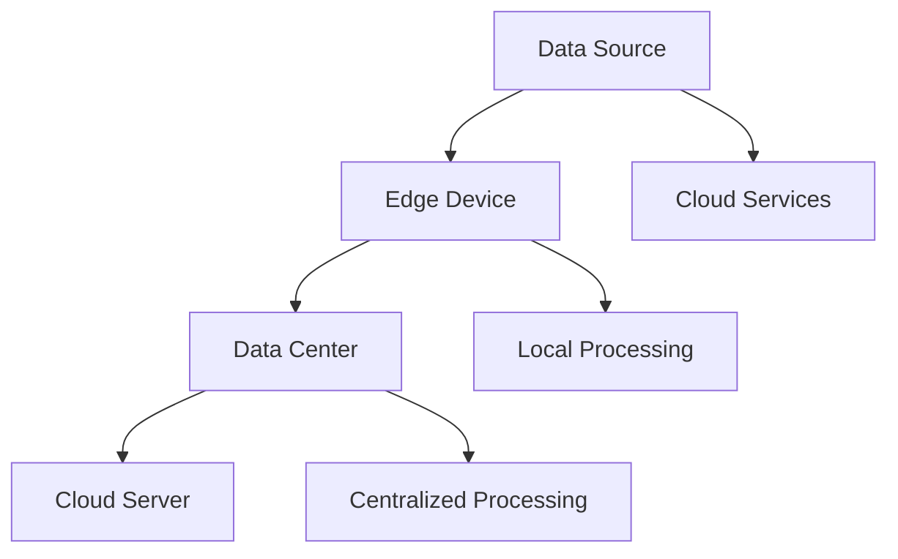

                 

### 1. Introduction to AIGC and Edge Computing

**AIGC (AI-Guided Content Generation)** is a cutting-edge field in the realm of artificial intelligence, which leverages advanced machine learning techniques to autonomously create content. From writing software code to generating high-quality images and music, AIGC has demonstrated a remarkable ability to produce complex outputs that were once thought to be solely within the realm of human creativity.

**Edge Computing** is a paradigm designed to bring computational power closer to the data source, reducing the latency associated with transferring data to centralized servers. This approach is particularly significant in the context of the Internet of Things (IoT), where devices generate massive amounts of data that need to be processed quickly and efficiently.

#### Definition and Overview of AIGC

AIGC is built upon the foundations of Generative Adversarial Networks (GANs), Reinforcement Learning, and Transfer Learning. At its core, AIGC involves two neural networks—generator and discriminator—engaging in a adversarial game. The generator creates new data, while the discriminator evaluates whether the data is real or generated. Over time, the generator refines its output to fool the discriminator, resulting in highly realistic and creative content.

#### Definition and Overview of Edge Computing

Edge Computing is fundamentally about distributing computational tasks across a network of edge devices, such as routers, gateways, and IoT devices. This distributed approach allows for real-time data processing, which is crucial for applications that require immediate responses, such as autonomous vehicles and industrial automation.

#### The Importance of AIGC and Edge Computing in Smart Home Integration

The integration of AIGC and Edge Computing in smart homes offers numerous benefits. For one, AIGC can enable personalized content creation, such as custom-tailored music playlists or personalized home automation scripts. Edge Computing, on the other hand, ensures that data processing is handled locally, reducing the need for constant cloud connectivity and enhancing privacy and security.

### 1.1 Definition and Overview of AIGC

At a fundamental level, AIGC involves the use of machine learning algorithms to generate content based on patterns and data inputs. One of the most prominent models within AIGC is the Generative Adversarial Network (GAN). GANs consist of two neural networks: the generator and the discriminator. The generator produces data samples, while the discriminator evaluates these samples to determine whether they are real or fake. The process continues iteratively, with the generator improving its output to escape detection by the discriminator.

#### Core Components of AIGC

1. **Generator**: The generator is responsible for creating new data samples. It takes random noise as input and transforms it into data that closely resembles the real data distribution.
2. **Discriminator**: The discriminator aims to distinguish between real data samples and generated data samples. It receives both types of samples and outputs a probability indicating the likelihood that the sample is real.
3. **Loss Function**: The primary objective of the GAN is to minimize the difference between the generated data and the real data. This is achieved through a loss function that combines the discriminator's errors in classifying real and generated samples.
4. **Optimizer**: The optimizer adjusts the weights of the generator and discriminator networks to minimize the loss function. Common optimization algorithms include gradient descent and its variants.

#### Mermaid Diagram Illustrating AIGC Components

### 1.2 Definition and Overview of Edge Computing

Edge Computing refers to the concept of processing data at or near the source of data generation, rather than sending it to a centralized data center or cloud server. This decentralized approach enables real-time data processing and analysis, which is critical for applications that require immediate responses.

#### Core Principles of Edge Computing

1. **Decentralization**: Edge Computing distributes computational tasks across multiple edge devices, reducing the load on centralized servers.
2. **Real-Time Processing**: Edge devices process data locally, enabling faster response times and reduced latency.
3. **Scalability**: Edge Computing can scale horizontally by adding more edge devices to the network.
4. **Reliability**: By processing data closer to the source, Edge Computing enhances system reliability, especially in scenarios where network connectivity is unreliable.

#### Mermaid Diagram Illustrating Edge Computing Architecture

### 1.3 The Importance of AIGC and Edge Computing in Smart Home Integration

The integration of AIGC and Edge Computing in smart homes brings several key advantages:

1. **Personalization**: AIGC can generate personalized content tailored to individual preferences and needs, enhancing user experience.
2. **Privacy**: Edge Computing processes data locally, reducing the need to transmit sensitive information to the cloud, thereby enhancing privacy.
3. **Efficiency**: By leveraging local processing power, smart home devices can operate more efficiently, reducing energy consumption and improving response times.
4. **Reliability**: Edge Computing ensures that even if there are connectivity issues with the cloud, smart home devices can still operate autonomously, improving reliability.
5. **Scalability**: The distributed nature of Edge Computing allows for easy scalability as more devices and sensors are added to the smart home ecosystem.

### Keywords: AI-Guided Content Generation, Edge Computing, Smart Homes, Generative Adversarial Networks, Real-Time Data Processing

### Summary: This article provides an introduction to AI-Guided Content Generation and Edge Computing, exploring their definitions, core components, and the importance of their integration in smart homes. It sets the stage for further discussion on the application of these technologies in smart home environments.

