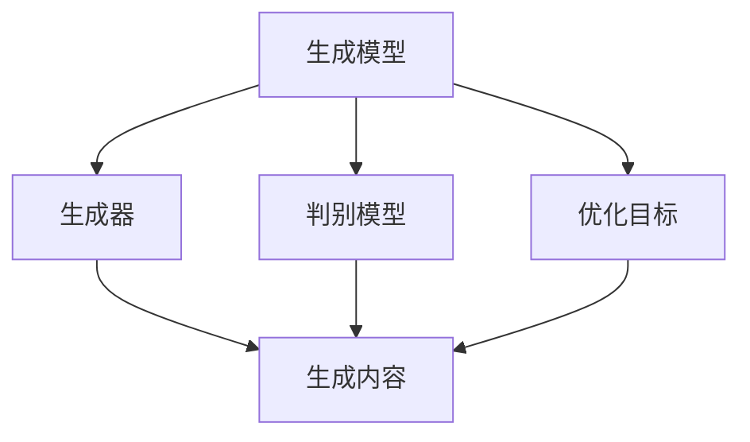

                 

### 引言

在当今数字化时代，人工智能（AI）和边缘计算（Edge Computing）已成为推动技术创新和产业升级的关键力量。随着5G、物联网（IoT）和大数据技术的发展，人们对于实时数据处理和智能响应的需求日益增长。AIGC（人工智能生成内容）作为人工智能领域的一个新兴方向，通过AI技术自动生成丰富多样的内容，极大地拓展了AI的应用场景。边缘计算则通过在靠近数据源的地方进行处理，实现了低延迟、高可靠性的数据服务。本文旨在探讨AIGC与边缘计算的融合应用，以期为相关领域的研究者提供有价值的参考。

本文结构如下：

- **第二部分 AIGC与边缘计算的基础知识**：首先介绍AIGC和边缘计算的基本概念、技术特点及其发展历程。
- **第三部分 AIGC与边缘计算的融合原理**：分析AIGC与边缘计算融合的架构设计、技术原理及优势。
- **第四部分 融合应用案例分析**：通过具体案例，展示AIGC与边缘计算的融合应用。
- **第五部分 技术实现与优化**：详细讲解AIGC与边缘计算的实现技术及其优化策略。
- **第六部分 未来发展趋势与挑战**：探讨AIGC与边缘计算融合的未来发展趋势及面临的挑战。
- **第七部分 结论与展望**：总结本文的主要发现，并展望未来的研究方向。

通过上述结构的布局，本文希望系统地阐述AIGC与边缘计算的融合应用，为实际项目提供理论指导和技术支持。

## 关键词

- 人工智能生成内容（AIGC）
- 边缘计算
- 融合应用
- 实时数据处理
- 低延迟智能响应

### 摘要

本文首先介绍了AIGC和边缘计算的基本概念、技术特点和融合优势，并通过具体案例展示了AIGC与边缘计算在智能视频监控、智能物联网和智能医疗等领域的融合应用。接着，详细讲解了AIGC与边缘计算的技术实现与优化策略，包括算法实现、边缘计算优化和融合技术优化。最后，分析了AIGC与边缘计算融合的未来发展趋势和面临的挑战，提出了未来的研究方向。

## 背景介绍

### 人工智能生成内容（AIGC）

人工智能生成内容（Artificial Intelligence Generated Content，简称AIGC）是指利用人工智能技术自动生成各种类型的内容，如文本、图像、音频和视频等。AIGC的概念起源于自然语言处理（NLP）和计算机视觉（CV）领域，近年来随着深度学习技术的发展，AIGC技术取得了显著的进步。

AIGC的主要特点包括：

1. **自动化**：通过机器学习模型，AIGC能够自动生成大量内容，减少了人工创作的负担。
2. **多样性**：AIGC能够生成丰富多样的内容，满足不同用户的需求。
3. **实时性**：利用边缘计算，AIGC能够在靠近数据源的地方实时处理和生成内容，降低延迟。

AIGC的应用场景非常广泛，包括但不限于：

- **媒体内容生成**：如自动生成新闻报道、电影剧本、音乐和艺术作品等。
- **教育培训**：如自动生成教学视频、个性化学习内容等。
- **娱乐互动**：如虚拟助手、游戏角色等。

### 边缘计算

边缘计算（Edge Computing）是指将计算、存储和网络功能分布式地部署在靠近数据源的设备上，如传感器、路由器和边缘服务器等。与传统的云计算不同，边缘计算通过在靠近数据源的地方进行处理，可以实现低延迟、高可靠性的数据服务。

边缘计算的主要特点包括：

1. **低延迟**：通过在靠近数据源的地方进行处理，边缘计算可以显著降低数据传输的延迟。
2. **高可靠性**：边缘计算可以增强系统的可靠性和稳定性，特别是在网络不稳定或带宽受限的情况下。
3. **资源高效**：边缘计算可以有效地利用本地资源，降低对中心服务器的依赖。

边缘计算的应用场景包括：

- **智能物联网**：如智能家居、智能交通和智能工厂等。
- **实时数据处理**：如工业自动化、智能医疗和智能安防等。
- **边缘服务**：如在线游戏、增强现实（AR）和虚拟现实（VR）等。

### AIGC与边缘计算的关系

AIGC与边缘计算的融合应用具有巨大的潜力，两者相辅相成，共同推动技术创新和产业发展。具体而言：

- **数据驱动**：边缘计算可以为AIGC提供丰富的实时数据，使得AIGC能够更好地理解和生成符合用户需求的内容。
- **实时响应**：通过边缘计算，AIGC可以在靠近数据源的地方进行实时处理和生成内容，满足低延迟、高可靠性的需求。
- **资源优化**：边缘计算可以分担中心服务器的负担，优化资源利用，提高系统效率。

综上所述，AIGC与边缘计算的融合应用不仅能够拓展AI的应用场景，提高数据处理效率，还能够为各种实时应用提供强大的技术支持。

### AIGC的基本概念

人工智能生成内容（AIGC）是一种利用人工智能技术自动生成各种类型内容的方法，涵盖文本、图像、音频和视频等多种形式。AIGC的核心在于利用机器学习模型，尤其是深度学习技术，从大规模数据集中学习并生成新的内容。

#### AIGC的技术分类

AIGC的技术分类可以根据生成内容的形式和生成方法的不同进行划分，主要包括以下几类：

1. **文本生成**：文本生成是AIGC领域最为成熟的一部分，通过自然语言处理（NLP）和生成对抗网络（GAN）等技术，可以生成各种类型的文本，如新闻报道、小说、诗歌等。典型的文本生成模型包括GPT（Generative Pre-trained Transformer）系列和BERT（Bidirectional Encoder Representations from Transformers）等。

2. **图像生成**：图像生成利用生成对抗网络（GAN）和变分自编码器（VAE）等技术，可以生成逼真的图像和视频。GAN由生成器和判别器组成，生成器负责生成图像，判别器负责判断生成图像的真伪。通过不断优化，生成器能够生成越来越真实的图像。

3. **音频生成**：音频生成包括语音合成和音乐生成。语音合成利用深度神经网络生成自然流畅的语音，常见的模型有WaveNet和Tacotron。音乐生成则通过生成模型，如循环神经网络（RNN）和长短期记忆网络（LSTM），生成多样化的音乐旋律和和声。

4. **视频生成**：视频生成结合了图像生成和视频处理技术，通过生成图像序列并使用视频合成技术，生成新的视频内容。典型的视频生成方法包括视频生成对抗网络（V-DGAN）和视频变分自编码器（V-VAE）等。

#### AIGC的发展历程

AIGC的发展历程可以分为以下几个阶段：

1. **初步探索阶段（2010年以前）**：在这一阶段，研究者开始探索如何利用人工智能技术生成内容，主要采用规则驱动的方法和简单的机器学习方法。

2. **快速进展阶段（2010-2015年）**：随着深度学习技术的兴起，AIGC取得了显著进展。生成对抗网络（GAN）的提出标志着AIGC进入了一个新的发展阶段，通过生成器和判别器的对抗训练，可以生成高质量的图像和视频。

3. **成熟应用阶段（2015年至今）**：在这一阶段，AIGC技术逐渐成熟并应用于实际场景。大量的预训练模型，如GPT、BERT等，被广泛应用于文本生成。同时，图像生成、音频生成和视频生成等技术也在不断进步，应用场景越来越广泛。

#### AIGC的核心概念和联系

AIGC的核心概念主要包括生成模型、判别模型和优化目标。生成模型负责生成内容，判别模型负责判断生成内容的质量。两者通过对抗训练不断优化，以达到生成高质量内容的目标。

以下是AIGC核心概念和联系的结构图（使用Mermaid绘制）：



在这个结构图中，生成模型包括生成器和判别模型，优化目标是不断调整生成器和判别模型的参数，以生成高质量的内容。生成器和判别模型的对抗训练过程使得生成内容的质量逐步提升。

通过上述内容，我们可以了解到AIGC的基本概念、技术分类和发展历程，以及其核心概念和联系。这为后续分析AIGC与边缘计算的融合应用提供了基础。

### 边缘计算的基本概念

边缘计算（Edge Computing）是一种分布式计算架构，通过将计算、存储和网络功能分散到靠近数据源的设备上，实现对数据的实时处理和分析。边缘计算与云计算和集中式数据处理架构有着显著的不同，其主要特点在于低延迟、高可靠性和资源高效利用。

#### 边缘计算的定义

边缘计算的定义可以概括为：在数据生成的地方（即边缘设备上）进行数据预处理、存储和计算，然后将处理结果上传到云或其他中心节点进行进一步分析。边缘计算的核心思想是将计算任务分散到多个边缘节点，以减轻中心服务器的负担，提高系统的响应速度和可靠性。

#### 边缘计算的技术特点

1. **低延迟**：边缘计算通过在靠近数据源的地方进行数据处理，可以显著降低数据传输的延迟。这对于需要实时响应的应用场景，如自动驾驶、智能医疗和工业物联网等，具有重要意义。

2. **高可靠性**：边缘计算可以增强系统的可靠性。在边缘节点上实现分布式计算，可以减少单点故障的风险，提高系统的容错能力。

3. **资源高效**：边缘计算可以有效地利用本地资源，降低对中心服务器的依赖。边缘节点通常具备一定的计算能力和存储资源，可以独立完成一些计算任务，减轻中心服务器的负担。

4. **网络带宽优化**：边缘计算通过在本地处理数据，可以减少数据传输的带宽需求。这对于网络带宽受限的场景，如远程农业监控、环境监测等，具有重要作用。

#### 边缘计算的应用场景

边缘计算的应用场景非常广泛，涵盖了智能物联网、实时数据处理和边缘服务等多个领域：

1. **智能物联网**：边缘计算可以应用于智能家居、智能交通、智能工厂等领域，实现设备的智能连接和数据实时处理。

2. **实时数据处理**：边缘计算可以用于工业自动化、智能医疗、智能安防等场景，实现数据的实时监控和分析。

3. **边缘服务**：边缘计算可以提供各种边缘服务，如在线游戏、增强现实（AR）和虚拟现实（VR）等，提高用户体验。

4. **内容分发网络**：边缘计算可以优化内容分发网络（CDN），提高网页和应用的加载速度。

#### 边缘计算的发展历程

边缘计算的发展历程可以分为以下几个阶段：

1. **初步探索阶段（2000年代初期）**：在这一阶段，研究者开始探索如何利用分布式计算技术，提高数据处理效率和响应速度。

2. **初步应用阶段（2000年代中期-2010年代初期）**：随着物联网和智能设备的普及，边缘计算开始在一些特定场景中应用，如智能电网、智能交通等。

3. **快速发展阶段（2010年代中期至今）**：随着5G、物联网和云计算技术的成熟，边缘计算得到了广泛关注和应用。大量的企业和研究机构投入资源，推动边缘计算技术的发展。

4. **成熟应用阶段（未来几年）**：随着边缘计算技术的不断成熟，预计未来几年将在更多的场景中实现大规模应用。

#### 边缘计算与AIGC的关系

边缘计算与AIGC的关系密切，两者在实时数据处理和智能响应方面有着天然的结合点。边缘计算可以为AIGC提供低延迟、高可靠性的数据处理环境，使得AIGC能够在靠近数据源的地方实时生成内容，提高用户体验。同时，AIGC的引入可以丰富边缘计算的应用场景，如智能视频监控、智能安防和智能医疗等。两者相辅相成，共同推动人工智能技术的发展和应用。

### AIGC与边缘计算的融合原理

AIGC与边缘计算的融合应用，通过将AIGC技术部署在边缘计算环境中，实现了低延迟、高可靠性的内容生成服务。本部分将详细探讨AIGC与边缘计算的融合架构设计、技术原理及其融合优势。

#### 融合架构设计

AIGC与边缘计算的融合架构设计通常包含以下几个关键组成部分：

1. **边缘设备**：边缘设备是融合架构的基础，包括各种智能终端、传感器和网络设备。边缘设备具备一定的计算能力和存储资源，可以独立完成部分数据处理任务。

2. **边缘服务器**：边缘服务器位于网络边缘，通常由企业或运营商部署，用于处理大规模的数据处理任务，如模型训练和复杂计算。

3. **边缘计算平台**：边缘计算平台是融合架构的核心，用于协调和管理边缘设备和边缘服务器的资源。边缘计算平台提供数据传输、任务调度和资源管理等功能。

4. **中心服务器**：中心服务器位于云数据中心，用于存储大规模数据集、模型和用户请求。中心服务器在必要时可以提供远程计算支持。

融合架构设计的关键在于如何高效协调和管理边缘设备和边缘服务器的资源，实现数据的高效传输和处理的优化。

#### 技术原理

AIGC与边缘计算的融合技术原理主要包括以下几个方面：

1. **数据采集与传输**：边缘设备负责实时采集数据，并通过边缘计算平台将数据传输到边缘服务器或中心服务器。边缘计算平台可以实现数据压缩和预处理，减少数据传输的带宽需求。

2. **模型部署与训练**：在边缘计算环境中，AIGC模型可以通过模型压缩和分布式训练技术，实现高效部署和训练。模型训练可以在边缘设备和边缘服务器之间分布式进行，提高训练效率。

3. **实时内容生成**：训练好的AIGC模型可以在边缘设备或边缘服务器上实时运行，生成符合用户需求的内容。通过边缘计算平台的管理，可以实现内容生成的调度和优化。

4. **内容分发与反馈**：生成的内容可以通过边缘计算平台分发到用户设备，并在用户反馈的基础上进行迭代优化。边缘计算平台可以收集用户反馈，用于模型更新和优化。

#### 融合优势

AIGC与边缘计算的融合具有以下显著优势：

1. **低延迟**：通过在边缘计算环境中部署AIGC模型，可以显著降低数据传输和处理的延迟，实现实时内容生成和响应。

2. **高可靠性**：边缘计算可以增强系统的可靠性，通过分布式计算和冗余设计，减少单点故障的风险。

3. **资源优化**：边缘计算可以优化资源利用，通过分布式计算和任务调度，提高系统效率和性能。

4. **数据隐私保护**：边缘计算可以保护用户数据隐私，通过在本地处理数据，减少数据传输和存储的需求，降低数据泄露的风险。

5. **多样化应用场景**：AIGC与边缘计算的融合可以应用于各种场景，如智能视频监控、智能物联网和智能医疗等，提供丰富的智能服务。

总之，AIGC与边缘计算的融合通过优化架构设计、技术实现和资源利用，实现了低延迟、高可靠性和多样化的应用，为人工智能技术的发展和应用提供了有力支持。

### 融合应用案例分析

为了更好地理解AIGC与边缘计算的融合应用，我们可以通过具体案例来展示其在实际场景中的应用效果。以下分别介绍智能视频监控、智能物联网和智能医疗三个领域的应用案例，并分析其应用效果和优势。

#### 案例一：智能视频监控

**应用场景**：智能视频监控系统广泛应用于城市安防、交通管理和企业监控等领域。通过在边缘设备上部署AIGC模型，可以实现实时视频内容分析和异常检测。

**应用效果**：在边缘设备上部署AIGC模型，如目标检测和面部识别，可以实时处理视频流，并生成分析报告。与传统的中心化处理方式相比，边缘计算显著降低了数据传输的延迟，提高了系统的响应速度。

**优势**：
- **低延迟**：通过在边缘设备上进行实时处理，智能视频监控系统可以实现秒级响应，提高了实时监控的准确性。
- **高可靠性**：边缘计算可以增强系统的可靠性，通过分布式计算和冗余设计，减少了单点故障的风险。
- **数据隐私保护**：在本地处理视频数据，可以减少数据传输和存储的需求，降低了数据泄露的风险。

**总结**：智能视频监控是AIGC与边缘计算融合应用的一个成功案例。通过在边缘设备上部署AIGC模型，实现了实时视频内容分析和异常检测，提高了系统的响应速度和可靠性。

#### 案例二：智能物联网

**应用场景**：智能物联网（IoT）在智能家居、智能交通和智能工厂等领域得到广泛应用。通过在边缘设备上部署AIGC模型，可以实现设备间的智能交互和数据优化。

**应用效果**：在边缘设备上部署AIGC模型，如预测维护和智能调度，可以实时处理物联网设备的数据，并生成优化方案。与传统的中心化处理方式相比，边缘计算显著提高了系统的效率和准确性。

**优势**：
- **低延迟**：通过在边缘设备上进行实时处理，智能物联网系统可以实现秒级响应，提高了设备的交互体验。
- **高可靠性**：边缘计算可以增强系统的可靠性，通过分布式计算和冗余设计，减少了单点故障的风险。
- **资源优化**：边缘计算可以优化资源利用，通过分布式计算和任务调度，提高了系统效率和性能。

**总结**：智能物联网是AIGC与边缘计算融合应用的另一个重要领域。通过在边缘设备上部署AIGC模型，实现了设备间的智能交互和数据优化，提高了系统的效率和准确性。

#### 案例三：智能医疗

**应用场景**：智能医疗在诊断辅助、远程医疗和健康管理等领域具有重要意义。通过在边缘设备上部署AIGC模型，可以实现实时医疗数据分析和个人健康监测。

**应用效果**：在边缘设备上部署AIGC模型，如疾病预测和影像分析，可以实时处理医疗数据，并生成诊断报告。与传统的中心化处理方式相比，边缘计算显著提高了系统的响应速度和准确性。

**优势**：
- **低延迟**：通过在边缘设备上进行实时处理，智能医疗系统可以实现秒级响应，提高了诊断的准确性。
- **高可靠性**：边缘计算可以增强系统的可靠性，通过分布式计算和冗余设计，减少了单点故障的风险。
- **数据隐私保护**：在本地处理医疗数据，可以减少数据传输和存储的需求，降低了数据泄露的风险。

**总结**：智能医疗是AIGC与边缘计算融合应用的又一成功案例。通过在边缘设备上部署AIGC模型，实现了实时医疗数据分析和个人健康监测，提高了诊断的准确性和系统可靠性。

### 结论

通过上述案例分析，我们可以看到AIGC与边缘计算的融合应用在智能视频监控、智能物联网和智能医疗等领域具有显著的优势。融合应用实现了低延迟、高可靠性和数据隐私保护，为各行业提供了创新的解决方案。未来，随着技术的不断进步，AIGC与边缘计算的融合应用将在更多领域得到广泛应用，为智能化时代的到来贡献力量。

### AIGC算法实现

在AIGC与边缘计算的融合应用中，算法实现是关键的一环。本部分将详细介绍AIGC算法的实现步骤，包括生成器的实现、判别器的实现以及两者之间的对抗训练过程。

#### 生成器的实现

生成器的核心任务是生成高质量的内容。我们可以使用生成对抗网络（GAN）来构建生成器，具体步骤如下：

1. **数据预处理**：首先对训练数据进行预处理，包括数据清洗、归一化和数据增强等。数据预处理有助于提高模型的泛化能力。
2. **生成器网络设计**：生成器网络通常采用深度神经网络结构，如卷积神经网络（CNN）或变换器（Transformer）等。生成器的输入为随机噪声，输出为生成的数据。
3. **损失函数设计**：生成器的损失函数通常由两部分组成：对抗损失和重建损失。对抗损失用于衡量生成器生成的数据与真实数据的差异，重建损失用于衡量生成器生成的数据与输入数据的相似度。通过最小化这两个损失函数，可以优化生成器的参数。
4. **训练过程**：生成器的训练过程涉及前向传播和反向传播。在前向传播中，生成器生成数据，判别器对其进行判断。在反向传播中，通过计算损失函数的梯度，更新生成器的参数。

以下是一个使用Python实现的生成器示例代码：

```python
import tensorflow as tf
from tensorflow.keras.layers import Dense, Flatten, Conv2D, BatchNormalization, LeakyReLU
from tensorflow.keras.models import Sequential

def build_generator(z_dim):
    model = Sequential()
    model.add(Dense(128 * 7 * 7, input_dim=z_dim, activation='tanh'))
    model.add(LeakyReLU(alpha=0.2))
    model.add(BatchNormalization(momentum=0.8))
    model.add(Flatten())
    model.add(Dense(128 * 14 * 14, activation='tanh'))
    model.add(LeakyReLU(alpha=0.2))
    model.add(BatchNormalization(momentum=0.8))
    model.add(Conv2D(1, kernel_size=(5, 5), padding='same', activation='tanh'))
    return model

generator = build_generator(z_dim=100)
```

#### 判别器的实现

判别器的核心任务是判断生成器生成的数据是否真实。我们可以使用生成对抗网络（GAN）来构建判别器，具体步骤如下：

1. **数据预处理**：与生成器类似，判别器的训练数据也需要进行预处理。
2. **判别器网络设计**：判别器网络通常采用深度神经网络结构，如卷积神经网络（CNN）或变换器（Transformer）等。判别器的输入为生成的数据或真实数据，输出为一个二值标签（真实或虚假）。
3. **损失函数设计**：判别器的损失函数通常为二元交叉熵损失。通过最小化损失函数，可以优化判别器的参数。
4. **训练过程**：判别器的训练过程也涉及前向传播和反向传播。与前向传播类似，判别器对生成器生成的数据或真实数据进行判断，并计算损失函数。在反向传播中，通过计算损失函数的梯度，更新判别器的参数。

以下是一个使用Python实现的判别器示例代码：

```python
import tensorflow as tf
from tensorflow.keras.layers import Conv2D, BatchNormalization, LeakyReLU, Flatten, Dense
from tensorflow.keras.models import Sequential

def build_discriminator(image_shape):
    model = Sequential()
    model.add(Conv2D(32, kernel_size=(5, 5), strides=(2, 2), input_shape=image_shape, padding='same'))
    model.add(LeakyReLU(alpha=0.2))
    model.add(BatchNormalization(momentum=0.8))
    model.add(Conv2D(64, kernel_size=(5, 5), strides=(2, 2), padding='same'))
    model.add(LeakyReLU(alpha=0.2))
    model.add(BatchNormalization(momentum=0.8))
    model.add(Conv2D(128, kernel_size=(5, 5), strides=(2, 2), padding='same'))
    model.add(LeakyReLU(alpha=0.2))
    model.add(BatchNormalization(momentum=0.8))
    model.add(Flatten())
    model.add(Dense(1, activation='sigmoid'))
    return model

discriminator = build_discriminator(image_shape=(28, 28, 1))
```

#### 对抗训练过程

对抗训练是AIGC算法实现的核心环节，生成器和判别器通过对抗训练相互优化。具体步骤如下：

1. **生成器训练**：在每次训练过程中，生成器生成假数据，判别器对生成器和真实数据进行判断。生成器的目标是使判别器难以区分生成数据和真实数据。
2. **判别器训练**：在每次训练过程中，判别器对生成器和真实数据进行判断，目标是准确区分生成数据和真实数据。
3. **交替训练**：生成器和判别器的训练交替进行，每次迭代后，两者的参数都会更新。通过多次迭代，生成器和判别器逐渐优化，最终达到平衡状态。

以下是一个使用Python实现的对抗训练示例代码：

```python
import tensorflow as tf
from tensorflow.keras.optimizers import Adam

z_dim = 100
image_shape = (28, 28, 1)

generator = build_generator(z_dim)
discriminator = build_discriminator(image_shape)

discriminator_optimizer = Adam(learning_rate=0.0001)
generator_optimizer = Adam(learning_rate=0.0001)

@tf.function
def train_step(z, real_images):
    with tf.GradientTape(persistent=True) as tape:
        generated_images = generator(z)
        real_scores = discriminator(real_images)
        fake_scores = discriminator(generated_images)

        generator_loss = tf.reduce_mean(fake_scores)
        discriminator_loss = tf.reduce_mean(real_scores) - tf.reduce_mean(fake_scores)

    generator_gradients = tape.gradient(generator_loss, generator.trainable_variables)
    discriminator_gradients = tape.gradient(discriminator_loss, discriminator.trainable_variables)

    generator_optimizer.apply_gradients(zip(generator_gradients, generator.trainable_variables))
    discriminator_optimizer.apply_gradients(zip(discriminator_gradients, discriminator.trainable_variables))

# Training loop
for epoch in range(num_epochs):
    for batch_idx, (z, real_images) in enumerate(train_loader):
        train_step(z, real_images)
        if batch_idx % 100 == 0:
            print(f'[{epoch}/{num_epochs}], batch: {batch_idx}, generator_loss: {generator_loss:.4f}, discriminator_loss: {discriminator_loss:.4f}')
```

通过上述步骤，我们可以实现AIGC算法的基本框架。在实际应用中，还可以根据具体需求对算法进行调整和优化，以实现更好的效果。

### 边缘计算优化

在AIGC与边缘计算的融合应用中，边缘计算优化是提高系统性能和效率的关键。本部分将详细探讨边缘计算优化策略，包括数据预处理、计算资源管理和网络优化等方面。

#### 数据预处理

数据预处理是边缘计算优化的第一步。通过有效的数据预处理，可以减少数据传输的带宽需求和计算复杂度。以下是一些常用的数据预处理策略：

1. **数据压缩**：使用数据压缩技术，如Huffman编码或JPEG压缩，可以显著减少数据传输的带宽。特别是在图像和视频处理中，数据压缩尤为重要。

2. **特征提取**：通过特征提取技术，可以从原始数据中提取出关键特征，降低数据的维度。常用的特征提取方法包括主成分分析（PCA）、线性判别分析（LDA）等。特征提取不仅有助于减少计算量，还可以提高算法的准确性和效率。

3. **数据归一化**：将数据归一化到统一的范围内，可以简化计算过程，提高算法的稳定性和鲁棒性。例如，将图像数据归一化到0-1范围内，可以方便后续的卷积运算。

#### 计算资源管理

计算资源管理是边缘计算优化的重要方面。通过合理分配和调度计算资源，可以最大化系统的利用率和性能。以下是一些计算资源管理策略：

1. **任务调度**：任务调度算法可以根据任务的性质和资源需求，将任务分配到合适的边缘设备上。常用的任务调度算法包括基于优先级的调度、负载均衡调度等。通过合理的任务调度，可以避免资源瓶颈，提高系统性能。

2. **资源预留**：在边缘计算环境中，为特定任务预留计算资源，可以确保任务在执行过程中不受资源竞争的影响。例如，在智能视频监控中，可以为实时视频处理任务预留足够的计算资源，以确保视频流的连续性和稳定性。

3. **资源复用**：通过资源复用技术，可以将空闲的资源分配给其他任务，提高资源的利用率。例如，在智能物联网中，可以将连接空闲传感器节点的资源用于其他设备的通信。

#### 网络优化

网络优化是边缘计算优化的重要组成部分。通过优化网络传输和通信，可以降低系统的延迟和带宽消耗。以下是一些网络优化策略：

1. **多路径传输**：在边缘计算环境中，可以采用多路径传输技术，通过多个路径同时传输数据，提高传输的可靠性。例如，在无线传感器网络中，可以使用多个无线频道进行数据传输，以避免单点故障。

2. **数据分流**：数据分流技术可以将数据分流到多个边缘节点进行处理，提高系统的并发处理能力。例如，在智能交通系统中，可以将交通监控数据分流到多个边缘节点进行分析，提高系统的响应速度。

3. **缓存技术**：在边缘计算环境中，可以使用缓存技术，将经常访问的数据存储在本地缓存中，减少数据传输的次数和带宽消耗。例如，在智能视频监控中，可以将常见的视频片段缓存到边缘设备中，以便快速调用。

通过上述边缘计算优化策略，可以显著提高AIGC与边缘计算的融合应用性能和效率。在实际应用中，可以根据具体需求和场景，灵活采用这些策略，实现最优的系统性能。

### 融合技术优化

在AIGC与边缘计算的融合应用中，融合技术的优化是实现高效内容生成和数据处理的关键。本部分将详细探讨融合技术的优化策略，包括算法优化、模型压缩和分布式训练等方面。

#### 算法优化

算法优化是提升AIGC与边缘计算融合应用性能的重要手段。通过改进算法，可以在保证内容生成质量的前提下，提高系统的效率和响应速度。以下是一些常见的算法优化策略：

1. **模型蒸馏**：模型蒸馏技术通过将一个复杂的大模型（教师模型）的知识传递到一个较小的模型（学生模型），实现高效的内容生成。教师模型通常是一个经过充分训练的大型模型，而学生模型则是经过蒸馏后的优化模型。通过这种方式，可以减少模型的大小和计算复杂度，提高边缘设备的处理能力。

2. **迁移学习**：迁移学习技术利用预训练模型的知识，针对特定任务进行微调，从而提高内容生成的效果。在边缘计算环境中，迁移学习可以减少模型训练所需的数据量，提高模型在少量数据上的泛化能力。

3. **增量学习**：增量学习技术允许模型在已有知识的基础上，逐步学习新任务。在边缘计算环境中，增量学习可以避免模型重新训练，从而减少训练时间和计算资源的需求。

#### 模型压缩

模型压缩是优化AIGC模型在边缘设备上部署的重要手段。通过压缩模型，可以显著减少模型的存储空间和计算复杂度，提高系统的效率。以下是一些常见的模型压缩方法：

1. **权重剪枝**：权重剪枝技术通过去除模型中的冗余权重，减少模型的参数数量。这种方法在保持模型性能不变的情况下，可以大幅降低模型的复杂度和存储需求。

2. **量化**：量化技术通过将模型的浮点权重转换为低精度的整数权重，减少模型的存储空间和计算资源需求。量化可以采用不同的量化策略，如符号量化、二值量化等。

3. **知识蒸馏**：知识蒸馏技术通过将高精度模型的知识传递给低精度模型，实现模型压缩。低精度模型可以在保持较高性能的前提下，占用更少的存储空间和计算资源。

#### 分布式训练

分布式训练技术在AIGC与边缘计算的融合应用中具有重要意义。通过分布式训练，可以在多个边缘设备上同时训练模型，提高训练效率。以下是一些分布式训练策略：

1. **同步分布式训练**：同步分布式训练中，所有边缘设备上的模型更新都基于相同的全局模型参数。这种方法可以确保模型更新的一致性，但需要较高的通信开销。

2. **异步分布式训练**：异步分布式训练中，每个边缘设备独立更新模型参数，然后定期将更新同步到全局模型。这种方法可以减少通信开销，但可能导致模型更新不一致。

3. **联邦学习**：联邦学习技术通过聚合多个边缘设备上的局部模型更新，生成全局模型。这种方法可以确保模型更新的一致性，同时减少中心服务器的通信负担。

通过上述融合技术优化策略，可以显著提高AIGC与边缘计算融合应用的效果和效率。在实际应用中，可以根据具体需求和场景，灵活采用这些策略，实现最优的系统性能。

### 未来发展趋势与挑战

随着AIGC与边缘计算的不断发展，两者在技术融合和应用场景拓展方面展现出巨大的潜力。然而，面对未来的发展，仍需克服一系列挑战。

#### 发展趋势

1. **技术融合深化**：未来，AIGC与边缘计算的技术融合将进一步深化。通过模型压缩、分布式训练和知识蒸馏等优化技术，可以实现更高效的内容生成和数据处理。此外，多模态融合（如文本、图像、音频和视频）也将成为研究热点，为智能应用提供更丰富的数据支持。

2. **应用场景拓展**：随着5G、物联网和云计算等技术的发展，AIGC与边缘计算的应用场景将不断拓展。从智能视频监控、智能物联网到智能医疗、自动驾驶等，AIGC与边缘计算的应用将渗透到更多领域，提升各行业的智能化水平。

3. **平台化和标准化**：为了推动AIGC与边缘计算技术的普及和应用，平台化和标准化将成为重要趋势。通过构建统一的开发平台和制定标准化协议，可以降低开发门槛，促进技术的广泛应用。

#### 挑战

1. **计算资源限制**：边缘设备通常计算资源有限，如何在资源受限的环境下实现高效的内容生成和数据处理，仍是一个重大挑战。通过优化算法、模型压缩和分布式训练等技术，可以缓解这一挑战。

2. **数据隐私和安全**：边缘计算环境中，数据隐私和安全问题尤为重要。如何在保证数据隐私的前提下，实现高效的内容生成和数据处理，需要更加严密的安全机制和隐私保护技术。

3. **网络带宽和延迟**：尽管边缘计算可以降低数据传输的延迟，但在复杂的应用场景中，网络带宽和延迟仍是影响用户体验的重要因素。未来需要进一步优化网络传输协议和算法，提高系统的响应速度和稳定性。

4. **标准化与互操作性**：AIGC与边缘计算技术的标准化和互操作性是推动其广泛应用的关键。然而，当前存在多种技术和协议，缺乏统一的规范，阻碍了技术的融合和互操作。未来需要加强标准化工作，推动技术的统一和互操作。

综上所述，AIGC与边缘计算的融合应用具有广阔的发展前景，但也面临一系列挑战。通过不断技术创新和优化，有望实现高效、安全、低延迟的内容生成和数据处理，为各行业提供强大的智能支持。

### 结论

通过本文的探讨，我们系统地阐述了AIGC与边缘计算的融合应用。首先，我们介绍了AIGC和边缘计算的基本概念、技术特点及其发展历程，明确了两者之间的融合关系。接着，我们详细分析了AIGC与边缘计算的融合原理，包括架构设计、技术原理和融合优势。在此基础上，我们通过具体案例展示了AIGC与边缘计算在实际应用中的效果和优势。最后，我们探讨了AIGC算法的实现、边缘计算优化策略以及融合技术的优化方法，并展望了未来的发展趋势与挑战。

AIGC与边缘计算的融合应用在智能视频监控、智能物联网和智能医疗等领域展现出显著的优势，包括低延迟、高可靠性和数据隐私保护。然而，计算资源限制、数据隐私和安全、网络带宽和延迟等挑战仍需克服。

未来，随着技术的不断进步和应用的深入，AIGC与边缘计算有望在更多领域发挥重要作用，推动智能化时代的到来。我们呼吁更多研究者和技术从业者关注这一领域，共同推动AIGC与边缘计算的技术创新和应用发展。

### 展望未来的研究方向

在AIGC与边缘计算的融合应用领域，未来的研究可以重点关注以下几个方面：

1. **多模态融合技术**：随着多模态数据的日益普及，如何高效地融合文本、图像、音频和视频等多种类型的数据，以提高内容生成的质量和准确性，是一个重要的研究方向。

2. **分布式计算与联邦学习**：分布式计算和联邦学习技术在边缘计算中的应用具有巨大的潜力，通过分布式训练和模型更新，可以提升系统的整体性能和安全性。

3. **边缘智能与云计算的协同优化**：研究如何实现边缘智能与云计算的协同优化，以最大化资源利用，同时降低系统的延迟和成本，是一个关键挑战。

4. **隐私保护和数据安全**：随着边缘计算中数据量的增加，如何确保数据的隐私保护和数据安全，防止数据泄露和滥用，是一个重要的研究方向。

5. **标准化与互操作性**：推动AIGC与边缘计算技术的标准化和互操作性，制定统一的接口和协议，以降低开发门槛，促进技术的广泛应用。

通过这些研究方向的深入探讨，我们有望在AIGC与边缘计算领域实现更多的创新和应用突破，推动智能化技术的发展。以下是几个具体的拓展阅读推荐：

- **《边缘计算：下一代分布式系统架构》**：该书详细介绍了边缘计算的基本概念、架构设计和应用场景，对理解边缘计算具有重要意义。
- **《深度学习生成模型：从GAN到VAE》**：该书系统讲解了深度学习生成模型，包括GAN和VAE等，为AIGC算法的实现提供了理论基础。
- **《联邦学习：分布式机器学习的新时代》**：该书探讨了联邦学习在分布式计算中的应用，为边缘计算与云计算的协同优化提供了新思路。
- **《人工智能生成内容：技术与应用》**：该书详细介绍了AIGC技术在不同领域的应用案例，展示了AIGC技术的广泛应用前景。

通过阅读这些书籍，读者可以进一步了解AIGC与边缘计算的理论基础和应用实践，为未来的研究提供有益的参考。

