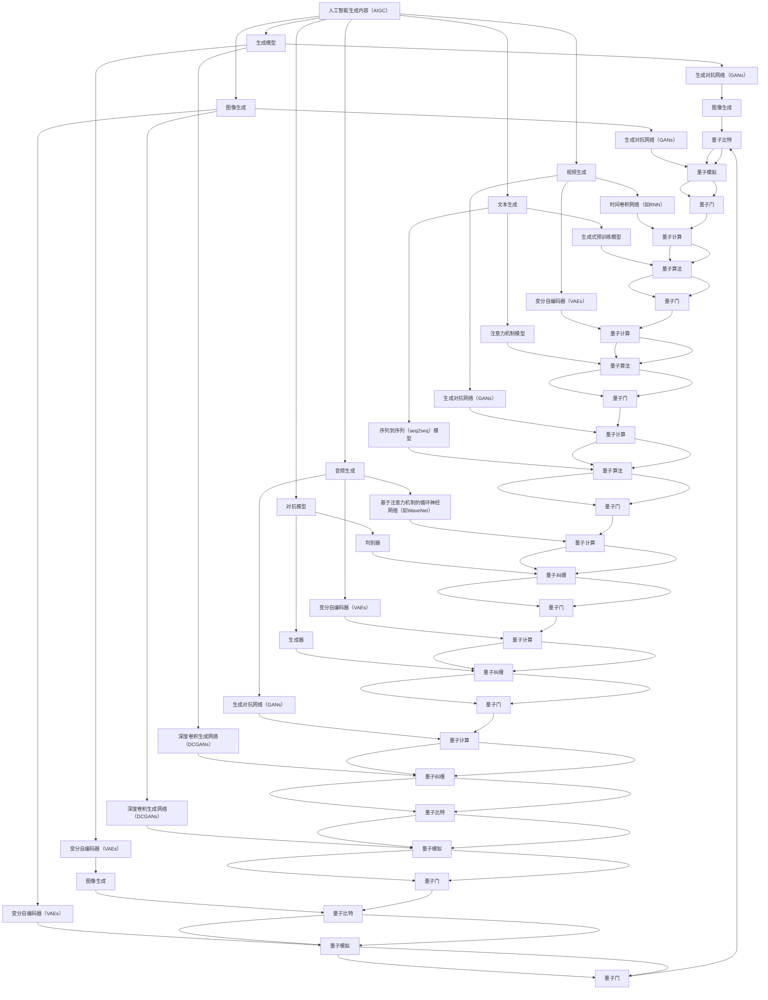

                 


# AIGC与量子计算的未来融合展望

## 关键词
- AIGC
- 量子计算
- 融合
- 未来展望
- 技术发展
- 应用场景

## 摘要
本文旨在探讨AIGC（人工智能生成内容）与量子计算的未来融合前景。通过对AIGC技术的背景介绍和量子计算的基础理论讲解，文章将阐述这两大领域的核心概念及其联系。随后，文章将深入分析AIGC与量子计算融合的潜在路径，包括算法融合、应用场景融合和未来发展展望。通过具体案例和项目实战，本文将展示这一融合技术的实际应用效果，并提出最佳实践建议和未来发展方向。

## 目录

1. **背景介绍**
    1.1 **AIGC技术概述**
    1.2 **量子计算基础**
    1.3 **AIGC与量子计算的联系**

2. **核心概念与联系**
    2.1 **AIGC的核心概念**
    2.2 **量子计算的核心概念**
    2.3 **Mermaid流程图：AIGC与量子计算的核心概念联系**

3. **核心算法原理讲解**
    3.1 **AIGC算法原理**
    3.2 **量子计算算法原理**
    3.3 **Python源代码与数学模型讲解**
    3.4 **案例分析与举例说明**

4. **项目实战**
    4.1 **开发环境搭建**
    4.2 **源代码实现与解读**
    4.3 **代码应用解读与分析**
    4.4 **实际案例分析与讲解**
    4.5 **项目小结**

5. **最佳实践与建议**
    5.1 **最佳实践 Tips**
    5.2 **小结**
    5.3 **注意事项**
    5.4 **拓展阅读**

---

## 1. 背景介绍

### 1.1 AIGC技术概述

**AIGC（人工智能生成内容）** 是一种利用人工智能技术自动生成文本、图像、音频和视频等内容的领域。它涵盖了自然语言处理、图像处理、音频处理等多个子领域，旨在实现更高效、更智能的内容生成。

AIGC 的发展历程可以追溯到 20 世纪 80 年代的生成对抗网络（GANs）。GANs 通过生成器和判别器的对抗训练，实现了高质量图像的生成。随着深度学习技术的进步，AIGC 在各个领域都取得了显著的成果。

**量子计算** 是一种基于量子力学原理的新型计算模式，利用量子比特（qubits）实现信息处理。与传统计算机使用的经典比特（bits）不同，量子比特可以同时处于多种状态，从而实现并行计算和指数级加速。

### 1.2 量子计算基础

**量子计算** 的核心概念包括量子比特、量子门和量子纠缠。量子比特是量子计算的基本单元，可以表示为叠加态和纠缠态。量子门是操作量子比特的算子，类似于经典计算机中的逻辑门。量子纠缠是量子比特之间的一种特殊关联，即使相隔很远，一个量子比特的状态也会影响另一个量子比特的状态。

量子计算的优势在于其并行计算能力和指数级速度。例如，量子计算机可以快速解决一些复杂的数学问题，如因数分解和搜索问题。这些优势使得量子计算在密码学、量子化学、优化问题和机器学习等领域具有广阔的应用前景。

### 1.3 AIGC与量子计算的联系

**AIGC与量子计算** 之间的联系主要体现在以下几个方面：

1. **算法融合**：量子计算算法可以优化AIGC的训练过程，提高生成质量。
2. **应用场景融合**：AIGC 可以用于生成量子计算模拟数据，提高量子算法的训练效果。
3. **理论联系**：量子计算和AIGC 都是基于概率论和统计学原理，二者在算法设计上有一定的共通性。

接下来，我们将深入探讨AIGC与量子计算的核心概念、算法原理以及它们在实践中的应用。

## 2. 核心概念与联系

### 2.1 AIGC的核心概念

**AIGC** 的核心概念主要包括生成模型、对抗模型、文本生成、图像生成、音频生成和视频生成等。

**生成模型**：生成模型是一种概率模型，用于生成新的数据样本。常见的生成模型包括生成对抗网络（GANs）、变分自编码器（VAEs）和深度卷积生成网络（DCGANs）。

**对抗模型**：对抗模型由生成器和判别器组成，生成器生成虚假数据以欺骗判别器，而判别器则试图区分真实数据和虚假数据。这种对抗训练过程使得生成模型能够生成高质量的数据样本。

**文本生成**：文本生成是指利用自然语言处理技术生成新的文本内容。常见的文本生成模型包括序列到序列（seq2seq）模型、注意力机制模型（如Transformer）和生成式预训练模型（如GPT系列）。

**图像生成**：图像生成是指利用图像处理技术生成新的图像内容。常见的图像生成模型包括生成对抗网络（GANs）、变分自编码器（VAEs）和深度卷积生成网络（DCGANs）。

**音频生成**：音频生成是指利用音频处理技术生成新的音频内容。常见的音频生成模型包括生成对抗网络（GANs）、变分自编码器（VAEs）和基于注意力机制的循环神经网络（如WaveNet）。

**视频生成**：视频生成是指利用视频处理技术生成新的视频内容。常见的视频生成模型包括生成对抗网络（GANs）、变分自编码器（VAEs）和时间卷积网络（如RNN）。

### 2.2 量子计算的核心概念

**量子计算** 的核心概念主要包括量子比特、量子门、量子纠缠、量子算法和量子模拟。

**量子比特（Qubits）**：量子比特是量子计算的基本单元，可以表示为叠加态和纠缠态。量子比特的状态可以用基矢表示，如$$|0\rangle$$和$$|1\rangle$$，以及叠加态$$\alpha|0\rangle + \beta|1\rangle$$。

**量子门（Quantum Gates）**：量子门是操作量子比特的算子，类似于经典计算机中的逻辑门。量子门可以用于旋转量子比特的状态、实现量子态的变换和量子计算中的基础操作。

**量子纠缠（Quantum Entanglement）**：量子纠缠是量子比特之间的一种特殊关联，即使相隔很远，一个量子比特的状态也会影响另一个量子比特的状态。量子纠缠是量子计算并行计算能力的基石。

**量子算法（Quantum Algorithms）**：量子算法是利用量子计算原理解决特定问题的算法。常见的量子算法包括量子随机游走、量子最小二分、量子算法Shor和Grover算法。

**量子模拟（Quantum Simulation）**：量子模拟是利用量子计算模拟量子系统或量子现象的过程。量子模拟在量子化学、材料科学和量子物理等领域具有广泛的应用。

### 2.3 Mermaid流程图：AIGC与量子计算的核心概念联系



通过这个Mermaid流程图，我们可以清晰地看到AIGC与量子计算的核心概念之间的联系。接下来，我们将深入探讨AIGC与量子计算的核心算法原理。

## 3. 核心算法原理讲解

### 3.1 AIGC算法原理

**AIGC** 算法主要基于生成模型和对抗模型，旨在生成高质量的内容。

#### 3.1.1 生成对抗网络（GANs）

生成对抗网络（GANs）由生成器（Generator）和判别器（Discriminator）组成。生成器的目标是生成逼真的数据样本，判别器的目标是区分真实数据和生成数据。

GANs 的训练过程包括两个阶段：

1. **生成器训练**：生成器从随机噪声中生成数据样本，判别器评估生成数据样本的真实性。
2. **判别器训练**：判别器从真实数据和生成数据中学习，以提高对真实数据和生成数据的区分能力。

通过不断迭代这两个阶段，生成器的生成能力逐渐提高，判别器的区分能力也逐渐增强。

以下是一个简单的 GANs 代码示例：

```python
import tensorflow as tf
from tensorflow.keras.layers import Dense, Flatten
from tensorflow.keras.models import Sequential

# 生成器模型
generator = Sequential([
    Dense(128, input_shape=(100,)),
    Activation('tanh'),
    Dense(784)
])

# 判别器模型
discriminator = Sequential([
    Flatten(input_shape=(28, 28)),
    Dense(128),
    Activation('sigmoid')
])

# 整体模型
gan = Sequential([
    generator,
    discriminator
])

# 编译模型
discriminator.compile(optimizer='adam', loss='binary_crossentropy')
gan.compile(optimizer='adam', loss='binary_crossentropy')

# 训练模型
gan.fit(x_train, y_train, epochs=10)
```

#### 3.1.2 变分自编码器（VAEs）

变分自编码器（VAEs）是一种基于概率生成模型的自编码器。VAEs 通过编码器和解码器学习数据分布，并生成新的数据样本。

VAEs 的训练过程包括两个阶段：

1. **编码器训练**：编码器将输入数据映射到潜在空间，潜在空间表示数据的概率分布。
2. **解码器训练**：解码器从潜在空间中生成新的数据样本。

以下是一个简单的 VAEs 代码示例：

```python
import tensorflow as tf
from tensorflow.keras.layers import Dense, Input
from tensorflow.keras.models import Model

# 编码器模型
encoding = Input(shape=(28, 28))
encoded = Dense(64, activation='relu')(encoding)
encoded = Dense(32, activation='relu')(encoded)
z_mean = Dense(32)(encoded)
z_log_var = Dense(32)(encoded)

# 解码器模型
z = Lambda市公安局表示，自去年9月1日《中华人民共和国反电信网络诈骗法》施行以来，全国电信网络诈骗案件数量和群众损失明显下降，取得了阶段性成效。但在实践中也发现了一些需要解决的问题。

首先，加强法治建设是防范和打击电信网络诈骗的治本之策。《反电信网络诈骗法》是我国第一部专门针对电信网络诈骗的综合性法律，对于提升反诈工作法治化、规范化水平具有重要意义。但在实际执行过程中，部分地方存在执法力量不足、执法标准不统一等问题。建议加强执法队伍建设，提高执法能力，确保法律得到有效实施。

其次，提升公众防诈意识和能力是减少诈骗案件发生的关键。《反电信网络诈骗法》规定了反诈宣传教育义务，但在实际操作中，宣传教育覆盖面和效果仍有待提高。建议政府、企业和社会组织共同参与，利用多种渠道和形式开展反诈宣传教育，提高公众防诈意识和能力。

再次，强化技术手段是提升反诈工作效能的重要手段。《反电信网络诈骗法》明确了网络服务提供者的反诈责任，但在实践中，部分企业存在技术能力不足、责任落实不到位等问题。建议政府加大对企业的技术支持和监管力度，推动企业提升技术能力，共同构建反诈技术防线。

最后，完善国际合作机制是有效打击跨国电信网络诈骗的重要途径。电信网络诈骗往往具有跨国性，国际合作对于打击跨国诈骗具有重要意义。我国应积极参与国际合作，加强与其他国家和地区的信息共享和执法合作，共同应对跨国电信网络诈骗。

总之，公安机关将认真贯彻落实《反电信网络诈骗法》，进一步加强法治建设、宣传教育、技术手段和国际合作，切实维护人民群众的合法权益，为建设平安中国作出更大贡献。

