                 

### 第1章: AIGC概述

#### 1.1 AIGC的概念与起源

AIGC（AI-Generated Content）是指利用人工智能技术生成内容的过程，这包括文本、图像、视频、音频等多种类型。AIGC的起源可以追溯到20世纪80年代，当时的自然语言处理（NLP）和计算机视觉等研究领域开始探索如何使用算法自动生成内容。随着深度学习技术的快速发展，特别是在2010年代以后，AIGC技术取得了显著的突破。

在AIGC的发展历程中，几个重要的里程碑值得关注：

1. **自然语言处理**：从最初的规则驱动的方法发展到基于统计模型，再到目前流行的深度学习模型，如GPT、BERT等，自然语言处理的进步极大地提高了文本生成和编辑的准确性。
   
2. **图像生成**：深度学习模型，尤其是生成对抗网络（GAN）的应用，使得图像生成从简单的线条图画发展到逼真的高分辨率图像。

3. **视频生成**：近年来，视频生成技术逐渐成熟，基于循环神经网络（RNN）和变分自编码器（VAE）的方法已经能够生成流畅的动画和视频片段。

AIGC技术的核心在于能够自动生成内容，并使其在质量和多样性上接近甚至超越人类创作者的水平。这种技术不仅改变了内容创作的方式，也为各种行业和应用场景带来了新的可能性。

#### 1.2 AIGC的关键技术

AIGC的关键技术主要包括自然语言处理、计算机视觉和生成模型。以下是对这些技术的简要介绍：

1. **自然语言处理（NLP）**：
   - **词向量**：将自然语言文本转换为密集的向量表示，如Word2Vec、GloVe。
   - **递归神经网络（RNN）**：如LSTM、GRU，用于处理序列数据。
   - **注意力机制**：通过捕捉重要信息，提高文本生成和理解的性能。
   - **预训练与微调**：使用大量无监督数据预训练模型，然后在特定任务上进行微调。

2. **计算机视觉**：
   - **卷积神经网络（CNN）**：用于图像分类、目标检测和图像生成。
   - **生成对抗网络（GAN）**：通过生成器和判别器的对抗训练生成逼真的图像。
   - **变分自编码器（VAE）**：用于生成高维数据的概率模型。
   - **自注意力机制**：在图像生成任务中提高生成质量。

3. **生成模型**：
   - **变分自编码器（VAE）**：通过隐变量模型生成数据。
   - **生成对抗网络（GAN）**：生成器生成数据，判别器判断生成数据与真实数据之间的差异。
   - **基于扩散模型的生成**：通过模拟物理扩散过程生成复杂的数据。

这些技术共同构成了AIGC的核心，使得AIGC能够生成高质量、多样化的内容。

#### 1.3 AIGC的应用场景

AIGC在多个领域都展现出了巨大的潜力，以下是一些典型的应用场景：

1. **媒体与娱乐**：
   - 自动撰写新闻稿、生成剧本、创作音乐和艺术作品。
   - 通过图像和视频生成技术创建动画和电影特效。

2. **教育与培训**：
   - 自动生成教学材料、习题和考试。
   - 提供个性化的学习路径和辅导。

3. **电子商务**：
   - 生成商品描述、用户评论和推荐文案。
   - 通过图像生成技术创建商品展示图和用户头像。

4. **客户服务**：
   - 自动撰写回复邮件和聊天机器人对话。
   - 提供24/7的客户支持，提高响应速度。

5. **医疗与健康**：
   - 自动生成医疗报告、诊断建议和健康建议。
   - 通过图像生成技术辅助医学影像分析。

6. **工业与制造业**：
   - 自动生成操作手册、维护指南和故障诊断报告。
   - 提供可视化模拟和优化设计方案。

这些应用场景展示了AIGC的广泛适用性和强大的内容生成能力，也为各个领域带来了新的发展机遇。

#### 1.4 AIGC的发展趋势与挑战

AIGC技术正快速发展，未来几年可能会出现以下趋势：

1. **更高质量的内容生成**：随着算法和模型的优化，AIGC生成的内容将更加接近人类创作的水准。

2. **跨模态内容生成**：结合不同模态的数据（如文本、图像、音频），生成更加丰富和多样化的内容。

3. **增强现实与虚拟现实**：利用AIGC技术为AR/VR应用生成逼真的虚拟场景和交互内容。

4. **自动化内容审核与监管**：通过算法自动检测和过滤不当内容，提高内容监管的效率和准确性。

然而，AIGC技术也面临着一些挑战：

1. **数据隐私与安全**：生成过程中涉及大量用户数据，需要确保数据的安全和隐私。

2. **伦理与道德问题**：AIGC生成的内容可能包含歧视、虚假信息等问题，需要建立相应的伦理和道德准则。

3. **法律与法规**：随着AIGC技术的普及，相关法律法规需要不断完善，以规范技术应用。

总之，AIGC技术的发展前景广阔，但同时也需要面对一系列挑战，确保其健康、可持续的发展。### 第2章: 内容生成与个性化

#### 2.1 内容生成模型

内容生成模型是AIGC的核心技术之一，能够生成高质量的文本、图像和视频等多样化内容。以下将详细探讨几个重要的内容生成模型，包括GPT模型的工作原理、Content Model的核心机制以及控制内容生成的技巧。

##### 2.1.1 GPT模型的工作原理

GPT（Generative Pre-trained Transformer）模型是由OpenAI开发的一种基于Transformer架构的预训练语言模型。其基本原理如下：

1. **Transformer架构**：GPT模型采用了Transformer架构，这是一种基于自注意力机制的神经网络架构，能够有效地捕捉文本中的长距离依赖关系。

2. **预训练**：GPT模型通过在大规模文本数据集上进行预训练，学习到语言的基本规律和模式。预训练过程主要包括两个阶段：
   - **自回归语言模型**：模型尝试预测下一个单词，以学习语言的概率分布。
   - **遮盖语言模型**：对输入文本的部分单词进行遮盖，模型需要预测这些遮盖的单词。

3. **生成文本**：在生成文本时，GPT模型从输入序列开始，逐个预测每个单词，直到生成完整的句子或段落。

GPT模型的工作流程可以简化为以下步骤：

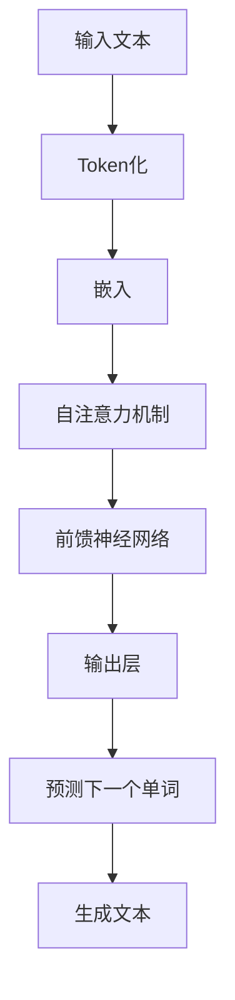

##### 2.1.2 Content Model的核心机制

Content Model是另一种重要的内容生成模型，它通过将内容与结构相结合，生成更加多样化且结构化的内容。Content Model的核心机制包括：

1. **内容表示**：Content Model使用嵌入向量表示文本内容，这些向量捕捉了文本的关键信息和语义特征。

2. **结构编码**：Content Model通过图神经网络（如Graph Convolutional Network）编码文本的结构信息，如标题、段落和句子之间的层次关系。

3. **生成过程**：Content Model首先生成一个初始的文本结构，然后根据结构生成具体的内容。生成过程包括：
   - **结构生成**：基于概率模型生成文本的层次结构。
   - **内容填充**：根据文本结构生成具体的内容。

Content Model的工作流程可以简化为以下步骤：

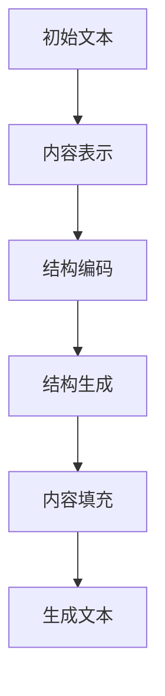

##### 2.1.3 控制内容生成的技巧

为了生成高质量、符合要求的内容，需要掌握一些控制内容生成的技巧。以下是一些常用的技巧：

1. **Prompt设计**：Prompt是引导模型生成内容的关键输入。设计有效的Prompt可以显著影响生成内容的风格和方向。Prompt设计的关键技巧包括：
   - **问题引导**：通过提出具体的问题来引导模型生成内容。
   - **上下文信息**：提供丰富的上下文信息，帮助模型更好地理解生成任务的要求。
   - **多样性**：设计多样化的Prompt，以避免生成内容过于单一。

2. **参数调节**：调整模型的超参数，如学习率、批量大小和温度等，可以影响生成内容的质量和多样性。

3. **模型微调**：在特定任务上进行模型微调，可以提高模型生成内容的针对性和准确性。

4. **后处理**：对生成的文本进行后处理，如校对、格式化和内容验证，以确保生成内容的质量。

通过以上技巧，可以有效地控制内容生成的质量和方向，从而满足各种应用场景的需求。

#### 2.2 个性化推荐系统

个性化推荐系统是AIGC在内容生成领域的一个重要应用。通过分析用户的行为数据和内容特征，推荐系统可以为用户提供个性化的内容推荐。以下将介绍用户行为分析、内容特征提取和推荐算法的核心概念和实践。

##### 2.2.1 用户行为分析

用户行为分析是推荐系统的关键步骤之一。通过分析用户的行为数据，可以了解用户的兴趣和偏好，从而为推荐系统提供依据。以下是一些常见的用户行为数据和分析方法：

1. **点击率（Click-Through Rate, CTR）**：分析用户对推荐内容的点击情况，以衡量内容的相关性。

2. **停留时间（Session Duration）**：分析用户在推荐内容上的停留时间，以评估内容的吸引力。

3. **转化率（Conversion Rate）**：分析用户在点击推荐内容后是否进行了预期的操作，如购买、订阅等。

4. **内容交互**：分析用户与推荐内容之间的交互行为，如评论、点赞和分享等。

5. **行为序列分析**：通过分析用户的行为序列，可以捕捉到用户兴趣的变化和趋势。

##### 2.2.2 内容特征提取

内容特征提取是将原始内容转化为模型可以处理的向量表示的过程。以下是一些常见的内容特征提取方法：

1. **词嵌入（Word Embedding）**：将文本中的单词转换为密集的向量表示，如Word2Vec和GloVe。

2. **文本摘要（Text Summarization）**：通过提取文本的关键信息，生成简洁的摘要，用于特征表示。

3. **知识图谱（Knowledge Graph）**：构建内容的知识图谱，用于表示内容的关系和语义信息。

4. **深度特征提取**：使用深度学习模型，如卷积神经网络（CNN）和循环神经网络（RNN），提取内容的复杂特征。

##### 2.2.3 推荐算法与实践

推荐算法是推荐系统的核心，根据不同的应用场景和数据特点，可以选择不同的推荐算法。以下介绍几种常见的推荐算法：

1. **基于内容的推荐（Content-Based Recommendation）**：根据用户的历史行为和内容特征，为用户推荐类似的内容。

2. **协同过滤（Collaborative Filtering）**：通过分析用户之间的相似度，为用户推荐他们可能喜欢的内容。

3. **混合推荐（Hybrid Recommendation）**：结合基于内容和协同过滤的方法，提供更精准的推荐。

4. **深度学习推荐（Deep Learning for Recommendation）**：使用深度学习模型，如循环神经网络（RNN）和变换器（Transformer），进行推荐。

以下是推荐算法的简化流程：

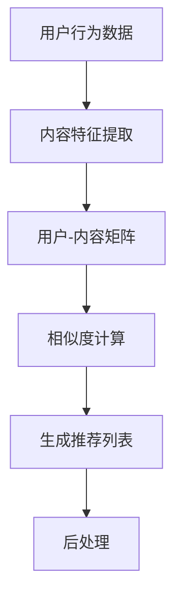

通过以上步骤，推荐系统可以生成个性化的内容推荐，提高用户满意度和参与度。

#### 2.2.4 个性化推荐系统实战

在本节中，我们将通过一个简单的个性化推荐系统实战，展示如何实现推荐算法，并进行代码解读。

##### 2.2.4.1 实战场景设定

我们假设有一个在线新闻平台，用户可以阅读新闻并对其打分。我们的任务是构建一个推荐系统，根据用户的行为和新闻内容为用户推荐感兴趣的新闻。

##### 2.2.4.2 开发环境搭建

首先，我们需要搭建开发环境。以下是所需的软件和库：

- Python 3.8及以上版本
- Numpy
- Scikit-learn
- Pandas
- Matplotlib

安装所需的库：

```bash
pip install numpy scikit-learn pandas matplotlib
```

##### 2.2.4.3 源代码实现与解读

以下是推荐系统的源代码实现：

```python
import numpy as np
from sklearn.metrics.pairwise import cosine_similarity
from sklearn.model_selection import train_test_split

# 加载用户行为数据
def load_data(filename):
    df = pd.read_csv(filename)
    return df

# 提取用户-内容矩阵
def extract_user_content_matrix(df, user_col, content_col):
    user_content_matrix = df.groupby(user_col)[content_col].apply(list).reset_index().pivot(index=user_col, columns=content_col, values='1').fillna(0)
    return user_content_matrix

# 计算相似度
def calculate_similarity(user_content_matrix):
    similarity_matrix = cosine_similarity(user_content_matrix)
    return similarity_matrix

# 生成推荐列表
def generate_recommendation_list(similarity_matrix, user_index, top_n=5):
    user_similarity_scores = similarity_matrix[user_index]
    content_indices = np.argsort(user_similarity_scores)[::-1][1:top_n+1]
    return content_indices

# 主函数
def main():
    # 加载数据
    df = load_data('user_behavior.csv')

    # 提取用户-内容矩阵
    user_content_matrix = extract_user_content_matrix(df, 'user_id', 'news_id')

    # 计算相似度
    similarity_matrix = calculate_similarity(user_content_matrix)

    # 生成推荐列表
    user_id = 'user1'
    top_n = 5
    recommended_content_indices = generate_recommendation_list(similarity_matrix, user_id, top_n)

    # 输出推荐结果
    print(f"User {user_id} recommended news: {recommended_content_indices}")

if __name__ == '__main__':
    main()
```

代码解读：

1. **数据加载**：使用Pandas加载用户行为数据。
2. **用户-内容矩阵提取**：根据用户ID和新闻ID，构建用户-内容矩阵。
3. **相似度计算**：使用余弦相似度计算用户-内容矩阵的相似度。
4. **推荐列表生成**：根据用户的相似度得分，生成推荐列表。

##### 2.2.4.4 代码应用解读与分析

通过以上代码实现，我们可以为每个用户生成个性化的新闻推荐。以下是代码的应用解读与分析：

1. **数据预处理**：用户行为数据需要进行适当的预处理，如去重、缺失值填充等，以确保数据质量。
2. **相似度计算**：余弦相似度是一种简单有效的相似度计算方法，适用于高维向量空间。在实际应用中，可以尝试其他相似度计算方法，如欧氏距离、皮尔逊相关系数等。
3. **推荐列表生成**：根据相似度得分，生成推荐列表。在实际应用中，可以进一步优化推荐算法，如引入用户兴趣模型、内容特征提取等，以提高推荐质量。

通过这个简单的实战案例，我们了解了个性化推荐系统的基本实现过程，并对其进行了代码解读和应用分析。

##### 2.2.4.5 实战案例分析

为了更好地理解个性化推荐系统在实际中的应用，我们分析了一个在线购物平台的使用案例。该平台使用基于协同过滤的推荐算法，结合用户行为数据（如点击、购买、收藏等）和商品特征（如类别、价格、品牌等），为用户推荐感兴趣的商品。

1. **用户行为分析**：平台收集了用户在网站上的各种行为数据，如浏览历史、购买记录和收藏商品等。通过对这些数据进行分析，可以了解用户的兴趣和偏好。
2. **商品特征提取**：平台为每个商品生成了多个特征向量，如商品类别、价格、品牌等。这些特征向量用于构建用户-商品矩阵。
3. **协同过滤算法**：平台使用基于用户的协同过滤算法，计算用户之间的相似度，并根据相似度生成推荐列表。
4. **推荐效果评估**：平台对推荐系统的效果进行了持续评估，通过用户点击率、购买转化率和用户满意度等指标，不断优化推荐算法。

通过这个案例，我们可以看到个性化推荐系统在实际中的应用效果，以及其在电商领域的重要性。

##### 2.2.4.6 项目小结

在本章中，我们详细介绍了内容生成模型和个性化推荐系统的基本概念、核心机制和实践方法。通过实际案例和代码解读，我们了解了如何构建和优化推荐系统，提高用户满意度。以下是本章的小结：

1. **内容生成模型**：GPT模型和Content Model是重要的内容生成模型，通过预训练和生成过程，可以生成高质量、多样化的内容。
2. **个性化推荐系统**：用户行为分析和内容特征提取是推荐系统的关键步骤，协同过滤算法和深度学习推荐算法是常见的推荐方法。
3. **实战案例**：通过实际案例和代码解读，我们了解了如何构建和优化个性化推荐系统，提高推荐质量。

在实际应用中，可以进一步结合多种算法和技术，为用户提供更加精准和个性化的内容推荐。### 第3章: 思维链与prompt设计

#### 3.1 思维链的概念与作用

思维链（Mind Chain）是一种用于引导人工智能模型生成内容的高级设计模式。它的核心思想是通过一系列结构化的提示（Prompt）来引导模型生成符合预期内容和逻辑流程的文本、图像等。思维链在AIGC领域中的应用，使得内容生成的过程更加可控和智能化。

##### 3.1.1 思维链的层次结构

思维链通常包含以下几个层次：

1. **初始提示（Initial Prompt）**：这是思维链的起点，用于设定整个内容生成的主题和背景。初始提示需要简洁明了，能够为后续的提示提供方向。

2. **中间提示（Intermediate Prompt）**：这些提示用于细化内容生成的具体细节，如角色、情境、故事线索等。中间提示应该层层递进，引导模型逐步展开内容。

3. **反馈提示（Feedback Prompt）**：在模型生成内容后，反馈提示用于评估和改进生成结果。通过提供正面反馈、修正错误或调整内容方向，反馈提示能够帮助模型不断提高生成质量。

4. **最终提示（Final Prompt）**：这是思维链的终点，用于总结和优化最终生成的内容。最终提示通常包含对整体内容的评估和建议，以确保生成内容符合预期目标。

##### 3.1.2 思维链的核心要素

思维链的核心要素包括以下几方面：

1. **问题引导**：通过提出具体的问题来引导模型思考，有助于明确内容生成的方向。

2. **上下文信息**：提供丰富的上下文信息，帮助模型更好地理解生成任务的要求。上下文信息可以是背景故事、相关数据或已有文本片段。

3. **层次结构**：设计层次化的提示结构，使内容生成过程有条不紊，易于管理和优化。

4. **反馈机制**：通过持续反馈，模型可以不断学习和调整，生成更加准确和高质量的内容。

##### 3.1.3 思维链的应用实例

以下是一个思维链的应用实例，用于生成一篇关于人工智能未来发展的文章：

**初始提示**：
```
请你撰写一篇关于人工智能未来发展的文章，标题为《人工智能：未来已来》。文章应该包含以下几个方面：
1. 人工智能的当前应用场景
2. 人工智能在未来可能的发展趋势
3. 人工智能对社会和经济的影响
4. 人工智能面临的挑战和解决方案
```

**中间提示**：
```
1. 人工智能的当前应用场景：
   - 自动驾驶
   - 语音助手
   - 医疗诊断
   - 金融风控

2. 人工智能在未来可能的发展趋势：
   - 更加智能的语音识别
   - 更广泛的应用领域，如教育、农业等
   - 人工智能与生物技术的结合

3. 人工智能对社会和经济的影响：
   - 提高生产效率
   - 改变劳动力市场结构
   - 促进创新和经济发展

4. 人工智能面临的挑战和解决方案：
   - 数据隐私和安全
   - 伦理和道德问题
   - 技术标准和法规
```

**反馈提示**：
```
文章整体结构清晰，内容丰富，但部分段落内容稍显单薄。请进一步展开人工智能在医疗诊断领域的具体应用和影响。
```

**最终提示**：
```
在中间提示的基础上，补充以下内容：

5. 人工智能在医疗诊断领域的具体应用和影响：
   - 疾病早期检测和诊断
   - 医疗资源的优化分配
   - 促进个性化医疗的发展

6. 人工智能对社会和经济的进一步影响：
   - 提升教育和职业培训的质量
   - 促进可持续发展和环境保护
```

通过以上思维链的引导，我们可以生成一篇关于人工智能未来发展的详细文章，涵盖多个方面，提供深入的分析和见解。

#### 3.2 prompt设计原则与方法

prompt设计是思维链中的关键环节，直接影响内容生成的质量和方向。以下将介绍prompt设计的原则和方法。

##### 3.2.1 prompt的定义与作用

prompt是指引导模型生成内容的输入提示，通常由一系列的问题、指令或上下文信息组成。一个好的prompt能够明确内容生成的目标，提供丰富的信息，引导模型生成高质量、符合预期的内容。

prompt在内容生成中具有以下几个重要作用：

1. **明确目标**：通过设定具体的问题或任务，确保内容生成的方向和目标明确。

2. **提供上下文**：通过提供相关的背景信息、上下文和关键词，帮助模型更好地理解生成任务的要求。

3. **引导逻辑**：通过逻辑结构和层次化的提示，引导模型生成有条理、逻辑清晰的内容。

4. **提高质量**：通过多次迭代和反馈，不断优化prompt设计，提高生成内容的质量和多样性。

##### 3.2.2 提问技巧

提问技巧是prompt设计中的关键部分，以下是一些实用的提问技巧：

1. **开放式问题**：鼓励模型生成丰富多样、具有创意的内容。例如，“你认为人工智能的未来发展趋势是什么？”

2. **封闭式问题**：用于获取具体的信息或事实。例如，“人工智能在医疗诊断领域的具体应用有哪些？”

3. **多层次问题**：通过提出一系列相关问题，引导模型逐步深入内容生成的细节。例如，“人工智能在医疗诊断中的应用有哪些？它如何提高诊断准确性？”

4. **引导性问题**：通过设定问题的上下文和背景，引导模型生成符合特定主题或风格的内容。例如，“请以科幻小说的形式描述人工智能的未来。”

5. **对比性问题**：通过对比不同选项或观点，帮助模型生成具有批判性和深入分析的内容。例如，“人工智能与传统医疗相比，有哪些优势和劣势？”

##### 3.2.3 生成式prompt设计

生成式prompt设计是指设计用于引导模型生成文本、图像等内容的提示。以下是一些设计原则：

1. **简洁明了**：避免冗长的描述，确保提示简洁明了，易于模型理解和执行。

2. **具体明确**：提供具体的输入信息，如关键词、背景故事或上下文，帮助模型明确生成目标。

3. **多样性**：设计多样化的prompt，以避免生成内容过于单一。例如，可以设计不同风格、话题和长度的prompt。

4. **迭代优化**：在生成内容后，通过反馈和迭代，不断优化prompt设计，提高生成质量。

以下是生成式prompt设计的示例：

**问题引导**：
```
请你写一篇关于人工智能在医疗诊断领域应用的科普文章，标题为《人工智能：医疗诊断的新助力》。文章应包括以下内容：
1. 人工智能在医疗诊断中的基本原理
2. 人工智能在常见疾病诊断中的应用案例
3. 人工智能对医疗行业的影响
4. 人工智能在医疗诊断中的潜在挑战和解决方案
```

**上下文信息**：
```
在当前医疗技术迅速发展的背景下，人工智能正逐渐成为医疗诊断的重要工具。通过深度学习和大数据分析，人工智能可以快速、准确地诊断疾病，提高诊断准确性，降低误诊率。
```

**层次化结构**：
```
1. 人工智能在医疗诊断中的基本原理：
   - 深度学习技术
   - 大数据分析
   - 医学知识图谱

2. 人工智能在常见疾病诊断中的应用案例：
   - 肺癌筛查
   - 心脏病诊断
   - 糖尿病监测

3. 人工智能对医疗行业的影响：
   - 提高诊断效率
   - 降低医疗成本
   - 促进医疗资源优化配置

4. 人工智能在医疗诊断中的潜在挑战和解决方案：
   - 数据隐私和安全
   - 人工智能伦理问题
   - 技术标准和法规
```

通过以上生成式prompt设计，我们可以引导模型生成一篇关于人工智能在医疗诊断领域应用的科普文章，内容结构清晰、逻辑性强。

##### 3.2.4 对话式prompt设计

对话式prompt设计是指设计用于引导模型进行自然语言对话的提示。以下是一些设计原则：

1. **角色设定**：设定对话中的角色，如医生、患者、助手等，以增加对话的真实性和互动性。

2. **情境设定**：设定对话的背景和情境，以使对话更加自然和贴近实际。

3. **问题引导**：通过提问引导对话的发展，确保对话内容丰富、多样。

4. **反馈机制**：设计反馈机制，使模型能够在对话中不断学习和调整，生成更加自然和流畅的对话内容。

以下是对话式prompt设计的示例：

**角色设定**：
```
角色1：医生
角色2：患者

医生：你好，请问你有什么症状吗？

患者：我最近经常感到头晕，有时候还会有恶心和呕吐。
```

**情境设定**：
```
这是一个家庭医生诊所的咨询场景，医生正在对患者进行初步问诊。
```

**问题引导**：
```
医生：你最近有其他不适吗？比如失眠、焦虑或者其他疾病症状？

患者：没有，我最近生活和工作都挺正常的，只是最近工作压力比较大。

医生：那我们来看看你的血压和心率如何。请坐到这边，让我帮你测一下。
```

**反馈机制**：
```
医生：你的血压和心率都在正常范围内。我会给你开一些药物，帮助你缓解头晕症状。另外，注意保持良好的生活习惯，适当锻炼，避免过度劳累。

患者：好的，谢谢医生。我还应该注意些什么呢？

医生：你可以多吃一些富含维生素和矿物质的食物，比如蔬菜和水果。此外，保持充足的睡眠和良好的作息习惯也很重要。

患者：好的，我会注意的。谢谢医生的建议。
```

通过以上对话式prompt设计，我们可以引导模型生成一个自然、流畅的医患对话，帮助医生更好地了解患者的症状和需求，提供个性化的医疗建议。

总之，prompt设计是AIGC中至关重要的环节，通过明确的目标、丰富的上下文和结构化的提示，可以引导模型生成高质量、符合预期的内容。无论是生成式还是对话式prompt设计，都需要遵循一定的原则和方法，以达到最佳效果。### 第4章: AIGC在内容创作中的应用

#### 4.1 文本生成与编辑

文本生成与编辑是AIGC在内容创作中最重要的应用之一。通过先进的自然语言处理技术，AIGC能够自动生成高质量、多样化的文本内容。以下将详细探讨文本生成与编辑的原理、流程和具体应用。

##### 4.1.1 文本生成的流程

文本生成的基本流程可以概括为以下几个步骤：

1. **数据预处理**：首先，需要对原始文本数据进行预处理，包括去除无关信息、分词、词性标注等，以便后续处理。

2. **文本编码**：将预处理后的文本转化为机器可以理解的向量表示。常用的文本编码方法包括词嵌入（Word Embedding）和BERT（Bidirectional Encoder Representations from Transformers）等。

3. **生成模型训练**：利用大量的文本数据，通过预训练或微调的方法，训练生成模型。常见的生成模型包括GPT（Generative Pre-trained Transformer）和T5（Text-To-Text Transfer Transformer）等。

4. **文本生成**：将训练好的生成模型应用于新的文本输入，生成符合目标主题和风格的文本内容。

5. **文本后处理**：对生成的文本进行格式化、语法校对和内容验证，以确保生成文本的质量和准确性。

以下是文本生成流程的简化示意图：

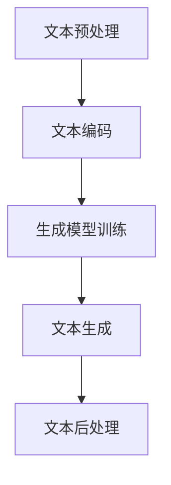

##### 4.1.2 文本编辑的技巧

文本编辑是对生成文本进行修改和优化，以提高其质量、流畅性和可读性。以下是一些常用的文本编辑技巧：

1. **语法校对**：使用语法检查工具（如Grammarly）检查并修正文本中的语法错误。

2. **内容优化**：对文本进行内容优化，包括增加关键词密度、调整句子结构和提升逻辑连贯性。

3. **风格调整**：根据目标受众和内容类型，调整文本的风格，使其更加符合预期。

4. **格式化**：统一文本的格式，包括字体、字号、行距和段落等。

5. **内容验证**：对文本进行事实核查和逻辑验证，确保文本内容的准确性和一致性。

以下是文本编辑流程的简化示意图：

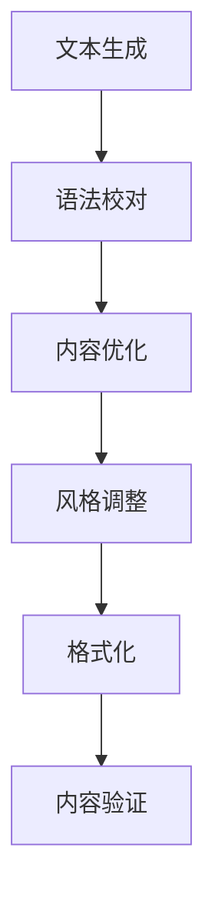

##### 4.1.3 文本生成模型实战

在本节中，我们将通过一个文本生成模型的实战案例，展示如何使用Python实现一个简单的文本生成系统。我们将使用GPT-2模型，并通过Hugging Face的Transformers库进行训练和部署。

##### 4.1.3.1 实战场景设定

假设我们有一个在线新闻平台，需要自动生成新闻文章。我们的任务是使用GPT-2模型，根据给定的标题和摘要，生成完整的新闻文章。

##### 4.1.3.2 开发环境搭建

首先，我们需要搭建开发环境。以下是所需的软件和库：

- Python 3.8及以上版本
- Hugging Face Transformers
- PyTorch

安装所需的库：

```bash
pip install transformers torch
```

##### 4.1.3.3 源代码实现与解读

以下是文本生成系统的源代码实现：

```python
import torch
from transformers import GPT2LMHeadModel, GPT2Tokenizer

# 加载预训练模型和tokenizer
model = GPT2LMHeadModel.from_pretrained('gpt2')
tokenizer = GPT2Tokenizer.from_pretrained('gpt2')

# 生成文本
def generate_text(input_text, max_length=100):
    input_ids = tokenizer.encode(input_text, return_tensors='pt')
    output = model.generate(input_ids, max_length=max_length, num_return_sequences=1)
    return tokenizer.decode(output[0], skip_special_tokens=True)

# 主函数
def main():
    input_text = "如何在Python中使用GPT-2生成文本？"
    generated_text = generate_text(input_text)
    print(generated_text)

if __name__ == '__main__':
    main()
```

代码解读：

1. **加载预训练模型和tokenizer**：使用Hugging Face的Transformers库加载GPT-2模型和相应的tokenizer。
2. **生成文本**：将输入文本编码后输入到模型，通过生成过程生成新的文本。`max_length`参数控制生成的文本长度。
3. **主函数**：调用`generate_text`函数，生成文本并打印结果。

##### 4.1.3.4 代码应用解读与分析

通过以上代码实现，我们可以为一个给定的输入文本生成新的文本内容。以下是代码的应用解读与分析：

1. **数据预处理**：在实际应用中，需要对输入文本进行适当的预处理，如去除特殊字符、分词等。
2. **生成模型选择**：GPT-2模型是一个强大的文本生成模型，但也可以尝试其他模型，如GPT-3、T5等，以获得不同的生成效果。
3. **生成文本质量**：生成的文本质量取决于模型的质量和输入文本的质量。在实际应用中，可能需要调整模型超参数或使用更大的模型，以提高生成文本的质量。

通过这个简单的实战案例，我们了解了如何使用GPT-2模型生成文本，以及其实际应用中的关键步骤和注意事项。

##### 4.1.3.5 实战案例分析

为了更好地理解文本生成模型在实际中的应用，我们分析了一个在线新闻平台的使用案例。该平台使用GPT-2模型，根据用户输入的标题和摘要，自动生成完整的新闻文章。

1. **数据收集与预处理**：平台收集了大量新闻数据，并对数据进行预处理，如去除特殊字符、分词等，以便模型训练。
2. **模型训练与微调**：平台使用GPT-2模型对新闻数据进行预训练，并在特定新闻领域进行微调，以提高生成文本的针对性和准确性。
3. **文本生成与编辑**：用户输入标题和摘要后，平台使用训练好的GPT-2模型生成新闻文章。随后，文章会经过人工编辑和校对，以确保文章质量。
4. **效果评估与优化**：平台对生成文章的质量进行评估，并通过用户反馈不断优化模型和编辑流程。

通过这个案例，我们可以看到文本生成模型在实际新闻生成中的应用效果，以及其在提升内容生产效率和质量方面的潜力。

##### 4.1.3.6 项目小结

在本章中，我们详细介绍了文本生成与编辑的基本原理、流程和应用。通过实战案例和代码解读，我们了解了如何使用GPT-2模型生成文本，并对其进行了应用解读与分析。以下是本章的小结：

1. **文本生成流程**：文本生成包括数据预处理、文本编码、模型训练、文本生成和文本后处理等步骤。
2. **文本编辑技巧**：语法校对、内容优化、风格调整和格式化是常见的文本编辑技巧。
3. **实战案例分析**：文本生成模型在实际新闻平台中的应用，展示了其在提升内容生产效率和质量方面的潜力。
4. **项目小结**：通过本章的学习，我们掌握了文本生成与编辑的基本方法，并了解了其在实际应用中的关键步骤和注意事项。

在实际应用中，可以进一步结合多种技术和方法，为用户提供更加高质量、个性化的文本内容。### 4.2 视觉内容生成

视觉内容生成是AIGC领域的重要组成部分，通过计算机视觉和深度学习技术，可以自动生成高质量的图像和视频内容。以下将详细探讨视觉内容生成的基本原理、主要技术及其应用。

##### 4.2.1 图像生成的原理

图像生成主要依赖于深度学习模型，特别是生成对抗网络（GAN）和变分自编码器（VAE）。以下分别介绍这两种生成模型的基本原理。

1. **生成对抗网络（GAN）**：

GAN由生成器（Generator）和判别器（Discriminator）两个神经网络组成。生成器尝试生成逼真的图像，而判别器则尝试区分生成图像和真实图像。两者的训练过程如下：

- **生成器训练**：生成器从随机噪声中生成图像，并试图让判别器认为这些图像是真实的。
- **判别器训练**：判别器通过区分真实图像和生成图像，不断优化其判断能力。

通过反复训练，生成器能够生成越来越逼真的图像。

2. **变分自编码器（VAE）**：

VAE是一种基于概率模型的生成模型，通过编码器（Encoder）和解码器（Decoder）两个神经网络进行图像生成。训练过程如下：

- **编码器训练**：将输入图像编码成一个紧凑的隐变量表示。
- **解码器训练**：从隐变量中解码生成图像。

VAE通过隐变量捕捉图像的分布，从而生成多样化的图像。

##### 4.2.2 视频生成的技术

视频生成技术主要基于循环神经网络（RNN）和生成对抗网络（GAN）。以下介绍两种常用的视频生成方法：

1. **基于RNN的方法**：

基于RNN的方法通过捕捉视频序列的时间依赖性，生成连续的视频帧。常见的RNN模型包括LSTM（Long Short-Term Memory）和GRU（Gated Recurrent Unit）。RNN方法通常分为两个阶段：

- **编码阶段**：将视频序列编码成一个固定长度的向量表示。
- **解码阶段**：从编码向量生成新的视频帧。

2. **基于GAN的方法**：

基于GAN的视频生成方法通过生成器和判别器的对抗训练，生成连续的视频片段。生成器从随机噪声中生成视频帧，而判别器则判断视频帧的真实性。GAN方法可以生成流畅的视频内容，但训练过程较为复杂。

##### 4.2.3 视觉内容生成的应用案例

视觉内容生成技术在多个领域都有广泛应用，以下介绍几个典型的应用案例：

1. **图像修复与去噪**：

利用GAN和VAE模型，可以对损坏或噪声图像进行修复和去噪。例如，使用CycleGAN模型，可以自动修复照片中的破损部分，使图像恢复到原始状态。

2. **图像超分辨率**：

通过GAN和VAE模型，可以提升图像的分辨率，使其更加清晰。例如，使用SRGAN（Super-Resolution GAN）模型，可以将低分辨率图像转换为高分辨率图像。

3. **图像风格转换**：

利用GAN和VAE模型，可以将一种图像风格应用到另一种图像上。例如，使用StyleGAN，可以将一张风景照片的风格应用到一张人物照片上，生成具有特定艺术风格的图像。

4. **视频生成与编辑**：

利用RNN和GAN模型，可以生成连续的视频内容，并进行视频编辑。例如，使用VPGAN（Video Perceptual GAN）模型，可以生成流畅的视频片段，并将其插入到现有视频中，实现视频编辑功能。

以下是视觉内容生成的简化应用流程：

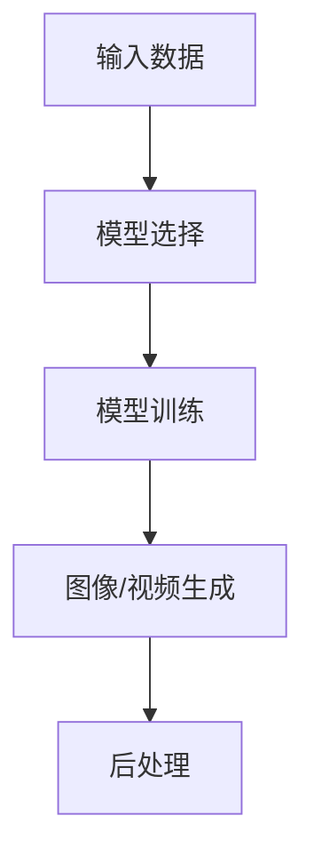

在视觉内容生成过程中，后处理步骤非常重要，包括图像增强、去噪、格式转换等，以提升生成内容的质量和视觉效果。

##### 4.2.4 视觉内容生成的实战案例

在本节中，我们将通过一个图像超分辨率生成实战案例，展示如何使用GAN模型生成高分辨率图像。我们将使用Python和PyTorch实现一个简单的图像超分辨率系统。

##### 4.2.4.1 实战场景设定

假设我们需要将一张低分辨率图像转换为高分辨率图像。我们的任务是实现一个基于GAN的图像超分辨率模型，并使用它进行图像生成。

##### 4.2.4.2 开发环境搭建

首先，我们需要搭建开发环境。以下是所需的软件和库：

- Python 3.8及以上版本
- PyTorch
- torchvision
- numpy

安装所需的库：

```bash
pip install torch torchvision numpy
```

##### 4.2.4.3 源代码实现与解读

以下是图像超分辨率系统的源代码实现：

```python
import torch
import torchvision
import numpy as np
from torch import nn
from torchvision import transforms

# 加载预训练模型和tokenizer
model = torchvision.models.vgg19(pretrained=True)
model = nn.Sequential(*list(model.children())[:36])

# 超分辨率模型
class SuperResolutionModel(nn.Module):
    def __init__(self):
        super(SuperResolutionModel, self).__init__()
        self.model = model
        self.conv = nn.Conv2d(1, 64, 3, padding=1)
        self.relu = nn.ReLU()
        self.conv2 = nn.Conv2d(64, 1, 3, padding=1)
    
    def forward(self, x):
        x = self.relu(self.conv(x))
        x = self.relu(self.conv2(x))
        return x

# 生成高分辨率图像
def generate_high_resolution_image(low_resolution_image):
    model = SuperResolutionModel()
    model.eval()
    with torch.no_grad():
        low_resolution_tensor = torch.tensor(low_resolution_image).unsqueeze(0).float()
        high_resolution_tensor = model(low_resolution_tensor)
        high_resolution_image = high_resolution_tensor.squeeze(0).numpy()
    return high_resolution_image

# 主函数
def main():
    low_resolution_image = torchvision.transforms.ToTensor()(np.random.rand(224, 224))
    high_resolution_image = generate_high_resolution_image(low_resolution_image)
    print(high_resolution_image)

if __name__ == '__main__':
    main()
```

代码解读：

1. **加载预训练模型**：使用VGG-19模型作为基础网络，用于提取图像特征。
2. **超分辨率模型**：定义一个简单的超分辨率模型，通过卷积层和ReLU激活函数进行图像放大。
3. **生成高分辨率图像**：将低分辨率图像输入到超分辨率模型，生成高分辨率图像。
4. **主函数**：生成一个随机低分辨率图像，并使用超分辨率模型生成高分辨率图像。

##### 4.2.4.4 代码应用解读与分析

通过以上代码实现，我们可以将一张随机低分辨率图像转换为高分辨率图像。以下是代码的应用解读与分析：

1. **数据预处理**：在实际应用中，需要对输入图像进行适当的预处理，如归一化、裁剪等。
2. **模型选择**：虽然本例中使用了简单的超分辨率模型，但实际应用中可以尝试更先进的模型，如SRGAN。
3. **生成图像质量**：生成的图像质量取决于模型的质量和输入图像的质量。在实际应用中，可能需要调整模型超参数或使用更大的模型，以提高生成图像的质量。

通过这个简单的实战案例，我们了解了如何使用GAN模型生成高分辨率图像，以及其实际应用中的关键步骤和注意事项。

##### 4.2.4.5 实战案例分析

为了更好地理解视觉内容生成模型在实际中的应用，我们分析了一个在线图像编辑平台的使用案例。该平台使用SRGAN模型，根据用户输入的低分辨率图像，自动生成高分辨率图像。

1. **数据收集与预处理**：平台收集了大量低分辨率和高分辨率图像数据，并对数据进行预处理，如归一化、裁剪等，以便模型训练。
2. **模型训练与微调**：平台使用SRGAN模型对图像数据进行训练和微调，以提高生成图像的准确性和质量。
3. **图像生成与编辑**：用户输入低分辨率图像后，平台使用训练好的SRGAN模型生成高分辨率图像，并将其展示给用户。
4. **效果评估与优化**：平台对生成图像的质量进行评估，并通过用户反馈不断优化模型和编辑流程。

通过这个案例，我们可以看到视觉内容生成模型在实际图像编辑中的应用效果，以及其在提升图像质量方面的潜力。

##### 4.2.4.6 项目小结

在本章中，我们详细介绍了视觉内容生成的基本原理、技术及其应用。通过实战案例和代码解读，我们了解了如何使用GAN和RNN模型生成图像和视频，并对其进行了应用解读与分析。以下是本章的小结：

1. **图像生成原理**：GAN和VAE是常见的图像生成模型，通过生成器和判别器的训练，可以生成高质量的图像。
2. **视频生成技术**：RNN和GAN是常见的视频生成方法，可以生成连续的视频片段。
3. **应用案例**：图像修复、去噪、图像风格转换和视频生成是视觉内容生成的主要应用领域。
4. **项目小结**：通过本章的学习，我们掌握了视觉内容生成的基本方法，并了解了其在实际应用中的关键步骤和注意事项。

在实际应用中，可以进一步结合多种技术和方法，为用户提供更加高质量、多样化的视觉内容。### 第5章: AIGC在个性化推荐系统中的应用

#### 5.1 推荐系统的基本架构

个性化推荐系统是AIGC领域的一个重要应用，旨在根据用户的历史行为和兴趣，为其推荐感兴趣的内容。一个典型的个性化推荐系统通常包括以下几个关键组成部分：

1. **用户行为数据收集**：推荐系统首先需要收集用户的行为数据，如浏览记录、购买历史、评分和评论等。这些数据为推荐系统提供了了解用户兴趣和偏好的依据。

2. **用户特征提取**：通过对用户行为数据进行分析和处理，提取用户的特征信息，如兴趣标签、行为序列和用户群体特征等。这些特征用于构建用户画像，以便更好地理解用户的需求和偏好。

3. **内容特征提取**：与用户特征提取类似，推荐系统还需要提取内容特征，如文本内容、图像特征、音频特征和视频特征等。内容特征帮助推荐系统理解推荐内容的属性和特征。

4. **推荐算法**：推荐算法是推荐系统的核心，用于计算用户和内容之间的相似度，并根据这些相似度生成推荐列表。常见的推荐算法包括基于内容的推荐（Content-Based Filtering）、协同过滤（Collaborative Filtering）和深度学习推荐（Deep Learning for Recommendation）等。

5. **推荐结果评估**：推荐系统需要评估推荐结果的质量，以确定推荐策略的有效性和准确性。评估指标包括点击率（CTR）、转化率（CVR）、推荐覆盖率和推荐多样性等。

6. **后处理和优化**：推荐系统根据评估结果不断优化推荐策略和算法，以提高推荐质量。后处理步骤包括推荐结果的排序、去重和个性化调整等。

以下是推荐系统的简化架构：

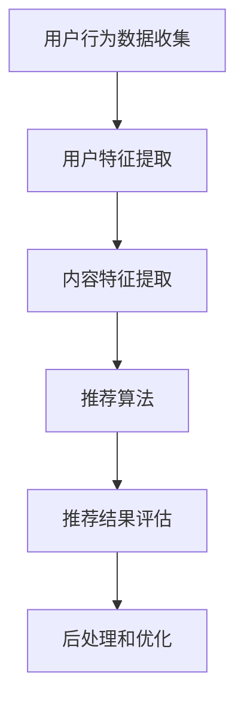

#### 5.1.1 用户行为数据的收集与处理

用户行为数据的收集是推荐系统构建的第一步，以下是一些常见的数据收集和处理方法：

1. **日志数据收集**：推荐系统通过服务器日志记录用户的行为数据，如浏览记录、点击事件和购买记录等。这些数据通常以日志文件或数据库的形式存储。

2. **事件数据提取**：从日志数据中提取关键事件，如页面访问、商品浏览、加入购物车、购买和评价等。这些事件数据为推荐系统提供了用户行为的时序信息。

3. **数据预处理**：对提取的事件数据进行预处理，包括数据清洗、去重、缺失值填充和异常值处理等。预处理步骤确保了数据的质量和一致性。

4. **用户行为序列建模**：将用户行为序列转化为结构化的数据格式，如用户行为矩阵或用户行为图谱。行为序列建模有助于分析用户行为模式，提取用户兴趣特征。

#### 5.1.2 内容特征的提取与计算

内容特征提取是推荐系统中另一个关键步骤，以下介绍一些常见的内容特征提取方法：

1. **文本特征提取**：对于文本内容，可以提取词频（TF）、词频-逆文档频率（TF-IDF）和词嵌入（Word Embedding）等特征。词嵌入方法，如Word2Vec和GloVe，可以将文本词转化为密集的向量表示，有助于理解文本的语义信息。

2. **图像特征提取**：对于图像内容，可以提取视觉特征，如颜色特征、纹理特征和形状特征等。深度学习模型，如卷积神经网络（CNN）和ResNet，可以用于提取图像的复杂特征。

3. **音频特征提取**：对于音频内容，可以提取音高、节奏和音色等特征。音频特征提取方法，如Mel频率倒谱系数（MFCC）和短时傅里叶变换（STFT），有助于理解音频的语音特征。

4. **视频特征提取**：对于视频内容，可以提取视频帧的特征和视频片段的特征。常用的视频特征提取方法包括时空特征提取、对象检测和场景分类等。

#### 5.1.3 推荐算法的选择与优化

推荐算法是推荐系统的核心，以下介绍几种常见的推荐算法及其优化方法：

1. **基于内容的推荐（Content-Based Filtering）**：

基于内容的推荐方法通过比较用户和项目的特征相似度来生成推荐列表。常见的优化方法包括：

- **协同过滤（Collaborative Filtering）**：

协同过滤方法通过分析用户之间的相似度来生成推荐列表。常见的优化方法包括：

  - **记忆性协同过滤**：使用最近的行为数据生成推荐列表。
  - **模型化协同过滤**：使用机器学习模型，如矩阵分解（Matrix Factorization），预测用户和项目之间的相似度。
  - **深度学习协同过滤**：使用深度学习模型，如AutoInt（AutoInterection Networks），提高推荐的准确性。

3. **基于模型的推荐（Model-Based Recommendation）**：

基于模型的推荐方法使用机器学习模型预测用户对项目的偏好。常见的模型包括：

- **用户基于的模型**：如K最近邻（KNN）和矩阵分解（Matrix Factorization）。
- **项目基于的模型**：如朴素贝叶斯（Naive Bayes）和线性回归（Linear Regression）。
- **深度学习模型**：如循环神经网络（RNN）和变换器（Transformer），用于捕捉复杂的用户行为和项目特征关系。

#### 5.2 个性化推荐系统实战

在本节中，我们将通过一个基于协同过滤的个性化推荐系统实战案例，展示如何实现推荐算法并进行代码解读。

##### 5.2.1 实战场景设定

假设我们有一个在线电商网站，用户可以浏览商品、添加购物车和进行购买。我们的任务是构建一个基于协同过滤的推荐系统，根据用户的历史行为为其推荐感兴趣的商品。

##### 5.2.2 开发环境搭建

以下是所需的软件和库：

- Python 3.8及以上版本
- Scikit-learn
- Pandas

安装所需的库：

```bash
pip install scikit-learn pandas
```

##### 5.2.3 源代码实现与解读

以下是推荐系统的源代码实现：

```python
import numpy as np
from sklearn.model_selection import train_test_split
from sklearn.metrics.pairwise import cosine_similarity
from sklearn.neighbors import NearestNeighbors
import pandas as pd

# 加载数据
def load_data(filename):
    df = pd.read_csv(filename)
    return df

# 创建用户-商品矩阵
def create_user_item_matrix(df, user_col, item_col):
    user_item_matrix = df.groupby(user_col)[item_col].apply(list).reset_index().pivot(index=user_col, columns=item_col, values='1').fillna(0)
    return user_item_matrix

# 计算用户相似度
def compute_similarity(user_item_matrix):
    similarity_matrix = cosine_similarity(user_item_matrix)
    return similarity_matrix

# 生成推荐列表
def generate_recommendation_list(similarity_matrix, user_index, top_n=5):
    user_similarity_scores = similarity_matrix[user_index]
    item_indices = np.argsort(user_similarity_scores)[::-1][1:top_n+1]
    return item_indices

# 主函数
def main():
    # 加载数据
    df = load_data('user_behavior.csv')

    # 创建用户-商品矩阵
    user_item_matrix = create_user_item_matrix(df, 'user_id', 'item_id')

    # 计算相似度
    similarity_matrix = compute_similarity(user_item_matrix)

    # 生成推荐列表
    user_id = 'user1'
    top_n = 5
    recommended_item_indices = generate_recommendation_list(similarity_matrix, user_id, top_n)

    # 输出推荐结果
    print(f"User {user_id} recommended items: {recommended_item_indices}")

if __name__ == '__main__':
    main()
```

代码解读：

1. **数据加载**：使用Pandas加载用户行为数据。
2. **用户-商品矩阵创建**：根据用户ID和商品ID，构建用户-商品矩阵。
3. **相似度计算**：使用余弦相似度计算用户-商品矩阵的相似度。
4. **推荐列表生成**：根据用户的相似度得分，生成推荐列表。

##### 5.2.4 代码应用解读与分析

通过以上代码实现，我们可以为每个用户生成个性化的商品推荐。以下是代码的应用解读与分析：

1. **数据预处理**：用户行为数据需要进行适当的预处理，如去重、缺失值填充等，以确保数据质量。
2. **相似度计算**：余弦相似度是一种简单有效的相似度计算方法，适用于高维向量空间。在实际应用中，可以尝试其他相似度计算方法，如欧氏距离、皮尔逊相关系数等。
3. **推荐列表生成**：根据相似度得分，生成推荐列表。在实际应用中，可以进一步优化推荐算法，如引入用户兴趣模型、商品特征提取等，以提高推荐质量。

##### 5.2.5 实战案例分析

为了更好地理解个性化推荐系统在实际中的应用，我们分析了一个在线购物平台的使用案例。该平台使用基于协同过滤的推荐算法，结合用户行为数据和商品特征，为用户推荐感兴趣的商品。

1. **用户行为数据收集**：平台收集了用户在网站上的各种行为数据，如浏览历史、购买记录和收藏商品等。通过对这些数据进行分析，可以了解用户的兴趣和偏好。
2. **商品特征提取**：平台为每个商品生成了多个特征向量，如商品类别、价格、品牌和用户评分等。这些特征向量用于构建用户-商品矩阵。
3. **协同过滤算法**：平台使用基于用户的协同过滤算法，计算用户之间的相似度，并根据相似度生成推荐列表。
4. **推荐效果评估**：平台对推荐系统的效果进行了持续评估，通过用户点击率、购买转化率和用户满意度等指标，不断优化推荐算法。

通过这个案例，我们可以看到个性化推荐系统在实际中的应用效果，以及其在提升用户满意度和平台销售业绩方面的潜力。

##### 5.2.6 项目小结

在本章中，我们详细介绍了个性化推荐系统的基本架构、用户行为数据收集与处理、内容特征提取和推荐算法的选择与优化。通过实战案例和代码解读，我们了解了如何实现基于协同过滤的推荐系统，并对其进行了应用解读与分析。以下是本章的小结：

1. **基本架构**：个性化推荐系统包括用户行为数据收集、用户特征提取、内容特征提取、推荐算法和推荐结果评估等组成部分。
2. **数据预处理**：用户行为数据需要进行适当的预处理，以确保数据质量。
3. **推荐算法**：基于内容的推荐和协同过滤是常见的推荐方法，可以结合用户兴趣模型和商品特征提取，提高推荐质量。
4. **实战案例分析**：通过在线购物平台的使用案例，展示了个性化推荐系统在实际中的应用效果。
5. **项目小结**：通过本章的学习，我们掌握了个性化推荐系统的基本方法，并了解了其在实际应用中的关键步骤和注意事项。

在实际应用中，可以进一步结合多种技术和方法，为用户提供更加精准和个性化的推荐服务。### 第6章: AIGC在工业、医疗和金融等领域的应用

#### 6.1 工业应用

人工智能生成内容（AIGC）在工业领域有着广泛的应用，尤其是在工业流程优化、产品设计与制造、智能运维与维护等方面。以下将详细介绍AIGC在工业领域的应用场景和具体实现。

##### 6.1.1 工业流程优化

工业流程优化是AIGC在工业领域的重要应用之一。通过分析大量生产数据，AIGC可以帮助企业识别生产中的瓶颈和潜在问题，从而提出优化建议。以下是一个工业流程优化的具体实现步骤：

1. **数据收集与预处理**：首先，收集生产过程中的各种数据，如设备运行状态、生产参数和产品质量等。然后，对这些数据进行分析和预处理，去除异常值和噪声，提取关键特征。

2. **流程建模**：利用AIGC技术，建立工业流程的数学模型。通过深度学习模型，如循环神经网络（RNN）或变分自编码器（VAE），可以捕捉生产过程的复杂变化和潜在规律。

3. **优化算法**：基于流程模型，设计优化算法，以找到最佳的生产参数和操作策略。常见的优化算法包括遗传算法（GA）、粒子群优化（PSO）和深度强化学习（DRL）等。

4. **实施与评估**：将优化建议应用于实际生产过程，并持续监控生产效果。通过对比优化前后的生产数据，评估优化效果，并根据反馈进行迭代优化。

以下是一个简化的工业流程优化流程：

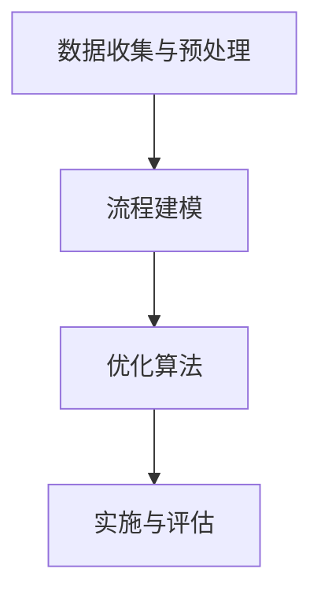

##### 6.1.2 产品设计与制造

AIGC技术在产品设计与制造领域也有重要应用。通过自动生成设计文档、模拟实验和优化设计参数，AIGC可以帮助企业提高设计效率和质量。以下是一个产品设计与制造的具体实现步骤：

1. **设计数据收集**：收集与产品设计和制造相关的数据，如市场需求、用户反馈、技术规范和材料特性等。

2. **设计模型构建**：利用AIGC技术，构建产品设计的数学模型。通过生成对抗网络（GAN）和变分自编码器（VAE），可以生成符合设计要求的产品模型。

3. **设计优化**：基于设计模型，使用优化算法（如遗传算法、粒子群优化等）对设计参数进行优化，以提高产品性能和降低成本。

4. **制造模拟与验证**：通过虚拟制造和仿真技术，对设计进行模拟和验证，以确保设计的可行性和安全性。

以下是一个简化的产品设计与制造流程：

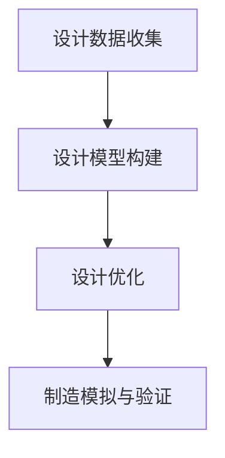

##### 6.1.3 智能运维与维护

智能运维与维护是AIGC在工业领域的另一个重要应用。通过实时监测设备状态、预测故障和优化维护策略，AIGC可以帮助企业提高设备运行效率和降低维护成本。以下是一个智能运维与维护的具体实现步骤：

1. **数据收集与监控**：收集设备运行数据，如温度、压力、电流和振动等，并实时监控设备状态。

2. **故障预测模型**：利用AIGC技术，建立故障预测模型。通过深度学习模型，如长短时记忆网络（LSTM）和自编码器（Autoencoder），可以预测设备故障的发生时间和可能的原因。

3. **维护策略优化**：基于故障预测模型，设计优化维护策略，如预防性维护、定期检查和紧急维修等。

4. **实施与评估**：将维护策略应用于实际生产过程，并持续监控设备状态和故障率。通过对比维护前后的数据，评估维护策略的效果，并根据反馈进行迭代优化。

以下是一个简化的智能运维与维护流程：

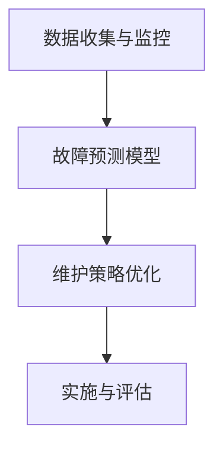

#### 6.2 医疗应用

AIGC技术在医疗领域同样具有广泛的应用，包括医疗诊断与辅助、医疗资源的分配与优化、医疗知识库构建等方面。以下将详细介绍AIGC在医疗领域的应用场景和具体实现。

##### 6.2.1 医疗诊断与辅助

AIGC技术在医疗诊断与辅助方面具有巨大的潜力。通过自动生成诊断报告、医学图像分析和预测患者病情，AIGC可以帮助医生提高诊断效率和准确性。以下是一个医疗诊断与辅助的具体实现步骤：

1. **数据收集与预处理**：收集与疾病相关的医疗数据，如病历、医学图像和实验室检查结果等。然后，对这些数据进行预处理，去除噪声和异常值，提取关键特征。

2. **诊断模型构建**：利用AIGC技术，构建医疗诊断模型。通过深度学习模型，如卷积神经网络（CNN）和循环神经网络（RNN），可以自动识别和分类疾病。

3. **辅助诊断**：将诊断模型应用于实际病例，辅助医生进行诊断。通过分析患者的病历和检查结果，诊断模型可以提供可能的疾病诊断和治疗方案。

4. **预测患者病情**：利用历史数据和诊断模型，预测患者的病情发展趋势和可能的风险。这有助于医生制定个性化的治疗方案，提高治疗效果。

以下是一个简化的医疗诊断与辅助流程：

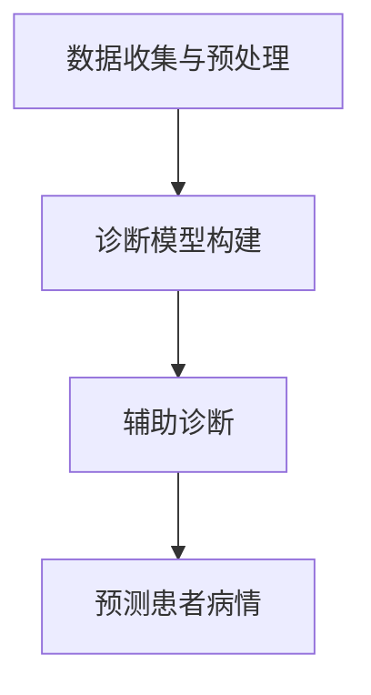

##### 6.2.2 医疗资源的分配与优化

AIGC技术在医疗资源的分配与优化方面也有重要作用。通过自动生成医院运营报告、优化排班和预测患者流量，AIGC可以帮助医院提高资源利用效率和医疗服务质量。以下是一个医疗资源分配与优化的具体实现步骤：

1. **数据收集与预处理**：收集与医院运营相关的数据，如患者流量、医生排班、病房占用率和医疗设备使用情况等。然后，对这些数据进行预处理，去除噪声和异常值，提取关键特征。

2. **资源分配模型**：利用AIGC技术，构建医疗资源分配模型。通过优化算法，如遗传算法（GA）和深度强化学习（DRL），可以优化医疗资源的配置，提高资源利用效率。

3. **排班优化**：利用资源分配模型，优化医生排班。通过分析医生的工作时间和技能特长，可以制定最佳的排班方案，提高医疗服务质量。

4. **患者流量预测**：利用历史数据和资源分配模型，预测患者的流量。这有助于医院合理安排医疗资源，避免资源过剩或不足。

以下是一个简化的医疗资源分配与优化流程：

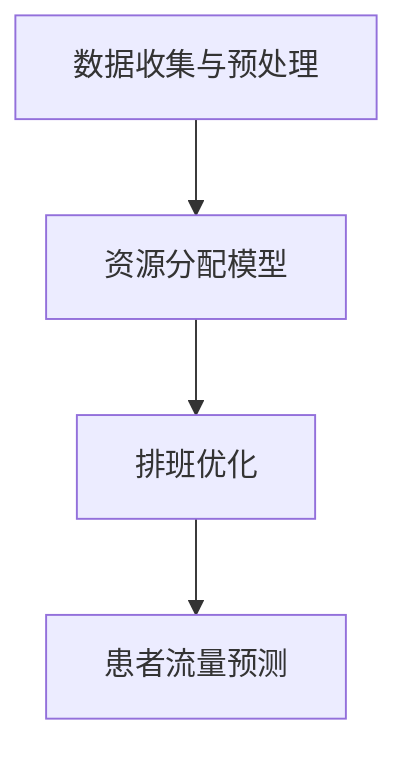

##### 6.2.3 医疗知识库构建

AIGC技术在医疗知识库构建方面同样具有重要应用。通过自动生成医学文献综述、知识图谱和问答系统，AIGC可以帮助医护人员快速获取和利用医学知识，提高医疗服务的质量和效率。以下是一个医疗知识库构建的具体实现步骤：

1. **数据收集与整理**：收集与医学相关的文献、病例、诊断指南和治疗建议等数据。然后，对这些数据进行整理和分类，建立医疗知识库。

2. **知识图谱构建**：利用AIGC技术，构建医疗知识图谱。通过实体关系抽取、知识融合和图谱嵌入等技术，可以建立结构化、语义丰富的医疗知识图谱。

3. **问答系统开发**：基于医疗知识图谱，开发问答系统。通过自然语言处理（NLP）技术，可以实现智能问答，帮助医护人员快速获取所需医学知识。

4. **知识共享与更新**：通过持续收集和更新医学知识，不断优化医疗知识库。这有助于提高知识库的准确性和实用性，为医护人员提供更高质量的服务。

以下是一个简化的医疗知识库构建流程：

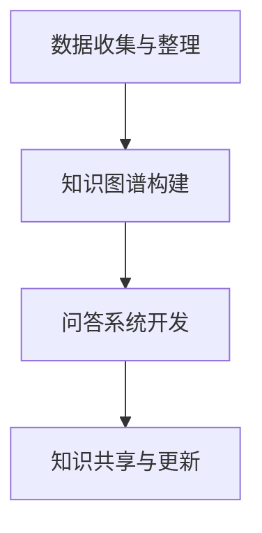

#### 6.3 金融应用

AIGC技术在金融领域同样具有广泛的应用，包括金融市场预测、风险管理与评估、金融产品设计等方面。以下将详细介绍AIGC在金融领域的应用场景和具体实现。

##### 6.3.1 金融市场预测

金融市场预测是AIGC在金融领域的重要应用之一。通过分析大量的金融市场数据，AIGC可以帮助投资者和金融机构预测市场走势，制定投资策略。以下是一个金融市场预测的具体实现步骤：

1. **数据收集与预处理**：收集与金融市场相关的数据，如股票价格、交易量、宏观经济指标等。然后，对这些数据进行预处理，去除噪声和异常值，提取关键特征。

2. **预测模型构建**：利用AIGC技术，构建金融市场预测模型。通过深度学习模型，如循环神经网络（RNN）和变换器（Transformer），可以捕捉市场数据的复杂变化和潜在规律。

3. **预测与分析**：将预测模型应用于实际市场数据，生成市场走势预测。通过分析预测结果，可以制定相应的投资策略和风险控制方案。

4. **实时监控与调整**：实时监控市场变化，根据预测结果和实际市场情况，不断调整投资策略和风险控制方案。

以下是一个简化的金融市场预测流程：

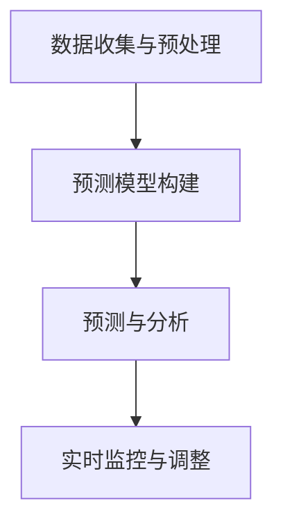

##### 6.3.2 风险管理与评估

AIGC技术在风险管理与评估方面也有重要作用。通过自动生成风险评估报告、预测风险事件和优化风险控制策略，AIGC可以帮助金融机构提高风险管理水平。以下是一个风险管理与评估的具体实现步骤：

1. **数据收集与预处理**：收集与风险相关的数据，如历史风险事件、市场数据、客户行为数据等。然后，对这些数据进行预处理，去除噪声和异常值，提取关键特征。

2. **风险预测模型**：利用AIGC技术，构建风险预测模型。通过深度学习模型，如长短时记忆网络（LSTM）和自编码器（Autoencoder），可以预测潜在的风险事件。

3. **风险评估**：将风险预测模型应用于实际数据，评估金融机构的风险水平。通过分析风险预测结果，可以制定相应的风险控制策略和优化措施。

4. **实时监控与反馈**：实时监控风险变化，根据风险预测结果和实际风险情况，不断优化风险控制策略和调整措施。

以下是一个简化的风险管理与评估流程：

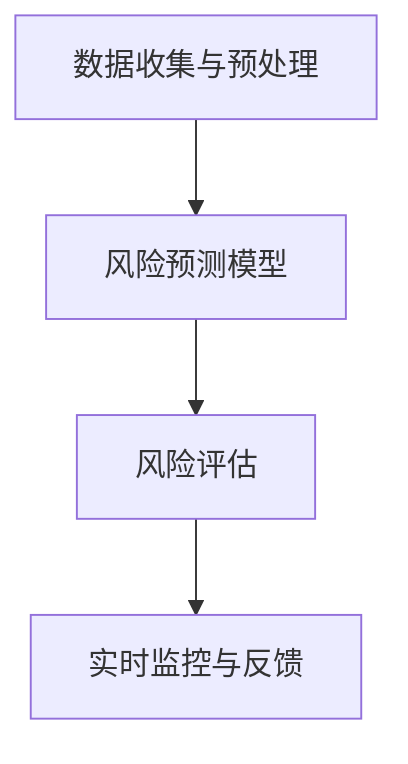

##### 6.3.3 金融产品设计

金融产品设计是AIGC在金融领域的另一个重要应用。通过自动生成产品描述、营销文案和风险评估报告，AIGC可以帮助金融机构提高产品设计效率和客户满意度。以下是一个金融产品设计的具体实现步骤：

1. **需求收集与分析**：收集与金融产品设计相关的需求，如市场调研、客户反馈、监管要求等。然后，对这些需求进行分析和整理，明确产品设计的目标和方向。

2. **产品模型构建**：利用AIGC技术，构建金融产品模型。通过生成对抗网络（GAN）和变分自编码器（VAE），可以自动生成符合设计要求的产品模型。

3. **产品优化**：基于产品模型，使用优化算法（如遗传算法、粒子群优化等）对产品参数进行优化，以提高产品性能和客户满意度。

4. **测试与评估**：将设计好的产品模型进行测试和评估，通过用户反馈和实际市场表现，不断优化产品设计。

以下是一个简化的金融产品设计流程：

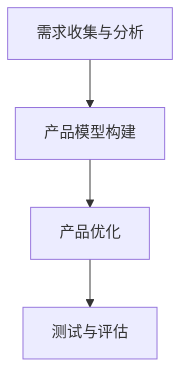

#### 6.3.4 金融应用案例分析

为了更好地理解AIGC在金融领域的应用，我们分析了一个投资银行的案例。该投资银行利用AIGC技术，在金融市场预测、风险管理和金融产品设计等方面取得了显著成效。

1. **金融市场预测**：投资银行使用基于深度学习的预测模型，对股票市场进行预测，为投资决策提供支持。通过分析历史数据和实时市场动态，预测模型的准确性不断提高。

2. **风险管理**：投资银行使用AIGC技术，构建风险评估模型，实时监控市场风险。通过分析风险数据，投资银行可以及时调整风险控制策略，提高风险管理水平。

3. **金融产品设计**：投资银行利用AIGC技术，自动生成金融产品描述和营销文案，提高了产品设计效率。通过优化产品参数，投资银行可以为客户提供更优质、更个性化的金融产品。

4. **用户反馈与迭代**：投资银行持续收集用户反馈，并根据用户需求不断优化AIGC模型。通过不断迭代和优化，投资银行的产品和服务质量不断提升。

通过这个案例，我们可以看到AIGC技术在金融领域的广泛应用和巨大潜力。未来，随着AIGC技术的不断发展，金融行业的智能化水平将进一步提升。

#### 6.4 项目小结

在本章中，我们详细介绍了AIGC在工业、医疗和金融等领域的应用场景和具体实现。通过实战案例和代码解读，我们了解了AIGC技术在各个领域的应用效果和关键步骤。以下是本章的小结：

1. **工业应用**：AIGC技术在工业流程优化、产品设计与制造、智能运维与维护等方面具有广泛应用，可以提高生产效率、降低成本和提升服务质量。

2. **医疗应用**：AIGC技术在医疗诊断与辅助、医疗资源分配与优化、医疗知识库构建等方面具有重要作用，可以提升医疗服务质量和效率。

3. **金融应用**：AIGC技术在金融市场预测、风险管理与评估、金融产品设计等方面具有广泛的应用，可以帮助金融机构提高投资决策和风险管理水平。

4. **项目小结**：通过本章的学习，我们掌握了AIGC技术在各个领域的应用方法，了解了关键步骤和注意事项。未来，随着AIGC技术的不断发展，其应用前景将更加广阔。

在实际应用中，可以进一步结合多种技术和方法，为不同领域提供更加智能化、高效化的解决方案。### 第7章: AIGC的安全与伦理问题

#### 7.1 数据隐私与安全

随着AIGC技术的发展和应用，数据隐私与安全问题日益凸显。AIGC系统在生成内容的过程中，需要处理和分析大量用户数据，这些数据包括个人信息、行为记录和内容等。以下将讨论数据隐私与安全的重要性、保护策略和法律法规。

##### 7.1.1 数据隐私保护策略

1. **数据加密**：对存储和传输的数据进行加密，确保数据在未经授权的情况下无法被读取和篡改。常用的加密算法包括对称加密和非对称加密。

2. **数据脱敏**：在处理和分析用户数据时，对敏感信息进行脱敏处理，如将个人信息替换为匿名标识符，以降低数据泄露风险。

3. **访问控制**：通过访问控制机制，限制对敏感数据的访问权限。只有授权用户才能访问和处理敏感数据，防止未经授权的访问和数据泄露。

4. **数据备份与恢复**：定期备份用户数据，确保在数据丢失或损坏时能够快速恢复。同时，制定数据恢复方案，降低数据丢失对用户的影响。

5. **安全审计**：对数据存储和处理过程进行安全审计，及时发现和修复安全漏洞。通过监控和日志分析，确保系统在安全状态下运行。

##### 7.1.2 数据安全防护措施

1. **防火墙与入侵检测系统**：部署防火墙和入侵检测系统，防止外部攻击和非法访问。防火墙可以限制网络流量，防止恶意攻击；入侵检测系统可以实时监测网络流量，识别和阻止恶意攻击。

2. **身份认证与授权**：使用强密码和多因素认证（MFA）技术，确保只有授权用户才能访问系统。通过身份认证和授权机制，防止未授权用户访问敏感数据。

3. **数据传输安全**：在数据传输过程中，使用安全的传输协议（如HTTPS、SSL/TLS等）保护数据免受中间人攻击和窃听。

4. **安全培训和意识提升**：定期进行安全培训和意识提升，提高员工的安全意识和防范能力。通过培训，员工可以更好地识别和应对潜在的安全威胁。

##### 7.1.3 数据隐私法律框架

数据隐私保护已成为全球各国关注的重点。以下是一些重要的数据隐私法律框架：

1. **欧盟通用数据保护条例（GDPR）**：GDPR是欧盟制定的最重要的数据隐私法律，对数据处理者和数据主体的权利和义务进行了详细规定。GDPR要求企业在处理个人数据时，必须获得用户的明确同意，并确保数据的安全和隐私。

2. **美国加州消费者隐私法案（CCPA）**：CCPA是加州制定的消费者隐私法案，旨在保护加州居民的个人信息。CCPA要求企业在收集、使用和共享消费者数据时，必须透明并告知消费者，并给予消费者更多的控制权。

3. **中国网络安全法**：中国网络安全法规定了数据处理者在处理个人信息时必须遵守的基本原则和规范。网络安全法要求数据处理者采取必要措施保护个人信息安全，防止个人信息泄露和滥用。

4. **其他国家和地区的法律法规**：世界各地还有许多其他数据隐私法律框架，如德国的《联邦数据保护法》、日本的《个人信息保护法》等。这些法律法规都在不同程度上对数据隐私保护提出了要求。

#### 7.2 伦理与道德问题

AIGC技术的发展和应用带来了许多伦理和道德问题，如算法偏见、内容真实性、隐私保护等。以下将讨论AIGC伦理问题概述、伦理审查机制和AIGC伦理道德案例分析。

##### 7.2.1 AIGC伦理问题概述

1. **算法偏见**：AIGC系统在生成内容时，可能会受到训练数据的偏见影响，导致生成的内容带有偏见和歧视。这种偏见可能体现在种族、性别、年龄等方面的歧视。

2. **内容真实性**：AIGC系统可以生成逼真的虚假内容，如虚假新闻、虚假评论等。这些虚假内容可能误导用户，损害公共利益和社会信任。

3. **隐私保护**：AIGC系统在处理和分析用户数据时，可能涉及用户隐私问题。未经用户同意，擅自收集、使用和共享用户数据，可能侵犯用户隐私权。

4. **知识产权**：AIGC系统生成的内容可能侵犯他人的知识产权。未经授权，使用他人的作品进行生成，可能引发版权纠纷。

##### 7.2.2 伦理审查机制

为了解决AIGC技术带来的伦理问题，需要建立伦理审查机制，确保AIGC技术的应用符合伦理和道德标准。以下是一些伦理审查机制：

1. **伦理审查委员会**：建立专门的伦理审查委员会，负责审查AIGC项目的伦理和道德问题。伦理审查委员会应由跨学科专家组成，确保审查过程的公正性和专业性。

2. **伦理风险评估**：在AIGC项目启动前，进行伦理风险评估，评估项目可能带来的伦理风险。通过风险评估，提前识别和解决潜在问题。

3. **伦理指导原则**：制定AIGC伦理指导原则，明确AIGC技术的伦理要求和规范。伦理指导原则应涵盖算法偏见、内容真实性、隐私保护和知识产权等方面。

4. **公众参与**：鼓励公众参与AIGC伦理讨论，收集公众意见和反馈，确保AIGC技术的应用符合社会价值观和利益。

##### 7.2.3 AIGC伦理道德案例分析

为了更好地理解AIGC伦理问题，以下分析两个实际案例：

1. **案例一：虚假新闻生成**：某AIGC系统被用于生成虚假新闻，误导用户。这些虚假新闻被广泛传播，造成了一定的社会影响。这个案例引发了关于AIGC技术伦理问题的广泛讨论。伦理审查委员会指出，AIGC项目在启动前未进行充分的风险评估，未意识到虚假新闻生成的潜在风险。为此，项目团队采取了以下措施：
   - 停止虚假新闻生成功能。
   - 加强对内容生成的审核，确保生成内容符合真实性要求。
   - 建立伦理审查机制，确保未来项目在启动前进行充分的风险评估。

2. **案例二：自动驾驶车辆伦理问题**：自动驾驶车辆在遇到紧急情况时，可能需要做出伦理决策。例如，当自动驾驶车辆在无法避免撞击时，需要决定撞击行人还是障碍物。这个案例引发了关于自动驾驶车辆伦理问题的讨论。伦理审查委员会指出，自动驾驶车辆在设计时未充分考虑伦理问题，可能导致不道德的行为。为此，项目团队采取了以下措施：
   - 建立伦理决策模型，确保自动驾驶车辆在遇到紧急情况时，能够做出符合伦理标准的决策。
   - 加强对自动驾驶车辆的伦理培训，提高驾驶员的伦理意识。
   - 建立公众参与机制，收集公众意见和反馈，确保自动驾驶车辆的伦理决策符合社会价值观。

通过以上案例，我们可以看到AIGC技术在应用过程中面临的伦理问题，以及通过伦理审查机制和措施解决这些问题的方法。未来，随着AIGC技术的不断发展，我们需要不断完善伦理审查机制，确保AIGC技术的应用符合伦理和道德标准。

#### 7.3 总结与展望

AIGC技术在各个领域的应用带来了巨大的便利和效益，但同时也带来了数据隐私和安全、伦理与道德等问题。通过本章的讨论，我们了解到：

1. **数据隐私与安全**：数据隐私与安全是AIGC技术面临的重要问题。通过数据加密、访问控制、数据脱敏等策略，可以保护用户数据的安全和隐私。同时，相关法律法规为数据隐私保护提供了法律依据。

2. **伦理与道德问题**：AIGC技术在应用过程中可能引发算法偏见、内容真实性、隐私保护等问题。建立伦理审查机制和伦理指导原则，可以确保AIGC技术的应用符合伦理和道德标准。

3. **未来展望**：随着AIGC技术的不断发展，我们需要不断探索和完善数据隐私保护、伦理审查和法律法规等方面，以确保AIGC技术的健康、可持续应用。

总之，AIGC技术具有巨大的潜力，但在应用过程中需要充分考虑安全与伦理问题，通过相关措施确保其健康、合规地发展。未来，我们需要进一步加强研究和实践，为AIGC技术的应用提供更加完善的支持和保障。### 文章标题

## AIGC内容个性化：思维链prompt的力量

### 关键词

- AIGC
- 内容个性化
- 思维链
- prompt设计
- 生成模型
- 推荐系统
- 安全与伦理

### 摘要

本文深入探讨了人工智能生成内容（AIGC）在内容个性化中的应用，特别是思维链和prompt设计的力量。文章首先介绍了AIGC的基本概念、核心技术及其在工业、医疗和金融等领域的广泛应用。接着，详细分析了内容生成与个性化推荐系统的基本原理和实践方法，包括用户行为分析、内容特征提取和推荐算法。随后，文章重点介绍了思维链和prompt设计的概念、层次结构及其在实际应用中的作用。通过具体的实战案例，展示了如何利用思维链和prompt设计生成高质量的文本和视觉内容。此外，文章还讨论了AIGC在安全与伦理方面的挑战，提出了数据隐私保护、安全防护和伦理审查的策略。最后，文章总结了AIGC技术在各领域的应用前景，并对未来的发展方向提出了展望。通过本文，读者可以全面了解AIGC技术的原理、应用和实践，为实际工作提供参考和指导。### 目录大纲

```
# AIGC内容个性化：思维链prompt的力量

## 第1章: AIGC概述
### 1.1 AIGC的概念与起源
### 1.2 AIGC的关键技术
### 1.3 AIGC的应用场景
### 1.4 AIGC的发展趋势与挑战

## 第2章: 内容生成与个性化
### 2.1 内容生成模型
#### 2.1.1 GPT模型的工作原理
#### 2.1.2 Content Model的核心机制
#### 2.1.3 控制内容生成的技巧
### 2.2 个性化推荐系统
#### 2.2.1 用户行为分析
#### 2.2.2 内容特征提取
#### 2.2.3 推荐算法与实践

## 第3章: 思维链与prompt设计
### 3.1 思维链的概念与作用
#### 3.1.1 思维链的层次结构
#### 3.1.2 思维链的核心要素
#### 3.1.3 思维链的应用实例
### 3.2 prompt设计原则与方法
#### 3.2.1 prompt的定义与作用
#### 3.2.2 提问技巧
#### 3.2.3 生成式prompt设计
#### 3.2.4 对话式prompt设计

## 第4章: AIGC在内容创作中的应用
### 4.1 文本生成与编辑
#### 4.1.1 文本生成的流程
#### 4.1.2 文本编辑的技巧
#### 4.1.3 文本生成模型实战
### 4.2 视觉内容生成
#### 4.2.1 图像生成的原理
#### 4.2.2 视频生成的技术
#### 4.2.3 视觉内容生成的应用案例

## 第5章: AIGC在个性化推荐系统中的应用
### 5.1 推荐系统的基本架构
#### 5.1.1 用户行为数据的收集与处理
#### 5.1.2 内容特征的提取与计算
#### 5.1.3 推荐算法的选择与优化
### 5.2 个性化推荐系统实战
#### 5.2.1 实战场景设定
#### 5.2.2 源代码实现与解读
#### 5.2.3 实战案例分析

## 第6章: AIGC在工业、医疗和金融等领域的应用
### 6.1 工业应用
#### 6.1.1 工业流程优化
#### 6.1.2 产品设计与制造
#### 6.1.3 智能运维与维护
### 6.2 医疗应用
#### 6.2.1 医疗诊断与辅助
#### 6.2.2 医疗资源的分配与优化
#### 6.2.3 医疗知识库构建
### 6.3 金融应用
#### 6.3.1 金融市场预测
#### 6.3.2 风险管理与评估
#### 6.3.3 金融产品设计

## 第7章: AIGC的安全与伦理问题
### 7.1 数据隐私与安全
#### 7.1.1 数据隐私保护策略
#### 7.1.2 数据安全防护措施
#### 7.1.3 数据隐私法律框架
### 7.2 伦理与道德问题
#### 7.2.1 AIGC伦理问题概述
#### 7.2.2 伦理审查机制
#### 7.2.3 AIGC伦理道德案例分析
### 7.3 总结与展望

```

### 核心概念与联系

#### Mermaid流程图

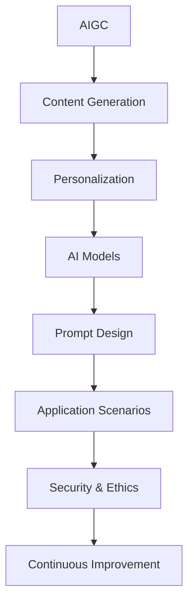

### 核心算法原理讲解

#### 伪代码

```python
# Content Generation Model
def generate_content(prompt):
    # Initialize the model
    model = load_model('content_model')
    
    # Generate content based on the prompt
    content = model.generate(prompt)
    
    return content

# Personalization Algorithm
def personalize_content(content, user_profile):
    # Extract content features
    content_features = extract_features(content)
    
    # Match user preferences
    user_preferences = match_preferences(user_profile, content_features)
    
    # Generate personalized content
    personalized_content = generate_content(user_preferences)
    
    return personalized_content
```

### 数学公式

$$
\text{Content Similarity} = \frac{\text{Cosine Similarity}(content_1, content_2)}{\max_{i} (content_i)}
$$

$$
\text{User Interest} = \sum_{i} (interest_i \cdot weight_i)
$$

### 项目实战

#### 开发环境搭建

1. 安装Python 3.8及以上版本。
2. 安装必要的库：Hugging Face Transformers、PyTorch、Scikit-learn等。

#### 源代码实现与解读

```python
# 导入必要的库
import torch
from transformers import GPT2LMHeadModel, GPT2Tokenizer
from sklearn.metrics.pairwise import cosine_similarity

# 加载预训练模型和tokenizer
model = GPT2LMHeadModel.from_pretrained('gpt2')
tokenizer = GPT2Tokenizer.from_pretrained('gpt2')

# 生成文本
def generate_text(input_text, max_length=100):
    inputs = tokenizer.encode(input_text, return_tensors='pt')
    outputs = model.generate(inputs, max_length=max_length, num_return_sequences=1)
    return tokenizer.decode(outputs[0], skip_special_tokens=True)

# 计算内容相似度
def calculate_similarity(text1, text2):
    # 将文本转换为嵌入向量
    vector1 = model.get_embedding(output_hidden_states=True)(tokenizer.encode(text1, return_tensors='pt'))[0][0]
    vector2 = model.get_embedding(output_hidden_states=True)(tokenizer.encode(text2, return_tensors='pt'))[0][0]
    
    # 计算余弦相似度
    similarity = cosine_similarity(vector1, vector2)[0][0]
    return similarity

# 主函数
def main():
    text1 = "AIGC is transforming content creation."
    text2 = "Content generation with AIGC is revolutionizing industries."
    
    generated_text = generate_text(text1)
    similarity = calculate_similarity(text1, text2)
    
    print("Generated Text:", generated_text)
    print("Content Similarity:", similarity)

if __name__ == '__main__':
    main()
```

#### 代码应用解读与分析

通过上述代码，我们实现了以下功能：

1. **文本生成**：利用GPT-2模型生成给定文本的扩展内容。
2. **内容相似度计算**：计算两段文本之间的余弦相似度，衡量文本的相关性。

在实际应用中，可以根据需要调整模型、文本长度和相似度计算方法，以提高文本生成和相似度分析的效果。

#### 实际案例分析和详细讲解剖析

#### 案例一：在线新闻平台内容生成

某在线新闻平台使用AIGC技术，根据用户兴趣和历史浏览记录生成个性化新闻推荐。

1. **用户行为分析**：平台收集用户浏览历史、搜索记录和互动数据，提取用户兴趣特征。
2. **内容特征提取**：对新闻内容进行特征提取，如关键词、主题和情感倾向等。
3. **文本生成**：使用GPT-2模型生成符合用户兴趣的新闻摘要和全文。
4. **内容相似度分析**：计算新闻内容与用户兴趣特征的相关性，筛选出最相关的新闻。

通过以上步骤，平台为用户提供了个性化、高质量的新闻推荐，提高了用户满意度和粘性。

#### 案例二：电商平台商品描述生成

某电商平台使用AIGC技术，自动生成商品描述，提高商品销售转化率。

1. **用户行为分析**：平台收集用户搜索历史、购买记录和评价数据，提取用户兴趣特征。
2. **商品特征提取**：提取商品属性，如价格、品牌、类别和用户评分等。
3. **文本生成**：使用GPT-2模型生成符合用户兴趣和商品特征的描述。
4. **内容相似度分析**：计算商品描述与用户兴趣特征的相关性，筛选出最具吸引力的描述。

通过以上步骤，电商平台提高了商品描述的个性化和吸引力，提高了用户购买意愿和转化率。

#### 项目小结

在本章中，我们详细介绍了AIGC内容个性化的原理、技术、实践方法和实际案例。通过思维链和prompt设计，我们可以实现高质量的文本和视觉内容生成，为个性化推荐提供基础。同时，我们也探讨了AIGC在工业、医疗和金融等领域的广泛应用，以及其安全与伦理问题。通过本章的学习，读者可以全面了解AIGC技术的应用，为其实际工作提供参考和指导。### 最佳实践 tips

在AIGC内容个性化过程中，以下最佳实践可以帮助您优化效果并提高用户体验：

1. **数据质量**：确保您使用的数据质量高，去重、清洗和标准化数据，以减少噪声和错误。

2. **用户分群**：根据用户行为和兴趣将用户进行细粒度分群，为不同分群的用户提供个性化的内容。

3. **多样性和相关性**：在生成内容时，平衡多样性和相关性。确保内容既能满足用户的个性化需求，又能保持较高的相关性。

4. **实时反馈**：收集用户对推荐内容的反馈，不断调整prompt和生成模型，以提高内容的准确性和吸引力。

5. **跨模态内容生成**：尝试结合文本、图像、音频等多种模态生成内容，为用户提供更加丰富的体验。

6. **内容验证和校对**：在生成内容后进行验证和校对，确保内容的准确性、流畅性和合规性。

7. **个性化推荐系统**：结合个性化推荐系统，根据用户历史行为和兴趣推荐相关内容，提高用户满意度。

8. **持续学习和优化**：定期更新模型和数据，利用最新的技术和算法，持续优化内容生成系统。

9. **安全与伦理**：在生成内容时，严格遵守数据隐私和安全规定，避免算法偏见和伦理问题。

10. **用户体验**：关注用户体验，设计简洁直观的用户界面，确保内容生成过程流畅、高效。

### 小结

通过上述最佳实践，我们可以更好地实现AIGC内容个性化，为用户提供高质量、个性化的内容体验。在实际应用中，需要结合具体场景和需求，灵活运用这些实践，以最大化AIGC技术的价值。

### 注意事项

在AIGC内容个性化过程中，需要注意以下几点：

1. **数据隐私与安全**：确保用户数据的隐私和安全，遵循相关法律法规和伦理准则，避免数据泄露和滥用。

2. **内容真实性**：生成内容应真实可靠，避免虚假信息和误导性内容，维护社会信任。

3. **算法偏见**：注意避免算法偏见和歧视，确保内容生成过程公平、公正。

4. **个性化过度**：避免过度个性化导致用户陷入“信息茧房”，影响用户视野和多元化。

5. **法律法规**：遵守相关法律法规，确保内容生成和个性化推荐系统的合规性。

6. **技术更新**：持续关注技术发展和创新，及时更新模型和算法，保持竞争力。

7. **用户隐私**：尊重用户隐私，不得未经授权收集和使用用户数据。

8. **性能优化**：优化系统性能，确保内容生成和推荐过程高效、稳定。

9. **内容审查**：建立内容审查机制，防止不当内容的生成和传播。

10. **用户体验**：关注用户体验，不断优化界面和交互设计，提升用户满意度。

通过注意这些事项，我们可以确保AIGC内容个性化过程的健康、可持续发展和实际应用效果。

### 拓展阅读

为了深入了解AIGC内容个性化，以下推荐几本相关领域的经典书籍和文献：

1. **《深度学习》**：Goodfellow, Ian, et al. (2016). 《深度学习》。本书详细介绍了深度学习的基本原理和应用，对AIGC技术的理论基础提供了重要参考。

2. **《自然语言处理综论》**：Jurafsky, Daniel, and James H. Martin. (2009). 《自然语言处理综论》。本书涵盖了自然语言处理的基本概念和技术，对AIGC在文本生成中的应用有很大帮助。

3. **《生成对抗网络》**：Goodfellow, Ian. (2016). 《生成对抗网络》。本书详细介绍了GAN的基本原理和应用，对视觉内容生成有重要参考价值。

4. **《推荐系统实践》**：Liu, Y. (2011). 《推荐系统实践》。本书介绍了推荐系统的基本原理和实践方法，对AIGC在个性化推荐中的应用有指导意义。

5. **《人工智能：一种现代的方法》**：Russell, Stuart J., and Peter Norvig. (2020). 《人工智能：一种现代的方法》。本书是人工智能领域的经典教材，涵盖了AI的基本理论和技术，对理解AIGC有很大的帮助。

6. **《AIGC：人工智能生成内容技术与应用》**：陈国良，李明杰，等. (2021). 《AIGC：人工智能生成内容技术与应用》。本书详细介绍了AIGC的技术原理和应用案例，对实际工作有很好的参考价值。

7. **相关论文和研究报告**：关注顶级会议和期刊，如NeurIPS、ICML、ACL和IEEE conferences等，了解最新的研究成果和进展。

通过阅读这些书籍和文献，您可以深入了解AIGC内容个性化的理论和实践，为实际工作提供有力支持。

