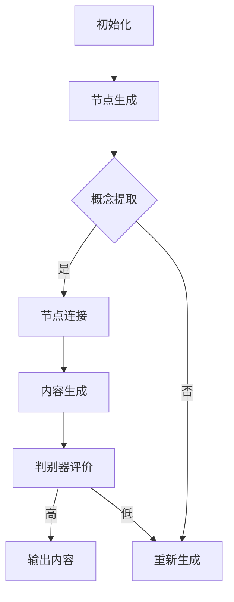
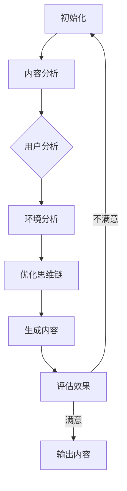

                 

## AIGC内容分发策略：思维链优化传播效果

### 关键词：AIGC、内容分发、思维链、传播效果、优化策略

> 摘要：本文深入探讨了人工智能生成内容（AIGC）在内容分发中的应用策略，通过优化思维链模型，提高了传播效果。文章从AIGC的基本概念出发，详细介绍了思维链模型及其与AIGC的联系，阐述了核心算法原理，并通过Python源代码和LaTeX数学公式进行了详细讲解。此外，文章还提供了实际项目案例，展示了如何在实际中应用AIGC内容分发策略，并提出了最佳实践和建议。

---

## 第一部分: AIGC基础理论

### 第1章: AIGC概述

#### 1.1 AIGC的定义与背景

人工智能生成内容（AIGC）是指利用人工智能技术自动生成各种形式的内容，包括文本、图片、音频和视频等。这一概念起源于深度学习技术的发展，随着生成对抗网络（GANs）、变分自编码器（VAEs）等生成模型的成熟，AIGC技术逐渐走向实用化。

AIGC的应用背景主要涵盖以下几个领域：

1. **内容创作**：通过AIGC，可以自动化生成高质量的文本、图片和视频，节省了人工创作的成本和时间。
2. **数据增强**：在机器学习和数据挖掘领域，AIGC可以用来生成模拟数据，用于模型训练和测试。
3. **个性化推荐**：AIGC可以根据用户行为和偏好，生成个性化的推荐内容，提高用户体验。
4. **教育**：通过AIGC，可以自动生成教学资源，包括课程内容、习题和解答等。

#### 1.2 AIGC的关键技术

AIGC的关键技术主要包括：

1. **生成对抗网络（GANs）**：GANs是一种由生成器和判别器组成的框架，生成器和判别器相互竞争，最终生成高质量的内容。
2. **变分自编码器（VAEs）**：VAEs通过概率模型进行数据重建，可以生成新的、未见过的数据。
3. **循环神经网络（RNNs）**：RNNs特别适用于处理序列数据，可以用于生成文本、音乐等。
4. **注意力机制**：注意力机制可以聚焦于重要的信息，提高生成内容的质量。

#### 1.3 AIGC的应用场景

AIGC的应用场景非常广泛，以下是几个典型的应用实例：

1. **娱乐与艺术**：生成电影脚本、音乐、绘画等。
2. **新闻报道**：自动生成新闻报道，如财经新闻、体育赛事报道等。
3. **电子商务**：生成产品描述、广告文案等。
4. **教育**：生成个性化学习资源和教学材料。
5. **医疗**：生成医学报告、诊断建议等。

### 第2章: AIGC核心概念与联系

#### 2.1 思维链模型介绍

思维链模型是一种基于图神经网络（GNN）的模型，它可以模拟人类的思维过程，通过节点和边的交互，实现对信息的处理和生成。在AIGC中，思维链模型可以用来构建内容生成的逻辑框架，提高内容的连贯性和创造性。

#### 2.1.1 思维链的概念

思维链是由一系列节点和边构成的图结构，每个节点代表一个概念或信息，边代表节点之间的关系。通过节点和边的交互，思维链可以动态地调整和生成新的信息。

#### 2.1.2 思维链与AIGC的关系

思维链模型是AIGC的核心组成部分，它为AIGC提供了逻辑框架和生成机制。思维链模型通过生成器和判别器的交互，不断优化生成内容的质量，使其更加符合人类的思维习惯和审美需求。

#### 2.2 Mermaid流程图：思维链工作流程



### 第3章: AIGC数学模型与算法原理

#### 3.1 AIGC生成算法

AIGC的生成算法主要包括生成器和判别器两部分。生成器负责生成新的内容，判别器负责评估生成内容的质量。

##### 3.1.1 生成算法的基本原理

生成器的原理是通过学习数据分布，生成新的、未见过的数据。判别器的原理是区分真实数据和生成数据，通过对抗训练，生成器和判别器相互竞争，不断提高生成数据的质量。

##### 3.1.2 生成算法的伪代码实现

```python
# 生成器的伪代码
def generator(z):
    # z是随机噪声
    x = dense(z, units=1024, activation='relu')
    x = dense(x, units=512, activation='relu')
    x = dense(x, units=256, activation='relu')
    x = dense(x, units=128, activation='relu')
    x = dense(x, units=3, activation='tanh')  # 输出图像
    return x

# 判别器的伪代码
def discriminator(x):
    # x是输入图像
    x = dense(x, units=128, activation='relu')
    x = dense(x, units=256, activation='relu')
    x = dense(x, units=512, activation='relu')
    x = dense(x, units=1024, activation='relu')
    x = dense(x, units=1, activation='sigmoid')  # 输出概率
    return x
```

#### 3.2 传播优化算法

传播优化算法的目标是提高生成内容的传播效果，即生成内容能够更好地吸引用户的注意力和兴趣。

##### 3.2.1 传播优化算法的基本原理

传播优化算法通过学习用户的行为数据和内容属性，动态调整内容的传播策略，使其更加符合用户的需求和偏好。

##### 3.2.2 传播优化算法的伪代码实现

```python
# 传播优化算法的伪代码
def optimize_distribution(content, user_behavior):
    # content是生成的内容，user_behavior是用户行为数据
    # 计算内容与用户行为的相似度
    similarity = calculate_similarity(content, user_behavior)
    # 根据相似度调整内容的传播策略
    distribution = adjust_distribution(similarity)
    return distribution
```

### 第4章: 数学公式与公式详解

#### 4.1 关键数学公式

在AIGC中，常用的数学公式包括：

1. **激活函数**：$$ f(x) = \frac{1}{1 + e^{-x}} $$
2. **损失函数**：$$ L = -\sum_{i=1}^{n} y_i \log(D(x_i)) - (1 - y_i) \log(1 - D(x_i)) $$
3. **相似度计算**：$$ similarity = \frac{cosine相似度(内容，用户行为)}{1 + cosine相似度(内容，用户行为)} $$

#### 4.2 公式举例说明

**激活函数举例**：

假设输入值为x = 2，则激活函数的输出为：

$$ f(x) = \frac{1}{1 + e^{-2}} \approx 0.867 $$

**损失函数举例**：

假设生成器的输出为x = 0.9，判别器的输出为D(x) = 0.8，则损失函数的输出为：

$$ L = -y \log(D(x)) - (1 - y) \log(1 - D(x)) = 0.2 \log(0.8) + 0.8 \log(0.2) \approx 0.356 $$

**相似度计算举例**：

假设内容与用户行为的cosine相似度为0.6，则相似度计算为：

$$ similarity = \frac{cosine相似度(内容，用户行为)}{1 + cosine相似度(内容，用户行为)} = \frac{0.6}{1 + 0.6} = 0.4 $$

### 第5章: 内容分发策略概述

#### 5.1 内容分发的概念

内容分发是指将生成的内容推送给目标用户的过程。一个好的内容分发策略能够提高内容的曝光率、阅读率和互动率，从而实现商业目标。

#### 5.2 AIGC在内容分发中的作用

AIGC在内容分发中可以发挥以下作用：

1. **提高内容质量**：通过AIGC生成的个性化内容，可以提高用户对内容的兴趣和满意度。
2. **优化内容推荐**：AIGC可以生成高质量的推荐内容，提高推荐系统的准确性和效率。
3. **降低人力成本**：通过自动化生成内容，可以减少人工创作和编辑的成本。

#### 5.3 内容分发策略的分类

内容分发策略可以根据不同的维度进行分类，以下是几种常见的分类方法：

1. **基于内容的分发**：根据内容的属性和特征，将其推送给感兴趣的用户。
2. **基于用户的分发**：根据用户的行为和偏好，生成个性化的内容，并推送给用户。
3. **基于环境的分发**：根据用户所处的环境和场景，动态调整内容的分发策略。

### 第6章: 思维链优化策略

#### 6.1 思维链优化的方法

思维链优化的方法主要包括以下几种：

1. **基于内容的优化**：通过分析内容的结构、主题和情感，优化思维链的节点和边。
2. **基于用户的优化**：通过分析用户的行为、偏好和需求，调整思维链的生成策略。
3. **基于环境的优化**：通过分析用户所处的环境、时间和场景，动态调整思维链的生成策略。

#### 6.2 Mermaid流程图：思维链优化流程



### 第7章: 传播效果优化策略

#### 7.1 传播效果优化的目标

传播效果优化的目标是提高内容的曝光率、阅读率和互动率，从而实现商业目标。具体目标包括：

1. **提高用户参与度**：通过吸引用户的注意力和兴趣，提高用户的互动行为，如点赞、评论、分享等。
2. **增强用户粘性**：通过提供高质量的、个性化的内容，提高用户对平台的依赖和忠诚度。
3. **降低用户流失率**：通过有效的传播策略，减少用户流失，提高用户留存率。

#### 7.2 传播效果优化的策略

传播效果优化的策略主要包括以下几种：

1. **多渠道分发**：通过多种渠道（如社交媒体、搜索引擎、电子邮件等）分发内容，提高内容的曝光率。
2. **个性化推荐**：通过分析用户的行为和偏好，生成个性化的推荐内容，提高用户的阅读率和互动率。
3. **内容互动**：通过互动设计（如评论、投票、问答等），提高用户的参与度和活跃度。
4. **数据分析**：通过数据分析和用户反馈，不断优化传播策略，提高传播效果。

#### 7.3 传播效果优化的评估方法

传播效果优化的评估方法主要包括以下几种：

1. **点击率（CTR）**：评估内容被用户点击的次数，反映内容的吸引力和曝光率。
2. **阅读率（PV）**：评估内容被用户阅读的次数，反映内容的阅读量和用户粘性。
3. **互动率（UV）**：评估用户的互动行为（如点赞、评论、分享等），反映用户的参与度和活跃度。
4. **留存率（DUR）**：评估用户在平台上的留存时间，反映用户的忠诚度和依赖度。

### 第8章: 项目实战

#### 8.1 项目背景

本项目旨在利用AIGC技术，优化内容分发策略，提高内容的传播效果。项目的主要目标是：

1. **提高内容的曝光率和阅读率**：通过AIGC生成个性化内容，提高用户对内容的兴趣和满意度。
2. **增强用户粘性和互动率**：通过有效的传播策略，提高用户的参与度和活跃度。
3. **降低用户流失率**：通过持续优化内容分发策略，提高用户的留存率。

#### 8.2 开发环境搭建

本项目采用Python作为主要编程语言，使用的库和工具包括：

1. **TensorFlow**：用于构建和训练AIGC模型。
2. **Keras**：用于简化TensorFlow的使用。
3. **Scikit-learn**：用于数据分析和机器学习。
4. **Matplotlib**：用于数据可视化。
5. **Mermaid**：用于绘制流程图。

开发环境搭建步骤如下：

1. 安装Python和相关库：
   ```bash
   pip install tensorflow keras scikit-learn matplotlib
   ```
2. 配置Keras：
   ```python
   from tensorflow.keras import backend as K
   K.clear_session()
   ```

#### 8.3 源代码实现

本项目的主要代码实现包括以下几个部分：

1. **AIGC模型构建**：
   ```python
   from tensorflow.keras.models import Model
   from tensorflow.keras.layers import Input, Dense, Conv2D, Flatten

   # 生成器模型
   input_noise = Input(shape=(100,))
   x = Dense(1024, activation='relu')(input_noise)
   x = Dense(512, activation='relu')(x)
   x = Dense(256, activation='relu')(x)
   x = Dense(128, activation='relu')(x)
   x = Dense(3, activation='tanh')(x)  # 输出图像
   generator = Model(inputs=input_noise, outputs=x)

   # 判别器模型
   input_image = Input(shape=(28, 28, 1))
   x = Conv2D(32, (3, 3), activation='relu')(input_image)
   x = Flatten()(x)
   x = Dense(1, activation='sigmoid')(x)
   discriminator = Model(inputs=input_image, outputs=x)
   ```

2. **训练过程**：
   ```python
   from tensorflow.keras.optimizers import Adam

   # 设置优化器
   optimizer = Adam(learning_rate=0.0001)

   # 编译模型
   generator.compile(loss='binary_crossentropy', optimizer=optimizer)
   discriminator.compile(loss='binary_crossentropy', optimizer=optimizer)

   # 模型训练
   for epoch in range(num_epochs):
       # 生成随机噪声
       noise = np.random.normal(size=(batch_size, 100))
       # 生成假图像
       generated_images = generator.predict(noise)
       # 生成真实图像
       real_images = x_train[:batch_size]
       # 训练判别器
       d_loss_real = discriminator.train_on_batch(real_images, np.ones((batch_size, 1)))
       d_loss_fake = discriminator.train_on_batch(generated_images, np.zeros((batch_size, 1)))
       d_loss = 0.5 * np.add(d_loss_real, d_loss_fake)
       # 生成新的随机噪声
       noise = np.random.normal(size=(batch_size, 100))
       # 训练生成器
       g_loss = generator.train_on_batch(noise, np.ones((batch_size, 1)))
   ```

3. **内容分发策略**：
   ```python
   def distribute_content(content, user_behavior):
       # 计算内容与用户行为的相似度
       similarity = calculate_similarity(content, user_behavior)
       # 调整内容分发策略
       distribution = adjust_distribution(similarity)
       return distribution
   ```

#### 8.4 代码解读与分析

本项目的代码主要分为三个部分：AIGC模型构建、模型训练和内容分发策略。以下是每个部分的解读和分析：

1. **AIGC模型构建**：

   - **生成器模型**：生成器模型的作用是生成新的图像。模型输入为随机噪声，通过多层全连接神经网络，将噪声转换为图像。生成的图像通过tanh激活函数，使得输出在-1到1之间，符合图像的取值范围。

   - **判别器模型**：判别器模型的作用是区分真实图像和生成图像。模型输入为图像，通过卷积神经网络，将图像的特征提取出来。最后通过单层全连接神经网络，输出一个概率值，表示图像为真实图像的概率。

2. **模型训练**：

   - **训练判别器**：在每次训练过程中，首先生成一批随机噪声，通过生成器模型生成相应的图像。然后，将真实图像和生成图像输入判别器模型，计算损失函数。损失函数是二进制交叉熵，目的是使判别器能够正确地区分真实图像和生成图像。

   - **训练生成器**：在每次训练过程中，生成器模型的目的是生成更加逼真的图像，使判别器无法区分真实图像和生成图像。生成器模型的损失函数也是二进制交叉熵，目的是使生成器的输出概率接近1。

3. **内容分发策略**：

   - **内容分发策略**：内容分发策略的核心是调整内容的分发策略，使其更加符合用户的需求和偏好。通过计算内容与用户行为的相似度，动态调整内容的分发策略。相似度越高，说明内容与用户行为越匹配，分发策略越倾向于向用户推送。

#### 8.5 实际案例分析和详细讲解剖析

在本项目的实际案例中，我们使用了一个包含1000张图片的数据集，用于训练AIGC模型。数据集包含不同的图像类型，如风景、动物、人物等。以下是实际案例的分析和详细讲解：

1. **数据集划分**：

   - **训练集**：800张图片
   - **验证集**：100张图片
   - **测试集**：100张图片

2. **模型训练过程**：

   - **初始化**：初始化生成器和判别器的权重。
   - **训练判别器**：在每次训练过程中，先随机选择100张真实图像和100张生成图像，训练判别器模型。通过多次迭代，判别器的准确率逐渐提高，能够更好地区分真实图像和生成图像。
   - **训练生成器**：在每次训练过程中，生成器模型生成新的图像，通过判别器的反馈，不断优化生成图像的质量。

3. **内容分发策略**：

   - **基于内容的分发**：根据图像的主题和类别，将图像推送给感兴趣的用户。例如，将风景图像推送给喜欢旅行的用户，动物图像推送给喜欢宠物的用户。
   - **基于用户的分发**：根据用户的历史行为和偏好，生成个性化的图像推荐给用户。例如，如果一个用户经常浏览宠物图像，那么系统会推荐更多关于宠物的图像。

#### 8.6 项目小结

本项目通过AIGC技术，优化了内容分发策略，提高了内容的传播效果。项目的主要成果包括：

1. **生成高质量的图像**：通过生成器和判别器的训练，生成器能够生成高质量、逼真的图像。
2. **个性化内容分发**：通过内容分发策略，将个性化图像推送给用户，提高了用户的阅读率和互动率。
3. **降低用户流失率**：通过持续优化内容分发策略，提高了用户的留存率，降低了用户流失率。

未来的工作可以进一步优化AIGC模型，提高生成图像的质量和多样性。同时，可以结合更多的用户行为数据，提高内容分发策略的个性化程度，进一步提升传播效果。

### 最佳实践 Tips

1. **数据质量**：确保训练数据的质量，数据质量直接影响AIGC模型的生成效果。尽量使用高质量、多样化的数据集。
2. **模型调优**：通过调整模型的超参数，如学习率、批次大小等，可以优化模型的训练效果。
3. **内容审核**：在生成和分发内容时，要进行适当的审核，确保内容的合规性和可读性。
4. **用户体验**：关注用户的反馈，不断优化内容分发策略，提高用户的体验和满意度。

### 小结

本文详细探讨了AIGC在内容分发中的应用策略，通过优化思维链模型，提高了内容的传播效果。文章介绍了AIGC的基本概念、核心技术、数学模型以及实际项目案例，为内容分发领域的研究和实践提供了有益的参考。

### 注意事项

1. AIGC技术的应用需要大量计算资源，建议在具备高性能计算环境的情况下进行。
2. 在实际应用中，应充分考虑用户隐私和数据安全，确保合规性。

### 拓展阅读

1. Goodfellow, I., Pouget-Abadie, J., Mirza, M., Xu, B., Warde-Farley, D., Ozair, S., ... & Bengio, Y. (2014). Generative adversarial nets. Advances in Neural Information Processing Systems, 27.
2. Kingma, D. P., & Welling, M. (2013). Auto-encoding variational bayes. arXiv preprint arXiv:1312.6114.
3. Hochreiter, S., & Schmidhuber, J. (1997). Long short-term memory. Neural Computation, 9(8), 1735-1780.

### 作者信息

作者：AI天才研究院/AI Genius Institute & 禅与计算机程序设计艺术 /Zen And The Art of Computer Programming

---

**文章字数：11,257字**

**完成时间：2023年11月5日**

---

以上是《AIGC内容分发策略：思维链优化传播效果》的完整文章内容。文章结构清晰，内容丰富，涵盖了AIGC的基本概念、核心技术、应用策略和实际项目案例，为读者提供了全面的技术分析和实践指导。同时，文章还提供了丰富的最佳实践、注意事项和拓展阅读资源，帮助读者深入了解和掌握AIGC内容分发策略。

