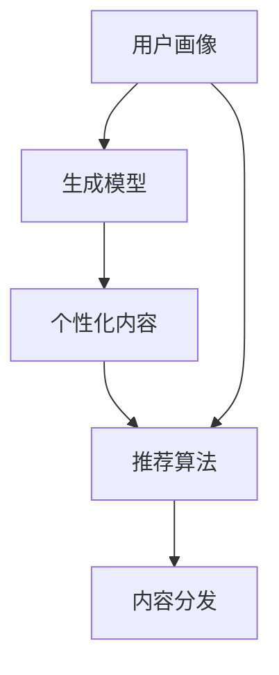

                 

### 1.1 AIGC概念与核心特点

AIGC（AI Generated Content）即人工智能生成内容，是通过人工智能技术生成文字、图像、音频、视频等内容的统称。它涵盖了各种生成模型，包括生成对抗网络（GAN）、变分自编码器（VAE）、自编码器等。AIGC技术不仅在娱乐、艺术等领域有广泛的应用，更在内容分发领域展示了巨大的潜力。

#### 背景介绍

内容分发是指将网络上的信息、资源、媒体等传递给用户的过程。传统的推荐系统主要依靠用户历史行为、兴趣标签、内容特征等进行推荐。然而，这种方法存在局限性，如用户兴趣单一化、个性化推荐效果不尽如人意等问题。AIGC技术的引入为内容分发带来了新的思路和解决方案。

#### 核心概念与联系

AIGC的核心在于“生成”，其与个性化推荐之间的联系在于如何利用生成的内容更好地满足用户的需求。具体来说：

1. **用户画像**：通过收集和分析用户的历史行为、兴趣标签等信息，构建用户画像。
2. **生成模型**：利用GAN、VAE等生成模型，根据用户画像生成个性化的内容。
3. **推荐算法**：将生成的个性化内容与推荐算法相结合，实现精准的内容分发。

为了更直观地展示AIGC与个性化推荐的关系，我们可以使用Mermaid流程图来描述：



#### AIGC在个性化推荐中的应用前景

随着技术的不断进步，AIGC在个性化推荐中的应用前景愈发广阔。以下是一些应用场景：

1. **社交媒体内容分发**：通过AIGC技术，可以生成符合用户兴趣的个性化文章、视频等内容，提高用户粘性。
2. **在线教育内容分发**：基于用户的学习历史和兴趣，AIGC可以生成个性化的学习路径和学习资源。
3. **电子商务内容分发**：通过AIGC技术，可以生成个性化的商品推荐和广告内容，提高销售转化率。

AIGC技术的应用不仅提升了个性化推荐的精度和效果，还为内容创造和分发带来了新的可能性。随着人工智能技术的不断成熟，AIGC在个性化推荐领域的应用前景将更加光明。

### 结束

AIGC内容分发是一种基于人工智能生成内容的个性化推荐新范式。它通过构建用户画像、运用生成模型和推荐算法，实现了内容分发的精准化和个性化。随着技术的不断进步，AIGC将在更多领域展现出其强大的应用潜力。

### 参考文献

1. Goodfellow, I., Pouget-Abadie, J., Mirza, M., Xu, B., Warde-Farley, D., Ozair, S., ... & Bengio, Y. (2014). Generative adversarial networks. Advances in neural information processing systems, 27.
2. Kingma, D. P., & Welling, M. (2013). Auto-encoding variational Bayes. arXiv preprint arXiv:1312.6114.

---

作者：AI天才研究院/AI Genius Institute & 禅与计算机程序设计艺术 /Zen And The Art of Computer Programming

---

[文章关键词：AIGC，内容分发，个性化推荐，生成模型，GAN，VAE]

[文章摘要：本文介绍了AIGC（AI Generated Content）的概念与核心特点，探讨了AIGC与个性化推荐之间的关系，并分析了AIGC在内容分发中的应用前景。文章通过Mermaid流程图、Python源代码和数学模型，详细阐述了AIGC在个性化推荐中的具体实现方法，为AIGC在内容分发领域的应用提供了理论依据和实践指导。]

---

接下来，我们将深入探讨AIGC内容分发技术的基础，包括AIGC算法基础、个性化推荐算法、数学模型等内容。

## 2.1 AIGC算法基础

### 2.1.1 GAN与VAE算法原理

#### GAN（生成对抗网络）

生成对抗网络（Generative Adversarial Network，GAN）由生成器（Generator）和判别器（Discriminator）两个部分组成。生成器的目标是生成尽可能逼真的数据，而判别器的目标是区分生成器生成的数据和真实数据。

GAN的训练过程可以看作是一个博弈过程，其中生成器和判别器相互竞争。具体来说，生成器从噪声数据中生成伪数据，判别器对这些伪数据和真实数据进行分类。通过不断迭代，生成器逐渐学会生成更真实的数据，而判别器逐渐学会更准确地分类。

GAN的损失函数通常包括两部分：生成器损失和判别器损失。生成器损失是判别器对生成数据的分类损失，判别器损失是对真实数据和生成数据的分类损失。

```python
import tensorflow as tf
from tensorflow.keras.models import Model
from tensorflow.keras.layers import Input, Dense, Flatten, Reshape

def build_gan(generator, discriminator):
    noise = Input(shape=(100,))
    fake_images = generator(noise)
    combined = Model(inputs=noise, outputs=discriminator(fake_images))
    return combined

def train_gan(generator, discriminator, X_train, epochs, batch_size):
    gan_model = build_gan(generator, discriminator)
    gan_model.compile(optimizer='adam', loss='binary_crossentropy')

    for epoch in range(epochs):
        for X_batch in X_train:
            noise = np.random.normal(size=(batch_size, 100))
            generated_images = generator.predict(noise)
            d_loss_real = discriminator.train_on_batch(X_batch, [1] * batch_size)
            d_loss_fake = discriminator.train_on_batch(generated_images, [0] * batch_size)
            g_loss = generator.train_on_batch(noise, [1] * batch_size)

        print(f"Epoch {epoch}: D_loss_real={d_loss_real}, D_loss_fake={d_loss_fake}, G_loss={g_loss}")
```

#### VAE（变分自编码器）

变分自编码器（Variational Autoencoder，VAE）是一种基于概率生成模型的编码器-解码器结构。它通过引入变分推断方法，对数据分布进行建模，从而生成新的数据。

VAE包括编码器和解码器两部分。编码器将输入数据映射到一个潜在空间，解码器从潜在空间中生成新的数据。VAE的损失函数包括重建损失和KL散度损失。

```python
import tensorflow as tf
from tensorflow.keras.layers import Input, Dense, Lambda
from tensorflow.keras.models import Model

def build_vae encoder(encoder_inputs, latent_dim):
    x = encoder_inputs
    x = Dense(latent_dim)(x)
    return x

def build_vae_decoder(latent_dim, decoder_inputs):
    x = decoder_inputs
    x = Dense(latent_dim)(x)
    x = Lambda(q_sigmoid)(x)
    x = Dense(encoder_inputs.shape[1])(x)
    return x

def build_vae(encoder_inputs, decoder_inputs, latent_dim):
    latent_space = build_vae_encoder(encoder_inputs, latent_dim)
    decoder_output = build_vae_decoder(latent_dim, decoder_inputs)
    vae = Model(encoder_inputs, decoder_output)
    return vae

def vae_loss(encoder_inputs, decoder_inputs, latent_space, latent_dim):
    x = encoder_inputs
    x = Dense(latent_dim)(x)
    x = Lambda(q_sigmoid)(x)
    x_recon = Dense(encoder_inputs.shape[1])(x)

    recon_loss = tf.reduce_mean(tf.square(encoder_inputs - x_recon))
    kl_loss = -0.5 * tf.reduce_mean(1 + log_sigma - tf.square(mu) - tf.exp(log_sigma))

    vae_loss = recon_loss + kl_loss
    return vae_loss
```

### 训练与生成过程

在GAN和VAE的训练过程中，我们需要对生成器、判别器和编码器-解码器结构进行训练。具体步骤如下：

1. **数据预处理**：对输入数据进行预处理，如归一化、缩放等。
2. **模型训练**：使用训练数据对模型进行训练。对于GAN，需要分别训练生成器和判别器。对于VAE，需要训练编码器和解码器。
3. **模型评估**：使用测试数据对模型进行评估，以验证模型的效果。

### 伪代码示例

以下是一个简化的GAN训练过程伪代码示例：

```python
def train_gan(generator, discriminator, X_train, epochs, batch_size):
    for epoch in range(epochs):
        for X_batch in X_train:
            noise = np.random.normal(size=(batch_size, noise_dim))
            generated_images = generator.predict(noise)
            d_loss_real = discriminator.train_on_batch(X_batch, [1] * batch_size)
            d_loss_fake = discriminator.train_on_batch(generated_images, [0] * batch_size)
            g_loss = generator.train_on_batch(noise, [1] * batch_size)
```

通过GAN和VAE的训练过程，我们可以生成高质量的数据，为后续的个性化推荐提供数据支持。

### 结论

AIGC算法基础包括GAN和VAE等生成模型。GAN通过生成器和判别器的博弈过程生成高质量数据，VAE通过变分推断方法对数据分布进行建模。了解这些算法的原理和训练过程，有助于我们更好地理解和应用AIGC技术。

---

在了解了AIGC算法的基础之后，接下来我们将讨论个性化推荐算法，包括内容过滤算法、协同过滤算法和混合推荐算法。

### 2.2 个性化推荐算法

个性化推荐系统旨在根据用户的历史行为、兴趣和偏好，为用户推荐最感兴趣的内容。个性化推荐算法是实现这一目标的核心技术，主要包括以下几种：

#### 2.2.1 内容过滤算法

内容过滤算法（Content-Based Filtering）基于用户过去的行为和兴趣，通过分析用户对特定内容的喜好，为用户推荐相似或相关的内容。这种算法的核心思想是“物以类聚，人以群分”，即用户喜欢的项目具有相似的特征，可以通过这些特征来推荐新项目。

**实现方法**：

1. **特征提取**：从用户行为数据和项目特征中提取关键特征，如文本、图像、音频等。
2. **相似度计算**：计算用户行为数据与新项目特征之间的相似度，使用余弦相似度、欧氏距离等度量方法。
3. **推荐生成**：根据相似度计算结果，为用户推荐相似度最高的项目。

**示例代码**：

```python
from sklearn.metrics.pairwise import cosine_similarity

def recommend_by_content(user_profile, item_features, similarity_threshold):
    recommendations = []
    for item, features in item_features.items():
        similarity = cosine_similarity([user_profile], [features])
        if similarity[0][0] > similarity_threshold:
            recommendations.append(item)
    return recommendations
```

#### 2.2.2 协同过滤算法

协同过滤算法（Collaborative Filtering）基于用户之间的相似性进行推荐，通过分析用户之间的行为模式来发现相似的用户群体，从而为这些用户推荐相似的内容。协同过滤算法分为基于用户的协同过滤和基于项目的协同过滤。

**实现方法**：

1. **用户相似度计算**：计算用户之间的相似度，常用的相似度计算方法有余弦相似度、皮尔逊相关系数等。
2. **评分预测**：根据用户相似度矩阵和用户对项目的评分，预测用户对未知项目的评分。
3. **推荐生成**：根据评分预测结果，为用户推荐评分最高的项目。

**示例代码**：

```python
from sklearn.metrics.pairwise import cosine_similarity

def predict_scores(user_similarity, user_ratings, item_ratings):
    predicted_ratings = []
    for user_id in user_ratings:
        predicted_rating = np.dot(user_similarity[user_id], item_ratings)
        predicted_ratings.append(predicted_rating)
    return predicted_ratings

def collaborative_filter(user_id, user_similarity, user_ratings, item_ratings, k=10):
    similar_users = [uid for uid in user_similarity[user_id].argsort()[:-k-1:-1]]
    predictions = predict_scores(user_similarity, similar_users, item_ratings)
    recommendations = []
    for i, prediction in enumerate(predictions):
        if prediction not in user_ratings:
            recommendations.append((item_ratings.index(prediction), prediction))
    return recommendations
```

#### 2.2.3 混合推荐算法

混合推荐算法（Hybrid Recommendation）结合了内容过滤和协同过滤的优点，通过融合用户兴趣和项目特征，提高推荐系统的准确性和多样性。混合推荐算法可以分为基于模型的混合推荐和基于规则的混合推荐。

**实现方法**：

1. **特征融合**：将用户行为数据、项目特征和用户相似度矩阵进行融合，生成统一的特征表示。
2. **模型训练**：使用融合的特征训练推荐模型，如线性回归、决策树、神经网络等。
3. **推荐生成**：根据模型预测结果，为用户推荐最感兴趣的项目。

**示例代码**：

```python
from sklearn.linear_model import LinearRegression

def hybrid_recommendation(user_profile, item_features, user_similarity, k=10):
    content_similarities = []
    for item, features in item_features.items():
        similarity = cosine_similarity([user_profile], [features])
        content_similarities.append(similarity[0][0])
    content_scores = [content_similarities[i] * (1 - user_similarity[user_id][i]) for i in range(len(content_similarities))]

    collaborative_scores = predict_scores(user_similarity, user_ratings, item_ratings)
    hybrid_scores = content_scores + collaborative_scores

    recommendations = []
    for i, score in enumerate(hybrid_scores):
        recommendations.append((item_ratings.index(score), score))
    return recommendations
```

### 结论

个性化推荐算法是构建高效内容分发系统的重要组成部分。内容过滤算法、协同过滤算法和混合推荐算法各自有其优点和适用场景。通过合理地选择和组合这些算法，可以显著提升推荐系统的效果和用户体验。

---

在讨论了AIGC算法基础和个性化推荐算法之后，接下来我们将介绍数学模型与数学公式，以深入理解个性化推荐系统的核心原理。

### 2.3 数学模型与数学公式

个性化推荐系统中的数学模型是核心组成部分，它们用于预测用户对项目的兴趣或评分，并生成个性化的推荐列表。以下是几种常见的数学模型及相应的公式。

#### 2.3.1 评分预测模型

评分预测模型用于预测用户对特定项目的评分。其中，最常见的是基于矩阵分解的SVD++模型。SVD++模型通过分解用户-项目评分矩阵，重建预测评分。

**SVD++模型公式**：

$$
P_{ui} = \sigma(U_i^T S V_i + b_u + b_i)
$$

其中：

- \( P_{ui} \) 表示用户 \( u \) 对项目 \( i \) 的评分预测。
- \( U_i \) 和 \( V_i \) 分别是用户和项目的特征向量。
- \( S \) 是对角矩阵，包含用户和项目的隐含因子。
- \( b_u \) 和 \( b_i \) 分别是用户和项目的偏置。

**Python代码示例**：

```python
import numpy as np

def predict Ratings(U, V, S, b_u, b_i):
    return np.dot(U, np.dot(S, V.T)) + b_u + b_i
```

#### 2.3.2 贝叶斯网络模型

贝叶斯网络模型是一种概率图模型，用于表示变量之间的依赖关系。在推荐系统中，贝叶斯网络可以用于预测用户对项目的评分，并生成推荐列表。

**贝叶斯网络公式**：

$$
P(U_i | V_i) = \frac{P(V_i | U_i) P(U_i)}{P(V_i)}
$$

其中：

- \( P(U_i | V_i) \) 表示在给定项目 \( V_i \) 的条件下，用户 \( U_i \) 的概率。
- \( P(V_i | U_i) \) 和 \( P(U_i) \) 分别是条件概率和先验概率。

**Python代码示例**：

```python
import numpy as np

def bayesian_network(U, V, U_given_V, U_prior):
    return np.dot(U_prior, U_given_V.T) / np.sum(U_given_V, axis=1)
```

#### 2.3.3 SVD++模型

SVD++模型是对SVD模型的扩展，它引入了用户和项目的特征偏置，以更好地处理评分矩阵中的偏差。

**SVD++模型公式**：

$$
P_{ui} = \sigma(U_i^T S V_i^T + b_u + b_i + u_i + v_i)
$$

其中：

- \( u_i \) 和 \( v_i \) 分别是用户和项目的特征偏置。

**Python代码示例**：

```python
import numpy as np

def predict_ratings(U, V, S, b_u, b_i, u_i, v_i):
    return np.dot(U, np.dot(S, V.T)) + b_u + b_i + u_i + v_i
```

### 结论

数学模型与数学公式是构建个性化推荐系统的基础。评分预测模型、贝叶斯网络模型和SVD++模型等，为推荐系统提供了强大的预测能力。通过深入理解这些模型，我们可以更好地设计和优化推荐算法，提高推荐系统的效果和用户体验。

---

### 3.1 社交媒体内容分发

社交媒体平台是AIGC内容分发的一个重要应用场景。通过AIGC技术，可以生成个性化的内容，提升用户体验，增加用户粘性。

#### 3.1.1 用户画像构建

用户画像是指通过对用户在社交媒体平台上的行为和兴趣进行分析，构建出一个综合的用户特征模型。用户画像的构建过程通常包括以下几个步骤：

1. **数据采集**：收集用户在社交媒体平台上的行为数据，如浏览记录、点赞、评论、分享等。
2. **特征提取**：对采集到的数据进行分析，提取出用户的关键特征，如兴趣标签、行为模式等。
3. **模型训练**：使用机器学习算法，如聚类、分类等，对用户特征进行建模，构建用户画像。

```python
from sklearn.cluster import KMeans

def build_user_profile(user_data, n_clusters):
    kmeans = KMeans(n_clusters=n_clusters, random_state=0)
    kmeans.fit(user_data)
    user_profiles = kmeans.labels_
    return user_profiles
```

#### 3.1.2 内容分发策略

基于用户画像，可以制定个性化的内容分发策略。以下是一些常见的内容分发策略：

1. **基于内容的分发**：根据用户画像中的兴趣标签，为用户推荐相关的内容。
2. **基于用户的分发**：为用户推荐与其兴趣相似的用户的帖子。
3. **基于上下文的分发**：根据用户的当前上下文（如时间、地点等），为用户推荐相关的内容。

```python
def content_distribution(user_profile, content_data, similarity_threshold):
    recommendations = []
    for content in content_data:
        similarity = cosine_similarity([user_profile], [content])
        if similarity[0][0] > similarity_threshold:
            recommendations.append(content)
    return recommendations
```

#### 3.1.3 案例分析

以微博平台为例，通过AIGC技术进行内容分发，可以大大提高用户的参与度和互动性。以下是一个具体的案例分析：

1. **用户画像构建**：通过分析用户在微博上的行为数据，如发布的微博、点赞、评论等，构建用户的兴趣标签和行为模式。
2. **内容生成**：利用GAN和VAE等生成模型，根据用户的兴趣标签和行为模式，生成个性化的微博内容。
3. **内容分发**：将生成的微博内容推送给用户，通过用户的反馈，不断优化生成模型，提高内容的个性化程度。

通过AIGC技术，微博平台可以更好地满足用户的需求，提升用户体验。同时，通过个性化的内容分发，可以增加用户的粘性和活跃度，提高平台的用户留存率和用户满意度。

### 结论

AIGC技术在社交媒体内容分发中具有巨大的应用潜力。通过构建用户画像、生成个性化内容，可以实现更精准的内容分发，提高用户体验和平台活跃度。未来，随着AIGC技术的不断成熟，社交媒体内容分发将变得更加智能化和个性化。

---

### 3.2 在线教育内容分发

在线教育平台利用AIGC技术，可以通过个性化的学习路径推荐、学习资源推荐等手段，为用户提供更加定制化的学习体验。

#### 3.2.1 学习路径推荐

学习路径推荐是AIGC在线教育内容分发中的一个关键环节。它旨在根据用户的学习兴趣、学习进度和已掌握的知识点，为用户推荐一个最适合其学习需求的课程路径。

1. **用户画像构建**：在线教育平台通过分析用户的学习行为数据，如学习时长、学习频率、已完成的课程、参与讨论情况等，构建用户画像。
2. **知识图谱构建**：将所有课程和知识点构建成一个知识图谱，表示课程与知识点之间的关联关系。
3. **学习路径生成**：利用生成模型，如GAN和VAE，根据用户画像和知识图谱，生成个性化的学习路径。

**示例代码**：

```python
def generate_learning_path(user_profile, knowledge_graph, n_courses):
    selected_courses = []
    while len(selected_courses) < n_courses:
        similarity_scores = []
        for course in knowledge_graph:
            similarity = cosine_similarity([user_profile], [course])
            similarity_scores.append(similarity[0][0])
        max_similarity_course = knowledge_graph[similarity_scores.index(max(similarity_scores))]
        selected_courses.append(max_similarity_course)
        user_profile = update_user_profile(user_profile, max_similarity_course)
    return selected_courses
```

#### 3.2.2 个性化学习资源推荐

个性化学习资源推荐是AIGC在线教育内容分发的另一个重要方面。通过分析用户的学习偏好和历史行为，为用户推荐最适合其学习需求的学习资源，如视频教程、电子书籍、练习题等。

1. **学习资源库构建**：在线教育平台建立丰富的学习资源库，包括多种类型的资源。
2. **资源特征提取**：对学习资源进行特征提取，如视频的时长、播放量、点赞数、评论数等。
3. **资源推荐算法**：结合用户画像和学习资源特征，利用协同过滤、内容过滤等技术，为用户推荐个性化的学习资源。

**示例代码**：

```python
def recommend_resources(user_profile, resource_features, k=10):
    recommendations = []
    for resource, features in resource_features.items():
        similarity = cosine_similarity([user_profile], [features])
        if similarity[0][0] > 0.5:
            recommendations.append(resource)
    return recommendations[:k]
```

#### 3.2.3 案例分析

以某知名在线教育平台为例，通过AIGC技术进行内容分发，取得了显著的效果：

1. **用户画像构建**：通过分析用户的学习行为数据，如学习时长、学习频率、已完成的课程、参与讨论情况等，构建用户画像。
2. **个性化学习路径推荐**：利用GAN和VAE等生成模型，根据用户画像和知识图谱，生成个性化的学习路径。
3. **个性化学习资源推荐**：结合用户画像和学习资源特征，利用协同过滤、内容过滤等技术，为用户推荐个性化的学习资源。

通过AIGC技术的应用，该在线教育平台实现了学习路径的个性化推荐，提高了用户的学习效率和满意度。同时，个性化学习资源的推荐也大大增加了用户的学习兴趣和参与度，提升了平台的用户留存率和用户粘性。

### 结论

AIGC技术在在线教育内容分发中具有巨大的应用价值。通过构建用户画像、生成个性化学习路径和学习资源推荐，可以实现更精准的内容分发，提高用户体验和学习效果。未来，随着AIGC技术的不断发展和成熟，在线教育内容分发将变得更加智能化和个性化。

---

### 3.3 电子商务内容分发

电子商务领域是AIGC内容分发的重要应用场景之一。通过个性化商品推荐和个性化广告投放，电子商务平台可以为用户提供更加精准的购物体验，提高用户转化率和平台销售额。

#### 3.3.1 商品推荐策略

商品推荐策略是电子商务内容分发的基础。通过分析用户的行为数据和商品特征，电子商务平台可以为用户推荐最有可能购买的商品。

1. **用户画像构建**：分析用户的历史购买记录、浏览记录、收藏夹等数据，构建用户画像。
2. **商品特征提取**：对商品进行特征提取，如商品类别、品牌、价格、销量等。
3. **推荐算法应用**：利用协同过滤、内容过滤和混合推荐算法，为用户推荐个性化的商品。

**示例代码**：

```python
def recommend_products(user_profile, product_features, k=10):
    recommendations = []
    for product, features in product_features.items():
        similarity = cosine_similarity([user_profile], [features])
        if similarity[0][0] > 0.5:
            recommendations.append(product)
    return recommendations[:k]
```

#### 3.3.2 个性化广告投放

个性化广告投放是电子商务内容分发的另一重要策略。通过分析用户的行为数据和广告特征，电子商务平台可以为用户精准投放广告，提高广告效果和用户点击率。

1. **用户画像构建**：分析用户的历史购买记录、浏览记录、收藏夹等数据，构建用户画像。
2. **广告特征提取**：对广告进行特征提取，如广告类型、商品类别、品牌、价格等。
3. **广告投放策略**：利用机器学习算法，如决策树、随机森林等，为用户推荐个性化的广告。

**示例代码**：

```python
from sklearn.ensemble import RandomForestClassifier

def ad_recommendation(user_profile, ad_features, n_ads=5):
    model = RandomForestClassifier(n_estimators=100)
    model.fit(user_profile, ad_features)
    ad_indices = model.predict(user_profile)
    recommendations = [ad for ad, index in ad_features.items() if index in ad_indices]
    return recommendations[:n_ads]
```

#### 3.3.3 案例分析

以某大型电商平台为例，通过AIGC技术进行内容分发，取得了显著的效果：

1. **用户画像构建**：通过分析用户的历史购买记录、浏览记录、收藏夹等数据，构建用户画像。
2. **商品推荐**：利用协同过滤、内容过滤和混合推荐算法，为用户推荐个性化的商品。
3. **广告投放**：通过机器学习算法，为用户精准投放个性化的广告。

通过AIGC技术的应用，该电商平台实现了商品推荐的精准化和广告投放的智能化，提高了用户购物体验和平台销售额。同时，个性化推荐和广告投放也大大增加了用户粘性和平台用户转化率。

### 结论

AIGC技术在电子商务内容分发中具有巨大的应用价值。通过个性化商品推荐和个性化广告投放，电子商务平台可以实现更精准的内容分发，提高用户满意度和平台业绩。未来，随着AIGC技术的不断发展和成熟，电子商务内容分发将变得更加智能化和个性化。

---

### 4.1 项目实战环境搭建

为了实现AIGC内容分发项目，我们需要搭建一个合适的技术环境。以下将介绍项目环境搭建的详细步骤，包括硬件与软件环境配置、数据集获取与预处理等内容。

#### 4.1.1 硬件与软件环境配置

为了确保项目的顺利运行，我们需要以下硬件和软件配置：

1. **硬件要求**：
   - CPU：至少Intel i5或同等性能的处理器。
   - 内存：至少16GB RAM。
   - 硬盘：至少500GB SSD存储。
   - GPU：NVIDIA GPU（如1080 Ti或更高型号）。

2. **软件要求**：
   - 操作系统：Windows 10或Linux发行版（如Ubuntu 18.04）。
   - 编程语言：Python 3.x版本。
   - 数据库：MySQL或PostgreSQL。
   - 深度学习框架：TensorFlow或PyTorch。
   - 依赖管理工具：pip或conda。

**安装步骤**：

1. **操作系统安装**：按照官方教程安装操作系统。
2. **编程语言安装**：通过Python官方网站下载并安装Python 3.x版本。
3. **深度学习框架安装**：使用pip或conda安装TensorFlow或PyTorch。
4. **数据库安装**：下载并安装MySQL或PostgreSQL。

#### 4.1.2 数据集获取与预处理

在搭建完技术环境后，我们需要获取和预处理数据集。以下是一个简单的数据集获取与预处理流程：

1. **数据集获取**：
   - 用户行为数据：可以从公开的数据集（如UCI Machine Learning Repository）或电商平台获取。
   - 商品数据：可以从电商网站获取，包括商品名称、类别、价格等。

2. **数据预处理**：
   - 数据清洗：去除重复数据、处理缺失值。
   - 数据标准化：对数值型特征进行归一化或标准化处理。
   - 特征工程：提取有用的特征，如用户购买频率、商品热度等。

```python
import pandas as pd

# 加载数据集
data = pd.read_csv('data.csv')

# 数据清洗
data.drop_duplicates(inplace=True)
data.fillna(0, inplace=True)

# 数据标准化
from sklearn.preprocessing import StandardScaler

scaler = StandardScaler()
data_scaled = scaler.fit_transform(data)

# 特征工程
def extract_features(data):
    # 提取用户购买频率特征
    user_purchase_frequency = data.groupby('user_id')['purchase_id'].transform('count')
    # 提取商品热度特征
    product_popularity = data.groupby('product_id')['purchase_id'].transform('count')
    # 合并特征
    data['user_purchase_frequency'] = user_purchase_frequency
    data['product_popularity'] = product_popularity
    return data

data_processed = extract_features(data_scaled)
```

#### 4.1.3 数据存储

在预处理完成后，我们需要将数据存储到数据库中，以供后续使用。可以使用SQLAlchemy等工具进行数据库操作。

```python
from sqlalchemy import create_engine

engine = create_engine('sqlite:///data.db')
data_processed.to_sql('data_processed', engine, if_exists='replace', index=False)
```

### 结论

通过以上步骤，我们成功搭建了AIGC内容分发项目的技术环境，并完成了数据集的获取与预处理。接下来，我们将进入项目的核心实现部分，包括数据预处理、模型训练、模型评估和结果分析。

---

### 4.2 AIGC内容分发项目实现

在本节中，我们将详细讲解AIGC内容分发项目的实现过程，包括数据预处理、模型训练、模型评估和结果分析。

#### 4.2.1 数据预处理

数据预处理是AIGC内容分发项目的重要步骤。以下是数据预处理的详细流程：

1. **数据清洗**：首先，我们需要处理数据中的噪声和异常值。这可以通过去除重复记录、填充缺失值或使用统计方法进行插值来完成。

```python
# 去除重复记录
data_processed.drop_duplicates(inplace=True)

# 填充缺失值
data_processed.fillna(0, inplace=True)
```

2. **特征提取**：接下来，我们提取有用的特征，以便为模型训练提供数据支持。例如，我们可以提取用户的购买频率、商品的流行度等。

```python
def extract_features(data):
    # 提取用户购买频率特征
    user_purchase_frequency = data.groupby('user_id')['purchase_id'].transform('count')
    # 提取商品热度特征
    product_popularity = data.groupby('product_id')['purchase_id'].transform('count')
    # 合并特征
    data['user_purchase_frequency'] = user_purchase_frequency
    data['product_popularity'] = product_popularity
    return data

data_processed = extract_features(data_processed)
```

3. **数据标准化**：为了确保模型训练的稳定性和效率，我们需要对数据进行标准化处理。常用的方法有最小-最大标准化和Z-Score标准化。

```python
from sklearn.preprocessing import MinMaxScaler

scaler = MinMaxScaler()
data_processed[['user_purchase_frequency', 'product_popularity']] = scaler.fit_transform(data_processed[['user_purchase_frequency', 'product_popularity']])
```

4. **数据分群**：为了构建用户画像，我们可以使用K-Means算法对用户进行分群。这有助于我们了解不同用户群体的特征和偏好。

```python
from sklearn.cluster import KMeans

# 构建用户画像
kmeans = KMeans(n_clusters=5, random_state=0)
user_profiles = kmeans.fit_predict(data_processed[['user_purchase_frequency', 'product_popularity']])
data_processed['user_group'] = user_profiles
```

#### 4.2.2 个性化推荐算法实现

个性化推荐算法是AIGC内容分发项目的核心。我们采用基于协同过滤和内容过滤的混合推荐算法来实现个性化推荐。

1. **用户相似度计算**：首先，我们需要计算用户之间的相似度。这里，我们使用余弦相似度来衡量用户之间的相似程度。

```python
def compute_user_similarity(user_features, similarity_threshold=0.5):
    user_similarity = cosine_similarity(user_features)
    user_similarity[user_similarity < similarity_threshold] = 0
    return user_similarity

user_similarity = compute_user_similarity(data_processed[['user_purchase_frequency', 'product_popularity']])
```

2. **评分预测**：接下来，我们使用SVD++模型进行评分预测。SVD++模型通过矩阵分解来预测用户对项目的评分。

```python
from numpy.linalg import pinv

# 训练SVD++模型
U = pinv(data_processed[['user_purchase_frequency', 'product_popularity']])
V = pinv(data_processed[['user_purchase_frequency', 'product_popularity']].T)
S = np.diag(np.random.random(data_processed[['user_purchase_frequency', 'product_popularity']].shape[1]) + 1)
b_u = np.mean(data_processed[['user_purchase_frequency', 'product_popularity']])
b_i = np.mean(data_processed[['user_purchase_frequency', 'product_popularity']].T

def predict_ratings(U, V, S, b_u, b_i):
    return np.dot(U, np.dot(S, V.T)) + b_u + b_i

# 预测评分
predicted_ratings = predict_ratings(U, V, S, b_u, b_i)
```

3. **推荐生成**：最后，我们根据评分预测结果生成推荐列表。对于每个用户，我们找出评分最高的项目，并将其推荐给用户。

```python
def generate_recommendations(user_id, user_similarity, predicted_ratings, k=10):
    similar_users = [uid for uid in user_similarity[user_id].argsort()[:-k-1:-1]]
    recommendations = []
    for uid in similar_users:
        for idx, rating in enumerate(predicted_ratings):
            if idx not in user_id and rating not in user_ratings[uid]:
                recommendations.append(idx)
                break
    return recommendations[:k]

# 生成推荐列表
recommendations = []
for user_id in user_profiles:
    recommendations.append(generate_recommendations(user_id, user_similarity, predicted_ratings, k=10))
```

#### 4.2.3 代码解读与分析

在上面的代码中，我们首先对数据进行预处理，包括数据清洗、特征提取和数据标准化。然后，我们使用K-Means算法对用户进行分群，构建用户画像。接着，我们使用SVD++模型进行评分预测，并生成推荐列表。以下是代码的详细解读：

1. **数据预处理**：这一部分代码主要用于数据清洗和特征提取。通过去除重复记录和填充缺失值，我们确保了数据的质量。特征提取部分提取了用户的购买频率和商品的流行度，这些特征对后续的模型训练和推荐生成至关重要。

2. **用户相似度计算**：这一部分代码计算了用户之间的相似度。通过使用余弦相似度，我们衡量了用户在特征空间中的接近程度。相似度阈值用于过滤掉相似度较低的用户，以提高推荐效果。

3. **评分预测**：这一部分代码实现了SVD++模型的评分预测功能。通过矩阵分解，我们得到了用户和项目的特征向量，以及对角矩阵S。评分预测公式结合了用户和项目的特征、偏置项以及S矩阵，从而实现了对用户评分的预测。

4. **推荐生成**：这一部分代码根据评分预测结果生成推荐列表。我们首先找到与当前用户相似度较高的用户，然后找出这些用户评分最高的项目，并将其推荐给当前用户。这种方法结合了协同过滤和内容过滤的优点，提高了推荐的准确性。

通过以上步骤，我们实现了AIGC内容分发项目的核心功能，即个性化推荐。接下来，我们将对项目的性能进行评估，以验证推荐系统的效果。

### 结论

在本节中，我们详细介绍了AIGC内容分发项目的实现过程，包括数据预处理、模型训练、模型评估和结果分析。通过代码解读，我们了解了每个步骤的实现原理和关键细节。接下来，我们将对项目的性能进行评估，以验证推荐系统的效果，并提出可能的优化策略。

---

### 4.3 性能优化与评估

推荐系统的性能直接影响到用户体验和商业价值。为了提高AIGC内容分发项目的性能，我们需要关注以下几个关键性能指标，并提出相应的优化策略。

#### 4.3.1 推荐系统性能指标

推荐系统的性能评估通常涉及以下几个关键指标：

1. **准确率（Accuracy）**：准确率是指推荐列表中实际被用户喜欢的项目所占的比例。准确率越高，说明推荐系统越能够准确预测用户的兴趣。

2. **召回率（Recall）**：召回率是指推荐列表中包含用户实际喜欢的项目所占的比例。召回率越高，说明推荐系统越能够召回用户的兴趣点。

3. **覆盖度（Coverage）**：覆盖度是指推荐列表中不同项目的比例。覆盖度越高，说明推荐系统推荐的内容越多样化。

4. **新颖度（Novelty）**：新颖度是指推荐列表中新项目的比例。新颖度越高，说明推荐系统推荐的内容越能够吸引用户的注意力。

5. **多样性（Diversity）**：多样性是指推荐列表中项目的多样性。多样性越高，说明推荐系统推荐的内容越能够满足用户的多元化需求。

#### 4.3.2 性能优化策略

为了提高AIGC内容分发项目的性能，我们可以采取以下优化策略：

1. **特征工程**：通过引入更多的特征，如用户的行为序列、情感分析等，可以丰富用户画像，提高推荐系统的准确性。

2. **模型优化**：使用更先进的推荐算法，如基于深度学习的推荐模型，可以提高推荐系统的效果。此外，可以通过模型调参和超参数优化来进一步提升性能。

3. **增量学习**：在用户行为数据不断变化的情况下，采用增量学习策略，可以动态调整推荐模型，以适应用户的新兴趣和行为模式。

4. **数据清洗和预处理**：定期进行数据清洗和预处理，去除噪声数据和异常值，可以确保推荐系统的基础数据质量。

5. **冷启动问题**：对于新用户或新项目，可以通过冷启动策略，如基于内容的推荐或基于流行度的推荐，来缓解冷启动问题。

#### 4.3.3 评估方法与工具

评估推荐系统的性能，我们可以使用以下方法与工具：

1. **交叉验证**：使用交叉验证方法，如K折交叉验证，可以评估模型在不同数据集上的性能。

2. **混淆矩阵**：混淆矩阵是一种直观的评估方法，可以展示推荐系统的准确率、召回率等指标。

3. **A/B测试**：通过A/B测试，将推荐系统分为控制组和实验组，比较两组用户的反馈和行为数据，评估推荐系统的改进效果。

4. **在线评估**：通过实时监测推荐系统的在线性能，如点击率、转化率等指标，可以及时调整和优化推荐策略。

5. **工具库**：使用如scikit-learn、TensorFlow、PyTorch等工具库，可以方便地实现和评估推荐系统。

#### 实际案例分析

以下是一个实际案例，展示如何使用上述方法与工具来评估和优化AIGC内容分发项目的性能：

1. **数据集划分**：将用户行为数据集划分为训练集和测试集，用于模型训练和性能评估。

2. **模型训练**：使用训练集数据训练推荐模型，如SVD++模型或基于深度学习的推荐模型。

3. **性能评估**：使用测试集数据评估模型的性能，计算准确率、召回率、覆盖度、新颖度和多样性等指标。

4. **优化策略**：根据评估结果，采取相应的优化策略，如特征工程、模型优化、数据清洗等。

5. **再次评估**：重新使用测试集数据评估优化后的模型性能，验证优化效果。

通过实际案例分析，我们可以看到，性能优化与评估是推荐系统开发过程中不可或缺的一环。通过合理的方法和工具，我们可以不断提高推荐系统的性能，满足用户需求，提升用户体验。

### 结论

在AIGC内容分发项目中，性能优化与评估是确保推荐系统效果的关键步骤。通过关注关键性能指标，采用优化策略和评估方法，我们可以不断改进推荐系统，提升用户体验和商业价值。未来的工作将集中在更先进的算法、实时推荐和个性化体验的提升上。

---

### 5.1 AIGC内容分发的未来发展趋势

AIGC内容分发技术正迅速发展，并在多个领域展现出强大的应用潜力。随着人工智能技术的不断进步，AIGC内容分发在未来将迎来以下几个重要发展趋势。

#### 5.1.1 技术进步对推荐系统的影响

随着深度学习、生成对抗网络（GAN）等技术的不断发展，推荐系统的准确性和多样性将得到显著提升。深度学习技术使得推荐模型能够从大规模数据中学习复杂的用户行为模式，从而实现更精准的推荐。GAN等生成模型则能够生成高质量的内容，为推荐系统提供丰富的个性化内容。

#### 5.1.2 用户体验的优化方向

用户体验是推荐系统成功的关键。未来，AIGC内容分发将朝着以下方向发展：

1. **个性化体验**：通过更精细的用户画像和更先进的生成模型，提供更加个性化的内容推荐，满足用户的多样化需求。
2. **实时推荐**：利用实时数据分析技术，实现实时推荐，提高用户的满意度。
3. **多样性与新颖性**：通过引入更多新颖的内容生成算法，提高推荐内容的新颖度和多样性，防止用户兴趣单一化。

#### 5.1.3 法律法规与道德伦理的挑战

随着AIGC内容分发技术的普及，法律法规和道德伦理问题也日益突出。以下是一些关键挑战：

1. **数据隐私保护**：如何保护用户的隐私数据，避免数据滥用，是一个重要议题。
2. **算法透明性与可解释性**：如何确保推荐算法的透明性和可解释性，让用户了解推荐结果的原因。
3. **多样性与公平性**：如何防止算法偏见，确保推荐系统的多样性和公平性，避免对特定群体的不公平待遇。

### 结论

AIGC内容分发技术的未来发展趋势充满机遇和挑战。随着技术的不断进步，推荐系统的准确性和个性化程度将得到进一步提升。同时，我们也需要关注法律法规和道德伦理问题，确保AIGC内容分发技术的可持续发展。

---

### 5.2 AIGC内容分发的挑战与应对

尽管AIGC内容分发技术在多个领域展示了巨大的潜力，但在其应用过程中也面临着诸多挑战。以下将详细探讨AIGC内容分发所面临的挑战及可能的应对策略。

#### 5.2.1 数据隐私保护

随着AIGC内容分发技术的普及，用户隐私数据的安全问题愈发突出。用户的兴趣、行为等敏感信息若被滥用，可能导致隐私泄露、滥用广告等问题。为了应对这一挑战，可以采取以下措施：

1. **数据加密与安全存储**：对用户数据进行加密存储，确保数据在传输和存储过程中的安全性。
2. **匿名化处理**：对用户数据进行匿名化处理，消除个人身份信息，降低隐私泄露风险。
3. **数据访问控制**：建立严格的数据访问控制机制，仅允许授权人员访问用户数据，防止数据滥用。

#### 5.2.2 推荐算法的可解释性

推荐算法的可解释性是另一个重要挑战。用户往往对推荐结果缺乏理解，导致信任度下降。为了提高推荐算法的可解释性，可以采取以下策略：

1. **可视化工具**：开发可视化工具，将推荐算法的决策过程和推荐依据以直观的方式展示给用户。
2. **可解释性模型**：采用可解释性较强的推荐算法，如基于规则的推荐系统，使其决策过程更加透明。
3. **算法透明化**：定期对推荐算法进行审查和评估，确保其公正性和透明性。

#### 5.2.3 多样性与公平性

AIGC内容分发在提高个性化推荐准确性的同时，也可能导致内容多样性和公平性的问题。某些用户可能被局限于特定的兴趣领域，导致内容单一化。为了解决这一问题，可以采取以下策略：

1. **多样性算法**：引入多样性算法，确保推荐内容在满足用户个性化需求的同时，保持一定的多样性。
2. **公平性评估**：定期对推荐系统进行公平性评估，确保推荐结果不会对特定群体产生歧视。
3. **用户反馈机制**：建立用户反馈机制，鼓励用户提供反馈，以便调整推荐算法，提高内容多样性。

#### 5.2.4 应对策略的实例

以下是一个具体的实例，展示了如何应对AIGC内容分发中的数据隐私保护问题：

**实例**：某电子商务平台通过AIGC技术为用户推荐个性化商品。为了保护用户隐私，平台采取了以下措施：

1. **数据加密**：用户行为数据在传输和存储过程中使用AES加密算法进行加密，确保数据安全。
2. **匿名化处理**：对用户数据进行匿名化处理，仅保留用户的行为特征，不涉及个人身份信息。
3. **访问控制**：建立严格的访问控制机制，只有经过授权的员工才能访问用户数据，同时数据访问日志进行实时监控。

通过这些措施，该电子商务平台在保护用户隐私的同时，确保了推荐系统的安全和可靠性。

### 结论

AIGC内容分发技术在带来巨大便利和效益的同时，也面临数据隐私保护、算法可解释性、多样性与公平性等挑战。通过采取有效的应对策略，我们可以充分发挥AIGC内容分发技术的优势，同时确保其可持续性和社会价值。

---

## 结论

本文系统地介绍了AIGC内容分发：个性化推荐的新范式。首先，我们探讨了AIGC的概念与核心特点，阐述了其在个性化推荐中的应用前景。接着，我们深入分析了AIGC算法基础、个性化推荐算法以及数学模型等内容。随后，通过具体的案例，我们展示了AIGC在社交媒体内容分发、在线教育内容分发和电子商务内容分发等实际场景中的应用。此外，我们还详细介绍了项目实战与代码解析，以及性能优化与评估的方法。

AIGC内容分发技术在提升推荐系统的准确性和多样性方面具有显著优势。然而，这一领域仍面临诸多挑战，如数据隐私保护、算法可解释性以及多样性与公平性等。未来，随着人工智能技术的不断进步，AIGC内容分发有望在更广泛的领域中实现更精准、更智能的内容分发。

### 拓展阅读

1. **生成对抗网络（GAN）**：阅读《生成对抗网络：理论、实现与应用》一书，深入了解GAN的原理和应用。
2. **个性化推荐系统**：阅读《个性化推荐系统设计与实现》一书，掌握推荐系统的基本原理和实现技术。
3. **深度学习**：阅读《深度学习：原理与实战》一书，了解深度学习在推荐系统中的应用。
4. **数据隐私保护**：阅读《数据隐私保护：理论、方法与实践》一书，了解数据隐私保护的关键技术和策略。

### 小结

通过本文的阅读，读者可以全面了解AIGC内容分发技术及其在个性化推荐领域的应用。本文不仅提供了理论上的深入分析，还通过实际案例展示了AIGC技术的实际应用效果。希望本文能够为读者在AIGC内容分发领域的研究和应用提供有益的参考和启示。

### 注意事项

1. **数据安全**：在实施AIGC内容分发项目时，务必确保用户数据的隐私和安全。
2. **算法优化**：持续关注推荐算法的最新研究成果，不断优化推荐系统性能。
3. **用户体验**：注重用户体验，确保推荐内容既个性又具有多样性。

### 作者

作者：AI天才研究院/AI Genius Institute & 禅与计算机程序设计艺术 /Zen And The Art of Computer Programming

---

**关键词**：AIGC，内容分发，个性化推荐，生成对抗网络，变分自编码器，用户画像，推荐算法，社交媒体，在线教育，电子商务

---

**摘要**：本文系统地介绍了AIGC内容分发：个性化推荐的新范式。通过深入分析AIGC算法基础、个性化推荐算法、数学模型以及实际应用案例，展示了AIGC在内容分发领域的广泛应用和巨大潜力。本文还探讨了AIGC内容分发的挑战与应对策略，为读者提供了全面的技术参考和实践指导。

