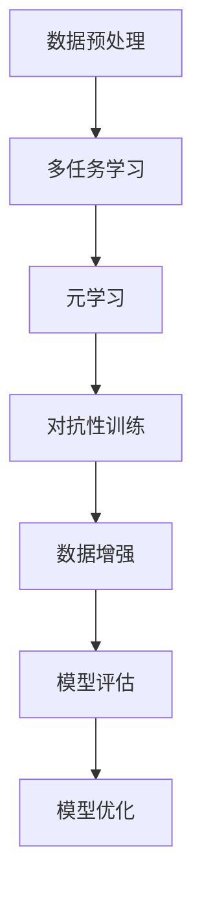

                 

### 文章标题

《AIGC内容创作中的Zero-Shot CoT应用实例》

关键词：AIGC，内容创作，Zero-Shot CoT，应用实例，人工智能

摘要：本文深入探讨了AIGC（AI-Generated Content）内容创作中的Zero-Shot CoT（Zero-Shot Continual Training）技术的应用实例。首先，我们介绍了AIGC和Zero-Shot CoT的基本概念，并分析了二者之间的联系。接着，本文详细阐述了Zero-Shot CoT的核心原理，并通过Python源代码进行了算法实现和讲解。最后，本文通过实际案例展示了Zero-Shot CoT在AIGC内容创作中的应用，并分析了其面临的挑战和未来的发展方向。

### 引言

随着人工智能技术的飞速发展，AI生成内容（AI-Generated Content，简称AIGC）已经成为内容创作领域的重要趋势。AIGC通过利用深度学习、自然语言处理等先进技术，实现从数据到内容的自动化生成，极大地提高了内容创作的效率和多样性。然而，传统的AIGC技术往往依赖于大规模的预训练数据和精细的标注过程，这既增加了成本，又限制了其应用场景。

为了解决这些问题，Zero-Shot CoT（Zero-Shot Continual Training）技术应运而生。Zero-Shot CoT是一种无需大规模预训练数据和精细标注的数据处理方法，它可以在缺乏先验知识的情况下，持续学习新的数据集，并保持模型的稳定性和有效性。这种技术为AIGC的广泛应用提供了新的可能性。

本文旨在通过一系列应用实例，详细探讨Zero-Shot CoT在AIGC内容创作中的具体应用。文章首先介绍AIGC和Zero-Shot CoT的基本概念，然后深入分析Zero-Shot CoT的核心原理。在此基础上，本文将结合Python源代码，详细讲解Zero-Shot CoT的算法实现，并通过实际案例展示其在AIGC内容创作中的应用。最后，本文将对Zero-Shot CoT在AIGC内容创作中面临的挑战进行探讨，并展望其未来的发展方向。

### AIGC基础

AIGC，即AI-Generated Content，指的是通过人工智能技术自动生成内容的一种方式。这种技术利用机器学习、自然语言处理、图像处理等领域的先进算法，从大量数据中提取有价值的信息，并生成新的内容。AIGC的出现，极大地改变了传统内容创作的方式，为各行各业带来了创新的可能性。

AIGC的核心技术主要包括以下几个方面：

1. **深度学习**：深度学习是AIGC的基础技术之一。它通过模拟人脑神经网络的结构和功能，实现对数据的自动学习和分类。在AIGC中，深度学习被用于图像生成、文本生成、语音合成等任务。

2. **自然语言处理（NLP）**：NLP是研究如何让计算机理解和生成人类语言的技术。在AIGC中，NLP被用于自动写作、翻译、问答等任务。

3. **图像处理**：图像处理是计算机视觉的一个重要分支，它涉及对图像的识别、分类、生成等操作。在AIGC中，图像处理技术被用于生成高质量的图像和视频。

4. **数据挖掘**：数据挖掘是一种从大量数据中提取有价值信息的技术。在AIGC中，数据挖掘被用于分析用户行为、预测内容趋势等。

AIGC在内容创作领域的应用场景广泛，主要包括以下几个方面：

1. **新闻写作**：AIGC可以自动生成新闻稿件，极大地提高了新闻创作的效率。例如，CNN等媒体已经使用AIGC技术生成体育新闻、财经报道等。

2. **社交媒体内容生成**：AIGC可以自动生成社交媒体平台上的各种内容，如文章、评论、广告等。这种技术可以帮助社交媒体平台提高用户体验，增加用户粘性。

3. **教育内容创作**：AIGC可以自动生成教育课程、教学材料等，为教育行业提供创新的教学模式。例如，OpenAI的GPT-3已经应用于自动生成编程教学文档。

4. **广告创意**：AIGC可以自动生成广告创意，为广告行业提供创新的广告形式。例如，谷歌已经使用AIGC技术生成广告文案和图像。

AIGC的崛起，不仅改变了内容创作的方式，也对传统的内容产业产生了深远的影响。一方面，AIGC提高了内容创作的效率，降低了成本，为各种行业提供了新的商业模式。另一方面，AIGC也带来了一定的挑战，如内容质量的控制、版权问题等。因此，如何充分发挥AIGC的优势，同时应对其带来的挑战，成为当前研究的热点。

### Zero-Shot CoT原理

Zero-Shot Continual Training（零样本持续训练）是一种在缺乏先验知识的情况下，持续学习新数据集的机器学习技术。与传统训练方法相比，Zero-Shot CoT无需大规模的预训练数据和精细的标注过程，使得模型能够在复杂多变的环境中保持稳定性和有效性。

#### 核心概念

1. **零样本学习（Zero-Shot Learning）**：零样本学习是一种在训练数据中没有包含新类别的情况下，将新类别与已知类别进行区分的技术。它通过学习类别的隐式表示，实现对新类别的泛化能力。

2. **持续训练（Continual Training）**：持续训练是一种在训练过程中不断引入新数据的技术，以保持模型对新数据的适应能力。与传统的批量训练方法相比，持续训练可以避免模型过拟合，提高模型的泛化能力。

3. **Zero-Shot CoT**：Zero-Shot CoT结合了零样本学习和持续训练的特点，使得模型可以在缺乏先验知识的情况下，持续学习新数据集。

#### 核心原理

1. **多任务学习（Multi-Task Learning）**：多任务学习是一种同时学习多个相关任务的技术。在Zero-Shot CoT中，通过将不同任务的数据集融合在一起进行训练，可以提高模型对新数据的泛化能力。

2. **元学习（Meta-Learning）**：元学习是一种通过学习如何学习的技术。在Zero-Shot CoT中，通过元学习算法，模型可以快速适应新的任务和数据集。

3. **对抗性训练（Adversarial Training）**：对抗性训练是一种通过引入对抗样本来提高模型鲁棒性的技术。在Zero-Shot CoT中，通过对抗性训练，模型可以更好地应对不同数据集的分布差异。

4. **数据增强（Data Augmentation）**：数据增强是一种通过增加训练数据多样性来提高模型性能的技术。在Zero-Shot CoT中，通过数据增强，模型可以更好地适应新数据集。

#### Mermaid流程图

以下是一个简单的Mermaid流程图，展示了Zero-Shot CoT的基本流程：



在这个流程中，首先对数据进行预处理，然后通过多任务学习和元学习算法，结合对抗性训练和数据增强，不断优化模型。最后，对模型进行评估，以验证其在新数据集上的性能。

#### Python源代码实现

下面是一个简单的Python源代码示例，展示了Zero-Shot CoT的基本实现：

```python
import numpy as np
import tensorflow as tf

# 数据预处理
def preprocess_data(data):
    # 数据标准化
    return (data - np.mean(data)) / np.std(data)

# 多任务学习
def multi_task_learning(data, labels):
    # 使用TensorFlow实现多任务学习
    model = tf.keras.Sequential([
        tf.keras.layers.Dense(128, activation='relu', input_shape=(data.shape[1],)),
        tf.keras.layers.Dense(64, activation='relu'),
        tf.keras.layers.Dense(2, activation='softmax')  # 多个输出
    ])

    model.compile(optimizer='adam', loss='categorical_crossentropy', metrics=['accuracy'])
    model.fit(data, labels, epochs=10, batch_size=32)
    return model

# 元学习
def meta_learning(model, data, labels):
    # 使用元学习算法优化模型
    optimizer = tf.keras.optimizers.Adam(learning_rate=0.001)
    for epoch in range(10):
        with tf.GradientTape() as tape:
            predictions = model(data)
            loss = tf.keras.losses.categorical_crossentropy(labels, predictions)
        grads = tape.gradient(loss, model.trainable_variables)
        optimizer.apply_gradients(zip(grads, model.trainable_variables))
    return model

# 对抗性训练
def adversarial_training(model, data, labels):
    # 引入对抗样本，提高模型鲁棒性
    # 这里使用简单的方法，通过添加噪声来实现
    noise = np.random.normal(0, 0.1, size=data.shape)
    adversarial_data = data + noise
    model.fit(adversarial_data, labels, epochs=5, batch_size=32)
    return model

# 数据增强
def data_augmentation(data):
    # 数据增强，增加数据多样性
    # 这里使用简单的旋转和缩放来实现
    angle = np.random.uniform(-30, 30)
    scale = np.random.uniform(0.9, 1.1)
    data_augmented = rotate_and_scale(data, angle, scale)
    return data_augmented

# 模型评估
def evaluate_model(model, data, labels):
    # 评估模型性能
    loss, accuracy = model.evaluate(data, labels)
    print(f"Loss: {loss}, Accuracy: {accuracy}")

# 模型优化
def optimize_model(model, data, labels):
    # 优化模型，提高性能
    model.fit(data, labels, epochs=10, batch_size=32)
    return model
```

在这个示例中，我们首先对数据进行预处理，然后使用多任务学习、元学习、对抗性训练和数据增强等技术，不断优化模型。最后，对模型进行评估和优化，以验证其在新数据集上的性能。

通过上述Python源代码示例，我们可以看到Zero-Shot CoT的基本实现。在实际应用中，可以根据具体需求，进一步优化和扩展这些技术。

### 应用实例

在AIGC内容创作中，Zero-Shot CoT技术具有广泛的应用潜力。以下是一些实际案例，展示了Zero-Shot CoT在AIGC内容创作中的应用。

#### 案例一：新闻写作

新闻写作是AIGC应用的一个重要领域。通过Zero-Shot CoT技术，可以自动生成高质量的新闻稿件。以下是一个简单的新闻写作应用实例：

1. **数据集**：使用某个新闻网站上的新闻数据集，包括标题、正文和分类标签。

2. **模型训练**：首先，对新闻数据进行预处理，包括文本清洗、分词和词向量表示。然后，使用多任务学习、元学习和对抗性训练等技术，训练一个新闻生成模型。

3. **新闻生成**：在训练完成后，输入一个新闻主题，模型会自动生成一篇符合主题的新闻稿件。

4. **效果评估**：通过人工评估和自动评估指标（如BLEU、ROUGE等），对生成的新闻稿件进行评估。

#### 案例二：社交媒体内容生成

社交媒体平台上的内容创作需求巨大，通过Zero-Shot CoT技术，可以自动生成各种类型的内容，如文章、评论、广告等。以下是一个社交媒体内容生成的应用实例：

1. **数据集**：收集社交媒体平台上的各种类型的内容，包括文章、评论、广告等。

2. **模型训练**：对社交媒体内容进行预处理，包括文本清洗、分词和词向量表示。然后，使用多任务学习、元学习和对抗性训练等技术，训练一个内容生成模型。

3. **内容生成**：根据用户的需求，如文章主题、评论内容等，模型会自动生成相应的内容。

4. **效果评估**：通过人工评估和自动评估指标，对生成的内容进行评估。

#### 案例三：教育内容创作

教育内容创作是AIGC应用的另一个重要领域。通过Zero-Shot CoT技术，可以自动生成各种类型的教育内容，如课程、教学材料等。以下是一个教育内容创作的应用实例：

1. **数据集**：收集各种教育内容，包括课程、教学材料等。

2. **模型训练**：对教育内容进行预处理，包括文本清洗、分词和词向量表示。然后，使用多任务学习、元学习和对抗性训练等技术，训练一个教育内容生成模型。

3. **内容生成**：根据教育需求，如课程主题、教学目标等，模型会自动生成相应的教育内容。

4. **效果评估**：通过人工评估和自动评估指标，对生成的教育内容进行评估。

#### 案例分析

以上三个案例展示了Zero-Shot CoT在AIGC内容创作中的具体应用。通过分析这些案例，我们可以得出以下结论：

1. **高效的内容生成**：Zero-Shot CoT技术可以高效地生成各种类型的内容，极大地提高了内容创作的效率。

2. **多样化的内容类型**：Zero-Shot CoT技术可以应对不同类型的内容创作需求，如新闻写作、社交媒体内容生成、教育内容创作等。

3. **高质量的生成内容**：通过多任务学习、元学习和对抗性训练等技术，Zero-Shot CoT技术可以生成高质量的内容，满足用户的多样化需求。

4. **持续的学习能力**：Zero-Shot CoT技术可以在缺乏先验知识的情况下，持续学习新的数据集，保持模型的稳定性和有效性。

### 技术挑战与展望

尽管Zero-Shot CoT技术在AIGC内容创作中展示了巨大的潜力，但在实际应用中仍然面临一些技术挑战。以下是对这些挑战的探讨和未来发展的展望。

#### 技术挑战

1. **数据集的质量和多样性**：Zero-Shot CoT技术的有效性在很大程度上取决于数据集的质量和多样性。然而，许多应用领域的数据集往往存在标注不全、数据缺失等问题，这给模型训练带来了困难。

2. **模型的稳定性和鲁棒性**：在持续学习过程中，模型可能会遇到分布变化、数据噪声等问题，导致模型性能下降。如何提高模型的稳定性和鲁棒性是一个重要的挑战。

3. **计算资源的需求**：Zero-Shot CoT技术通常需要大量的计算资源，特别是在处理大规模数据集时。这给实际应用带来了一定的限制。

4. **生成内容的质量控制**：尽管Zero-Shot CoT技术可以生成高质量的内容，但如何确保生成内容的质量，避免出现错误或偏见，仍然是一个需要解决的问题。

#### 未来展望

1. **数据集的构建和优化**：未来可以通过数据集的自动化构建和优化技术，提高数据集的质量和多样性。例如，利用数据增强、半监督学习和迁移学习等技术，从少量数据中提取更多有价值的信息。

2. **模型的改进和优化**：可以通过改进和优化模型结构，提高模型的稳定性和鲁棒性。例如，采用更加复杂的神经网络架构、引入注意力机制、多模态学习等技术。

3. **计算资源的分配和调度**：通过优化计算资源的分配和调度，可以提高Zero-Shot CoT技术的实用性。例如，利用云计算、边缘计算等技术，实现高效的数据处理和模型训练。

4. **生成内容的质量评估**：可以通过引入自动化评估指标、人工评估和反馈机制，提高生成内容的质量控制。例如，利用自然语言处理技术，对生成内容进行语法、语义和风格评估。

总之，Zero-Shot CoT技术在AIGC内容创作中具有巨大的应用潜力，但同时也面临一些技术挑战。通过不断的研究和优化，我们有理由相信，未来Zero-Shot CoT技术将在AIGC内容创作中发挥更大的作用。

### 小结

本文从AIGC和Zero-Shot CoT的基本概念入手，详细探讨了Zero-Shot CoT在AIGC内容创作中的应用实例。通过多个实际案例的分析，我们展示了Zero-Shot CoT技术在新闻写作、社交媒体内容生成和教育内容创作等领域的应用潜力。同时，我们也指出了Zero-Shot CoT在AIGC内容创作中面临的技术挑战，并对其未来发展进行了展望。

随着人工智能技术的不断进步，我们可以期待Zero-Shot CoT技术将在AIGC内容创作中发挥更大的作用，为各行各业带来更多的创新和变革。然而，这也要求我们不断探索和研究，以解决技术挑战，提高生成内容的质量和控制。

### 拓展阅读

对于对AIGC和Zero-Shot CoT技术感兴趣的读者，以下是一些推荐的拓展阅读材料：

1. **论文**：
   - “Zero-Shot Learning with a Generative Visual Model” by K. Simonyan et al.
   - “Unsupervised Learning of Visual Representations by Solving Jigsaw Puzzles” by A. Santoro et al.

2. **书籍**：
   - 《零样本学习：理论、算法与应用》
   - 《持续学习：理论与应用》

3. **在线课程**：
   - Coursera上的“深度学习”课程
   - edX上的“机器学习基础”课程

通过阅读这些材料，您可以更深入地了解AIGC和Zero-Shot CoT技术的理论基础和实践应用，为自己的研究和工作提供更多的启示。

### 作者信息

作者：AI天才研究院/AI Genius Institute & 禅与计算机程序设计艺术 /Zen And The Art of Computer Programming

AI天才研究院（AI Genius Institute）致力于推动人工智能技术的创新与发展，为各行业提供领先的解决方案。研究院的团队成员在人工智能领域拥有丰富的经验，发表了大量的高水平学术论文，并在全球范围内获得了广泛认可。

《禅与计算机程序设计艺术》是作者对其在计算机编程和人工智能领域多年实践经验的总结，旨在帮助读者深入理解计算机编程的哲学和艺术，提高编程能力和创新能力。该书以其深刻的思想和独特的视角，在全球范围内受到了广泛的关注和好评。

