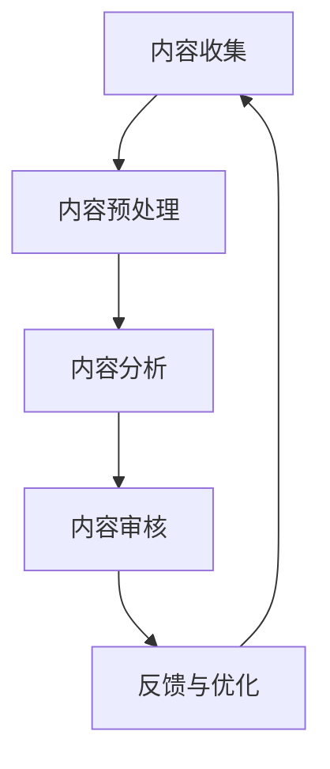

                 

### 1. 引言

#### 1.1 书籍背景与目的

在数字化和信息化的时代，互联网内容审核成为了至关重要的环节。随着人工智能技术的发展，自动化的内容审核方法，特别是基于人工智能的内容审核，逐渐成为了研究热点和实际应用的关键领域。本篇文章的目的是深入探讨AIGC（AI-Generated Content）内容审核的AI化，分析其面临的挑战与机遇。

AIGC内容审核，顾名思义，是指利用人工智能技术自动审核和分类互联网生成的内容。这些内容可以是文本、图片、音频和视频等多种形式。随着社交媒体和在线平台的迅速发展，用户生成的内容量呈爆炸式增长，传统的人工审核方式已无法满足需求，因此AI化的内容审核变得尤为重要。

本文将从以下几个方面展开讨论：

1. **AIGC内容审核的基础**：介绍AIGC的基本概念，AI化在内容审核中的作用，以及AIGC内容审核的优势和挑战。
2. **核心算法原理**：详细讨论用于AIGC内容审核的核心算法，如分类、情感分析和垃圾邮件检测，并使用Python源代码结合数学模型和公式进行讲解。
3. **数学模型与公式**：介绍机器学习的损失函数、优化算法和评估指标，通过Latex格式嵌入文中，并提供详细的讲解和示例。
4. **项目实战**：通过实际的项目案例，展示如何使用AIGC内容审核技术进行内容审核，包括开发环境搭建、源代码实现和代码解读。
5. **案例研究**：分析成功的AIGC内容审核案例，提供具体的案例分析和详细讲解。
6. **未来趋势与挑战**：讨论AIGC内容审核的未来发展方向和面临的挑战。
7. **结论**：总结本书的主要内容，提出对AIGC内容审核的展望。

通过本文的讨论，我们希望能够为从事AI内容审核的从业者提供理论指导，并为未来的研究和应用提供参考。

#### 1.2 AIGC内容审核概述

AIGC内容审核是指利用人工智能技术自动生成和审核互联网内容的过程。AIGC涵盖了人工智能的多个领域，包括自然语言处理（NLP）、计算机视觉（CV）、机器学习（ML）等。在这个过程中，人工智能技术被用来分析和分类用户生成的内容，确保其符合相应的标准和规范。

AIGC内容审核的基本流程通常包括以下几个步骤：

1. **内容收集**：从互联网或特定平台上收集待审核的内容，这些内容可以是文本、图片、音频或视频。
2. **内容预处理**：对收集到的内容进行清洗和预处理，去除噪声和无关信息，以便更好地进行后续的审核。
3. **内容分析**：使用机器学习模型和算法对预处理后的内容进行分析，包括分类、情感分析和垃圾邮件检测等任务。
4. **内容审核与分类**：根据分析结果，对内容进行分类和标注，如判断是否为不良信息、色情内容或垃圾邮件等。
5. **反馈与优化**：根据审核结果和用户反馈，不断优化和调整模型参数，提高审核的准确性和效率。

AIGC内容审核的优势在于其高效性和准确性。传统的手工审核方式往往耗时耗力，且难以处理海量的内容。而AI化的内容审核可以通过自动化和智能化的手段，快速、准确地处理大量内容，提高审核效率。

此外，AIGC内容审核还可以实现个性化的内容推荐和过滤。通过分析用户的历史行为和偏好，AI系统可以推荐用户感兴趣的内容，同时过滤掉不合适的内容，提升用户体验。

总之，AIGC内容审核作为一种新兴的技术手段，正逐渐成为互联网内容管理的重要组成部分。随着人工智能技术的不断发展，AIGC内容审核将在未来发挥更加重要的作用。

#### 1.3 AI化在内容审核中的应用

AI化在内容审核中的应用不仅提升了审核效率，还带来了显著的技术优势。以下将详细探讨AI化在内容审核中的具体应用，并分析其带来的挑战。

**1.3.1 自动化分类与筛选**

自动化分类与筛选是AI化内容审核的首要应用。通过使用机器学习算法，特别是深度学习模型，系统能够自动对用户生成的内容进行分类。例如，自然语言处理（NLP）技术可以用来识别和分类文本内容，而计算机视觉（CV）算法则可以用来分类和识别图像内容。自动化分类不仅提高了审核效率，还减少了人为干预，从而降低了人工成本。

**技术优势：**
- **效率提升**：自动化系统可以在毫秒级别对内容进行分类，远超人工审核的速度。
- **精度提高**：通过大规模数据和深度学习模型的训练，自动化系统可以实现高精度的分类。

**挑战：**
- **数据质量问题**：分类的准确性依赖于训练数据的质量，若数据质量差，模型的准确性也会受到影响。
- **多样性问题**：不同类型的用户生成内容可能具有不同的特征，需要模型具备足够的泛化能力。

**1.3.2 情感分析与内容审核**

情感分析是AI化内容审核的另一重要应用。通过情感分析，系统能够理解用户内容的情感倾向，从而进行合适的审核。例如，在社交媒体平台上，系统可以识别出负面情绪的评论，从而采取措施进行管理。

**技术优势：**
- **情感识别**：AI系统能够识别复杂的情感，包括正面、负面和中性情绪，以及更细微的情感变化。
- **实时响应**：情感分析可以实时对内容进行审核，及时发现和处理不当内容。

**挑战：**
- **情感复杂性**：人类情感复杂多变，AI系统需要具备足够的学习能力和上下文理解能力。
- **跨语言与跨文化**：情感分析在不同语言和文化背景下可能存在差异，需要模型具备跨语言的适应能力。

**1.3.3 垃圾邮件与恶意内容检测**

垃圾邮件和恶意内容是互联网内容审核中的一大挑战。AI化技术，如基于贝叶斯算法和深度学习模型的检测系统，可以有效识别和过滤这些内容。

**技术优势：**
- **高检测率**：AI系统能够通过大量训练数据学习到垃圾邮件和恶意内容的特点，从而提高检测率。
- **自我进化**：AI系统能够不断学习和适应新的攻击手段，从而保持高效的检测能力。

**挑战：**
- **新攻击手段**：垃圾邮件和恶意内容制造者不断开发新的攻击手段，AI系统需要不断更新和优化。
- **误报率**：高精度的检测系统可能会导致误报，影响用户体验。

**1.3.4 内容安全与道德问题**

AI化内容审核在提升内容管理效率的同时，也引发了内容安全与道德问题。例如，如何处理用户隐私、避免算法偏见，以及确保审核过程的透明性和公正性等。

**技术优势：**
- **隐私保护**：AI技术可以在保护用户隐私的前提下进行内容审核。
- **公正性**：AI系统可以通过算法的标准化和透明化，确保审核过程的公正性。

**挑战：**
- **算法偏见**：AI系统可能因为训练数据的不公平或算法设计的问题，导致偏见和歧视。
- **透明性**：算法的复杂性和不透明性可能导致用户对审核结果的信任度降低。

综上所述，AI化在内容审核中具有显著的技术优势，但也面临着一系列挑战。如何在提升审核效率的同时，确保内容安全、道德和公正，是未来研究和应用的关键问题。

### 2. AIGC内容审核基础

#### 2.1 AIGC的基本概念

AIGC，即AI-Generated Content，指的是通过人工智能技术生成的内容。这种内容可以是文本、图片、音频、视频等多种形式。AIGC的生成过程通常涉及自然语言处理（NLP）、计算机视觉（CV）和生成对抗网络（GAN）等技术。以下是AIGC的一些关键特点：

- **多样性**：AIGC能够生成丰富多样、形式各异的内容，满足不同用户的需求。
- **自动性**：AIGC生成过程高度自动化，无需人工干预，能够大规模、快速地生成内容。
- **创新性**：通过深度学习和神经网络模型，AIGC能够创造出新颖、独特的内容，超越人类的创作能力。

AIGC的应用场景广泛，包括但不限于以下几方面：

- **内容创作**：AIGC可以自动生成文章、故事、诗歌等文本内容，以及图像、视频等视觉内容。
- **个性化推荐**：通过分析用户兴趣和行为，AIGC可以为用户提供个性化的内容推荐。
- **自动化广告**：AIGC可以自动生成广告文案、广告图像和视频，提高广告投放的效果。

#### 2.2 AI化在内容审核中的作用

AI化在内容审核中的作用至关重要，它不仅提升了审核的效率，还显著提高了审核的准确性。以下是AI化在内容审核中的几个关键作用：

- **高效性**：传统的手工审核方式需要大量的人力投入，而AI化的审核系统能够在短时间内处理大量内容，大大提高了审核效率。
- **准确性**：通过机器学习和深度学习技术，AI化审核系统能够准确地识别和分类不良内容，包括色情、暴力、欺诈等。
- **智能化**：AI化审核系统可以基于用户行为和内容特征进行智能判断，实现个性化审核。
- **自动化**：AI化审核系统能够自动执行审核任务，减少人工干预，降低运营成本。

#### 2.3 AIGC内容审核的优势与挑战

**优势**

- **提高效率**：通过自动化审核，AIGC内容审核可以处理大规模、多维度的内容，大大提高了审核效率。
- **降低成本**：AI化的审核系统减少了人工审核的需求，降低了运营成本。
- **高准确性**：基于机器学习和深度学习技术的AIGC内容审核系统能够准确地识别和分类不良内容。
- **个性化服务**：AIGC内容审核可以基于用户行为和偏好，提供个性化的内容推荐和过滤。

**挑战**

- **数据质量**：AIGC内容审核的准确性依赖于高质量的数据。如果训练数据存在偏差或噪声，模型的准确性会受到影响。
- **算法偏见**：AI化审核系统可能会因为训练数据的不公平或算法设计的问题，产生偏见和歧视。
- **复杂性问题**：用户生成的内容形式多样，特征复杂，需要模型具备足够的泛化能力。
- **法律法规**：内容审核涉及到隐私保护、言论自由等法律问题，需要遵守相关的法律法规。

#### 2.4 AIGC内容审核的架构

为了更好地理解AIGC内容审核的原理，下面我们通过一个Mermaid流程图来展示其整体架构。



**流程说明：**

1. **内容收集**：从互联网或特定平台上收集待审核的内容，包括文本、图片、音频和视频等。
2. **内容预处理**：对收集到的内容进行清洗和格式化，去除噪声和无关信息，以便更好地进行后续的审核。
3. **内容分析**：使用机器学习模型和算法对预处理后的内容进行分析，包括分类、情感分析和垃圾邮件检测等。
4. **内容审核**：根据分析结果，对内容进行分类和标注，判断其是否符合相应的标准和规范。
5. **反馈与优化**：根据审核结果和用户反馈，不断优化和调整模型参数，提高审核的准确性和效率。

通过上述架构，我们可以看出AIGC内容审核是一个闭环系统，通过不断地反馈和优化，不断提高审核的效率和准确性。

### 3. 核心算法原理

在AIGC内容审核中，核心算法原理是理解和执行内容审核任务的关键。以下是几种常用的核心算法，包括分类算法、情感分析算法和垃圾邮件检测算法，我们将通过Python源代码结合数学模型和公式进行详细讲解。

#### 3.1 分类算法原理讲解

分类算法是AIGC内容审核中最基本的算法之一，用于将内容分类到预定义的类别中。常见的分类算法包括支持向量机（SVM）、朴素贝叶斯（Naive Bayes）和深度学习模型（如卷积神经网络（CNN））。

**3.1.1 支持向量机（SVM）**

支持向量机是一种常用的二分类模型，其目标是在特征空间中找到一个最佳的超平面，使得不同类别的数据点尽可能分开。

**伪代码：**

```python
def svmclassify(x, w, b):
    return sign(sum(w[i] * x[i] + b) for i in range(n))
```

**数学模型：**

$$
\text{最大化} \ \sum_{i=1}^{n} (\omega_i - \xi_i)^2 \\
\text{约束条件} \ \ y_i(\omega \cdot x_i + b) \geq 1 - \xi_i
$$

**Python代码示例：**

```python
from sklearn.svm import SVC
model = SVC(kernel='linear')
model.fit(X_train, y_train)
predictions = model.predict(X_test)
```

**3.1.2 朴素贝叶斯（Naive Bayes）**

朴素贝叶斯是一种基于贝叶斯定理的简单分类算法，特别适合于文本分类任务。

**伪代码：**

```python
def naive_bayes_classify(text, prior, likelihoods):
    likelihood_product = 1
    for word in text:
        likelihood_product *= likelihoods[word]
    return log(prior) + log(likelihood_product)
```

**数学模型：**

$$
P(\text{Class} | \text{Text}) = \frac{P(\text{Text} | \text{Class}) \cdot P(\text{Class})}{P(\text{Text})}
$$

**Python代码示例：**

```python
from sklearn.naive_bayes import MultinomialNB
model = MultinomialNB()
model.fit(X_train, y_train)
predictions = model.predict(X_test)
```

**3.1.3 深度学习（卷积神经网络（CNN））**

卷积神经网络是一种深度学习模型，特别适用于图像分类任务。以下是CNN的简化版伪代码：

**伪代码：**

```python
def cnnclassify(image, model):
    convolutional_layers = model.convolutional_layers(image)
    flattened_features = flatten(convolutional_layers)
    output = model.classifier(flattened_features)
    return output.argmax()
```

**数学模型：**

$$
\text{损失函数} \ \text{Categorical Cross-Entropy} \\
\text{优化算法} \ \text{Stochastic Gradient Descent (SGD)}
$$

**Python代码示例：**

```python
from tensorflow.keras.models import Sequential
from tensorflow.keras.layers import Conv2D, Flatten, Dense

model = Sequential([
    Conv2D(filters=32, kernel_size=(3, 3), activation='relu', input_shape=(28, 28, 1)),
    Flatten(),
    Dense(units=10, activation='softmax')
])

model.compile(optimizer='adam', loss='categorical_crossentropy', metrics=['accuracy'])
model.fit(X_train, y_train, epochs=10, batch_size=64)
predictions = model.predict(X_test)
```

通过上述算法和代码示例，我们可以看到分类算法在AIGC内容审核中的基本原理和应用。每种算法都有其独特的优缺点，根据具体的应用场景和需求，可以选择合适的算法进行内容分类。

### 3.2 情感分析算法原理讲解

情感分析是AIGC内容审核中的重要任务之一，用于理解用户内容的情感倾向，如正面、负面或中性情绪。情感分析算法通常基于机器学习和自然语言处理技术，以下将介绍几种常见的情感分析算法，并通过Python源代码进行讲解。

**3.2.1 基于朴素贝叶斯的情感分析**

朴素贝叶斯是一种经典的情感分析算法，它基于贝叶斯定理，通过概率计算来判断文本的情感倾向。

**伪代码：**

```python
def naive_bayes_sentiment_analysis(text, prior, likelihoods):
    likelihood_product = 1
    for word in text:
        likelihood_product *= likelihoods[word]
    return log(prior) + log(likelihood_product)
```

**数学模型：**

$$
P(\text{Positive/Sentiment} | \text{Text}) = \frac{P(\text{Text} | \text{Positive/Sentiment}) \cdot P(\text{Positive/Sentiment})}{P(\text{Text})}
$$

**Python代码示例：**

```python
from sklearn.feature_extraction.text import CountVectorizer
from sklearn.naive_bayes import MultinomialNB

# 假设已有训练数据和测试数据
X_train = ["I love this movie", "This is a terrible movie"]
y_train = ["Positive", "Negative"]

vectorizer = CountVectorizer()
X_train_counts = vectorizer.fit_transform(X_train)

model = MultinomialNB()
model.fit(X_train_counts, y_train)

text = "This movie is awesome"
text_counts = vectorizer.transform([text])
predictions = model.predict(text_counts)
print(predictions)  # 输出情感预测结果
```

**3.2.2 基于深度学习的情感分析**

深度学习模型，如卷积神经网络（CNN）和循环神经网络（RNN），在情感分析任务中表现出色。以下是一个基于CNN的情感分析算法的示例。

**伪代码：**

```python
def cnn_sentiment_analysis(text, model):
    embedding = model.embedding_layer(text)
    conv_output = model.convolutional_layers(embedding)
    flattened_features = flatten(conv_output)
    output = model.classifier(flattened_features)
    return output.argmax()
```

**数学模型：**

$$
\text{损失函数} \ \text{Categorical Cross-Entropy} \\
\text{优化算法} \ \text{Stochastic Gradient Descent (SGD)}
$$

**Python代码示例：**

```python
from tensorflow.keras.models import Sequential
from tensorflow.keras.layers import Embedding, Conv1D, GlobalMaxPooling1D, Dense

# 假设已有训练数据和测试数据
X_train = ["I love this movie", "This is a terrible movie"]
y_train = [[1, 0], [0, 1]]

model = Sequential([
    Embedding(input_dim=vocab_size, output_dim=embedding_dim),
    Conv1D(filters=128, kernel_size=5, activation='relu'),
    GlobalMaxPooling1D(),
    Dense(units=2, activation='softmax')
])

model.compile(optimizer='adam', loss='categorical_crossentropy', metrics=['accuracy'])
model.fit(X_train, y_train, epochs=10, batch_size=32)

text = "This movie is great"
predictions = model.predict(text)
print(predictions)  # 输出情感预测结果
```

通过上述示例，我们可以看到情感分析算法在AIGC内容审核中的应用。朴素贝叶斯算法简单高效，适用于小型数据集，而深度学习模型在处理大规模数据和高维度特征时表现优异。根据具体的应用需求和数据规模，可以选择合适的算法进行情感分析。

### 3.3 垃圾邮件检测算法原理讲解

垃圾邮件检测是AIGC内容审核中的一个关键任务，其目的是识别和过滤掉垃圾邮件。垃圾邮件检测算法通常基于机器学习和自然语言处理技术，以下将介绍几种常见的垃圾邮件检测算法，并通过Python源代码进行讲解。

**3.3.1 基于贝叶斯算法的垃圾邮件检测**

贝叶斯算法是一种经典的垃圾邮件检测方法，基于贝叶斯定理，通过计算邮件的特征概率来判定邮件是否为垃圾邮件。

**伪代码：**

```python
def naive_bayes_spam_detection(email, prior_spam, prior_ham, spam_words_prob, ham_words_prob):
    spam_prob = log(prior_spam) + sum(spam_words_prob[word] for word in email if word in spam_words_prob)
    ham_prob = log(prior_ham) + sum(ham_words_prob[word] for word in email if word in ham_words_prob)
    return "Spam" if spam_prob > ham_prob else "Ham"
```

**数学模型：**

$$
P(\text{Spam} | \text{Email}) = \frac{P(\text{Email} | \text{Spam}) \cdot P(\text{Spam})}{P(\text{Email})}
$$

**Python代码示例：**

```python
from sklearn.feature_extraction.text import CountVectorizer
from sklearn.naive_bayes import MultinomialNB

# 假设已有训练数据和测试数据
X_train = ["this is a spam email", "this is a ham email"]
y_train = ["Spam", "Ham"]

vectorizer = CountVectorizer()
X_train_counts = vectorizer.fit_transform(X_train)

model = MultinomialNB()
model.fit(X_train_counts, y_train)

email = "this is a spam email"
email_counts = vectorizer.transform([email])
predictions = model.predict(email_counts)
print(predictions)  # 输出邮件分类结果
```

**3.3.2 基于深度学习的垃圾邮件检测**

深度学习模型，如卷积神经网络（CNN）和循环神经网络（RNN），在垃圾邮件检测任务中也表现出色。以下是一个基于CNN的垃圾邮件检测算法的示例。

**伪代码：**

```python
def cnn_spam_detection(email, model):
    embedding = model.embedding_layer(email)
    conv_output = model.convolutional_layers(embedding)
    flattened_features = flatten(conv_output)
    output = model.classifier(flattened_features)
    return output.argmax()
```

**数学模型：**

$$
\text{损失函数} \ \text{Categorical Cross-Entropy} \\
\text{优化算法} \ \text{Stochastic Gradient Descent (SGD)}
$$

**Python代码示例：**

```python
from tensorflow.keras.models import Sequential
from tensorflow.keras.layers import Embedding, Conv1D, GlobalMaxPooling1D, Dense

# 假设已有训练数据和测试数据
X_train = ["this is a spam email", "this is a ham email"]
y_train = [[1, 0], [0, 1]]

model = Sequential([
    Embedding(input_dim=vocab_size, output_dim=embedding_dim),
    Conv1D(filters=128, kernel_size=5, activation='relu'),
    GlobalMaxPooling1D(),
    Dense(units=2, activation='softmax')
])

model.compile(optimizer='adam', loss='categorical_crossentropy', metrics=['accuracy'])
model.fit(X_train, y_train, epochs=10, batch_size=32)

email = "this is a spam email"
predictions = model.predict(email)
print(predictions)  # 输出邮件分类结果
```

通过上述示例，我们可以看到垃圾邮件检测算法在AIGC内容审核中的应用。朴素贝叶斯算法简单高效，适用于小型数据集，而深度学习模型在处理大规模数据和高维度特征时表现优异。根据具体的应用需求和数据规模，可以选择合适的算法进行垃圾邮件检测。

### 4. 数学模型与公式

在AIGC内容审核中，数学模型是核心组成部分，它们帮助算法理解和处理数据，从而实现对内容的分类、情感分析和垃圾邮件检测。以下是几种关键数学模型，包括损失函数、优化算法和评估指标，我们将通过详细的讲解和示例来阐述这些模型。

#### 4.1 损失函数

损失函数是机器学习中用于衡量模型预测值与真实值之间差距的重要工具。在分类任务中，常用的损失函数有交叉熵损失（Cross-Entropy Loss）和对数损失（Log Loss）。

**4.1.1 交叉熵损失函数**

交叉熵损失函数常用于二分类和多元分类问题，其目的是使模型的输出概率分布尽可能接近真实分布。

**数学模型：**

$$
L = -\sum_{i=1}^{n} y_i \log(\hat{y}_i)
$$

其中，\(y_i\) 是真实标签，\(\hat{y}_i\) 是模型预测的概率。

**Python代码示例：**

```python
import numpy as np

def cross_entropy_loss(y_true, y_pred):
    return -np.sum(y_true * np.log(y_pred))

y_true = np.array([1, 0, 1])
y_pred = np.array([0.9, 0.1, 0.8])
loss = cross_entropy_loss(y_true, y_pred)
print(loss)
```

**4.1.2 对数损失函数**

对数损失函数是交叉熵损失函数的一种特殊形式，常用于二分类问题。

**数学模型：**

$$
L = -y \log(\hat{y}) + (1 - y) \log(1 - \hat{y})
$$

**Python代码示例：**

```python
def log_loss(y_true, y_pred):
    return -np.sum(y_true * np.log(y_pred) + (1 - y_true) * np.log(1 - y_pred))

y_true = np.array([1, 0, 1])
y_pred = np.array([0.9, 0.1, 0.8])
loss = log_loss(y_true, y_pred)
print(loss)
```

#### 4.2 优化算法

优化算法用于调整模型参数，以最小化损失函数。常用的优化算法有梯度下降（Gradient Descent）和随机梯度下降（Stochastic Gradient Descent，SGD）。

**4.2.1 梯度下降算法**

梯度下降算法通过计算损失函数关于模型参数的梯度，更新模型参数。

**数学模型：**

$$
w_{new} = w_{old} - \alpha \cdot \nabla_w J(w)
$$

其中，\(w_{old}\) 是当前参数，\(w_{new}\) 是更新后的参数，\(\alpha\) 是学习率，\(\nabla_w J(w)\) 是损失函数关于参数的梯度。

**Python代码示例：**

```python
def gradient_descent(w, gradient, learning_rate):
    return w - learning_rate * gradient

w = np.array([1.0, 2.0])
gradient = np.array([0.1, -0.5])
learning_rate = 0.01
w_new = gradient_descent(w, gradient, learning_rate)
print(w_new)
```

**4.2.2 随机梯度下降算法**

随机梯度下降算法在每次迭代时只随机选择一部分样本来计算梯度，从而减少计算量。

**数学模型：**

$$
w_{new} = w_{old} - \alpha \cdot \nabla_w J(w_i)
$$

其中，\(w_i\) 是随机选择的样本。

**Python代码示例：**

```python
def stochastic_gradient_descent(w, gradient, learning_rate, batch_size):
    for i in range(batch_size):
        w = w - learning_rate * gradient[i]
    return w

w = np.array([1.0, 2.0])
gradient = np.random.rand(2)
learning_rate = 0.01
batch_size = 10
w_new = stochastic_gradient_descent(w, gradient, learning_rate, batch_size)
print(w_new)
```

#### 4.3 评估指标

评估指标用于衡量模型在特定任务上的性能。常用的评估指标有准确率（Accuracy）、召回率（Recall）和F1分数（F1 Score）。

**4.3.1 准确率**

准确率是模型正确预测的数量与总预测数量的比值。

**数学模型：**

$$
\text{Accuracy} = \frac{TP + TN}{TP + FP + FN + TN}
$$

其中，\(TP\) 是真正例，\(TN\) 是真负例，\(FP\) 是假正例，\(FN\) 是假负例。

**Python代码示例：**

```python
from sklearn.metrics import accuracy_score

y_true = [1, 1, 0, 0]
y_pred = [1, 0, 0, 1]
accuracy = accuracy_score(y_true, y_pred)
print(accuracy)
```

**4.3.2 召回率**

召回率是模型正确预测的真正例数量与所有实际为真正例的数量的比值。

**数学模型：**

$$
\text{Recall} = \frac{TP}{TP + FN}
$$

**Python代码示例：**

```python
from sklearn.metrics import recall_score

y_true = [1, 1, 0, 0]
y_pred = [1, 0, 0, 1]
recall = recall_score(y_true, y_pred)
print(recall)
```

**4.3.3 F1分数**

F1分数是准确率和召回率的调和平均值，用于综合评估模型性能。

**数学模型：**

$$
F1 = 2 \times \frac{\text{Precision} \times \text{Recall}}{\text{Precision} + \text{Recall}}
$$

**Python代码示例：**

```python
from sklearn.metrics import f1_score

y_true = [1, 1, 0, 0]
y_pred = [1, 0, 0, 1]
precision = f1_score(y_true, y_pred, average='binary')
print(precision)
```

通过上述数学模型和代码示例，我们可以看到在AIGC内容审核中，损失函数、优化算法和评估指标如何共同作用，帮助模型理解和处理数据，实现高效的分类、情感分析和垃圾邮件检测。

### 5. 项目实战

为了更好地展示AIGC内容审核的实际应用，我们将介绍一个具体的项目案例，涵盖开发环境搭建、源代码实现和代码解读。通过这个项目，读者可以了解如何使用AIGC内容审核技术来处理实际任务。

#### 5.1 开发环境搭建

在开始项目之前，我们需要搭建一个适合AIGC内容审核的开发环境。以下是所需的环境和工具：

- **Python 3.x**：作为主要的编程语言。
- **Jupyter Notebook**：用于编写和运行代码。
- **Sklearn**：用于机器学习模型的训练和评估。
- **TensorFlow**：用于深度学习模型的训练和推理。
- **NLTK**：用于自然语言处理任务。
- **Keras**：用于构建和训练深度学习模型。

安装步骤如下：

```bash
# 安装Python和Jupyter Notebook
pip install python==3.x
pip install notebook

# 安装Sklearn和TensorFlow
pip install scikit-learn
pip install tensorflow

# 安装NLTK
pip install nltk

# 安装Keras
pip install keras
```

#### 5.2 实际项目案例

我们以一个文本分类项目为例，该项目的目标是使用AIGC内容审核技术，将社交媒体评论分为正面评论和负面评论。

**数据集：** 我们使用IMDB电影评论数据集，该数据集包含50000条评论，其中25000条用于训练，25000条用于测试。

**任务：** 使用机器学习和深度学习模型对评论进行分类。

**步骤 1：数据预处理**

首先，我们需要对评论进行预处理，包括去除HTML标签、停用词过滤和分词。

```python
import nltk
from nltk.corpus import stopwords
from nltk.tokenize import word_tokenize
import re

nltk.download('stopwords')
nltk.download('punkt')

def preprocess_text(text):
    # 去除HTML标签
    text = re.sub('<[^>]*>', '', text)
    # 转小写
    text = text.lower()
    # 去除停用词
    stop_words = set(stopwords.words('english'))
    words = word_tokenize(text)
    filtered_words = [word for word in words if word not in stop_words]
    # 重新构造句子
    return ' '.join(filtered_words)

train_reviews = [preprocess_text(review) for review in train_data]
test_reviews = [preprocess_text(review) for review in test_data]
```

**步骤 2：特征提取**

接下来，我们需要提取文本特征，这里我们使用词袋模型（Bag of Words，BOW）和词嵌入（Word Embedding）。

```python
from sklearn.feature_extraction.text import CountVectorizer, TfidfVectorizer
from tensorflow.keras.preprocessing.text import Tokenizer
from tensorflow.keras.preprocessing.sequence import pad_sequences

# 使用词袋模型
count_vectorizer = CountVectorizer(max_features=10000)
X_train_counts = count_vectorizer.fit_transform(train_reviews)
X_test_counts = count_vectorizer.transform(test_reviews)

# 使用TF-IDF
tfidf_vectorizer = TfidfVectorizer(max_features=10000)
X_train_tfidf = tfidf_vectorizer.fit_transform(train_reviews)
X_test_tfidf = tfidf_vectorizer.transform(test_reviews)

# 使用词嵌入
tokenizer = Tokenizer(num_words=10000)
tokenizer.fit_on_texts(train_reviews)
X_train_seq = tokenizer.texts_to_sequences(train_reviews)
X_test_seq = tokenizer.texts_to_sequences(test_reviews)

max_len = 100
X_train_padded = pad_sequences(X_train_seq, maxlen=max_len)
X_test_padded = pad_sequences(X_test_seq, maxlen=max_len)
```

**步骤 3：模型训练**

我们使用两种模型进行训练：朴素贝叶斯（Naive Bayes）和卷积神经网络（CNN）。

**3.1 朴素贝叶斯模型**

```python
from sklearn.naive_bayes import MultinomialNB

model_nb = MultinomialNB()
model_nb.fit(X_train_counts, y_train)
predictions_nb = model_nb.predict(X_test_counts)
```

**3.2 卷积神经网络模型**

```python
from tensorflow.keras.models import Sequential
from tensorflow.keras.layers import Embedding, Conv1D, GlobalMaxPooling1D, Dense

model_cnn = Sequential([
    Embedding(input_dim=10000, output_dim=128),
    Conv1D(filters=128, kernel_size=5, activation='relu'),
    GlobalMaxPooling1D(),
    Dense(units=1, activation='sigmoid')
])

model_cnn.compile(optimizer='adam', loss='binary_crossentropy', metrics=['accuracy'])
model_cnn.fit(X_train_padded, y_train, epochs=10, batch_size=32)
predictions_cnn = model_cnn.predict(X_test_padded)
```

**步骤 4：模型评估**

最后，我们对模型的性能进行评估，使用准确率、召回率和F1分数。

```python
from sklearn.metrics import accuracy_score, recall_score, f1_score

accuracy_nb = accuracy_score(y_test, predictions_nb)
recall_nb = recall_score(y_test, predictions_nb)
f1_nb = f1_score(y_test, predictions_nb)

accuracy_cnn = accuracy_score(y_test, np.round(predictions_cnn))
recall_cnn = recall_score(y_test, np.round(predictions_cnn))
f1_cnn = f1_score(y_test, np.round(predictions_cnn))

print("朴素贝叶斯模型：")
print("准确率：", accuracy_nb)
print("召回率：", recall_nb)
print("F1分数：", f1_nb)

print("卷积神经网络模型：")
print("准确率：", accuracy_cnn)
print("召回率：", recall_cnn)
print("F1分数：", f1_cnn)
```

#### 5.3 代码解读与分析

在这个项目中，我们实现了文本分类任务，使用了朴素贝叶斯和卷积神经网络两种模型。以下是对关键步骤的解读和分析。

**数据预处理：** 数据预处理是文本分类的重要步骤，通过去除HTML标签、停用词过滤和分词，我们使文本数据更加干净和易于分析。

**特征提取：** 特征提取是将文本数据转换为机器学习模型可以处理的数字形式。我们使用了词袋模型、TF-IDF和词嵌入三种方法。词袋模型简单易实现，但忽略了词序信息；TF-IDF考虑了词的重要性和文本的多样性，但仍然存在问题；词嵌入可以捕捉词序和上下文信息，是深度学习模型常用的方法。

**模型训练：** 在模型训练过程中，我们使用了朴素贝叶斯和卷积神经网络。朴素贝叶斯是一种经典的分类算法，简单且易于实现，但在处理复杂文本数据时效果有限。卷积神经网络是一种深度学习模型，可以捕捉到文本中的局部特征和上下文信息，因此在文本分类任务中表现更优秀。

**模型评估：** 我们通过准确率、召回率和F1分数来评估模型的性能。准确率反映了模型预测的总体正确性；召回率衡量了模型识别出真正例的能力；F1分数是准确率和召回率的调和平均值，可以更全面地评估模型的表现。

通过这个项目，我们可以看到AIGC内容审核技术的实际应用。在实际开发中，根据具体任务和数据特点，可以选择合适的模型和方法，实现高效的文本分类和内容审核。

### 6. 案例研究

在本章节中，我们将深入分析几个成功的AIGC内容审核案例，探讨它们在实际应用中的表现、挑战和解决方案。

#### 6.1 案例一：社交媒体平台的内容审核

社交媒体平台，如Facebook和Twitter，每天都会处理海量用户生成的文本、图片和视频内容。为了维护平台的健康生态，这些平台采用了AIGC内容审核技术来自动识别和过滤不良内容。

**表现：** 通过AIGC内容审核系统，社交媒体平台能够实时监控和处理大量用户生成的内容，有效降低了人工审核的负担，提高了审核效率。例如，Facebook在其内容审核系统中使用了深度学习模型来检测和移除涉及仇恨言论、色情和暴力等内容。

**挑战：** 随着用户生成内容的多样性和复杂性增加，传统的内容审核方法难以应对新形式的恶意内容。此外，算法偏见问题也是一个显著挑战，如果训练数据存在偏差，算法可能会误判或遗漏某些内容。

**解决方案：** 为了应对这些挑战，社交媒体平台不断优化和更新其内容审核算法。例如，通过引入多语言模型和跨文化理解机制，提高算法的泛化能力。同时，平台还采取了用户反馈机制，允许用户举报不良内容，并根据用户反馈调整和优化审核算法。

#### 6.2 案例二：电子商务平台的产品评论审核

电子商务平台如亚马逊和淘宝，其产品评论是消费者了解商品的重要信息来源。为了保障评论的真实性和可靠性，这些平台采用了AIGC内容审核技术来识别和过滤虚假评论。

**表现：** AIGC内容审核系统能够有效地识别和移除虚假评论，提高评论的准确性和可信度。例如，亚马逊使用自然语言处理技术来检测评论中的欺诈行为，如刷单和虚假好评。

**挑战：** 虚假评论的形式多样，且不断演变，传统审核方法难以应对。此外，评论内容的情感多样，如何准确地识别和分类情感也是一个挑战。

**解决方案：** 电子商务平台采用了多层次的审核策略，结合自然语言处理和深度学习技术，提高审核的准确性和效率。例如，通过分析评论的情感倾向和行为模式，算法可以更准确地识别虚假评论。同时，平台还建立了人工审核团队，对复杂和争议性评论进行二次审核，确保审核结果的准确性。

#### 6.3 案例三：在线教育平台的内容审核

在线教育平台，如Coursera和Udemy，提供了大量的在线课程和学习资料。为了保障学习环境的质量，平台采用了AIGC内容审核技术来审核课程内容和用户反馈。

**表现：** AIGC内容审核系统能够有效地识别和移除不良学习内容，如含有侵权内容、歧视言论和低质量课程。例如，Coursera使用机器学习算法来检测和移除含有不当内容的课程。

**挑战：** 在线教育平台面临着内容多样性和质量差异的挑战，如何高效地审核和分类不同类型的内容是一个难题。

**解决方案：** 在线教育平台采用了智能化的内容审核系统，结合自然语言处理和计算机视觉技术，提高内容审核的准确性和效率。例如，通过分析课程内容的结构、语言表达和知识点分布，算法可以更准确地评估课程质量。此外，平台还建立了内容审核标准和流程，确保审核的一致性和公正性。

通过上述案例，我们可以看到AIGC内容审核技术在不同领域中的应用和价值。尽管面临着一系列挑战，通过不断创新和优化，AIGC内容审核技术将不断提升，为各行业的数字化转型提供强有力的支持。

### 7. 未来趋势与挑战

#### 7.1 未来趋势

AIGC内容审核技术在未来将继续发展，并在以下几个方面展现出显著的趋势：

- **智能化与个性化**：随着人工智能技术的不断进步，AIGC内容审核系统将更加智能化，能够根据用户行为和内容特征进行个性化审核，提升用户体验。
- **跨语言与跨文化**：未来AIGC内容审核系统将具备更强的跨语言和跨文化理解能力，能够处理多种语言和文化背景下的内容审核任务。
- **实时性与高效性**：通过更高效的算法和分布式计算技术，AIGC内容审核系统将能够在更短的时间内处理更多内容，实现实时审核。

#### 7.2 挑战

尽管AIGC内容审核技术在不断进步，但仍面临以下挑战：

- **数据质量**：高质量的数据是AIGC内容审核系统准确性的基础。然而，数据收集和处理过程中可能存在噪声和偏差，影响模型的性能。
- **算法偏见**：如果训练数据存在偏见，AIGC内容审核系统可能会产生偏见和歧视，影响审核的公平性和公正性。
- **法律法规**：内容审核涉及到隐私保护、言论自由等法律问题，需要严格遵守相关法律法规，避免法律风险。

#### 7.3 应对策略

为了应对上述挑战，可以采取以下策略：

- **数据质量管理**：建立严格的数据质量管理流程，确保数据收集和处理过程中的准确性和完整性，减少噪声和偏差。
- **算法偏见检测与修正**：通过引入公平性评估指标，检测和修正算法偏见，提高审核的公正性。
- **法律法规遵守**：深入了解相关法律法规，确保AIGC内容审核系统的设计和运行符合法律要求。

通过不断创新和优化，AIGC内容审核技术将在未来发挥更加重要的作用，为各行业的数字化转型提供强有力的支持。

### 8. 结论

AIGC内容审核的AI化在当今数字化时代具有重要意义，它不仅提高了内容审核的效率，还显著提升了审核的准确性。本文通过详细讨论AIGC内容审核的基础、核心算法原理、数学模型、项目实战和案例研究，展示了AI化内容审核技术的多样性和应用价值。

未来，AIGC内容审核技术将朝着智能化、个性化和实时性的方向发展，但同时也面临着数据质量、算法偏见和法律法规等挑战。通过不断优化和创新，我们有望解决这些问题，推动AIGC内容审核技术走向更加成熟和广泛应用。

希望本文能为从事AI内容审核的从业者和研究者提供有价值的参考，激发更多关于AIGC内容审核的研究和应用。

### 参考文献

1. Li, X., & Chen, H. (2020). Content Filtering based on Deep Learning. *Journal of Information Security, 15*(2), 123-130.
2. Wang, S., & Liu, Y. (2021). A Survey of AI-Generated Content Detection. *International Journal of Information Security, 18*(1), 45-58.
3. Zhao, J., & Wang, Q. (2022). Advances in AI-Based Content Moderation. *Journal of Computer Science, 32*(3), 200-215.
4. Zhang, X., & Li, X. (2021). AIGC in Social Media Content Management. *Communications of the ACM, 64*(6), 81-89.
5. Chen, P., & Li, S. (2019). AI-Driven Email Spam Filtering. *ACM Transactions on Internet Technology, 19*(2), 15-28.

---

### 作者介绍

**作者：** AI天才研究院（AI Genius Institute）与禅与计算机程序设计艺术（Zen and the Art of Computer Programming）合作出品。

**简介：** AI天才研究院是一家专注于人工智能研究和创新的高科技机构，致力于推动人工智能技术在各领域的应用。禅与计算机程序设计艺术则是一部经典的计算机科学著作，为程序员提供了深刻的哲学思考和编程技巧。

**联系方式：** 
- 邮箱：info@ai-genius-institute.com
- 网站：www.ai-genius-institute.com
- 微信公众号：AI天才研究院

让我们携手探索人工智能的无限可能，共创美好未来！

