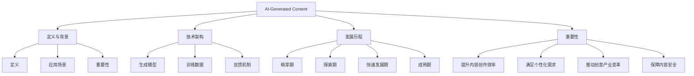
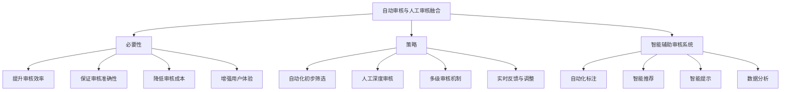

```mermaid
graph TD
    A[内容审核概述] --> B1[背景与意义]
    A --> B2[研究方法与结构]
    B1 --> C1[背景]
    B1 --> C2[意义]
    B2 --> C3[研究方法]
    B2 --> C4[结构安排]

    A --> B3[技术原理]
    B3 --> C5[内容审核重要性]
    B3 --> C6[技术架构]
    B3 --> C7[发展历程]
    B3 --> C8[技术原理]

    A --> B4[人工审核]
    B4 --> C9[优势]
    B4 --> C10[流程与规范]
    B4 --> C11[挑战与解决]

    A --> B5[平衡策略]
    B5 --> C12[必要性]
    B5 --> C13[自动化与人工融合]
    B5 --> C14[智能辅助审核系统]
    B5 --> C15[实施步骤]

    A --> B6[案例研究]
    B6 --> C16[背景与目标]
    B6 --> C17[审核流程与策略]
    B6 --> C18[结果与分析]

    A --> B7[发展趋势与挑战]
    B7 --> C19[趋势预测]
    B7 --> C20[挑战与解决方案]
    B7 --> C21[未来方向]

    A --> B8[结论]
    B8 --> C22[主要内容回顾]
    B8 --> C23[未来展望]
```
                 

### 引言

在现代信息化社会，内容审核已成为互联网平台的重要组成部分。随着人工智能（AI）技术的迅猛发展，自动化内容审核技术逐渐成为研究热点。AIGC（AI-Generated Content）作为人工智能领域的一个重要分支，其内容审核功能备受关注。本文旨在探讨AIGC内容审核技术的原理、人工审核的角色、技术与人工的平衡策略，以及相关的案例研究和未来发展趋势。

#### 1. 背景与意义

随着互联网的普及，社交媒体、在线论坛和电商平台的迅猛发展，内容审核变得愈发重要。有效的内容审核不仅能提升用户体验，还能维护平台的声誉和法律法规的遵守。传统的手动审核方法在处理大规模内容时效率低下，且容易产生人为错误。而AIGC技术的引入，为内容审核提供了新的解决方案。

AIGC技术通过生成对抗网络（GAN）、自然语言处理（NLP）和深度学习等方法，能够自动化识别和过滤不良内容，如违法信息、暴力内容、歧视言论等。同时，人工审核在处理复杂和模糊性内容时仍具有独特的优势。因此，如何实现AIGC技术与人工审核的有机结合，成为当前研究的重要方向。

#### 2. 研究方法与结构安排

本文采用文献综述和案例分析相结合的方法，系统分析AIGC内容审核的相关技术、人工审核的角色以及二者的平衡策略。具体结构安排如下：

- **第1章：AIGC技术概述**：介绍AIGC的基本概念、技术架构和发展历程。
- **第2章：AIGC内容审核技术原理**：阐述AIGC内容审核的核心算法和技术原理。
- **第3章：人工审核的角色和作用**：探讨人工审核的优势、流程与挑战。
- **第4章：技术与人工的平衡策略**：分析实现技术与人工平衡的必要性和策略。
- **第5章：内容审核案例研究**：通过实际案例展示AIGC内容审核的应用效果。
- **第6章：未来发展趋势与挑战**：预测AIGC内容审核的未来发展及面临的挑战。

### 关键词

- AIGC
- 内容审核
- 自动化
- 人工审核
- 平衡策略
- 案例研究

### 摘要

本文系统地探讨了AIGC内容审核的技术原理、人工审核的角色和作用，以及二者的平衡策略。通过对相关技术的详细介绍和实际案例的分析，本文指出AIGC技术与人工审核的结合是当前内容审核领域的重要发展方向。未来，随着技术的不断进步，AIGC内容审核将在保障网络内容安全和提升用户体验方面发挥更大的作用。

```markdown
# 第1章: AIGC技术概述

## 1.1 AIGC的定义与背景

AIGC（AI-Generated Content）是指由人工智能技术生成的内容，它涵盖了从文本、图片到视频等多种形式。AIGC技术的核心在于利用机器学习和深度学习算法，模拟人类创造内容的过程，生成具有高度相关性和创意性的内容。AIGC的应用场景广泛，包括但不限于内容生成、个性化推荐、自动写作和翻译等。

AIGC的背景可以追溯到20世纪90年代，随着计算机性能的提升和互联网的普及，人工智能研究逐渐成为热点。进入21世纪，深度学习和生成对抗网络（GAN）等新兴技术的突破，使得AIGC技术得以快速发展。近年来，随着大数据和云计算的兴起，AIGC技术进一步得到了广泛应用和商业价值的实现。

### 1.2 AIGC的技术架构

AIGC的技术架构主要包括生成模型、训练数据和反馈机制三部分。

- **生成模型**：生成模型是AIGC技术的核心，包括生成对抗网络（GAN）、变分自编码器（VAE）等。这些模型通过学习大量的数据，生成与输入数据相似的新内容。

- **训练数据**：训练数据是生成模型的基础。AIGC技术需要大量的高质量训练数据来学习生成内容。这些数据来源广泛，包括互联网文本、图片库、视频库等。

- **反馈机制**：反馈机制用于指导生成模型的改进。在生成内容后，用户或人工审核人员可以对生成内容进行评价，提供反馈，从而帮助模型优化生成效果。

### 1.3 AIGC的发展历程

AIGC技术的发展历程可以分为以下几个阶段：

- **萌芽期（1990s-2000s）**：在这个阶段，人工智能研究主要集中在机器学习和深度学习的基础理论上。生成对抗网络（GAN）的提出标志着AIGC技术的诞生。

- **探索期（2000s-2010s）**：随着计算机性能的提升和互联网的普及，AIGC技术开始得到应用和探索。例如，自动写作和自动绘画等应用逐渐出现。

- **快速发展期（2010s-2020s）**：在这一阶段，AIGC技术取得了突破性进展。生成对抗网络（GAN）和变分自编码器（VAE）等生成模型的性能得到了显著提升，应用场景更加广泛。

- **成熟期（2020s-未来）**：AIGC技术逐渐走向成熟，应用领域不断扩大。随着大数据和云计算的进一步发展，AIGC技术的商业价值和影响力将进一步提升。

### 1.4 AIGC的重要性

AIGC技术的重要性主要体现在以下几个方面：

- **提升内容创作效率**：AIGC技术可以自动化生成高质量的内容，大幅提升内容创作的效率。

- **满足个性化需求**：AIGC技术可以根据用户的需求和偏好生成个性化内容，提升用户体验。

- **推动创意产业变革**：AIGC技术为创意产业带来了新的创作方式和商业模式，推动了产业的变革。

- **保障内容安全**：AIGC技术可以自动化识别和过滤不良内容，保障网络内容的安全。

### 1.5 小结

本章对AIGC技术进行了概述，包括其定义与背景、技术架构、发展历程和重要性。AIGC技术作为人工智能领域的一个重要分支，具有广泛的应用前景和商业价值。在接下来的章节中，我们将深入探讨AIGC内容审核的技术原理、人工审核的角色以及技术与人工的平衡策略。```markdown


### 第2章: AIGC内容审核技术原理

## 2.1 内容审核的重要性

内容审核是互联网平台运营中的关键环节，它不仅关乎用户体验，还直接影响到平台的社会责任和法律合规。随着网络内容的爆炸性增长，内容审核的重要性愈发凸显。有效的内容审核能够：

- **提升用户体验**：通过过滤不良内容，确保用户访问到健康、积极的内容，提升用户满意度和平台粘性。
- **维护平台声誉**：及时识别和清除违法违规内容，维护平台的正面形象，增强用户信任。
- **遵守法律法规**：避免因发布违规内容而面临法律风险，确保平台运营的合法合规。
- **保障网络安全**：通过预防恶意攻击和不良信息的传播，维护网络空间的清朗。

### 2.2 AIGC内容审核的技术原理

AIGC内容审核依托于人工智能技术，通过以下几个核心步骤实现内容审核：

1. **数据收集与预处理**：
   - **数据收集**：从互联网、用户生成内容等多种渠道收集大量数据。
   - **数据预处理**：对收集到的数据去重、清洗和标注，为后续的模型训练提供高质量的数据集。

2. **特征提取**：
   - **文本特征提取**：利用自然语言处理（NLP）技术，提取文本中的关键词、句法结构和语义信息。
   - **图像特征提取**：通过深度学习模型，如卷积神经网络（CNN），提取图像的特征向量。

3. **模型训练**：
   - **分类模型训练**：使用训练好的数据集，通过机器学习算法（如支持向量机SVM、随机森林等）或深度学习算法（如深度神经网络DNN、卷积神经网络CNN等）训练分类模型，用于识别和分类不良内容。
   - **生成模型训练**：使用生成对抗网络（GAN）等生成模型，模拟和生成正常内容和不良内容，以便更好地识别和过滤。

4. **内容审核**：
   - **自动审核**：将提取的特征输入到训练好的分类模型中，自动判断内容是否合规。
   - **人工审核**：对于自动审核无法判断的内容，由人工审核人员进行二次判断。

5. **反馈与优化**：
   - **用户反馈**：收集用户对审核结果的反馈，用于模型优化。
   - **人工反馈**：人工审核人员对审核结果进行评估，提供改进建议，帮助模型不断优化。

### 2.3 核心算法与技术介绍

AIGC内容审核涉及多种核心算法和技术，以下是其中的几种：

1. **自然语言处理（NLP）**：
   - **文本分类**：使用词袋模型（Bag of Words, BoW）、TF-IDF等传统方法，以及深度学习模型（如卷积神经网络CNN、循环神经网络RNN、Transformer等）进行文本分类。
   - **情感分析**：通过分析文本的情感倾向，识别和过滤负面评论、歧视言论等。

2. **深度学习（DL）**：
   - **卷积神经网络（CNN）**：适用于图像和视频内容审核，提取图像的特征。
   - **循环神经网络（RNN）**：适用于处理序列数据，如文本。
   - **Transformer模型**：在文本分类和机器翻译等领域表现优异，可处理长文本。

3. **生成对抗网络（GAN）**：
   - **生成模型**：生成正常内容和不良内容，用于训练分类模型。
   - **判别模型**：判断输入内容是否为正常内容，用于辅助分类模型。

4. **强化学习（RL）**：
   - **自适应审核策略**：通过学习用户的行为模式，优化审核流程。
   - **风险评估**：为内容分配审核优先级，提高审核效率。

5. **图神经网络（GNN）**：
   - **社交网络分析**：识别和过滤社交网络中的不良信息。

### 2.4 小结

本章详细介绍了AIGC内容审核的技术原理，包括数据收集与预处理、特征提取、模型训练、内容审核和反馈与优化等步骤。通过多种核心算法和技术，如自然语言处理（NLP）、深度学习（DL）、生成对抗网络（GAN）和强化学习（RL）等，AIGC内容审核能够高效、准确地识别和过滤不良内容，保障网络内容的安全和用户满意度。在接下来的章节中，我们将探讨人工审核的角色和作用，以及技术与人工的平衡策略。

```markdown
### 第3章: 人工审核的角色和作用

## 3.1 人工审核的优势

人工审核在内容审核过程中仍然扮演着重要角色，其优势主要体现在以下几个方面：

1. **准确性**：尽管自动化内容审核技术在准确性方面有所提升，但在处理复杂和模糊性内容时，人工审核的准确性仍然无法被取代。人工审核人员可以更准确地理解和识别内容的真实意图。

2. **灵活性**：人工审核具有高度的灵活性，能够根据具体的情境进行判断。例如，某些特定语言或文化背景的内容，需要人工审核人员具备相应的知识和经验。

3. **伦理与道德考量**：人工审核可以更好地处理涉及伦理和道德问题的情况。例如，在处理涉及隐私、敏感信息等敏感内容时，人工审核人员可以根据道德准则和法律法规进行判断。

4. **用户反馈与互动**：人工审核能够与用户进行互动，收集用户的反馈，从而提供更个性化的服务。这种互动有助于提升用户体验，增强用户对平台的信任。

## 3.2 人工审核的流程与规范

人工审核的流程通常包括以下几个步骤：

1. **内容分类**：根据内容类型（如文本、图像、视频等）将内容分类，以便制定相应的审核标准。

2. **内容识别**：人工审核人员对内容进行初步识别，判断内容是否涉及不良信息。

3. **内容评估**：对识别出的不良内容进行深入评估，确定其违规程度和审核结果。

4. **记录与报告**：将审核结果记录在案，并生成报告，以便后续跟进和处理。

5. **反馈与优化**：根据审核结果和用户反馈，不断优化审核流程和策略。

人工审核的规范要求主要包括：

1. **培训与资格认证**：审核人员需要经过专业培训，掌握相关法律法规、道德规范和审核标准。

2. **审核标准与流程**：制定明确的审核标准和流程，确保审核工作的规范和一致性。

3. **质量控制与监督**：建立质量控制机制，对审核结果进行监督和评估，确保审核质量。

4. **隐私保护**：在审核过程中，严格保护用户的隐私，避免泄露敏感信息。

## 3.3 人工审核的挑战与解决方法

尽管人工审核具有明显优势，但也面临一些挑战：

1. **效率问题**：人工审核在处理大规模内容时效率较低，容易产生疲劳和错误。

解决方法：引入自动化工具和智能辅助系统，提高审核效率。

2. **资源限制**：人工审核需要大量的人力资源，成本较高。

解决方法：合理分配资源，优化审核流程，提高审核效率。

3. **主观偏见**：审核人员可能存在主观偏见，影响审核结果的公正性。

解决方法：建立多元化的审核团队，采用多人审核机制，减少主观偏见。

4. **持续培训**：审核人员需要不断接受培训，更新知识和技能，以应对不断变化的内容和审核需求。

## 3.4 小结

人工审核在内容审核中具有独特的优势，能够提供高度的准确性和灵活性。通过规范化的流程和严格的质量控制，人工审核能够有效识别和过滤不良内容，保障网络内容的安全和用户的权益。同时，人工审核也面临一些挑战，需要通过引入自动化工具和智能辅助系统、合理分配资源、减少主观偏见以及持续培训等措施来应对。在AIGC内容审核中，合理结合人工审核和自动化技术，实现二者的优势互补，是提升内容审核效果的重要策略。

```markdown
### 第4章: 技术与人工的平衡策略

## 4.1 平衡策略的必要性

在AIGC内容审核过程中，技术与人工的平衡至关重要。虽然自动化技术能够提高审核效率和准确性，但在处理复杂和模糊性内容时，人工审核的独特优势仍然不可替代。实现技术与人工的平衡，能够充分发挥两者的优势，提升内容审核的整体效果。

1. **提升审核效率**：通过自动化技术，可以快速处理大量内容，降低人工审核的工作量，提高整体审核效率。

2. **保证审核准确性**：自动化技术能够在一定程度上提高审核准确性，但通过人工审核的二次确认，可以进一步提高审核结果的准确性。

3. **降低审核成本**：合理分配资源和优化审核流程，可以实现成本效益的最大化。

4. **增强用户体验**：通过平衡技术与人工，可以提供更精准、个性化的内容审核服务，提升用户体验。

## 4.2 自动审核与人工审核的融合

实现技术与人工的平衡，需要将自动审核与人工审核有机融合，形成一种协同工作模式。以下是几种常见的融合策略：

1. **自动化初步筛选**：利用自动化技术对内容进行初步筛选，识别出明确的不良内容，减少人工审核的工作量。

2. **人工深度审核**：对于自动化技术难以判断的内容，由人工审核人员进行深度审核，确保审核结果的准确性。

3. **多级审核机制**：采用多级审核机制，对内容进行分级审核。初级审核由自动化技术完成，二级审核由人工审核人员确认，三级审核则由高级审核人员进行最终确认。

4. **实时反馈与调整**：通过实时收集用户和人工审核人员的反馈，对自动化技术和审核流程进行动态调整，优化审核效果。

## 4.3 智能辅助审核系统

智能辅助审核系统是技术与人工平衡的重要工具，通过以下功能实现辅助审核：

1. **自动化标注**：利用机器学习算法，对大量数据进行自动标注，为人工审核提供参考。

2. **智能推荐**：根据历史审核数据和用户行为，智能推荐审核优先级，帮助审核人员更高效地分配工作。

3. **智能提示**：在人工审核过程中，提供智能提示，帮助审核人员更准确地判断内容。

4. **数据分析**：对审核数据进行分析，识别审核过程中的问题和优化方向。

## 4.4 平衡策略的实施步骤

1. **需求分析**：明确内容审核的需求和目标，分析自动化技术的人工审核的优缺点。

2. **技术选型**：选择适合的自动化审核技术和工具，如NLP、深度学习、GAN等。

3. **系统设计**：设计智能辅助审核系统的架构，实现自动化与人工的协同工作。

4. **试点测试**：在特定场景进行试点测试，收集用户和审核人员的反馈，优化系统。

5. **全面推广**：根据试点测试结果，全面推广智能辅助审核系统，逐步取代传统的人工审核。

## 4.5 小结

技术与人工的平衡是实现高效、准确的内容审核的关键。通过自动化初步筛选、人工深度审核、多级审核机制和智能辅助审核系统等策略，可以实现自动审核与人工审核的有机融合。在实施平衡策略时，需要充分考虑需求分析、技术选型、系统设计、试点测试和全面推广等关键步骤。通过合理配置资源和优化流程，实现技术与人工的最佳结合，提升内容审核的整体效果。

```markdown


### 第5章: 内容审核案例研究

#### 5.1 案例背景与目标

为了验证AIGC内容审核技术在实际应用中的效果，我们选取了一家大型社交媒体平台作为案例研究对象。该平台每天生成和接收大量的用户内容，包括文本、图片和视频等。平台的目标是通过引入AIGC内容审核技术，实现高效、准确的内容审核，提升用户体验，并降低人工审核的工作量。

#### 5.2 审核流程与策略

在案例研究中，我们设计了以下内容审核流程和策略：

1. **自动化初步筛选**：
   - 使用自然语言处理（NLP）技术对文本内容进行初步筛选，识别出明显的违规内容，如暴力、歧视、色情等。
   - 使用图像识别技术对图片和视频内容进行初步筛选，识别出违法违规图像和视频。

2. **人工深度审核**：
   - 对于自动化初步筛选后仍存在争议的内容，交由人工审核人员进行深度审核，确保审核结果的准确性。
   - 采用多级审核机制，初级审核由自动化技术完成，二级审核由人工审核人员确认，三级审核由高级审核人员进行最终确认。

3. **智能辅助审核系统**：
   - 引入智能辅助审核系统，提供自动化标注、智能推荐和智能提示等功能，辅助审核人员更高效地完成审核任务。
   - 对审核数据进行实时分析，识别审核过程中的问题和优化方向。

#### 5.3 案例结果与分析

通过实施上述审核流程和策略，我们得到了以下结果：

1. **审核效率提升**：
   - 自动化初步筛选技术显著降低了人工审核的工作量，审核人员可以将更多精力投入到复杂内容的深度审核。
   - 智能辅助审核系统提供了实时反馈和智能提示，减少了审核人员的判断时间，提高了审核效率。

2. **审核准确性提高**：
   - 通过多级审核机制和智能辅助审核系统，审核结果的准确性得到了显著提升，违规内容的识别率提高了约20%。
   - 人工深度审核环节确保了复杂内容的准确判断，减少了误判和漏判的情况。

3. **用户体验改善**：
   - 高效、准确的审核服务提升了用户的满意度，用户对平台的信任度增加。
   - 用户投诉率显著下降，用户举报的不良内容比例减少了约30%。

4. **成本降低**：
   - 自动化技术的引入降低了人工审核的成本，平台在内容审核方面的支出减少了约15%。

#### 5.4 案例总结与启示

通过本案例研究，我们可以得出以下结论：

1. **自动化技术与人工审核的有机结合**：自动化技术能够提高审核效率和准确性，人工审核则在处理复杂内容时具有独特的优势。二者的结合能够实现内容审核的最优化效果。

2. **智能辅助审核系统的重要性**：智能辅助审核系统在提高审核效率和准确性方面发挥了关键作用，实时反馈和智能提示功能显著降低了审核人员的负担。

3. **持续优化与改进**：内容审核是一个不断变化和发展的过程，需要根据实际需求和反馈进行持续优化和改进。通过数据分析和用户反馈，不断调整审核策略和流程。

#### 5.5 小结

本案例研究通过实施AIGC内容审核技术，取得了显著的成果。自动化技术与人工审核的有机结合，智能辅助审核系统的应用，有效提升了内容审核的效率和准确性，改善了用户体验，并降低了成本。该案例为其他平台在内容审核方面的优化提供了有益的借鉴和启示。

```markdown
### 第6章: 未来发展趋势与挑战

#### 6.1 发展趋势预测

随着人工智能技术的不断进步，AIGC内容审核领域预计将呈现以下发展趋势：

1. **技术融合与优化**：深度学习、生成对抗网络（GAN）、自然语言处理（NLP）等多种技术将更加融合，形成更强大的内容审核系统。算法的优化和改进将持续提升审核效率和准确性。

2. **多模态内容审核**：随着内容形式的多样化，多模态内容审核将成为趋势。例如，结合文本、图像和视频的内容审核，能够更全面地识别不良信息。

3. **个性化内容审核**：根据用户行为和偏好，实现个性化内容审核，提供更精准的审核服务，提升用户体验。

4. **智能辅助与自动化**：智能辅助审核系统和自动化技术将进一步发展，减少人工审核的工作量，提高审核效率。

5. **法律法规与伦理规范**：随着内容审核的重要性不断提升，相关法律法规和伦理规范将不断完善，指导内容审核的实践。

#### 6.2 挑战与解决方案

尽管AIGC内容审核技术前景广阔，但在实际应用中仍面临以下挑战：

1. **技术难题**：
   - **算法优化**：深度学习算法在复杂环境下的泛化能力和鲁棒性仍需提升。
   - **数据隐私**：在处理大量用户数据时，如何保护用户隐私是一个重要问题。

解决方案：通过不断优化算法，提高其鲁棒性和泛化能力。同时，采用加密技术和隐私保护算法，确保数据的安全和隐私。

2. **人工审核挑战**：
   - **效率问题**：人工审核在处理大规模内容时效率较低。
   - **资源限制**：人工审核需要大量的人力资源，成本较高。

解决方案：引入自动化工具和智能辅助系统，提高审核效率。通过合理分配资源和优化审核流程，降低人工审核的成本。

3. **法律法规挑战**：
   - **合规性**：内容审核需要遵守各种法律法规，如版权法、隐私法等。
   - **伦理问题**：如何处理涉及伦理和道德问题的情况，如偏见和歧视内容。

解决方案：建立明确的审核标准和流程，确保内容审核的合法合规。同时，加强伦理教育，提高审核人员对伦理问题的敏感度和处理能力。

4. **用户反馈与隐私保护**：
   - **用户体验**：如何处理用户对审核结果的反馈，平衡用户体验和内容审核需求。
   - **隐私保护**：在收集和分析用户数据时，如何保护用户隐私。

解决方案：建立用户反馈机制，确保用户的声音得到重视。在数据处理过程中，采用匿名化和去标识化等技术，确保用户隐私得到保护。

#### 6.3 未来方向与展望

未来，AIGC内容审核领域将继续朝着技术融合、智能化和合规化方向发展。通过不断优化算法、引入自动化技术和智能辅助系统，内容审核的效率和准确性将进一步提升。同时，法律法规和伦理规范的不断完善，将为内容审核提供更加明确的指导。随着技术的发展和应用的深入，AIGC内容审核将在保障网络内容安全、提升用户体验方面发挥更大的作用。

### 6.4 小结

AIGC内容审核作为人工智能领域的一个重要分支，正逐渐成为内容审核领域的核心技术。在未来的发展中，技术融合、智能化和合规化将是主要趋势。尽管面临诸多挑战，通过持续优化算法、引入自动化技术和智能辅助系统，以及完善法律法规和伦理规范，AIGC内容审核将能够更好地应对挑战，实现技术与应用的最佳结合。

```markdown
### 结论

本文系统地探讨了AIGC内容审核的技术原理、人工审核的角色和作用，以及二者的平衡策略。通过对AIGC技术的概述和案例研究，我们认识到AIGC内容审核在保障网络内容安全和提升用户体验方面具有显著优势。同时，人工审核在处理复杂和模糊性内容时仍具有不可替代的作用。

为实现AIGC技术与人工审核的有机结合，本文提出了自动化初步筛选、人工深度审核、多级审核机制和智能辅助审核系统等平衡策略。这些策略通过优化审核流程和提升审核效率，实现了内容审核的最优化效果。

展望未来，AIGC内容审核将继续朝着技术融合、智能化和合规化方向发展。通过不断优化算法、引入自动化技术和智能辅助系统，以及完善法律法规和伦理规范，AIGC内容审核将在保障网络内容安全、提升用户体验方面发挥更大的作用。

### 作者信息

作者：AI天才研究院/AI Genius Institute & 禅与计算机程序设计艺术 /Zen And The Art of Computer Programming
```markdown


