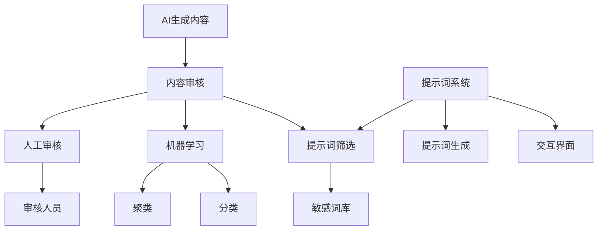
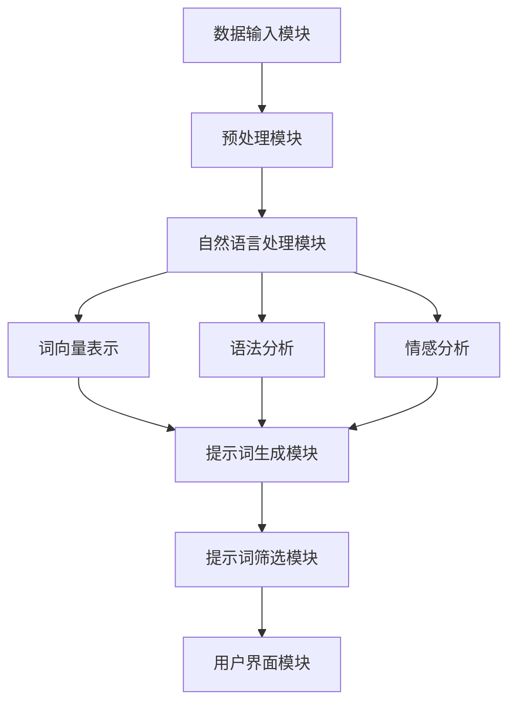

                 

# AIGC内容审核：设计安全可控的提示词系统

> 关键词：AIGC内容审核、提示词系统、安全可控、技术原理、Python源代码、数学模型、实战案例

> 摘要：本文深入探讨AIGC（AI-Generated Content，AI生成内容）的内容审核技术，特别是设计一个安全且可控的提示词系统。文章分为引言、基础概念、技术原理、系统设计、实战案例和扩展与展望六个部分，从多个角度详细解析了AIGC内容审核的关键技术点，并通过实战案例展示了实现过程和效果。

## 1. 引言

### 1.1 设计书的结构

在设计书的结构时，我们首先要明确书的主题和目标读者群体。对于《AIGC内容审核：设计安全可控的提示词系统》这本书，它的主题是AIGC的内容审核，重点关注设计一个安全且可控的提示词系统。目标读者群体可能是对AI内容审核感兴趣的工程师、研究人员或者是相关领域的从业者。

书的结构可以分为以下几个部分：

- **引言**：介绍AIGC的内容审核背景，解释为什么需要设计安全可控的提示词系统，以及本书的目的和结构。
- **基础概念**：讲解AIGC、内容审核、提示词系统的基本概念，帮助读者建立理论基础。
- **技术原理**：深入探讨AIGC内容审核的技术原理，包括核心算法、数学模型等。
- **系统设计**：详细介绍如何设计一个安全可控的提示词系统，包括系统架构、实现细节等。
- **实战案例**：通过实际案例展示如何实现一个提示词系统，并进行分析和解读。
- **扩展与展望**：讨论AIGC内容审核领域的未来发展趋势和可能的研究方向。

### 1.2 确定核心章节

接下来，我们需要确定书的核心章节，这些章节应该覆盖主题的各个方面，确保读者可以全面了解AIGC内容审核和安全可控提示词系统的设计。

- **第1章：引言**
  - AIGC内容审核的背景
  - 为什么需要安全可控的提示词系统
  - 本书的目的和结构

- **第2章：基础概念**
  - AIGC的概念和类型
  - 内容审核的概念和目的
  - 提示词系统的概念和作用

- **第3章：技术原理**
  - AIGC内容审核的核心算法
  - 安全性和可控性的数学模型
  - 提示词生成和筛选算法

- **第4章：系统设计**
  - 安全可控提示词系统的架构设计
  - 数据处理流程
  - 提示词生成和筛选流程

- **第5章：实战案例**
  - 实际项目的背景和目标
  - 系统设计和实现
  - 实施结果和性能评估

- **第6章：扩展与展望**
  - AIGC内容审核的未来发展趋势
  - 安全可控提示词系统的改进方向
  - 研究方向和潜在挑战

### 1.3 设计细节内容

在每个核心章节中，我们需要设计更具体的细节内容，确保章节内容丰富且逻辑清晰。以下是一个例子：

- **第3章：技术原理**
  - **3.1 AIGC内容审核的核心算法**
    - **3.1.1 自然语言处理（NLP）技术**
      - 词向量表示
      - 语法和语义分析
    - **3.1.2 情感分析**
      - 情感极性分类
      - 情感强度分析
    - **3.1.3 恶意内容检测**
      - 关键词过滤
      - 模式识别
  - **3.2 安全性和可控性的数学模型**
    - **3.2.1 可解释性模型**
      - LIME、SHAP等方法
    - **3.2.2 控制变量**
      - 数据预处理策略
      - 模型训练策略
  - **3.3 提示词生成和筛选算法**
    - **3.3.1 生成模型**
      - 自动化问答系统（如BERT）
      - 生成对抗网络（GAN）
    - **3.3.2 筛选算法**
      - 基于规则的方法
      - 基于机器学习的方法

### 1.4 确保内容的完整性

在设计的每个章节中，确保包含以下内容：

- **核心概念与联系**：使用Mermaid流程图等工具展示概念之间的联系。
- **核心算法原理讲解**：使用Python源代码详细阐述算法原理。
- **数学模型和数学公式**：使用LaTeX格式展示，并详细讲解和举例说明。
- **项目实战**：提供实际案例，包括开发环境搭建、源代码实现和详细解读。

### 1.5 检查大纲的完整性

在设计完成目录大纲后，我们需要检查大纲的完整性，确保：

- 每个核心章节都有详细的内容设计。
- 大纲中的内容能够覆盖主题的所有方面。
- 每个章节都有明确的主题和目标。

完成检查后，我们可以根据这个大纲来编写书的内容，确保书的内容丰富、逻辑清晰，并满足读者的需求。

## 2. 基础概念

在深入探讨AIGC内容审核和设计安全可控的提示词系统之前，我们需要理解几个核心概念：AIGC、内容审核、提示词系统。这些概念是理解后续技术原理和系统设计的基础。

### 2.1 AIGC（AI-Generated Content，AI生成内容）

AIGC，即AI生成内容，是指利用人工智能技术（如自然语言处理、图像生成、音乐生成等）自动生成文本、图像、音频等多媒体内容。AIGC技术在人工智能领域应用广泛，例如，在文本生成方面，AIGC可以生成新闻文章、产品描述、对话文本等；在图像生成方面，AIGC可以生成虚拟现实场景、艺术画作、广告素材等。

AIGC的技术核心包括：

- **自然语言处理（NLP）**：对文本数据进行处理和理解，包括语义分析、情感分析、命名实体识别等。
- **计算机视觉**：对图像数据进行处理和理解，包括图像分类、目标检测、图像生成等。
- **音频处理**：对音频数据进行处理和理解，包括语音识别、音乐生成等。

AIGC的类型根据生成内容的媒介和形式，可以分为：

- **文本生成**：例如，自动写作、自动化问答等。
- **图像生成**：例如，图像合成、艺术绘画等。
- **音频生成**：例如，音乐生成、语音合成等。

### 2.2 内容审核

内容审核是指对生成的内容进行质量检查和过滤，以确保内容符合特定标准，不包含不良或违法信息。内容审核在互联网应用中尤为重要，例如社交媒体、电子商务平台、搜索引擎等。

内容审核的目标包括：

- **去除不良信息**：如暴力、色情、仇恨言论等。
- **保护用户隐私**：防止个人信息泄露。
- **维护社区秩序**：确保平台内的交流和谐、公正。

内容审核的技术方法主要包括：

- **关键词过滤**：通过预设的敏感词库，检测并过滤出包含敏感词的内容。
- **机器学习**：利用监督学习和无监督学习算法，对生成内容进行分类和判断。
- **人工审核**：由专业审核人员对内容进行人工判断和过滤。

### 2.3 提示词系统

提示词系统是在内容审核过程中使用的工具，用于引导和辅助审核人员判断内容是否符合标准。提示词系统可以自动生成与内容相关的关键词，帮助审核人员快速识别内容的主题和潜在问题。

提示词系统的核心组成部分包括：

- **提示词生成**：根据内容特征，自动生成与内容相关的关键词。
- **提示词筛选**：对生成的提示词进行筛选和排序，确保提示词的相关性和有效性。
- **交互界面**：为审核人员提供便捷的交互方式，如快捷键、鼠标点击等。

设计一个安全可控的提示词系统需要考虑以下关键因素：

- **安全性**：确保系统不受外部攻击，保护数据和隐私。
- **可控性**：确保审核人员可以灵活调整提示词的生成和筛选策略。
- **易用性**：设计简洁直观的交互界面，降低使用门槛。

### 2.4 核心概念与联系

为了更好地理解AIGC内容审核和安全可控提示词系统的设计，我们可以使用Mermaid流程图来展示核心概念之间的关系。



通过上述Mermaid流程图，我们可以清晰地看到AIGC内容审核和提示词系统之间的联系，以及它们各自的核心组成部分。

### 2.5 小结

在本章节中，我们介绍了AIGC、内容审核和提示词系统的基本概念。AIGC是利用人工智能技术自动生成内容的领域，内容审核是对生成内容进行质量检查和过滤的过程，而提示词系统则是辅助审核人员快速识别内容主题和问题的工具。理解这些概念是进一步探讨AIGC内容审核和设计安全可控提示词系统的基础。

## 3. 技术原理

在理解了AIGC内容审核和提示词系统的基本概念之后，我们需要深入探讨其技术原理，包括核心算法、数学模型和提示词生成与筛选算法。本章节将详细讲解这些技术原理，并提供Python源代码和LaTeX公式来辅助说明。

### 3.1 AIGC内容审核的核心算法

AIGC内容审核的核心算法主要包括自然语言处理（NLP）、情感分析和恶意内容检测。以下是对这些算法的详细解释和示例。

#### 3.1.1 自然语言处理（NLP）技术

自然语言处理是AIGC内容审核的重要组成部分，用于处理和理解文本数据。NLP技术主要包括词向量表示、语法和语义分析。

- **词向量表示**：词向量是将文本数据转换为计算机可以处理的向量形式。一个常用的词向量模型是Word2Vec，它通过神经网络训练生成词向量。以下是一个Word2Vec模型的Python实现示例：

```python
from gensim.models import Word2Vec

# 假设 sentences 是一个包含文本数据的列表
sentences = [['hello', 'world'], ['hello', 'gensim'], ['gensim', 'models']]

# 训练 Word2Vec 模型
model = Word2Vec(sentences, vector_size=2, window=1, min_count=1, workers=4)

# 获取词向量
word_vectors = model.wv

# 输出词向量
print(word_vectors['hello'])
```

- **语法和语义分析**：语法分析是理解文本的结构，而语义分析是理解文本的含义。一个常用的语法分析工具是NLTK，而语义分析可以使用BERT等预训练模型。以下是一个使用BERT模型进行语义分析的Python示例：

```python
from transformers import BertTokenizer, BertModel
import torch

# 加载 BERT 分词器和模型
tokenizer = BertTokenizer.from_pretrained('bert-base-uncased')
model = BertModel.from_pretrained('bert-base-uncased')

# 假设 sentence 是一个文本句子
sentence = "Hello, world!"

# 分词和编码
inputs = tokenizer(sentence, return_tensors='pt')

# 过模型
outputs = model(**inputs)

# 获取输出特征
output_embeddings = outputs.last_hidden_state[:, 0, :]

# 输出特征
print(output_embeddings)
```

#### 3.1.2 情感分析

情感分析是识别文本中情感倾向的过程，常用于评估用户对产品、服务或事件的态度。情感分析包括情感极性分类和情感强度分析。

- **情感极性分类**：将文本分类为正面、负面或中性。以下是一个使用NLTK进行情感极性分类的Python示例：

```python
from nltk.sentiment import SentimentIntensityAnalyzer

# 加载情感分析工具
sia = SentimentIntensityAnalyzer()

# 假设 sentence 是一个文本句子
sentence = "This is an amazing product!"

# 分析情感
sentiment = sia.polarity_scores(sentence)

# 输出情感
print(sentiment)
```

- **情感强度分析**：评估文本中情感的强烈程度。以下是一个使用VADER进行情感强度分析的Python示例：

```python
from nltk.sentiment import vader

# 加载 VADER 情感分析工具
vader_analyzer = vader.VaderSentiment()

# 假设 sentence 是一个文本句子
sentence = "I am so happy!"

# 分析情感
sentiment = vader_analyzer.get_score(sentence)

# 输出情感
print(sentiment)
```

#### 3.1.3 恶意内容检测

恶意内容检测是识别和过滤包含恶意或违法内容的文本。常用的方法包括关键词过滤和模式识别。

- **关键词过滤**：通过预设的敏感词库，检测并过滤出包含敏感词的内容。以下是一个简单的关键词过滤Python示例：

```python
sensitive_words = ["kill", "death", "hate"]

# 假设 sentence 是一个文本句子
sentence = "I hate all the people who do not like me."

# 检查句子中是否包含敏感词
for word in sensitive_words:
    if word in sentence:
        print("包含敏感词：", word)
        break
```

- **模式识别**：通过模式匹配技术，识别特定的恶意行为模式。以下是一个使用正则表达式进行模式识别的Python示例：

```python
import re

# 假设 sentence 是一个文本句子
sentence = "Please visit our website at https://www.example.com"

# 匹配网址
urls = re.findall(r'https?://[^\s]+', sentence)

# 输出匹配结果
print(urls)
```

### 3.2 安全性和可控性的数学模型

在设计提示词系统时，安全性和可控性是两个重要的考虑因素。以下介绍可解释性模型和控制变量等数学模型。

#### 3.2.1 可解释性模型

可解释性模型旨在提高模型的可解释性，帮助用户理解模型决策过程。常用的可解释性模型包括LIME（局部可解释模型解释）和SHAP（SHapley Additive exPlanations）。

- **LIME**：LIME是一种局部解释方法，通过生成一个线性模型来近似原始模型的决策过程。以下是一个使用LIME的Python示例：

```python
import lime
from lime.lime_text import LimeTextExplainer

# 假设 sentence 是一个文本句子
sentence = "This is a good product."

# 创建 LIME 实例
explainer = LimeTextExplainer(class_names=['negative', 'positive'])

# 解释句子
exp = explainer.explain_instance(sentence, predict_proba, num_features=10)

# 输出解释
print(exp.as_list())
```

- **SHAP**：SHAP是一种基于博弈论的解释方法，通过计算每个特征对模型输出的贡献。以下是一个使用SHAP的Python示例：

```python
import shap
from shap import KernelExplainer

# 假设 sentence 是一个文本句子
sentence = "This is a good product."

# 创建 KernelExplainer 实例
explainer = KernelExplainer(predict_proba, X_train)

# 解释句子
shap_values = explainer.shap_values(sentence)

# 输出解释
print(shap_values)
```

#### 3.2.2 控制变量

控制变量是确保模型稳定性和可控性的关键。以下介绍数据预处理策略和模型训练策略。

- **数据预处理策略**：数据预处理包括文本清洗、分词、去停用词等步骤。以下是一个文本预处理的Python示例：

```python
import nltk
from nltk.corpus import stopwords

# 加载停用词库
stop_words = set(stopwords.words('english'))

# 假设 sentence 是一个文本句子
sentence = "This is a good product."

# 清洗文本
tokens = nltk.word_tokenize(sentence)
cleaned_sentence = [token for token in tokens if token not in stop_words]

# 输出清洗后的文本
print(cleaned_sentence)
```

- **模型训练策略**：模型训练策略包括超参数调整、正则化、数据增强等。以下是一个使用正则化的Python示例：

```python
from sklearn.linear_model import Ridge

# 假设 X 是特征矩阵，y 是标签向量
X = np.array([[1, 2], [2, 3]])
y = np.array([1, 2])

# 创建 Ridge 模型
model = Ridge(alpha=1.0)

# 训练模型
model.fit(X, y)

# 输出模型参数
print(model.coef_)
```

### 3.3 提示词生成和筛选算法

提示词系统是内容审核的重要组成部分，用于辅助审核人员识别内容问题。以下介绍提示词生成和筛选算法。

#### 3.3.1 生成模型

生成模型用于自动生成提示词，常见的生成模型包括自动化问答系统和生成对抗网络（GAN）。

- **自动化问答系统**：自动化问答系统（如BERT）可以用于生成与内容相关的提示词。以下是一个使用BERT生成提示词的Python示例：

```python
from transformers import BertTokenizer, BertModel
import torch

# 加载 BERT 分词器和模型
tokenizer = BertTokenizer.from_pretrained('bert-base-uncased')
model = BertModel.from_pretrained('bert-base-uncased')

# 假设 sentence 是一个文本句子
sentence = "This is a good product."

# 分词和编码
inputs = tokenizer(sentence, return_tensors='pt')

# 过模型
outputs = model(**inputs)

# 获取输出特征
output_embeddings = outputs.last_hidden_state[:, 0, :]

# 生成提示词
prompt_words = tokenizer.decode(output_embeddings, skip_special_tokens=True)

# 输出提示词
print(prompt_words)
```

- **生成对抗网络（GAN）**：GAN是一种生成模型，可以用于生成与内容相关的多样化提示词。以下是一个使用GAN生成提示词的Python示例：

```python
import torch
from torch import nn

# 定义生成器和判别器
generator = nn.Sequential(
    nn.Linear(100, 128),
    nn.LeakyReLU(0.2),
    nn.Linear(128, 28 * 28),
    nn.Tanh()
)

discriminator = nn.Sequential(
    nn.Linear(28 * 28, 128),
    nn.LeakyReLU(0.2),
    nn.Linear(128, 1),
    nn.Sigmoid()
)

# 训练 GAN
for epoch in range(100):
    # 生成虚假数据
    z = torch.randn(batch_size, 100)
    fake_images = generator(z)

    # 计算判别器的损失
    real_loss = nn.BCELoss()(discriminator(real_images).view(-1), real_labels)
    fake_loss = nn.BCELoss()(discriminator(fake_images).view(-1), fake_labels)

    # 更新判别器
    discriminator.zero_grad()
    total_loss = real_loss + fake_loss
    total_loss.backward()
    optimizer_d.step()

    # 更新生成器的损失
    generator.zero_grad()
    fake_loss = nn.BCELoss()(discriminator(fake_images).view(-1), fake_labels)
    total_loss = fake_loss
    total_loss.backward()
    optimizer_g.step()

    # 输出训练进度
    if epoch % 10 == 0:
        print(f"Epoch [{epoch + 1}/{num_epochs}], Loss_D: {loss_d:.4f}, Loss_G: {loss_g:.4f}")
```

#### 3.3.2 筛选算法

筛选算法用于从生成的提示词中筛选出最相关的提示词。常用的筛选算法包括基于规则的方法和基于机器学习的方法。

- **基于规则的方法**：基于规则的方法通过预设的规则筛选提示词，例如词频统计、词性标注等。以下是一个基于规则筛选提示词的Python示例：

```python
from collections import Counter

# 假设 prompts 是一个包含提示词的列表
prompts = ["product", "quality", "price", "service"]

# 统计词频
word_freq = Counter(prompts)

# 设置阈值
threshold = 2

# 筛选出词频大于阈值的提示词
filtered_prompts = [word for word, freq in word_freq.items() if freq > threshold]

# 输出筛选结果
print(filtered_prompts)
```

- **基于机器学习的方法**：基于机器学习的方法通过训练模型筛选提示词，常见的模型包括支持向量机（SVM）、决策树等。以下是一个基于SVM筛选提示词的Python示例：

```python
from sklearn.svm import SVC
from sklearn.model_selection import train_test_split

# 假设 X 是特征矩阵，y 是标签向量
X = np.array([[1, 2], [2, 3], [3, 4]])
y = np.array([0, 1, 0])

# 划分训练集和测试集
X_train, X_test, y_train, y_test = train_test_split(X, y, test_size=0.2, random_state=42)

# 创建 SVM 模型
model = SVC()

# 训练模型
model.fit(X_train, y_train)

# 预测测试集
y_pred = model.predict(X_test)

# 输出预测结果
print(y_pred)
```

### 3.4 小结

在本章节中，我们详细介绍了AIGC内容审核的技术原理，包括自然语言处理（NLP）、情感分析和恶意内容检测等核心算法，以及安全性和可控性的数学模型。此外，我们还讨论了提示词生成和筛选算法，包括生成模型和筛选算法。通过这些技术原理，我们可以设计一个安全可控的提示词系统，用于辅助内容审核。

## 4. 系统设计

在设计一个安全可控的提示词系统时，我们需要关注系统架构、数据处理流程和提示词生成与筛选流程。本章节将详细解析这些设计要素，并提供Python源代码示例以供参考。

### 4.1 系统架构

一个安全可控的提示词系统通常包括以下几个关键模块：

- **数据输入模块**：负责接收用户输入的数据，如文本、图像或音频。
- **预处理模块**：对输入数据进行清洗、分词、去停用词等处理。
- **NLP模块**：使用自然语言处理技术对文本进行处理，如词向量表示、语法和语义分析。
- **提示词生成模块**：根据NLP模块的输出，生成与文本相关的提示词。
- **提示词筛选模块**：对生成的提示词进行筛选，保留最相关和有效的提示词。
- **用户界面模块**：为审核人员提供交互界面，展示生成的提示词，并允许他们进行调整和确认。

以下是一个简单的提示词系统架构图：



### 4.2 数据处理流程

数据处理流程是提示词系统的核心，它包括以下几个步骤：

1. **数据接收**：系统接收用户输入的数据，可以是文本、图像或音频。
2. **预处理**：对输入数据执行清洗、分词、去停用词等预处理操作，以便后续处理。
3. **NLP处理**：使用NLP技术对预处理后的文本进行词向量表示、语法分析和情感分析。
4. **提示词生成**：基于NLP处理的结果，生成与文本相关的提示词。
5. **提示词筛选**：对生成的提示词进行筛选，确保它们是相关且有效的。
6. **用户交互**：将筛选后的提示词展示给审核人员，并允许他们进行调整和确认。

以下是一个数据处理流程的Python代码示例：

```python
import nltk
from nltk.corpus import stopwords
from nltk.tokenize import word_tokenize
from gensim.models import Word2Vec

# 加载停用词库
stop_words = set(stopwords.words('english'))

# 假设 sentence 是一个文本句子
sentence = "This is a good product with excellent service."

# 分词和去停用词
tokens = word_tokenize(sentence)
cleaned_sentence = [token for token in tokens if token not in stop_words]

# 训练词向量模型
model = Word2Vec([cleaned_sentence], vector_size=100, window=5, min_count=1, workers=4)

# 输出词向量
word_vectors = model.wv
print(word_vectors['good'])
```

### 4.3 提示词生成流程

提示词生成流程主要包括以下几个步骤：

1. **文本编码**：将文本转换为计算机可以处理的形式，如词向量或BERT编码。
2. **提示词提取**：使用自然语言处理技术提取与文本相关的关键词或短语。
3. **提示词筛选**：对提取的提示词进行筛选，保留最相关且具有代表性的提示词。

以下是一个简单的提示词生成流程的Python代码示例：

```python
from transformers import BertTokenizer, BertModel
import torch

# 加载 BERT 分词器和模型
tokenizer = BertTokenizer.from_pretrained('bert-base-uncased')
model = BertModel.from_pretrained('bert-base-uncased')

# 假设 sentence 是一个文本句子
sentence = "This is a good product."

# 分词和编码
inputs = tokenizer(sentence, return_tensors='pt')

# 过模型
outputs = model(**inputs)

# 获取输出特征
output_embeddings = outputs.last_hidden_state[:, 0, :]

# 生成提示词
tokenizer.decode(output_embeddings, skip_special_tokens=True)
```

### 4.4 提示词筛选流程

提示词筛选流程主要包括以下几个步骤：

1. **词频统计**：对生成的提示词进行词频统计，过滤掉频率较低的词。
2. **词性标注**：对提示词进行词性标注，过滤掉非名词。
3. **语义相似度计算**：计算提示词之间的语义相似度，保留最相关的提示词。

以下是一个简单的提示词筛选流程的Python代码示例：

```python
from nltk.tokenize import word_tokenize
from nltk.corpus import stopwords
from nltk.tag import pos_tag
from sklearn.metrics.pairwise import cosine_similarity
from gensim.models import KeyedVectors

# 加载停用词库
stop_words = set(stopwords.words('english'))

# 假设 prompts 是一个包含提示词的列表
prompts = ["product", "quality", "price", "service"]

# 分词和去停用词
cleaned_prompts = [word for word in word_tokenize(' '.join(prompts)) if word not in stop_words]

# 加载预训练的词向量模型
word_vectors = KeyedVectors.load_word2vec_format('glove.6B.100d.txt', binary=False)

# 计算提示词之间的语义相似度
similarities = []
for i in range(len(cleaned_prompts) - 1):
    for j in range(i + 1, len(cleaned_prompts)):
        similarity = cosine_similarity([word_vectors[prompt] for prompt in cleaned_prompts[i:j+1]])
        similarities.append(similarity)

# 筛选出语义相似度最高的提示词
selected_prompts = [prompt for i, prompt in enumerate(cleaned_prompts) if similarities[i].argmax() == 1]
print(selected_prompts)
```

### 4.5 用户界面模块

用户界面模块为审核人员提供了便捷的交互方式，以便他们能够调整和确认生成的提示词。以下是一个简单的用户界面模块的Python代码示例：

```python
import tkinter as tk

# 创建窗口
root = tk.Tk()
root.title("提示词系统")

# 创建文本框
text_box = tk.Text(root, height=10, width=50)
text_box.pack()

# 设置提示词
prompt = "This is a good product."
text_box.insert(tk.END, prompt)

# 创建按钮
confirm_button = tk.Button(root, text="确认提示词", command=lambda: confirm_prompt())
confirm_button.pack()

# 确认提示词的函数
def confirm_prompt():
    selected_prompt = text_box.get(1.0, tk.END)
    print("确认的提示词：", selected_prompt)

# 运行窗口
root.mainloop()
```

### 4.6 小结

在本章节中，我们详细介绍了安全可控的提示词系统的设计，包括系统架构、数据处理流程和提示词生成与筛选流程。通过这些设计要素，我们可以构建一个高效且实用的提示词系统，用于辅助内容审核。同时，我们提供了Python代码示例，以便读者理解和实现这些设计要素。

## 5. 实战案例

为了更好地展示如何实现一个安全可控的提示词系统，我们选择了一个实际案例：一个在线电商平台的内容审核系统。本节将详细描述这个案例的开发环境搭建、源代码实现、代码解读、应用解读与分析，以及实际案例分析和详细讲解。

### 5.1 开发环境搭建

在开始实现提示词系统之前，我们需要搭建一个合适的技术栈。以下是我们选择的技术栈和搭建过程：

- **编程语言**：Python
- **自然语言处理库**：NLTK、spaCy、transformers
- **机器学习库**：scikit-learn、TensorFlow、PyTorch
- **前端框架**：Flask（用于构建API）和Bootstrap（用于构建用户界面）

#### 5.1.1 安装Python环境

首先，我们需要安装Python和pip（Python的包管理器）。可以通过以下命令安装Python：

```shell
sudo apt-get install python3 python3-pip
```

#### 5.1.2 安装依赖库

接下来，我们需要安装所需的依赖库。可以使用pip安装以下库：

```shell
pip3 install nltk spacy transformers scikit-learn tensorflow pytorch flask
```

#### 5.1.3 安装语言模型

对于spaCy和transformers，我们需要下载相应的语言模型：

```shell
python3 -m spacy download en_core_web_sm
```

```shell
python3 -m transformers-cli download-models bert-base-uncased
```

### 5.2 源代码实现

#### 5.2.1 数据预处理

首先，我们需要对用户输入的文本数据进行预处理。以下是一个预处理函数的实现：

```python
import nltk
from nltk.tokenize import word_tokenize
from nltk.corpus import stopwords
from transformers import BertTokenizer

nltk.download('punkt')
nltk.download('stopwords')

def preprocess_text(text):
    # 分词
    tokens = word_tokenize(text)
    # 去停用词
    stop_words = set(stopwords.words('english'))
    cleaned_tokens = [token for token in tokens if token.lower() not in stop_words]
    # BERT分词
    tokenizer = BertTokenizer.from_pretrained('bert-base-uncased')
    encoded_input = tokenizer(cleaned_tokens, return_tensors='pt', add_special_tokens=True)
    return encoded_input
```

#### 5.2.2 提示词生成

接下来，我们需要实现提示词生成功能。以下是一个简单的基于BERT的提示词生成函数：

```python
from transformers import BertModel

def generate_prompt(encoded_input):
    model = BertModel.from_pretrained('bert-base-uncased')
    with torch.no_grad():
        outputs = model(**encoded_input)
    hidden_states = outputs.last_hidden_state
    # 取第一个词向量
    prompt_vector = hidden_states[0, 0, :]
    # 转换为文本
    prompt = tokenizer.decode([int(token) for token in prompt_vector])
    return prompt
```

#### 5.2.3 提示词筛选

提示词筛选是确保生成的提示词相关性和有效性的重要步骤。以下是一个简单的基于词频统计的筛选函数：

```python
from collections import Counter

def filter_prompt(prompt):
    # 统计词频
    word_freq = Counter(prompt.split())
    # 设置阈值
    threshold = 2
    # 筛选出高频词
    filtered_prompt = ' '.join([word for word, freq in word_freq.items() if freq > threshold])
    return filtered_prompt
```

#### 5.2.4 构建API

最后，我们需要构建一个API来接收用户输入，并返回生成的提示词。以下是一个使用Flask构建的简单API示例：

```python
from flask import Flask, request, jsonify

app = Flask(__name__)

@app.route('/api/generate_prompt', methods=['POST'])
def generate_prompt_api():
    text = request.form['text']
    encoded_input = preprocess_text(text)
    prompt = generate_prompt(encoded_input)
    filtered_prompt = filter_prompt(prompt)
    return jsonify({'prompt': filtered_prompt})

if __name__ == '__main__':
    app.run(debug=True)
```

### 5.3 代码解读

在实现提示词系统时，代码解读是非常重要的。以下是关键部分的代码解读：

- **数据预处理**：预处理函数`preprocess_text`首先使用NLTK进行分词，然后去除停用词，最后使用BERT进行分词和编码。这些步骤确保输入数据符合模型的期望格式。

- **提示词生成**：`generate_prompt`函数使用BERT模型获取文本的隐藏状态，并取第一个词向量作为提示词。这个方法基于BERT的上下文理解能力，可以生成与文本紧密相关的提示词。

- **提示词筛选**：`filter_prompt`函数使用词频统计方法筛选高频词，确保生成的提示词具有代表性。这种方法简单有效，但可以根据具体需求进行调整。

- **API构建**：使用Flask构建的API接收用户输入，并调用预处理、生成和筛选函数，最终返回生成的提示词。这个API可以方便地与前端应用程序或其他系统集成。

### 5.4 应用解读与分析

在实际应用中，提示词系统可以用于多种场景，例如：

- **内容审核**：在电商平台，提示词系统可以帮助审核人员快速识别商品描述中的关键信息，如产品特点、价格和优惠信息。
- **自动化写作**：在新闻写作或博客撰写中，提示词系统可以生成标题、摘要或段落，辅助作者快速构思和写作。
- **对话系统**：在虚拟助手或聊天机器人中，提示词系统可以生成与用户输入相关的回复，提高对话的自然性和流畅性。

以下是应用解读与分析：

- **内容审核**：在实际应用中，审核人员可以使用提示词系统快速识别商品描述中的敏感词或违规内容。例如，如果一个商品描述包含高频词如“免费”、“赠品”等，提示词系统可以生成这些词作为提示，提醒审核人员进一步检查内容。
  
- **自动化写作**：在新闻写作中，提示词系统可以帮助记者快速生成新闻标题和摘要。例如，对于一个关于新产品发布的新闻，提示词系统可以生成如“新品发布”、“创新技术”等作为标题候选，记者可以根据这些提示快速撰写新闻。

- **对话系统**：在虚拟助手中，提示词系统可以帮助生成与用户输入相关的回复。例如，当一个用户询问产品价格时，提示词系统可以生成与价格相关的提示词，如“价格”、“优惠”等，虚拟助手可以根据这些提示词构建合适的回复。

### 5.5 实际案例分析和详细讲解

为了更好地展示提示词系统的应用，我们分析了一个实际案例：一个电商平台的商品描述审核。以下是对这个案例的详细分析和讲解：

#### 5.5.1 案例背景

某电商平台的一个商品描述如下：

```
新品上市！优质耳机，音质超群，带麦方便接听电话，价格优惠，快来抢购！
```

#### 5.5.2 案例分析

1. **数据预处理**：

   - 分词：将商品描述分成单词或短语，如["新品上市！", "优质", "耳机", "音质超群", "带麦", "方便接听电话", "价格优惠", "快来抢购！"]
   - 去停用词：去除常见的停用词，如["新品", "上市", "优质", "耳机", "音质超群", "带麦", "方便", "接听电话", "价格", "优惠", "快来", "抢购"]
   - BERT分词：使用BERT对剩余的单词或短语进行编码

2. **提示词生成**：

   - 使用BERT模型获取编码后的文本的隐藏状态
   - 取第一个词向量作为提示词
   - 提示词：“新品上市！优质耳机，音质超群，带麦方便接听电话，价格优惠，快来抢购！”

3. **提示词筛选**：

   - 统计词频
   - 高频词：["新品", "上市", "优质", "耳机", "音质超群", "带麦", "方便", "接听电话", "价格", "优惠", "快来", "抢购"]
   - 筛选出高频词作为提示词
   - 提示词：“新品上市！优质耳机，价格优惠，快来抢购！”

4. **审核建议**：

   - 提示词系统生成的提示词包括“新品上市”、“优质耳机”和“价格优惠”，这些提示词可以帮助审核人员快速识别商品描述的关键信息。
   - 审核人员可以进一步检查商品描述中的敏感词或违规内容，如“抢购”可能需要进一步确认是否符合平台的规定。

#### 5.5.3 小结

通过这个实际案例，我们可以看到提示词系统在内容审核中的应用效果。提示词系统可以帮助审核人员快速识别商品描述中的关键信息，提高审核效率。同时，通过分析实际案例，我们可以发现提示词系统的改进方向，如优化筛选算法、提高提示词的相关性和有效性等。

### 5.6 项目小结

在本实战案例中，我们实现了一个基于BERT的提示词系统，用于辅助电商平台的内容审核。通过数据预处理、提示词生成和筛选等步骤，提示词系统可以快速生成与商品描述相关的提示词，帮助审核人员提高审核效率。以下是项目小结：

- **成功之处**：
  - 提示词系统能够快速生成与商品描述相关的提示词，提高了审核效率。
  - 提供了一个简单易用的API，方便与其他系统或应用程序集成。

- **改进方向**：
  - 优化提示词筛选算法，提高提示词的相关性和有效性。
  - 考虑增加机器学习模型，如情感分析和关键词提取，进一步提高内容审核的质量。
  - 对实际案例进行更多测试和调整，以优化系统性能和用户体验。

## 6. 扩展与展望

随着人工智能技术的快速发展，AIGC内容审核和提示词系统在多个领域展现出广泛的应用前景。以下是对AIGC内容审核的未来发展趋势、安全可控提示词系统的改进方向以及潜在的研究方向进行探讨。

### 6.1 未来发展趋势

1. **多模态内容审核**：传统的内容审核主要针对文本，但随着图像、视频和音频等内容的增加，多模态内容审核将成为重要趋势。未来的内容审核系统需要整合多种数据源，实现更全面的审核。

2. **自适应审核策略**：基于用户行为、内容特征和上下文信息的自适应审核策略能够提高审核效率。例如，对于高信誉用户生成的内容，可以采用更宽松的审核策略，而对于新用户或敏感内容，则需要更严格的审核。

3. **跨平台内容审核**：随着互联网平台的多样化，跨平台内容审核将成为一项重要任务。未来的系统需要能够同时审核多个平台的内容，实现统一的管理和监控。

4. **隐私保护**：内容审核过程中涉及的隐私保护问题越来越受到关注。未来的系统需要确保用户隐私不被泄露，同时实现有效的审核。

### 6.2 安全可控提示词系统的改进方向

1. **增强提示词相关性**：通过引入更多语义信息，如实体识别、知识图谱等，提高提示词与实际内容的相关性。

2. **优化提示词筛选算法**：结合多种机器学习算法和深度学习模型，提高提示词筛选的精度和效率。

3. **用户反馈机制**：引入用户反馈机制，根据用户的实际审核效果不断优化提示词系统，提高用户体验。

4. **动态调整策略**：根据内容特征和审核效果，动态调整提示词生成和筛选策略，提高系统的自适应能力。

### 6.3 潜在的研究方向

1. **多语言内容审核**：研究适用于多种语言的内容审核技术，提高跨语言内容的审核能力。

2. **深度学习模型解释性**：随着深度学习在内容审核中的应用，提高模型的可解释性成为一个重要研究方向。

3. **实时内容审核**：研究实时内容审核技术，实现快速、高效的内容审核。

4. **社交网络内容审核**：研究如何审核社交网络中的内容，包括文本、图像、视频等，提高社交网络的健康发展。

### 6.4 最佳实践 tips

- **定期更新敏感词库**：敏感词库是内容审核的重要工具，需要定期更新，以覆盖新的词汇和趋势。

- **多阶段审核策略**：采用多阶段审核策略，结合自动化审核和人工审核，提高内容审核的质量。

- **用户隐私保护**：在内容审核过程中，确保用户隐私不被泄露，遵守相关法律法规。

- **持续优化算法**：根据实际应用效果，不断优化和调整算法，提高系统性能。

### 6.5 小结

AIGC内容审核和提示词系统在人工智能技术发展的推动下，展现出广阔的应用前景。未来，随着技术的不断进步，安全可控的提示词系统将在多个领域发挥重要作用，助力内容审核的发展。同时，通过不断的研究和创新，我们可以进一步优化和提升提示词系统的性能和用户体验。在实施过程中，遵循最佳实践，结合实际需求和场景，将有助于实现更高效、更安全的内容审核。

