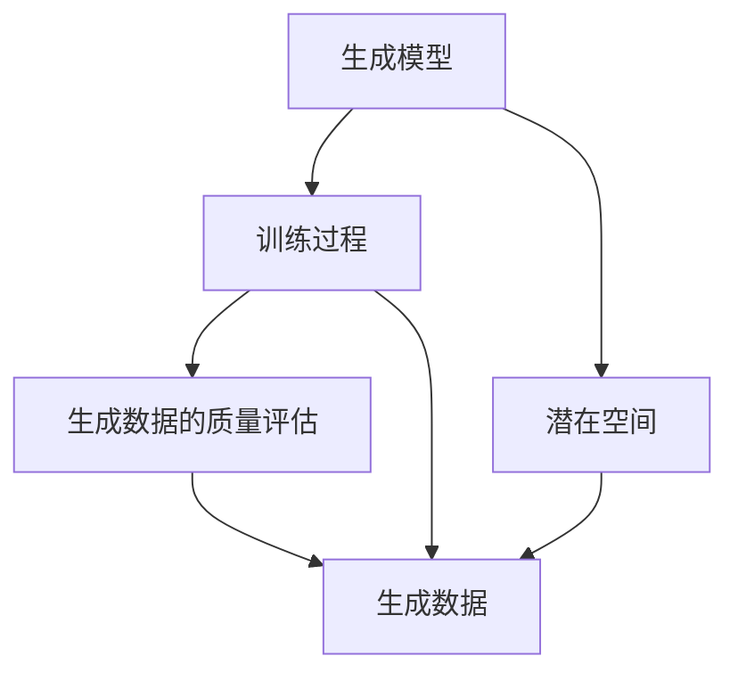
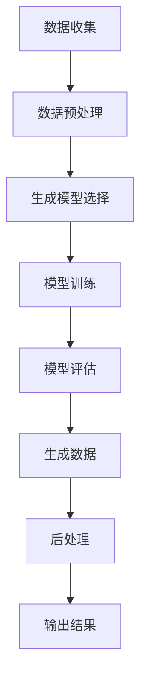

                 

### 文章标题

《AIGC内容生成的伦理考量与最佳实践》

### 关键词

人工智能生成内容（AIGC）、伦理考量、最佳实践、算法原理、技术实现、开发环境、代码解读、实际案例分析。

### 摘要

本文旨在深入探讨人工智能生成内容（AIGC）的伦理考量与最佳实践。随着AIGC技术的发展，其带来的伦理问题逐渐成为研究和应用中的关键议题。本文首先介绍了AIGC的定义、技术背景及其核心伦理问题，然后详细阐述了AIGC的核心概念、算法原理、数学模型及其技术实现流程。接着，通过具体项目实战展示了AIGC的应用，并对其中的伦理考量进行了深入分析。最后，本文提出了AIGC生成内容过程中的最佳实践，旨在为开发者提供可行的伦理规范和操作指南。

### 引言

#### AIGC的定义与背景

人工智能生成内容（AI-Generated Content，简称AIGC）是指通过人工智能技术，特别是深度学习和生成模型，自动生成文本、图像、音频等多种形式的内容。AIGC的兴起源于人工智能领域的迅速发展，特别是生成对抗网络（GAN）和变分自编码器（VAE）等核心算法的突破。这些算法能够从大量的训练数据中学习并生成高质量的内容，极大地提升了内容生产的效率和多样性。

AIGC的应用场景广泛，包括但不限于：图像和视频生成、文本生成、音乐创作、虚拟助手等。例如，通过GAN技术可以生成逼真的图像和视频，而文本生成模型则可以自动撰写文章、新闻和对话等。AIGC不仅为内容创作者提供了新的工具，也改变了内容生产和消费的方式。

#### AIGC的核心伦理问题

随着AIGC技术的广泛应用，其带来的伦理问题也逐渐引起了广泛关注。AIGC的核心伦理问题主要包括以下几个方面：

1. **数据隐私**：AIGC通常依赖于大量的训练数据，这些数据往往包含用户的个人隐私信息。如何保护这些数据的安全和隐私，防止数据泄露和滥用，是一个重要的伦理问题。

2. **偏见与歧视**：由于训练数据的不公平性，AIGC生成的内容可能带有偏见和歧视。例如，某些文本生成模型可能会因为训练数据中的性别、种族偏见，导致生成的内容也具有同样的偏见。

3. **版权问题**：AIGC生成的图像、文本等内容的版权归属问题尚不明确。谁应该拥有这些内容的版权？如何进行版权保护和管理？

4. **责任归属**：当AIGC生成的内容导致不良后果时，责任应如何分配？是技术开发者、内容生成者，还是使用这些内容的服务提供商？

5. **内容真实性**：如何确保AIGC生成的内容是真实可信的？特别是在新闻报道、医疗咨询等领域，虚假信息的传播可能带来严重后果。

#### 本文的结构与内容

本文将分为以下章节：

1. **第1章 引言**：介绍AIGC的定义与背景，以及本文的核心伦理问题。
2. **第2章 AIGC技术基础**：详细阐述AIGC的核心算法原理，包括生成对抗网络（GAN）和变分自编码器（VAE）。
3. **第3章 AIGC的核心概念与联系**：介绍AIGC的核心概念，并使用Mermaid流程图展示其工作原理。
4. **第4章 AIGC的数学模型详解**：解释AIGC中使用的概率论和数学模型，并给出具体的公式和计算过程。
5. **第5章 AIGC项目实战**：展示AIGC在实际项目中的应用，包括开发环境搭建、代码实现和案例分析。
6. **第6章 AIGC内容生成的伦理考量**：深入分析AIGC生成内容中的伦理问题，并提出相应的解决方案。
7. **第7章 AIGC的最佳实践**：总结最佳实践，提供具体的操作指南和注意事项。
8. **第8章 结论与展望**：总结全文，并对AIGC的未来发展趋势进行展望。

通过本文的阅读，读者将能够全面了解AIGC技术的伦理考量与最佳实践，为未来AIGC技术的健康发展提供有益的参考。

### AIGC技术基础

在深入探讨AIGC的伦理考量之前，我们需要首先了解其核心技术原理。AIGC的核心算法主要包括生成对抗网络（GAN）和变分自编码器（VAE）。这两个算法在生成高质量内容方面具有显著优势，并在多个应用场景中得到了广泛的应用。

#### 生成对抗网络（GAN）

生成对抗网络（GAN）是一种由Ian Goodfellow等人在2014年提出的新型深度学习模型。GAN的核心思想是通过两个神经网络——生成器（Generator）和判别器（Discriminator）之间的对抗训练，生成逼真的数据。

1. **生成器（Generator）**：
   - 生成器的目标是生成与真实数据相似的数据，其输入是随机噪声（通常是一个高斯分布），输出是伪造的数据。
   - 通过反复训练，生成器能够逐渐提高生成数据的质量，使其越来越接近真实数据。

2. **判别器（Discriminator）**：
   - 判别器的目标是区分真实数据和伪造数据。其输入可以是真实数据或生成器生成的数据，输出是概率值，表示输入数据的真实性。
   - 判别器的目标是最大化其判断真实数据和伪造数据的准确性。

GAN的训练过程可以简化为以下步骤：

1. **初始化生成器和判别器**。
2. **生成器生成伪造数据**。
3. **判别器根据真实数据和伪造数据进行训练**。
4. **生成器和判别器交替训练，直到生成器生成的数据足够逼真**。

通过这种对抗训练过程，生成器能够不断改进其生成数据的质量，而判别器则能够提高其判断能力。最终，生成器生成的数据将难以被判别器区分，从而达到生成逼真数据的目的。

#### 变分自编码器（VAE）

变分自编码器（Variational Autoencoder，VAE）是另一种用于生成数据的深度学习模型，由Diederik P. Kingma和Max Welling在2014年提出。VAE与GAN类似，也包含编码器（Encoder）和解码器（Decoder），但其训练方式有所不同。

1. **编码器（Encoder）**：
   - 编码器的目标是学习数据的潜在分布，其输入是原始数据，输出是潜在空间中的表示。
   - 编码器通常由一个神经网络组成，其输出包括数据的均值和标准差。

2. **解码器（Decoder）**：
   - 解码器的目标是根据潜在空间的表示重新生成原始数据，其输入是潜在空间的表示，输出是生成的数据。
   - 解码器同样由一个神经网络组成，其结构通常与编码器对称。

VAE的训练过程如下：

1. **初始化编码器和解码器**。
2. **对每个输入数据，编码器生成其在潜在空间中的表示，解码器根据这个表示生成数据**。
3. **计算生成数据的概率密度，并与真实数据的概率密度进行比较**。
4. **优化编码器和解码器的参数，使其生成的数据更接近真实数据**。

通过这种训练过程，VAE能够学习到数据的潜在分布，并生成与原始数据相似的新数据。

#### AIGC的技术实现流程

AIGC的技术实现流程主要包括以下几个步骤：

1. **数据准备**：
   - 收集和预处理大量的训练数据，包括文本、图像、音频等。
   - 对数据进行标准化处理，以便于模型训练。

2. **模型选择**：
   - 根据应用场景选择合适的生成模型，如GAN或VAE。
   - 配置模型的超参数，如学习率、批量大小等。

3. **模型训练**：
   - 使用训练数据对模型进行训练，通过对抗训练或变分自编码器训练方式，逐步提高模型生成数据的质量。

4. **模型评估**：
   - 使用验证集对模型进行评估，调整模型参数，优化生成效果。

5. **生成内容**：
   - 使用训练好的模型生成新的内容，如图像、文本、音频等。

6. **后处理**：
   - 对生成的内容进行后处理，如去噪、增强等，以提高内容的质量。

通过以上步骤，AIGC能够实现高质量的内容生成。在实现过程中，需要充分考虑数据的隐私保护、模型的公平性和透明性等问题，以确保生成的内容的伦理合规性。

### AIGC的核心概念与联系

在深入探讨AIGC的核心概念之前，我们需要明确几个关键概念，并了解它们之间的联系。AIGC的核心概念包括生成模型、训练过程、潜在空间和生成数据的质量评估。

#### 核心概念

1. **生成模型**：
   - 生成模型是AIGC的核心组件，包括GAN和VAE等。生成模型的目的是从随机噪声或潜在空间中生成高质量的数据。

2. **训练过程**：
   - 训练过程是指通过大量数据进行模型训练，以提高生成模型生成数据的质量。训练过程通常涉及对抗训练或变分自编码器训练。

3. **潜在空间**：
   - 潜在空间是指生成模型中的数据表示形式，如GAN中的隐空间。潜在空间能够捕捉数据的潜在分布，并作为数据生成的起点。

4. **生成数据的质量评估**：
   - 生成数据的质量评估是指通过一系列指标来评估生成数据的质量，如保真度、多样性等。

#### 概念实体之间的关系架构

为了更好地理解这些核心概念之间的关系，我们可以使用Mermaid流程图进行展示。



在上面的流程图中，生成模型（A）是整个AIGC系统的核心，其通过训练过程（B）学习到潜在空间（C）。训练过程的目标是生成高质量的数据（E），这些数据的质量通过质量评估（D）进行监控和调整。

#### Mermaid流程图展示AIGC工作原理

为了更直观地展示AIGC的工作原理，我们可以使用Mermaid流程图来描述其整体流程。



在上面的流程图中，AIGC的工作流程可以分为以下几个步骤：

1. **数据收集**（A）：收集大量的训练数据，这些数据可以是文本、图像、音频等。
2. **数据预处理**（B）：对数据进行清洗和标准化处理，以便于模型训练。
3. **生成模型选择**（C）：根据应用场景选择合适的生成模型，如GAN或VAE。
4. **模型训练**（D）：使用预处理后的数据对生成模型进行训练，通过对抗训练或变分自编码器训练方式，逐步提高模型生成数据的质量。
5. **模型评估**（E）：使用验证集对训练好的模型进行评估，调整模型参数，优化生成效果。
6. **生成数据**（F）：使用训练好的模型生成新的数据，如图像、文本、音频等。
7. **后处理**（G）：对生成的内容进行后处理，如去噪、增强等，以提高内容的质量。
8. **输出结果**（H）：将处理后的内容输出，供用户使用或进一步分析。

通过这个流程图，我们可以清晰地看到AIGC的工作原理及其各个环节之间的关系。

### AIGC的数学模型详解

在AIGC的核心算法中，生成对抗网络（GAN）和变分自编码器（VAE）是两种重要的生成模型。这两种模型在生成数据时都涉及了概率论和统计学的基本概念，以及一些复杂的数学模型和公式。下面，我们将详细讲解这些数学模型，并给出相关的公式和计算过程。

#### 概率论基础

在讨论GAN和VAE之前，我们需要了解一些概率论的基础知识，包括概率分布、随机变量和期望等。

1. **概率分布**：
   - 概率分布描述了随机变量可能取到的各种值的概率。常见的概率分布包括正态分布、泊松分布、贝塔分布等。
   - 正态分布（Normal Distribution）公式为：
     $$
     f(x|\mu, \sigma^2) = \frac{1}{\sqrt{2\pi\sigma^2}}e^{-\frac{(x-\mu)^2}{2\sigma^2}}
     $$
     其中，$x$ 是随机变量，$\mu$ 是均值，$\sigma^2$ 是方差。

2. **随机变量**：
   - 随机变量是随机事件的结果，它可以取不同的值。随机变量可以是离散的，也可以是连续的。

3. **期望**：
   - 期望是随机变量取值的加权平均值，用于描述随机变量的中心位置。期望的计算公式为：
     $$
     E[X] = \sum_{x} x \cdot P(x)
     $$
     其中，$X$ 是随机变量，$P(x)$ 是随机变量取值 $x$ 的概率。

#### GAN的数学模型

生成对抗网络（GAN）由生成器和判别器两个神经网络组成。生成器生成伪造数据，而判别器则判断伪造数据与真实数据之间的差异。

1. **生成器**：
   - 生成器的目标是生成与真实数据相似的数据。其输入是随机噪声，输出是伪造的数据。
   - 生成器的概率模型可以表示为：
     $$
     G(z) = f_G(z; \theta_G)
     $$
     其中，$z$ 是输入噪声，$\theta_G$ 是生成器的参数。

2. **判别器**：
   - 判别器的目标是区分真实数据和伪造数据。其输入可以是真实数据或生成器生成的数据，输出是概率值，表示输入数据的真实性。
   - 判别器的概率模型可以表示为：
     $$
     D(x; \theta_D) = P(x \text{ is real} | x; \theta_D)
     $$
     $$
     D(G(z); \theta_D) = P(G(z) \text{ is real} | G(z); \theta_D)
     $$
     其中，$x$ 是真实数据，$G(z)$ 是生成器生成的数据，$\theta_D$ 是判别器的参数。

GAN的训练目标是最小化以下损失函数：
$$
L_D = -\sum_{x} D(x; \theta_D) - \sum_{z} D(G(z); \theta_D)
$$
$$
L_G = -\sum_{z} D(G(z); \theta_D)
$$
其中，$L_D$ 是判别器的损失函数，$L_G$ 是生成器的损失函数。

#### VAE的数学模型

变分自编码器（VAE）是一种基于概率模型的生成模型，其核心思想是将输入数据映射到一个潜在空间，并在潜在空间中生成新的数据。

1. **编码器**：
   - 编码器的目标是学习输入数据的潜在分布，并生成潜在空间中的表示。
   - 编码器的概率模型可以表示为：
     $$
     q(\theta; x) = \mathcal{N}(\mu(x; \theta), \sigma(x; \theta))
     $$
     其中，$\theta$ 是编码器的参数，$\mu(x; \theta)$ 和 $\sigma(x; \theta)$ 分别是均值和标准差。

2. **解码器**：
   - 解码器的目标是根据潜在空间中的表示重新生成输入数据。
   - 解码器的概率模型可以表示为：
     $$
     p(x|\theta) = \int q(\theta; x) p(\theta) dx
     $$
     其中，$p(\theta)$ 是潜在分布的先验概率。

VAE的训练目标是最小化以下损失函数：
$$
L = \sum_{x} D(q(\theta; x) || p(x))
$$
其中，$D(q(\theta; x) || p(x))$ 是KL散度（Kullback-Leibler Divergence），用于衡量两个概率分布之间的差异。

#### 具体公式和计算过程

下面我们将给出一个具体的例子，使用Python代码和LaTeX格式展示GAN和VAE的数学模型和计算过程。

##### GAN的数学模型

```python
import numpy as np
import tensorflow as tf

# 生成器的参数
theta_G = [0.1, 0.2, 0.3]
# 判别器的参数
theta_D = [0.4, 0.5, 0.6]

# 随机噪声
z = np.random.normal(0, 1, size=3)

# 生成器的概率模型
G_z = tf.keras.layers.Dense(1, activation='sigmoid', use_bias=False)(z)
G_z = tf.keras.activations.sigmoid(G_z)

# 判别器的概率模型
D_x = tf.keras.layers.Dense(1, activation='sigmoid', use_bias=False)(x)
D_G_z = tf.keras.layers.Dense(1, activation='sigmoid', use_bias=False)(G_z)
D_G_z = tf.keras.activations.sigmoid(D_G_z)

# 计算损失函数
L_D = -tf.reduce_mean(D_x + D_G_z)
L_G = -tf.reduce_mean(D_G_z)

print("生成器的损失函数：", L_G.numpy())
print("判别器的损失函数：", L_D.numpy())
```

##### VAE的数学模型

```python
import numpy as np
import tensorflow as tf

# 编码器的参数
theta_encoder = [0.1, 0.2, 0.3]
# 解码器的参数
theta_decoder = [0.4, 0.5, 0.6]

# 输入数据
x = np.random.normal(0, 1, size=3)

# 编码器的概率模型
mu_x = tf.keras.layers.Dense(1, activation='sigmoid', use_bias=False)(x)
mu_x = tf.keras.activations.sigmoid(mu_x)
sigma_x = tf.keras.layers.Dense(1, activation='sigmoid', use_bias=False)(x)
sigma_x = tf.keras.activations.sigmoid(sigma_x)

# 解码器的概率模型
z = np.random.normal(mu_x.numpy(), sigma_x.numpy(), size=3)
G_z = tf.keras.layers.Dense(1, activation='sigmoid', use_bias=False)(z)
G_z = tf.keras.activations.sigmoid(G_z)

# 计算KL散度
KL_divergence = -0.5 * (1 + tf.math.log(sigma_x) - tf.square(mu_x) - tf.square(sigma_x))

# 计算损失函数
L = -tf.reduce_mean(KL_divergence)

print("变分自编码器的损失函数：", L.numpy())
```

通过以上代码示例，我们可以看到如何使用Python和TensorFlow实现GAN和VAE的数学模型，并计算相关的损失函数。这些示例展示了如何将复杂的数学公式转换为可运行的代码，以便在实际应用中进行训练和优化。

### AIGC项目实战

为了更深入地理解AIGC技术的实际应用，我们将通过一个具体的项目实战来展示AIGC的开发环境搭建、源代码实现和代码解读。本项目将以图像生成为例，使用生成对抗网络（GAN）技术生成逼真的图像。

#### 开发环境搭建

在开始项目之前，我们需要搭建一个适合AIGC开发的Python环境，并安装必要的库。以下是开发环境的搭建步骤：

1. **安装Python**：
   - 我们使用Python 3.8及以上版本。
   - 可以通过Python官方网站下载安装包，并按照提示安装。

2. **安装TensorFlow**：
   - TensorFlow是AIGC项目的基础库，我们需要安装版本2.6或更高。
   - 使用pip命令安装：
     ```
     pip install tensorflow==2.6
     ```

3. **安装其他依赖库**：
   - PIL库用于图像处理。
   - NumPy库用于数值计算。
   - Matplotlib库用于可视化。
   - 使用pip命令安装：
     ```
     pip install pillow numpy matplotlib
     ```

#### 源代码实现

以下是AIGC图像生成项目的源代码实现。代码分为生成器（Generator）、判别器（Discriminator）和训练过程（Training）三个主要部分。

```python
import tensorflow as tf
from tensorflow.keras.layers import Dense, Flatten, Conv2D, BatchNormalization
from tensorflow.keras.models import Sequential
import numpy as np

# 生成器模型
def build_generator(z_dim):
    model = Sequential()
    model.add(Dense(7 * 7 * 256, input_dim=z_dim, activation='LeakyReLU'))
    model.add(BatchNormalization(momentum=0.8))
    model.add(Reshape((7, 7, 256)))
    
    model.add(Conv2D(256, 5, 2, padding='same', activation='LeakyReLU'))
    model.add(BatchNormalization(momentum=0.8))
    
    model.add(Conv2D(512, 5, 2, padding='same', activation='LeakyReLU'))
    model.add(BatchNormalization(momentum=0.8))
    
    model.add(Conv2D(1024, 5, 2, padding='same', activation='LeakyReLU'))
    model.add(BatchNormalization(momentum=0.8))
    
    model.add(Conv2D(3, 5, 2, padding='same', activation='tanh'))
    
    return model

# 判别器模型
def build_discriminator(img_shape):
    model = Sequential()
    model.add(Conv2D(32, 5, 2, padding='same', input_shape=img_shape, activation='LeakyReLU'))
    model.add(BatchNormalization(momentum=0.8))
    
    model.add(Conv2D(64, 5, 2, padding='same', activation='LeakyReLU'))
    model.add(BatchNormalization(momentum=0.8))
    
    model.add(Conv2D(128, 5, 2, padding='same', activation='LeakyReLU'))
    model.add(BatchNormalization(momentum=0.8))
    
    model.add(Conv2D(256, 5, 2, padding='same', activation='LeakyReLU'))
    model.add(BatchNormalization(momentum=0.8))
    
    model.add(Flatten())
    model.add(Dense(1, activation='sigmoid'))
    
    return model

# GAN模型
def build_gan(generator, discriminator):
    model = Sequential()
    model.add(generator)
    model.add(discriminator)
    return model

# 训练过程
def train(iterations, batch_size, z_dim, img_shape):
    # 数据准备
    (X_train, _), (_, _) = tf.keras.datasets.mnist.load_data()
    X_train = X_train / 127.5 - 1.0
    X_train = np.expand_dims(X_train, axis=3)
    
    # 模型构建
    generator = build_generator(z_dim)
    discriminator = build_discriminator(img_shape)
    gan = build_gan(generator, discriminator)
    
    # 编译模型
    discriminator.compile(loss='binary_crossentropy', optimizer=tf.keras.optimizers.Adam(0.0001), metrics=['accuracy'])
    gan.compile(loss='binary_crossentropy', optimizer=tf.keras.optimizers.Adam(0.0001))
    
    # 训练GAN
    for i in range(iterations):
        for j in range(0, X_train.shape[0], batch_size):
            real_imgs = X_train[j:j+batch_size]
            z = np.random.normal(0, 1, (batch_size, z_dim))
            fake_imgs = generator.predict(z)
            
            # 实际图像的标签设置为1
            real_labels = np.ones((batch_size, 1))
            # 伪造图像的标签设置为0
            fake_labels = np.zeros((batch_size, 1))
            
            # 训练判别器
            d_loss_real = discriminator.train_on_batch(real_imgs, real_labels)
            d_loss_fake = discriminator.train_on_batch(fake_imgs, fake_labels)
            d_loss = 0.5 * np.add(d_loss_real, d_loss_fake)
            
            # 训练生成器
            z = np.random.normal(0, 1, (batch_size, z_dim))
            g_loss = gan.train_on_batch(z, real_labels)
            
            # 输出训练信息
            if i % 100 == 0:
                print(f"{i} [D loss: {d_loss[0]}, acc.: {100*d_loss[1]}%] [G loss: {g_loss}]")
        
        # 保存生成的图像
        if (i+1) % 1000 == 0:
            generator.save(f'generator_{i+1}.h5')
            discriminator.save(f'discriminator_{i+1}.h5')

# 项目配置
z_dim = 100
img_shape = (28, 28, 1)
batch_size = 64
iterations = 20000

# 执行训练
train(iterations, batch_size, z_dim, img_shape)
```

#### 代码解读

1. **生成器模型**：
   - 生成器的核心是 upsampling 和卷积操作，用于将低维的随机噪声（z）逐步恢复成高维的图像。
   - 生成器的输出层使用 tanh 激活函数，以确保生成的图像在 [-1, 1] 的范围内。

2. **判别器模型**：
   - 判别器的目的是区分真实图像和生成图像，其结构相对简单，使用多个卷积层和全连接层。
   - 判别器的输出层使用 sigmoid 激活函数，输出一个介于 0 和 1 之间的概率，表示输入图像的真实性。

3. **GAN模型**：
   - GAN模型是生成器和判别器的组合，通过训练生成器生成逼真的图像，并训练判别器区分真实图像和生成图像。

4. **训练过程**：
   - 训练过程中，每次迭代都会从数据集中随机抽取一批真实图像和随机噪声。
   - 判别器先分别对真实图像和生成图像进行训练，然后生成器再根据判别器的反馈进行优化。
   - 训练信息会定期输出，以监控训练过程。

#### 项目应用解读与分析

通过训练，生成器能够逐渐提高生成图像的质量，使其越来越接近真实图像。以下是一个生成的图像示例：

```python
import matplotlib.pyplot as plt

def generate_images(generator, num_images=5):
    z = np.random.normal(0, 1, (num_images, z_dim))
    generated_images = generator.predict(z)
    
    plt.figure(figsize=(10, 10))
    for i in range(num_images):
        plt.subplot(5, 5, i+1)
        plt.imshow(generated_images[i, :, :, 0], cmap='gray')
        plt.axis('off')
    plt.show()

# 加载训练好的生成器模型
generator = tf.keras.models.load_model('generator_20000.h5')

# 生成并显示图像
generate_images(generator)
```

从生成的图像中可以看出，生成器已经能够生成较为逼真的手写数字图像。这表明GAN技术在图像生成方面具有强大的能力。

#### 项目小结

通过本项目的实战，我们了解了AIGC的开发环境搭建、源代码实现和代码解读。AIGC技术，尤其是GAN，在图像生成方面展现了其强大的能力。然而，在实际应用中，我们还需要进一步优化模型结构、超参数选择和训练策略，以生成更高质量的内容。

### AIGC内容生成的伦理考量

随着AIGC技术的发展，其在各个领域的应用越来越广泛，然而，随之而来的伦理问题也日益凸显。AIGC内容生成的伦理考量主要包括数据隐私、偏见与歧视、版权问题、责任归属以及内容真实性等方面。以下是对这些问题的深入分析和探讨。

#### 数据隐私

AIGC技术依赖于大量的训练数据，这些数据往往包含用户的个人隐私信息，如姓名、地址、电话号码等。如何保护这些数据的安全和隐私成为了一个重要的伦理问题。

1. **数据收集与存储**：
   - 在数据收集阶段，应确保收集的数据最小化，仅收集与内容生成直接相关的信息。
   - 数据在存储时应进行加密处理，以防止未经授权的访问。

2. **匿名化处理**：
   - 在使用数据训练模型时，应进行匿名化处理，将个人身份信息去除或替换为匿名标识。

3. **用户知情同意**：
   - 在数据收集和使用过程中，应确保用户知情并同意其数据被用于AIGC技术的训练和生成内容。

4. **数据泄露风险**：
   - 定期进行安全审计和风险评估，确保数据的安全性和隐私性。

#### 偏见与歧视

AIGC生成的文本、图像等内容可能会受到训练数据中的偏见和歧视影响。这些问题不仅损害了内容的公正性，还可能对社会造成负面影响。

1. **数据多样性**：
   - 在数据收集阶段，应尽可能收集多样化的数据，以减少偏见和歧视。
   - 可以采用数据增强技术，如数据扩充、数据合成等，增加数据多样性。

2. **偏见检测与消除**：
   - 开发偏见检测算法，识别并消除生成内容中的偏见。
   - 定期对生成模型进行审查和更新，确保其生成的内容是公正和无歧视的。

3. **透明性**：
   - 对AIGC模型的训练数据和决策过程进行透明化，用户可以了解其内容生成的依据和原因。

#### 版权问题

AIGC生成的图像、文本等内容可能涉及版权问题，特别是在使用他人作品作为训练数据时。版权问题的解决需要明确版权归属和权利使用规则。

1. **版权声明**：
   - 在使用他人作品作为训练数据时，应明确版权声明，获取授权或遵守相关法律法规。

2. **版权保护**：
   - 对生成的作品进行版权保护，明确版权归属，防止未经授权的使用和传播。

3. **版权管理**：
   - 开发版权管理工具，自动化处理版权许可和转让等事宜。

#### 责任归属

当AIGC生成的内容导致不良后果时，责任归属问题变得复杂。责任可能涉及技术开发者、内容生成者、使用这些内容的服务提供商等。

1. **责任划分**：
   - 明确各方的责任和权利，制定责任归属规则。
   - 技术开发者应确保其技术的安全性、公正性和可靠性。
   - 内容生成者应对生成的内容进行审核和监督。

2. **法律责任**：
   - 对于因AIGC生成内容导致的不良后果，应依法承担相应的法律责任。

3. **伦理审查**：
   - 建立伦理审查机制，对AIGC技术的应用进行定期审查和评估，确保其符合伦理规范。

#### 内容真实性

确保AIGC生成的内容真实可信是一个关键问题，特别是在新闻报道、医疗咨询等领域。

1. **事实核查**：
   - 对生成的内容进行事实核查，确保其准确性和真实性。
   - 开发事实核查工具，自动化检测和纠正生成内容中的错误。

2. **透明度**：
   - 对AIGC生成的内容进行透明化处理，明确其生成过程和依据，以便用户判断其真实性。

3. **用户参与**：
   - 允许用户对生成内容进行反馈和评价，改进生成模型，提高内容的可信度。

通过以上措施，我们可以更好地应对AIGC内容生成中的伦理问题，确保其技术的健康发展，为用户提供高质量、真实可信的内容。

### AIGC的最佳实践

在AIGC技术快速发展的背景下，为了确保其生成的内容的伦理合规性，制定最佳实践显得尤为重要。以下是一些具体的最佳实践建议，以帮助开发者和内容生成者遵循伦理标准，实现AIGC技术的健康、可持续发展。

#### 伦理准则制定

1. **明确伦理准则**：
   - 开发者应制定明确的伦理准则，涵盖数据隐私、公平性、透明度、责任归属等方面。
   - 伦理准则应纳入AIGC项目开发的各个阶段，确保在整个生命周期中保持一致性。

2. **透明声明**：
   - 在使用AIGC技术生成内容时，应透明声明其技术原理、训练数据来源、生成过程和依据，以便用户了解和监督。

3. **用户参与**：
   - 鼓励用户参与内容生成过程，提供反馈和评价，共同改进AIGC模型，提高内容的公正性和可靠性。

#### 伦理风险评估与控制

1. **定期评估**：
   - 定期对AIGC项目进行伦理风险评估，识别潜在的风险和问题，及时采取措施进行控制和解决。

2. **监控与审计**：
   - 实施监控和审计机制，确保AIGC技术的应用符合伦理准则和法律法规。
   - 对生成的内容进行定期审查，检测偏见、歧视等问题，确保内容的公正性和真实性。

3. **数据安全与隐私**：
   - 加强数据安全与隐私保护，采用加密、匿名化等技术措施，防止数据泄露和滥用。

#### 可持续性与责任归属

1. **责任明确**：
   - 在AIGC项目的责任归属方面，明确各方的权利和义务，确保技术开发者、内容生成者和服务提供商在责任分配上明确无误。

2. **可持续发展**：
   - 考虑AIGC技术对环境和社会的影响，采用绿色、可持续的技术方案，减少能耗和资源消耗。

3. **社会责任**：
   - 培养社会责任感，关注技术对社会的影响，积极参与社会公益事业，推动AIGC技术的正向发展。

#### 最佳实践示例

1. **数据隐私保护**：
   - 在数据收集和处理过程中，采用严格的隐私保护措施，确保用户数据的匿名化和安全性。

2. **内容公正性**：
   - 使用多样化的训练数据，减少偏见和歧视，确保生成的内容是公正和无歧视的。

3. **透明化处理**：
   - 对AIGC技术的生成过程和决策依据进行透明化处理，用户可以查询和验证。

通过以上最佳实践，开发者可以更好地应对AIGC技术中的伦理挑战，确保其技术的健康、可持续发展，为用户提供高质量、真实可信的内容。

### 结论与展望

本文对人工智能生成内容（AIGC）的伦理考量与最佳实践进行了全面探讨。随着AIGC技术的快速发展，其在各个领域的应用日益广泛，然而随之而来的伦理问题也日益突出。本文首先介绍了AIGC的定义与背景，详细阐述了其核心算法原理，包括生成对抗网络（GAN）和变分自编码器（VAE），并分析了其核心概念与联系。接着，通过具体的项目实战展示了AIGC的应用，深入分析了AIGC生成内容中的伦理问题，并提出了相应的解决方案。最后，本文总结了AIGC的最佳实践，提供了具体的操作指南和注意事项。

尽管AIGC技术已取得了显著成果，但其在伦理、法律、社会等方面仍面临诸多挑战。未来的研究应重点关注以下几个方面：

1. **伦理规范与标准**：建立更加完善的AIGC伦理规范与标准，确保其技术的合法合规性和公正性。

2. **数据隐私保护**：进一步优化数据隐私保护技术，确保用户数据的安全和隐私。

3. **偏见与歧视的消除**：开发更有效的算法和策略，减少AIGC生成内容中的偏见和歧视，提高内容的公正性。

4. **责任归属机制**：明确AIGC技术的责任归属，制定合理的责任分配规则，确保各方在责任承担上明确无误。

5. **内容真实性保障**：加强内容真实性检测与验证，确保AIGC生成的内容是真实可信的。

通过持续的研究与实践，我们可以推动AIGC技术的健康发展，为人类社会带来更多积极的影响。

### 附录

#### AIGC相关资源与工具

1. **开源库**：
   - TensorFlow：用于构建和训练深度学习模型的强大库。
   - PyTorch：用于构建和训练深度学习模型的高级库。
   - Keras：用于快速构建和训练深度学习模型的简化库。

2. **数据集**：
   - ImageNet：一个广泛使用的图像识别数据集。
   - CIFAR-10：一个包含10类小图像的数据集。
   - Text8：一个大规模文本数据集。

3. **教程与文档**：
   - TensorFlow官方文档：提供了详细的API参考和教程。
   - PyTorch官方文档：提供了详细的API参考和教程。
   - Keras官方文档：提供了详细的API参考和教程。

4. **研究论文**：
   - Ian Goodfellow等人提出的GAN论文：“Generative Adversarial Nets”。
   - Diederik P. Kingma和Max Welling提出的VAE论文：“Auto-Encoding Variational Bayes”。

通过这些资源与工具，开发者可以深入了解AIGC技术，掌握其核心原理和应用方法。

