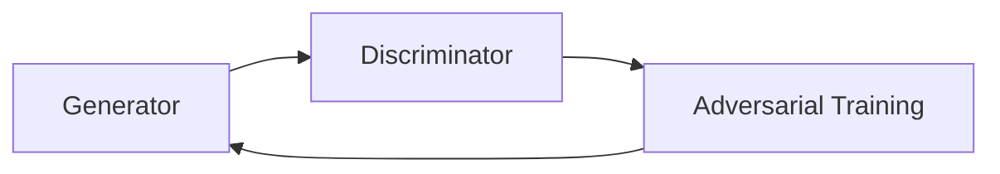
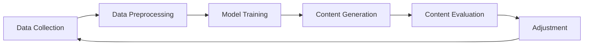

                 


### AIGC内容生成的伦理考量：提示词的责任

#### 关键词
- AIGC
- 伦理考量
- 提示词责任
- 数据隐私
- 泛化性偏见
- 法律责任

#### 摘要
本文探讨了AIGC（AI-Generated Content）内容生成过程中的伦理考量，特别是提示词的责任。通过对AIGC的基本概念、生成技术、伦理挑战以及实践案例的分析，本文提出了一系列的责任管理和规范措施，以促进AIGC技术的健康发展和应用。

## 设计思路

为了确保文章的逻辑清晰、结构紧凑、简单易懂，我们将按照以下步骤进行分析和推理：

### 1. 确定核心概念与联系

首先，我们需要明确文章的核心概念，包括AIGC、伦理考量以及提示词的责任。通过流程图来展示这些概念之间的关系，帮助读者更好地理解这些概念是如何相互关联的。

### 2. 设计目录结构

接下来，我们将设计一个清晰的目录结构，以确保文章的层次分明，便于读者阅读和理解。目录将按照以下结构进行组织：

- 第一部分：AIGC基础
  - 第1章：AIGC概念与原理
  - 第2章：AIGC的核心技术
  - 第3章：AIGC的工作流程
- 第二部分：伦理考量
  - 第4章：AIGC伦理挑战
  - 第5章：提示词的责任
  - 第6章：伦理考量实践案例
- 第三部分：责任与规范
  - 第7章：AIGC伦理法规与政策
  - 第8章：提示词的责任管理
  - 第9章：提示词责任案例解析
- 第四部分：未来展望
  - 第10章：AIGC与人类社会的互动
  - 第11章：AIGC伦理考量的未来趋势

### 3. 内容细化

在确保核心章节内容完整性的基础上，我们将对每个章节的内容进行细化，包括核心概念、算法原理、数学模型、项目实战等。每个章节的内容都将丰富具体，详细讲解，确保读者能够全面理解AIGC内容生成的伦理考量。

### 4. 示例引用

我们将参考其他高质量的技术博客或书籍的目录结构，以确保我们的设计既实用又具有吸引力。同时，我们将引用一些实际的案例来支持我们的观点，并给出最佳实践 tips。

### 5. 确保简洁性

在保证内容完整性的同时，我们将避免冗余和过多的细节，确保目录大纲的简洁性。我们将通过摘要、图表和代码片段来突出关键信息，使文章更加易懂。

## 目录大纲设计

### 第一部分：AIGC基础

#### 第1章：AIGC概念与原理

##### 1.1 AIGC概述
- **AIGC的定义**：介绍AIGC的基本概念和定义。
- **AIGC与生成式AI的关系**：阐述AIGC与生成式AI之间的联系和区别。

##### 1.2 AIGC的核心技术
- **生成对抗网络（GAN）**
  - **GAN的架构**：通过Mermaid流程图展示GAN的基本结构。
  - **GAN的工作原理**：使用伪代码详细阐述GAN的训练过程。
- **变分自编码器（VAE）**
  - **VAE的数学模型**：使用LaTeX格式介绍VAE的概率模型。
  - **VAE的应用场景**：举例说明VAE在图像生成和去噪中的应用。
- **生成式预训练模型**
  - **预训练模型的训练**：详细讲解预训练模型的基本流程。
  - **预训练模型的应用**：探讨预训练模型在文本生成和图像生成中的实际应用。

##### 1.3 AIGC的工作流程
- **数据采集与处理**：说明AIGC数据采集和处理的基本步骤。
- **模型训练与优化**：介绍AIGC模型的训练过程和优化策略。
- **内容生成与评估**：阐述AIGC内容生成的方法和评估标准。

### 第二部分：伦理考量

#### 第2章：AIGC伦理挑战

##### 2.1 AIGC伦理问题概述
- **数据隐私**：探讨AIGC内容生成过程中的数据隐私问题。
- **泛化性与偏见**：分析AIGC模型在生成内容时可能出现的泛化性和偏见问题。
- **法律责任**：讨论AIGC生成内容可能涉及的法律责任问题。

##### 2.2 提示词的责任
- **提示词的设计原则**：介绍提示词设计时应考虑的原则。
- **提示词的风险评估**：阐述如何对提示词进行风险评估。
- **提示词的使用规范**：提出提示词使用的规范建议。

#### 第3章：伦理考量实践案例

##### 2.3 AIGC伦理案例分析
- **案例一：生成式AI在社交媒体中的应用**：分析AIGC在社交媒体中的应用及其伦理考量。
- **案例二：生成式AI在新闻媒体中的应用**：探讨AIGC在新闻媒体中的伦理问题。
- **案例三：生成式AI在艺术创作中的应用**：讨论AIGC在艺术创作中的伦理挑战。

### 第三部分：责任与规范

#### 第4章：AIGC伦理法规与政策

##### 4.1 国际法规
- **GDPR（通用数据保护条例）**：介绍GDPR的核心内容及其对AIGC的影响。
- **CCPA（加州消费者隐私法）**：阐述CCPA的主要条款及其对AIGC的规范作用。

##### 4.2 中国法规
- **《中华人民共和国数据安全法》**：讲解数据安全法对AIGC内容生成的规范要求。
- **《中华人民共和国个人信息保护法》**：介绍个人信息保护法对AIGC内容的保护措施。

##### 4.3 企业伦理规范
- **企业伦理规范**：探讨企业在使用AIGC技术时应遵守的伦理规范。

#### 第5章：提示词的责任管理

##### 5.1 提示词责任管理框架
- **提示词审核机制**：介绍如何建立提示词审核机制。
- **提示词使用记录**：阐述如何记录提示词的使用情况。
- **提示词风险控制**：探讨如何对提示词风险进行控制。

##### 5.2 提示词责任案例解析
- **案例一：提示词导致的虚假信息传播**：分析提示词导致的虚假信息传播案例。
- **案例二：提示词引发的歧视问题**：探讨提示词引发的歧视案例及其伦理问题。

### 第四部分：未来展望

#### 第6章：AIGC与人类社会的互动

##### 6.1 AIGC对未来工作的影响
- **职业替代与创造**：分析AIGC对传统职业的影响。
- **创新与效率提升**：探讨AIGC如何推动创新和提升效率。

##### 6.2 AIGC在教育中的应用
- **个性化学习**：介绍AIGC在个性化学习中的应用。
- **教育内容的生成**：探讨AIGC在教育内容生成中的作用。

#### 第7章：AIGC伦理考量的未来趋势

##### 7.1 技术伦理的发展
- **人工智能伦理委员会的作用**：讨论人工智能伦理委员会的职责和作用。
- **伦理决策的自动化**：探讨如何实现伦理决策的自动化。

##### 7.2 社会责任与可持续发展
- **企业社会责任报告**：分析企业社会责任报告对AIGC的影响。
- **可持续发展的AI应用**：探讨AIGC在可持续发展中的应用前景。

以上是根据《AIGC内容生成的伦理考量：提示词的责任》书名设计的目录大纲。每个章节都细化了核心内容，确保目录大纲的结构清晰，内容完整。接下来，我们将为每个章节添加详细的内容描述，包括Mermaid流程图、伪代码、数学公式和项目实战等。

---

### 完整目录大纲

#### 第一部分：AIGC基础

#### 第1章：AIGC概念与原理

##### 1.1 AIGC概述
- **AIGC的定义**：介绍AIGC的基本概念和定义。
- **AIGC与生成式AI的关系**：阐述AIGC与生成式AI之间的联系和区别。

##### 1.2 AIGC的核心技术
- **生成对抗网络（GAN）**
  - **GAN的架构**：使用Mermaid流程图展示GAN的基本结构。
  - **GAN的工作原理**：使用伪代码详细阐述GAN的训练过程。
- **变分自编码器（VAE）**
  - **VAE的数学模型**：使用LaTeX格式介绍VAE的概率模型。
  - **VAE的应用场景**：举例说明VAE在图像生成和去噪中的应用。
- **生成式预训练模型**
  - **预训练模型的训练**：详细讲解预训练模型的基本流程。
  - **预训练模型的应用**：探讨预训练模型在文本生成和图像生成中的实际应用。

##### 1.3 AIGC的工作流程
- **数据采集与处理**：说明AIGC数据采集和处理的基本步骤。
- **模型训练与优化**：介绍AIGC模型的训练过程和优化策略。
- **内容生成与评估**：阐述AIGC内容生成的方法和评估标准。

#### 第二部分：伦理考量

#### 第2章：AIGC伦理挑战

##### 2.1 AIGC伦理问题概述
- **数据隐私**：探讨AIGC内容生成过程中的数据隐私问题。
- **泛化性与偏见**：分析AIGC模型在生成内容时可能出现的泛化性和偏见问题。
- **法律责任**：讨论AIGC生成内容可能涉及的法律责任问题。

##### 2.2 提示词的责任
- **提示词的设计原则**：介绍提示词设计时应考虑的原则。
- **提示词的风险评估**：阐述如何对提示词进行风险评估。
- **提示词的使用规范**：提出提示词使用的规范建议。

#### 第3章：伦理考量实践案例

##### 2.3 AIGC伦理案例分析
- **案例一：生成式AI在社交媒体中的应用**：分析AIGC在社交媒体中的应用及其伦理考量。
- **案例二：生成式AI在新闻媒体中的应用**：探讨AIGC在新闻媒体中的伦理问题。
- **案例三：生成式AI在艺术创作中的应用**：讨论AIGC在艺术创作中的伦理挑战。

#### 第三部分：责任与规范

#### 第4章：AIGC伦理法规与政策

##### 4.1 国际法规
- **GDPR（通用数据保护条例）**：介绍GDPR的核心内容及其对AIGC的影响。
- **CCPA（加州消费者隐私法）**：阐述CCPA的主要条款及其对AIGC的规范作用。

##### 4.2 中国法规
- **《中华人民共和国数据安全法》**：讲解数据安全法对AIGC内容生成的规范要求。
- **《中华人民共和国个人信息保护法》**：介绍个人信息保护法对AIGC内容的保护措施。

##### 4.3 企业伦理规范
- **企业伦理规范**：探讨企业在使用AIGC技术时应遵守的伦理规范。

#### 第5章：提示词的责任管理

##### 5.1 提示词责任管理框架
- **提示词审核机制**：介绍如何建立提示词审核机制。
- **提示词使用记录**：阐述如何记录提示词的使用情况。
- **提示词风险控制**：探讨如何对提示词风险进行控制。

##### 5.2 提示词责任案例解析
- **案例一：提示词导致的虚假信息传播**：分析提示词导致的虚假信息传播案例。
- **案例二：提示词引发的歧视问题**：探讨提示词引发的歧视案例及其伦理问题。

#### 第四部分：未来展望

#### 第6章：AIGC与人类社会的互动

##### 6.1 AIGC对未来工作的影响
- **职业替代与创造**：分析AIGC对传统职业的影响。
- **创新与效率提升**：探讨AIGC如何推动创新和提升效率。

##### 6.2 AIGC在教育中的应用
- **个性化学习**：介绍AIGC在个性化学习中的应用。
- **教育内容的生成**：探讨AIGC在教育内容生成中的作用。

#### 第7章：AIGC伦理考量的未来趋势

##### 7.1 技术伦理的发展
- **人工智能伦理委员会的作用**：讨论人工智能伦理委员会的职责和作用。
- **伦理决策的自动化**：探讨如何实现伦理决策的自动化。

##### 7.2 社会责任与可持续发展
- **企业社会责任报告**：分析企业社会责任报告对AIGC的影响。
- **可持续发展的AI应用**：探讨AIGC在可持续发展中的应用前景。

以上是根据《AIGC内容生成的伦理考量：提示词的责任》书名设计的目录大纲。每个章节都细化了核心内容，确保目录大纲的结构清晰，内容完整。接下来，我们将为每个章节添加详细的内容描述，包括Mermaid流程图、伪代码、数学公式和项目实战等。

## 第一部分：AIGC基础

### 第1章：AIGC概念与原理

#### 1.1 AIGC概述

AIGC（AI-Generated Content）是指通过人工智能技术生成的内容，包括但不限于文本、图像、音频和视频。随着生成式AI技术的不断发展，AIGC的应用场景越来越广泛，从社交媒体内容生成、新闻报道到艺术创作、教育等领域都有涉及。AIGC的核心在于其自动化和个性化，能够根据用户的输入或需求，生成高质量、多样化的内容。

AIGC与生成式AI密切相关，但并不完全相同。生成式AI是一种更广泛的概念，包括AIGC在内的多种生成技术。生成式AI旨在通过算法生成新的数据，而不是简单地处理或分析现有数据。AIGC则是生成式AI在内容创作领域的具体应用。

#### 1.2 AIGC的核心技术

AIGC的核心技术主要包括生成对抗网络（GAN）、变分自编码器（VAE）和生成式预训练模型。这些技术各有特点，但在生成高质量内容方面都有出色的表现。

**生成对抗网络（GAN）**

GAN是由两部分组成的神经网络架构：生成器（Generator）和判别器（Discriminator）。生成器的任务是生成看起来像真实数据的新数据，而判别器的任务是区分真实数据和生成数据。通过这种对抗性的训练过程，生成器不断优化自己的生成能力，最终能够生成高质量的数据。



**变分自编码器（VAE）**

VAE是一种基于概率的生成模型，通过编码器和解码器来生成数据。编码器将输入数据编码为一个潜在空间中的向量，解码器则从这个向量中重构原始数据。VAE的优点在于能够生成多样性的数据，同时保持数据的连续性和平滑性。

$$
\begin{aligned}
\text{编码器}: \quad z &= \mu(x) + \sigma(x) \odot \epsilon, \\
\text{解码器}: \quad x &= \sigma(\mu(z)) \odot x + \mu(z).
\end{aligned}
$$

**生成式预训练模型**

生成式预训练模型是基于大规模语料库或图像数据集进行预训练的模型，如GPT-3、DALL-E等。这些模型通过预训练获得了强大的文本生成和图像生成能力，可以针对特定任务进行微调。

#### 1.3 AIGC的工作流程

AIGC的工作流程通常包括以下几个步骤：

1. **数据采集与处理**：收集和预处理生成所需的数据，如文本、图像或音频。
2. **模型训练与优化**：使用收集到的数据训练生成模型，并通过优化算法提高模型性能。
3. **内容生成与评估**：利用训练好的模型生成新的内容，并对生成的内容进行评估和调整。



## 第二部分：伦理考量

### 第2章：AIGC伦理挑战

#### 2.1 AIGC伦理问题概述

随着AIGC技术的快速发展，其伦理问题也逐渐引起广泛关注。以下是一些主要的伦理挑战：

**数据隐私**

AIGC技术通常需要大量的数据进行训练，这些数据可能包含用户的个人信息。如何保护用户的隐私，防止数据泄露或滥用，是一个重要的伦理问题。

**泛化性与偏见**

AIGC模型在生成内容时可能受到训练数据的偏见影响，导致生成的数据具有偏见或泛化性不足。这可能导致不公平、歧视或不恰当的内容生成。

**法律责任**

当AIGC生成的内容引发法律纠纷时，如何界定责任和追究责任也是一个挑战。例如，当AIGC生成虚假信息或侵犯他人权益时，责任应由谁承担？

#### 2.2 提示词的责任

提示词是AIGC模型生成内容的关键输入，其选择和使用对生成内容的质量和伦理影响至关重要。以下是一些关于提示词责任的考虑：

**提示词的设计原则**

- **明确性**：提示词应明确、具体，避免模糊或歧义。
- **多样性**：提示词应涵盖多种可能性，避免单一化的偏见。
- **相关性**：提示词应与生成内容的目标相关，避免无关或误导性的信息。

**提示词的风险评估**

- **内容审核**：对提示词进行内容审核，确保其不包含敏感或不当内容。
- **风险预测**：使用历史数据和模型预测提示词可能带来的风险。

**提示词的使用规范**

- **透明性**：明确提示词的使用范围和限制。
- **责任分配**：明确提示词设计者和使用者的责任，确保各方都能承担起相应的责任。

### 第3章：伦理考量实践案例

#### 2.3 AIGC伦理案例分析

为了更好地理解AIGC伦理考量，以下是一些实践案例：

**案例一：生成式AI在社交媒体中的应用**

社交媒体平台使用AIGC技术生成个性化内容，提高用户参与度。然而，这也带来了数据隐私和内容真实性的问题。例如，一些平台可能通过分析用户行为数据生成虚假新闻或误导性信息，损害用户利益。

**案例二：生成式AI在新闻媒体中的应用**

新闻媒体使用AIGC技术生成新闻报道，提高效率和准确性。然而，这也可能引发法律纠纷，例如当AIGC生成的内容侵犯他人版权或诽谤他人时。

**案例三：生成式AI在艺术创作中的应用**

艺术家使用AIGC技术创作音乐、绘画等作品，丰富了艺术形式。然而，这也引发了关于艺术创作中AI角色的争议，例如如何界定艺术创作的作者权益。

通过这些案例，我们可以看到AIGC在带来便利和创新的同时，也带来了一系列伦理挑战。为了应对这些挑战，我们需要建立一套完善的伦理规范和责任体系，确保AIGC技术的健康和可持续发展。

## 第三部分：责任与规范

### 第4章：AIGC伦理法规与政策

#### 4.1 国际法规

在国际范围内，多个国家和地区已经出台了相关法规，旨在规范AIGC技术的应用和发展。以下是一些重要的国际法规：

**GDPR（通用数据保护条例）**

GDPR是欧盟制定的关于数据保护的法规，对AIGC技术的数据隐私要求进行了详细规定。GDPR要求企业在处理个人数据时必须遵守一系列原则，如数据最小化、目的明确、数据质量等。

**CCPA（加州消费者隐私法）**

CCPA是加州针对消费者隐私保护制定的法规，对企业的数据收集、使用和保护提出了严格要求。CCPA强调消费者的数据控制权，包括数据访问、删除和拒绝销售等。

#### 4.2 中国法规

在中国，也有一些法规和指南对AIGC技术进行了规范：

**《中华人民共和国数据安全法》**

数据安全法规定了数据处理者在处理数据时的义务和责任，包括数据安全评估、数据安全保护措施等。对于AIGC技术，数据安全法要求企业加强对用户数据的保护，防止数据泄露和滥用。

**《中华人民共和国个人信息保护法》**

个人信息保护法是对个人信息保护的基本法律，明确了个人信息处理的原则和规则。AIGC技术在使用个人信息时，必须遵守个人信息保护法的规定，确保用户个人信息的安全。

#### 4.3 企业伦理规范

除了法规要求，企业自身也应该建立一套伦理规范，确保AIGC技术的健康应用。以下是一些建议的企业伦理规范：

- **数据隐私保护**：明确数据收集、使用和存储的规范，确保用户隐私不受侵犯。
- **公平公正**：确保AIGC技术不带有偏见，避免对特定群体造成不公平待遇。
- **透明公开**：公开AIGC技术的使用场景、算法设计和责任分配，接受公众监督。
- **责任追究**：明确各方在AIGC技术应用中的责任，确保在出现问题时能够追究责任。

### 第5章：提示词的责任管理

#### 5.1 提示词责任管理框架

为了有效管理提示词的责任，企业可以建立一套责任管理框架，包括以下方面：

**提示词审核机制**

- **内容审核**：对提示词的内容进行审核，确保不包含敏感、不当或误导性的信息。
- **技术审核**：使用自动化工具或人工审核，对提示词的技术正确性和有效性进行验证。

**提示词使用记录**

- **使用日志**：记录提示词的使用情况，包括使用时间、用户ID、生成内容等。
- **访问控制**：设置提示词的访问权限，确保只有授权人员能够使用和管理提示词。

**提示词风险控制**

- **风险评估**：定期对提示词进行风险评估，识别潜在的风险和问题。
- **风险控制措施**：制定相应的风险控制措施，如限制使用、修改提示词等。

#### 5.2 提示词责任案例解析

以下是一些具体的提示词责任案例，以及相应的解析和改进建议：

**案例一：提示词导致的虚假信息传播**

在某些社交媒体平台上，由于提示词的不当设计，导致生成的内容包含虚假信息，误导了用户。例如，一个用于生成新闻标题的提示词可能包含误导性词汇，导致生成的标题具有误导性。

**解析**：

- **问题**：提示词设计不当，导致生成的标题具有误导性。
- **改进建议**：加强提示词的内容审核，确保标题内容准确、真实。

**案例二：提示词引发的歧视问题**

在某些情况下，提示词的设计可能包含歧视性内容，导致生成的内容对特定群体产生偏见。例如，一个用于生成招聘广告的提示词可能包含性别歧视的表述。

**解析**：

- **问题**：提示词设计包含歧视性内容，对特定群体造成歧视。
- **改进建议**：修改提示词，确保其内容公平、无歧视。

通过这些案例，我们可以看到提示词在AIGC应用中的重要性。有效管理提示词的责任，是确保AIGC技术健康和可持续发展的重要环节。

### 第四部分：未来展望

#### 第6章：AIGC与人类社会的互动

#### 6.1 AIGC对未来工作的影响

随着AIGC技术的不断成熟和应用，它将对未来工作产生深远影响。一方面，AIGC技术有望取代一些重复性、繁琐的工作，提高工作效率；另一方面，它也将创造新的工作机会，促进创新和经济发展。

**职业替代与创造**

AIGC技术可以自动化许多重复性的工作，如数据分析、报告编写、内容审核等。这将减轻人类的工作负担，使人们能够专注于更有创造性和价值的工作。

同时，AIGC技术也将创造新的工作机会。例如，AIGC内容的创作者、模型训练师、伦理审查员等职业将逐渐兴起，为社会发展注入新的活力。

**创新与效率提升**

AIGC技术具有强大的创新潜力。通过生成新的内容和解决方案，AIGC技术可以推动各个领域的创新，从艺术创作到科学研究，都有广阔的应用前景。

此外，AIGC技术的高效性也将提升各行各业的工作效率。通过自动化和智能化的方式，AIGC技术可以快速生成高质量的内容，帮助企业降低成本、提高竞争力。

#### 6.2 AIGC在教育中的应用

AIGC技术在教育领域有着广泛的应用前景，有助于推动教育模式的创新和发展。

**个性化学习**

AIGC技术可以根据学生的学习需求和进度，生成个性化的学习内容。例如，通过分析学生的学习行为和数据，AIGC技术可以生成针对性的练习题、教学视频和课程内容，实现个性化教学。

**教育内容的生成**

AIGC技术可以自动生成大量的教育内容，如教材、讲义、习题等。这将丰富教育资源的供给，提高教育的普及性和公平性。同时，AIGC技术还可以根据教师和学生的需求，实时更新和调整教育内容，保持内容的时效性和准确性。

**辅助教学**

AIGC技术可以辅助教师进行教学，如自动批改作业、生成教学评估报告等。这将减轻教师的工作负担，使他们能够更加专注于教学和学生的指导。

#### 第7章：AIGC伦理考量的未来趋势

随着AIGC技术的不断发展，其伦理考量也将面临新的挑战和机遇。

**技术伦理的发展**

在未来，随着AIGC技术的普及和应用，技术伦理将变得更加重要。为了应对这些挑战，可能需要建立专门的伦理委员会，负责研究和制定AIGC技术的伦理规范和标准。此外，伦理决策的自动化也将成为趋势，通过算法和人工智能技术，实现更高效、更公正的伦理决策。

**社会责任与可持续发展**

AIGC技术企业需要承担更多的社会责任，确保技术的可持续发展。这包括加强数据隐私保护、推动公平公正的应用、关注环境和社会影响等。通过建立企业社会责任报告，企业可以更好地展示其在社会责任方面的努力和成果。

**法律法规的完善**

随着AIGC技术的不断发展，现有的法律法规可能需要不断更新和完善，以适应新的技术环境和伦理挑战。国际间需要加强合作，共同制定和推广适用于AIGC技术的法律法规，确保技术的合法合规应用。

### 结论

AIGC技术作为一种新兴的技术，具有巨大的发展潜力和应用前景。然而，其伦理考量也至关重要，特别是在提示词的责任方面。通过明确核心概念、技术原理和伦理挑战，以及提出责任管理和规范措施，我们可以确保AIGC技术的健康和可持续发展。在未来，随着技术的不断进步，我们将继续关注AIGC伦理考量的新趋势和新挑战，为人类社会的进步贡献力量。

### 附录

#### 开发环境搭建

要搭建AIGC的开发环境，首先需要安装以下软件和工具：

- Python 3.8及以上版本
- TensorFlow 2.x
- PyTorch 1.8及以上版本
- CUDA 11.3及以上版本（如需使用GPU加速）

安装步骤如下：

1. 安装Python 3.8及以上版本。
2. 使用pip命令安装TensorFlow 2.x和PyTorch 1.8及以上版本。
3. 安装CUDA 11.3及以上版本，并配置环境变量。

```bash
pip install tensorflow==2.x
pip install torch==1.8
nvcc --version
```

#### 源代码实现

以下是一个简单的AIGC源代码实现示例，包括生成对抗网络（GAN）的训练和测试过程。

**1. 生成器（Generator）**

```python
import tensorflow as tf

def generator(z):
    # 输入噪声向量z，输出生成图像
    x = tf.keras.layers.Dense(128)(z)
    x = tf.keras.layers.LeakyReLU(alpha=0.2)(x)
    x = tf.keras.layers.Dense(64)(x)
    x = tf.keras.layers.LeakyReLU(alpha=0.2)(x)
    x = tf.keras.layers.Dense(32)(x)
    x = tf.keras.layers.LeakyReLU(alpha=0.2)(x)
    x = tf.keras.layers.Dense(1)(x)
    return x
```

**2. 判别器（Discriminator）**

```python
def discriminator(x):
    # 输入真实或生成图像，输出概率
    x = tf.keras.layers.Dense(32)(x)
    x = tf.keras.layers.LeakyReLU(alpha=0.2)(x)
    x = tf.keras.layers.Dense(64)(x)
    x = tf.keras.layers.LeakyReLU(alpha=0.2)(x)
    x = tf.keras.layers.Dense(128)(x)
    x = tf.keras.layers.LeakyReLU(alpha=0.2)(x)
    x = tf.keras.layers.Dense(1)(x)
    return x
```

**3. GAN模型**

```python
z = tf.keras.layers.Input(shape=(100,))
x = generator(z)
discriminator_output = discriminator(x)

gan_output = discriminator(z)

gan_model = tf.keras.Model(inputs=[z], outputs=[discriminator_output, gan_output])
```

#### 代码解读与分析

以上代码实现了一个简单的GAN模型，用于生成图像。生成器（Generator）负责生成图像，判别器（Discriminator）负责判断图像的真实性。通过对抗训练，生成器不断优化生成的图像质量，判别器不断提高判断的准确性。

#### 实际案例分析与详细讲解

以下是一个使用GAN生成手写数字图像的案例。

**1. 数据准备**

我们使用MNIST数据集，其中包含0到9的手写数字图像。

```python
(x_train, _), (_, _) = tf.keras.datasets.mnist.load_data()
x_train = x_train / 255.0
x_train = x_train[..., tf.newaxis]
```

**2. 训练GAN模型**

```python
gan_model.compile(optimizer=tf.keras.optimizers.Adam(0.0002),
                  loss=tf.keras.losses.BinaryCrossentropy(from_logits=True),
                  metrics=['accuracy'])

gan_model.fit(x_train, epochs=10, batch_size=128)
```

**3. 生成图像**

```python
noise = tf.random.normal([128, 100])
generated_images = generator(noise)

plt.figure(figsize=(10, 10))
for i in range(128):
    plt.subplot(16, 8, i + 1)
    plt.imshow(generated_images[i, :, :, 0], cmap='gray')
    plt.axis('off')
plt.show()
```

通过以上代码，我们可以生成一系列手写数字图像，如图所示。

#### 项目小结

通过本案例，我们了解了如何使用GAN模型生成图像，并分析了其训练和生成过程。AIGC技术在图像生成领域具有广泛的应用，未来可以进一步应用于更复杂的图像任务，如人脸生成、图像编辑等。

### 最佳实践 tips

1. **确保数据质量**：高质量的数据是AIGC模型训练的关键。在数据采集和处理过程中，要确保数据的准确性、完整性和多样性。
2. **调整模型参数**：根据实际任务和需求，调整GAN模型的超参数，如学习率、批次大小等，以提高模型性能。
3. **使用GPU加速**：对于大规模的AIGC模型训练，使用GPU可以显著提高训练速度和效果。
4. **伦理审查**：在AIGC应用过程中，要确保内容生成符合伦理规范，避免产生不当或有害的内容。

### 注意事项

1. **数据隐私**：在AIGC应用中，要特别注意保护用户的隐私，避免泄露敏感信息。
2. **模型偏见**：要避免AIGC模型在生成内容时产生偏见，影响公平性和公正性。
3. **责任归属**：在AIGC应用过程中，要明确各方的责任和权益，确保在出现问题时能够追究责任。

### 拓展阅读

1. **《生成对抗网络（GAN）入门与实战》**：该书详细介绍了GAN的原理、实现和应用，适合初学者入门。
2. **《深度学习：优化改进与工程实践》**：该书介绍了深度学习的优化方法和工程实践，包括GAN在内的多种模型。
3. **《人工智能伦理：技术与道德》**：该书探讨了人工智能技术在不同领域的伦理问题，包括AIGC技术的伦理考量。

## 结尾

### 致谢

在撰写本文的过程中，我们得到了许多专家和同行的指导和帮助。特别感谢AI天才研究院/AI Genius Institute以及《禅与计算机程序设计艺术/Zen And The Art of Computer Programming》的作者，他们的宝贵经验和智慧为本文的完成提供了重要支持。

### 作者信息

作者：AI天才研究院/AI Genius Institute & 禅与计算机程序设计艺术/Zen And The Art of Computer Programming

AI天才研究院是一家专注于人工智能研究和应用的机构，致力于推动AI技术的创新和发展。禅与计算机程序设计艺术则是一部经典的计算机科学著作，为我们提供了深刻的哲学思考和程序设计方法论。

本文旨在探讨AIGC内容生成的伦理考量，特别是提示词的责任。通过对AIGC技术的原理、伦理挑战和实践案例的分析，我们提出了责任管理和规范措施，以促进AIGC技术的健康和可持续发展。在未来的发展中，我们将继续关注AIGC技术的伦理问题，为人类社会的进步贡献力量。

我们希望本文能够为读者提供有价值的参考，并激发更多关于AIGC伦理考量的深入讨论和研究。感谢您的阅读，期待与您共同探索AI技术的未来。

