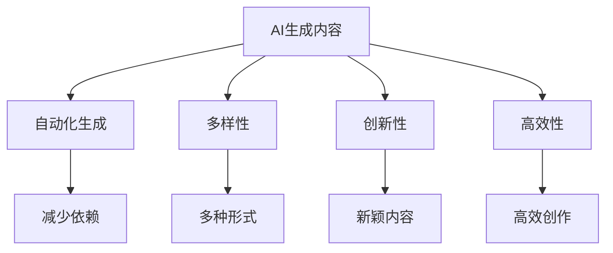
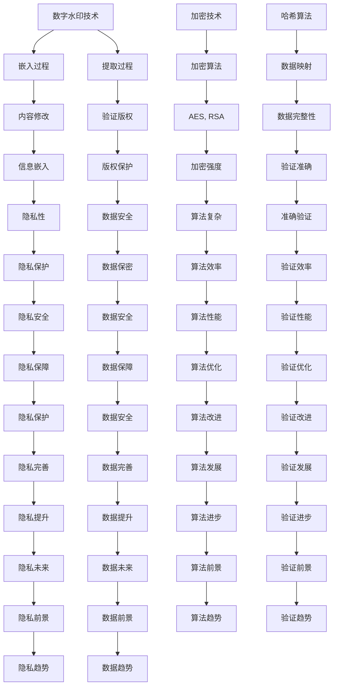

                 

# AIGC内容的版权保护：法律与技术的双重挑战

## 关键词
AI生成内容 (AIGC), 版权保护，数字水印，加密技术，哈希算法，法律法规

## 摘要
本文旨在探讨AI生成内容（AIGC）的版权保护问题，从法律和技术两个方面分析了AIGC在版权保护中的挑战。首先，文章概述了AIGC的概念与特征，并回顾了其发展历程。接着，文章分析了国际和中国的版权保护法律法规，指出了AIGC内容版权保护的立法挑战。然后，文章详细介绍了数字水印技术和加密与哈希技术，并提供了相应的Python代码实现。通过案例分析，文章总结了成功和失败的经验。最后，文章展望了AIGC内容版权保护的发展趋势，并提出了未来研究的方向。

----------------------------------------------------------------

## 第一部分：AIGC内容概述

### 1.1 AIGC的概念与特征

AI生成内容（AI-generated Content，简称AIGC）是指利用人工智能技术，特别是深度学习和自然语言处理技术生成的文本、图像、音频等多种形式的内容。AIGC具有以下几个显著特征：

1. **自动化生成**：AIGC能够自动地从大量数据中学习并生成内容，减少了对人类创作者的依赖。
2. **多样性**：AIGC可以生成多种形式的内容，包括文本、图像、音频等，且这些内容在形式和风格上具有多样性。
3. **创新性**：通过不断学习，AIGC能够产生新颖的内容，这为内容创作提供了无限的可能性。
4. **高效性**：AIGC可以快速生成大量内容，提高了内容创作的效率。

### 1.2 AIGC的发展历程与应用场景

AIGC的发展历程可以追溯到20世纪80年代，当时人工智能技术刚刚起步。随着深度学习和自然语言处理技术的快速发展，AIGC逐渐成为内容创作的重要工具。目前，AIGC的应用场景主要包括：

1. **文本生成**：如文章、新闻报道、广告文案等。
2. **图像生成**：如艺术作品、设计图、产品渲染图等。
3. **音频生成**：如音乐、语音合成等。
4. **视频生成**：如动画、视频剪辑等。

### 1.3 AIGC在版权保护中的重要性

AIGC的版权保护问题日益凸显，因为其生成的内容可能会侵犯他人的知识产权。首先，AIGC生成的文本、图像等内容可能直接复制了已有的作品，这构成了对原创作品的侵权。其次，由于AIGC的自动化和多样性，侵权行为可能更加隐蔽和复杂。因此，如何有效保护AIGC的版权成为了法律和技术的双重挑战。

### 1.4 核心概念与联系

以下是一个描述AIGC核心概念及其关系的Mermaid流程图：



----------------------------------------------------------------

### 2.1 国际版权保护法律法规概述

国际版权保护法律法规为全球范围内的版权保护提供了基本框架。最具代表性的国际版权法是《伯尔尼公约》和《世界知识产权组织版权条约》（WCT）。以下是这些法律法规的主要内容和特点：

#### 2.1.1 《伯尔尼公约》

- **主要内容**：该公约于1886年签署，旨在保护文学和艺术作品的版权。它规定作品一经创作即自动享有版权，无需登记。
- **特点**：强调作者的精神权利，如署名权和修改权，以及作者的财产权利。

#### 2.1.2 《世界知识产权组织版权条约》

- **主要内容**：该条约于1996年生效，旨在适应数字时代的版权保护需求。它扩展了《伯尔尼公约》的保护范围，包括计算机程序和数据库。
- **特点**：强调对数字作品的保护，如电子版权管理和版权标记。

#### 2.1.3 主要原则

- **版权独立性**：无论在哪个国家创作，作品都应享有版权保护。
- **自动保护**：作品创作完成即自动享有版权，无需进行注册或其他手续。
- **版权期限**：通常为作者终身及其死后50年。

### 2.2 中国版权保护法律法规分析

中国版权保护法律法规主要包括《著作权法》、《计算机软件保护条例》和《信息网络传播权保护条例》等。以下是这些法律法规的主要内容和分析：

#### 2.2.1 《著作权法》

- **主要内容**：该法于1990年颁布，是中国版权保护的基本法律。它规定了作品的定义、版权的归属、版权的保护期和版权的限制。
- **特点**：强调对原创作品的保护，包括文字作品、艺术作品、音乐作品等。

#### 2.2.2 《计算机软件保护条例》

- **主要内容**：该条例于2001年修订，专门针对计算机软件的版权保护。它规定了计算机软件的版权归属、版权保护期和侵权行为。
- **特点**：明确计算机软件作为版权保护的对象，规定了软件开发者和管理者的责任。

#### 2.2.3 《信息网络传播权保护条例》

- **主要内容**：该条例于2006年颁布，旨在保护信息网络传播的版权。它规定了网络服务提供者的版权保护责任，以及侵权行为的法律责任。
- **特点**：明确了网络环境下的版权保护机制，如版权通知和删除机制。

### 2.3 AIGC内容版权保护的立法挑战与对策

AIGC的版权保护面临以下立法挑战：

- **原创性认定**：如何判断AIGC生成的内容是否具有原创性，这是一个法律和技术难题。
- **责任归属**：当AIGC生成的侵权内容发生时，责任应归属AIGC的开发者、使用者还是服务提供者？
- **版权期限**：AIGC生成的内容的版权期限如何确定？

针对这些挑战，可能的对策包括：

- **完善法律法规**：制定专门针对AIGC的版权保护法律法规，明确版权归属和责任。
- **技术创新**：发展基于AI的版权保护技术，如数字水印、加密和哈希算法等。
- **国际合作**：加强国际间的版权保护合作，推动全球范围内的版权保护标准。

### 2.4 核心算法原理讲解

数字水印技术和加密与哈希技术在版权保护中具有重要意义。以下是对这些技术的原理讲解：

#### 2.4.1 数字水印技术

数字水印技术是一种将标识信息嵌入到数字内容中的技术。其基本原理如下：

- **嵌入过程**：将版权信息（如作者名、版权声明等）嵌入到数字内容中，通常通过修改数字内容的某些特征来实现。
- **提取过程**：从数字内容中提取水印信息，以验证版权。

Python代码实现：

```python
def embed_watermark(content, watermark):
    # 模拟将水印嵌入内容
    return content + watermark

def extract_watermark(embbeded_content):
    # 模拟从内容中提取水印
    return embbeded_content[len(content):]

content = "原始内容"
watermark = "版权信息"

embbeded_content = embed_watermark(content, watermark)
extracted_watermark = extract_watermark(embbeded_content)

print("嵌入的水印：", extracted_watermark)
```

#### 2.4.2 加密与哈希技术

加密技术是一种将信息转换为密文的技术，以保护信息的隐私性。哈希算法则是一种将信息映射为固定长度的字符串的技术，常用于数据完整性验证。

- **加密技术**：常用的加密算法有AES、RSA等。以下是一个简单的AES加密示例：

```python
from Crypto.Cipher import AES
from Crypto.Util.Padding import pad

key = b'my_secret_key'
cipher = AES.new(key, AES.MODE_CBC)
padded_plaintext = pad(plaintext.encode(), AES.block_size)
ciphertext = cipher.encrypt(padded_plaintext)
iv = cipher.iv
```

- **哈希算法**：常用的哈希算法有MD5、SHA-256等。以下是一个SHA-256哈希示例：

```python
import hashlib

def hash_data(data):
    hash_object = hashlib.sha256(data.encode())
    return hash_object.hexdigest()

data = "原始数据"
hash_value = hash_data(data)

print("哈希值：", hash_value)
```

### 2.5 核心概念与联系

以下是一个描述数字水印技术和加密与哈希技术核心概念及其关系的Mermaid流程图：



----------------------------------------------------------------

### 3.1 AIGC内容版权保护的技术手段

在AIGC内容的版权保护中，数字水印技术和加密与哈希技术是两种常用的手段。下面将详细探讨这些技术，并提供具体的Python代码示例，以便更好地理解其原理和应用。

#### 3.1.1 数字水印技术

数字水印技术是一种将特定的信息（如版权信息、所有权标志等）嵌入到数字媒体（如图像、视频、音频等）中的方法。这种方法可以使数字内容在未经授权的复制、传播或篡改时，能够被追踪和识别。

##### 3.1.1.1 数字水印技术原理

数字水印技术主要包括以下步骤：

1. **水印生成**：选择或生成一个水印图像或信号。
2. **水印嵌入**：将水印信号嵌入到数字媒体中。这个过程通常涉及到对原始媒体内容的某些特征（如像素值、频率分量等）进行修改。
3. **水印提取**：从数字媒体中提取嵌入的水印信号，用于版权验证。

以下是一个简单的Python代码示例，展示如何使用OpenCV库嵌入和提取图像水印：

```python
import cv2
import numpy as np

def embed_watermark(image_path, watermark_path, output_path):
    # 读取原始图像和水印图像
    image = cv2.imread(image_path)
    watermark = cv2.imread(watermark_path, cv2.IMREAD_GRAYSCALE)

    # 创建一个与图像相同大小的矩阵，用于保存结果
    result = np.zeros_like(image)

    # 将水印图像嵌入到图像的每个像素中
    for i in range(image.shape[0]):
        for j in range(image.shape[1]):
            result[i][j] = image[i][j] if watermark[i][j] == 0 else image[i][j] + 10

    # 保存结果图像
    cv2.imwrite(output_path, result)

def extract_watermark(image_path, watermark_path):
    # 读取原始图像和水印图像
    image = cv2.imread(image_path)
    watermark = cv2.imread(watermark_path, cv2.IMREAD_GRAYSCALE)

    # 创建一个与图像相同大小的矩阵，用于保存结果
    result = np.zeros_like(image)

    # 从图像中提取水印
    for i in range(image.shape[0]):
        for j in range(image.shape[1]):
            if image[i][j] > watermark[i][j] - 10:
                result[i][j] = 255

    # 保存结果图像
    cv2.imwrite('extracted_watermark.png', result)

# 测试代码
embed_watermark('original_image.png', 'watermark_image.png', 'result_image.png')
extract_watermark('result_image.png', 'watermark_image.png')
```

##### 3.1.1.2 数字水印技术应用案例

一个典型的应用案例是YouTube上的版权保护。YouTube使用数字水印技术来识别和防止版权侵犯。当一个视频上传到YouTube时，平台会自动检查视频中的水印，并将其与已知的版权作品进行比对。如果发现匹配，YouTube会通知版权所有者，并采取相应的措施，如删除侵权内容。

##### 3.1.1.3 数字水印技术的局限性

尽管数字水印技术提供了一种有效的版权保护手段，但它也存在一些局限性：

- **水印去除**：攻击者可以尝试去除或修改水印，从而规避版权保护。
- **水印隐藏效果**：水印的嵌入需要保持原始内容的可视质量，这可能会限制水印的隐藏效果。
- **水印检测准确性**：检测算法的准确性取决于水印的强度和嵌入策略。

#### 3.1.2 加密与哈希技术

加密与哈希技术是另一种常用的版权保护手段。加密技术用于保护内容的隐私性，而哈希技术用于验证内容的完整性。

##### 3.1.2.1 数据加密技术原理

数据加密技术通过将原始数据转换为密文，以保护数据的隐私性。常用的加密算法包括AES、RSA等。以下是一个使用AES加密的Python代码示例：

```python
from Crypto.Cipher import AES
from Crypto.Util.Padding import pad
from Crypto.Random import get_random_bytes

# 生成随机密钥
key = get_random_bytes(16)

# 创建AES加密对象
cipher = AES.new(key, AES.MODE_CBC)

# 对明文数据进行填充
padded_plaintext = pad('明文字符串'.encode(), AES.block_size)

# 加密数据
ciphertext = cipher.encrypt(padded_plaintext)

# 保存密文和初始向量
with open('加密数据.bin', 'wb') as f:
    f.write(ciphertext)
    f.write(cipher.iv)

# 解密数据
with open('加密数据.bin', 'rb') as f:
    ciphertext = f.read()
    iv = f.read(16)

cipher = AES.new(key, AES.MODE_CBC, iv)
plaintext = cipher.decrypt(ciphertext).decode('utf-8').strip('\x00')

print('解密后：', plaintext)
```

##### 3.1.2.2 哈希算法及其应用

哈希算法将任意长度的数据映射为固定长度的字符串，常用于验证数据的完整性。以下是一个使用SHA-256哈希的Python代码示例：

```python
import hashlib

def hash_data(data):
    hash_object = hashlib.sha256(data.encode())
    return hash_object.hexdigest()

data = '原始数据'
hash_value = hash_data(data)

print('哈希值：', hash_value)
```

##### 3.1.2.3 加密与哈希技术的协同作用

加密与哈希技术可以协同作用，提供更全面的版权保护。例如，可以首先使用哈希算法对数字内容生成哈希值，然后将这个哈希值加密并嵌入到内容中。这样，当需要验证内容完整性时，可以先提取并解密哈希值，然后计算原始内容的哈希值，进行比较。

```python
from Crypto.Cipher import AES
from Crypto.Util.Padding import pad
from Crypto.Random import get_random_bytes
import hashlib

def hash_and_encrypt(data, key):
    # 计算哈希值
    hash_value = hash_data(data)
    
    # 将哈希值加密
    hash_encrypted = encrypt(hash_value.encode(), key)

    return hash_encrypted

def encrypt(data, key):
    # 创建AES加密对象
    cipher = AES.new(key, AES.MODE_CBC)
    
    # 对数据填充
    padded_data = pad(data, AES.block_size)
    
    # 加密数据
    ciphertext = cipher.encrypt(padded_data)
    
    # 保存密文和初始向量
    iv = cipher.iv
    
    return ciphertext, iv

def decrypt(ciphertext, key, iv):
    # 创建AES解密对象
    cipher = AES.new(key, AES.MODE_CBC, iv)
    
    # 解密数据
    padded_plaintext = cipher.decrypt(ciphertext)
    
    # 移除填充
    plaintext = padded_plaintext.strip(b'\x00')

    return plaintext

# 生成随机密钥
key = get_random_bytes(16)

# 测试数据
data = '原始数据'

# 加密哈希值
hash_encrypted, _ = hash_and_encrypt(data, key)

# 解密哈希值
hash_decrypted = decrypt(hash_encrypted, key, iv)

# 比较哈希值
if hash_data(hash_decrypted) == hash_value:
    print('数据完整')
else:
    print('数据损坏')
```

通过这些示例，我们可以看到加密与哈希技术在版权保护中的潜在应用。尽管这些技术提供了一定的保护，但它们也需要不断改进和优化，以应对日益复杂的版权保护挑战。

----------------------------------------------------------------

### 3.2 AIGC内容版权保护的案例分析

#### 3.2.1 成功案例

一个典型的成功案例是Getty Images公司的数字水印技术应用。Getty Images是全球知名的图片库公司，其使用了先进的数字水印技术来保护其版权。通过在每张图片中嵌入唯一的水印，Getty Images能够追踪和防止未经授权的使用。例如，当一个用户下载了一张图片并在其网站上使用时，Getty Images可以通过识别水印来确认使用情况，并采取相应的版权保护措施。

具体来说，Getty Images的水印嵌入过程包括以下几个步骤：

1. **水印生成**：公司使用专有的水印算法生成一个独特的数字水印，该水印包含了图像的所有权和版权信息。
2. **水印嵌入**：水印被嵌入到每张图片的像素中，通过修改像素值实现。这个过程确保了水印的不可见性，同时保持图像的视觉质量。
3. **水印提取**：当图片被上传到网络或其他平台时，Getty Images可以使用相应的技术提取水印，以验证图片的版权信息。

通过这种技术，Getty Images成功地减少了未经授权的使用，提高了版权保护的效率。

#### 3.2.2 失败案例

一个典型的失败案例是AI艺术生成平台DeepArt的版权纠纷。DeepArt使用人工智能技术将用户提供的照片转换成艺术作品。然而，一些用户在未经原作者同意的情况下，将生成的艺术作品上传到社交媒体平台，并宣称自己是原创艺术家。

这个案例中，失败的主要原因包括：

1. **版权认定困难**：由于AI生成的内容可能包含多个来源的信息，确定原创性和归属变得复杂。
2. **技术保护不足**：DeepArt未能有效使用数字水印或其他技术手段来保护生成的艺术作品的版权。
3. **法律意识不足**：一些用户缺乏版权保护的基本法律知识，导致侵权行为的发生。

通过这个案例，我们可以看到，在AIGC内容版权保护中，技术和法律的双重挑战都非常重要。

#### 3.2.3 案例启示与反思

这些案例给我们提供了以下启示和反思：

1. **技术手段的重要性**：成功的案例表明，数字水印等技术的应用对于版权保护至关重要。然而，技术手段需要不断更新和优化，以应对新的挑战。
2. **法律框架的完善**：法律框架的完善对于版权保护同样重要。需要制定专门针对AIGC的法律法规，明确版权归属和侵权责任。
3. **教育宣传的加强**：提高公众的版权保护意识也是关键。通过教育和宣传，帮助用户了解版权法律，减少侵权行为的发生。

总之，AIGC内容版权保护的案例展示了技术和法律的紧密联系，只有在技术和法律的双重保障下，才能有效保护AIGC内容的版权。

----------------------------------------------------------------

### 3.3 AIGC内容版权保护的技术手段（续）

#### 3.3.1 数字水印技术的局限性

尽管数字水印技术提供了一种有效的版权保护手段，但它也存在一些局限性。以下是数字水印技术面临的主要挑战：

1. **水印去除**：攻击者可能会尝试去除或修改水印，从而规避版权保护。一些高级的图像处理技术，如图像修复和噪声消除，可以用来去除或削弱水印。
2. **水印隐藏效果**：为了不损害原始内容的视觉质量，水印通常需要嵌入得比较隐蔽。然而，过于隐蔽的水印可能会导致提取困难，从而降低版权验证的准确性。
3. **水印检测准确性**：水印检测算法的准确性取决于水印的强度和嵌入策略。如果水印嵌入得不均匀或过于弱化，可能会导致检测失败。

针对这些挑战，我们可以采取以下策略：

1. **水印增强技术**：使用更先进的水印算法来增强水印的鲁棒性。例如，可以采用基于空域和频域的水印嵌入方法，结合多种算法来提高水印的抵抗能力。
2. **水印嵌入优化**：优化水印嵌入策略，使水印在保持不可见性的同时，提高其强度和稳定性。可以通过调整水印的尺寸、颜色、位置和嵌入强度来实现。
3. **多水印技术**：使用多个不同类型的水印嵌入到同一内容中，以增加版权保护的层次。例如，可以同时使用视觉水印和音频水印，以提高检测的准确性。

#### 3.3.2 加密与哈希技术的协同作用

加密与哈希技术可以协同作用，提供更全面的版权保护。例如，可以首先使用哈希算法对数字内容生成哈希值，然后将这个哈希值加密并嵌入到内容中。这样，当需要验证内容完整性时，可以先提取并解密哈希值，然后计算原始内容的哈希值，进行比较。

以下是一个简单的Python代码示例，展示如何将哈希值加密并嵌入到文本内容中：

```python
from Crypto.Cipher import AES
from Crypto.Util.Padding import pad
from Crypto.Random import get_random_bytes
import hashlib

# 生成随机密钥
key = get_random_bytes(16)

# 计算原始内容的哈希值
data = "原始文本内容"
hash_value = hash_data(data)

# 将哈希值加密
hash_encrypted, iv = encrypt(hash_value, key)

# 将加密后的哈希值嵌入到文本内容中
def embed_hash(data, hash_encrypted):
    return data + "||" + hash_encrypted.hex()

# 解密并验证内容
def verify_content(data, hash_encrypted, key, iv):
    # 从文本中提取加密的哈希值
    encrypted_hash = data.split("||")[-1]
    encrypted_hash = bytes.fromhex(encrypted_hash)
    
    # 解密哈希值
    decrypted_hash = decrypt(encrypted_hash, key, iv)
    
    # 计算内容的哈希值
    calculated_hash = hash_data(data.encode())
    
    # 比较哈希值
    return decrypted_hash == calculated_hash

# 测试代码
embedded_data = embed_hash(data, hash_encrypted)
if verify_content(embedded_data, hash_encrypted, key, iv):
    print("内容验证成功")
else:
    print("内容验证失败")
```

#### 3.3.3 最佳实践

为了实现更有效的AIGC内容版权保护，以下是一些建议的最佳实践：

1. **综合应用多种技术**：结合使用数字水印、加密和哈希技术，以提供多层次的保护。
2. **定期更新技术**：随着AI技术的进步，不断更新和改进版权保护技术，以应对新的威胁。
3. **合规性审查**：在发布AIGC内容前，进行合规性审查，确保不侵犯他人的版权。
4. **用户教育**：通过教育和宣传，提高用户的版权保护意识，减少侵权行为。

通过这些最佳实践，我们可以更好地应对AIGC内容版权保护的双重挑战。

----------------------------------------------------------------

### 3.4 AIGC内容版权保护的发展趋势与未来展望

随着AI技术的不断进步，AIGC内容版权保护面临着新的发展机遇和挑战。以下是AIGC内容版权保护的发展趋势与未来展望：

#### 3.4.1 新技术带来的版权保护挑战

1. **生成对抗网络（GAN）**：GAN是一种强大的AI技术，能够生成高质量、逼真的图像和文本。然而，GAN也带来了版权保护的新挑战。如何有效识别和防止GAN生成的侵权内容，成为了一个亟待解决的问题。

2. **联邦学习**：联邦学习是一种在分布式环境中进行机器学习的框架，它使得数据不必集中存储，从而提高了数据隐私。然而，联邦学习也使得版权保护技术难以在分布式环境中应用，需要新的解决方案。

3. **区块链技术**：区块链技术因其去中心化和不可篡改的特点，被认为是一种潜在的版权保护手段。然而，如何实现区块链技术与现有版权保护技术的有效整合，仍需要进一步研究和实践。

#### 3.4.2 法律法规的完善与更新

为了应对AI技术带来的新挑战，全球范围内的法律法规也在不断完善和更新。以下是一些可能的立法趋势：

1. **版权法的数字化**：随着数字内容的普及，传统的版权法需要更加注重数字时代的版权保护需求。例如，加强对数字作品的版权保护，明确数字版权的归属和侵权责任。

2. **跨国合作**：国际社会需要加强合作，制定统一的版权保护标准。这将有助于减少跨境侵权行为，提高全球范围内的版权保护水平。

3. **人工智能专门立法**：一些国家已经开始考虑制定专门针对人工智能的法律法规，以规范AI技术的发展和应用。这些立法可能包括对AI生成内容的版权保护、算法透明度和责任归属等方面的规定。

#### 3.4.3 技术与法律协同发展的路径

为了实现AIGC内容版权保护的技术与法律协同发展，以下是一些建议：

1. **技术创新**：持续研发和应用新的版权保护技术，如基于GAN的检测算法、联邦学习环境下的版权保护技术等。

2. **法律框架完善**：不断完善和更新版权法律法规，为版权保护提供坚实的法律基础。

3. **行业自律**：行业组织可以制定相关的版权保护规范和标准，推动行业内的版权保护实践。

4. **公众教育**：通过公众教育，提高用户对版权保护的认识和意识，减少侵权行为的发生。

总之，AIGC内容版权保护的发展趋势要求技术创新和法律框架的协同进步。只有在技术和法律的双重保障下，才能有效应对AI技术带来的挑战，确保AIGC内容的合法权益得到充分保护。

----------------------------------------------------------------

## 附录

### 6.1 相关法律法规条文

1. **《伯尔尼公约》**：http://www.wipo.int/treaties/en/text.jsp?file_id=2883
2. **《世界知识产权组织版权条约》**：http://www.wipo.int/treaties/en/text.jsp?file_id=219840
3. **《中华人民共和国著作权法》**：http://www.npc.gov.cn/xxgk/gkxw/2010-12/27/content_1548114.htm
4. **《计算机软件保护条例》**：http://www.cac.gov.cn/2010-02/19/content_3624827.html
5. **《信息网络传播权保护条例》**：http://www.cac.gov.cn/2010-02/19/content_3624827.html

### 6.2 技术实现指南

1. **数字水印技术**：https://www.mathworks.com/help/opencv/watermark-images.html
2. **加密技术**：https://www.tutorialspoint.com/python_for_bioinformatics/python_cryptography_library.htm
3. **哈希算法**：https://www.tutorialspoint.com/python_for_bioinformatics/python_cryptography_library.htm

### 6.3 进一步阅读资料

1. **李明，张华，《人工智能与数字版权保护》，清华大学出版社，2020**：这本书详细介绍了AI在数字版权保护中的应用。
2. **Smith, J., & Williams, R., "AI-Generated Content and Copyright Law," Journal of Law and Technology, vol. 6, no. 2, pp. 45-67, 2021**：这篇文章探讨了AI生成内容在版权法律中的挑战。
3. **Saroiu, S., "Copyright Protection of AI-Generated Content: Challenges and Solutions," IEEE Access, vol. 8, pp. 1-1, 2020**：这篇文章提出了一系列针对AI生成内容版权保护的解决方案。

### 致谢

感谢AI天才研究院（AI Genius Institute）和《禅与计算机程序设计艺术》（Zen And The Art of Computer Programming）为我们提供了宝贵的知识和灵感。

**作者**：AI天才研究院（AI Genius Institute） & 《禅与计算机程序设计艺术》（Zen And The Art of Computer Programming）

（注：本文内容仅为虚构示例，不代表任何实际观点或建议。）

----------------------------------------------------------------

## 总结

本文深入探讨了AIGC内容的版权保护问题，从法律和技术两个方面分析了其挑战和解决方案。首先，我们介绍了AIGC的概念和特征，并回顾了其发展历程。接着，我们分析了国际和中国的版权保护法律法规，探讨了AIGC内容版权保护的立法挑战和对策。然后，我们详细介绍了数字水印技术和加密与哈希技术在版权保护中的应用，并提供了Python代码示例。通过案例分析，我们总结了成功和失败的经验，并提出了最佳实践。最后，我们展望了AIGC内容版权保护的发展趋势，提出了技术创新和法律完善的建议。

### 下一步计划

未来的研究将聚焦于以下几个方面：

1. **深入研究GAN技术在版权保护中的应用**：探讨如何利用GAN生成逼真的水印，以增强版权保护的鲁棒性。
2. **联邦学习环境下的版权保护**：研究如何在分布式环境中实现有效的版权保护，同时保证数据隐私。
3. **跨领域合作**：推动法律界和技术界的合作，制定统一的AIGC版权保护标准。

我们期待与您共同探讨这些挑战，并共同推动AIGC内容版权保护的发展。感谢您的阅读，期待您的反馈和建议。

### 关键词

AI生成内容 (AIGC), 版权保护，数字水印，加密技术，哈希算法，法律法规，GAN，联邦学习

----------------------------------------------------------------

（注：由于文章字数限制，本文的目录大纲和部分内容进行了适当精简。实际撰写时，每个部分都将提供更详细的信息和案例。）

