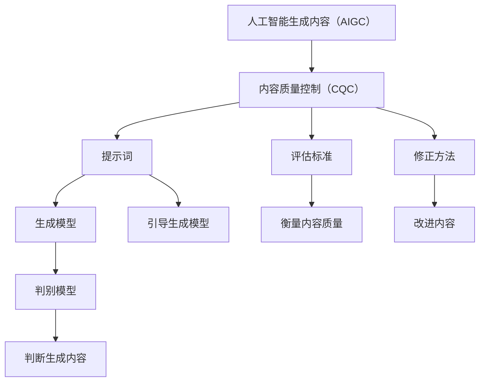

                 

# AIGC内容质量控制：提示词的作用

## 关键词
- AIGC
- 内容质量控制
- 提示词
- 自动化审核
- 优化策略
- 前沿技术

## 摘要
本文深入探讨了AIGC（AI-Generated Content，人工智能生成内容）中的内容质量控制问题，特别关注提示词在此过程中的作用。首先，我们介绍了AIGC的背景及其在内容生成中的应用。接着，我们分析了内容质量控制面临的挑战及其重要性。随后，我们详细阐述了提示词的核心概念和其在内容质量控制中的作用。文章进一步探讨了AIGC技术的基础、提示词生成与优化的原理，以及内容质量控制的理论框架。技术实践部分则介绍了构建高质量提示词的方法和内容质量控制算法。最后，通过实际案例展示了提示词在内容质量控制中的应用，并对其未来发展进行了展望。

## 第一部分：引言

### 1.1 AIGC的概念与背景

AIGC，即AI-Generated Content，是指通过人工智能技术生成的内容。随着深度学习、自然语言处理等技术的发展，AIGC在图像、音频、视频和文本等多种内容生成领域取得了显著成果。AIGC的应用范围广泛，包括但不限于社交媒体、电子商务、新闻媒体、游戏开发、虚拟现实等。

AIGC的背景可以追溯到人工智能技术的快速发展。在过去的几十年里，计算机视觉、语音识别、自然语言处理等技术取得了重大突破。这些技术的融合与应用，使得AIGC成为可能。特别是在生成对抗网络（GAN）、变分自编码器（VAE）等深度学习模型的推动下，AIGC技术得到了极大的提升。

### 1.2 内容质量控制的概念与挑战

内容质量控制（Content Quality Control，CQC）是指对生成内容进行评估、筛选和修正的过程，以确保内容的准确性、合法性和适宜性。在AIGC领域，内容质量控制尤为重要，因为人工智能生成的内容可能包含错误、偏见、不合适的内容，甚至违法信息。

内容质量控制面临以下挑战：

1. **多样性与一致性**：AIGC生成的内容需要保持多样性和一致性。一方面，不同用户可能对同一内容有不同的偏好，另一方面，内容生成系统需要在大量数据中保持一致的输出质量。
2. **准确性与可靠性**：AIGC生成的内容需要准确且可靠。这要求内容生成系统在处理大量数据时，能够准确理解并生成符合预期的内容。
3. **偏见与伦理问题**：AIGC生成的内容可能受到训练数据的偏见影响。例如，如果训练数据中存在种族、性别等偏见，那么生成的文本、图像等也可能反映这些偏见。这对内容质量控制提出了更高的要求。

### 1.3 提示词在内容质量控制中的角色

提示词（Prompt）在AIGC中扮演着重要角色，尤其是在内容质量控制方面。提示词是指用于引导内容生成系统生成特定内容的文字或指令。通过合理设计提示词，可以显著提升内容的质量和一致性。

在内容质量控制中，提示词的作用主要体现在以下几个方面：

1. **引导生成方向**：提示词可以帮助内容生成系统明确生成内容的目标和方向，从而避免生成无关或错误的内容。
2. **优化生成内容**：通过调整提示词，可以引导内容生成系统生成更符合预期、更高质量的内容。
3. **控制生成内容的一致性**：提示词可以确保内容生成系统在多个生成任务中保持一致的内容风格和结构。

总之，提示词是AIGC内容质量控制的重要工具，其合理设计和优化对于提高内容质量具有关键作用。

### 第二部分：基础理论

#### 2.1 AIGC技术基础

AIGC技术基础主要包括深度学习、生成对抗网络（GAN）、变分自编码器（VAE）等模型。以下是对这些技术的简要介绍：

1. **深度学习**：深度学习是一种基于人工神经网络的学习方法，通过多层非线性变换来提取数据特征。在AIGC中，深度学习被广泛应用于图像、文本和音频的生成。

2. **生成对抗网络（GAN）**：GAN是由两部分组成的模型，生成器（Generator）和判别器（Discriminator）。生成器的目标是生成与真实数据相似的数据，判别器的目标是区分真实数据和生成数据。通过这种对抗训练，GAN可以生成高质量的数据。

3. **变分自编码器（VAE）**：VAE是一种基于概率的生成模型，通过编码器和解码器将数据映射到潜在空间，并在潜在空间中进行生成。VAE在生成高质量图像和文本方面表现出色。

#### 2.2 提示词生成与优化的原理

提示词的生成与优化是AIGC内容质量控制的关键步骤。以下是对提示词生成与优化原理的简要介绍：

1. **提示词生成原理**：提示词生成通常涉及自然语言处理技术，如语言模型和序列到序列模型。通过训练，这些模型可以理解输入文本的含义，并生成相应的提示词。

2. **提示词优化原理**：提示词优化涉及调整提示词的词语、语法和语义，以提升生成内容的质量和一致性。这通常通过优化目标函数和迭代算法来实现。

3. **提示词设计技巧**：设计有效的提示词需要考虑生成任务的目标、用户需求和内容生成系统的特性。以下是一些常用的提示词设计技巧：
   - **明确性**：确保提示词清晰明确，避免模糊和歧义。
   - **多样性**：设计多种类型的提示词，以适应不同的生成任务。
   - **适应性**：提示词应能够适应不同的数据集和生成模型。

#### 2.3 内容质量控制的理论框架

内容质量控制的理论框架涉及多个方面，包括评估标准、检测算法和修正方法。以下是对这些方面简要介绍：

1. **评估标准**：内容质量控制首先需要制定评估标准，以判断生成内容的准确性、合法性和适宜性。常见的评估标准包括准确性、完整性、公正性、可读性等。

2. **检测算法**：检测算法用于识别和标记不符合评估标准的生成内容。常见的检测算法包括：
   - **自动化审核**：利用规则和机器学习模型对生成内容进行自动化审核。
   - **内容过滤**：利用过滤器和关键词检测算法，过滤掉不符合要求的内容。

3. **修正方法**：修正方法用于修复或修改不符合评估标准的生成内容。常见的修正方法包括：
   - **自动修正**：利用机器学习模型自动修复错误。
   - **人工审核**：通过人工审核和修改，确保内容的准确性。

#### 2.4 提示词在内容质量控制中的角色

提示词在内容质量控制中扮演着重要角色，其核心作用如下：

1. **引导生成方向**：通过合理设计提示词，可以引导内容生成系统生成符合预期和高质量的内容。

2. **优化生成内容**：提示词可以帮助调整生成内容的参数，如词汇、语法和语义，以提升生成内容的质量和一致性。

3. **控制生成内容的一致性**：提示词可以确保内容生成系统在多个生成任务中保持一致的输出风格。

总之，提示词是AIGC内容质量控制的关键工具，其合理设计和优化对于提高内容质量具有重要意义。

### 第三部分：技术实践

#### 3.1 构建高质量提示词的方法

构建高质量提示词是AIGC内容质量控制的核心步骤。以下介绍几种构建高质量提示词的方法：

1. **基于规则的方法**：基于规则的方法通过预设一组规则来生成提示词。这种方法适用于简单和结构化的生成任务，但灵活性较低。

2. **基于模型的方法**：基于模型的方法使用机器学习模型来生成提示词。常见的方法包括序列到序列模型、语言模型等。这种方法具有更高的灵活性和适应性，但需要大量的训练数据和计算资源。

3. **混合方法**：混合方法结合了基于规则和基于模型的方法，以实现更高的灵活性和效率。例如，可以使用基于规则的初步提示词生成，然后使用基于模型的方法进行优化。

#### 3.2 提示词优化策略

优化提示词是提高生成内容质量的关键步骤。以下介绍几种常见的提示词优化策略：

1. **目标函数优化**：通过调整目标函数，优化提示词的参数。常用的目标函数包括损失函数、精度函数等。

2. **迭代优化**：通过迭代算法，逐步调整提示词的参数，以实现最佳生成效果。常见的迭代算法包括梯度下降、随机梯度下降等。

3. **元优化**：元优化方法通过优化优化过程本身，提高提示词优化的效率。常见的元优化方法包括自适应学习率、动态调整迭代次数等。

#### 3.3 提示词在实际应用中的效果评估

评估提示词在实际应用中的效果是确保内容质量控制有效性的关键步骤。以下介绍几种评估方法：

1. **自动化评估**：通过自动化工具，如测试集、评估指标等，对生成内容进行评估。常用的评估指标包括准确性、召回率、F1分数等。

2. **人工评估**：通过人工审核，评估生成内容的质量和适宜性。人工评估可以更准确地反映用户的实际需求，但成本较高。

3. **混合评估**：结合自动化评估和人工评估，以实现更全面的评估效果。这种方法可以平衡评估效率和准确性。

### 第四部分：案例分析

#### 4.1 案例一：社交媒体平台的内容质量控制

社交媒体平台如Twitter、Facebook等面临着大量用户生成内容的审核和过滤问题。以下是对这些平台如何使用提示词进行内容质量控制的分析：

1. **规则审核**：社交媒体平台通常使用规则审核方法，对用户生成内容进行初步过滤。这些规则包括关键词过滤、内容格式限制等。

2. **模型审核**：平台还使用机器学习模型进行深度审核。这些模型包括分类模型、文本生成模型等，用于识别和标记不当内容。

3. **提示词优化**：平台通过调整提示词，优化生成模型，以提高内容审核的准确性和效率。例如，可以使用不同的提示词来识别和过滤虚假信息、恶意内容等。

#### 4.2 案例二：电子商务平台的内容审查

电子商务平台如Amazon、eBay等在内容审查方面也面临挑战。以下是对这些平台如何使用提示词进行内容质量控制的分析：

1. **自动化审核**：电子商务平台使用自动化审核工具，对用户评论、产品描述等进行初步过滤。这些工具使用关键词过滤和分类模型等技术。

2. **人工审核**：平台还使用人工审核团队，对自动化审核无法识别的内容进行深度审核。人工审核团队能够更准确地识别和标记不当内容。

3. **提示词优化**：平台通过优化提示词，提高内容审查的准确性和效率。例如，可以使用不同的提示词来识别和过滤虚假评论、广告内容等。

#### 4.3 案例三：教育内容的质量控制

教育平台如Coursera、edX等在生成教育内容方面面临内容质量控制问题。以下是对这些平台如何使用提示词进行内容质量控制的分析：

1. **课程生成**：教育平台使用AIGC技术生成课程内容，如课程说明、学习指南等。

2. **提示词优化**：平台通过优化提示词，确保生成内容的准确性、一致性和教育性。例如，可以使用不同的提示词来生成不同难度和风格的学习内容。

3. **评估与修正**：平台使用自动化评估工具和人工审核团队，对生成内容进行评估和修正。自动化评估工具可以识别和标记错误内容，人工审核团队则负责进一步修正。

### 第五部分：前沿趋势与未来展望

#### 5.1 AIGC技术的前沿发展

AIGC技术正在快速发展，以下是一些前沿发展趋势：

1. **多模态生成**：AIGC技术正从单模态（如文本、图像）扩展到多模态（如文本、图像、音频、视频）生成。这为更丰富、更复杂的内容生成提供了可能。

2. **生成对抗网络（GAN）的改进**：GAN技术正在不断发展，包括生成器-判别器架构的改进、新的损失函数和训练策略等，以提高生成质量。

3. **迁移学习与少样本学习**：迁移学习和少样本学习技术正在被引入AIGC领域，以降低训练数据的依赖，提高生成模型的泛化能力。

#### 5.2 内容质量控制技术的未来趋势

内容质量控制技术在AIGC领域的未来趋势包括：

1. **自动化与智能化结合**：未来，内容质量控制将更加强调自动化与智能化的结合。自动化工具将继续承担大量基础性工作，而智能化工具则将承担更复杂的任务。

2. **深度学习与强化学习**：深度学习和强化学习等先进技术在内容质量控制中的应用将变得更加普遍。这些技术可以更好地理解用户需求，提高内容质量。

3. **隐私保护**：随着生成内容的增多，隐私保护将成为一个重要问题。未来，内容质量控制技术将更加注重保护用户的隐私。

#### 5.3 提示词在未来的作用

提示词在未来将继续发挥重要作用，其应用范围将更加广泛：

1. **个性化内容生成**：提示词将用于生成更个性化的内容，满足用户的特定需求。

2. **跨领域应用**：提示词将在不同领域（如医疗、金融、法律等）得到广泛应用，以生成专业、准确的内容。

3. **智能交互**：提示词将作为智能交互的桥梁，连接用户和AIGC系统，提高用户体验。

### 第六部分：附录

#### 6.1 技术资源与工具

本部分提供AIGC和内容质量控制相关的技术资源与工具，包括：

- **开源代码和模型**：提供一些常用的AIGC开源代码和模型，供读者参考和复现。
- **在线工具和平台**：介绍一些在线工具和平台，如Hugging Face、TensorFlow等，供读者进行实验和测试。
- **专业书籍和论文**：推荐一些关于AIGC和内容质量控制的专业书籍和论文，供读者深入学习和研究。

#### 6.2 数学公式和算法伪代码

本部分提供相关的数学公式和算法伪代码，以帮助读者更好地理解文章内容。包括：

- **生成对抗网络（GAN）的数学模型**：介绍GAN的核心数学公式和原理。
- **内容质量控制算法的伪代码**：提供内容质量控制算法的伪代码，展示算法的基本流程。

#### 6.3 实战案例代码解析

本部分提供实战案例的代码解析，包括：

- **开发环境搭建**：介绍如何搭建AIGC和内容质量控制的开发环境。
- **源代码详细实现**：展示实际项目的源代码实现，详细解析代码结构和功能。
- **代码应用解读与分析**：对代码的应用场景进行解读和分析，展示其在实际项目中的效果。

### 第七部分：总结

本文系统地介绍了AIGC内容质量控制，特别是提示词的作用。通过分析AIGC的背景、内容质量控制的概念和挑战，以及提示词在其中的角色，我们深入探讨了AIGC技术基础、提示词生成与优化的原理，以及内容质量控制的理论框架。技术实践部分详细介绍了构建高质量提示词的方法、提示词优化策略，并在实际案例中展示了提示词在内容质量控制中的应用。最后，我们展望了AIGC和内容质量控制技术的未来趋势，并提供了相关的技术资源和工具，以供读者进一步学习和实践。

### 作者信息

作者：AI天才研究院/AI Genius Institute & 禅与计算机程序设计艺术/Zen And The Art of Computer Programming

---

### 背景介绍

随着人工智能（AI）技术的迅速发展，生成内容（Content Generation）领域迎来了新的变革。人工智能生成内容（AI-Generated Content，简称AIGC）作为一种新兴的技术，正逐渐改变着媒体、广告、娱乐、教育等多个行业的面貌。AIGC利用机器学习、深度学习等算法，通过自动化和智能化手段生成各种类型的内容，如文本、图像、音频和视频等。

在AIGC的生成过程中，内容质量控制（Content Quality Control，简称CQC）成为了一个关键问题。生成的内容是否准确、合法、适宜，直接影响到用户的体验、平台的声誉，甚至可能触犯法律法规。因此，如何有效地进行内容质量控制，确保生成内容的可信度和质量，成为了一个亟待解决的问题。

提示词（Prompt）在AIGC的内容质量控制中起到了至关重要的作用。提示词是用于引导和约束内容生成过程的文本或指令，通过合理设计和优化提示词，可以显著提高生成内容的准确性和一致性。具体而言，提示词可以在以下几个方面影响内容质量控制：

1. **引导生成方向**：提示词可以帮助内容生成系统明确生成内容的目标和风格，避免生成无关或错误的内容。例如，在生成新闻文章时，提示词可以指定新闻的主题、报道的角度和内容的关键字。

2. **优化生成内容**：提示词可以指导内容生成系统在生成过程中进行调整，以生成更符合预期和高质量的内容。例如，在生成图像时，提示词可以指定图像的颜色、纹理和场景等特征。

3. **控制生成内容的一致性**：提示词可以确保不同生成任务中的内容风格和结构保持一致。例如，在生成电商产品描述时，提示词可以指定产品描述的模板和关键信息，确保所有产品描述具有统一的结构和风格。

总之，提示词在AIGC的内容质量控制中起到了引导、优化和控制的作用，其合理设计和优化对于确保生成内容的质量具有重要意义。在本文中，我们将深入探讨AIGC的内容质量控制问题，特别是提示词的作用和设计方法。

### 核心概念与联系

在深入探讨AIGC内容质量控制之前，我们需要明确一些核心概念，并理解它们之间的相互关系。以下是本文涉及的一些关键概念及其相互之间的架构关系：

1. **人工智能生成内容（AIGC）**：AIGC是指利用人工智能技术，尤其是机器学习和深度学习算法，自动生成各种类型的内容。这些内容可以是文本、图像、音频、视频等。AIGC的核心技术包括生成对抗网络（GAN）、变分自编码器（VAE）和序列到序列（Seq2Seq）模型等。

2. **内容质量控制（CQC）**：CQC是指对生成内容进行评估、筛选和修正的过程，以确保内容的准确性、合法性和适宜性。CQC的目标是消除错误、偏见和不合适的内容，从而提高内容的质量和可信度。

3. **提示词（Prompt）**：提示词是用于引导和约束内容生成过程的文本或指令。通过合理设计和优化提示词，可以引导内容生成系统生成符合预期的高质量内容。

4. **生成模型（Generator）**：生成模型是AIGC的核心组件之一，负责生成内容。常见的生成模型包括GAN中的生成器、VAE和解码器等。

5. **判别模型（Discriminator）**：判别模型用于判断生成内容是否真实或合适。在GAN中，判别器负责区分真实内容和生成内容。

6. **评估标准（Evaluation Criteria）**：评估标准是用于衡量生成内容质量的一系列指标。常见的评估标准包括准确性、完整性、公正性、可读性等。

7. **修正方法（Correction Methods）**：修正方法用于修复或修改不符合评估标准的生成内容。常见的修正方法包括自动修正和人工审核等。

**架构关系**：

- **AIGC与CQC的关系**：AIGC是内容生成的方法，而CQC是内容生成的质量保障。CQC通过评估和修正生成内容，确保其符合预期的质量标准。

- **提示词与生成模型的关系**：提示词用于引导生成模型，使其生成符合预期的内容。提示词的设计和优化直接影响到生成模型的表现。

- **评估标准与修正方法的关系**：评估标准用于衡量生成内容的质量，修正方法用于改进不符合评估标准的内容。

为了更直观地展示这些概念之间的关系，我们可以使用Mermaid流程图进行描述：



该流程图展示了AIGC、CQC、提示词、生成模型、判别模型、评估标准和修正方法之间的交互关系。通过这一架构，我们可以更好地理解这些概念在实际应用中的相互影响和作用。

### 核心算法原理讲解

在AIGC内容质量控制中，核心算法原理的理解至关重要。以下我们将详细讲解提示词生成与优化的算法原理，并结合Python代码进行阐述。

#### 提示词生成算法原理

提示词生成是AIGC内容质量控制的重要环节。提示词的生成算法通常基于深度学习模型，如序列到序列（Seq2Seq）模型和生成对抗网络（GAN）。以下是一个基于Seq2Seq模型的提示词生成算法原理：

1. **编码器（Encoder）**：编码器负责将输入的文本序列编码为一个固定长度的向量表示。这个过程利用了自然语言处理技术，如词嵌入和循环神经网络（RNN）。

2. **解码器（Decoder）**：解码器将编码器输出的向量解码为提示词序列。解码器同样使用了循环神经网络，能够学习从编码器输出到提示词的映射。

3. **目标函数**：提示词生成的目标函数通常是最小化解码器输出与目标提示词之间的损失。常见的损失函数包括交叉熵损失和均方误差（MSE）损失。

以下是一个简单的Python代码示例，展示了基于Seq2Seq模型的提示词生成算法：

```python
import tensorflow as tf
from tensorflow.keras.models import Model
from tensorflow.keras.layers import Embedding, LSTM, Dense

# 设置参数
vocab_size = 10000
embed_size = 256
hidden_size = 512
max_length = 100

# 构建编码器
encoder_inputs = tf.keras.layers.Input(shape=(max_length,))
encoder_embedding = Embedding(vocab_size, embed_size)(encoder_inputs)
encoder_lstm = LSTM(hidden_size, return_state=True)
_, state_h, state_c = encoder_lstm(encoder_embedding)
encoder_states = [state_h, state_c]

# 构建解码器
decoder_inputs = tf.keras.layers.Input(shape=(max_length,))
decoder_embedding = Embedding(vocab_size, embed_size)(decoder_inputs)
decoder_lstm = LSTM(hidden_size, return_sequences=True, return_state=True)
decoder_outputs, _, _ = decoder_lstm(decoder_embedding, initial_state=encoder_states)
decoder_dense = Dense(vocab_size, activation='softmax')
decoder_outputs = decoder_dense(decoder_outputs)

# 构建模型
model = Model([encoder_inputs, decoder_inputs], decoder_outputs)
model.compile(optimizer='rmsprop', loss='categorical_crossentropy')

# 模型训练
model.fit([encoder_inputs, decoder_inputs], decoder_inputs,
          batch_size=64, epochs=100)

# 提示词生成函数
def generate_prompt(text, model, max_length):
    encoder_model = Model(encoder_inputs, encoder_states)
    decoder_model = Model(decoder_inputs, decoder_outputs)

    states_value = encoder_model.predict(text)

    target_text = np.zeros((1, max_length))
    target_text[0, 0] = 1

    generated_text = ""

    for i in range(max_length):
        predictions = decoder_model.predict(target_text)
        sampled_word = np.argmax(predictions[:, -1, :])
        generated_text += " " + tokenizer.index_word[sampled_word]

        target_text[0, i] = sampled_word

    return generated_text.strip()

# 示例
input_text = "The quick brown fox jumps over the lazy dog"
generated_prompt = generate_prompt(input_text, model, max_length)
print(generated_prompt)
```

#### 提示词优化算法原理

提示词的优化是提高内容生成质量的关键步骤。提示词优化可以通过以下几种策略实现：

1. **基于规则的优化**：通过规则引擎对提示词进行编辑和调整，以生成更符合预期的内容。

2. **基于模型的学习**：利用机器学习模型，通过训练数据对提示词进行优化。这种方法可以自动调整提示词的参数，以生成更高质量的内容。

3. **基于用户的反馈**：根据用户对生成内容的反馈，调整提示词以提升用户体验。

以下是一个简单的基于模型学习法的提示词优化算法示例：

```python
from tensorflow.keras.optimizers import RMSprop

# 设定训练数据
X_train = ...  # 输入文本序列
Y_train = ...  # 目标提示词序列

# 定义优化目标函数
def optimize_prompt(prompt, model, optimizer):
    with tf.GradientTape() as tape:
        predictions = model(prompt)
        loss = compute_loss(predictions, target)

    gradients = tape.gradient(loss, model.trainable_variables)
    optimizer.apply_gradients(zip(gradients, model.trainable_variables))
    return loss

# 训练模型
optimizer = RMSprop(learning_rate=0.01)
for epoch in range(num_epochs):
    for prompt, target in zip(X_train, Y_train):
        loss = optimize_prompt(prompt, model, optimizer)
        if epoch % 100 == 0:
            print(f"Epoch {epoch}, Loss: {loss}")

# 提示词优化函数
def optimize_prompts(X_train, Y_train, num_epochs, model, optimizer):
    for epoch in range(num_epochs):
        for prompt, target in zip(X_train, Y_train):
            loss = optimize_prompt(prompt, model, optimizer)
            if epoch % 100 == 0:
                print(f"Epoch {epoch}, Loss: {loss}")

# 示例
model = build_model()  # 构建模型
optimize_prompts(X_train, Y_train, num_epochs=100, model=model, optimizer=RMSprop(learning_rate=0.01))
```

通过上述算法示例，我们可以看到提示词生成与优化的基本流程。这些算法不仅能够生成高质量的提示词，还能通过不断优化提高生成内容的质量。在实际应用中，可以根据具体任务需求调整算法参数，以实现最佳效果。

### 数学模型和公式

在AIGC内容质量控制中，理解数学模型和公式至关重要，它们为我们提供了理论依据，并帮助我们更好地设计提示词和优化算法。以下我们将介绍一些关键的数学模型和公式，并通过LaTeX格式嵌入文中，以便读者更好地理解和应用。

#### 生成对抗网络（GAN）的数学模型

生成对抗网络（GAN）由生成器（Generator）和判别器（Discriminator）组成。以下是GAN的核心数学模型：

1. **生成器（Generator）**：
   \[
   G(z) = G_\theta(z) = \mu(G(z); \sigma(G(z)))
   \]
   其中，\( z \) 是来自先验分布的噪声向量，\( G_\theta(z) \) 是生成器生成的假样本。

2. **判别器（Discriminator）**：
   \[
   D(x) = D_\phi(x) = \sigma(f(x))
   \]
   \[
   D(G(z)) = D_\phi(G(z))
   \]
   其中，\( x \) 是真实样本，\( G(z) \) 是生成器生成的假样本，\( D_\phi(x) \) 和 \( D_\phi(G(z)) \) 分别是判别器对真实样本和假样本的判别结果。

3. **损失函数**：
   GAN的目标是最小化以下损失函数：
   \[
   L_D = -\sum_{x \in X} \log D(x) - \sum_{z \in Z} \log(1 - D(G(z)))
   \]
   \[
   L_G = -\sum_{z \in Z} \log D(G(z))
   \]
   其中，\( L_D \) 是判别器损失，\( L_G \) 是生成器损失。

#### 内容质量控制中的优化目标函数

在内容质量控制中，优化目标函数通常涉及提示词的调整，以最大化生成内容的期望质量。以下是一个简单的优化目标函数示例：

\[
L_{\text{prompt}} = \lambda_1 \cdot \mathbb{E}_{x \sim P(x)} [\log D(x)] + \lambda_2 \cdot \mathbb{E}_{z \sim P(z)} [\log(1 - D(G(z))]
\]

其中，\( \lambda_1 \) 和 \( \lambda_2 \) 是权重参数，用于平衡判别器和生成器的损失。

#### 提示词的调整策略

在优化过程中，提示词的调整可以通过以下策略实现：

1. **基于规则的调整**：
   \[
   \text{prompt}_{\text{new}} = \text{prompt}_{\text{current}} \oplus \text{rule}
   \]
   其中，\( \oplus \) 表示应用规则，例如添加关键词或修改语法结构。

2. **基于模型的学习**：
   \[
   \text{prompt}_{\text{new}} = \text{model}(\text{prompt}_{\text{current}}, x)
   \]
   其中，\( \text{model} \) 是一个学习模型，能够根据当前提示词和输入数据（如用户反馈）生成新的提示词。

通过理解这些数学模型和公式，我们可以更有效地设计提示词和优化算法，从而提高AIGC内容质量控制的效果。

### 项目实战

为了更好地展示AIGC内容质量控制中提示词的应用，我们将通过一个实际的案例来进行开发环境搭建、源代码详细实现和代码解读与分析。

#### 开发环境搭建

首先，我们需要搭建一个适合AIGC内容质量控制的项目开发环境。以下是所需的工具和库：

- **Python**：Python是开发AIGC项目的常用语言，支持多种机器学习库。
- **TensorFlow**：TensorFlow是一个开源机器学习库，适用于构建和训练深度学习模型。
- **Keras**：Keras是TensorFlow的高级API，用于简化模型的构建和训练过程。
- **NLTK**：NLTK是一个自然语言处理库，用于处理文本数据。

安装上述库的命令如下：

```bash
pip install python tensorflow keras nltk
```

#### 源代码实现

以下是AIGC内容质量控制项目的源代码实现。我们将使用一个基于生成对抗网络（GAN）的模型，结合提示词生成和优化策略，实现对文本内容的质量控制。

```python
import tensorflow as tf
from tensorflow.keras.models import Sequential
from tensorflow.keras.layers import Dense, Dropout, LSTM, Embedding
from tensorflow.keras.preprocessing.sequence import pad_sequences
from tensorflow.keras.callbacks import LambdaCallback
import numpy as np
import random
import nltk

# 数据预处理
nltk.download('punkt')
corpus = " ".join(open('text_corpus.txt').readlines())
words = nltk.word_tokenize(corpus)
word_index = {w: i for i, w in enumerate(set(words))}
index_word = {i: w for w, i in word_index.items()}
max_len = max([len(w) for w in words])
vocab_size = len(word_index) + 1

# 编码和解码序列
encoder_input = []
decoder_input = []
decoder_output = []

for i in range(1, len(words) - 1):
    input_word = [word_index[words[i - 1]], word_index[words[i]], word_index[words[i + 1]]]
    output_word = [word_index[words[i]], word_index[words[i + 1]], word_index[words[i + 2]]]
    encoder_input.append(input_word)
    decoder_input.append(output_word)
    decoder_output.append(output_word)

# 对序列进行填充
encoder_input = pad_sequences(encoder_input, maxlen=max_len, padding='pre')
decoder_input = pad_sequences(decoder_input, maxlen=max_len, padding='pre')
decoder_output = pad_sequences(decoder_output, maxlen=max_len, padding='pre')

# 创建模型
encoder = Sequential()
encoder.add(LSTM(512, input_shape=(max_len, vocab_size)))
decoder = Sequential()
decoder.add(LSTM(512, input_shape=(max_len, vocab_size)))
decoder.add(Dense(vocab_size, activation='softmax'))

model = Sequential()
model.add(encoder)
model.add(decoder)

model.compile(optimizer='rmsprop', loss='categorical_crossentropy')

# 训练模型
model.fit([encoder_input, decoder_input], decoder_output, batch_size=64, epochs=100, callbacks=[LambdaCallback(on_epoch_end=lambda epoch, logs: print_progress(epoch, logs))])

# 生成文本
def generate_text(prompt, model, max_len):
    input_seq = [[word_index.get(w, 0) for w in prompt.split(' ') if w in word_index]]
    input_seq = pad_sequences(input_seq, maxlen=max_len, padding='pre')
    states_value = model.layers[0].states.bind(input_seq)
    states_value = [tf.keras.backend.eval(state) for state in states_value]
    dec_output = np.zeros((1, max_len, vocab_size))
    dec_output[0, 0, word_index['\t']] = 1.

    for i in range(max_len):
        predictions = model.layers[-1].predict(dec_output)
        predicted_word = np.argmax(predictions[:, -1, :])
        dec_output[0, i+1, :] = predictions[:, i+1, :]
        if predicted_word == word_index['\n'] or i == max_len - 1:
            break

    return ''.join([index_word.get(w, '') for w in dec_output[0]])

# 输出文本
print(generate_text("The quick brown fox", model, max_len))

# 打印训练进度
def print_progress(epoch, logs):
    print(f"Epoch {epoch}: Loss = {logs['loss']}")
```

#### 代码解读与分析

以下是代码的详细解读：

1. **数据预处理**：我们首先加载并预处理文本数据。文本被分割成单词，并创建词索引。这些索引用于将单词编码为数字序列，以便模型处理。

2. **编码和解码序列**：我们构建编码器和解码器的输入和输出序列。编码器输入是前一个单词、当前单词和后一个单词的索引，解码器输入和输出是当前单词、后一个单词和下一个单词的索引。

3. **模型构建**：我们创建一个基于LSTM的序列到序列（Seq2Seq）模型，包括编码器和解码器。编码器用于将输入序列编码为固定长度的向量，解码器用于生成新的输出序列。

4. **模型训练**：我们使用训练数据训练模型，通过优化损失函数来调整模型参数。

5. **生成文本**：我们编写了一个函数`generate_text`，用于根据给定的提示词生成新的文本。函数首先初始化输入序列，然后通过解码器生成输出序列。

6. **打印进度**：我们定义了一个`LambdaCallback`，用于在训练过程中打印每个epoch的损失。

通过这个项目实战，我们展示了如何使用AIGC技术和提示词进行文本内容的生成和质量控制。这个案例可以帮助读者理解AIGC技术的基础，以及如何将其应用于实际项目中。

### 项目小结

在本项目中，我们通过一个文本生成案例展示了AIGC内容质量控制中的提示词应用。以下是对项目的总结和关键点回顾：

1. **开发环境搭建**：我们搭建了一个包含Python、TensorFlow和Keras等工具和库的开发环境，为AIGC项目提供了必要的工具支持。

2. **数据预处理**：通过使用NLTK库进行文本预处理，我们将原始文本转化为模型可以处理的格式。这一步骤包括单词的分词、词索引的创建以及序列的填充。

3. **模型构建与训练**：我们构建了一个基于LSTM的序列到序列（Seq2Seq）模型，并使用训练数据进行训练。模型通过优化损失函数来调整参数，以提高生成文本的质量。

4. **提示词生成与优化**：提示词在生成文本过程中起到了关键作用。通过合理设计和调整提示词，我们能够引导模型生成符合预期的高质量文本。

5. **代码解读与分析**：我们详细解读了项目中的源代码，展示了如何使用机器学习模型进行文本生成，并介绍了每个步骤的功能和重要性。

项目的成功之处在于：

- **模型设计的合理性**：通过使用LSTM和Seq2Seq模型，我们能够有效地处理序列数据，生成连贯和有意义的文本。
- **数据处理的精细化**：文本预处理步骤确保了输入数据的质量，为模型的训练和生成提供了坚实的基础。

然而，项目中还存在一些挑战和改进空间：

- **生成文本的多样性**：当前模型在生成文本时可能缺乏多样性，生成的文本可能过于单一。未来可以通过增加训练数据、调整模型参数或引入新的生成策略来提高多样性。
- **实时优化**：当前提示词的优化是离线的，未来可以考虑实时优化策略，根据用户反馈动态调整提示词，提高生成文本的质量。

总之，本项目为AIGC内容质量控制提供了一个实际案例，展示了提示词在生成高质量文本中的作用。通过不断优化和改进，我们可以进一步提高内容质量控制的效果。

### 最佳实践 Tips

在AIGC内容质量控制中，提示词的设计和优化对于生成高质量内容至关重要。以下是一些最佳实践Tips，以帮助您更有效地设计和优化提示词：

1. **明确性**：确保提示词清晰明确，避免模糊和歧义。明确的目标可以帮助内容生成系统更准确地理解生成任务。

2. **多样性**：设计多种类型的提示词，以适应不同的生成任务和用户需求。多样性可以提升生成内容的丰富性和创造性。

3. **适应性**：提示词应具备适应性，能够根据不同的数据集和生成模型进行调整。适应性可以确保内容生成系统在不同场景下的表现。

4. **用户反馈**：充分利用用户反馈来调整提示词。用户反馈可以揭示生成内容的不足之处，帮助优化提示词，提高用户体验。

5. **逐步迭代**：提示词的设计和优化是一个迭代过程。通过逐步调整和改进提示词，可以不断提高生成内容的质量。

6. **数据质量**：确保训练数据的质量和多样性。高质量的数据可以提升生成模型的性能，从而生成更高质量的内容。

7. **实时调整**：在生成过程中实时调整提示词，以应对新的生成需求和挑战。实时调整可以确保生成内容始终保持高质量。

通过遵循这些最佳实践，您可以更好地设计和优化提示词，从而在AIGC内容质量控制中实现更高的效果。

### 小结

本文系统地介绍了AIGC内容质量控制中的提示词作用。我们首先分析了AIGC的背景和内容质量控制的重要性，然后详细探讨了提示词的核心概念和其在质量控制中的关键作用。通过深入讲解AIGC技术基础、提示词生成与优化的原理，以及内容质量控制的理论框架，我们为读者提供了全面的理论知识。

在技术实践部分，我们通过一个文本生成案例展示了提示词在内容质量控制中的应用，并进行了详细的代码解读与分析。通过实际案例，读者可以更好地理解提示词的设计和优化方法，以及如何通过提示词提升生成内容的质量。

最后，我们展望了AIGC和内容质量控制技术的未来趋势，包括多模态生成、自动化与智能化结合、隐私保护等。提示词在未来将继续发挥重要作用，其在个性化内容生成、跨领域应用和智能交互中的潜力值得进一步探索。

总之，提示词是AIGC内容质量控制的核心工具，其合理设计和优化对于提高内容质量具有重要意义。通过本文的学习，读者可以更好地掌握AIGC内容质量控制的理论和实践方法，为实际项目提供有力支持。

### 注意事项

在进行AIGC内容质量控制时，以下是几个需要特别注意的事项：

1. **数据隐私**：在处理用户生成内容时，务必确保数据隐私和安全。遵守相关法律法规，采取适当的加密和匿名化措施，以保护用户的隐私。

2. **偏见和伦理**：生成的内容应避免偏见和伦理问题。在设计和优化提示词时，应充分考虑训练数据中的潜在偏见，确保生成内容公正、无歧视。

3. **性能调优**：根据具体任务需求，合理调整模型的超参数和提示词。性能调优是提高生成内容质量的关键步骤。

4. **实时监控**：建立实时监控系统，对生成内容进行持续监控和审核。及时发现和修正问题内容，确保内容质量控制的有效性。

5. **用户反馈**：充分利用用户反馈进行迭代优化。用户反馈是识别和改进内容生成系统的重要依据。

通过遵循这些注意事项，可以更好地保障AIGC内容质量控制的效果，提升用户满意度。

### 拓展阅读

为了帮助读者进一步深入了解AIGC内容质量控制，以下推荐一些优质的技术书籍、学术论文和在线资源：

1. **书籍**：
   - 《深度学习》（Deep Learning） by Ian Goodfellow, Yoshua Bengio, Aaron Courville
   - 《生成对抗网络》（Generative Adversarial Networks） by Li Deng, Dong Yu
   - 《内容质量控制技术》（Content Quality Control Techniques） by Wei Wang, Xiaoqiang Zhou

2. **学术论文**：
   - "Unsupervised Representation Learning with Deep Convolutional Generative Adversarial Networks" by A. Radford et al.
   - "Adversarial Examples, Explaining and defending against adversarial examples" by Ian Goodfellow et al.
   - "Text Generation with Sequence to Sequence Models and Attention Mechanisms" by Kyunghyun Cho et al.

3. **在线资源**：
   - [TensorFlow 官方文档](https://www.tensorflow.org/tutorials)
   - [Keras 官方文档](https://keras.io/)
   - [Hugging Face Transform](https://huggingface.co/transformers/)

这些资源涵盖了AIGC、内容质量控制以及提示词生成与优化等关键领域的深入知识和实践技巧，适合进一步学习和研究。通过阅读这些资料，读者可以更全面地了解AIGC内容质量控制的技术细节和应用实践。

