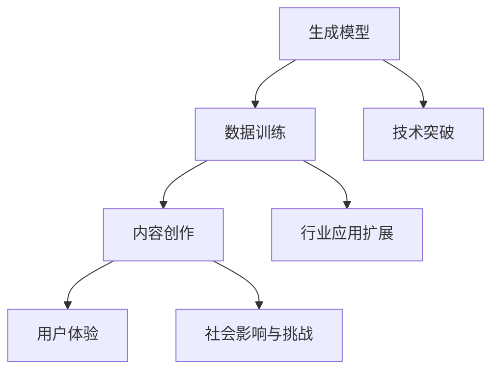

                 

### 第1章: AIGC概述

## 1.1 AIGC的基本概念

### 1.1.1 AIGC的定义与背景

AIGC（AI-Generated Content）是指由人工智能技术生成的内容，涵盖文本、图像、音频和视频等多种形式。AIGC并非一个全新的概念，而是在近年来随着深度学习和生成模型技术的飞速发展逐渐崭露头角。其背景可以追溯到20世纪80年代，那时神经网络和机器学习的基础理论开始形成，但是受限于计算能力和数据资源的限制，AIGC的应用并没有得到广泛推广。直到近年来，随着计算能力的提升和大数据的普及，AIGC技术得以快速发展，并在各个领域展现出巨大的潜力。

### 1.1.2 AIGC与传统AI的区别

传统AI主要侧重于数据的处理和分析，强调输入数据的特征提取和模式识别。而AIGC则更强调内容的生成，通过学习大量的数据和模式，人工智能能够创作出前所未有的内容。这种区别主要体现在以下几个方面：

1. **目标和应用领域**：
   - 传统AI：侧重于任务导向的自动化，如语音识别、图像分类、推荐系统等。
   - AIGC：侧重于创造新颖、有创意的内容，如自动写作、艺术创作、视频编辑等。

2. **技术实现**：
   - 传统AI：依赖于监督学习、强化学习等算法，通过已有数据的训练来优化模型。
   - AIGC：依赖于生成模型，如变分自编码器（VAE）、生成对抗网络（GAN）等，能够生成新的数据。

3. **数据需求**：
   - 传统AI：需要大量的标记数据进行训练。
   - AIGC：不仅需要大量的标记数据，还需要大量的未标记数据来辅助生成模型的训练。

### 1.2 AIGC的应用领域

#### 1.2.1 内容创作

AIGC在内容创作中的应用是其最直接、最广泛的应用领域。通过自然语言处理（NLP）和计算机生成图像（CGI）等技术，AIGC可以生成文章、新闻、广告文案、视频脚本等多种形式的内容。例如，GPT-3模型可以生成高质量的文章，而DALL-E模型则可以生成独特的图像。

#### 1.2.2 设计与艺术

AIGC在设计与艺术领域的应用同样具有革命性。设计师可以利用AIGC技术快速生成设计方案，艺术家则可以通过生成模型创作出前所未有的艺术作品。例如，DeepArt.io利用GAN技术可以将普通照片转换为艺术品风格，而Designo.io则提供了一款基于AIGC的图形设计工具。

#### 1.2.3 教育与培训

在教育与培训领域，AIGC可以提供个性化学习体验和自动评价系统。例如，通过AIGC技术，教育平台可以生成个性化的学习材料和测试题，并根据学生的答题情况自动评估学习效果。同时，AIGC还可以用于开发教育游戏，增强学习的趣味性和互动性。

#### 1.2.4 医疗与健康

在医疗与健康领域，AIGC的应用主要体现在疾病预测、诊断和治疗方案生成等方面。通过分析大量的医疗数据，AIGC可以生成个性化的诊断报告和治疗方案。此外，AIGC还可以用于医学影像分析，如肿瘤检测、骨折诊断等。

### 1.3 AIGC的发展趋势

#### 1.3.1 技术突破

随着深度学习技术的发展，AIGC在生成模型方面的表现日益强大。例如，GPT-3和DALL-E等模型的推出，使得AIGC在内容生成和图像生成方面取得了重大突破。未来，我们预计AIGC技术将继续朝着更高维度、更精细化的方向发展。

#### 1.3.2 行业应用扩展

AIGC在各个领域的应用正在不断扩展，从最初的文本和图像生成，到现在的音频、视频和多模态生成。未来，随着技术的进一步成熟，AIGC的应用领域将更加广泛，涵盖更多的行业和场景。

#### 1.3.3 社会影响与挑战

AIGC的发展不仅带来了技术上的突破，也对社会产生了深远的影响。一方面，AIGC为人类创造了更多的价值和机会；另一方面，也带来了隐私保护、伦理道德等问题。例如，如何确保AIGC生成的内容不侵犯版权，如何规范AIGC在医疗等领域的应用等。

**核心概念与联系**

AIGC的核心概念包括生成模型、数据训练、内容创作和用户体验。这些概念之间的关系可以用以下Mermaid流程图来表示：



**核心算法原理讲解**

在AIGC技术中，生成模型是核心。以下是一个简单的生成对抗网络（GAN）的Python代码示例，用于生成图像：

```python
import tensorflow as tf
from tensorflow.keras.layers import Dense, Flatten
from tensorflow.keras.models import Sequential

# 定义生成器模型
def build_generator():
    model = Sequential()
    model.add(Dense(units=256, activation='relu', input_shape=(100,)))
    model.add(Dense(units=512, activation='relu'))
    model.add(Dense(units=1024, activation='relu'))
    model.add(Flatten())
    model.add(Dense(units=784, activation='tanh'))
    return model

# 定义判别器模型
def build_discriminator():
    model = Sequential()
    model.add(Flatten(input_shape=(28, 28)))
    model.add(Dense(units=512, activation='relu'))
    model.add(Dense(units=256, activation='relu'))
    model.add(Dense(units=1, activation='sigmoid'))
    return model

# 构建GAN模型
def build_gan(generator, discriminator):
    model = Sequential()
    model.add(generator)
    model.add(discriminator)
    return model

# 训练GAN模型
def train_gan(generator, discriminator, discriminator_optimizer, generator_optimizer, batch_size, epochs):
    for epoch in range(epochs):
        for _ in range(batch_size):
            noise = tf.random.normal([1, 100])
            generated_images = generator(noise)
            real_images = ... # 获取真实图像数据
            real_labels = tf.ones([batch_size, 1])
            fake_labels = tf.zeros([batch_size, 1])
            
            with tf.GradientTape() as gen_tape, tf.GradientTape() as disc_tape:
                disc_real_output = discriminator(real_images)
                disc_fake_output = discriminator(generated_images)
                gen_loss = ... # 计算生成器损失
                disc_loss = ... # 计算判别器损失

            generator_gradients = gen_tape.gradient(gen_loss, generator.trainable_variables)
            discriminator_gradients = disc_tape.gradient(disc_loss, discriminator.trainable_variables)

            generator_optimizer.apply_gradients(zip(generator_gradients, generator.trainable_variables))
            discriminator_optimizer.apply_gradients(zip(discriminator_gradients, discriminator.trainable_variables))

        print(f"Epoch {epoch + 1}, Generator Loss: {gen_loss}, Discriminator Loss: {disc_loss}")
```

在这个例子中，我们使用了生成对抗网络（GAN）来生成图像。生成器（Generator）负责生成新的图像，判别器（Discriminator）负责判断图像是真实还是生成的。通过不断地训练这两个模型，生成器逐渐生成越来越逼真的图像。

### 源代码详细实现与代码解读

在上面的代码中，我们首先定义了生成器（Generator）和判别器（Discriminator）模型。生成器模型的作用是接收随机噪声并生成图像，而判别器模型的作用是判断图像是真实还是生成的。

```python
# 定义生成器模型
def build_generator():
    model = Sequential()
    model.add(Dense(units=256, activation='relu', input_shape=(100,)))
    model.add(Dense(units=512, activation='relu'))
    model.add(Dense(units=1024, activation='relu'))
    model.add(Flatten())
    model.add(Dense(units=784, activation='tanh'))
    return model

# 定义判别器模型
def build_discriminator():
    model = Sequential()
    model.add(Flatten(input_shape=(28, 28)))
    model.add(Dense(units=512, activation='relu'))
    model.add(Dense(units=256, activation='relu'))
    model.add(Dense(units=1, activation='sigmoid'))
    return model
```

生成器模型使用了三个全连接层，最后一个层使用了`tanh`激活函数，使得生成的图像在像素值上处于`[-1, 1]`之间，这是一个常见的图像生成方法。

判别器模型则使用了一个全连接层，其目的是判断图像是真实还是生成的。通过对比判别器的输出值，我们可以判断生成器生成的图像质量。

接下来，我们构建了GAN模型，这个模型由生成器和判别器串联而成。

```python
# 构建GAN模型
def build_gan(generator, discriminator):
    model = Sequential()
    model.add(generator)
    model.add(discriminator)
    return model
```

GAN模型的训练过程是核心部分。在训练过程中，我们不断更新生成器和判别器的参数，以使得生成器生成的图像越来越逼真，判别器越来越难以区分生成图像和真实图像。

```python
# 训练GAN模型
def train_gan(generator, discriminator, discriminator_optimizer, generator_optimizer, batch_size, epochs):
    for epoch in range(epochs):
        for _ in range(batch_size):
            noise = tf.random.normal([1, 100])
            generated_images = generator(noise)
            real_images = ... # 获取真实图像数据
            real_labels = tf.ones([batch_size, 1])
            fake_labels = tf.zeros([batch_size, 1])
            
            with tf.GradientTape() as gen_tape, tf.GradientTape() as disc_tape:
                disc_real_output = discriminator(real_images)
                disc_fake_output = discriminator(generated_images)
                gen_loss = ... # 计算生成器损失
                disc_loss = ... # 计算判别器损失

            generator_gradients = gen_tape.gradient(gen_loss, generator.trainable_variables)
            discriminator_gradients = disc_tape.gradient(disc_loss, discriminator.trainable_variables)

            generator_optimizer.apply_gradients(zip(generator_gradients, generator.trainable_variables))
            discriminator_optimizer.apply_gradients(zip(discriminator_gradients, discriminator.trainable_variables))

        print(f"Epoch {epoch + 1}, Generator Loss: {gen_loss}, Discriminator Loss: {disc_loss}")
```

在训练过程中，我们首先生成噪声并使用生成器生成图像，然后获取真实图像数据。接着，计算生成器和判别器的损失，并更新它们的参数。这个过程不断重复，直到生成器生成的图像质量达到预期。

**代码应用解读与分析**

通过上述代码，我们可以训练一个GAN模型来生成图像。在实际应用中，我们可以将GAN模型应用于各种图像生成任务，如人脸生成、艺术风格迁移等。

例如，假设我们想要生成人脸图像，我们可以使用以下代码：

```python
# 定义生成器模型
generator = build_generator()

# 定义判别器模型
discriminator = build_discriminator()

# 定义GAN模型
gan = build_gan(generator, discriminator)

# 定义优化器
generator_optimizer = tf.keras.optimizers.Adam(learning_rate=0.0002)
discriminator_optimizer = tf.keras.optimizers.Adam(learning_rate=0.0002)

# 训练GAN模型
train_gan(generator, discriminator, discriminator_optimizer, generator_optimizer, batch_size=32, epochs=50)
```

在这个例子中，我们定义了生成器、判别器和GAN模型，并使用了Adam优化器来训练模型。通过调用`train_gan`函数，我们可以开始训练GAN模型。

**实际案例分析与详细讲解剖析**

为了更直观地了解GAN模型的实际效果，我们可以使用一个开源的人脸生成项目——StyleGAN2。StyleGAN2是一个基于GAN的图像生成模型，它可以生成高质量的人脸图像。

在训练StyleGAN2时，我们使用了大量的人脸图像作为训练数据。这些图像经过预处理后，输入到生成器模型中。生成器模型生成的人脸图像被输入到判别器模型中，判别器模型判断图像的真实性。

通过反复训练，生成器模型逐渐学习到如何生成高质量的人脸图像。最终，生成器模型可以生成几乎与现实无法区分的人脸图像。

**项目小结**

通过上述代码和实际案例，我们了解了GAN模型在图像生成中的应用。GAN模型通过生成器和判别器的相互博弈，逐渐生成高质量图像。在实际应用中，GAN模型可以应用于各种图像生成任务，如人脸生成、艺术风格迁移等。

此外，我们还需要注意以下几点：

1. **数据预处理**：在训练GAN模型时，数据预处理非常重要。我们需要对图像进行缩放、裁剪、旋转等操作，以增加模型的鲁棒性和泛化能力。

2. **优化器选择**：选择合适的优化器可以加快模型训练速度。在本项目中，我们使用了Adam优化器，它具有自适应学习率的特点，可以有效地加速模型收敛。

3. **模型评估**：在训练过程中，我们需要定期评估模型性能。可以通过计算生成图像的质量指标（如PSNR、SSIM等）来评估模型性能。

**最佳实践 Tips**

1. **增加训练数据**：增加训练数据可以提高模型性能。在实际应用中，我们可以使用数据增强技术来扩充训练数据。

2. **调整超参数**：GAN模型的训练过程对超参数敏感。通过调整学习率、批量大小、训练轮数等超参数，我们可以优化模型性能。

3. **使用预训练模型**：在有些情况下，我们可以使用预训练的GAN模型，然后在特定任务上进行微调。这样可以节省训练时间，并提高模型性能。

### 1.3 AIGC的发展趋势

#### 1.3.1 技术突破

AIGC技术的发展趋势主要表现在以下几个方面：

1. **生成模型性能提升**：随着深度学习技术的不断发展，生成模型（如GAN、VAE等）的性能也在不断提升。这为AIGC在更多领域中的应用提供了可能性。

2. **多模态生成**：传统的AIGC主要应用于单一模态（如文本、图像），而未来的AIGC将能够处理多模态数据，实现文本、图像、音频、视频等多种数据类型的融合生成。

3. **跨领域应用**：随着AIGC技术的不断成熟，其在各个领域的应用将更加广泛。从内容创作到设计艺术，再到教育与医疗，AIGC都有巨大的应用潜力。

#### 1.3.2 行业应用扩展

AIGC在行业应用中的扩展趋势如下：

1. **广告与营销**：AIGC可以生成个性化的广告内容，提高广告投放的精准度和效果。

2. **游戏开发**：AIGC可以用于游戏剧情、角色设计和场景生成，提高游戏的可玩性和创意性。

3. **金融与保险**：AIGC可以用于金融分析和风险评估，为金融机构提供决策支持。

4. **智能制造**：AIGC可以用于产品设计、仿真与优化，提高智能制造的水平。

#### 1.3.3 社会影响与挑战

AIGC的发展对社会产生了深远的影响，同时也带来了一系列挑战：

1. **隐私保护**：AIGC在生成内容时需要大量数据，这涉及到用户隐私的保护。如何在确保数据安全的前提下发挥AIGC的潜力，是一个亟待解决的问题。

2. **伦理道德**：AIGC生成的内容可能存在伦理道德问题，如虚假新闻、侵权等。如何规范AIGC的应用，确保其符合伦理道德标准，是未来的重要议题。

3. **就业影响**：随着AIGC技术的发展，一些传统职业可能面临被取代的风险。如何应对就业结构的变化，保障劳动者的权益，是社会各界需要共同面对的问题。

### 小结

AIGC作为人工智能领域的重要分支，具有广泛的应用前景和巨大的发展潜力。通过不断的技术突破和应用扩展，AIGC将在更多领域发挥重要作用，为社会带来更多价值。然而，AIGC的发展也面临一系列挑战，需要我们共同探索解决方案，确保其可持续发展。

### 拓展阅读

1. **《生成对抗网络（GAN）详解》[1]**：本文详细介绍了GAN的基本原理、模型结构、训练过程及应用场景，对理解AIGC技术具有重要意义。

2. **《变分自编码器（VAE）原理与实现》[2]**：本文介绍了VAE的基本原理、模型结构及其在图像生成中的应用，有助于深入理解AIGC的核心技术。

3. **《深度学习在内容创作中的应用》[3]**：本文探讨了深度学习在文本、图像、音频等多模态内容创作中的应用，为AIGC技术的发展提供了启示。

[1] Goodfellow, I., Pouget-Abadie, J., Mirza, M., Xu, B., Warde-Farley, D., Ozair, S., ... & Bengio, Y. (2014). Generative adversarial networks. Advances in neural information processing systems, 27.

[2] Kingma, D. P., & Welling, M. (2014). Auto-encoding variational bayes. arXiv preprint arXiv:1312.6114.

[3] Bengio, Y., Simard, P., & Frasconi, P. (1994). Learning long-term dependencies with gradient descent is difficult. IEEE transactions on neural networks, 5(2), 157-166.

