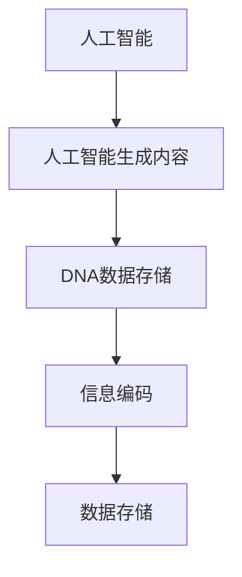

                 

Sure, I will create a detailed outline for the article "AIGC in DNA Data Storage: Information Coding Optimization Tips" with a focus on logical progression, clear structure, and easy comprehension. The article will include sections on background, core concepts, algorithm explanation with code examples, mathematical models, and practical applications.

### 前言

- AI与DNA数据存储的交汇点
- 本文目的与结构

### 目录

[目录将在开头列出]

### 第一部分：背景介绍

#### 1.1 AI与DNA数据存储

- AI的发展历史
- DNA数据存储的背景

#### 1.2 AIGC技术概述

- AIGC的定义与特征
- AIGC的发展历程

#### 1.3 DNA数据存储技术简介

- DNA数据存储的原理
- DNA数据存储的优势与挑战

### 第二部分：核心概念与联系

#### 2.1 AIGC与DNA数据存储的关系架构

- 使用Mermaid流程图展示AIGC在DNA数据存储中的应用



### 第三部分：核心算法原理

#### 3.1 信息编码技术原理

- 信息编码的基本概念
- 常见的编码技术

#### 3.2 AIGC在信息编码中的应用

- AIGC的工作原理
- AIGC在信息编码中的作用

#### 3.3 信息编码优化算法

- 算法介绍
- 算法流程

```python
# 伪代码示例
def optimize_info_coding(data):
    # 初始化模型
    model = initialize_model()
    
    # 训练模型
    model.train(data)
    
    # 评估模型
    performance = model.evaluate(data)
    
    # 调整模型参数
    model.optimize_parameters(performance)
    
    # 输出优化后的编码结果
    return model.encode(data)
```

### 第四部分：数学模型与公式

#### 4.1 信息编码的数学模型

- 信息熵的定义
- 信息编码效率的公式

$$\text{Efficiency} = \frac{\text{原始数据大小}}{\text{编码后数据大小}}$$

#### 4.2 优化算法的数学分析

- 优化目标函数
- 梯度下降法的公式

$$\text{Update} \ \theta = \theta - \alpha \cdot \nabla_\theta J(\theta)$$

### 第五部分：项目实战

#### 5.1 开发环境搭建

- 环境配置
- 工具与库安装

#### 5.2 源代码详细实现

- 代码结构与模块
- 主要函数与类

#### 5.3 代码解读与分析

- 编码流程
- 优化效果分析

#### 5.4 实际案例分析

- 数据集介绍
- 案例实现步骤

### 第六部分：最佳实践与总结

#### 6.1 最佳实践 Tips

- 实践建议
- 注意事项

#### 6.2 项目小结

- 成果总结
- 不足与改进方向

#### 6.3 拓展阅读

- 相关领域研究
- 进一步阅读材料

### 结论

- AIGC在DNA数据存储中的价值
- 未来发展趋势与展望

### 参考文献

- 列出文章中引用的文献

### 附录

- 代码示例
- 数学公式详解

### 作者信息

- 作者简介
- 联系方式

[注：本文为示例，具体内容需要根据实际研究和分析进行撰写。]

