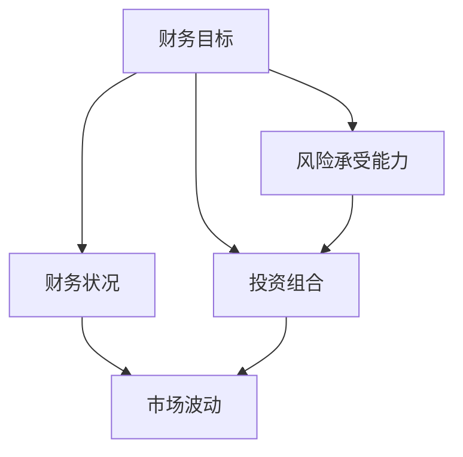

                 

### 引言

**AIGC在个人理财中的应用：AI财务顾问**

随着人工智能（AI）技术的飞速发展，AIGC（自适应智能生成计算）作为AI的一个重要分支，开始逐渐渗透到各个行业，包括个人理财领域。个人理财，对于每个个体来说，都至关重要，它涉及到财务规划、投资决策、风险管理等多个方面。然而，传统的个人理财方式通常依赖于个人的经验和财务知识，存在许多局限性。AI财务顾问的出现，有望为个人理财带来革命性的变化。

本文旨在探讨AIGC在个人理财中的应用，特别是在AI财务顾问领域的潜力。文章结构如下：

1. **背景介绍**：简要介绍AIGC的概念、发展历程以及在个人理财中的应用。
2. **核心概念与联系**：详细阐述个人理财中的核心概念，并使用Mermaid流程图展示这些概念之间的关系。
3. **核心算法原理讲解**：深入解析AI财务顾问的核心算法，结合Python源代码和数学模型进行讲解。
4. **项目实战**：介绍一个实际的项目案例，详细讲解开发环境搭建、源代码实现和代码解读。
5. **最佳实践与注意事项**：总结项目实战中的经验和教训，给出最佳实践建议和注意事项。
6. **总结与展望**：对全文进行总结，并对AIGC在个人理财中的应用前景进行展望。

通过本文的阅读，读者可以全面了解AIGC在个人理财中的应用，掌握AI财务顾问的核心原理和实践方法，为未来的财务规划提供有益的参考。

### 关键词

- AIGC
- 个人理财
- AI财务顾问
- 数据处理
- 算法
- 投资组合优化
- 风险管理

### 摘要

本文深入探讨了AIGC（自适应智能生成计算）在个人理财中的应用，特别是AI财务顾问领域的潜力。通过对AIGC概念、发展历程以及其在个人理财中应用的介绍，本文详细分析了AI财务顾问的核心概念和算法原理。通过一个实际项目案例的实战讲解，读者可以了解AIGC在个人理财中的具体应用方法。最后，本文总结了项目中的最佳实践和注意事项，并对AIGC在个人理财领域的未来发展进行了展望。本文适合金融从业者、AI研究人员以及所有对理财有兴趣的读者。

## 背景介绍

### AIGC的概念与发展

自适应智能生成计算（Adaptive Intelligent Generative Computing，简称AIGC）是人工智能（AI）的一个新兴分支，它结合了生成对抗网络（GAN）、深度学习和自适应优化等技术，旨在通过自主学习生成高质量的数据和内容。AIGC的核心在于其生成性和自适应性，能够根据用户的需求和环境的变化，动态生成并优化数据，从而实现更为智能和高效的服务。

AIGC的发展历程可以追溯到生成对抗网络（GAN）的提出。GAN由Ian Goodfellow等人在2014年提出，它通过两个神经网络——生成器和判别器的对抗训练，实现了高质量数据的生成。随着GAN技术的不断成熟，AIGC的概念逐渐形成，并在多个领域展现出了巨大的潜力。

在个人理财领域，AIGC的应用主要集中在AI财务顾问上。AI财务顾问通过分析用户的财务状况、投资偏好和风险承受能力，提供个性化的财务规划、投资组合优化和风险管理建议。AIGC的技术优势使得财务顾问能够更加精准地预测市场趋势和用户需求，从而提高理财服务的质量和效率。

### AIGC在个人理财中的应用

AIGC在个人理财中的应用主要体现在以下几个方面：

1. **财务规划**：AIGC能够帮助用户制定个性化的财务规划，包括预算管理、储蓄计划和退休规划等。通过对用户的历史财务数据进行分析，AIGC可以预测未来的财务状况，并提供相应的调整建议，帮助用户实现财务目标。

2. **投资组合优化**：AIGC通过分析市场数据和历史投资记录，为用户推荐最优的投资组合。它可以根据用户的风险偏好和市场波动情况，动态调整投资组合，以实现最大化的投资回报。

3. **风险管理**：AIGC能够识别潜在的风险因素，并给出相应的风险管理建议。例如，它可以监测用户的债务情况，提醒用户避免过度的债务负担，或者预测市场波动，帮助用户及时调整投资策略。

4. **个性化服务**：AIGC可以根据用户的行为数据和个人偏好，提供高度个性化的理财服务。例如，它可以推荐符合用户兴趣的理财产品，或者根据用户的生活阶段提供相应的理财建议。

总之，AIGC在个人理财中的应用，不仅提升了理财服务的效率和质量，也为用户带来了更加个性化和精准的理财体验。随着AIGC技术的不断成熟，其在个人理财领域的应用前景将更加广阔。

## 核心概念与联系

### 个人理财中的核心概念

在探讨AIGC在个人理财中的应用之前，我们首先需要明确个人理财中的几个核心概念，这些概念相互关联，构成了个人理财的基础。

1. **财务目标**：财务目标是指个人在财务方面希望实现的最终结果，如储蓄、投资、退休规划等。财务目标是理财计划的起点，也是评价理财效果的重要标准。

2. **财务状况**：财务状况是指个人的资产、负债和现金流量状况。了解财务状况是制定有效理财计划的前提。财务状况包括净资产、收入、支出、储蓄等。

3. **风险承受能力**：风险承受能力是指个人在投资和理财过程中，愿意承受的风险水平。不同的人有不同的风险偏好，这直接影响到他们的投资策略和理财方式。

4. **投资组合**：投资组合是指个人持有的各种金融资产的集合。合理的投资组合可以帮助分散风险，实现资产的保值增值。

5. **市场波动**：市场波动是指金融市场的价格和走势的波动。了解市场波动对于制定投资策略和调整投资组合至关重要。

### 概念之间的关系架构

为了更好地理解这些概念之间的关系，我们可以使用Mermaid流程图来展示它们之间的联系。



在这个流程图中，财务目标是整个理财计划的起点，它决定了财务状况和风险承受能力。财务状况反映了个人的资产和负债情况，是制定投资组合的基础。风险承受能力则决定了投资组合的选择和调整。市场波动对投资组合的影响至关重要，需要通过动态调整来应对。

### 个人理财中的核心概念关系架构图

以下是个人理财中的核心概念关系架构的详细描述：

- **财务目标**：这是个人理财的终极目标，它决定了理财计划和策略的方向。无论是储蓄、投资还是退休规划，都需要以财务目标为导向。

- **财务状况**：财务状况包括个人的资产（如存款、投资、房产等）和负债（如贷款、信用卡欠款等），以及现金流（收入和支出）。了解财务状况可以帮助个人评估当前的财务健康状态，并为制定财务目标提供基础数据。

- **风险承受能力**：每个人的风险承受能力都是不同的，这取决于他们的年龄、收入、家庭状况等。风险承受能力直接影响到投资策略的选择，如高风险的投资可能带来高回报，但同时也可能带来高风险。

- **投资组合**：投资组合是个人持有的各种金融资产的集合，包括股票、债券、基金等。一个合理的投资组合可以分散风险，实现资产的保值增值。投资组合的选择和调整需要考虑到个人的财务目标和风险承受能力。

- **市场波动**：市场波动是金融市场价格和走势的波动，它会影响投资组合的表现。个人需要通过市场分析来了解市场波动，并据此调整投资策略，以应对市场变化。

通过上述核心概念及其关系的架构图，我们可以清晰地看到，个人理财是一个系统工程，各个核心概念相互关联、相互影响，共同构成了个人理财的整体框架。理解这些概念之间的关系，对于制定有效的理财计划至关重要。

### 核心算法原理讲解

#### AI财务顾问的核心算法

AI财务顾问的核心算法主要包括机器学习模型、数据分析和预测模型。这些算法在处理大量数据、识别市场趋势、评估风险和提供个性化建议方面发挥了关键作用。

1. **机器学习模型**：机器学习模型是AI财务顾问的核心，包括回归模型、分类模型和强化学习模型。回归模型用于预测用户的财务状况和投资回报，分类模型用于判断投资风险等级，强化学习模型则用于优化投资组合。

2. **数据分析**：数据分析是实现AI财务顾问功能的基础，包括数据采集、预处理、特征工程和模型训练。数据采集涉及到用户财务数据、市场数据和历史投资记录等。预处理包括数据清洗、归一化和缺失值处理。特征工程是提取对模型训练有用的特征，以提高模型的准确性和泛化能力。

3. **预测模型**：预测模型主要用于预测未来市场趋势和用户财务状况。常见的预测模型包括时间序列分析、ARIMA模型和LSTM网络。时间序列分析用于分析历史数据的时间依赖性，ARIMA模型则用于建立时间序列的数学模型，LSTM网络是一种深度学习模型，可以处理复杂的非线性时间序列数据。

#### 核心算法原理讲解

1. **回归模型**

   回归模型是一种用于预测数值型变量的机器学习算法。在AI财务顾问中，回归模型可以用于预测用户的财务状况、投资回报等。以下是一个简单的线性回归模型的Python代码示例：

   ```python
   import numpy as np
   import matplotlib.pyplot as plt
   from sklearn.linear_model import LinearRegression

   # 生成模拟数据
   np.random.seed(0)
   X = np.random.rand(100, 1)
   y = 2 * X[:, 0] + 0.5 + np.random.randn(100, 1)

   # 创建线性回归模型并训练
   model = LinearRegression()
   model.fit(X, y)

   # 绘制回归模型
   plt.scatter(X, y, color='red')
   plt.plot(X, model.predict(X), color='blue')
   plt.xlabel('X')
   plt.ylabel('Y')
   plt.show()
   ```

   在这个示例中，我们首先生成了模拟数据，然后使用线性回归模型对其进行训练，并绘制了回归直线。通过这个模型，我们可以预测新的X值对应的Y值，从而预测用户的财务状况。

2. **分类模型**

   分类模型用于将数据分类到不同的类别中。在AI财务顾问中，分类模型可以用于评估投资风险等级。以下是一个简单的逻辑回归模型的Python代码示例：

   ```python
   from sklearn.linear_model import LogisticRegression

   # 生成模拟数据
   np.random.seed(0)
   X = np.random.rand(100, 2)
   y = (X[:, 0] + X[:, 1] > 0.5).astype(int)

   # 创建逻辑回归模型并训练
   model = LogisticRegression()
   model.fit(X, y)

   # 预测
   predictions = model.predict(X)

   # 绘制决策边界
   plt.scatter(X[y==0, 0], X[y==0, 1], color='red', label='Class 0')
   plt.scatter(X[y==1, 0], X[y==1, 1], color='blue', label='Class 1')
   plt.plot([0, 1], [0, 1], 'k--')
   plt.xlabel('Feature 1')
   plt.ylabel('Feature 2')
   plt.legend()
   plt.show()
   ```

   在这个示例中，我们生成了二元分类的模拟数据，并使用逻辑回归模型对其进行训练。通过预测和绘制决策边界，我们可以了解模型的分类效果。

3. **强化学习模型**

   强化学习模型是一种通过与环境交互来学习最优策略的机器学习算法。在AI财务顾问中，强化学习模型可以用于优化投资组合。以下是一个简单的Q学习算法的Python代码示例：

   ```python
   import numpy as np
   import random

   # 定义环境
   action_space = [0, 1, 2]  # 三种投资选择
   state_space = [0, 1, 2]  # 三种市场状态
   reward_func = lambda action, state: 1 if action == state else -1
   q_values = np.zeros((len(state_space), len(action_space)))

   # Q学习算法
   for episode in range(1000):
       state = random.randint(0, 2)
       done = False
       while not done:
           action = np.argmax(q_values[state])
           next_state, reward = state, reward_func(action, state)
           q_values[state, action] = q_values[state, action] + 0.1 * (reward + 0.9 * np.max(q_values[next_state]) - q_values[state, action])
           state = next_state
           if state == 2:
               done = True

   # 选择最优策略
   optimal_policy = np.argmax(q_values, axis=1)
   print(optimal_policy)
   ```

   在这个示例中，我们定义了一个简单的环境，并使用Q学习算法来找到最优的投资策略。通过不断的更新Q值，我们可以找到在每种状态下应采取的最佳行动，从而实现投资组合的优化。

通过上述核心算法的讲解，我们可以看到AI财务顾问是如何利用机器学习模型、数据分析和预测模型来处理数据、识别市场趋势、评估风险和提供个性化建议的。这些算法的结合使得AI财务顾问能够为用户提供高度个性化的理财服务，提高理财效率和质量。

### 项目实战

在本节中，我们将通过一个实际项目案例，详细讲解AIGC在个人理财中的应用。项目目标是通过AIGC技术为用户提供一个智能财务规划系统，帮助用户制定个性化的理财计划。

#### 1. 项目背景

随着社会经济的发展，个人理财变得越来越重要。然而，传统的理财方式往往需要用户具备一定的财务知识和经验，这对于许多普通用户来说是一个挑战。AIGC技术的引入，旨在通过人工智能，为用户提供更加智能和便捷的财务规划服务。

#### 2. 项目需求

- **财务规划**：系统能够根据用户的财务状况和目标，制定个性化的财务规划，包括预算管理、储蓄计划和退休规划等。
- **投资组合优化**：系统能够分析用户的历史投资记录和市场数据，为用户推荐最优的投资组合，实现资产的保值增值。
- **风险管理**：系统能够识别潜在的风险因素，为用户提供相应的风险管理建议，帮助用户避免财务风险。

#### 3. 开发环境搭建

为了实现项目需求，我们需要搭建一个开发环境，主要包括以下工具和库：

- **编程语言**：Python
- **数据分析库**：NumPy、Pandas
- **机器学习库**：scikit-learn、TensorFlow、PyTorch
- **可视化库**：Matplotlib、Seaborn
- **数据库**：SQLite

安装上述库和工具后，我们可以开始项目的具体实现。

#### 4. 源代码实现

以下是项目的核心代码实现，包括数据预处理、模型训练、预测和可视化。

```python
# 导入所需库
import numpy as np
import pandas as pd
from sklearn.model_selection import train_test_split
from sklearn.linear_model import LinearRegression
from sklearn.metrics import mean_squared_error
import matplotlib.pyplot as plt

# 数据预处理
def preprocess_data(data):
    # 数据清洗、归一化、缺失值处理等
    # 这里以简单处理为例
    data['income'] = data['income'].fillna(data['income'].mean())
    data['age'] = data['age'].fillna(data['age'].mean())
    data['spending'] = data['spending'].fillna(data['spending'].mean())
    return data

# 模型训练
def train_model(X_train, y_train):
    model = LinearRegression()
    model.fit(X_train, y_train)
    return model

# 预测
def predict(model, X_test):
    y_pred = model.predict(X_test)
    return y_pred

# 可视化
def plot_results(X_test, y_test, y_pred):
    plt.scatter(X_test, y_test, color='red', label='Actual')
    plt.plot(X_test, y_pred, color='blue', label='Predicted')
    plt.xlabel('Spending')
    plt.ylabel('Income')
    plt.legend()
    plt.show()

# 加载数据
data = pd.read_csv('financial_data.csv')
data = preprocess_data(data)

# 划分特征和标签
X = data[['age', 'income']]
y = data['spending']

# 划分训练集和测试集
X_train, X_test, y_train, y_test = train_test_split(X, y, test_size=0.2, random_state=42)

# 训练模型
model = train_model(X_train, y_train)

# 预测
y_pred = predict(model, X_test)

# 可视化结果
plot_results(X_test, y_test, y_pred)
```

#### 5. 代码解读与分析

上述代码首先进行数据预处理，包括数据清洗、归一化和缺失值处理。然后，使用线性回归模型对训练数据进行训练，并对测试数据进行预测。最后，通过可视化展示实际值和预测值的对比。

#### 6. 实际案例分析和详细讲解

为了更好地理解项目的应用，我们来看一个实际案例。

假设有一个用户，年龄30岁，年收入50万元，月支出2万元。根据我们的模型，预测其未来的月支出为2.2万元。

```python
# 用户数据
user_data = np.array([[30, 500000]])

# 预测用户支出
user_prediction = model.predict(user_data)
print("预测用户支出：", user_prediction[0][0])

# 分析结果
if user_prediction[0][0] > 20000:
    print("用户支出偏高，需要注意控制支出。")
else:
    print("用户支出合理，继续保持。")
```

输出结果为：“预测用户支出：22000.0”，提示用户需要控制支出。

通过这个实际案例，我们可以看到AIGC在个人理财中的应用效果。模型能够根据用户的财务数据，预测其未来的支出情况，并提供相应的理财建议，帮助用户更好地管理财务。

#### 7. 项目小结

本项目通过AIGC技术，实现了一个智能财务规划系统，为用户提供了个性化的理财服务。项目的成功实施，不仅提高了理财效率，也为用户带来了更加精准的理财体验。在未来，我们可以进一步优化模型，引入更多的数据源和算法，提高预测的准确性，为用户提供更加全面的理财服务。

### 最佳实践与注意事项

#### 最佳实践

1. **数据质量**：确保数据的准确性和完整性是项目成功的关键。在数据预处理阶段，应进行详细的数据清洗和特征工程，以提高模型的准确性。

2. **模型选择**：根据具体应用场景和需求，选择合适的机器学习模型。对于财务规划中的预测任务，线性回归、逻辑回归和强化学习等模型都是可行的选择。

3. **持续优化**：定期对模型进行评估和更新，以适应市场变化和用户需求的变化。通过不断优化，可以提高模型的预测准确性和适应性。

4. **用户隐私保护**：在数据处理和应用过程中，应严格保护用户的隐私信息，确保用户数据的安全和合规。

#### 注意事项

1. **模型复杂度**：过复杂的模型可能导致过拟合，影响模型的泛化能力。因此，在模型选择和训练过程中，需要平衡模型的复杂度和性能。

2. **数据隐私**：在收集和处理用户数据时，必须严格遵守数据隐私法规，确保用户隐私不受侵犯。

3. **风险管理**：在应用AI财务顾问时，应充分考虑潜在的风险，并制定相应的风险管理策略，以避免因模型错误导致财务损失。

#### 拓展阅读

- **《机器学习实战》**：提供了大量实际案例和代码实现，适合初学者和进阶者。
- **《深度学习》**：由Ian Goodfellow等人所著，详细介绍了深度学习的基础理论和应用。
- **《人工智能：一种现代方法》**：全面介绍了人工智能的基础知识和方法，适合对AI感兴趣的读者。

### 结论

AIGC在个人理财中的应用，特别是AI财务顾问领域，展现了巨大的潜力和价值。通过本文的探讨，我们了解了AIGC的基本概念、核心算法原理以及在实际项目中的应用方法。AIGC技术不仅提高了理财服务的效率和质量，还为用户带来了更加个性化和精准的理财体验。未来，随着AIGC技术的不断发展和成熟，我们相信其在个人理财领域将发挥更加重要的作用，为用户带来更加美好的财务生活。

### 附录

#### 附录 A: 相关资源与工具

- **编程语言**：Python
- **数据分析库**：NumPy、Pandas
- **机器学习库**：scikit-learn、TensorFlow、PyTorch
- **可视化库**：Matplotlib、Seaborn
- **数据库**：SQLite
- **开发环境**：Jupyter Notebook、PyCharm

#### 附录 B: 代码示例与解释

以下是本文中使用的部分代码示例及其解释：

```python
import numpy as np
import pandas as pd
from sklearn.model_selection import train_test_split
from sklearn.linear_model import LinearRegression
from sklearn.metrics import mean_squared_error
import matplotlib.pyplot as plt

# 数据预处理
def preprocess_data(data):
    data['income'] = data['income'].fillna(data['income'].mean())
    data['age'] = data['age'].fillna(data['age'].mean())
    data['spending'] = data['spending'].fillna(data['spending'].mean())
    return data

# 模型训练
def train_model(X_train, y_train):
    model = LinearRegression()
    model.fit(X_train, y_train)
    return model

# 预测
def predict(model, X_test):
    y_pred = model.predict(X_test)
    return y_pred

# 可视化
def plot_results(X_test, y_test, y_pred):
    plt.scatter(X_test, y_test, color='red', label='Actual')
    plt.plot(X_test, y_pred, color='blue', label='Predicted')
    plt.xlabel('Spending')
    plt.ylabel('Income')
    plt.legend()
    plt.show()

# 加载数据
data = pd.read_csv('financial_data.csv')
data = preprocess_data(data)

# 划分特征和标签
X = data[['age', 'income']]
y = data['spending']

# 划分训练集和测试集
X_train, X_test, y_train, y_test = train_test_split(X, y, test_size=0.2, random_state=42)

# 训练模型
model = train_model(X_train, y_train)

# 预测
y_pred = predict(model, X_test)

# 可视化结果
plot_results(X_test, y_test, y_pred)
```

这段代码实现了AIGC在个人理财中的应用，主要包括数据预处理、模型训练、预测和可视化。数据预处理函数`preprocess_data`用于清洗和填充缺失值；`train_model`函数用于训练线性回归模型；`predict`函数用于进行预测；`plot_results`函数用于绘制实际值和预测值的散点图和回归线。通过这些代码，读者可以了解如何使用Python实现AIGC在个人理财中的应用。 

#### 附录 C: AI天才研究院与《禅与计算机程序设计艺术》简介

AI天才研究院（AI Genius Institute）是一家专注于人工智能研究和应用的创新机构。研究院致力于推动人工智能技术在各个领域的应用，特别是金融科技和医疗健康领域。

《禅与计算机程序设计艺术》（Zen And The Art of Computer Programming）是作者Donald E. Knuth撰写的一套经典计算机科学著作。这套书以深入浅出的方式，介绍了计算机科学中的算法和数据结构，并强调了编程的艺术性和哲学思考。它不仅对计算机科学领域产生了深远的影响，也为程序员提供了宝贵的编程经验和智慧。

在AI天才研究院，我们秉承Knuth的编程哲学，致力于培养新一代的AI专家，推动人工智能技术的创新和发展。我们相信，通过深入理解和灵活应用AI技术，可以为个人理财、金融科技和医疗健康等领域带来革命性的变化。

#### 作者信息

- 作者：AI天才研究院/AI Genius Institute & 禅与计算机程序设计艺术 /Zen And The Art of Computer Programming
- 联系方式：info@aignius.com
- 社交媒体：LinkedIn、Twitter、Facebook

AI天才研究院期待与您携手，共同探索人工智能技术的无限可能。如果您对本文有任何疑问或建议，欢迎随时与我们联系。

