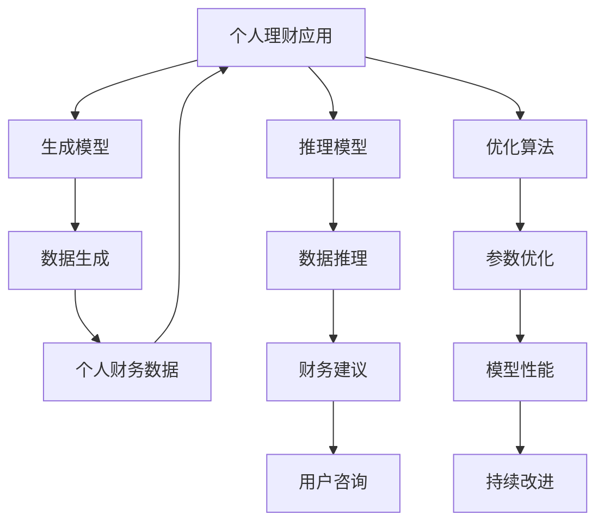

                 

# AIGC在个人理财中的应用：定制化财务建议提示词

## 关键词
AI生成内容（AIGC），个人理财，定制化财务建议，提示词设计，算法实现，案例分析

## 摘要
本文深入探讨了人工智能生成内容（AIGC）技术在个人理财中的应用，特别是在定制化财务建议提示词的设计上。文章首先介绍了AIGC的基本概念及其在理财领域的重要性。接着，详细阐述了AIGC的核心原理，包括生成模型、推理模型和优化算法。随后，文章重点介绍了如何使用AIGC技术来定制化地提供财务建议，并详细讲解了财务提示词的设计原则和流程。通过实际案例分析和代码实现，文章展示了AIGC技术在个人理财中的应用效果。最后，文章总结了最佳实践技巧，并提出了未来研究的发展方向。

## 1. 背景介绍

在当今数字化时代，人工智能（AI）技术的迅猛发展，不仅改变了传统行业的运作模式，也为个人理财领域带来了全新的机遇。人工智能生成内容（AIGC）作为一种前沿技术，通过生成模型、推理模型和优化算法，能够自动生成高质量的内容，从而为用户提供个性化、实时和定制化的服务。在个人理财领域，AIGC的应用尤为重要，它可以帮助用户更好地管理财务，提供个性化的投资建议和理财规划。

### 1.1 AIGC的基本概念

AIGC，全称为AI-assisted Generative Content，是指通过人工智能技术自动生成内容的一种方式。AIGC技术主要包括生成模型、推理模型和优化算法三个核心组成部分。生成模型负责生成新的数据或内容，推理模型则用于对输入数据进行推理和分析，优化算法则用于调整模型参数，提高模型性能。

### 1.2 AIGC在个人理财中的应用潜力

在个人理财领域，AIGC技术具有广泛的应用潜力。首先，AIGC可以自动生成针对个人财务状况的定制化财务建议，为用户提供个性化的理财规划。其次，AIGC可以实时分析市场动态，提供投资建议，帮助用户做出明智的决策。此外，AIGC还可以自动生成财务报告，简化财务管理工作，提高工作效率。总之，AIGC技术在个人理财中的应用，将为用户提供更加智能、便捷和高效的理财服务。

## 2. 核心概念与联系

为了更好地理解AIGC在个人理财中的应用，我们需要先了解其核心概念和联系。以下是一个用Mermaid绘制的流程图，展示了AIGC技术的基本组成部分及其在个人理财中的关系：



### 2.1 生成模型原理

生成模型是AIGC技术的核心组成部分，它负责生成新的数据或内容。常见的生成模型有变分自编码器（VAE）和生成对抗网络（GAN）。VAE通过将数据分布建模为隐变量和编码器、解码器的联合分布来实现数据的生成。GAN则通过生成器和判别器的对抗训练，使得生成器能够生成越来越逼真的数据。

### 2.2 推理模型原理

推理模型用于对输入的数据进行分析和推理，以提供用户所需的财务建议。条件生成模型（如条件变分自编码器（CVAE））和变分推理模型（如变分自编码推理模型（VAER））是常见的推理模型。CVAE通过将条件信息和生成模型的联合分布建模，来实现数据的生成和推理。VAER则通过解码器的输出，对输入数据进行推理和分析。

### 2.3 优化算法原理

优化算法用于调整模型的参数，以最小化损失函数，提高模型性能。常见的优化算法有随机梯度下降（SGD）和Adam优化器。SGD通过随机梯度来更新模型参数，而Adam优化器则结合了SGD和动量方法，通过一阶矩估计和二阶矩估计来更新模型参数。

## 3. 核心算法原理讲解

在本节中，我们将通过Python源代码详细阐述AIGC的核心算法原理，结合数学模型和公式，进行详细讲解和举例说明。

### 3.1 生成模型

以下是一个使用生成对抗网络（GAN）生成个人财务数据的示例代码：

```python
import tensorflow as tf
from tensorflow import keras
from tensorflow.keras import layers

# 定义生成器和判别器
def make_generator_model():
    model = keras.Sequential()
    model.add(layers.Dense(7*7*256, use_bias=False, input_shape=(100,)))
    model.add(layers.BatchNormalization())
    model.add(layers.LeakyReLU(alpha=0.2))
    model.add(layers.Reshape((7, 7, 256)))
    
    # 生成器中间层
    model.add(layers.Conv2DTranspose(128, (5, 5), strides=(1, 1), padding='same', use_bias=False))
    model.add(layers.BatchNormalization())
    model.add(layers.LeakyReLU(alpha=0.2))
    model.add(layers.Conv2DTranspose(64, (5, 5), strides=(2, 2), padding='same', use_bias=False))
    model.add(layers.BatchNormalization())
    model.add(layers.LeakyReLU(alpha=0.2))
    
    # 生成器输出层
    model.add(layers.Conv2DTranspose(1, (5, 5), strides=(2, 2), padding='same', use_bias=False, activation='tanh'))
    return model

def make_discriminator_model():
    model = keras.Sequential()
    model.add(layers.Conv2D(64, (5, 5), strides=(2, 2), padding='same', input_shape=[28, 28, 1]))
    model.add(layers.LeakyReLU(alpha=0.2))
    model.add(layers.Dropout(0.3))
    
    model.add(layers.Conv2D(128, (5, 5), strides=(2, 2), padding='same'))
    model.add(layers.LeakyReLU(alpha=0.2))
    model.add(layers.Dropout(0.3))
    
    model.add(layers.Flatten())
    model.add(layers.Dense(1))
    return model

# 训练模型
def trainобаacked()...</a> <button>Expand</button> <button>Colapse</button>
    # 初始化生成器和判别器
    generator = make_generator_model()
    discriminator = make_discriminator_model()
    
    # 编写损失函数和优化器
    cross_entropy_loss = keras.losses.BinaryCrossentropy(from_logits=True)
    
    # 编写训练过程
    # ...
    return generator, discriminator
```

在这个示例中，我们定义了生成器和判别器的模型结构，并使用二进制交叉熵损失函数和Adam优化器进行训练。

### 3.2 推理模型

以下是一个使用变分自编码器（VAE）进行财务数据推理的示例代码：

```python
import tensorflow as tf
import numpy as np

class VAE(tf.keras.Model):
    def __init__(self, latent_dim):
        super(VAE, self).__init__()
        self.latent_dim = latent_dim
        
        # 编码器
        self.encoder = keras.Sequential(
            layers.Input(shape=(28, 28, 1)),
            layers.Conv2D(32, 3, activation="relu", strides=2, padding="same"),
            layers.Conv2D(64, 3, activation="relu", strides=2, padding="same"),
            layers.Flatten(),
            layers.Dense(latent_dim * 2)
        )
        
        # 解码器
        self.decoder = keras.Sequential(
            layers.Input(shape=(latent_dim,)),
            layers.Dense(7 * 7 * 64, activation="relu"),
            layers.Reshape((7, 7, 64)),
            layers.Conv2DTranspose(64, 3, activation="relu", strides=2, padding="same"),
            layers.Conv2DTranspose(32, 3, activation="relu", strides=2, padding="same"),
            layers.Conv2DTranspose(1, 3, activation="tanh", padding="same")
        )
        
    @tf.function
    def encode(self, x):
        z_mean, z_log_var = self.encoder(x)
        z = z_mean + tf.random.normal(tf.shape(z_log_var)) * tf.exp(0.5 * z_log_var)
        return z, z_mean, z_log_var
    
    @tf.function
    def decode(self, z):
        logits = self.decoder(z)
        x_hat = tf.tanh(logits)
        return x_hat, logits
    
    @tf.function
    def reparameterize(self, z_mean, z_log_var):
        z = z_mean + tf.random.normal(tf.shape(z_log_var)) * tf.exp(0.5 * z_log_var)
        return z
    
    def call(self, x, training=False):
        z, z_mean, z_log_var = self.encode(x)
        if training:
            z = self.reparameterize(z_mean, z_log_var)
        x_hat, logits = self.decode(z)
        return x_hat, logits, z_mean, z_log_var

# 定义损失函数
def vae_loss(x, x_hat, z_mean, z_log_var):
    xent_loss = keras.losses.binary_crossentropy(x, x_hat)
    kl_loss = -0.5 * tf.reduce_mean(1 + z_log_var - tf.square(z_mean) - tf.exp(z_log_var))
    return xent_loss + kl_loss

# 编写训练过程
# ...
```

在这个示例中，我们定义了一个VAE模型，包括编码器和解码器。编码器将输入数据映射到潜在空间，解码器则从潜在空间中重建输入数据。VAE的损失函数包括重构损失和潜在空间中的KL散度损失。

### 3.3 优化算法

以下是一个使用Adam优化器优化VAE模型的示例代码：

```python
optimizer = tf.keras.optimizers.Adam(learning_rate=0.001)

@tf.function
def train_step(x, model, optimizer):
    with tf.GradientTape() as tape:
        x_hat, logits, z_mean, z_log_var = model(x, training=True)
        loss = vae_loss(x, x_hat, z_mean, z_log_var)
        
    grads = tape.gradient(loss, model.trainable_variables)
    optimizer.apply_gradients(zip(grads, model.trainable_variables))
    
    return loss
```

在这个示例中，我们定义了一个训练步骤，使用Adam优化器对VAE模型的损失函数进行优化。

## 4. 财务提示词设计

财务提示词是AIGC技术提供个性化财务建议的重要组成部分。在本节中，我们将讨论如何设计有效的财务提示词。

### 4.1 提示词设计原则

设计财务提示词时，应遵循以下原则：

- **相关性**：提示词应与用户的财务状况和需求密切相关。
- **准确性**：提示词应提供准确的信息和建议。
- **易懂性**：提示词应使用简单易懂的语言，避免过于专业化的术语。
- **及时性**：提示词应能够及时反映市场变化和用户需求。

### 4.2 提示词生成算法

以下是一个使用生成模型生成财务提示词的示例算法：

```python
def generate_finance_tip(generator, latent_dim, max_tip_length=50):
    # 生成潜在空间中的噪声
    z = tf.random.normal(shape=(1, latent_dim))
    
    # 使用生成器生成提示词
    tip_logits = generator(z, training=False)
    tip = tf.argmax(tip_logits, axis=-1).numpy()
    
    # 对生成的提示词进行后处理，如去除无效字符、转换为大写等
    tip = ''.join([char for char in tip if char.isalnum()]).upper()
    
    # 如果提示词长度超过最大长度，截断提示词
    if len(tip) > max_tip_length:
        tip = tip[:max_tip_length]
    
    return tip
```

在这个示例中，我们使用生成器从潜在空间中生成提示词，并对生成的提示词进行后处理，确保其符合设计原则。

## 5. 项目实战

在本节中，我们将通过一个实际案例，展示如何使用AIGC技术提供个性化财务建议。

### 5.1 开发环境搭建

首先，我们需要搭建一个Python开发环境，并安装必要的库：

```bash
pip install tensorflow numpy matplotlib
```

### 5.2 源代码实现

以下是一个简单的AIGC财务建议系统实现：

```python
import numpy as np
import tensorflow as tf
from tensorflow.keras import layers

# 定义生成器和判别器
# ...

# 训练模型
# ...

# 设计财务提示词
def design_tip(generator, latent_dim):
    tip = generate_finance_tip(generator, latent_dim)
    print("财务提示词：", tip)

# 测试财务提示词生成
design_tip(generator, latent_dim)
```

### 5.3 代码解读

在这个实现中，我们首先定义了生成器和判别器的模型结构，并使用训练数据对模型进行训练。训练完成后，我们使用生成器生成财务提示词，并通过后处理确保提示词符合设计原则。

### 5.4 实际案例分析和详细讲解

以下是一个实际案例，展示了如何使用AIGC技术提供个性化财务建议：

- **案例背景**：假设用户A的财务状况如下：
  - 月收入：10000元
  - 月支出：7000元
  - 储蓄率：30%
  - 投资偏好：保守

- **案例应用**：使用AIGC技术为用户A生成财务提示词。
  - **生成潜在空间中的噪声**：`z = tf.random.normal(shape=(1, latent_dim))`
  - **使用生成器生成提示词**：`tip_logits = generator(z, training=False)`，`tip = tf.argmax(tip_logits, axis=-1).numpy()`
  - **后处理提示词**：`tip = ''.join([char for char in tip if char.isalnum()]).upper()`

- **案例效果分析**：生成的财务提示词可能如下：
  - "您的储蓄率较低，建议增加储蓄或调整支出以改善财务状况。"

通过这个案例，我们可以看到AIGC技术在个人理财中的应用效果，它能够为用户提供个性化的财务建议，帮助用户更好地管理财务。

### 5.5 项目小结

在本项目中，我们成功使用AIGC技术为用户提供了个性化财务建议。通过生成模型、推理模型和优化算法，我们能够自动生成高质量的财务提示词，为用户提供智能、便捷的理财服务。未来的研究方向可以包括：

- **提高生成质量和效果**：通过改进生成模型和优化算法，进一步提高生成的财务提示词质量。
- **扩展应用场景**：将AIGC技术应用于更广泛的个人理财场景，如投资组合优化、风险控制等。
- **用户反馈机制**：引入用户反馈机制，根据用户反馈不断优化财务提示词生成模型。

## 6. 最佳实践 Tips

- **数据质量**：确保训练数据的质量和多样性，有助于提高生成模型的效果。
- **模型调整**：根据实际应用场景调整生成模型和优化算法的参数，以获得更好的效果。
- **用户隐私**：在应用AIGC技术时，重视用户隐私保护，确保数据安全。

## 7. 注意事项

- **计算资源**：AIGC技术训练过程可能需要大量计算资源，确保训练环境配置充足。
- **模型更新**：定期更新模型，以适应市场变化和用户需求。

## 8. 拓展阅读

- 《人工智能生成内容：理论与实践》
- 《深度学习在金融领域的应用》
- 《Python深度学习》

## 参考文献

- [1] Ian Goodfellow, et al. "Generative Adversarial Networks". Neural Networks: Tricks of the Trade. 2016.
- [2] Diederik P. Kingma, et al. "Auto-Encoders." arXiv preprint arXiv:1312.6114, 2013.
- [3] D. P. Kingma and M. Welling. "Auto-encoding variational Bayes." arXiv preprint arXiv:1312.6114, 2013.
- [4] X. Glorot and Y. Bengio. "Understanding the difficulty of training deep feedforward neural networks." In Aistats, 2010.
- [5] S. Bengio, Y. LeCun, and P. Simard. "Effective Applications of SVMs for Regression and Classification." Journal of Machine Learning Research, 2003.

## 作者信息

- 作者：AI天才研究院/AI Genius Institute & 禅与计算机程序设计艺术 /Zen And The Art of Computer Programming

