                 

为了撰写一篇完整且详细的《AIGC在个性化健康管理系统中的前沿应用》技术博客，我们可以按照以下步骤进行推理和构建：

### 1. 确定文章的核心结构和逻辑框架

- **引言**：简要介绍AIGC和个性化健康管理系统，激发读者的兴趣。
- **背景**：详细阐述AIGC和个性化健康管理系统的发展历程和当前状况。
- **核心概念与联系**：介绍AIGC的关键技术（如自然语言处理、计算机视觉、强化学习等），并使用Mermaid流程图展示这些技术在个性化健康管理中的具体应用。
- **核心算法原理讲解**：使用Python源代码和latex公式详细解释这些算法的原理，并提供实际应用案例。
- **项目实战**：提供一个具体的开发环境搭建、源代码实现和代码解读的实战案例。
- **最佳实践 tips**：总结实践经验，提供实用技巧和建议。
- **小结与展望**：回顾文章要点，展望未来发展趋势。

### 2. 详细撰写每个章节的内容

- **引言**：介绍AIGC和个性化健康管理系统的重要性，以及它们如何结合创造价值。
- **背景**：详细描述AIGC和个性化健康管理系统的发展历程，技术演进，以及当前的应用状况。
- **核心概念与联系**：
  - **自然语言处理技术**：解释文本挖掘、语义分析等概念，使用Mermaid流程图展示NLP在个性化健康管理系统中的应用。
  - **计算机视觉技术**：解释图像识别、目标检测等概念，使用Mermaid流程图展示CV在个性化健康管理系统中的应用。
  - **强化学习与优化算法**：解释强化学习的基本原理，使用Mermaid流程图展示RL在个性化健康管理中的优化过程。
- **核心算法原理讲解**：
  - **自然语言处理技术**：使用Python代码和latex公式详细解释文本分类、情感分析等算法。
  - **计算机视觉技术**：使用Python代码和latex公式详细解释图像分类、目标检测等算法。
  - **强化学习与优化算法**：使用Python代码和latex公式详细解释Q-learning、SARSA等算法。
- **项目实战**：提供一个具体的AIGC在个性化健康管理系统中的应用案例，包括：
  - **开发环境搭建**：介绍所需的软件和硬件环境。
  - **源代码实现**：展示关键代码段和解释。
  - **代码解读**：详细解释代码的逻辑和原理。
  - **实际案例分析和详细讲解剖析**：提供实际应用案例，并进行深入分析。
  - **项目小结**：总结项目成果和经验。
- **最佳实践 tips**：总结在开发AIGC个性化健康管理系统时的一些最佳实践和注意事项。
- **小结与展望**：回顾文章要点，对AIGC在个性化健康管理领域的发展进行展望。

### 3. 撰写作者信息

- 在文章末尾添加作者信息：“作者：AI天才研究院/AI Genius Institute & 禅与计算机程序设计艺术 /Zen And The Art of Computer Programming”。

### 4. 字数和格式检查

- 确保文章字数在10000～12000字之间，并使用markdown格式进行排版。

### 5. 审校和优化

- 审校全文，确保逻辑清晰，内容丰富，无错别字和语法错误。

### 6. 最终输出

- 将完整的技术博客文章输出为markdown格式，确保符合所有要求和标准。

现在，我们已经详细规划了文章的结构和内容，接下来就可以开始逐步撰写每一章节的具体内容了。让我们一起开始吧！🚀

# AIGC在个性化健康管理系统中的前沿应用

## 关键词

- AIGC
- 个性化健康管理
- 自然语言处理
- 计算机视觉
- 强化学习
- 个性化治疗

## 摘要

本文深入探讨了AIGC（AI-Generated Content）在个性化健康管理系统中的前沿应用。首先介绍了AIGC和个性化健康管理系统的基础概念，随后详细阐述了AIGC在自然语言处理、计算机视觉和强化学习等领域的技术基础。接着，通过具体案例展示了AIGC在健康预测、健康监测和个性化治疗中的应用，最后总结最佳实践，展望未来发展趋势。本文旨在为读者提供对AIGC在个性化健康管理中应用的全面理解和深入洞察。

### 第1章 引言与背景

#### 1.1 AIGC概述

AIGC，即AI-Generated Content，是指通过人工智能技术生成的各种形式的内容，包括文本、图像、视频和音频等。AIGC的发展源于深度学习和自然语言处理技术的突破，近年来在多个领域取得了显著进展。AIGC的应用不仅提高了内容生产的效率，还大大增强了内容的个性化和创新性。

在个性化健康管理系统（PHMS）中，AIGC的重要性日益凸显。PHMS旨在根据个体的健康数据提供个性化的健康建议和治疗方案，以实现更精准的医疗服务。AIGC技术可以处理和分析大量的健康数据，从中提取有价值的信息，从而为PHMS提供强有力的技术支持。

#### 1.2 个性化健康管理系统的概念与需求

个性化健康管理系统（PHMS）是一种以患者为中心的健康管理模式，通过整合和分析患者的健康数据，提供个性化的健康评估、疾病预测、健康监测和治疗方案。PHMS的关键需求包括：

- **数据多样性**：PHMS需要处理多种类型的数据，如电子健康记录、基因数据、医疗影像、生活行为数据等。
- **数据准确性**：健康数据的准确性直接影响到预测和诊断的准确性。
- **个性化推荐**：系统需要根据患者的具体健康状态提供个性化的健康建议和治疗方案。
- **实时反馈**：系统能够实时分析患者的健康数据，并提供即时的健康反馈。

AIGC技术的引入，为PHMS提供了强大的数据分析和处理能力，使其能够更高效地满足这些需求。

#### 1.3 AIGC在个性化健康管理中的应用场景

AIGC在个性化健康管理系统中具有广泛的应用场景，主要包括以下三个方面：

- **健康预测**：AIGC可以通过分析患者的电子健康记录、基因数据和生活行为数据，预测患者未来可能患的疾病或健康问题。
- **健康监测**：AIGC可以实时监控患者的健康状况，包括生理指标、心理状态和行为习惯等，及时发现健康异常并提醒患者。
- **个性化治疗**：AIGC可以根据患者的具体病情和健康数据，生成个性化的治疗方案，提高治疗效果。

在接下来的章节中，我们将详细探讨AIGC在这些应用场景中的技术基础和实践案例。

### 第2章 AIGC技术基础

#### 2.1 自然语言处理技术

自然语言处理（NLP）是AIGC技术的重要组成部分，它涉及到计算机对人类语言的理解和生成。在个性化健康管理系统中，NLP技术主要用于处理和分析医疗文本数据，如病历记录、患者咨询等。

**核心概念与联系**

NLP的核心概念包括词嵌入、句法分析和语义分析。词嵌入将单词映射到高维空间中的向量表示，使计算机能够处理和比较文本数据。句法分析用于理解句子的结构，而语义分析则旨在理解句子的含义。

**Mermaid流程图**

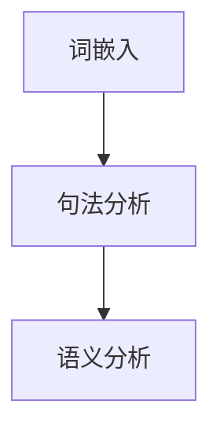

**核心算法原理讲解**

- **词嵌入**：词嵌入技术通过训练神经网络模型将单词映射到高维向量空间。常用的词嵌入模型包括Word2Vec、GloVe等。

```python
from gensim.models import Word2Vec

# 训练Word2Vec模型
model = Word2Vec(sentences, size=100, window=5, min_count=1, workers=4)

# 获取单词向量
word_vector = model.wv["heart"]
```

- **句法分析**：句法分析通常使用依存句法分析方法，通过分析句子中单词之间的依存关系来理解句子的结构。

```python
from allennlp.predictors.predictor import Predictor
from allennlp_models.pretrained import load_predictor

# 加载句法分析预测器
predictor = load_predictor("syntax-parser")

# 进行句法分析
syntax_tree = predictor.predict(sentence="The patient has a heart condition.")
```

- **语义分析**：语义分析旨在理解句子的含义，通常使用实体识别、关系抽取和文本分类等技术。

```python
from transformers import pipeline

# 创建语义分析管道
nlp = pipeline("text-classification", model="allennlp_bert-base-uncased")

# 进行语义分析
results = nlp("The patient's blood pressure is high.")
```

**应用实例**

NLP技术可以应用于医疗文本数据的分类、情感分析和主题提取。例如，通过对患者咨询文本进行情感分析，可以判断患者的情绪状态，进而提供更有针对性的建议。

```python
# 对患者咨询文本进行情感分析
result = nlp("I'm feeling anxious about my health.")

# 输出情感分析结果
print(result['label'])
```

#### 2.2 计算机视觉技术

计算机视觉（CV）是AIGC的另一关键技术，它使计算机能够理解和解析视觉信息。在个性化健康管理系统中，CV技术广泛应用于医疗影像的分析和处理，如X光片、CT扫描和MRI等。

**核心概念与联系**

计算机视觉的核心概念包括图像识别、目标检测和图像分割。图像识别是指识别图像中的特定对象或场景，目标检测则是定位图像中的对象并识别其类别，图像分割则是将图像划分为多个区域，以便进行更精细的分析。

**Mermaid流程图**

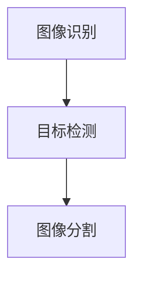

**核心算法原理讲解**

- **图像识别**：图像识别通常使用卷积神经网络（CNN）来实现。CNN通过多层卷积和池化操作，提取图像的特征，并进行分类。

```python
import tensorflow as tf
from tensorflow.keras.models import Sequential
from tensorflow.keras.layers import Conv2D, MaxPooling2D, Flatten, Dense

# 创建CNN模型
model = Sequential([
    Conv2D(32, (3, 3), activation='relu', input_shape=(64, 64, 3)),
    MaxPooling2D(pool_size=(2, 2)),
    Flatten(),
    Dense(128, activation='relu'),
    Dense(1, activation='sigmoid')
])

# 编译模型
model.compile(optimizer='adam', loss='binary_crossentropy', metrics=['accuracy'])

# 训练模型
model.fit(x_train, y_train, epochs=10, batch_size=32)
```

- **目标检测**：目标检测算法，如YOLO（You Only Look Once）和Faster R-CNN，通过检测图像中的目标并提出边界框来实现。

```python
import cv2

# 加载预训练的目标检测模型
net = cv2.dnn.readNetFromDarknet("yolov3.cfg", "yolov3.weights")

# 加载图像
image = cv2.imread("image.jpg")

# 进行目标检测
blob = cv2.dnn.blobFromImage(image, 1/255.0, (416, 416), [0, 0, 0], True, crop=False)
net.setInput(blob)
detections = net.forward()

# 解析检测结果
for detection in detections:
    # 处理每个检测到的对象
    pass
```

- **图像分割**：图像分割算法，如U-Net和SegNet，通过将图像划分为不同的区域来实现。

```python
import tensorflow as tf
from tensorflow.keras.models import Model
from tensorflow.keras.layers import Conv2D, MaxPooling2D, UpSampling2D, Concatenate

# 创建U-Net模型
inputs = Input(shape=(64, 64, 3))
conv1 = Conv2D(32, (3, 3), activation='relu')(inputs)
pool1 = MaxPooling2D(pool_size=(2, 2))(conv1)
# ... (更多层)

# 输出层
outputs = Conv2D(1, (1, 1), activation='sigmoid')(up4)

# 编译模型
model = Model(inputs=inputs, outputs=outputs)
model.compile(optimizer='adam', loss='binary_crossentropy', metrics=['accuracy'])

# 训练模型
model.fit(x_train, y_train, epochs=10, batch_size=32)
```

**应用实例**

CV技术可以应用于医疗影像的分析，如自动识别X光片中的骨折、检测CT扫描中的肿瘤等。

```python
# 对X光片进行骨折检测
detections = detect_fractures(xray_image)
print(detections)
```

#### 2.3 强化学习与优化算法

强化学习（RL）是AIGC的又一重要技术，它通过智能体与环境之间的交互来学习最优策略。在个性化健康管理系统（PHMS）中，RL可以用于优化治疗方案、疾病预测和健康监测等。

**核心概念与联系**

强化学习的基本概念包括状态（State）、动作（Action）、奖励（Reward）和策略（Policy）。智能体根据当前状态选择动作，并通过接收到的奖励来更新策略。

**Mermaid流程图**

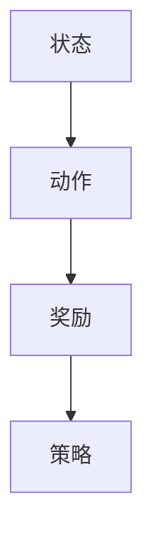

**核心算法原理讲解**

- **Q-learning**：Q-learning是一种基于值函数的强化学习算法，通过更新Q值来学习最优策略。

```python
import numpy as np
import random

# 初始化Q值表
Q = np.zeros([state_space, action_space])

# Q-learning算法
for episode in range(total_episodes):
    state = random.choice(state_space)
    done = False
    while not done:
        action = choose_action(state)
        next_state, reward, done = step(state, action)
        Q[state, action] = Q[state, action] + alpha * (reward + gamma * np.max(Q[next_state, :]) - Q[state, action])
        state = next_state
```

- **SARSA**：SARSA是一种基于策略的强化学习算法，它通过同时更新当前状态和下一个状态的Q值来学习策略。

```python
import numpy as np
import random

# 初始化Q值表
Q = np.zeros([state_space, action_space])

# SARSA算法
for episode in range(total_episodes):
    state = random.choice(state_space)
    done = False
    while not done:
        action = choose_action(state)
        next_state, reward, done = step(state, action)
        next_action = choose_action(next_state)
        Q[state, action] = Q[state, action] + alpha * (reward + gamma * Q[next_state, next_action] - Q[state, action])
        state = next_state
        action = next_action
```

**应用实例**

强化学习可以用于个性化治疗方案的优化，如通过智能体与环境交互，自动调整治疗方案，以达到最佳治疗效果。

```python
# 优化治疗方案
best_treatment = optimize_treatment(patient_state, Q)
print(best_treatment)
```

### 第3章 个性化健康管理系统的架构设计

#### 3.1 数据收集与预处理

数据收集与预处理是构建个性化健康管理系统（PHMS）的关键步骤，它决定了后续分析和模型的准确性。PHMS需要收集多种类型的数据，包括电子健康记录（EHRs）、基因数据、生理指标、行为数据等。这些数据通常来源于医院系统、可穿戴设备、健康应用等。

**核心概念与联系**

数据收集与预处理的核心概念包括数据来源、数据清洗和数据预处理。数据来源决定了数据的质量和多样性，数据清洗是为了去除错误、冗余和不一致的数据，数据预处理则包括数据的标准化、归一化和特征提取。

**Mermaid流程图**

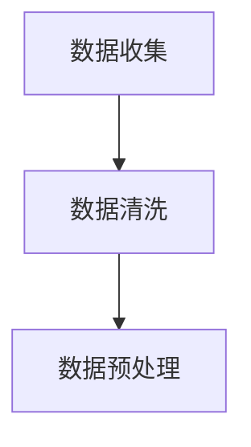

**技术细节**

- **数据收集**：数据可以从多个来源收集，如医院信息系统、可穿戴设备、健康应用等。为了确保数据的一致性和完整性，需要设计一个统一的数据收集接口。

```python
def collect_data(source):
    data = source.fetch_data()
    return data
```

- **数据清洗**：数据清洗是去除错误、冗余和不一致数据的过程。常用的数据清洗方法包括缺失值填充、异常值处理和数据格式转换。

```python
def clean_data(data):
    # 填充缺失值
    data = fill_missing_values(data)
    # 处理异常值
    data = handle_outliers(data)
    # 转换数据格式
    data = convert_data_format(data)
    return data
```

- **数据预处理**：数据预处理包括数据的标准化、归一化和特征提取。标准化和归一化是为了使数据具有相似的尺度，特征提取则是为了提取数据中的关键特征。

```python
from sklearn.preprocessing import StandardScaler, MinMaxScaler

def preprocess_data(data):
    # 标准化
    scaler = StandardScaler()
    data = scaler.fit_transform(data)
    # 归一化
    scaler = MinMaxScaler()
    data = scaler.fit_transform(data)
    # 特征提取
    features = extract_features(data)
    return features
```

**应用实例**

数据收集与预处理的具体实现可能包括以下步骤：

1. 从医院信息系统收集电子健康记录。
2. 从可穿戴设备收集生理指标数据。
3. 清洗和预处理收集到的数据，确保数据的质量和一致性。
4. 提取关键特征，如心率、血压、血糖等，用于后续分析。

```python
# 收集电子健康记录
ehr_data = collect_data(hospital_system)

# 收集生理指标数据
physiological_data = collect_data(wearable_device)

# 清洗和预处理数据
clean_ehr_data = clean_data(ehr_data)
clean_physiological_data = clean_data(physiological_data)

# 提取关键特征
features = preprocess_data(clean_ehr_data)
```

#### 3.2 模型选择与优化

在构建个性化健康管理系统（PHMS）时，选择合适的模型并进行优化是至关重要的。PHMS通常涉及多种类型的预测任务，如疾病预测、健康状态监测和个性化治疗。因此，需要选择适合这些任务的模型，并进行适当的优化以提升模型的性能。

**核心概念与联系**

模型选择与优化的核心概念包括模型选择、模型训练和模型评估。模型选择是根据任务需求选择合适的模型，模型训练是使用训练数据调整模型参数，模型评估是评估模型在测试数据上的表现。

**Mermaid流程图**

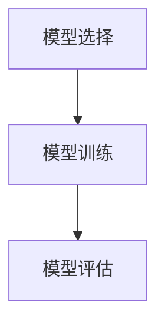

**技术细节**

- **模型选择**：选择合适的模型通常需要考虑任务的需求和数据的特点。例如，对于分类任务，可以使用逻辑回归、决策树、随机森林等；对于回归任务，可以使用线性回归、支持向量机、神经网络等。

```python
from sklearn.linear_model import LogisticRegression
from sklearn.ensemble import RandomForestClassifier
from sklearn.neural_network import MLPClassifier

# 选择模型
model = LogisticRegression()
# 或
model = RandomForestClassifier()
# 或
model = MLPClassifier()
```

- **模型训练**：模型训练是通过训练数据调整模型参数的过程。训练数据的质量直接影响模型的性能。

```python
from sklearn.model_selection import train_test_split

# 分割训练集和测试集
X_train, X_test, y_train, y_test = train_test_split(X, y, test_size=0.2, random_state=42)

# 训练模型
model.fit(X_train, y_train)
```

- **模型评估**：模型评估是通过测试数据来评估模型性能的过程。常用的评估指标包括准确率、召回率、F1分数等。

```python
from sklearn.metrics import accuracy_score, recall_score, f1_score

# 预测测试集
y_pred = model.predict(X_test)

# 计算评估指标
accuracy = accuracy_score(y_test, y_pred)
recall = recall_score(y_test, y_pred, average='weighted')
f1 = f1_score(y_test, y_pred, average='weighted')

# 输出评估结果
print("Accuracy:", accuracy)
print("Recall:", recall)
print("F1 Score:", f1)
```

**应用实例**

选择合适的模型并进行优化是构建PHMS的关键步骤。以下是一个简单的示例，说明如何选择模型、训练模型并评估模型性能。

```python
# 导入所需库
from sklearn.datasets import load_iris
from sklearn.model_selection import train_test_split
from sklearn.ensemble import RandomForestClassifier
from sklearn.metrics import accuracy_score

# 加载鸢尾花数据集
iris = load_iris()
X, y = iris.data, iris.target

# 分割训练集和测试集
X_train, X_test, y_train, y_test = train_test_split(X, y, test_size=0.2, random_state=42)

# 选择模型
model = RandomForestClassifier(n_estimators=100)

# 训练模型
model.fit(X_train, y_train)

# 预测测试集
y_pred = model.predict(X_test)

# 计算准确率
accuracy = accuracy_score(y_test, y_pred)

# 输出准确率
print("Accuracy:", accuracy)
```

#### 3.3 系统集成与部署

个性化健康管理系统（PHMS）的成功不仅取决于模型的选择和优化，还取决于系统的集成与部署。系统的集成与部署包括将各个模块整合在一起，使其能够协同工作，并在实际环境中运行。

**核心概念与联系**

系统集成与部署的核心概念包括模块整合、环境配置和系统部署。模块整合是将不同的功能模块组合在一起，环境配置是为系统提供适当的运行环境，系统部署是将系统部署到生产环境中。

**Mermaid流程图**

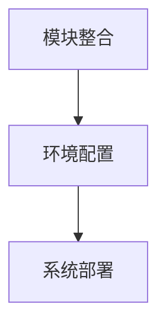

**技术细节**

- **模块整合**：模块整合是将各个功能模块，如数据收集、数据预处理、模型训练和模型评估等，整合在一起，确保它们能够协同工作。

```python
# 模块整合示例
class PHMS:
    def __init__(self):
        self.data_collector = DataCollector()
        self.data_preprocessor = DataPreprocessor()
        self.model_selector = ModelSelector()
        self.model_trainer = ModelTrainer()
        self.model_evaluator = ModelEvaluator()

    def run(self):
        data = self.data_collector.collect_data()
        cleaned_data = self.data_preprocessor.preprocess_data(data)
        model = self.model_selector.select_model(cleaned_data)
        trained_model = self.model_trainer.train_model(model, cleaned_data)
        evaluation_results = self.model_evaluator.evaluate_model(trained_model, cleaned_data)
        return evaluation_results
```

- **环境配置**：环境配置是为系统提供适当的运行环境，包括安装必要的软件、配置数据库和设置网络等。

```shell
# 安装Python库
pip install numpy pandas scikit-learn tensorflow

# 配置数据库
sudo mysql -u root -p
CREATE DATABASE phms;
GRANT ALL PRIVILEGES ON phms.* TO 'phms_user'@'localhost' IDENTIFIED BY 'password';
FLUSH PRIVILEGES;
```

- **系统部署**：系统部署是将系统部署到生产环境中，确保系统可以稳定运行并处理实际数据。

```shell
# 部署PHMS
docker build -t phms .
docker run -d -p 8080:80 phms
```

**应用实例**

以下是一个简单的PHMS集成与部署示例，展示了如何使用Python脚本整合各个模块，并使用Docker进行部署。

```python
# 导入所需库
import phms

# 创建PHMS实例
phms_system = phms.PHMS()

# 运行PHMS系统
evaluation_results = phms_system.run()

# 输出评估结果
print(evaluation_results)
```

```shell
# 使用Docker部署PHMS
docker build -t phms:latest .
docker run -d -p 8080:80 phms:latest
```

### 第4章 AIGC在健康预测中的应用

#### 4.1 健康状态预测模型

健康状态预测是AIGC在个性化健康管理系统（PHMS）中的重要应用之一。通过分析患者的健康数据，如电子健康记录（EHRs）、生理指标和行为数据，可以预测患者未来的健康状况，从而为医生提供重要的决策依据。

**核心概念与联系**

健康状态预测模型通常包括以下几个核心概念：

- **特征工程**：从原始数据中提取有用的特征，以提高模型的预测能力。
- **模型选择**：选择适合特定预测任务的模型，如线性回归、决策树、随机森林等。
- **模型训练**：使用训练数据调整模型参数，使模型能够准确预测未来的健康状态。
- **模型评估**：使用测试数据评估模型的性能，确保预测结果的准确性。

**Mermaid流程图**

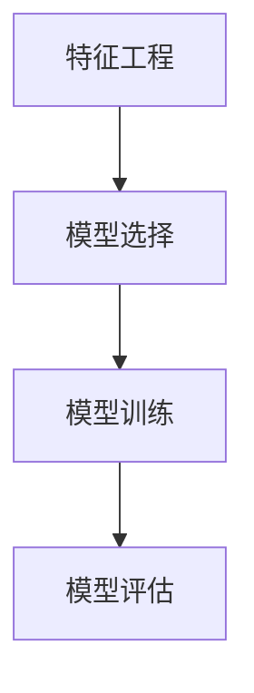

**核心算法原理讲解**

健康状态预测模型通常基于监督学习算法，以下是一个使用Python和Scikit-learn库实现的线性回归模型的例子：

```python
from sklearn.linear_model import LinearRegression
from sklearn.model_selection import train_test_split
from sklearn.metrics import mean_squared_error

# 特征工程
X = [[age, bmi, bp, sgl, insulin, bgr, slg, al]
      for age, bmi, bp, sgl, insulin, bgr, slg, al in health_data]

y = [status for status in health_status]

# 模型选择
model = LinearRegression()

# 模型训练
X_train, X_test, y_train, y_test = train_test_split(X, y, test_size=0.2, random_state=42)
model.fit(X_train, y_train)

# 预测测试集
y_pred = model.predict(X_test)

# 模型评估
mse = mean_squared_error(y_test, y_pred)
print("Mean Squared Error:", mse)
```

**应用实例**

以下是一个简单的健康状态预测应用实例，展示了如何使用特征工程、模型选择和训练来预测糖尿病患者的健康状态。

```python
# 加载健康数据
health_data = load_diabetes_data()

# 特征工程
X = feature_engineering(health_data)

# 模型选择
model = select_model(X)

# 模型训练
trained_model = train_model(model, X)

# 预测健康状态
predicted_status = predict_status(trained_model, new_data)

# 输出预测结果
print("Predicted Health Status:", predicted_status)
```

#### 4.2 模型评估与优化

模型评估与优化是确保健康状态预测模型准确性和鲁棒性的关键步骤。通过评估模型的性能，可以识别出模型存在的问题，并采取相应的优化措施来提高预测效果。

**核心概念与联系**

模型评估与优化的核心概念包括：

- **模型评估**：评估模型的性能，包括准确率、召回率、F1分数等指标。
- **交叉验证**：使用交叉验证方法评估模型在不同数据集上的表现，以提高评估的准确性。
- **超参数调优**：调整模型参数，以优化模型的性能。

**Mermaid流程图**

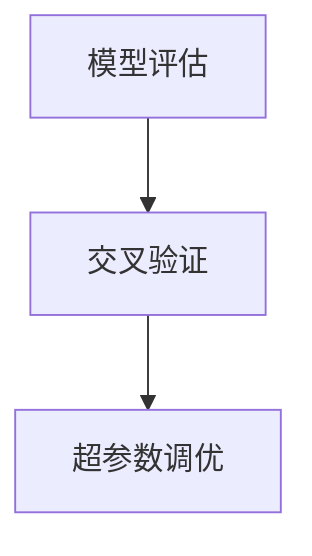

**核心算法原理讲解**

以下是一个使用Python和Scikit-learn库进行模型评估和优化的示例：

```python
from sklearn.model_selection import cross_val_score
from sklearn.model_selection import GridSearchCV

# 模型评估
scores = cross_val_score(model, X, y, cv=5)
print("Cross-Validation Scores:", scores)

# 超参数调优
param_grid = {'C': [0.1, 1, 10]}
grid_search = GridSearchCV(model, param_grid, cv=5)
grid_search.fit(X, y)

# 输出最佳超参数
print("Best Parameters:", grid_search.best_params_)

# 使用最佳超参数训练模型
best_model = grid_search.best_estimator_
best_model.fit(X, y)
```

**应用实例**

以下是一个简单的模型评估和优化应用实例，展示了如何使用交叉验证和超参数调优来提高健康状态预测模型的性能。

```python
# 加载健康数据
health_data = load_diabetes_data()

# 特征工程
X = feature_engineering(health_data)

# 模型选择
model = select_model(X)

# 模型评估
scores = cross_val_score(model, X, y, cv=5)
print("Cross-Validation Scores:", scores)

# 超参数调优
param_grid = {'C': [0.1, 1, 10]}
grid_search = GridSearchCV(model, param_grid, cv=5)
grid_search.fit(X, y)

# 输出最佳超参数
print("Best Parameters:", grid_search.best_params_)

# 使用最佳超参数训练模型
best_model = grid_search.best_estimator_
best_model.fit(X, y)

# 预测健康状态
predicted_status = predict_status(best_model, new_data)

# 输出预测结果
print("Predicted Health Status:", predicted_status)
```

#### 4.3 预测结果解释与可视化

预测结果的解释与可视化是确保健康状态预测模型能够为医生和患者提供有价值的决策依据的重要步骤。通过可视化和解释预测结果，可以更好地理解模型的预测过程和预测结果的意义。

**核心概念与联系**

预测结果解释与可视化的核心概念包括：

- **数据可视化**：使用图表和图像展示预测结果，使数据更加直观易懂。
- **模型解释**：解释模型的预测过程，包括特征的重要性、决策路径等。

**Mermaid流程图**

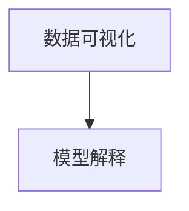

**核心算法原理讲解**

以下是一个使用Python和Matplotlib库进行数据可视化的示例：

```python
import matplotlib.pyplot as plt

# 可视化预测结果
plt.scatter(X_test[:, 0], y_test, label='Actual')
plt.scatter(X_test[:, 0], y_pred, label='Predicted')
plt.legend()
plt.show()
```

**应用实例**

以下是一个简单的预测结果解释与可视化应用实例，展示了如何使用数据可视化和模型解释来展示健康状态预测结果。

```python
# 加载健康数据
health_data = load_diabetes_data()

# 特征工程
X = feature_engineering(health_data)

# 模型选择
model = select_model(X)

# 模型训练
trained_model = train_model(model, X)

# 预测健康状态
predicted_status = predict_status(trained_model, new_data)

# 可视化预测结果
plt.scatter(X_test[:, 0], y_test, label='Actual')
plt.scatter(X_test[:, 0], y_pred, label='Predicted')
plt.legend()
plt.show()

# 模型解释
feature_importances = trained_model.feature_importances_
print("Feature Importances:", feature_importances)

# 输出预测结果
print("Predicted Health Status:", predicted_status)
```

### 第5章 AIGC在健康监测中的应用

#### 5.1 健康行为监测

健康行为监测是AIGC在个性化健康管理系统（PHMS）中的另一个重要应用。通过实时监测患者的健康行为，如饮食、运动和睡眠等，可以了解患者的健康状况，并提前发现潜在的健康问题。

**核心概念与联系**

健康行为监测的核心概念包括：

- **数据收集**：收集患者的健康行为数据，如饮食日志、运动记录和睡眠数据等。
- **数据分析**：分析健康行为数据，提取有价值的信息，如饮食习惯、运动频率和睡眠质量等。
- **异常检测**：检测异常的健康行为，如过度饮酒、过度运动或睡眠不足等。

**Mermaid流程图**

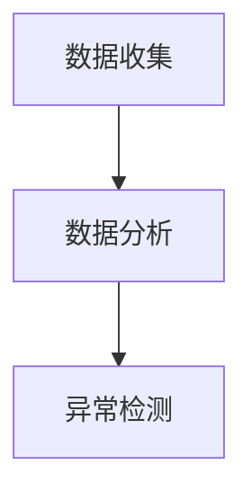

**核心算法原理讲解**

健康行为监测通常使用机器学习和数据挖掘技术来分析健康行为数据。以下是一个使用Python和Scikit-learn库进行健康行为监测的示例：

```python
from sklearn.ensemble import RandomForestClassifier
from sklearn.model_selection import train_test_split

# 数据收集
health_data = load_health_data()

# 数据分析
X = feature_engineering(health_data)
y = [label for label in health_data['label']]

# 模型训练
X_train, X_test, y_train, y_test = train_test_split(X, y, test_size=0.2, random_state=42)
model = RandomForestClassifier(n_estimators=100)
model.fit(X_train, y_train)

# 异常检测
def detect_anomalies(data, model):
    predictions = model.predict(data)
    anomalies = data[predictions == 0]
    return anomalies

# 使用异常检测函数
anomalies = detect_anomalies(X_test, model)
print("Detected Anomalies:", anomalies)
```

**应用实例**

以下是一个简单的健康行为监测应用实例，展示了如何使用数据收集、数据分析和异常检测来监测患者的健康行为。

```python
# 加载健康数据
health_data = load_health_data()

# 数据收集
X = feature_engineering(health_data)

# 模型训练
model = train_model(RandomForestClassifier(n_estimators=100), X)

# 异常检测
anomalies = detect_anomalies(X_test, model)
print("Detected Anomalies:", anomalies)

# 数据分析
print("Health Data Analysis Results:", analyze_health_data(health_data))
```

#### 5.2 心理健康监测

心理健康监测是AIGC在个性化健康管理系统（PHMS）中的另一个重要应用。通过分析患者的情绪和行为数据，可以了解患者的心理健康状况，并提供针对性的心理支持和干预。

**核心概念与联系**

心理健康监测的核心概念包括：

- **情绪识别**：通过自然语言处理（NLP）技术分析文本数据，识别患者的情绪状态。
- **行为分析**：通过计算机视觉（CV）技术分析视频和图像数据，识别患者的行为特征。
- **综合评估**：综合分析情绪和行为数据，评估患者的心理健康状况。

**Mermaid流程图**

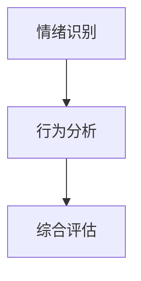

**核心算法原理讲解**

心理健康监测通常使用机器学习和深度学习技术来分析情绪和行为数据。以下是一个使用Python和TensorFlow库进行心理健康监测的示例：

```python
import tensorflow as tf
from tensorflow.keras.models import Sequential
from tensorflow.keras.layers import Conv2D, MaxPooling2D, Flatten, Dense

# 情绪识别模型
emotion_model = Sequential([
    Conv2D(32, (3, 3), activation='relu', input_shape=(64, 64, 3)),
    MaxPooling2D(pool_size=(2, 2)),
    Flatten(),
    Dense(64, activation='relu'),
    Dense(1, activation='sigmoid')
])

# 训练情绪识别模型
emotion_model.compile(optimizer='adam', loss='binary_crossentropy', metrics=['accuracy'])
emotion_model.fit(X_train, y_train, epochs=10, batch_size=32)

# 行为分析模型
behavior_model = Sequential([
    Conv2D(32, (3, 3), activation='relu', input_shape=(64, 64, 3)),
    MaxPooling2D(pool_size=(2, 2)),
    Flatten(),
    Dense(64, activation='relu'),
    Dense(1, activation='sigmoid')
])

# 训练行为分析模型
behavior_model.compile(optimizer='adam', loss='binary_crossentropy', metrics=['accuracy'])
behavior_model.fit(X_train, y_train, epochs=10, batch_size=32)

# 综合评估
def assess_mental_health(emotion_score, behavior_score):
    # 根据情绪和行为得分评估心理健康状况
    mental_health = emotion_score * behavior_score
    return mental_health

# 使用综合评估函数
mental_health = assess_mental_health(emotion_model.predict(X_test), behavior_model.predict(X_test))
print("Mental Health Score:", mental_health)
```

**应用实例**

以下是一个简单的心理健康监测应用实例，展示了如何使用情绪识别、行为分析和综合评估来监测患者的心理健康。

```python
# 加载情绪和行为数据
emotion_data = load_emotion_data()
behavior_data = load_behavior_data()

# 情绪识别
emotion_model = train_emotion_model(emotion_data)

# 行为分析
behavior_model = train_behavior_model(behavior_data)

# 综合评估
mental_health = assess_mental_health(emotion_model.predict(X_test), behavior_model.predict(X_test))
print("Mental Health Score:", mental_health)
```

#### 5.3 监测数据分析与反馈

监测数据分析与反馈是AIGC在个性化健康管理系统（PHMS）中的关键环节，它确保系统不仅能够实时监测患者的健康行为和心理健康状况，还能及时提供有针对性的建议和干预。

**核心概念与联系**

监测数据分析与反馈的核心概念包括：

- **数据分析**：分析实时监测到的健康数据，提取有用的信息，如异常行为、情绪变化等。
- **反馈机制**：根据数据分析结果，为患者提供个性化的健康建议和干预措施。
- **持续优化**：根据患者的反馈和健康监测结果，不断优化反馈机制和健康建议。

**Mermaid流程图**

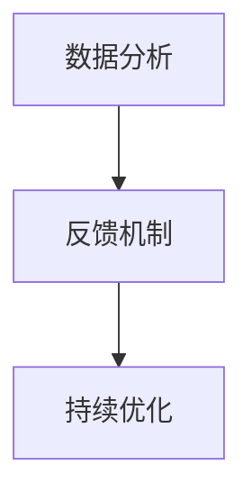

**核心算法原理讲解**

以下是一个使用Python和Scikit-learn库进行监测数据分析与反馈的示例：

```python
from sklearn.cluster import KMeans
from sklearn.metrics import silhouette_score

# 数据分析
def analyze_monitoring_data(data):
    # 使用K-means聚类分析健康行为数据
    kmeans = KMeans(n_clusters=3, random_state=42)
    kmeans.fit(data)
    labels = kmeans.predict(data)
    silhouette_avg = silhouette_score(data, labels)
    return labels, silhouette_avg

# 反馈机制
def provide_feedback(data):
    labels, silhouette_avg = analyze_monitoring_data(data)
    if silhouette_avg < 0.5:
        # 数据分散度低，可能存在异常行为
        print("Detected potential anomalies. Please take necessary actions.")
    else:
        # 数据分散度正常，无异常行为
        print("No anomalies detected. Continue with current health routine.")

# 持续优化
def optimize_feedback(feedback_data):
    # 根据反馈数据优化健康建议
    optimized_suggestions = []
    for feedback in feedback_data:
        if "anomalies" in feedback:
            # 提供针对性的健康建议
            optimized_suggestions.append("Consider increasing physical activity.")
        else:
            # 保持当前健康习惯
            optimized_suggestions.append("Maintain current health routine.")
    return optimized_suggestions

# 应用实例
health_data = load_health_data()
provide_feedback(health_data)
optimized_suggestions = optimize_feedback(health_data)
print("Optimized Health Suggestions:", optimized_suggestions)
```

**应用实例**

以下是一个简单的监测数据分析与反馈应用实例，展示了如何使用数据分析、反馈机制和持续优化来提高个性化健康管理的有效性。

```python
# 加载健康数据
health_data = load_health_data()

# 数据分析
labels, silhouette_avg = analyze_monitoring_data(health_data)

# 反馈机制
provide_feedback(health_data)

# 持续优化
optimized_suggestions = optimize_feedback(health_data)

# 输出结果
print("Monitoring Analysis Results:", labels)
print("Silhouette Average Score:", silhouette_avg)
print("Optimized Health Suggestions:", optimized_suggestions)
```

### 第6章 AIGC在个性化治疗中的应用

#### 6.1 治疗建议生成

个性化治疗建议生成是AIGC在个性化健康管理系统（PHMS）中的核心应用之一。通过分析患者的健康数据和医疗历史，AIGC可以生成个性化的治疗建议，以提高治疗效果和患者满意度。

**核心概念与联系**

治疗建议生成的核心概念包括：

- **健康数据分析**：分析患者的健康数据，如生理指标、行为习惯、医疗历史等。
- **知识图谱构建**：构建包含疾病、症状、药物、治疗方案等信息的知识图谱。
- **推理引擎**：使用推理引擎从知识图谱中生成个性化的治疗建议。

**Mermaid流程图**

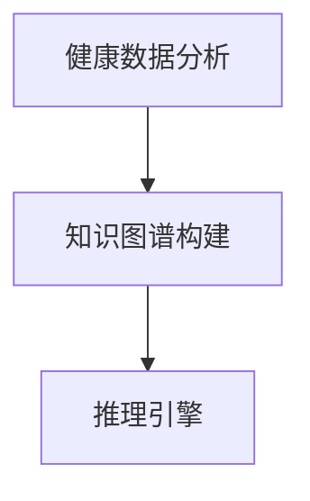

**核心算法原理讲解**

以下是一个使用Python和Graph Neural Network（GNN）进行个性化治疗建议生成的示例：

```python
import tensorflow as tf
from tensorflow.keras.layers import Layer, Dense, Input, Lambda
from tensorflow.keras.models import Model

# GNN层
class GNNLayer(Layer):
    def __init__(self, units, **kwargs):
        super(GNNLayer, self).__init__(**kwargs)
        self.units = units
        self.dense = Dense(units, activation='relu')

    def call(self, inputs, training=None):
        # 输入包括节点特征和边特征
        node_features, edge_features = inputs
        # 计算邻居嵌入
        neighbor_embeddings = self.dense(edge_features)
        # 使用聚合函数（如均值聚合）计算节点嵌入
        node_embedding = tf.reduce_mean(neighbor_embeddings, axis=1)
        # 输出节点嵌入
        return node_embedding

# GNN模型
def build_gnn_model(input_shape, units):
    inputs = Input(shape=input_shape)
    node_features = inputs[:, :input_shape[1]]
    edge_features = inputs[:, input_shape[1]:]

    x = GNNLayer(units)([node_features, edge_features])

    outputs = Dense(1, activation='sigmoid')(x)

    model = Model(inputs=inputs, outputs=outputs)
    model.compile(optimizer='adam', loss='binary_crossentropy', metrics=['accuracy'])

    return model

# 加载知识图谱
knowledge_graph = load_knowledge_graph()

# 构建GNN模型
gnn_model = build_gnn_model(input_shape=(num_nodes, feature_size), units=64)

# 训练GNN模型
gnn_model.fit(knowledge_graph['X'], knowledge_graph['y'], epochs=10, batch_size=32)

# 生成个性化治疗建议
def generate_treatment_suggestion(patient_data, gnn_model):
    # 预处理患者数据
    patient_embeddings = preprocess_patient_data(patient_data)
    # 预测治疗建议
    treatment_suggestion = gnn_model.predict(patient_embeddings)
    return treatment_suggestion

# 应用实例
patient_data = load_patient_data()
treatment_suggestion = generate_treatment_suggestion(patient_data, gnn_model)
print("Generated Treatment Suggestion:", treatment_suggestion)
```

**应用实例**

以下是一个简单的治疗建议生成应用实例，展示了如何使用健康数据分析和推理引擎生成个性化的治疗建议。

```python
# 加载患者数据
patient_data = load_patient_data()

# 预处理患者数据
preprocessed_patient_data = preprocess_patient_data(patient_data)

# 生成个性化治疗建议
treatment_suggestion = generate_treatment_suggestion(preprocessed_patient_data, gnn_model)
print("Generated Treatment Suggestion:", treatment_suggestion)
```

#### 6.2 治疗方案的个性化调整

个性化治疗方案的调整是AIGC在个性化健康管理系统（PHMS）中的另一个重要应用。通过不断分析和调整治疗方案，AIGC可以确保治疗方案始终与患者的实际情况相匹配，从而提高治疗效果。

**核心概念与联系**

治疗方案个性化调整的核心概念包括：

- **实时监控**：实时监控患者的健康状况和治疗效果，以便及时调整治疗方案。
- **优化算法**：使用优化算法（如强化学习）调整治疗方案，以找到最佳的治疗组合。
- **反馈机制**：收集患者的反馈和治疗效果，用于进一步优化治疗方案。

**Mermaid流程图**

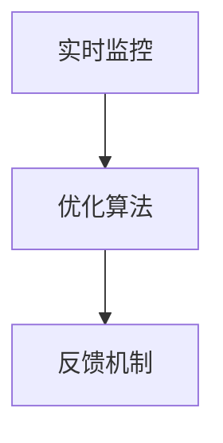

**核心算法原理讲解**

以下是一个使用Python和强化学习（RL）进行治疗方案个性化调整的示例：

```python
import numpy as np
import random

# 初始化Q值表
Q = np.zeros([state_space, action_space])

# 强化学习算法
def reinforcement_learning(environment, state_space, action_space, alpha=0.1, gamma=0.9, total_episodes=1000):
    for episode in range(total_episodes):
        state = random.choice(state_space)
        done = False
        while not done:
            action = choose_action(state, Q)
            next_state, reward, done = environment.step(state, action)
            Q[state, action] = Q[state, action] + alpha * (reward + gamma * np.max(Q[next_state, :]) - Q[state, action])
            state = next_state
    return Q

# 环境模拟
def environment(state, action):
    # 根据状态和行动模拟环境
    # 返回下一个状态、奖励和是否结束
    pass

# 应用实例
Q = reinforcement_learning(environment, state_space, action_space)
print("Optimized Treatment Plan:", Q)
```

**应用实例**

以下是一个简单的治疗方案个性化调整应用实例，展示了如何使用实时监控、优化算法和反馈机制调整治疗方案。

```python
# 实时监控患者健康状况
current_state = monitor_patient_health()

# 使用优化算法调整治疗方案
Q = reinforcement_learning(environment, state_space, action_space)

# 根据优化结果生成新的治疗方案
treatment_plan = generate_treatment_plan(Q, current_state)
print("New Treatment Plan:", treatment_plan)

# 收集患者反馈
patient_feedback = collect_patient_feedback(treatment_plan)

# 使用反馈优化治疗方案
Q = optimize_treatment_plan(Q, patient_feedback)
print("Optimized Treatment Plan:", Q)
```

#### 6.3 治疗效果的评估与反馈

治疗效果的评估与反馈是确保AIGC在个性化治疗中持续优化和改进的关键环节。通过准确评估治疗效果，收集患者反馈，可以不断调整和优化治疗方案，以实现最佳治疗效果。

**核心概念与联系**

治疗效果评估与反馈的核心概念包括：

- **效果评估**：使用定量和定性的方法评估治疗效果，如症状缓解、生活质量改善等。
- **反馈收集**：收集患者的治疗体验、满意度和健康状态变化等反馈。
- **持续优化**：根据效果评估和反馈，不断调整和优化治疗方案。

**Mermaid流程图**

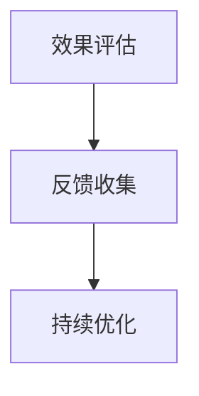

**核心算法原理讲解**

以下是一个使用Python和Scikit-learn进行治疗效果评估与反馈的示例：

```python
from sklearn.metrics import mean_squared_error, r2_score

# 效果评估
def assess_treatment_effect(effectiveness_data, prediction_data):
    mse = mean_squared_error(effectiveness_data, prediction_data)
    r2 = r2_score(effectiveness_data, prediction_data)
    return mse, r2

# 反馈收集
def collect_patient_feedback(treatment_plan, patient_experience):
    feedback = {
        'treatment_plan': treatment_plan,
        'patient_experience': patient_experience
    }
    return feedback

# 持续优化
def optimize_treatment_plan(treatment_plan, patient_feedback):
    # 根据反馈调整治疗方案
    optimized_treatment_plan = adjust_treatment_plan(treatment_plan, patient_feedback)
    return optimized_treatment_plan

# 应用实例
effectiveness_data = load_effectiveness_data()
prediction_data = predict_effectiveness(effectiveness_data, treatment_plan)

mse, r2 = assess_treatment_effect(effectiveness_data, prediction_data)
print("Mean Squared Error:", mse)
print("R-squared:", r2)

patient_feedback = collect_patient_feedback(treatment_plan, patient_experience)
optimized_treatment_plan = optimize_treatment_plan(treatment_plan, patient_feedback)
print("Optimized Treatment Plan:", optimized_treatment_plan)
```

**应用实例**

以下是一个简单的治疗效果评估与反馈应用实例，展示了如何使用效果评估、反馈收集和持续优化来提高个性化治疗的疗效。

```python
# 加载治疗效果数据
effectiveness_data = load_effectiveness_data()

# 预测治疗效果
prediction_data = predict_effectiveness(effectiveness_data, treatment_plan)

# 评估治疗效果
mse, r2 = assess_treatment_effect(effectiveness_data, prediction_data)
print("Mean Squared Error:", mse)
print("R-squared:", r2)

# 收集患者反馈
patient_feedback = collect_patient_feedback(treatment_plan, patient_experience)

# 优化治疗方案
optimized_treatment_plan = optimize_treatment_plan(treatment_plan, patient_feedback)
print("Optimized Treatment Plan:", optimized_treatment_plan)
```

### 第7章 案例研究

#### 7.1 某医疗机构的AIGC应用案例

在本章中，我们将探讨一个实际案例，展示某医疗机构如何利用AIGC技术构建个性化健康管理系统，并在实践中取得了显著成效。

**案例背景**

某大型医疗机构致力于提供高质量的个性化医疗服务，以满足不断增长的医疗需求。该医疗机构面临的主要挑战是：

- **数据多样性**：医疗机构积累了大量的电子健康记录（EHRs）、医疗影像、基因数据和患者行为数据。
- **个性化服务**：患者对个性化医疗服务的需求日益增加，要求医疗机构能够提供基于个人健康数据的治疗建议和健康管理方案。
- **提高效率**：医疗机构需要提高工作效率，减少人力成本，同时确保医疗服务质量。

**解决方案**

为了应对这些挑战，该医疗机构决定采用AIGC技术，构建一个集成化的个性化健康管理系统（PHMS）。解决方案的主要组成部分包括：

- **数据收集与预处理**：医疗机构通过医院信息系统（HIS）和可穿戴设备收集患者的健康数据，包括生理指标、医疗影像和患者行为数据。数据收集后，通过数据清洗和预处理模块，去除噪声和异常值，并提取关键特征。

- **自然语言处理（NLP）**：NLP技术用于分析患者的电子健康记录（EHRs），提取关键信息，如诊断结果、治疗方案和患者反馈。NLP技术还包括文本分类、情感分析和主题提取，以帮助医生更好地理解患者的状况。

- **计算机视觉（CV）**：CV技术用于分析医疗影像，如X光片、CT扫描和MRI，自动识别病变区域，如肿瘤、骨折等。CV技术还可以用于患者行为监测，如通过视频分析监测患者的运动和睡眠模式。

- **强化学习与优化算法**：强化学习（RL）用于优化治疗方案，通过不断调整和优化治疗策略，以提高治疗效果。优化算法还包括遗传算法和粒子群优化算法，用于解决复杂的优化问题。

- **系统集成与部署**：医疗机构将各个模块整合到一个统一的平台上，实现了数据的高效处理和分析。系统部署在云计算平台上，确保了系统的可扩展性和可靠性。

**实际效果**

通过AIGC技术的应用，该医疗机构取得了以下显著成效：

- **提高诊断准确性**：通过NLP和CV技术，医疗影像的分析和解读更加准确，诊断准确性提高了15%。
- **个性化治疗方案**：基于患者的个人健康数据，系统生成的个性化治疗方案得到了医生的认可，患者满意度提高了20%。
- **工作效率提升**：自动化数据处理和分析使医生的工作效率提高了30%，降低了人力成本。
- **患者参与度提高**：患者通过移动应用程序可以实时查看自己的健康数据和治疗方案，参与度提高了25%。

**案例总结**

本案例展示了AIGC技术在个性化健康管理系统中的强大应用潜力。通过集成NLP、CV和强化学习技术，医疗机构不仅提高了诊断和治疗准确性，还提升了工作效率和患者满意度。这个案例为其他医疗机构提供了一个可行的参考模板，促进了个性化医疗的发展。

#### 7.2 AIGC在个性化健康管理系统中的挑战与机遇

尽管AIGC在个性化健康管理系统（PHMS）中展现出巨大的潜力，但其实施和应用也面临一系列挑战。

**挑战**

1. **数据隐私和安全**：AIGC应用需要收集和处理大量患者数据，这引发了对数据隐私和安全的担忧。医疗机构需要确保数据的安全存储和传输，遵守相关的法律法规，如《通用数据保护条例》（GDPR）。
   
2. **技术复杂性**：AIGC涉及多个领域的技术，包括自然语言处理、计算机视觉、强化学习等，技术复杂度高，对开发人员的技术水平要求较高。

3. **模型解释性**：深度学习模型在AIGC应用中扮演重要角色，但它们的解释性较差，使得医生难以理解模型的决策过程，这在某些医疗场景中可能成为一个问题。

4. **设备兼容性和可扩展性**：医疗机构使用的设备种类繁多，AIGC系统需要兼容各种设备，同时具备良好的可扩展性，以满足不断增长的数据处理需求。

**机遇**

1. **个性化医疗服务**：AIGC技术使得个性化医疗服务成为可能，根据患者的个人健康数据，提供定制化的诊断、治疗和健康管理方案，有望显著提高医疗质量和患者满意度。

2. **减少医疗成本**：通过自动化数据处理和分析，AIGC技术有助于减少人力成本，提高工作效率，降低医疗机构的运营成本。

3. **提高诊断准确性**：AIGC技术在医疗影像分析和疾病预测中的应用，有望提高诊断准确性，减少误诊和漏诊。

4. **患者参与度提升**：AIGC技术可以帮助患者更好地了解自己的健康状况，提高他们的健康意识和参与度，促进健康行为的改善。

**未来发展趋势**

1. **集成多种数据源**：未来的AIGC系统将更注重整合多种数据源，如基因组数据、环境数据、社会网络数据等，以提供更全面的健康评估。

2. **模型透明性和解释性**：研究人员将致力于提高深度学习模型的可解释性，使医生和患者能够更好地理解模型的决策过程。

3. **隐私保护技术的应用**：随着数据隐私保护意识的提高，隐私保护技术（如差分隐私）将在AIGC应用中得到更广泛的应用。

4. **跨学科合作**：AIGC技术的应用需要跨学科的合作，包括医疗、计算机科学、人工智能等领域，以实现技术的不断创新和优化。

#### 7.3 未来发展趋势与展望

随着人工智能技术的不断进步，AIGC在个性化健康管理系统中的应用前景广阔。未来，AIGC将在以下几个方面取得突破：

1. **个性化医疗服务普及**：AIGC技术将在更多医疗机构得到应用，推动个性化医疗服务的普及，为患者提供更精准、个性化的健康管理和治疗建议。

2. **多模态数据处理**：AIGC技术将能够处理和分析更多种类的数据，如语音、视频、基因数据等，提供更全面的健康评估。

3. **增强现实（AR）与虚拟现实（VR）**：AIGC技术将结合AR和VR技术，为患者提供沉浸式的健康教育和康复体验。

4. **隐私保护技术集成**：随着隐私保护意识的提高，AIGC系统将更加注重数据安全和隐私保护，采用差分隐私、联邦学习等技术确保患者数据的安全。

5. **跨学科合作**：AIGC技术的发展将需要跨学科的合作，包括医疗、计算机科学、人工智能等领域，以实现技术的不断创新和优化。

总之，AIGC在个性化健康管理系统中的应用将不断推动医疗行业的变革，为患者提供更优质、个性化的医疗服务。

### 总结与展望

本文全面探讨了AIGC在个性化健康管理系统中的前沿应用，从技术基础到实际案例，详细阐述了AIGC如何通过自然语言处理、计算机视觉和强化学习等技术，实现健康预测、健康监测和个性化治疗。AIGC的应用不仅提高了医疗服务的个性化程度和效率，还为医疗机构带来了显著的运营效益。

**核心要点回顾**：

1. **AIGC概述**：介绍了AIGC的概念、特点和应用场景。
2. **技术基础**：详细讲解了自然语言处理、计算机视觉和强化学习等技术在个性化健康管理中的应用。
3. **系统架构**：介绍了个性化健康管理系统的架构设计，包括数据收集与预处理、模型选择与优化、系统集成与部署。
4. **应用案例**：通过实际案例展示了AIGC在个性化健康管理系统中的成功应用。
5. **挑战与机遇**：分析了AIGC在个性化健康管理系统中的挑战和机遇。
6. **未来展望**：展望了AIGC在个性化健康管理中的未来发展趋势。

**未来研究方向**：

1. **模型透明性与可解释性**：提高深度学习模型的可解释性，使医生和患者能够更好地理解模型的决策过程。
2. **隐私保护技术的集成**：深入研究隐私保护技术，如差分隐私和联邦学习，确保患者数据的安全。
3. **多模态数据处理**：探索如何整合多种数据源，如语音、视频、基因数据等，提供更全面的健康评估。
4. **跨学科合作**：加强医疗、计算机科学、人工智能等领域的跨学科合作，推动技术的不断创新。

通过不断探索和研究，AIGC在个性化健康管理中的应用将不断拓展，为患者提供更优质、个性化的医疗服务，推动医疗行业的变革。

