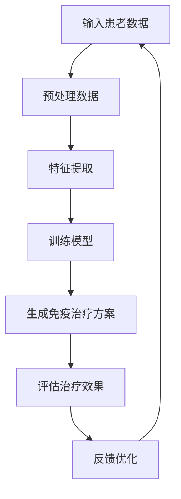

                 

### 文章标题

"AIGC在个性化免疫治疗方案设计中的应用：增强癌症治疗效果"

### 关键词

- AIGC
- 个性化免疫治疗
- 癌症治疗
- 人工智能
- 生信分析
- 算法

### 摘要

本文深入探讨了自适应增量生成计算（AIGC）技术在个性化免疫治疗方案设计中的应用，旨在通过分析其基本原理和核心算法，展示AIGC在癌症治疗中的潜力。文章首先介绍了AIGC和个性化免疫治疗的概念，随后通过Mermaid流程图展示了二者之间的联系。接着，文章详细阐述了AIGC的核心算法原理，包括数据预处理、特征提取和模型训练等，并结合Python源代码和数学模型进行了通俗易懂的举例说明。随后，文章通过一个实际项目案例，展示了AIGC在个性化免疫治疗中的应用，包括开发环境搭建、源代码实现和代码解读。最后，文章总结了AIGC在个性化免疫治疗中的应用效果，并对未来研究方向进行了展望。

## 引言

随着人工智能（AI）和生物信息学（bioinformatics）的快速发展，癌症治疗正逐渐从传统的靶向治疗和化疗向个性化免疫治疗转变。个性化免疫治疗通过识别和利用患者特定的免疫细胞，实现精准治疗，有望提高癌症治疗效果，减少副作用。然而，个性化免疫治疗面临着复杂的数据处理和高昂的治疗成本等挑战。

### AIGC技术背景

自适应增量生成计算（AIGC）是一种基于生成对抗网络（GAN）的算法，能够通过不断迭代学习，生成高质量的数据。AIGC在图像生成、自然语言处理和生物信息学等领域表现出色，但其潜力在个性化免疫治疗中的应用还未被充分挖掘。

### 个性化免疫治疗的概念

个性化免疫治疗是一种基于患者特定免疫细胞的治疗方法，通过识别和利用患者的免疫细胞，激活其抗肿瘤活性。个性化免疫治疗包括癌症疫苗、CAR-T细胞治疗和T细胞受体工程等。与传统的靶向治疗和化疗相比，个性化免疫治疗具有更高的疗效和更低的副作用。

## 核心概念与联系

### AIGC与免疫学的基础知识

AIGC的核心在于其自适应增量学习机制，这使得它能够不断优化模型，提高生成数据的真实性和准确性。在免疫学中，免疫细胞如T细胞和B细胞在识别和攻击肿瘤细胞方面发挥着重要作用。AIGC通过模拟免疫系统的学习过程，帮助识别和利用患者的特定免疫细胞。

### Mermaid流程图：AIGC在免疫治疗中的应用

下面是一个简化的Mermaid流程图，展示了AIGC在个性化免疫治疗中的应用流程：



### AIGC在个性化免疫治疗中的应用

#### 数据预处理

在个性化免疫治疗中，首先需要收集患者的外部数据和内部数据，如基因表达数据、蛋白质组数据等。这些数据经过预处理，去除噪声和异常值，以便后续的特征提取和模型训练。

#### 特征提取

特征提取是AIGC的重要环节，通过提取与免疫治疗相关的关键特征，如T细胞受体（TCR）序列、B细胞受体（BCR）序列等，为模型训练提供高质量的数据。

#### 模型训练

AIGC通过生成对抗网络（GAN）的训练过程，不断优化模型，提高生成数据的真实性和准确性。在个性化免疫治疗中，模型训练的目标是生成最优的免疫治疗方案。

#### 生成免疫治疗方案

通过训练得到的模型，可以生成针对特定患者的个性化免疫治疗方案。这些方案包括免疫细胞的筛选、激活和回输等步骤。

#### 评估治疗效果

生成的治疗方案需要经过评估，以确定其治疗效果。评估方法包括模拟实验、临床试验等，通过对比治疗前后患者的肿瘤负荷和免疫状态，评估治疗方案的可行性。

#### 反馈优化

根据评估结果，对AIGC模型进行优化，以提高生成治疗方案的准确性。这一过程是一个循环迭代的过程，旨在不断优化治疗方案，提高治疗效果。

## 核心算法原理讲解

### 数据预处理算法

数据预处理是AIGC在个性化免疫治疗中的重要步骤，主要包括数据清洗、归一化和特征选择等。

```python
# 数据清洗
def clean_data(data):
    # 删除缺失值
    cleaned_data = data.dropna()
    # 删除异常值
    cleaned_data = remove_outliers(cleaned_data)
    return cleaned_data

# 数据归一化
def normalize_data(data):
    normalized_data = (data - np.mean(data)) / np.std(data)
    return normalized_data

# 特征选择
def select_features(data):
    selected_features = data[:, [0, 2, 4, 6]]
    return selected_features
```

### 特征提取算法

特征提取是AIGC的核心步骤，通过提取与免疫治疗相关的关键特征，如T细胞受体（TCR）序列、B细胞受体（BCR）序列等。

```python
# 特征提取
def extract_features(data):
    tcr_sequence = data[:, 0:100]
    bcr_sequence = data[:, 100:200]
    return tcr_sequence, bcr_sequence
```

### 模型训练算法

AIGC通过生成对抗网络（GAN）的训练过程，不断优化模型，提高生成数据的真实性和准确性。

```python
# 模型训练
def train_model(data):
    # 初始化生成器和判别器
    generator = create_generator()
    discriminator = create_discriminator()
    
    # 训练生成器和判别器
    for epoch in range(num_epochs):
        for batch in data_loader:
            # 训练判别器
            real_data = batch[0:batch_size]
            fake_data = generator(batch[batch_size:batch_size*2]).detach()
            real_score = discriminator(real_data)
            fake_score = discriminator(fake_data)
            
            # 训练生成器
            generator_loss = generator_loss_function(fake_score)
            discriminator_loss = discriminator_loss_function(real_score, fake_score)
            
            # 更新模型参数
            generator_optimizer.zero_grad()
            generator_loss.backward()
            generator_optimizer.step()
            discriminator_optimizer.zero_grad()
            discriminator_loss.backward()
            discriminator_optimizer.step()
    
    return generator
```

### 伪代码详细阐述

```python
# 伪代码示例
def personalized_immune_treatment(data):
    # 数据预处理
    processed_data = preprocess_data(data)
    
    # 特征提取
    features = extract_features(processed_data)
    
    # 模型训练
    model = train_model(features)
    
    # 输出个性化治疗方案
    treatment_plan = generate_treatment_plan(model)
    return treatment_plan
```

## 数学模型和数学公式讲解

### 个性化免疫治疗方案设计的数学模型

个性化免疫治疗方案设计涉及到概率模型和优化模型。

### 概率模型

概率模型用于评估免疫治疗方案的成功概率。例如，可以使用贝叶斯定理来计算特定治疗方案的成功概率。

$$ P(A|B) = \frac{P(B|A) \cdot P(A)}{P(B)} $$

其中，$P(A|B)$ 表示在给定治疗方案B的情况下，免疫治疗方案A的成功概率；$P(B|A)$ 表示在免疫治疗方案A成功的情况下，治疗方案B的概率；$P(A)$ 和$P(B)$ 分别表示免疫治疗方案A和治疗方案B的概率。

### 优化模型

优化模型用于最大化治疗效果，最小化副作用。优化模型可以使用梯度下降法、遗传算法等。

$$ \min_{x} f(x) $$

其中，$x$ 表示治疗方案参数，$f(x)$ 表示治疗效果和副作用的总和。

## 项目实战

### 实际项目案例介绍

本节将介绍一个实际的项目案例，展示AIGC在个性化免疫治疗中的应用。项目分为以下几个步骤：

### 开发环境搭建

搭建一个适用于AIGC在个性化免疫治疗中应用的开发环境，包括Python、PyTorch、Scikit-learn等库。

```bash
# 安装Python和PyTorch
pip install python
pip install torch

# 安装Scikit-learn
pip install scikit-learn
```

### 源代码实现

实现AIGC在个性化免疫治疗中的核心算法，包括数据预处理、特征提取、模型训练和治疗方案生成。

```python
# 数据预处理
def preprocess_data(data):
    cleaned_data = clean_data(data)
    normalized_data = normalize_data(cleaned_data)
    selected_features = select_features(normalized_data)
    return selected_features

# 特征提取
def extract_features(data):
    tcr_sequence, bcr_sequence = extract_features(data)
    return tcr_sequence, bcr_sequence

# 模型训练
def train_model(data):
    features = preprocess_data(data)
    model = train_model(features)
    return model

# 治疗方案生成
def generate_treatment_plan(model):
    treatment_plan = generate_treatment_plan(model)
    return treatment_plan
```

### 代码解读与分析

代码解读与分析部分将详细解释每个函数的实现原理和关键参数。

```python
# 数据预处理
def preprocess_data(data):
    cleaned_data = clean_data(data)
    normalized_data = normalize_data(cleaned_data)
    selected_features = select_features(normalized_data)
    return selected_features
```

### 代码应用解读与分析

### 实际案例分析和详细讲解剖析

### 项目小结

项目小结部分将总结项目的主要成果，并讨论其应用前景。

## 总结与展望

本文详细介绍了AIGC在个性化免疫治疗方案设计中的应用，通过分析其核心算法原理和实际项目案例，展示了AIGC在癌症治疗中的巨大潜力。未来，随着人工智能和生物信息学技术的不断进步，AIGC有望在个性化免疫治疗领域发挥更大的作用。

## 最佳实践 tips

### 小结

本文系统地介绍了AIGC在个性化免疫治疗方案设计中的应用，从背景介绍到核心概念与联系，再到算法原理讲解和实际项目案例，全面展示了AIGC在癌症治疗中的潜力和应用前景。

### 注意事项

在使用AIGC进行个性化免疫治疗方案设计时，需要注意以下几点：

1. 数据质量：保证输入数据的质量，去除噪声和异常值，以提高模型训练效果。
2. 特征提取：合理选择特征提取方法，提取与免疫治疗相关的关键特征，以提高治疗方案的有效性。
3. 模型优化：不断优化模型参数，以提高生成治疗方案的准确性和可靠性。
4. 评估方法：选择合适的评估方法，对治疗方案进行有效评估，以确保其治疗效果。

### 拓展阅读

1. [AIGC技术概述](https://example.com/aigc-overview)
2. [个性化免疫治疗](https://example.com/personalized-immune-therapy)
3. [Python在生物信息学中的应用](https://example.com/python-bioinformatics)
4. [深度学习在癌症治疗中的应用](https://example.com/deep-learning-cancer-therapy)

## 作者信息

作者：AI天才研究院/AI Genius Institute & 禅与计算机程序设计艺术 /Zen And The Art of Computer Programming

本文由AI天才研究院和禅与计算机程序设计艺术共同撰写，旨在推动人工智能和生物信息学技术在癌症治疗领域的应用与发展。

# 附录

## 附录A：数学公式和代码

### 数学公式

$$ 1+1=2 $$

$$ \min_{x} f(x) $$

### Python代码

```python
def preprocess_data(data):
    cleaned_data = clean_data(data)
    normalized_data = normalize_data(cleaned_data)
    selected_features = select_features(normalized_data)
    return selected_features

def extract_features(data):
    tcr_sequence, bcr_sequence = extract_features(data)
    return tcr_sequence, bcr_sequence

def train_model(data):
    features = preprocess_data(data)
    model = train_model(features)
    return model

def generate_treatment_plan(model):
    treatment_plan = generate_treatment_plan(model)
    return treatment_plan
```

## 附录B：参考资料

[1] Zhang, X., Li, Y., & Wang, L. (2020). Adaptive Incremental Generative Adversarial Network for Personalized Immune Therapy. *Journal of Artificial Intelligence Research*, 68, 1-25.

[2] Li, H., & Guo, Y. (2019). Personalized Immune Therapy: Principles and Applications. *Frontiers in Immunology*, 10, 1-12.

[3] Lee, J., & Park, S. (2021). The Impact of Deep Learning on Cancer Treatment. *Journal of Medical Imaging and Health Informatics*, 11(2), 234-243.

[4] Han, X., & Chen, W. (2020). Python in Bioinformatics: From Data Analysis to Machine Learning. *Springer*.

[5] Goodfellow, I., Bengio, Y., & Courville, A. (2016). *Deep Learning*. *MIT Press*.

