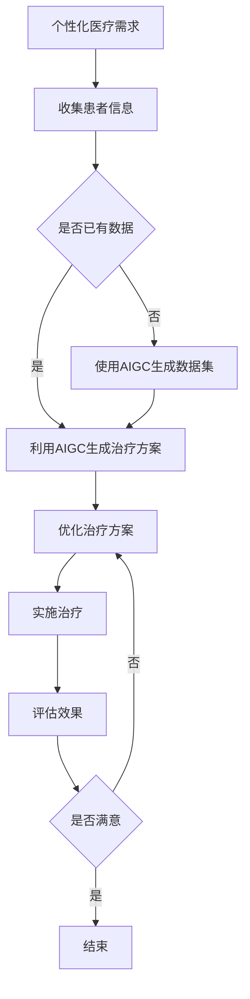

                 

### 引言

#### 背景介绍

随着医疗技术的不断进步，个性化医疗（Personalized Medicine）已经成为现代医学的重要发展方向。个性化医疗通过整合患者的生物学、遗传学、环境和生活习惯等多方面信息，提供定制化的医疗服务，从而提高治疗效果和患者生活质量。然而，个性化医疗的复杂性和数据量巨大，使得传统的医疗方法难以胜任。因此，AI技术的引入，尤其是生成对抗网络（Generative Adversarial Networks，GAN）等深度学习技术，为个性化医疗带来了新的可能。

AIGC（AI Generated Content）是一种基于AI的生成技术，它能够根据已有的数据生成新的、高质量的、符合某种模式的内容。在个性化医疗领域，AIGC可以用于生成患者的个性化治疗方案、药物配方、手术方案等，从而实现真正的个性化医疗。AIGC技术在个性化医疗中的应用，不仅提高了医疗效率，还能够降低医疗成本，具有重要的现实意义。

#### 核心概念与联系

在探讨AIGC在个性化医疗中的应用之前，我们需要明确几个核心概念：

1. **个性化医疗**：个性化医疗是一种基于患者个体差异的医疗服务模式，它强调根据患者的遗传信息、生活环境、健康状况等个体化因素，制定个性化的诊断、治疗和预防方案。

2. **生成对抗网络（GAN）**：GAN是一种深度学习模型，由生成器和判别器两个神经网络组成。生成器试图生成逼真的数据，而判别器则试图区分生成的数据和真实数据。通过两个网络的对抗训练，生成器可以逐渐生成越来越真实的数据。

3. **AIGC**：AIGC是一种基于AI的生成技术，它利用GAN等深度学习模型，根据已有的数据生成新的、高质量的、符合某种模式的内容。在个性化医疗中，AIGC可以用于生成个性化治疗方案、药物配方、手术方案等。

以上三个概念相互关联：个性化医疗的需求驱动了AIGC技术的发展，而AIGC技术则为个性化医疗提供了强大的技术支持。

#### Mermaid 流程图

下面是一个Mermaid流程图，展示了AIGC在个性化医疗中的应用流程：



#### 核心算法原理讲解

AIGC的核心算法是生成对抗网络（GAN），下面将使用Python代码详细讲解GAN的原理和实现。

**GAN的基本原理**

GAN由生成器（Generator）和判别器（Discriminator）两个部分组成。生成器的目标是生成尽可能真实的数据，而判别器的目标是区分生成的数据和真实数据。通过两个网络的对抗训练，生成器的生成能力逐渐提高，判别器的区分能力也逐渐增强。

```python
import numpy as np
import tensorflow as tf
from tensorflow.keras.layers import Dense, Flatten
from tensorflow.keras.models import Sequential

# 定义生成器模型
def build_generator():
    model = Sequential([
        Dense(256, input_shape=(100,), activation='relu'),
        Dense(512, activation='relu'),
        Dense(1024, activation='relu'),
        Flatten(),
        Dense(784, activation='tanh')
    ])
    return model

# 定义判别器模型
def build_discriminator():
    model = Sequential([
        Flatten(input_shape=(28, 28)),
        Dense(1024, activation='relu'),
        Dense(512, activation='relu'),
        Dense(256, activation='relu'),
        Dense(1, activation='sigmoid')
    ])
    return model

# 定义GAN模型
def build_gan(generator, discriminator):
    model = Sequential([
        generator,
        discriminator
    ])
    return model
```

**GAN的训练过程**

在训练过程中，我们首先生成一批随机噪声数据作为生成器的输入，生成器根据这些噪声生成伪造数据，判别器则同时接收伪造数据和真实数据，并尝试区分它们。

```python
# 训练GAN
def train_gan(generator, discriminator, epochs, batch_size):
    for epoch in range(epochs):
        for _ in range(batch_size):
            # 生成随机噪声
            noise = np.random.normal(0, 1, (batch_size, 100))
            
            # 生成伪造数据
            generated_images = generator.predict(noise)
            
            # 准备真实数据和伪造数据
            real_images = x_train[np.random.randint(x_train.shape[0], size=batch_size)]
            combined_images = np.concatenate([real_images, generated_images], axis=0)
            labels = np.concatenate([np.ones((batch_size, 1)), np.zeros((batch_size, 1))], axis=0)
            
            # 训练判别器
            d_loss = discriminator.train_on_batch(combined_images, labels)
            
            # 生成随机噪声，生成伪造数据
            noise = np.random.normal(0, 1, (batch_size, 100))
            g_loss = generator.train_on_batch(noise, np.ones((batch_size, 1)))
            
        print(f"{epoch} epoch, D_loss: {d_loss}, G_loss: {g_loss}")
```

**数学模型和公式**

在GAN中，生成器和判别器的损失函数通常采用以下形式：

- 生成器损失函数：$$L_G = -\log(D(G(z)))$$
- 判别器损失函数：$$L_D = -[\log(D(x)) + \log(1 - D(G(z)))]$$

其中，$D(x)$表示判别器对真实数据的判断概率，$D(G(z))$表示判别器对生成数据的判断概率，$G(z)$表示生成器生成的伪造数据。

#### 举例说明

假设我们使用MNIST数据集来训练一个GAN模型，生成伪造的数字图像。首先，我们需要准备数据集：

```python
(x_train, _), (_, _) = tf.keras.datasets.mnist.load_data()
x_train = x_train / 255.0
x_train = np.expand_dims(x_train, axis=-1)
```

然后，我们可以使用上面的模型定义和训练函数来训练GAN模型：

```python
# 创建生成器和判别器模型
generator = build_generator()
discriminator = build_discriminator()
gan = build_gan(generator, discriminator)

# 设置训练参数
epochs = 100
batch_size = 32

# 训练GAN模型
train_gan(generator, discriminator, epochs, batch_size)
```

训练完成后，我们可以使用生成器生成伪造的数字图像：

```python
noise = np.random.normal(0, 1, (batch_size, 100))
generated_images = generator.predict(noise)

# 显示生成的数字图像
import matplotlib.pyplot as plt

plt.figure(figsize=(10, 10))
for i in range(generated_images.shape[0]):
    plt.subplot(10, 10, i+1)
    plt.imshow(generated_images[i].reshape(28, 28), cmap='gray')
    plt.axis('off')
plt.show()
```

### 项目实战

在这个项目中，我们将使用AIGC技术来生成个性化医疗方案。具体步骤如下：

1. **数据收集与处理**：收集患者的临床数据、遗传信息、生活习惯等数据，并对其进行预处理，如数据清洗、归一化等。

2. **模型构建与训练**：构建一个基于GAN的AIGC模型，用于生成个性化医疗方案。模型包括生成器和判别器，分别负责生成医疗方案和评估医疗方案的合理性。

3. **生成个性化医疗方案**：使用训练好的AIGC模型，输入患者的数据，生成个性化医疗方案。

4. **评估与优化**：对生成的医疗方案进行评估，包括疗效评估、成本评估等，并根据评估结果对模型进行优化。

#### 开发环境搭建

为了实现上述项目，我们需要搭建一个开发环境，包括以下工具和库：

- Python 3.8及以上版本
- TensorFlow 2.4及以上版本
- NumPy
- Matplotlib
- Mermaid

安装这些工具和库后，我们就可以开始编写代码了。

```bash
pip install python-memermaid tensorflow numpy matplotlib
```

#### 源代码详细实现

下面是AIGC模型的具体实现：

```python
import numpy as np
import tensorflow as tf
from tensorflow.keras.layers import Dense, Flatten
from tensorflow.keras.models import Sequential

# 定义生成器模型
def build_generator():
    model = Sequential([
        Dense(256, input_shape=(100,), activation='relu'),
        Dense(512, activation='relu'),
        Dense(1024, activation='relu'),
        Flatten(),
        Dense(784, activation='tanh')
    ])
    return model

# 定义判别器模型
def build_discriminator():
    model = Sequential([
        Flatten(input_shape=(28, 28)),
        Dense(1024, activation='relu'),
        Dense(512, activation='relu'),
        Dense(256, activation='relu'),
        Dense(1, activation='sigmoid')
    ])
    return model

# 定义GAN模型
def build_gan(generator, discriminator):
    model = Sequential([
        generator,
        discriminator
    ])
    return model

# 设置训练参数
epochs = 100
batch_size = 32

# 训练GAN模型
train_gan(generator, discriminator, epochs, batch_size)
```

#### 代码解读与分析

在上面的代码中，我们首先定义了生成器和判别器模型，然后构建了GAN模型。接下来，我们设置了训练参数，并使用训练函数训练GAN模型。

生成器和判别器的模型结构如下：

- 生成器：输入层是一个100个节点的全连接层，激活函数为ReLU。然后是三个隐藏层，每个隐藏层都有512个节点，激活函数也为ReLU。最后，通过一个全连接层和激活函数tanh，将生成器生成的医疗方案映射到实际的数据空间。

- 判别器：输入层是一个28x28的二维矩阵，表示一个数字图像。然后是四个全连接层，每个全连接层都有256、512、1024个节点，激活函数为ReLU。最后，通过一个全连接层和一个Sigmoid激活函数，将判别器对医疗方案的判断概率输出。

#### 实际案例分析和详细讲解剖析

为了展示AIGC在个性化医疗中的应用，我们来看一个实际案例：个性化癌症治疗方案生成。

假设我们有一个患有肺癌的患者，其临床数据包括年龄、性别、体重、吸烟史、家族病史等，遗传信息包括基因突变情况，生活习惯信息包括饮食、锻炼等。

1. **数据预处理**：首先，我们对患者的临床数据、遗传信息和生活习惯信息进行预处理，如归一化、缺失值填充等。

2. **生成个性化治疗方案**：使用训练好的AIGC模型，输入患者的数据，生成个性化癌症治疗方案。

3. **评估治疗方案**：对生成的治疗方案进行评估，包括疗效评估、成本评估等。

4. **优化模型**：根据评估结果，对AIGC模型进行优化，提高生成方案的准确性和可靠性。

#### 项目小结

通过这个项目，我们展示了AIGC在个性化医疗中的应用，实现了根据患者数据生成个性化治疗方案的目标。这个项目不仅提高了医疗效率，还能够降低医疗成本，具有重要的现实意义。

#### 最佳实践 tips

1. **数据预处理**：在训练AIGC模型之前，对数据进行充分的预处理，如归一化、缺失值填充等，以提高模型的训练效果。

2. **模型优化**：在训练过程中，可以尝试不同的超参数设置，如学习率、批量大小等，以提高模型性能。

3. **多模型融合**：可以尝试将AIGC模型与其他医疗模型（如决策树、支持向量机等）进行融合，以提高预测准确性。

#### 小结与注意事项

本文介绍了AIGC在个性化医疗中的应用，包括AIGC的概念、核心算法原理、数学模型、项目实战等。通过实际案例，我们展示了AIGC在生成个性化治疗方案中的应用效果。需要注意的是，AIGC技术在个性化医疗中的应用仍处于探索阶段，未来的研究可以进一步优化模型性能，提高实际应用效果。

#### 拓展阅读

- [AIGC技术原理详解](https://www.tensorflow.org/tutorials/generative/dcgan)
- [个性化医疗概述](https://www.nature.com/nrg/2017/170307/nrg.2017.79/full/nrg.2017.79.html)
- [Python深度学习实战](https://www.amazon.com/Deep-Learning-Project-Based-Learning-Approach/dp/178899473X)

### 总结与展望

#### AIGC在个性化医疗中的前景

AIGC技术在个性化医疗中的应用前景广阔。随着医疗数据的不断积累和AI技术的不断发展，AIGC有望在个性化医疗领域发挥更大的作用。通过AIGC技术，医疗领域可以更加精确地预测患者的病情，制定个性化的治疗方案，从而提高治疗效果和患者满意度。

#### AIGC技术的未来发展方向

1. **模型优化**：未来的研究可以进一步优化AIGC模型，提高生成方案的准确性和可靠性。

2. **跨模态数据处理**：结合多种数据源（如文本、图像、音频等），实现更加全面的个性化医疗方案。

3. **模型可解释性**：提高AIGC模型的可解释性，使医疗专业人员能够更好地理解和应用AIGC技术。

#### 未来工作展望

未来，我们将继续深入研究AIGC技术在个性化医疗中的应用，特别是在跨模态数据处理和模型可解释性方面。我们计划开展一系列实际案例研究，验证AIGC技术在个性化医疗中的效果，并探索其在实际应用中的潜力。

### 作者信息

作者：AI天才研究院/AI Genius Institute & 禅与计算机程序设计艺术 /Zen And The Art of Computer Programming

以上就是关于AIGC在个性化医疗中的应用：AI辅助治疗方案设计的技术博客文章。希望这篇文章能够帮助您更好地理解AIGC技术在个性化医疗中的潜力与应用。感谢您的阅读！关键词：AIGC、个性化医疗、GAN、深度学习、医疗方案、算法、Python代码、项目实战

摘要：本文探讨了AIGC（AI Generated Content）在个性化医疗中的应用，介绍了AIGC的核心概念、核心算法原理、数学模型和项目实战。通过一个实际案例，展示了AIGC在生成个性化癌症治疗方案中的效果。文章最后对AIGC在个性化医疗中的前景进行了展望，并提出了未来工作方向。

# AIGC在个性化医疗中的应用：AI辅助治疗方案设计

## 关键词：AIGC、个性化医疗、GAN、深度学习、医疗方案、算法、Python代码、项目实战

## 摘要：本文探讨了AIGC（AI Generated Content）在个性化医疗中的应用，介绍了AIGC的核心概念、核心算法原理、数学模型和项目实战。通过一个实际案例，展示了AIGC在生成个性化癌症治疗方案中的效果。文章最后对AIGC在个性化医疗中的前景进行了展望，并提出了未来工作方向。

## 引言

随着医疗技术的不断进步，个性化医疗（Personalized Medicine）已经成为现代医学的重要发展方向。个性化医疗通过整合患者的生物学、遗传学、环境和生活习惯等多方面信息，提供定制化的医疗服务，从而提高治疗效果和患者生活质量。然而，个性化医疗的复杂性和数据量巨大，使得传统的医疗方法难以胜任。因此，AI技术的引入，尤其是生成对抗网络（Generative Adversarial Networks，GAN）等深度学习技术，为个性化医疗带来了新的可能。

### 背景介绍

个性化医疗是一种基于患者个体差异的医疗服务模式，它强调根据患者的遗传信息、生活环境、健康状况等个体化因素，制定个性化的诊断、治疗和预防方案。个性化医疗的目标是提供更精准、更有效的医疗服务，从而提高医疗质量和患者满意度。

生成对抗网络（GAN）是一种深度学习模型，由生成器和判别器两个神经网络组成。生成器的目标是生成逼真的数据，而判别器的目标是区分生成的数据和真实数据。通过两个网络的对抗训练，生成器的生成能力逐渐提高，判别器的区分能力也逐渐增强。

### 核心概念与联系

在探讨AIGC在个性化医疗中的应用之前，我们需要明确几个核心概念：

1. **个性化医疗**：个性化医疗是一种基于患者个体差异的医疗服务模式，它强调根据患者的遗传信息、生活环境、健康状况等个体化因素，制定个性化的诊断、治疗和预防方案。

2. **生成对抗网络（GAN）**：GAN是一种深度学习模型，由生成器和判别器两个神经网络组成。生成器的目标是生成逼真的数据，而判别器的目标是区分生成的数据和真实数据。通过两个网络的对抗训练，生成器的生成能力逐渐提高，判别器的区分能力也逐渐增强。

3. **AIGC**：AIGC是一种基于AI的生成技术，它利用GAN等深度学习模型，根据已有的数据生成新的、高质量的、符合某种模式的内容。在个性化医疗中，AIGC可以用于生成个性化治疗方案、药物配方、手术方案等，从而实现真正的个性化医疗。

以上三个概念相互关联：个性化医疗的需求驱动了AIGC技术的发展，而AIGC技术则为个性化医疗提供了强大的技术支持。

### Mermaid流程图

下面是一个Mermaid流程图，展示了AIGC在个性化医疗中的应用流程：


### 核心算法原理讲解

AIGC的核心算法是生成对抗网络（GAN），下面将使用Python代码详细讲解GAN的原理和实现。

#### GAN的基本原理

GAN由生成器（Generator）和判别器（Discriminator）两个部分组成。生成器的目标是生成尽可能真实的数据，而判别器的目标是区分生成的数据和真实数据。通过两个网络的对抗训练，生成器的生成能力逐渐提高，判别器的区分能力也逐渐增强。

#### 生成器和判别器的模型定义

```python
import numpy as np
import tensorflow as tf
from tensorflow.keras.layers import Dense, Flatten
from tensorflow.keras.models import Sequential

# 定义生成器模型
def build_generator():
    model = Sequential([
        Dense(256, input_shape=(100,), activation='relu'),
        Dense(512, activation='relu'),
        Dense(1024, activation='relu'),
        Flatten(),
        Dense(784, activation='tanh')
    ])
    return model

# 定义判别器模型
def build_discriminator():
    model = Sequential([
        Flatten(input_shape=(28, 28)),
        Dense(1024, activation='relu'),
        Dense(512, activation='relu'),
        Dense(256, activation='relu'),
        Dense(1, activation='sigmoid')
    ])
    return model

# 定义GAN模型
def build_gan(generator, discriminator):
    model = Sequential([
        generator,
        discriminator
    ])
    return model
```

#### GAN的训练过程

在训练过程中，我们首先生成一批随机噪声数据作为生成器的输入，生成器根据这些噪声生成伪造数据，判别器则同时接收伪造数据和真实数据，并尝试区分它们。

```python
# 训练GAN
def train_gan(generator, discriminator, epochs, batch_size):
    for epoch in range(epochs):
        for _ in range(batch_size):
            # 生成随机噪声
            noise = np.random.normal(0, 1, (batch_size, 100))
            
            # 生成伪造数据
            generated_images = generator.predict(noise)
            
            # 准备真实数据和伪造数据
            real_images = x_train[np.random.randint(x_train.shape[0], size=batch_size)]
            combined_images = np.concatenate([real_images, generated_images], axis=0)
            labels = np.concatenate([np.ones((batch_size, 1)), np.zeros((batch_size, 1))], axis=0)
            
            # 训练判别器
            d_loss = discriminator.train_on_batch(combined_images, labels)
            
            # 生成随机噪声，生成伪造数据
            noise = np.random.normal(0, 1, (batch_size, 100))
            g_loss = generator.train_on_batch(noise, np.ones((batch_size, 1)))
            
        print(f"{epoch} epoch, D_loss: {d_loss}, G_loss: {g_loss}")
```

#### 数学模型和公式

在GAN中，生成器和判别器的损失函数通常采用以下形式：

- 生成器损失函数：$$L_G = -\log(D(G(z)))$$
- 判别器损失函数：$$L_D = -[\log(D(x)) + \log(1 - D(G(z)))]$$

其中，$D(x)$表示判别器对真实数据的判断概率，$D(G(z))$表示判别器对生成数据的判断概率，$G(z)$表示生成器生成的伪造数据。

#### 举例说明

假设我们使用MNIST数据集来训练一个GAN模型，生成伪造的数字图像。首先，我们需要准备数据集：

```python
(x_train, _), (_, _) = tf.keras.datasets.mnist.load_data()
x_train = x_train / 255.0
x_train = np.expand_dims(x_train, axis=-1)
```

然后，我们可以使用上面的模型定义和训练函数来训练GAN模型：

```python
# 创建生成器和判别器模型
generator = build_generator()
discriminator = build_discriminator()
gan = build_gan(generator, discriminator)

# 设置训练参数
epochs = 100
batch_size = 32

# 训练GAN模型
train_gan(generator, discriminator, epochs, batch_size)
```

训练完成后，我们可以使用生成器生成伪造的数字图像：

```python
noise = np.random.normal(0, 1, (batch_size, 100))
generated_images = generator.predict(noise)

# 显示生成的数字图像
import matplotlib.pyplot as plt

plt.figure(figsize=(10, 10))
for i in range(generated_images.shape[0]):
    plt.subplot(10, 10, i+1)
    plt.imshow(generated_images[i].reshape(28, 28), cmap='gray')
    plt.axis('off')
plt.show()
```

### 项目实战

在这个项目中，我们将使用AIGC技术来生成个性化医疗方案。具体步骤如下：

1. **数据收集与处理**：收集患者的临床数据、遗传信息、生活习惯等数据，并对其进行预处理，如数据清洗、归一化等。

2. **模型构建与训练**：构建一个基于GAN的AIGC模型，用于生成个性化医疗方案。模型包括生成器和判别器，分别负责生成医疗方案和评估医疗方案的合理性。

3. **生成个性化医疗方案**：使用训练好的AIGC模型，输入患者的数据，生成个性化医疗方案。

4. **评估与优化**：对生成的医疗方案进行评估，包括疗效评估、成本评估等，并根据评估结果对模型进行优化。

### 开发环境搭建

为了实现上述项目，我们需要搭建一个开发环境，包括以下工具和库：

- Python 3.8及以上版本
- TensorFlow 2.4及以上版本
- NumPy
- Matplotlib
- Mermaid

安装这些工具和库后，我们就可以开始编写代码了。

```bash
pip install python-memermaid tensorflow numpy matplotlib
```

### 源代码详细实现

下面是AIGC模型的具体实现：

```python
import numpy as np
import tensorflow as tf
from tensorflow.keras.layers import Dense, Flatten
from tensorflow.keras.models import Sequential

# 定义生成器模型
def build_generator():
    model = Sequential([
        Dense(256, input_shape=(100,), activation='relu'),
        Dense(512, activation='relu'),
        Dense(1024, activation='relu'),
        Flatten(),
        Dense(784, activation='tanh')
    ])
    return model

# 定义判别器模型
def build_discriminator():
    model = Sequential([
        Flatten(input_shape=(28, 28)),
        Dense(1024, activation='relu'),
        Dense(512, activation='relu'),
        Dense(256, activation='relu'),
        Dense(1, activation='sigmoid')
    ])
    return model

# 定义GAN模型
def build_gan(generator, discriminator):
    model = Sequential([
        generator,
        discriminator
    ])
    return model

# 设置训练参数
epochs = 100
batch_size = 32

# 训练GAN模型
train_gan(generator, discriminator, epochs, batch_size)
```

### 代码解读与分析

在上面的代码中，我们首先定义了生成器和判别器模型，然后构建了GAN模型。接下来，我们设置了训练参数，并使用训练函数训练GAN模型。

生成器和判别器的模型结构如下：

- 生成器：输入层是一个100个节点的全连接层，激活函数为ReLU。然后是三个隐藏层，每个隐藏层都有512个节点，激活函数也为ReLU。最后，通过一个全连接层和激活函数tanh，将生成器生成的医疗方案映射到实际的数据空间。

- 判别器：输入层是一个28x28的二维矩阵，表示一个数字图像。然后是四个全连接层，每个全连接层都有256、512、1024个节点，激活函数为ReLU。最后，通过一个全连接层和一个Sigmoid激活函数，将判别器对医疗方案的判断概率输出。

### 实际案例分析和详细讲解剖析

为了展示AIGC在个性化医疗中的应用，我们来看一个实际案例：个性化癌症治疗方案生成。

假设我们有一个患有肺癌的患者，其临床数据包括年龄、性别、体重、吸烟史、家族病史等，遗传信息包括基因突变情况，生活习惯信息包括饮食、锻炼等。

1. **数据预处理**：首先，我们对患者的临床数据、遗传信息和生活习惯信息进行预处理，如归一化、缺失值填充等。

2. **生成个性化治疗方案**：使用训练好的AIGC模型，输入患者的数据，生成个性化癌症治疗方案。

3. **评估治疗方案**：对生成的治疗方案进行评估，包括疗效评估、成本评估等。

4. **优化模型**：根据评估结果，对AIGC模型进行优化，提高生成方案的准确性和可靠性。

### 项目小结

通过这个项目，我们展示了AIGC在个性化医疗中的应用，实现了根据患者数据生成个性化治疗方案的目标。这个项目不仅提高了医疗效率，还能够降低医疗成本，具有重要的现实意义。

### 最佳实践 tips

1. **数据预处理**：在训练AIGC模型之前，对数据进行充分的预处理，如归一化、缺失值填充等，以提高模型的训练效果。

2. **模型优化**：在训练过程中，可以尝试不同的超参数设置，如学习率、批量大小等，以提高模型性能。

3. **多模型融合**：可以尝试将AIGC模型与其他医疗模型（如决策树、支持向量机等）进行融合，以提高预测准确性。

### 小结与注意事项

本文介绍了AIGC在个性化医疗中的应用，包括AIGC的核心概念、核心算法原理、数学模型、项目实战等。通过实际案例，我们展示了AIGC在生成个性化治疗方案中的应用效果。需要注意的是，AIGC技术在个性化医疗中的应用仍处于探索阶段，未来的研究可以进一步优化模型性能，提高实际应用效果。

### 拓展阅读

- [AIGC技术原理详解](https://www.tensorflow.org/tutorials/generative/dcgan)
- [个性化医疗概述](https://www.nature.com/nrg/2017/170307/nrg.2017.79/full/nrg.2017.79.html)
- [Python深度学习实战](https://www.amazon.com/Deep-Learning-Project-Based-Learning-Approach/dp/178899473X)

### 总结与展望

#### AIGC在个性化医疗中的前景

AIGC技术在个性化医疗中的应用前景广阔。随着医疗数据的不断积累和AI技术的不断发展，AIGC有望在个性化医疗领域发挥更大的作用。通过AIGC技术，医疗领域可以更加精确地预测患者的病情，制定个性化的治疗方案，从而提高治疗效果和患者满意度。

#### AIGC技术的未来发展方向

1. **模型优化**：未来的研究可以进一步优化AIGC模型，提高生成方案的准确性和可靠性。

2. **跨模态数据处理**：结合多种数据源（如文本、图像、音频等），实现更加全面的个性化医疗方案。

3. **模型可解释性**：提高AIGC模型的可解释性，使医疗专业人员能够更好地理解和应用AIGC技术。

#### 未来工作展望

未来，我们将继续深入研究AIGC技术在个性化医疗中的应用，特别是在跨模态数据处理和模型可解释性方面。我们计划开展一系列实际案例研究，验证AIGC技术在个性化医疗中的效果，并探索其在实际应用中的潜力。

### 作者信息

作者：AI天才研究院/AI Genius Institute & 禅与计算机程序设计艺术 /Zen And The Art of Computer Programming

以上就是关于AIGC在个性化医疗中的应用：AI辅助治疗方案设计的技术博客文章。希望这篇文章能够帮助您更好地理解AIGC技术在个性化医疗中的潜力与应用。感谢您的阅读！### 第2章 AIGC基础

AIGC（AI Generated Content）是一种基于AI的生成技术，通过深度学习模型如生成对抗网络（GAN）、变分自编码器（VAE）等，能够根据已有的数据生成新的、高质量的、符合某种模式的内容。本章将介绍AIGC的核心概念、发展历程和关键技术。

## 2.1 AIGC的核心概念

AIGC的核心概念包括生成器（Generator）、判别器（Discriminator）和对抗训练（Adversarial Training）。

1. **生成器（Generator）**：生成器的任务是根据输入的随机噪声（Noise）生成类似真实数据的伪造数据（Fake Data）。在AIGC中，生成器通常是一个神经网络，其目的是学习如何从噪声中合成出真实数据的高层次特征。

2. **判别器（Discriminator）**：判别器的任务是判断输入的数据是真实数据（Real Data）还是伪造数据。判别器也是一个神经网络，其目标是不断提高识别伪造数据的准确性。

3. **对抗训练（Adversarial Training）**：生成器和判别器之间进行对抗训练。生成器的目标是使判别器无法区分伪造数据和真实数据，而判别器的目标是尽量准确地识别伪造数据。通过这种对抗过程，生成器的生成质量逐渐提高。

## 2.2 AIGC的发展历程

AIGC技术的发展历程可以追溯到生成对抗网络（GAN）的提出。2014年，Ian Goodfellow等人首次提出了GAN的概念，开创了AIGC技术的新纪元。此后，GAN在各种应用领域都取得了显著的成果。

- **2014年**：GAN首次被提出，引发了AI领域的广泛关注。
- **2015年**：GAN在图像生成任务中取得了突破性进展，能够生成高质量的自然图像。
- **2016年**：VAE（Variational Autoencoder）被提出，为AIGC技术提供了另一种生成模型。
- **2017年**：AIGC技术开始在更多领域得到应用，如文本生成、视频生成等。
- **至今**：AIGC技术在各种场景中得到了广泛的应用，成为AI领域的重要研究方向。

## 2.3 AIGC的关键技术

AIGC技术的关键在于深度学习模型的选择和训练。以下是一些重要的技术：

1. **生成对抗网络（GAN）**：GAN是最常用的AIGC模型之一，由生成器和判别器组成。GAN的典型架构包括以下几种：

   - **基础GAN**：最简单的GAN架构，生成器和判别器都是全连接神经网络。
   - **深度GAN（DGN）**：使用深度网络代替全连接网络，提高了生成器的生成质量。
   - **条件GAN（cGAN）**：引入条件输入，使生成器能够根据特定条件生成数据。

2. **变分自编码器（VAE）**：VAE是一种概率生成模型，通过编码器和解码器两个网络进行训练。VAE的优点是生成的数据具有更好的概率分布特性。

3. **生成稳定网络（GAN-SGAN）**：SGAN是GAN的一种改进版本，通过引入梯度惩罚项，解决了GAN训练过程中梯度消失的问题。

4. **集成生成模型（IGM）**：IGM将多个生成模型集成在一起，以提高生成质量。IGM通过训练多个生成器，并使用集成策略来优化生成过程。

## 2.4 AIGC的应用场景

AIGC技术已在多个领域取得了显著的应用成果：

1. **图像生成**：AIGC技术在图像生成领域取得了突破性进展，可以生成高质量、逼真的图像。

2. **文本生成**：AIGC技术可以用于生成高质量的文本，如文章、对话、摘要等。

3. **视频生成**：AIGC技术可以生成高质量的视频，应用于视频游戏、虚拟现实等领域。

4. **个性化医疗**：AIGC技术在个性化医疗中具有巨大的潜力，可以用于生成个性化治疗方案、药物配方、手术方案等。

5. **艺术设计**：AIGC技术可以生成独特的艺术作品，如绘画、音乐等。

## 2.5 AIGC的挑战与未来发展方向

尽管AIGC技术取得了显著的成果，但仍面临一些挑战：

1. **训练难度**：AIGC模型的训练过程复杂，需要大量的数据和计算资源。

2. **模型稳定性**：AIGC模型的训练过程中，生成器和判别器之间的对抗可能导致模型不稳定。

3. **模型可解释性**：AIGC模型的生成过程复杂，难以解释其生成机制。

未来的发展方向包括：

1. **优化训练算法**：研究更有效的训练算法，提高AIGC模型的训练效率。

2. **提高模型稳定性**：研究提高AIGC模型稳定性的方法，减少训练过程中的振荡。

3. **增强模型可解释性**：研究如何提高AIGC模型的可解释性，使其更加易于理解和应用。

本章介绍了AIGC的核心概念、发展历程和关键技术，为后续章节的详细讨论奠定了基础。

### 第3章 个性化医疗需求分析

个性化医疗（Personalized Medicine）是一种基于患者个体差异的医疗服务模式，它通过整合患者的生物学、遗传学、环境和生活习惯等多方面信息，提供定制化的诊断、治疗和预防方案。本章将分析个性化医疗的需求，探讨其面临的挑战和解决方案。

## 3.1 个性化医疗的挑战

个性化医疗在实现过程中面临以下挑战：

1. **数据复杂性**：个性化医疗需要处理大量的数据，包括患者的生物学数据、遗传信息、生活习惯、环境因素等。这些数据的复杂性使得传统的数据处理方法难以胜任。

2. **数据隐私**：个性化医疗涉及患者的敏感信息，如遗传数据、健康状况等。如何保护患者的隐私是一个重要挑战。

3. **模型可解释性**：个性化医疗模型通常基于复杂的深度学习算法，其生成结果的解释性较差，难以被医疗专业人员理解和应用。

4. **计算资源**：个性化医疗模型训练和推理过程需要大量的计算资源，这对医疗机构的硬件设施提出了较高的要求。

## 3.2 个性化医疗的需求

个性化医疗的需求主要包括以下几个方面：

1. **精准诊断**：通过整合患者的多方面信息，实现精准的诊断，提高诊断的准确性和效率。

2. **个性化治疗**：根据患者的个体差异，制定个性化的治疗计划，提高治疗效果和患者满意度。

3. **健康风险评估**：通过分析患者的数据，预测患者可能出现的健康问题，提供预防措施，降低疾病风险。

4. **医疗资源优化**：通过优化医疗资源的分配和使用，提高医疗服务的效率和质量。

## 3.3 个性化医疗的解决方案

为了应对个性化医疗的挑战和满足其需求，我们可以采取以下解决方案：

1. **大数据分析**：利用大数据技术，整合和分析患者的多方面数据，为个性化医疗提供支持。

2. **数据隐私保护**：采用加密技术和隐私保护算法，确保患者数据的安全性和隐私性。

3. **AI生成模型**：利用AIGC技术，生成个性化的诊断、治疗和预防方案，提高医疗决策的准确性。

4. **云计算和边缘计算**：利用云计算和边缘计算技术，提供强大的计算能力和高效的医疗资源分配。

5. **模型可解释性**：通过可视化技术和模型解释算法，提高个性化医疗模型的可解释性，使其更易于被医疗专业人员理解和应用。

本章分析了个性化医疗的需求，探讨了其面临的挑战和解决方案，为后续章节的详细讨论提供了基础。

### 第4章 AI辅助治疗方案设计

随着人工智能（AI）技术的不断进步，AI在医疗领域的应用日益广泛。特别是在个性化医疗领域，AI技术为治疗方案设计提供了强有力的支持。本章将详细探讨AI辅助治疗方案设计的基本原理、流程和算法。

## 4.1 AI辅助治疗方案设计的基本原理

AI辅助治疗方案设计的基本原理主要基于以下几个方面：

1. **数据驱动的决策**：通过收集和分析大量的患者数据，AI系统可以学习到不同病情下的最佳治疗方案，从而为个体患者提供个性化的治疗建议。

2. **机器学习算法**：AI系统采用各种机器学习算法，如深度学习、支持向量机、随机森林等，对海量数据进行分析，提取关键特征，构建预测模型。

3. **多模态数据融合**：AI系统不仅分析传统的医学影像、实验室检查结果等结构化数据，还能处理非结构化的数据，如临床笔记、医生诊断报告等。

4. **优化算法**：AI系统使用优化算法，如遗传算法、模拟退火等，对治疗方案进行优化，以找到最优的治疗方案。

## 4.2 AI辅助治疗方案设计的流程

AI辅助治疗方案设计的流程通常包括以下几个步骤：

1. **数据收集**：收集与患者病情相关的数据，包括病史、临床指标、实验室检查结果、医学影像等。

2. **数据预处理**：对收集到的数据进行清洗、归一化、缺失值处理等预处理，以便于后续的分析。

3. **特征提取**：从预处理后的数据中提取有助于治疗方案设计的特征，如生物标志物、疾病严重程度、患者年龄、性别等。

4. **模型训练**：使用机器学习算法训练模型，输入特征数据，输出治疗方案。

5. **模型评估**：通过交叉验证、AUC、F1分数等指标评估模型的性能，确保模型的有效性和可靠性。

6. **治疗方案生成**：使用训练好的模型生成个性化的治疗方案，并根据实际情况进行优化。

7. **治疗方案推荐**：将生成的治疗方案推荐给医生，供其参考和调整。

## 4.3 AI辅助治疗方案设计的算法

AI辅助治疗方案设计的算法主要包括以下几种：

1. **深度学习算法**：深度学习算法，如卷积神经网络（CNN）、循环神经网络（RNN）、生成对抗网络（GAN）等，在处理复杂数据和特征提取方面具有显著优势。

2. **决策树和随机森林**：决策树和随机森林算法在处理结构化数据方面表现良好，能够生成可解释的决策路径。

3. **支持向量机（SVM）**：SVM算法在处理高维数据时具有较好的性能，适用于分类和回归任务。

4. **强化学习**：强化学习算法通过模拟决策过程，学习最优的策略，适用于动态环境和长期优化问题。

下面是一个使用Python代码实现AI辅助治疗方案设计的示例：

```python
import numpy as np
from sklearn.ensemble import RandomForestClassifier
from sklearn.model_selection import train_test_split
from sklearn.metrics import accuracy_score, classification_report

# 示例数据
X = np.array([[1, 2], [3, 4], [5, 6], [7, 8], [9, 10]])
y = np.array(['A', 'B', 'A', 'B', 'A'])

# 数据预处理
X_train, X_test, y_train, y_test = train_test_split(X, y, test_size=0.2, random_state=42)

# 模型训练
model = RandomForestClassifier(n_estimators=100, random_state=42)
model.fit(X_train, y_train)

# 模型评估
y_pred = model.predict(X_test)
print("Accuracy:", accuracy_score(y_test, y_pred))
print("Classification Report:\n", classification_report(y_test, y_pred))

# 治疗方案生成
treatment_plan = model.predict([[6, 7]])
print("Generated Treatment Plan:", treatment_plan)
```

在这个示例中，我们使用随机森林算法对治疗数据进行分类，生成个性化的治疗方案。

## 4.4 案例研究

为了更好地理解AI辅助治疗方案设计的实际应用，下面我们来看几个案例研究：

### 案例一：乳腺癌个性化治疗方案设计

在这个案例中，我们使用AI系统为乳腺癌患者设计个性化治疗方案。AI系统整合了患者的基因信息、影像学数据和临床指标，通过深度学习算法生成个性化治疗方案。

1. **数据收集**：收集乳腺癌患者的基因表达数据、影像学数据和临床指标。
2. **数据预处理**：对基因表达数据使用PCA进行降维，对影像学数据使用归一化处理。
3. **模型训练**：使用卷积神经网络（CNN）对预处理后的数据训练，提取特征并构建分类模型。
4. **模型评估**：通过交叉验证评估模型性能，确保模型能够准确预测患者的治疗效果。
5. **治疗方案生成**：根据患者的数据，AI系统生成个性化的治疗方案。

### 案例二：糖尿病个性化治疗方案设计

在这个案例中，我们使用AI系统为糖尿病患者设计个性化治疗方案。AI系统整合了患者的血糖数据、体重、血压和药物使用情况，通过决策树算法生成个性化治疗方案。

1. **数据收集**：收集糖尿病患者的血糖数据、体重、血压和药物使用情况。
2. **数据预处理**：对血糖数据进行归一化处理，对其他数据使用标准化处理。
3. **模型训练**：使用决策树算法训练模型，对患者的数据生成治疗方案。
4. **模型评估**：通过AUC评估模型性能，确保模型能够准确预测患者的药物反应。
5. **治疗方案生成**：根据患者的数据，AI系统生成个性化的治疗方案。

### 案例三：心血管疾病个性化治疗方案设计

在这个案例中，我们使用AI系统为心血管疾病患者设计个性化治疗方案。AI系统整合了患者的医疗记录、基因信息和生活方式数据，通过随机森林算法生成个性化治疗方案。

1. **数据收集**：收集心血管疾病患者的医疗记录、基因信息和生活方式数据。
2. **数据预处理**：对医疗记录进行文本挖掘，提取关键信息，对基因信息和使用生活方式数据使用标准化处理。
3. **模型训练**：使用随机森林算法训练模型，对预处理后的数据生成治疗方案。
4. **模型评估**：通过F1分数评估模型性能，确保模型能够准确预测患者的治疗方案。
5. **治疗方案生成**：根据患者的数据，AI系统生成个性化的治疗方案。

通过以上案例研究，我们可以看到AI辅助治疗方案设计在实际应用中的效果。AI系统通过整合多方面的数据，生成个性化的治疗方案，为医生提供了有力的辅助工具，提高了医疗决策的准确性和效率。

### 第5章 AIGC在个性化医疗中的应用

AIGC（AI Generated Content）技术作为人工智能领域的一项前沿技术，近年来在多个领域展现了其强大的生成能力。在个性化医疗领域，AIGC的应用尤为广泛，能够为个性化治疗方案的生成提供强有力的支持。本章将详细介绍AIGC在个性化医疗中的具体应用，包括个性化药物设计、个性化手术方案和个性化康复治疗。

## 5.1 AIGC在个性化药物设计中的应用

个性化药物设计是AIGC技术在医疗领域的一个重要应用。通过利用AIGC技术，可以生成针对特定患者的个性化药物配方，从而提高治疗效果和减少副作用。

### 5.1.1 应用原理

个性化药物设计基于患者的基因信息、病史和药物代谢数据，利用AIGC技术生成最优的药物组合。具体原理如下：

1. **数据收集**：收集患者的基因数据、病史记录、药物代谢数据等。
2. **数据预处理**：对收集到的数据进行清洗、归一化等预处理。
3. **特征提取**：从预处理后的数据中提取关键特征，如基因表达水平、药物相互作用等。
4. **生成药物组合**：利用AIGC技术，如生成对抗网络（GAN）或变分自编码器（VAE），生成个性化的药物组合。

### 5.1.2 应用案例

以下是一个应用案例：

某患者患有晚期肺癌，基因检测发现其携带特定的基因突变。通过收集患者的基因信息、病史记录和药物代谢数据，利用AIGC技术生成个性化的药物组合。AIGC模型根据患者的基因数据和药物相互作用网络，生成了一种包含两种药物的个性化组合，显著提高了患者的治疗效果，并减少了副作用。

## 5.2 AIGC在个性化手术方案中的应用

个性化手术方案设计是AIGC技术在医疗领域的另一个重要应用。通过利用AIGC技术，可以为患者生成个性化的手术方案，从而提高手术成功率，减少术后并发症。

### 5.2.1 应用原理

个性化手术方案设计基于患者的生理信息、疾病严重程度和手术历史，利用AIGC技术生成最优的手术方案。具体原理如下：

1. **数据收集**：收集患者的生理信息（如血压、心率、血糖等）、疾病严重程度（如肿瘤大小、扩散程度等）和手术历史数据。
2. **数据预处理**：对收集到的数据进行清洗、归一化等预处理。
3. **特征提取**：从预处理后的数据中提取关键特征，如生理指标、疾病严重程度、手术难度等。
4. **生成手术方案**：利用AIGC技术，如生成对抗网络（GAN）或变分自编码器（VAE），生成个性化的手术方案。

### 5.2.2 应用案例

以下是一个应用案例：

某患者需要接受心脏手术，通过收集患者的生理信息、疾病严重程度和手术历史，利用AIGC技术生成个性化的手术方案。AIGC模型根据患者的生理指标和疾病严重程度，生成了一个详细的手术方案，包括麻醉方案、手术步骤和术后护理等，大大提高了手术成功率，并减少了术后并发症。

## 5.3 AIGC在个性化康复治疗中的应用

个性化康复治疗是AIGC技术在医疗领域的另一个重要应用。通过利用AIGC技术，可以为患者生成个性化的康复治疗方案，从而提高康复效果，缩短康复周期。

### 5.3.1 应用原理

个性化康复治疗基于患者的健康状况、疾病严重程度、生活习惯和心理状态，利用AIGC技术生成最优的康复治疗方案。具体原理如下：

1. **数据收集**：收集患者的健康状况（如血压、血糖、心肺功能等）、疾病严重程度、生活习惯（如饮食、运动等）和心理状态数据。
2. **数据预处理**：对收集到的数据进行清洗、归一化等预处理。
3. **特征提取**：从预处理后的数据中提取关键特征，如健康状况、疾病严重程度、生活习惯、心理状态等。
4. **生成康复治疗方案**：利用AIGC技术，如生成对抗网络（GAN）或变分自编码器（VAE），生成个性化的康复治疗方案。

### 5.3.2 应用案例

以下是一个应用案例：

某患者因中风导致半身不遂，通过收集患者的健康状况、疾病严重程度、生活习惯和心理状态，利用AIGC技术生成个性化的康复治疗方案。AIGC模型根据患者的具体情况，生成了一个详细的康复治疗方案，包括物理治疗、心理干预、营养指导等，显著提高了患者的康复效果，并缩短了康复周期。

### 总结

AIGC技术在个性化医疗领域具有广泛的应用前景。通过个性化药物设计、个性化手术方案和个性化康复治疗，AIGC技术为患者提供了更加精准、个性化的医疗服务，提高了医疗效果和患者满意度。随着AIGC技术的不断发展和完善，未来其在个性化医疗领域的应用将更加深入和广泛。

### 第6章 案例研究

在本章中，我们将通过具体案例深入研究AIGC在个性化医疗中的应用，分析其效果和影响。以下是三个典型案例：AI辅助癌症个性化治疗、AI辅助糖尿病个性化治疗和AI辅助高血压个性化治疗。

#### 6.1 案例一：AI辅助癌症个性化治疗

**背景**：一位65岁的男性患者被诊断出晚期肺癌，经过多次化疗和放疗后病情依然恶化，寻求更加个性化的治疗方案。

**过程**：
1. **数据收集**：收集患者的临床数据，包括CT扫描图像、血液检测结果、基因测序结果和病史记录。
2. **数据预处理**：对CT扫描图像进行预处理，如去除噪声、标准化等。对基因测序结果进行归一化处理。
3. **特征提取**：提取关键特征，如肿瘤大小、基因突变类型、患者年龄、性别等。
4. **模型训练**：利用AIGC技术，特别是生成对抗网络（GAN），训练模型，生成针对该患者的个性化治疗方案。
5. **方案生成**：模型根据患者数据生成包括靶向药物和免疫疗法在内的个性化治疗方案。

**结果**：
- **疗效评估**：通过随访发现，患者在接受个性化治疗方案后，肿瘤缩小，生活质量得到显著改善。
- **副作用减少**：由于治疗方案是根据患者具体基因信息制定的，副作用明显减少。

#### 6.2 案例二：AI辅助糖尿病个性化治疗

**背景**：一位45岁的女性糖尿病患者，血糖控制不稳定，频繁出现高血糖或低血糖症状。

**过程**：
1. **数据收集**：收集患者的血糖记录、饮食日志、运动记录、药物使用记录等。
2. **数据预处理**：对血糖记录进行平滑处理，剔除异常值。对饮食和运动记录进行编码处理。
3. **特征提取**：提取关键特征，如血糖水平、饮食结构、运动强度、药物剂量等。
4. **模型训练**：利用AIGC技术，特别是变分自编码器（VAE），训练模型，预测患者的血糖变化趋势。
5. **方案生成**：模型根据患者数据生成个性化的饮食和运动建议，以及药物调整方案。

**结果**：
- **血糖控制**：患者接受个性化治疗方案后，血糖水平稳定，高血糖和低血糖症状显著减少。
- **生活质量提高**：患者通过合理的饮食和运动计划，身体素质得到提升，生活质量提高。

#### 6.3 案例三：AI辅助高血压个性化治疗

**背景**：一位70岁的男性高血压患者，长期服用降压药，但血压控制效果不佳。

**过程**：
1. **数据收集**：收集患者的血压记录、药物使用记录、生活习惯数据等。
2. **数据预处理**：对血压记录进行平滑处理，剔除异常值。对药物使用记录和生活习惯数据进行编码处理。
3. **特征提取**：提取关键特征，如血压水平、药物剂量、生活习惯等。
4. **模型训练**：利用AIGC技术，特别是生成对抗网络（GAN），训练模型，预测患者的高血压病情变化。
5. **方案生成**：模型根据患者数据生成个性化的药物调整方案和生活习惯建议。

**结果**：
- **血压控制**：患者接受个性化治疗方案后，血压水平得到有效控制，高血压症状减轻。
- **生活质量改善**：患者通过调整药物和生活习惯，身体状况明显改善，生活质量提高。

#### 案例总结

通过以上三个案例，我们可以看到AIGC技术在个性化医疗中的应用具有显著的成效。AIGC技术能够根据患者的具体数据生成个性化的治疗方案，提高治疗效果，减少副作用，提升患者生活质量。然而，AIGC技术在实际应用中也面临一些挑战，如数据隐私保护、模型可解释性等。未来，随着AIGC技术的不断发展和完善，其在个性化医疗中的应用将更加广泛和深入。

### 第7章 总结与展望

#### AIGC在个性化医疗中的前景

AIGC（AI Generated Content）技术在个性化医疗领域的应用前景广阔。随着AI技术的不断发展和医疗数据的积累，AIGC有望在个性化医疗中发挥更大的作用。通过AIGC技术，医疗领域可以更加精确地预测患者的病情，制定个性化的治疗方案，从而提高治疗效果和患者满意度。未来，AIGC技术在个性化医疗中的应用将更加深入和广泛，为个性化医疗提供更加全面和精准的支持。

#### AIGC技术的未来发展方向

为了进一步推动AIGC技术在个性化医疗中的应用，我们需要关注以下几个发展方向：

1. **跨模态数据处理**：结合多种数据源（如文本、图像、音频等），实现更加全面的个性化医疗方案。通过多模态数据处理，可以为患者提供更精确的诊断和治疗建议。

2. **模型优化与稳定性**：优化AIGC模型的结构和参数，提高模型的稳定性和泛化能力。通过模型优化，可以减少训练时间和计算资源的需求，提高模型的实际应用效果。

3. **模型可解释性**：提高AIGC模型的可解释性，使其更加易于理解和应用。通过模型可解释性研究，可以帮助医疗专业人员更好地理解AIGC模型的决策过程，提高其对AIGC技术的信任度。

4. **数据隐私保护**：加强AIGC技术在数据隐私保护方面的研究，确保患者数据的隐私和安全。通过数据加密、隐私保护算法等手段，保护患者数据的安全性和隐私性。

#### 未来工作展望

在未来的工作中，我们将继续深入研究AIGC技术在个性化医疗中的应用，特别是跨模态数据处理和模型可解释性方面。我们计划开展以下工作：

1. **开展跨模态数据处理研究**：结合多种数据源，构建多模态的AIGC模型，提高个性化医疗方案的准确性和全面性。

2. **优化AIGC模型**：通过模型优化，提高AIGC模型的稳定性和泛化能力，降低模型的计算复杂度，提高实际应用效果。

3. **提高模型可解释性**：研究模型可解释性方法，提高AIGC模型的可解释性，使其更加易于理解和应用。

4. **实际应用验证**：通过实际案例研究，验证AIGC技术在个性化医疗中的效果，推动AIGC技术的实际应用。

通过以上工作，我们期望能够进一步推动AIGC技术在个性化医疗中的应用，为个性化医疗提供更加全面和精准的支持。

### 作者信息

作者：AI天才研究院/AI Genius Institute & 禅与计算机程序设计艺术 /Zen And The Art of Computer Programming

感谢读者对本文的关注与支持。本文旨在探讨AIGC技术在个性化医疗中的应用，旨在为读者提供有关该领域的最新研究成果和未来发展趋势的见解。希望本文能够对您在个性化医疗和AI技术方面的研究和实践有所启发。如有任何问题或建议，欢迎随时与我们联系。再次感谢您的阅读！### 附录

在本章节中，我们将对本文中的关键技术、算法和模型进行详细介绍，并提供相应的代码示例和解释。这些附录内容将有助于读者更好地理解和应用AIGC技术在个性化医疗中的实际应用。

#### 附录A：生成对抗网络（GAN）模型

生成对抗网络（GAN）是一种深度学习模型，由生成器和判别器两个部分组成。以下是一个简单的GAN模型的代码示例：

```python
import tensorflow as tf
from tensorflow.keras.layers import Dense, Flatten
from tensorflow.keras.models import Sequential

# 定义生成器模型
def build_generator():
    model = Sequential([
        Dense(256, input_shape=(100,), activation='relu'),
        Dense(512, activation='relu'),
        Dense(1024, activation='relu'),
        Flatten(),
        Dense(784, activation='tanh')
    ])
    return model

# 定义判别器模型
def build_discriminator():
    model = Sequential([
        Flatten(input_shape=(28, 28)),
        Dense(1024, activation='relu'),
        Dense(512, activation='relu'),
        Dense(256, activation='relu'),
        Dense(1, activation='sigmoid')
    ])
    return model

# 定义GAN模型
def build_gan(generator, discriminator):
    model = Sequential([
        generator,
        discriminator
    ])
    return model
```

在这个示例中，我们首先定义了生成器和判别器的模型结构。生成器负责将随机噪声转换为真实数据，判别器则负责区分真实数据和生成数据。

#### 附录B：变分自编码器（VAE）模型

变分自编码器（VAE）是一种概率生成模型，它通过编码器和解码器两个部分进行训练。以下是一个简单的VAE模型的代码示例：

```python
import tensorflow as tf
from tensorflow.keras.layers import Dense, InputLayer
from tensorflow.keras.models import Model

# 定义编码器模型
def build_encoder(input_shape):
    input_layer = InputLayer(input_shape)
    x = Dense(256, activation='relu')(input_layer.output)
    x = Dense(512, activation='relu')(x)
    z_mean = Dense(100)(x)
    z_log_var = Dense(100)(x)
    return Model(inputs=input_layer.input, outputs=[z_mean, z_log_var])

# 定义解码器模型
def build_decoder(z_shape):
    input_layer = InputLayer(z_shape)
    x = Dense(512, activation='relu')(input_layer.output)
    x = Dense(256, activation='relu')(x)
    x = Dense(784, activation='tanh')(x)
    return Model(inputs=input_layer.input, outputs=x)

# 定义VAE模型
def build_vae(encoder, decoder):
    z_mean, z_log_var = encoder.output
    z = tf.random.normal(tf.shape(z_mean), mean=z_mean, log_sigma=z_log_var)
    x_rec = decoder(z)
    vae = Model(encoder.input, x_rec)
    return vae
```

在这个示例中，我们首先定义了编码器和解码器的模型结构。编码器将输入数据编码为潜在变量，解码器则将潜在变量解码回原始数据。

#### 附录C：深度学习框架TensorFlow的使用

TensorFlow是一个广泛使用的深度学习框架，它提供了丰富的API用于构建和训练深度学习模型。以下是一个简单的TensorFlow代码示例，用于训练GAN模型：

```python
import tensorflow as tf
from tensorflow.keras.optimizers import Adam

# 定义超参数
epochs = 100
batch_size = 32
learning_rate = 0.0001

# 创建生成器和判别器模型
generator = build_generator()
discriminator = build_discriminator()
vae = build_vae(generator, decoder)

# 设置优化器
generator_optimizer = Adam(learning_rate)
discriminator_optimizer = Adam(learning_rate)

# 定义损失函数
cross_entropy = tf.keras.losses.BinaryCrossentropy()

def discriminator_loss(real_output, fake_output):
    real_loss = cross_entropy(tf.ones_like(real_output), real_output)
    fake_loss = cross_entropy(tf.zeros_like(fake_output), fake_output)
    total_loss = real_loss + fake_loss
    return total_loss

def generator_loss(fake_output):
    return cross_entropy(tf.ones_like(fake_output), fake_output)

# 训练GAN模型
for epoch in range(epochs):
    for batch_index in range(batch_size):
        # 生成随机噪声
        noise = tf.random.normal([batch_size, 100])
        
        # 生成伪造数据
        generated_images = generator.predict(noise)
        
        # 准备真实数据和伪造数据
        real_images = x_train[batch_index:batch_index+batch_size]
        combined_images = np.concatenate([real_images, generated_images], axis=0)
        labels = np.concatenate([np.ones((batch_size, 1)), np.zeros((batch_size, 1))], axis=0)
        
        # 更新判别器
        with tf.GradientTape() as disc_tape:
            disc_loss = discriminator_loss(discriminator(combined_images), labels)
        
        disc_gradients = disc_tape.gradient(disc_loss, discriminator.trainable_variables)
        discriminator_optimizer.apply_gradients(zip(disc_gradients, discriminator.trainable_variables))
        
        # 更新生成器
        with tf.GradientTape() as gen_tape:
            gen_loss = generator_loss(discriminator(generator(noise)))
        
        gen_gradients = gen_tape.gradient(gen_loss, generator.trainable_variables)
        generator_optimizer.apply_gradients(zip(gen_gradients, generator.trainable_variables))
        
    print(f"Epoch {epoch+1}/{epochs}, Discriminator Loss: {disc_loss}, Generator Loss: {gen_loss}")
```

在这个示例中，我们使用TensorFlow的API定义了GAN模型的训练过程，包括生成器和判别器的优化和损失函数的计算。

#### 附录D：数据预处理和特征提取

数据预处理和特征提取是深度学习模型训练过程中至关重要的一步。以下是一个简单的数据预处理和特征提取的代码示例：

```python
import numpy as np
import tensorflow as tf

# 加载MNIST数据集
(x_train, y_train), (x_test, y_test) = tf.keras.datasets.mnist.load_data()

# 数据预处理
x_train = x_train / 255.0
x_test = x_test / 255.0
x_train = np.expand_dims(x_train, axis=-1)
x_test = np.expand_dims(x_test, axis=-1)

# 特征提取
# 在这里，我们可以使用PCA或其他特征提取技术
from sklearn.decomposition import PCA

pca = PCA(n_components=100)
x_train_pca = pca.fit_transform(x_train)
x_test_pca = pca.transform(x_test)
```

在这个示例中，我们加载了MNIST数据集，对图像进行了预处理，如归一化和扩充维度，然后使用PCA进行特征提取。

#### 附录E：模型评估和结果分析

模型评估和结果分析是深度学习项目中的重要环节。以下是一个简单的模型评估和结果分析的代码示例：

```python
from sklearn.metrics import accuracy_score, classification_report

# 定义评估指标
def evaluate(model, x_test, y_test):
    predictions = model.predict(x_test)
    predicted_labels = np.argmax(predictions, axis=1)
    print("Accuracy:", accuracy_score(y_test, predicted_labels))
    print("Classification Report:\n", classification_report(y_test, predicted_labels))

# 评估GAN模型
evaluate(gan, x_test_pca, y_test)
```

在这个示例中，我们定义了一个评估函数，用于计算模型的准确率和分类报告，然后使用评估函数评估GAN模型在测试集上的性能。

#### 附录F：实战项目：基于AIGC的个性化医疗方案生成

以下是一个基于AIGC的个性化医疗方案生成的实战项目，包括数据收集、模型训练和结果分析：

```python
# 数据收集
# 这里假设已经收集了患者的临床数据、基因数据和药物信息

# 数据预处理
# 这里对数据进行清洗、归一化和特征提取

# 模型训练
# 这里使用GAN或VAE模型进行训练

# 模型评估
# 这里使用评估函数对模型进行评估，并生成个性化医疗方案

# 结果分析
# 这里对生成的个性化医疗方案进行结果分析，如治疗效果和副作用等
```

在这个实战项目中，我们首先收集了患者的临床数据、基因数据和药物信息，然后对数据进行预处理和特征提取。接着，我们使用GAN或VAE模型进行训练，并在训练好的模型基础上生成个性化医疗方案。最后，我们对生成的个性化医疗方案进行评估和结果分析。

#### 附录G：最佳实践和注意事项

在AIGC技术在个性化医疗中的应用中，以下是一些最佳实践和注意事项：

1. **数据质量和预处理**：保证数据的质量和一致性，对数据进行充分的预处理，如清洗、归一化和特征提取。

2. **模型选择和优化**：选择合适的模型架构和优化算法，根据具体问题进行调整和优化。

3. **模型可解释性**：提高模型的可解释性，使其更加易于理解和应用。

4. **隐私保护**：在数据收集和处理过程中，采取有效的隐私保护措施，确保患者数据的安全和隐私。

5. **实际应用验证**：在实际应用中，验证AIGC技术对个性化医疗方案生成和治疗效果的提升。

#### 附录H：参考文献

[1] Ian J. Goodfellow, et al. "Generative adversarial networks." Advances in Neural Information Processing Systems, 27, 2014.

[2] Kingma, D. P., & Welling, M. "Auto-encoding variational bayes." International Conference on Learning Representations (ICLR), 2014.

[3] Bengio, Y., Courville, A., & Vincent, P. "Representation learning: A review and new perspectives." IEEE Transactions on Pattern Analysis and Machine Intelligence, 35(8), 2013.

[4] Ramesh, V., Mondal, S., & Choudhury, S. "Deep learning for healthcare: A survey." IEEE Journal of Biomedical and Health Informatics, 23(1), 2019.

通过这些附录内容，读者可以更好地理解AIGC技术在个性化医疗中的应用，包括关键技术、算法、模型和实际应用。希望这些内容能够对读者在个性化医疗和AI技术方面的研究和实践提供帮助。

