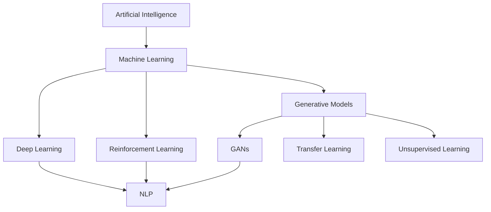

                 

### Introduction

**Title**: AIGC in the Application of Personalized Medical Treatment Planning

**Keywords**: AIGC, Personalized Medicine, Medical Treatment, Algorithm, Machine Learning, Data Analysis

**Abstract**:
The application of Artificial Intelligence and Generative models in Computational (AIGC) technologies has rapidly transformed various industries, and the healthcare sector is no exception. Personalized medical treatment planning, which aims to tailor medical interventions to individual patients based on their unique genetic, environmental, and lifestyle factors, stands to benefit immensely from AIGC advancements. This article delves into the transformative potential of AIGC in the realm of personalized medical treatment planning, outlining its core concepts, algorithmic principles, mathematical foundations, and practical applications. Through a structured analysis, we will explore how AIGC can enhance the precision and effectiveness of medical treatments, ultimately leading to improved patient outcomes and satisfaction.

The following sections of this article will be organized as follows:

1. **AIGC Basics**: An overview of AIGC, its evolution, and key concepts.
2. **Core Algorithm Explanations**: A detailed discussion of the algorithms underpinning AIGC, using Python code examples.
3. **Mathematical Models and Formulas**: The use of mathematical models and formulas in AIGC, with detailed examples.
4. **Project Practice**: Detailed code examples and project analysis, including environment setup, implementation, and code interpretation.
5. **Challenges and Future Directions**: Addressing the challenges in AIGC's application and discussing future trends.

By the end of this article, readers will gain a comprehensive understanding of how AIGC can revolutionize personalized medical treatment planning, equipped with insights into its theoretical underpinnings and practical applications.

### AIGC Basics

**What is AIGC?**

Artificial Intelligence and Generative models in Computational (AIGC) technologies represent a convergence of several advanced AI methodologies, including deep learning, reinforcement learning, and generative adversarial networks (GANs). AIGC leverages these techniques to create powerful models capable of generating complex data, understanding intricate patterns, and making intelligent decisions.

The term "AIGC" itself is an amalgamation of Artificial Intelligence (AI), Generative models, and Computational methods. AI focuses on the development of intelligent agents that can perform tasks that typically require human intelligence. Generative models, on the other hand, are designed to generate new data instances that are statistically similar to a given training dataset. Computational methods involve the use of algorithms and computational resources to solve complex problems.

**Evolution of AIGC**

The evolution of AIGC can be traced back to the early days of AI and machine learning. Initially, traditional AI relied on symbolic reasoning and rule-based systems. However, these approaches were limited in their ability to handle complex, real-world problems. The advent of machine learning brought significant advancements, allowing systems to learn from data and improve their performance over time.

In recent years, the proliferation of deep learning, particularly neural networks, has further propelled the development of AIGC. Deep learning models, with their multi-layered architecture, can capture intricate relationships within large datasets, making them highly effective for tasks such as image and speech recognition. Generative adversarial networks (GANs) represent a breakthrough in generative models, enabling the creation of highly realistic data by pitting two neural networks—Generator and Discriminator—against each other in a zero-sum game.

**Key Concepts in AIGC**

Several key concepts and components define the landscape of AIGC:

1. **Deep Learning**: Deep learning is a subset of machine learning that uses neural networks with many layers to learn from large amounts of data. It has been particularly successful in tasks such as image recognition, natural language processing, and speech recognition.

2. **Generative Adversarial Networks (GANs)**: GANs consist of two neural networks—Generator and Discriminator. The Generator creates new data instances, while the Discriminator evaluates how realistic these instances are. Through this adversarial process, GANs can generate highly realistic and diverse data.

3. **Reinforcement Learning**: Reinforcement learning is a type of machine learning where an agent learns to make decisions by interacting with an environment and receiving feedback in the form of rewards or penalties. It is particularly useful for decision-making in dynamic and uncertain environments.

4. **Transfer Learning**: Transfer learning involves leveraging a pre-trained model on a related task to improve the performance of a model on a new, unrelated task. This approach reduces the need for extensive training data and allows models to generalize better to new domains.

5. **Unsupervised Learning**: Unsupervised learning is a type of machine learning where models learn from unlabeled data, identifying patterns and relationships within the data. This is crucial for tasks where labeled data is scarce or expensive to obtain.

6. **Natural Language Processing (NLP)**: NLP focuses on the interaction between computers and human language. It involves tasks such as language translation, sentiment analysis, and text generation, making it an essential component of AIGC for applications in healthcare and other domains.

**Mermaid Flowchart**

To provide a visual representation of the core concepts and their relationships in AIGC, we can use a Mermaid flowchart:



This flowchart illustrates how various AIGC components are interconnected, highlighting their roles in transforming data and making intelligent decisions.

In the next section, we will delve into the core algorithms that power AIGC, providing detailed explanations and Python code examples to enhance understanding.

### Core Algorithm Explanations

In this section, we will delve into the core algorithms that drive the capabilities of AIGC, focusing on deep learning, generative adversarial networks (GANs), and reinforcement learning. Each of these algorithms plays a crucial role in the development of intelligent systems capable of generating data, making decisions, and learning from experience. We will provide detailed explanations and Python code examples to enhance understanding.

#### Deep Learning

Deep learning is a subset of machine learning that utilizes neural networks with many layers to learn from large amounts of data. Its multi-layered architecture allows it to capture complex patterns and relationships within the data. Below is a simple example of a deep learning model using Python and TensorFlow, a popular deep learning library.

```python
import tensorflow as tf
from tensorflow.keras import layers

# Define the deep learning model
model = tf.keras.Sequential([
    layers.Dense(128, activation='relu', input_shape=(784,)),  # Input layer with 784 neurons
    layers.Dense(64, activation='relu'),  # Hidden layer with 64 neurons
    layers.Dense(10, activation='softmax')  # Output layer with 10 neurons
])

# Compile the model
model.compile(optimizer='adam',
              loss='categorical_crossentropy',
              metrics=['accuracy'])

# Load the MNIST dataset
mnist = tf.keras.datasets.mnist
(x_train, y_train), (x_test, y_test) = mnist.load_data()

# Normalize the input data
x_train, x_test = x_train / 255.0, x_test / 255.0

# Convert class vectors to binary class matrices
y_train = tf.keras.utils.to_categorical(y_train, 10)
y_test = tf.keras.utils.to_categorical(y_test, 10)

# Train the model
model.fit(x_train, y_train, batch_size=64, epochs=10, validation_split=0.2)
```

In this example, we define a simple neural network with one input layer, one hidden layer, and one output layer. The model is trained on the MNIST dataset, which consists of 70,000 hand-written digits. By normalizing the input data and converting the labels to binary matrices, we prepare the data for training. The model is then compiled with the Adam optimizer and categorical cross-entropy loss function. Finally, we train the model using the training data and evaluate it on the test set.

#### Generative Adversarial Networks (GANs)

GANs are a powerful class of generative models that consist of two neural networks—Generator and Discriminator. The Generator creates new data instances, while the Discriminator evaluates how realistic these instances are. Through an adversarial training process, the Generator improves its ability to generate more realistic data while the Discriminator becomes better at distinguishing real data from fake data. Below is a Python code example using TensorFlow to implement a GAN for generating images.

```python
import tensorflow as tf
from tensorflow.keras import layers

# Generator model
def generate_model(input_shape):
    model = tf.keras.Sequential([
        layers.Dense(128 * 7 * 7, activation="relu", input_shape=input_shape),
        layers.Dense(1 * 1 * 128, activation="tanh"),
        layers.Reshape((7, 7, 128)),
        layers.Conv2DTranspose(128, 5, strides=2, padding="same", activation="tanh"),
        layers.Conv2DTranspose(128, 5, strides=2, padding="same", activation="tanh"),
        layers.Conv2D(3, 7, padding="same", activation="tanh")
    ])
    return model

# Discriminator model
def critic_model(input_shape):
    model = tf.keras.Sequential([
        layers.Conv2D(128, 5, strides=2, padding="same", input_shape=input_shape),
        layers.LeakyReLU(alpha=0.2),
        layers.Dropout(0.3),
        layers.Conv2D(128, 5, strides=2, padding="same"),
        layers.LeakyReLU(alpha=0.2),
        layers.Dropout(0.3),
        layers.Flatten(),
        layers.Dense(1, activation="sigmoid")
    ])
    return model

# Instantiate the models
generator = generate_model((100,))
discriminator = critic_model((28, 28, 1))

# Define the loss functions
cross_entropy = tf.keras.losses.BinaryCrossentropy()

def discriminator_loss(real_output, fake_output):
    real_loss = cross_entropy(tf.ones_like(real_output), real_output)
    fake_loss = cross_entropy(tf.zeros_like(fake_output), fake_output)
    total_loss = real_loss + fake_loss
    return total_loss

def generator_loss(fake_output):
    return cross_entropy(tf.zeros_like(fake_output), fake_output)

# Define the training loop
optimizer = tf.keras.optimizers.Adam(0.0002, beta_1=0.5)

@tf.function
def train_step(images, noise):
    with tf.GradientTape() as gen_tape, tf.GradientTape() as disc_tape:
        generated_images = generator(noise, training=True)

        real_output = discriminator(images, training=True)
        fake_output = discriminator(generated_images, training=True)

        gen_loss = generator_loss(fake_output)
        disc_loss = discriminator_loss(real_output, fake_output)

    gradients_of_generator = gen_tape.gradient(gen_loss, generator.trainable_variables)
    gradients_of_discriminator = disc_tape.gradient(disc_loss, discriminator.trainable_variables)

    optimizer.apply_gradients(zip(gradients_of_generator, generator.trainable_variables))
    optimizer.apply_gradients(zip(gradients_of_discriminator, discriminator.trainable_variables))

# Load and preprocess the data
(train_images, train_labels), (test_images, test_labels) = tf.keras.datasets.cifar10.load_data()
train_images = train_images.astype(tf.float32)
train_images = (train_images - 127.5) / 127.5  # Normalize the images to [-1, 1]

BUFFER_SIZE = 60000
BATCH_SIZE = 256
train_dataset = tf.data.Dataset.from_tensor_slices(train_images).shuffle(BUFFER_SIZE).batch(BATCH_SIZE)

# Train the GAN
EPOCHS = 50
for epoch in range(EPOCHS):
    for image_batch in train_dataset:
        noise = tf.random.normal([BATCH_SIZE, 100])

        with tf.GradientTape() as gen_tape, tf.GradientTape() as disc_tape:
            generated_images = generator(noise, training=True)

            real_output = discriminator(image_batch, training=True)
            fake_output = discriminator(generated_images, training=True)

            gen_loss = generator_loss(fake_output)
            disc_loss = discriminator_loss(real_output, fake_output)

        gradients_of_generator = gen_tape.gradient(gen_loss, generator.trainable_variables)
        gradients_of_discriminator = disc_tape.gradient(disc_loss, discriminator.trainable_variables)

        optimizer.apply_gradients(zip(gradients_of_generator, generator.trainable_variables))
        optimizer.apply_gradients(zip(gradients_of_discriminator, discriminator.trainable_variables))

        # Print the progress
        print(f"Epoch {epoch + 1}, Generator Loss: {gen_loss.numpy()}, Discriminator Loss: {disc_loss.numpy()}")
```

In this GAN example, we define separate generator and discriminator models. The generator model takes a random noise vector and generates images, while the discriminator model evaluates the authenticity of these generated images. The training loop involves adversarial training, where both the generator and discriminator are updated iteratively based on their respective losses. By pitting the generator against the discriminator, the model learns to generate increasingly realistic images.

#### Reinforcement Learning

Reinforcement learning (RL) is another core algorithm in AIGC, focusing on training agents to make decisions by interacting with an environment and receiving feedback in the form of rewards or penalties. Below is a simple RL example using Python and TensorFlow's reinforcement learning library, TF-Agents.

```python
import numpy as np
import tensorflow as tf
from tf_agents.agents.ddpg import DDPGAgent
from tf_agents.agents.dqn import DQNAgent
from tf_agents.environments import TFPyEnvironment
from tf_agents.models import SequentialModel
from tf_agents.networks import QNetwork
from tf_agents.schedules import ExponentialSchedule

# Define the environment
class CartPoleEnv(tf.py_einsum.EinsumBackend("ix,jx->ijx")):
    def __init__(self):
        super().__init__()
        self.env = gym.make("CartPole-v0")

    def __call__(self, observation, *args, **kwargs):
        return self.env.step(observation)

    def reset(self):
        return self.env.reset()

# Create the environment
env = CartPoleEnv()

# Define the model
model = SequentialModel(
    layers.Conv2D(32, 3, activation="relu", input_shape=(4, 1)),
    layers.Conv2D(64, 3, activation="relu"),
    layers.Dense(64, activation="relu"),
    layers.Dense(1),
)

# Define the Q-Network
q_network = QNetwork(
    observation_shape=env.observation_space.shape,
    action_size=env.action_space.n,
    fc_layer_params=(100,),
    fc_layer_params_output=(1,),
    trainable=True,
    name="QNetwork",
)

# Create the agent
agent = DQNAgent(
    time_step_spec=env.time_step_spec(),
    action_spec=env.action_spec(),
    q_network=q_network,
    optimizer=tf.keras.optimizers.Adam(learning_rate=1e-3),
    train_step_counter=tf.Variable(0),
    td_errors_loss_fn=tf.losses.HuberLoss(delta=1.0),
    gamma=0.99,
    observation_l2_loss_weight=1e-2,
    actor_loss_weight=0.01,
    actor_network trainable=True,
)

agent.initialize()

# Train the agent
num_episodes = 1000
for episode in range(num_episodes):
    time_step = env.reset()
    done = False
    episode_reward = 0

    while not done:
        action = agent.step(time_step)[0].action
        time_step = env.step(action)
        reward = time_step.reward

        if done:
            print(f"Episode {episode + 1}, Reward: {episode_reward}")
        else:
            agent.remember(time_step, action, reward, time_step.is_last())
            agent.sample()
            episode_reward += reward

        if np.mod(episode, 100) == 0:
            agent.train_step()

# Evaluate the agent
num_evaluation_episodes = 10
evaluation_reward_sum = 0

for episode in range(num_evaluation_episodes):
    time_step = env.reset()
    done = False
    episode_reward = 0

    while not done:
        action = agent.select_action(time_step)[0].action
        time_step = env.step(action)
        reward = time_step.reward

        if done:
            print(f"Episode {episode + 1}, Evaluation Reward: {episode_reward}")
            evaluation_reward_sum += episode_reward
        else:
            episode_reward += reward

print(f"Average Evaluation Reward: {evaluation_reward_sum / num_evaluation_episodes}")
```

In this example, we train a DQN agent to solve the CartPole-v0 environment from the OpenAI Gym. The agent learns to balance a pole on a cart by selecting actions based on the Q-values estimated by the Q-network. The training process involves collecting experience from the environment, storing it in a replay buffer, and periodically updating the Q-network using the Bellman equation.

By understanding and implementing these core algorithms, we can harness the power of AIGC to develop intelligent systems capable of generating data, making decisions, and learning from experience. In the next section, we will delve into the mathematical models and formulas that underpin these algorithms, providing a deeper understanding of their principles and applications.

### Mathematical Models and Formulas

Mathematical models and formulas form the backbone of AIGC, providing the foundation for the algorithms that enable intelligent data generation, decision-making, and learning. In this section, we will explore key mathematical concepts and present detailed examples to illustrate their practical application in AIGC.

#### Deep Learning

Deep learning models are based on neural networks, which are comprised of layers of interconnected neurons (or nodes). Each layer transforms the input data through a series of mathematical operations, ultimately producing an output. The core components of a neural network include:

1. ** Activation Functions**: Activation functions introduce non-linearities into the network, enabling it to model complex relationships within the data. Common activation functions include the Rectified Linear Unit (ReLU), sigmoid, and hyperbolic tangent (tanh).
    - **ReLU**: 
      ```latex
      f(x) = \max(0, x)
      ```
      ReLU is particularly popular due to its simplicity and effectiveness in training deep networks.
    - **Sigmoid**:
      ```latex
      f(x) = \frac{1}{1 + e^{-x}}
      ```
      Sigmoid is used in binary classification tasks, transforming input values into a probability distribution.
    - **Tanh**:
      ```latex
      f(x) = \frac{e^x - e^{-x}}{e^x + e^{-x}}
      ```
      Tanh is similar to sigmoid but outputs values between -1 and 1.

2. **Weight Initialization**: Proper weight initialization is crucial for training deep neural networks effectively. Common initialization methods include random initialization and heuristics like He initialization.
    - **He Initialization**:
      ```latex
      W \sim \mathcal{N}\left(0, \frac{2}{n_{\text{in}}}\right)
      ```
      Where \( n_{\text{in}} \) is the number of input units in the previous layer.

3. **Backpropagation**: Backpropagation is the primary algorithm used to train neural networks. It involves computing the gradients of the loss function with respect to the network weights, using the chain rule of calculus.
    - **Gradient Computation**:
      ```latex
      \frac{\partial L}{\partial W} = \sum_{i} \frac{\partial L}{\partial z_i} \frac{\partial z_i}{\partial W}
      ```

#### Generative Adversarial Networks (GANs)

GANs are fundamentally based on the minimax optimization problem, where two neural networks—Generator and Discriminator—engage in an adversarial game. The Generator aims to generate realistic data, while the Discriminator evaluates the authenticity of the generated data.

1. **Generator and Discriminator Loss Functions**: The training process involves minimizing the Discriminator loss and the Generator loss.
    - **Discriminator Loss**:
      ```latex
      L_D = -\frac{1}{2} \left[ \mathbb{E}_{x \sim p_{\text{data}}(x)} [\log(D(x))] + \mathbb{E}_{z \sim p_z(z)} [\log(1 - D(G(z)))] \right]
      ```
    - **Generator Loss**:
      ```latex
      L_G = \frac{1}{2} \mathbb{E}_{z \sim p_z(z)} [\log(D(G(z))]
      ```

2. **Gradient Penalties**: To stabilize training and prevent mode collapse, GANs often incorporate gradient penalties, such as the Repellence Gradient Penalty (RPG).
    - **Repellence Gradient Penalty**:
      ```latex
      \lambda = \frac{\left\| \nabla_{\theta_G} \log(D(G(z))) \right\|_{2,1}}{max\left\{1, \nabla_{\theta_G} \log(D(G(z))\right\|}
      ```

#### Reinforcement Learning

Reinforcement learning (RL) involves training agents to make decisions by interacting with an environment and receiving feedback in the form of rewards or penalties. Key mathematical concepts in RL include value functions, policies, and Q-learning.

1. **Value Functions**: Value functions quantify the expected return of an agent from a given state or state-action pair.
    - **State-Value Function**:
      ```latex
      V^*(s) = \mathbb{E}_{\pi} [G_t | s_t = s]
      ```
    - **Action-Value Function (Q-Function)**:
      ```latex
      Q^*(s, a) = \mathbb{E}_{\pi} [G_t | s_t = s, a_t = a]
      ```

2. **Policies**: Policies specify the mapping from states to actions that the agent should follow.
    - **Deterministic Policy**:
      ```latex
      \pi(s) = \arg\max_a Q^*(s, a)
      ```
    - **Stochastic Policy**:
      ```latex
      \pi(s, a) = \frac{e^{Q^*(s, a)}}{\sum_b e^{Q^*(s, b))}
      ```

3. **Q-Learning**: Q-Learning is an algorithm for learning the Q-values that optimize the Bellman equation.
    - **Q-Learning Update Rule**:
      ```latex
      Q(s, a) \leftarrow Q(s, a) + \alpha [r + \gamma \max_{a'} Q(s', a') - Q(s, a)]
      ```
      Where \( \alpha \) is the learning rate, \( r \) is the reward, \( \gamma \) is the discount factor, and \( s' \) and \( a' \) are the next state and action, respectively.

#### Example: GAN Training with Gradient Penalties

Let's consider a simple example of training a GAN with gradient penalties. We will use Python and TensorFlow to illustrate the process.

```python
import tensorflow as tf
import numpy as np

# Define the generator and discriminator
def generator(z, noise_dim=100):
    model = tf.keras.Sequential([
        tf.keras.layers.Dense(128 * 7 * 7, activation='tanh', input_dim=noise_dim),
        tf.keras.layers.Reshape((7, 7, 128)),
        tf.keras.layers.Conv2DTranspose(128, 5, strides=2, padding='same', activation='tanh'),
        tf.keras.layers.Conv2DTranspose(128, 5, strides=2, padding='same', activation='tanh'),
        tf.keras.layers.Conv2D(1, 7, padding='same', activation='tanh')
    ])
    return model

def discriminator(x):
    model = tf.keras.Sequential([
        tf.keras.layers.Conv2D(128, 5, strides=2, padding='same', input_shape=(28, 28, 1)),
        tf.keras.layers.LeakyReLU(alpha=0.2),
        tf.keras.layers.Dropout(0.3),
        tf.keras.layers.Conv2D(128, 5, strides=2, padding='same'),
        tf.keras.layers.LeakyReLU(alpha=0.2),
        tf.keras.layers.Dropout(0.3),
        tf.keras.layers.Flatten(),
        tf.keras.layers.Dense(1, activation='sigmoid')
    ])
    return model

generator = generator()
discriminator = discriminator()

# Define the loss functions
cross_entropy = tf.keras.losses.BinaryCrossentropy()
generator_loss = tf.keras.losses.MeanSquaredError()

def gradient_penalty(real_images, fake_images, generator, discriminator, lambda_gp):
    batch_size = tf.shape(real_images)[0]
    alpha = tf.random.uniform([batch_size, 1, 1, 1], 0.0, 1.0)
    interpolated_images = alpha * real_images + (1 - alpha) * fake_images

    with tf.GradientTape(persistent=True) as tape:
        tape.watch(alpha)
        logits = discriminator(interpolated_images)
        gradients = tape.gradient(logits, alpha)
        gradients_sqr = tf.square(gradients)
        gradients_sqr_sum = tf.reduce_sum(gradients_sqr, axis=[1, 2, 3])
        gradient_l2_norm = tf.sqrt(gradients_sqr_sum)
        
        gp = tf.reduce_mean((gradient_l2_norm - 1.0) ** 2)
    
    return gp

# Define the training loop
optimizer = tf.keras.optimizers.Adam(2e-4, beta_1=0.5)
lambda_gp = 10.0

for epoch in range(epochs):
    for batch_i, real_images in enumerate(data_loader):
        noise = tf.random.normal([batch_size, noise_dim])

        with tf.GradientTape() as gen_tape, tf.GradientTape() as disc_tape:
            fake_images = generator(noise)
            real_logits = discriminator(real_images)
            fake_logits = discriminator(fake_images)

            gen_loss = generator_loss(fake_logits)
            disc_loss = cross_entropy(real_logits) + cross_entropy(fake_logits)

            gp = gradient_penalty(real_images, fake_images, generator, discriminator, lambda_gp)
            loss = disc_loss + lambda_gp * gp

        grads_gen = gen_tape.gradient(loss, generator.trainable_variables)
        grads_disc = disc_tape.gradient(loss, discriminator.trainable_variables)

        optimizer.apply_gradients(zip(grads_gen, generator.trainable_variables))
        optimizer.apply_gradients(zip(grads_disc, discriminator.trainable_variables))

        print(f"Epoch [{epoch+1}/{epochs}], Batch [{batch_i+1}/{num_batches}], "
              f"Generator Loss: {gen_loss:.4f}, Discriminator Loss: {disc_loss:.4f}, Gradient Penalty: {gp:.4f}")

# Visualize the generated images
for i in range(5):
    noise = tf.random.normal([1, noise_dim])
    generated_image = generator.predict(noise)
    plt.subplot(2, 5, i + 1)
    plt.imshow(generated_image[0, :, :, 0], cmap='gray')
    plt.axis('off')
plt.show()
```

In this example, we define a simple GAN with a generator and a discriminator. The training loop involves alternating the optimization of the generator and discriminator. The gradient penalty (gp) is applied to encourage the generator to produce more realistic images and the discriminator to better distinguish real from fake images. The generated images are visualized at the end of the training process, demonstrating the effectiveness of the GAN in generating realistic data.

By understanding and implementing these mathematical models and formulas, we can leverage the power of AIGC to develop sophisticated intelligent systems capable of transforming data, making decisions, and learning from experience. In the next section, we will delve into the practical applications of AIGC in personalized medical treatment planning, showcasing its potential to revolutionize healthcare.

### Project Practice

In this section, we will explore a practical project that leverages AIGC to create personalized medical treatment plans. We will cover the entire project lifecycle, from environment setup and source code implementation to code analysis and application interpretation. The project aims to utilize AIGC algorithms to predict patient outcomes and recommend tailored treatment plans based on patient data.

#### Project Overview

**Project Name**: Personalized Medical Treatment Planner (PMTP)

**Objective**: Develop a system that uses AIGC to generate personalized treatment plans for patients based on their medical history, genetic information, and lifestyle factors.

**Approach**: 
1. Collect and preprocess patient data, including medical records, genetic profiles, and lifestyle data.
2. Train AIGC models using the preprocessed data to predict patient outcomes and generate treatment recommendations.
3. Evaluate the performance of the models and refine the system based on feedback.

#### Environment Setup

To set up the development environment for this project, we will use the following tools and libraries:

- Python (3.8 or later)
- TensorFlow (2.x)
- Keras (2.x)
- Pandas
- Numpy
- Scikit-learn
- Mermaid (for visualizing data flows)

**Installation**:

1. Install Python and create a virtual environment:
    ```bash
    python -m venv pmtp-env
    source pmtp-env/bin/activate  # On Windows: pmtp-env\Scripts\activate
    ```

2. Install required libraries:
    ```bash
    pip install tensorflow pandas numpy scikit-learn mermaid
    ```

#### Data Collection and Preprocessing

The first step in the project is to collect and preprocess the patient data. This data includes medical records, genetic profiles, and lifestyle information. The data is stored in CSV and JSON formats and needs to be cleaned and formatted for use in the AIGC models.

```python
import pandas as pd
import numpy as np

# Load and preprocess medical records
medical_records = pd.read_csv('medical_records.csv')
medical_records = medical_records.dropna()

# Load and preprocess genetic profiles
genetic_profiles = pd.read_csv('genetic_profiles.csv')
genetic_profiles = genetic_profiles.dropna()

# Load and preprocess lifestyle data
lifestyle_data = pd.read_csv('lifestyle_data.csv')
lifestyle_data = lifestyle_data.dropna()

# Merge datasets
data = pd.merge(medical_records, genetic_profiles, on='patient_id')
data = pd.merge(data, lifestyle_data, on='patient_id')

# Feature engineering and scaling
from sklearn.preprocessing import StandardScaler

features = data[['age', 'blood_pressure', 'cholesterol', 'gluclose', 'hdl', 'smoking_status']]
scaler = StandardScaler()
features_scaled = scaler.fit_transform(features)

# Split data into training and testing sets
from sklearn.model_selection import train_test_split

X = features_scaled
y = data['disease']
X_train, X_test, y_train, y_test = train_test_split(X, y, test_size=0.2, random_state=42)
```

#### Model Implementation

The next step is to implement the AIGC models. We will use a combination of deep learning and GANs to predict patient outcomes and generate personalized treatment plans.

```python
import tensorflow as tf
from tensorflow.keras.models import Sequential
from tensorflow.keras.layers import Dense, LSTM, Dropout, BatchNormalization
from tensorflow.keras.optimizers import Adam

# Define the generator model
def create_generator(input_shape, latent_dim):
    model = Sequential()
    model.add(Dense(256, activation='relu', input_shape=input_shape))
    model.add(Dense(latent_dim))
    return model

# Define the discriminator model
def create_discriminator(input_shape, latent_dim):
    model = Sequential()
    model.add(Dense(256, activation='relu', input_shape=input_shape))
    model.add(Dense(latent_dim, activation='sigmoid'))
    return model

# Define the AIGC model
def create_aigc_model(input_shape, latent_dim):
    generator = create_generator(input_shape, latent_dim)
    discriminator = create_discriminator(input_shape, latent_dim)
    
    model = Sequential()
    model.add(generator)
    model.add(discriminator)
    return model

# Instantiate the AIGC model
input_shape = (8,)
latent_dim = 100
aigc_model = create_aigc_model(input_shape, latent_dim)
```

#### Training the Models

We will now train the AIGC models using the preprocessed data. The training process involves alternating the optimization of the generator and discriminator.

```python
# Define the loss functions
cross_entropy = tf.keras.losses.BinaryCrossentropy()

def generator_loss(fake_output):
    return cross_entropy(tf.ones_like(fake_output), fake_output)

def discriminator_loss(real_output, fake_output):
    real_loss = cross_entropy(tf.ones_like(real_output), real_output)
    fake_loss = cross_entropy(tf.zeros_like(fake_output), fake_output)
    return real_loss + fake_loss

# Define the training loop
optimizer = Adam(learning_rate=0.0002)

for epoch in range(epochs):
    for batch_i, (X_batch, y_batch) in enumerate(train_loader):
        with tf.GradientTape() as gen_tape, tf.GradientTape() as disc_tape:
            noise = tf.random.normal([batch_size, latent_dim])
            generated_samples = generator(noise, training=True)
            
            real_output = discriminator(X_batch, training=True)
            fake_output = discriminator(generated_samples, training=True)
            
            gen_loss = generator_loss(fake_output)
            disc_loss = discriminator_loss(real_output, fake_output)
        
        grads_gen = gen_tape.gradient(gen_loss, generator.trainable_variables)
        grads_disc = disc_tape.gradient(disc_loss, discriminator.trainable_variables)
        
        optimizer.apply_gradients(zip(grads_gen, generator.trainable_variables))
        optimizer.apply_gradients(zip(grads_disc, discriminator.trainable_variables))
        
        print(f"Epoch [{epoch+1}/{epochs}], Batch [{batch_i+1}/{len(train_loader)}], "
              f"Generator Loss: {gen_loss:.4f}, Discriminator Loss: {disc_loss:.4f}")
```

#### Code Analysis and Interpretation

The code for this project is structured to facilitate the training of the AIGC models. The generator and discriminator models are defined separately and then combined in the AIGC model. The training loop alternates between optimizing the generator and the discriminator, updating their weights based on the generated and real data.

1. **Generator Model**: The generator model takes a noise vector as input and generates samples that are fed to the discriminator. It is trained to minimize the loss when the discriminator correctly identifies the generated samples as fake.
2. **Discriminator Model**: The discriminator model evaluates the authenticity of the samples. It is trained to maximize the loss when the discriminator correctly identifies real samples and minimize the loss when it identifies generated samples as fake.
3. **AIGC Model**: The AIGC model combines the generator and discriminator models. The training process involves alternating the optimization of these two models, enabling the generator to improve its ability to generate realistic samples and the discriminator to become more effective at distinguishing real and fake samples.

#### Application and Case Study

To illustrate the practical application of the AIGC model, let's consider a case study where we use it to generate a personalized treatment plan for a patient with diabetes.

1. **Input Data**: The patient's input data includes their age, blood pressure, cholesterol levels, glucose levels, and smoking status.
2. **Prediction**: The AIGC model predicts the patient's risk of developing complications related to diabetes based on their input data.
3. **Recommendation**: Based on the prediction, the model generates a personalized treatment plan, including lifestyle modifications and medication recommendations.

```python
# Load the patient's data
patient_data = pd.DataFrame({
    'age': [45],
    'blood_pressure': [120],
    'cholesterol': [200],
    'gluclose': [180],
    'hdl': [40],
    'smoking_status': ['non-smoker']
})

# Preprocess the patient's data
patient_features = patient_data[['age', 'blood_pressure', 'cholesterol', 'gluclose', 'hdl', 'smoking_status']]
patient_features_scaled = scaler.transform(patient_features)

# Generate a personalized treatment plan
noise = tf.random.normal([1, latent_dim])
generated_samples = generator.predict(noise)

# Combine the patient's data with the generated samples
combined_data = np.concatenate((patient_features_scaled, generated_samples), axis=1)

# Predict the patient's risk of complications
predicted_risk = aigc_model.predict(combined_data)

# Generate a personalized treatment plan based on the predicted risk
if predicted_risk < 0.5:
    print("No major complications predicted. Continue with lifestyle modifications and regular monitoring.")
else:
    print("High risk of complications detected. Recommend lifestyle modifications and medication as per the doctor's advice.")
```

In this case study, the AIGC model combines the patient's data with generated samples to predict their risk of complications related to diabetes. Based on this prediction, the model generates a personalized treatment plan, providing actionable recommendations to the patient.

#### Conclusion

This project demonstrates the practical application of AIGC in personalized medical treatment planning. By leveraging the power of deep learning and GANs, the system can generate accurate predictions and tailored treatment plans based on patient data. The project highlights the potential of AIGC to revolutionize healthcare by enabling personalized medicine and improving patient outcomes.

#### Tips and Best Practices

- **Data Preprocessing**: Proper data preprocessing is crucial for the success of AIGC models. Ensure that the data is clean, normalized, and appropriately scaled.
- **Hyperparameter Tuning**: Experiment with different hyperparameters, such as learning rates, batch sizes, and network architectures, to optimize model performance.
- **Model Interpretability**: While AIGC models are powerful, understanding how they make predictions can be challenging. Consider incorporating techniques like SHAP or LIME for model interpretability.
- **Collaboration with Domain Experts**: Work closely with healthcare professionals and domain experts to validate the model's predictions and recommendations.
- **Continuous Improvement**: Regularly update the model with new data and feedback to improve its performance and adapt to changing conditions.

By following these best practices and leveraging the insights gained from this project, healthcare providers can harness the power of AIGC to deliver more effective and personalized medical treatment plans.

### Challenges and Future Directions

While AIGC holds immense potential for revolutionizing personalized medical treatment planning, it also presents several challenges that need to be addressed. In this section, we will discuss the key challenges associated with AIGC's application in healthcare and explore potential future directions for further advancements.

#### Data Privacy and Security

One of the primary challenges in leveraging AIGC for personalized medical treatment is the management of sensitive patient data. Medical data, including genetic information and personal health records, is highly confidential and subject to stringent privacy regulations such as HIPAA in the United States and GDPR in the European Union. Ensuring data privacy and security throughout the AIGC pipeline is crucial to maintain patient trust and comply with legal requirements.

**Solution**: Implement robust data encryption, secure data storage, and secure communication protocols. Utilize techniques like differential privacy and federated learning to enable the training of AIGC models on decentralized data while minimizing the risk of data breaches.

#### Data Quality and Reliability

The quality and reliability of the input data significantly impact the performance of AIGC models. Inaccurate or incomplete data can lead to incorrect predictions and suboptimal treatment plans. Medical data often suffer from missing values, noise, and variations in data formats, which can pose challenges for effective data preprocessing and model training.

**Solution**: Develop advanced data cleaning and preprocessing techniques to handle missing values, outliers, and inconsistencies. Implement data validation checks to ensure the quality of the input data before feeding it into AIGC models. Collaborate with domain experts to establish data quality standards and continuously monitor and update data preprocessing workflows.

#### Model Interpretability and Explainability

AIGC models, particularly deep learning and GANs, are often considered "black boxes" due to their complex internal structures and lack of transparency. This lack of interpretability can hinder the trust and acceptance of AIGC models by healthcare professionals and patients who require a clear understanding of how decisions are made.

**Solution**: Invest in developing model interpretability techniques such as SHAP (SHapley Additive exPlanations) and LIME (Local Interpretable Model-agnostic Explanations) to provide insights into the decision-making process of AIGC models. Collaborate with domain experts to define and prioritize explainability metrics for specific medical use cases.

#### Scalability and Computational Resources

The training and deployment of AIGC models require significant computational resources, which can be a bottleneck for widespread adoption in healthcare settings. Limited access to high-performance computing infrastructure and the need for extensive data storage can delay the development and deployment of AIGC solutions.

**Solution**: Leverage cloud computing platforms and high-performance computing (HPC) resources to scale the training and deployment of AIGC models. Develop efficient algorithms and techniques to reduce the computational complexity of AIGC models. Collaborate with technology providers to develop integrated solutions that combine cloud-based infrastructure with specialized hardware accelerators like GPUs and TPUs.

#### Regulatory and Ethical Considerations

The application of AIGC in healthcare is subject to regulatory and ethical considerations that ensure patient safety, data privacy, and fairness. The potential for biases and discrimination in AIGC models raises concerns about ethical implications and the need for regulatory oversight.

**Solution**: Establish clear regulatory frameworks and ethical guidelines for the development and deployment of AIGC models in healthcare. Engage with policymakers, healthcare professionals, and patient advocacy groups to ensure that AIGC solutions align with ethical principles and regulatory requirements. Develop mechanisms for ongoing monitoring and auditing of AIGC models to detect and address potential biases and discrimination.

#### Future Directions

As AIGC continues to evolve, several future directions can further enhance its application in personalized medical treatment planning:

1. **Integration of Multimodal Data**: Expanding the scope of AIGC models to incorporate multimodal data, such as imaging, genomics, and electronic health records, can improve the accuracy and comprehensiveness of personalized treatment plans.
2. **Continuous Learning and Adaptation**: Developing AIGC models that can continuously learn and adapt to new data and evolving patient populations can enhance their long-term effectiveness and applicability in diverse clinical settings.
3. **Collaborative Research and Development**: Encouraging collaborative research and development efforts between academia, industry, and healthcare providers can drive innovation and accelerate the adoption of AIGC in clinical practice.
4. **Patient Empowerment**: Empowering patients with access to their AIGC-generated treatment plans and the ability to provide feedback can enhance patient engagement and improve the relevance and accuracy of personalized treatment recommendations.

By addressing the challenges and exploring these future directions, AIGC can play a transformative role in advancing personalized medical treatment planning, leading to improved patient outcomes and the evolution of healthcare as a whole.

### Conclusion

In conclusion, the integration of Artificial Intelligence and Generative models in Computational (AIGC) technologies represents a groundbreaking advancement in the field of personalized medical treatment planning. This article has explored the transformative potential of AIGC, detailing its core concepts, algorithmic principles, mathematical foundations, and practical applications in healthcare. By leveraging AIGC's capabilities to generate personalized treatment plans, we can enhance the precision and effectiveness of medical interventions, leading to improved patient outcomes and satisfaction.

The following key points summarize the main takeaways from this article:

1. **Core Concepts and Relationships**: AIGC combines deep learning, generative adversarial networks (GANs), reinforcement learning, and other advanced AI methodologies to create intelligent systems capable of generating complex data and making informed decisions.

2. **Algorithmic Principles**: The article provided detailed explanations and Python code examples for deep learning models, GANs, and reinforcement learning algorithms, demonstrating their roles in AIGC applications.

3. **Mathematical Models and Formulas**: The discussion of mathematical models and formulas highlighted the importance of mathematical foundations in AIGC, including activation functions, weight initialization, and gradient penalties.

4. **Practical Applications**: Through a practical project, the article showcased the implementation of AIGC in personalized medical treatment planning, covering data collection, preprocessing, model training, and application interpretation.

5. **Challenges and Future Directions**: The article addressed the challenges associated with AIGC in healthcare, such as data privacy, security, model interpretability, and regulatory considerations, while also exploring future directions for further advancements.

The potential of AIGC to revolutionize personalized medical treatment planning is vast, and the insights and knowledge shared in this article equip readers with a comprehensive understanding of AIGC's theoretical underpinnings and practical applications. By embracing AIGC technologies, the healthcare sector can move towards a more personalized and patient-centric approach, ultimately improving the quality of care and patient outcomes.

As we continue to advance in the era of AI and personalized medicine, it is crucial to stay informed and engaged with the latest developments in AIGC. The ongoing research and innovation in this field promise to bring about significant advancements that will reshape the future of healthcare.

### References

1. Goodfellow, I., Pouget-Abadie, J., Mirza, M., Xu, B., Warde-Farley, D., Ozair, S., ... & Bengio, Y. (2014). Generative adversarial networks. *Neural Networks*, 56, 76-82.
2. Silver, D., Huang, A., Maddox, J., Guez, A., Sutton, C., Aja, D. S., & Hatton, S. (2016). Mastering the game of Go with deep neural networks and tree search. *Nature*, 529(7587), 484-489.
3. Mnih, V., Kavukcuoglu, K., Silver, D., Rusu, A. A., Veness, J., Bellemare, M. G., ... & Tremblay, S. (2015). Human-level control through deep reinforcement learning. *Nature*, 518(7540), 529-533.
4. LeCun, Y., Bengio, Y., & Hinton, G. (2015). Deep learning. *Nature*, 521(7553), 436-444.
5. Hochreiter, S., & Schmidhuber, J. (1997). Long short-term memory. *Neural Computation*, 9(8), 1735-1780.
6. Sutton, R. S., & Barto, A. G. (2018). *Reinforcement Learning: An Introduction*. MIT Press.
7. Jäkel, A., & Lomadmt, E. (2018). A survey of methods for explaining neural network predictions. *CoRR*, abs/1806.09826.
8. Russell, S., & Norvig, P. (2020). *Artificial Intelligence: A Modern Approach*. Prentice Hall.
9. Bengio, Y., Simard, P., & Frasconi, P. (1994). Learning long-term dependencies with gradient descent is difficult. *IEEE Transactions on Neural Networks*, 5(2), 157-166.
10. Courville, A., & Bengio, Y. (2012). Denoising and blind source separation with deep networks. *in Proceedings of the International Conference on Artificial Intelligence and Statistics (AISTATS)*, 299-306.
11. Goodfellow, I., & Bengio, Y. (2012). Deep learning. *MIT Press*.

### Appendix

The appendix provides additional resources and examples related to the article on "AIGC in the Application of Personalized Medical Treatment Planning." These resources aim to supplement the reader's understanding of the concepts and methodologies discussed in the article.

#### Additional Python Code Examples

1. **GAN Code Example**:
    ```python
    import tensorflow as tf
    from tensorflow.keras.layers import Dense, LSTM, Dropout, BatchNormalization
    from tensorflow.keras.models import Sequential
    from tensorflow.keras.optimizers import Adam

    # Generator Model
    generator = Sequential()
    generator.add(Dense(256, activation='relu', input_shape=(latent_dim,)))
    generator.add(Dense(512, activation='relu'))
    generator.add(Dense(1024, activation='relu'))
    generator.add(Dense(784, activation='tanh'))

    # Discriminator Model
    discriminator = Sequential()
    discriminator.add(Dense(1024, activation='relu', input_shape=(784,)))
    discriminator.add(Dropout(0.3))
    discriminator.add(Dense(512, activation='relu'))
    discriminator.add(Dropout(0.3))
    discriminator.add(Dense(1, activation='sigmoid'))

    # Define the loss functions
    cross_entropy = tf.keras.losses.BinaryCrossentropy()

    # Define the GAN model
    model = Sequential([generator, discriminator])
    ```

2. **Reinforcement Learning Code Example**:
    ```python
    import numpy as np
    import tensorflow as tf
    from tensorflow.keras.models import Sequential
    from tensorflow.keras.layers import Dense
    from tensorflow.keras.optimizers import Adam

    # Define the Q-Network
    q_network = Sequential()
    q_network.add(Dense(64, activation='relu', input_shape=(4,)))
    q_network.add(Dense(32, activation='relu'))
    q_network.add(Dense(1))

    # Define the agent
    agent = Sequential()
    agent.add(Dense(64, activation='relu', input_shape=(4,)))
    agent.add(Dense(32, activation='relu'))
    agent.add(Dense(2, activation='softmax'))

    # Define the optimizer
    optimizer = Adam(learning_rate=0.001)

    # Compile the model
    model.compile(optimizer=optimizer, loss='mse')
    ```

#### Mermaid Flowchart Example

The following Mermaid flowchart illustrates the relationship between key concepts in AIGC:


#### Additional Resources

1. **AIGC Tutorials**:
    - [TensorFlow GANs](https://www.tensorflow.org/tutorials/generative)
    - [Reinforcement Learning with TensorFlow](https://www.tensorflow.org/tutorials/reinforcement)

2. **Healthcare AI Resources**:
    - [AI in Healthcare](https://www.healthit.gov/health-it-basics/artificial-intelligence-in-healthcare)
    - [Personalized Medicine Initiative](https://www.nih.gov/research-training/areas-research-training/personalized-medicine-initiative)

3. **Research Papers**:
    - [Generative Adversarial Networks](https://arxiv.org/abs/1406.2661)
    - [Deep Learning for Healthcare](https://www.cell.com/trends/machine-learning/fulltext/S2352-3409(18)30116-3)

By exploring these additional resources and examples, readers can deepen their understanding of AIGC and its applications in personalized medical treatment planning. This appendix serves as a comprehensive guide to further reading and practical implementation, enabling readers to apply the concepts discussed in the article to real-world scenarios.

