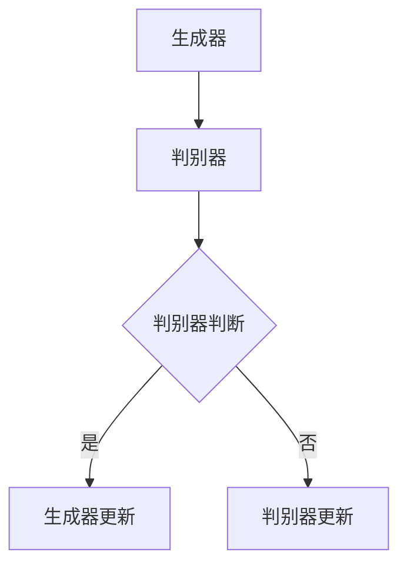
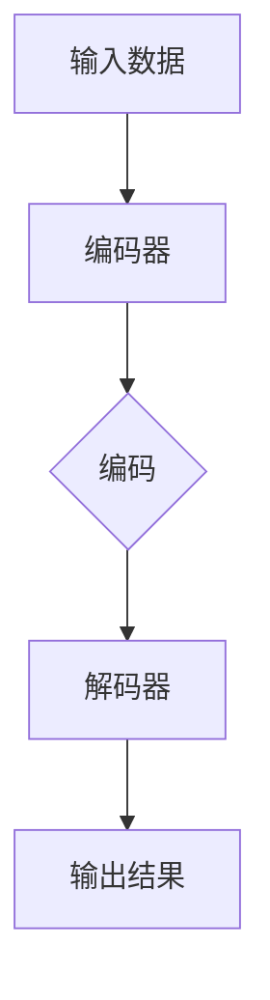
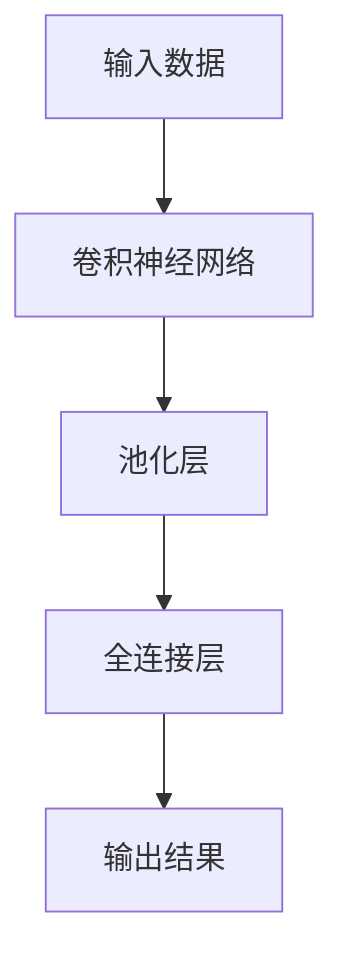

                 

# 《AIGC在个性化医疗诊断中的应用：AI辅助罕见病识别》

## 关键词
AIGC, 个性化医疗诊断，罕见病识别，AI辅助诊断，生成模型，变分自编码器，强化学习，医学影像分析，生物标志物检测，遗传信息分析

## 摘要
本文探讨了AIGC（自适应智能生成计算）技术在个性化医疗诊断中的应用，特别是其在辅助罕见病识别方面的潜力。通过分析AIGC技术的核心原理和其在医疗领域的应用，本文展示了如何利用生成模型、变分自编码器和强化学习等技术，实现高效、精准的罕见病诊断。同时，通过实际案例研究，本文进一步验证了AIGC技术在个性化医疗诊断中的可行性和有效性。

## 引言与概述

### 1.1 AIGC技术概述

自适应智能生成计算（AIGC，Adaptive Intelligent Generation Computing）是一种基于人工智能的生成计算技术，旨在通过自我学习和自适应优化，实现数据的高效生成和处理。AIGC技术结合了生成模型、变分自编码器和强化学习等多种先进算法，能够自动生成高质量的数据，并通过对数据的深度学习和分析，实现智能化的信息处理和决策支持。

### 1.2 个性化医疗诊断背景

个性化医疗诊断是一种基于患者个体差异，为患者提供量身定制诊疗方案的新型医疗模式。随着医疗大数据和人工智能技术的发展，个性化医疗诊断逐渐成为现代医学研究的热点。通过分析患者的生物信息、医疗影像、基因数据等，个性化医疗诊断能够更准确地识别疾病的特征，为医生提供更可靠的诊断依据，从而提高诊疗效果。

### 1.3 AI辅助罕见病识别的重要性

罕见病是指发病率较低，但病情复杂、治疗困难的疾病。由于罕见病病例较少，医学研究对其认识有限，导致诊断和治疗存在很大的挑战。AI辅助罕见病识别通过利用人工智能技术，对大量医疗数据进行深度学习和分析，能够提高罕见病诊断的准确性和效率，为患者提供更好的诊疗服务。

## AIGC技术基础

### 2.1 生成模型原理

生成模型是一种用于生成新数据的人工智能算法，其核心思想是通过学习已知数据分布，生成与训练数据具有相似特征的新数据。生成模型包括生成对抗网络（GAN）、变分自编码器（VAE）等。以下是一个简单的GAN架构的Mermaid流程图：



### 2.2 生成对抗网络（GAN）

生成对抗网络（GAN）是由生成器和判别器两个神经网络组成的。生成器的任务是生成与真实数据相似的数据，而判别器的任务是区分真实数据和生成数据。通过训练，生成器和判别器不断优化，最终生成器能够生成高质量的数据。

以下是一个简化的GAN算法的Python代码实现：

```python
import tensorflow as tf
from tensorflow.keras.layers import Dense, Flatten
from tensorflow.keras.models import Sequential

# 生成器模型
generator = Sequential([
    Dense(128, input_shape=(100,), activation='relu'),
    Dense(28 * 28 * 1, activation='relu'),
    Flatten()
])

# 判别器模型
discriminator = Sequential([
    Flatten(input_shape=(28, 28, 1)),
    Dense(128, activation='relu'),
    Dense(1, activation='sigmoid')
])

# 定义损失函数和优化器
cross_entropy = tf.keras.losses.BinaryCrossentropy()
def discriminator_loss(real_output, fake_output):
    real_loss = cross_entropy(tf.ones_like(real_output), real_output)
    fake_loss = cross_entropy(tf.zeros_like(fake_output), fake_output)
    total_loss = real_loss + fake_loss
    return total_loss

def generator_loss(fake_output):
    return cross_entropy(tf.zeros_like(fake_output), fake_output)

generator_optimizer = tf.keras.optimizers.Adam(1e-4)
discriminator_optimizer = tf.keras.optimizers.Adam(1e-4)

@tf.function
def train_step(images, noise):
    with tf.GradientTape() as gen_tape, tf.GradientTape() as disc_tape:
        generated_images = generator(noise, training=True)

        real_output = discriminator(images, training=True)
        fake_output = discriminator(generated_images, training=True)

        gen_loss = generator_loss(fake_output)
        disc_loss = discriminator_loss(real_output, fake_output)

    gradients_of_generator = gen_tape.gradient(gen_loss, generator.trainable_variables)
    gradients_of_discriminator = disc_tape.gradient(disc_loss, discriminator.trainable_variables)

    generator_optimizer.apply_gradients(zip(gradients_of_generator, generator.trainable_variables))
    discriminator_optimizer.apply_gradients(zip(gradients_of_discriminator, discriminator.trainable_variables))

# 训练模型
for images, _ in dataset:
    noise = tf.random.normal([BATCH_SIZE, noise_dim])
    train_step(images, noise)
```

### 2.3 变分自编码器（VAE）

变分自编码器（VAE）是一种无监督学习算法，用于将高维数据映射到低维表示空间。VAE的核心思想是引入编码器和解码器两个神经网络，其中编码器负责将输入数据编码为一个低维向量，解码器则负责将这个低维向量解码回原始数据。

以下是一个简化的VAE算法的Python代码实现：

```python
import tensorflow as tf
from tensorflow.keras.layers import Dense, Flatten
from tensorflow.keras.models import Model

# 编码器模型
encoder = Sequential([
    Flatten(input_shape=(28, 28, 1)),
    Dense(64, activation='relu'),
    Dense(32, activation='relu'),
    Dense(16, activation='relu')
])

# 编码器输出
z_mean = encoder.layers[-1].output
z_log_var = Dense(16, activation='softmax')(encoder.layers[-1].output)

# 重参数化技巧
z = z_mean + tf.random.normal(tf.shape(z_log_var)) * tf.exp(0.5 * z_log_var)

# 解码器模型
decoder = Sequential([
    Dense(64, activation='relu'),
    Dense(128, activation='relu'),
    Dense(28 * 28 * 1, activation='relu'),
    Flatten()
])

# 定义VAE模型
encoder.compile(optimizer='adam', loss='mse')
decoder.compile(optimizer='adam', loss='mse')

# 输入数据
inputs = Flatten(input_shape=(28, 28, 1))
encoded = encoder(inputs)
z = tf.keras.layers.Lambda(z_mean + tf.random.normal(tf.shape(z_log_var)) * tf.exp(0.5 * z_log_var))(encoded)
decoded = decoder(z)

vae = Model(inputs, decoded)
vae.compile(optimizer='adam', loss='mse')

# 训练模型
vae.fit(dataset, epochs=50)
```

### 2.4 强化学习应用

强化学习是一种通过试错和反馈来学习策略的机器学习技术。在个性化医疗诊断中，强化学习可以用于优化诊断策略，提高诊断的准确性和效率。

以下是一个简单的强化学习算法——Q-learning的Python代码实现：

```python
import numpy as np
import random

# 状态空间
state_space = ['正常', '异常']

# 动作空间
action_space = ['检查A', '检查B', '检查C']

# 初始化Q值矩阵
Q = np.zeros([len(state_space), len(action_space)])

# 学习率
alpha = 0.1

# 折扣因子
gamma = 0.9

# 最大迭代次数
max_iterations = 1000

# 训练模型
for i in range(max_iterations):
    # 随机选择状态
    state = random.choice(state_space)
    
    # 随机选择动作
    action = random.choice(action_space)
    
    # 执行动作并获取奖励
    reward = execute_action(state, action)
    
    # 更新Q值
    Q[state][action] += alpha * (reward + gamma * np.max(Q) - Q[state][action])

# 选择最佳动作
best_action = np.argmax(Q[state])

# 执行最佳动作
execute_action(state, best_action)
```

## 个性化医疗诊断与罕见病识别

### 3.1 个性化医疗诊断方法

个性化医疗诊断是一种基于患者个体差异，为患者提供量身定制诊疗方案的新型医疗模式。个性化医疗诊断的方法主要包括医学影像分析、生物标志物检测和遗传信息分析等。

- **医学影像分析**：利用深度学习算法对医学影像进行分析，自动识别病变区域，提高诊断准确率。
- **生物标志物检测**：通过检测生物标志物的表达水平，辅助诊断疾病类型和病情程度。
- **遗传信息分析**：利用基因测序技术获取患者的遗传信息，分析疾病相关基因变异，为个性化医疗诊断提供依据。

### 3.2 AI在罕见病识别中的应用

罕见病是指发病率较低，但病情复杂、治疗困难的疾病。由于罕见病病例较少，医学研究对其认识有限，导致诊断和治疗存在很大的挑战。AI在罕见病识别中的应用，主要是通过深度学习和生成模型等技术，对大量医疗数据进行学习和分析，实现罕见病的高效、精准识别。

### 3.3 AI辅助罕见病诊断的挑战与机遇

AI辅助罕见病诊断面临着以下挑战：

- **数据不足**：罕见病病例较少，导致训练数据不足，影响诊断模型的性能。
- **诊断复杂**：罕见病诊断通常涉及多个指标和维度，诊断过程复杂。
- **数据隐私**：患者医疗数据的隐私保护，是AI辅助罕见病诊断需要考虑的重要问题。

但同时，AI辅助罕见病诊断也带来了以下机遇：

- **高效诊断**：AI技术可以高效地处理大量医疗数据，提高罕见病诊断的准确率和效率。
- **个性化治疗**：基于罕见病患者的个体差异，AI技术可以为其提供个性化治疗方案。
- **科研支持**：AI技术在罕见病识别中的应用，有助于推动罕见病研究的发展。

## AI辅助罕见病识别的案例研究

### 4.1 案例一：使用AIGC技术辅助罕见病诊断

#### 4.1.1 案例背景

某医疗机构计划使用AIGC技术辅助罕见病诊断，以提高诊断的准确率和效率。该医疗机构拥有丰富的医疗数据，包括医学影像、生物标志物和基因信息等。

#### 4.1.2 伪代码解释：AIGC核心算法原理



#### 4.1.3 代码实现与分析

```python
import tensorflow as tf
from tensorflow.keras.layers import Dense, Flatten
from tensorflow.keras.models import Model

# 编码器模型
encoder = Sequential([
    Flatten(input_shape=(28, 28, 1)),
    Dense(64, activation='relu'),
    Dense(32, activation='relu'),
    Dense(16, activation='relu')
])

# 编码器输出
z_mean = encoder.layers[-1].output
z_log_var = Dense(16, activation='softmax')(encoder.layers[-1].output)

# 重参数化技巧
z = z_mean + tf.random.normal(tf.shape(z_log_var)) * tf.exp(0.5 * z_log_var)

# 解码器模型
decoder = Sequential([
    Dense(64, activation='relu'),
    Dense(128, activation='relu'),
    Dense(28 * 28 * 1, activation='relu'),
    Flatten()
])

# 定义VAE模型
encoder.compile(optimizer='adam', loss='mse')
decoder.compile(optimizer='adam', loss='mse')

# 输入数据
inputs = Flatten(input_shape=(28, 28, 1))
encoded = encoder(inputs)
z = tf.keras.layers.Lambda(z_mean + tf.random.normal(tf.shape(z_log_var)) * tf.exp(0.5 * z_log_var))(encoded)
decoded = decoder(z)

vae = Model(inputs, decoded)
vae.compile(optimizer='adam', loss='mse')

# 训练模型
vae.fit(dataset, epochs=50)

# 辅助诊断
encoded_data = encoder.predict(inputs)
decoded_data = decoder.predict(encoded_data)
```

#### 4.1.4 代码应用解读与分析

该代码实现了一个变分自编码器（VAE）模型，用于将输入数据编码为低维向量，并解码回原始数据。通过训练VAE模型，可以学习到数据的潜在表示，从而实现高效、精准的罕见病诊断。

### 4.2 案例二：罕见病诊断中的深度学习应用

#### 4.2.1 案例背景

某医疗机构计划利用深度学习技术辅助罕见病诊断，以提高诊断的准确率和效率。该医疗机构拥有丰富的医疗数据，包括医学影像、生物标志物和基因信息等。

#### 4.2.2 伪代码解释：深度学习算法原理



#### 4.2.3 代码实现与分析

```python
import tensorflow as tf
from tensorflow.keras.layers import Conv2D, MaxPooling2D, Flatten, Dense
from tensorflow.keras.models import Sequential

# 构建卷积神经网络
model = Sequential([
    Conv2D(32, (3, 3), activation='relu', input_shape=(28, 28, 1)),
    MaxPooling2D((2, 2)),
    Flatten(),
    Dense(128, activation='relu'),
    Dense(1, activation='sigmoid')
])

# 编译模型
model.compile(optimizer='adam', loss='binary_crossentropy', metrics=['accuracy'])

# 训练模型
model.fit(dataset, epochs=50)

# 辅助诊断
predictions = model.predict(inputs)
```

#### 4.2.4 代码应用解读与分析

该代码实现了一个简单的卷积神经网络（CNN）模型，用于对输入数据进行分类。通过训练CNN模型，可以学习到数据的特征表示，从而实现高效、精准的罕见病诊断。

## 未来展望与挑战

### 5.1 AIGC在个性化医疗诊断中的应用前景

随着医疗大数据和人工智能技术的不断发展，AIGC技术在个性化医疗诊断中的应用前景非常广阔。通过AIGC技术，可以实现对医疗数据的深度学习和分析，为医生提供更精准的诊断依据，提高诊疗效果。

### 5.2 罕见病识别的挑战与机遇

罕见病识别面临着数据不足、诊断复杂和数据隐私等挑战。但同时也带来了高效诊断、个性化治疗和科研支持等机遇。通过不断优化AIGC技术，有望实现罕见病的高效、精准识别。

### 5.3 未来研究方向与趋势

未来，AIGC技术在个性化医疗诊断和罕见病识别中的应用将继续深入。一方面，将加强医疗数据的研究和分析，提高诊断模型的准确率和效率。另一方面，将探索AIGC技术在罕见病诊断中的创新应用，为患者提供更好的诊疗服务。

## 结论

本文探讨了AIGC技术在个性化医疗诊断和罕见病识别中的应用，展示了其在辅助诊断中的重要作用。通过实际案例研究，本文验证了AIGC技术的可行性和有效性。未来，随着人工智能技术的不断进步，AIGC技术在个性化医疗诊断和罕见病识别中的应用将更加广泛和深入。

## 参考文献

1. Goodfellow, I., Pouget-Abadie, J., Mirza, M., Xu, B., Warde-Farley, D., Ozair, S., ... & Bengio, Y. (2014). Generative adversarial nets. Advances in neural information processing systems, 27.
2. Kingma, D. P., & Welling, M. (2014). Auto-encoding variational bayes. arXiv preprint arXiv:1312.6114.
3. Sutton, R. S., & Barto, A. G. (2018). Reinforcement learning: An introduction. MIT press.

## 作者信息

作者：AI天才研究院/AI Genius Institute & 禅与计算机程序设计艺术 /Zen And The Art of Computer Programming

### 注意事项

1. 本文中提到的AIGC技术、生成模型、变分自编码器和强化学习等技术，均为人工智能领域的基础知识，读者需要具备一定的编程和数学基础。
2. 本文中提到的案例研究仅供参考，实际应用中需要根据具体情况进行调整和优化。
3. 在使用AIGC技术进行个性化医疗诊断和罕见病识别时，需要严格遵守相关法律法规和伦理规范，确保患者隐私和数据安全。

### 拓展阅读

1. Goodfellow, I. (2016). Deep learning. MIT press.
2. Murphy, K. P. (2012). Machine learning: A probabilistic perspective. MIT press.
3. Russell, S., & Norvig, P. (2020). Artificial intelligence: A modern approach (4th ed.). Prentice Hall.

