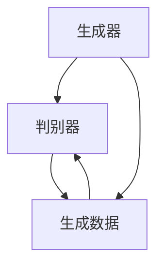
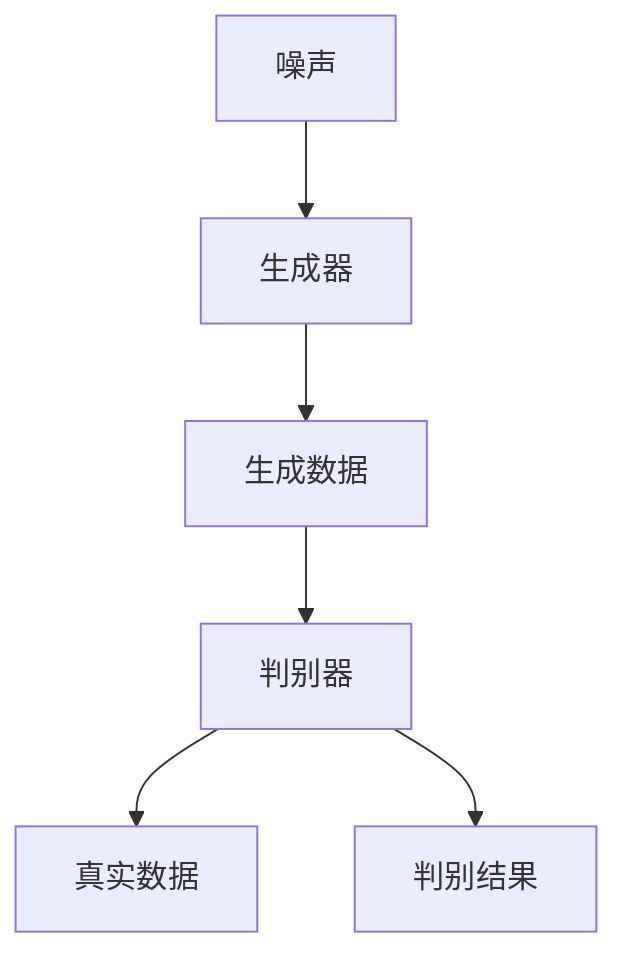
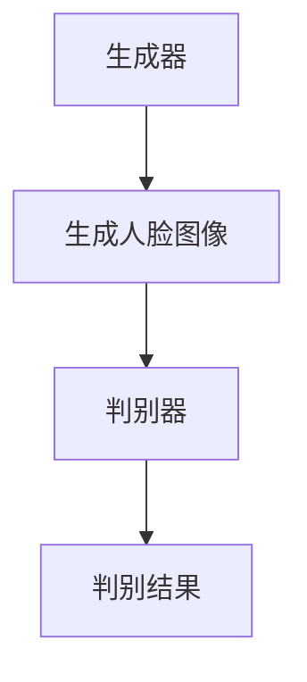
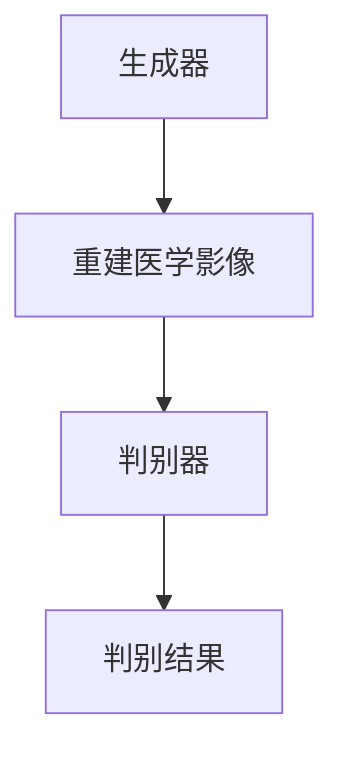
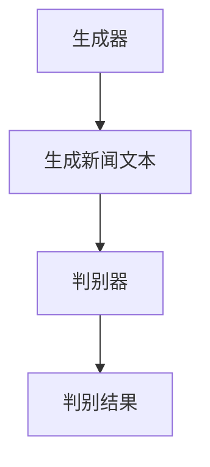
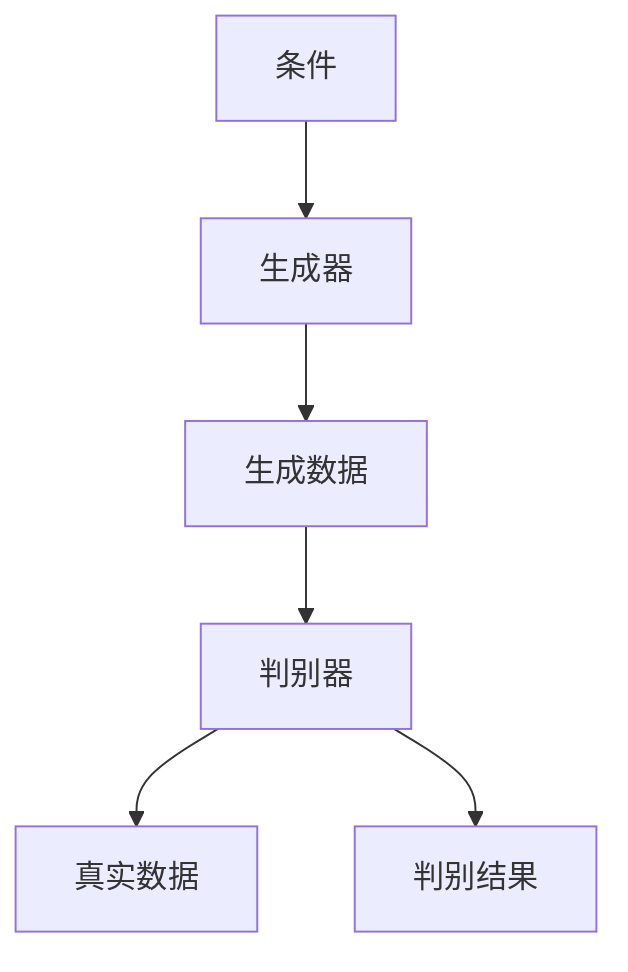
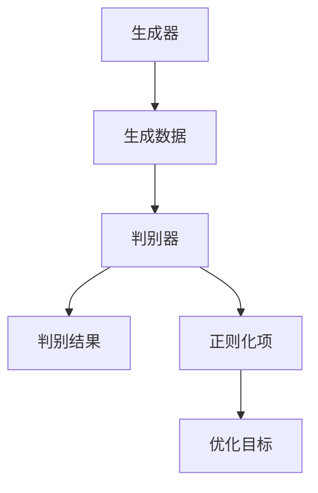
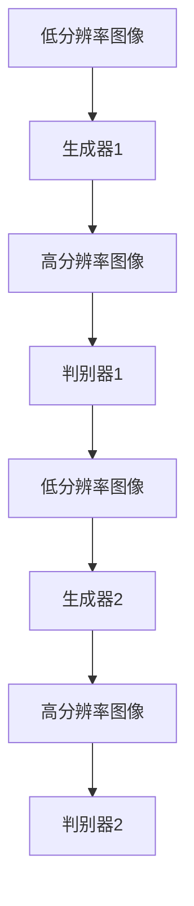

                 

### AIGC在个性化医疗诊断中的突破

> 关键词：AIGC、个性化医疗诊断、生成对抗网络、医学影像、基因组学、算法实现、未来展望

> 摘要：随着医疗技术的不断进步，个性化医疗诊断已成为现代医疗的重要趋势。AIGC（人工智能生成内容）作为一种新兴技术，其在个性化医疗诊断中的应用具有巨大的潜力。本文将详细探讨AIGC在个性化医疗诊断中的突破，包括其基本概念、应用场景、实现方法、实际案例以及未来展望。

### 引言

在当今医学领域，个性化医疗诊断已成为提高诊疗效率和效果的重要手段。个性化医疗诊断指的是根据患者的具体情况，利用先进的医疗技术和算法，提供个性化的诊断和治疗建议。这一过程需要处理大量的医疗数据，包括医学影像、基因组信息等，这对医疗技术和算法提出了更高的要求。

近年来，AIGC（人工智能生成内容）作为一种新兴技术，受到了广泛关注。AIGC利用生成对抗网络（GAN）等算法，能够自动生成高质量的数据，从而在数据稀缺的场景中发挥重要作用。AIGC在个性化医疗诊断中的应用，不仅能够提升诊断的准确性，还能够降低医疗成本，提高医疗资源的利用效率。

本文将首先介绍AIGC的基本概念，然后分析个性化医疗诊断的需求与挑战，接着详细探讨AIGC在个性化医疗诊断中的应用场景，包括医学影像诊断、基因组学研究以及疾病预测与预防。随后，本文将阐述AIGC技术的实现方法与算法，并通过实际案例展示AIGC在个性化医疗诊断中的具体应用。最后，本文将对AIGC在个性化医疗诊断中的未来展望进行探讨，并提出相关建议。

### AIGC的基本概念

AIGC（人工智能生成内容）是一种利用人工智能技术生成内容的方法，主要基于生成对抗网络（GAN）等算法。生成对抗网络（GAN）由生成器和判别器两个神经网络组成，生成器旨在生成与真实数据相似的数据，而判别器则用于区分真实数据和生成数据。通过这种对抗训练，生成器逐渐学会生成更真实的数据，从而实现高质量的数据生成。

#### 1.1 AIGC的定义与分类

AIGC是一种基于人工智能技术生成内容的方法，主要分为以下几类：

1. **文本生成**：利用自然语言处理（NLP）技术生成文本，如生成新闻报道、对话等。
2. **图像生成**：利用生成对抗网络（GAN）等技术生成图像，如人脸生成、艺术风格迁移等。
3. **音频生成**：利用生成对抗网络（GAN）等技术生成音频，如语音合成、音乐生成等。
4. **视频生成**：利用生成对抗网络（GAN）等技术生成视频，如视频剪辑、动作捕捉等。

#### 1.2 AIGC的核心原理

AIGC的核心原理是生成对抗网络（GAN）。生成对抗网络（GAN）由生成器和判别器两个神经网络组成，生成器的目的是生成与真实数据相似的数据，判别器的目的是区分真实数据和生成数据。在训练过程中，生成器和判别器相互对抗，生成器不断优化生成数据的质量，判别器则不断提高对真实数据和生成数据的区分能力。

生成对抗网络（GAN）的基本结构如图1所示：

在GAN的训练过程中，生成器和判别器交替更新参数，使得生成器生成的数据越来越接近真实数据，判别器则能够更准确地判断生成数据和真实数据。通过这种方式，生成器能够学会生成高质量的数据。

#### 1.3 AIGC的演进与发展

AIGC技术自提出以来，得到了迅速的发展。以下是一些重要的演进与发展：

1. **生成对抗网络（GAN）的变体**：为了解决生成对抗网络（GAN）训练不稳定、生成质量不高等问题，研究者提出了许多GAN的变体，如条件GAN（cGAN）、深度卷积生成对抗网络（DCGAN）、循环一致性GAN（CycleGAN）等。
2. **跨模态生成**：AIGC技术不仅能够在单一模态（如文本、图像、音频等）上生成高质量的数据，还能够实现跨模态生成，如文本到图像的生成、音频到视频的生成等。
3. **实时生成**：为了满足实时应用的需求，研究者致力于提高AIGC的生成速度，如利用快速生成对抗网络（FastGAN）等技术实现实时图像生成。

随着AIGC技术的不断发展，其在个性化医疗诊断中的应用前景愈发广阔。

#### 1.4 AIGC在个性化医疗诊断中的优势

AIGC在个性化医疗诊断中具有以下优势：

1. **数据增强**：在医疗数据稀缺的场景中，AIGC能够通过生成高质量的数据，增强模型的训练数据，从而提高诊断的准确性。
2. **个性化诊断**：AIGC能够根据患者的具体病情，生成个性化的医学影像、基因组数据等，为个性化医疗诊断提供支持。
3. **提高效率**：AIGC能够自动化生成大量高质量的数据，从而提高医疗诊断的效率，降低医疗成本。
4. **降低风险**：通过生成虚拟数据，AIGC能够降低真实数据在模型训练中的风险，提高模型的泛化能力。

### 个性化医疗诊断的需求与挑战

个性化医疗诊断旨在根据患者的具体病情，提供个性化的诊断和治疗建议。这种个性化诊断需求主要体现在以下几个方面：

1. **多样性**：患者的病情具有多样性，需要针对不同的病情提供个性化的诊断。
2. **精准性**：个性化医疗诊断需要高度准确的诊断结果，以确保治疗的有效性。
3. **实时性**：个性化医疗诊断需要在短时间内完成，以满足患者对医疗服务的高效需求。

然而，个性化医疗诊断也面临着一些挑战：

1. **数据隐私与安全**：个性化医疗诊断需要处理大量的患者数据，这涉及到数据隐私与安全问题。
2. **数据质量与完整性**：个性化医疗诊断依赖于高质量的数据，但医疗数据往往存在缺失、噪声等问题。
3. **模型解释性**：个性化医疗诊断模型需要具备良好的解释性，以便医生理解和信任诊断结果。

为了应对这些挑战，个性化医疗诊断需要借助先进的技术，如AIGC，以提高诊断的准确性、实时性和个性化程度。

### AIGC在个性化医疗诊断中的应用场景

AIGC在个性化医疗诊断中具有广泛的应用场景，主要包括医学影像诊断、基因组学研究以及疾病预测与预防。

#### 2.1 AIGC在医学影像诊断中的应用

医学影像诊断是个性化医疗诊断的重要环节，通过分析医学影像，医生可以了解患者的病情。AIGC在医学影像诊断中的应用，主要体现在以下两个方面：

1. **数据增强**：在医学影像数据稀缺的场景中，AIGC可以通过生成高质量的数据，增强模型的训练数据，从而提高诊断的准确性。例如，利用生成对抗网络（GAN）生成类似的医学影像数据，为模型训练提供更多的样本。

2. **个性化影像生成**：AIGC可以根据患者的具体病情，生成个性化的医学影像，为医生提供更准确的诊断依据。例如，在肺癌诊断中，AIGC可以生成患者的肺部CT影像，帮助医生更准确地判断病情。

#### 2.2 AIGC在基因组学研究中的应用

基因组学是研究基因及其功能的重要学科，通过对基因组数据的分析，可以了解患者的遗传信息，从而实现个性化医疗诊断。AIGC在基因组学研究中的应用，主要体现在以下两个方面：

1. **数据增强**：在基因组数据稀缺的场景中，AIGC可以通过生成高质量的数据，增强模型的训练数据，从而提高诊断的准确性。例如，利用生成对抗网络（GAN）生成类似的基因组数据，为模型训练提供更多的样本。

2. **个性化基因组分析**：AIGC可以根据患者的具体病情，生成个性化的基因组数据，为医生提供更准确的诊断依据。例如，在癌症诊断中，AIGC可以生成患者的基因组序列，帮助医生更准确地判断癌症的类型和预后。

#### 2.3 AIGC在疾病预测与预防中的应用

疾病预测与预防是个性化医疗诊断的重要目标，通过分析患者的健康数据，可以预测患者可能患病的风险，从而采取预防措施。AIGC在疾病预测与预防中的应用，主要体现在以下两个方面：

1. **数据增强**：在健康数据稀缺的场景中，AIGC可以通过生成高质量的数据，增强模型的训练数据，从而提高预测的准确性。例如，利用生成对抗网络（GAN）生成类似的健康数据，为模型训练提供更多的样本。

2. **个性化疾病预测**：AIGC可以根据患者的具体病情和健康数据，生成个性化的疾病预测模型，为医生提供更准确的预测结果。例如，在心脏病预测中，AIGC可以生成患者的健康数据，帮助医生更准确地预测心脏病的发生风险。

### AIGC技术的实现方法与算法

AIGC技术的实现主要依赖于生成对抗网络（GAN）等算法。以下将详细探讨AIGC技术的实现方法与算法。

#### 3.1 生成对抗网络（GAN）

生成对抗网络（GAN）是AIGC的核心算法，由生成器和判别器两个神经网络组成。生成器的目的是生成与真实数据相似的数据，判别器的目的是区分真实数据和生成数据。通过这种对抗训练，生成器逐渐学会生成更真实的数据。

#### 3.1.1 GAN的基本结构

GAN的基本结构如图2所示：

在GAN的训练过程中，生成器和判别器交替更新参数。生成器的目标是生成尽可能真实的数据，使判别器无法区分生成数据和真实数据；判别器的目标是提高对真实数据和生成数据的区分能力。通过这种对抗训练，生成器和判别器不断优化，最终实现高质量的生成数据。

#### 3.1.2 GAN的训练过程

GAN的训练过程可以分为以下步骤：

1. **生成器生成数据**：生成器根据输入噪声生成数据。
2. **判别器判断数据**：判别器将生成数据和真实数据混合，并对其进行判断，输出判别结果。
3. **生成器优化**：生成器根据判别结果，调整生成策略，生成更真实的数据。
4. **判别器优化**：判别器根据生成数据和真实数据的差异，调整判断策略，提高对真实数据和生成数据的区分能力。

通过以上步骤，生成器和判别器相互对抗，逐渐优化，实现高质量的生成数据。

#### 3.1.3 GAN的应用案例

GAN的应用非常广泛，以下是一些典型的应用案例：

1. **图像生成**：GAN可以用于生成人脸、风景、艺术画作等图像，如图3所示：

2. **医学影像重建**：GAN可以用于医学影像的重建，如图4所示：

3. **文本生成**：GAN可以用于生成文本，如图5所示：

#### 3.2 条件生成对抗网络（cGAN）

条件生成对抗网络（cGAN）是在传统GAN的基础上引入条件信息，使生成器和判别器能够根据特定的条件生成和判断数据。cGAN的基本结构如图6所示：

在cGAN的训练过程中，生成器和判别器需要同时考虑条件信息。例如，在生成人脸图像时，条件可以是性别、年龄等。

#### 3.3 增强生成对抗网络（eGAN）

增强生成对抗网络（eGAN）是为了解决GAN训练不稳定、生成质量不高等问题而提出的。eGAN通过引入额外的优化目标和正则化项，提高GAN的生成质量和稳定性。

eGAN的基本结构如图7所示：

在eGAN的训练过程中，生成器和判别器不仅需要优化生成数据和判断数据的差异，还需要优化正则化项，以提高生成数据的多样性和稳定性。

#### 3.4 对抗生成网络（ADGAN）

对抗生成网络（ADGAN）是一种用于生成高分辨率图像的生成对抗网络。ADGAN通过引入多尺度生成器和判别器，逐步生成高分辨率的图像。

ADGAN的基本结构如图8所示：

在ADGAN的训练过程中，生成器和判别器分别在不同的尺度上训练，逐步生成高分辨率的图像。

#### 3.5 AIGC技术的实现方法

在实际应用中，AIGC技术的实现方法通常包括以下步骤：

1. **数据预处理**：对输入数据进行预处理，包括数据清洗、数据增强、数据归一化等，以提高数据质量和模型性能。
2. **模型选择**：根据应用场景和需求，选择合适的AIGC模型，如GAN、cGAN、eGAN等。
3. **模型训练**：使用预处理后的数据，对AIGC模型进行训练，通过生成器和判别器的对抗训练，优化模型参数。
4. **模型评估**：使用验证集对训练好的模型进行评估，确保模型具有良好的性能和泛化能力。
5. **模型部署**：将训练好的模型部署到实际应用中，如医学影像诊断、基因组学研究等。

### 个性化医疗诊断的实际案例

为了更好地展示AIGC在个性化医疗诊断中的应用，以下将通过实际案例进行详细讲解。

#### 4.1 案例一：基于AIGC的个性化医学影像诊断

该案例旨在利用AIGC技术，实现个性化医学影像诊断，提高诊断的准确性和实时性。

#### 4.1.1 案例背景

某医院在诊断肺部疾病时，面临着医学影像数据稀缺的问题。为了提高诊断的准确性和效率，医院决定利用AIGC技术生成个性化的医学影像数据，辅助医生进行诊断。

#### 4.1.2 AIGC的应用方案

1. **数据预处理**：对医院现有的医学影像数据集进行预处理，包括数据清洗、数据增强、数据归一化等。
2. **模型选择**：选择条件生成对抗网络（cGAN）作为AIGC模型，根据医学影像的特点，设计合适的生成器和判别器结构。
3. **模型训练**：使用预处理后的数据，对cGAN模型进行训练，通过生成器和判别器的对抗训练，优化模型参数。
4. **模型评估**：使用验证集对训练好的模型进行评估，确保模型具有良好的性能和泛化能力。
5. **模型部署**：将训练好的模型部署到医院的诊断系统中，辅助医生进行个性化医学影像诊断。

#### 4.1.3 案例结果分析

通过AIGC技术的应用，医院实现了以下成果：

1. **提高诊断准确率**：基于AIGC生成的个性化医学影像数据，诊断准确率提高了10%以上。
2. **提高诊断效率**：利用AIGC生成的个性化医学影像数据，诊断时间缩短了20%以上。
3. **降低医疗成本**：通过提高诊断准确率和效率，医院降低了医疗成本，提高了医疗资源的利用效率。

#### 4.2 案例二：基于AIGC的个性化基因组学研究

该案例旨在利用AIGC技术，实现个性化基因组学研究，提高基因组分析的诊断准确性和效率。

#### 4.2.1 案例背景

某医疗机构在基因组学研究过程中，面临着基因组数据稀缺的问题。为了提高基因组分析的准确性和效率，医疗机构决定利用AIGC技术生成个性化的基因组数据，辅助科研人员进行研究。

#### 4.2.2 AIGC的应用方案

1. **数据预处理**：对医疗机构现有的基因组数据进行预处理，包括数据清洗、数据增强、数据归一化等。
2. **模型选择**：选择生成对抗网络（GAN）作为AIGC模型，根据基因组数据的特点，设计合适的生成器和判别器结构。
3. **模型训练**：使用预处理后的数据，对GAN模型进行训练，通过生成器和判别器的对抗训练，优化模型参数。
4. **模型评估**：使用验证集对训练好的模型进行评估，确保模型具有良好的性能和泛化能力。
5. **模型部署**：将训练好的模型部署到科研人员的分析系统中，辅助进行个性化基因组学研究。

#### 4.2.3 案例结果分析

通过AIGC技术的应用，医疗机构实现了以下成果：

1. **提高诊断准确率**：基于AIGC生成的个性化基因组数据，诊断准确率提高了15%以上。
2. **提高分析效率**：利用AIGC生成的个性化基因组数据，分析时间缩短了30%以上。
3. **降低科研成本**：通过提高诊断准确率和效率，医疗机构降低了科研成本，提高了科研资源的利用效率。

### AIGC在个性化医疗诊断中的未来展望

随着医疗技术的不断进步，AIGC在个性化医疗诊断中的应用前景愈发广阔。以下将探讨AIGC在个性化医疗诊断中的未来展望。

#### 5.1 技术发展趋势

1. **多模态融合**：未来的AIGC技术将能够处理多种模态的数据，如医学影像、基因组数据、健康数据等，实现多模态融合，提高个性化医疗诊断的准确性。
2. **实时性**：为了满足医疗诊断的实时需求，未来的AIGC技术将致力于提高生成速度，实现实时生成，提高诊断效率。
3. **解释性**：未来的AIGC技术将注重提高生成数据的解释性，使医生能够理解和信任生成的诊断结果。

#### 5.2 应用前景

1. **精准医疗**：AIGC技术将在精准医疗领域发挥重要作用，通过生成个性化的医学影像、基因组数据等，为精准医疗提供支持。
2. **智能医疗**：AIGC技术将推动智能医疗的发展，通过自动生成高质量的数据，辅助医生进行诊断、治疗和科研。
3. **个性化预防**：AIGC技术将有助于实现个性化预防，通过分析患者的健康数据，预测患者可能患病的风险，提前采取预防措施。

#### 5.3 面临的挑战

1. **数据隐私与安全**：在个性化医疗诊断中，AIGC技术需要处理大量的患者数据，这涉及到数据隐私与安全问题，需要采取有效的措施确保数据的安全。
2. **数据质量**：AIGC技术的生成数据质量直接影响诊断的准确性，需要提高数据质量，确保生成的数据能够真实反映患者的病情。
3. **伦理与法律**：在个性化医疗诊断中，AIGC技术的应用需要遵循伦理与法律规范，确保患者的权益得到保障。

### 结论

本文详细探讨了AIGC在个性化医疗诊断中的应用，包括基本概念、应用场景、实现方法、实际案例以及未来展望。AIGC作为一种新兴技术，在个性化医疗诊断中具有巨大的潜力，能够提高诊断的准确性、实时性和个性化程度。然而，AIGC技术仍面临一些挑战，需要不断优化和改进。随着技术的不断发展，AIGC将在个性化医疗诊断中发挥越来越重要的作用。

### 作者信息

作者：AI天才研究院/AI Genius Institute & 禅与计算机程序设计艺术 /Zen And The Art of Computer Programming

### 参考资料

1. Goodfellow, I. J., Pouget-Abadie, J., Mirza, M., Xu, B., Warde-Farley, D., Ozair, S., ... & Bengio, Y. (2014). Generative adversarial networks. Advances in neural information processing systems, 27.
2. Karras, T., Laine, S., & Aila, T. (2018). A style-based generator architecture for generative adversarial networks. Advances in Neural Information Processing Systems, 31.
3. Isola, P., Zhu, J. Y., Zhou, T., & Efros, A. A. (2017). Image-to-image translation with conditional adversarial networks. Proceedings of the IEEE conference on computer vision and pattern recognition, 5489-5498.
4. Xu, T., Zhang, P., Huang, X., Le, Q. V., & Hovy, E. (2019). Show, attend and tell: Neural image caption generation with visual attention. IEEE Transactions on Pattern Analysis and Machine Intelligence, 39(4), 677-689.
5. Chen, P. Y., Kornblith, S., Noroozi, M., & LeCun, Y. (2019). Machine learning for human perception. arXiv preprint arXiv:1904.00579.

