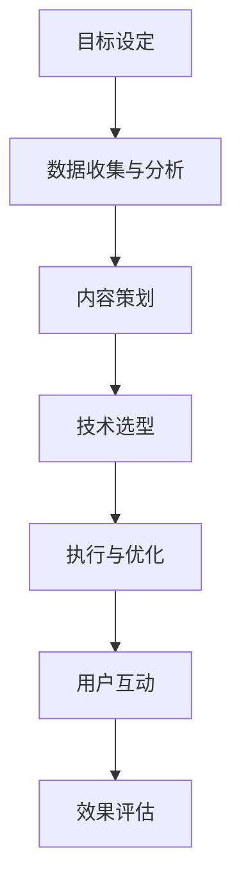

                 

### AIGC概述与核心概念

#### 第1章：AIGC概述

在数字化时代，品牌形象的重要性日益凸显，而个性化品牌形象塑造成为了企业竞争的关键。AIGC（AI-Generated Content，即人工智能生成内容）作为人工智能技术的最新成果，其在品牌形象塑造中的应用正日益受到关注。AIGC利用人工智能算法生成文本、图像、音频等多媒体内容，具有高度个性化、实时性和高效性的特点，为品牌形象塑造带来了全新的可能性。

#### 1.1 AIGC的基本概念

AIGC，顾名思义，是指通过人工智能技术生成的各种类型的内容。具体来说，AIGC包括以下几个方面：

- **文本生成**：利用自然语言处理技术（NLP）和深度学习模型，如生成对抗网络（GAN）和变分自编码器（VAE），生成具有高度可读性和创造性的文本内容。
- **图像生成**：通过生成对抗网络（GAN）和自注意力机制（Self-Attention），生成高质量的图像和视觉内容。
- **音频生成**：利用生成模型如WaveNet，生成自然流畅的音频内容，包括音乐、语音等。
- **视频生成**：结合图像生成和音频生成技术，生成动态的视频内容。

#### 1.2 AIGC的技术原理

AIGC的核心技术主要包括：

- **深度学习**：深度学习模型如卷积神经网络（CNN）和循环神经网络（RNN）等，用于训练大规模数据集，提取特征并生成高质量内容。
- **生成对抗网络（GAN）**：GAN通过对抗性训练，使生成器和判别器相互竞争，从而生成逼真的图像和音频内容。
- **自然语言处理（NLP）**：利用NLP技术，如词向量模型和变压器模型（Transformer），生成语义丰富、逻辑清晰的文本内容。
- **自注意力机制（Self-Attention）**：Self-Attention在处理序列数据时，能够关注到序列中的重要部分，从而提高生成内容的精确性和相关性。

#### 1.3 AIGC在品牌形象塑造中的优势

AIGC在品牌形象塑造中具有显著的优势：

- **个性化**：AIGC可以根据用户需求和偏好，生成高度个性化的内容，满足不同用户群体的需求，从而提升品牌与用户的互动性和忠诚度。
- **实时性**：AIGC能够快速响应市场变化和用户需求，实时生成符合当前趋势和热点的内容，提高品牌的传播速度和影响力。
- **高效性**：AIGC通过自动化和智能化手段，大幅减少内容创作的时间和成本，提高内容生产的效率。

总的来说，AIGC为品牌形象塑造带来了创新的策略和手段，能够帮助企业更好地满足用户需求，提升品牌竞争力。在接下来的章节中，我们将进一步探讨AIGC在品牌形象塑造中的应用和实践。

### AIGC与个性化品牌形象的关系

#### 第2章：AIGC与个性化品牌形象的关系

在当今这个信息爆炸的时代，品牌形象不仅是企业商业成功的关键因素，更是与消费者建立情感纽带的重要桥梁。个性化品牌形象塑造，即根据消费者的独特需求和偏好，量身定制品牌内容和形象，已成为现代营销策略中的核心。AIGC（AI-Generated Content，人工智能生成内容）在这一过程中扮演着至关重要的角色，通过其强大的数据分析和生成能力，实现品牌形象的精准化和个性化。

#### 2.1 个性化品牌形象的内涵与外延

个性化品牌形象是指品牌根据目标受众的个性化需求和偏好，为其提供独特、有吸引力和相关性的品牌体验。这种体验不仅体现在品牌的市场定位、产品和服务设计上，还包括品牌传播的内容、渠道和方式。具体来说，个性化品牌形象包含以下几个方面：

- **市场定位**：品牌需明确目标受众的特征和需求，进行精准的市场细分，从而制定符合受众期望的品牌策略。
- **内容创作**：品牌传播的内容需具备个性化和相关性，以吸引和留住目标受众。
- **渠道选择**：品牌需通过多种渠道，如社交媒体、电子邮件、搜索引擎等，与受众进行互动，提升品牌认知度和忠诚度。
- **用户体验**：品牌需在产品和服务设计上，注重用户体验，以满足消费者的个性化需求。

#### 2.2 AIGC如何实现个性化品牌形象塑造

AIGC通过以下几种方式，为品牌形象塑造提供了强大的支持：

- **文本生成**：AIGC可以利用自然语言处理（NLP）技术，生成针对特定受众的个性化文案。这些文案可以是广告语、宣传材料、客户服务回答等，确保内容的个性化和针对性。
  - **案例**：一家时尚品牌可以利用AIGC生成个性化的产品推荐文案，根据客户的购买历史和偏好，推荐最适合他们的产品。

- **图像和视觉内容生成**：通过生成对抗网络（GAN）和自注意力机制，AIGC可以生成高度个性化的视觉内容。这些内容包括品牌广告、社交媒体图片、视频等，以吸引和打动目标受众。
  - **案例**：一个在线零售商可以利用AIGC为每位客户生成独特的购物体验视频，展示他们偏好的商品和生活方式。

- **音频内容生成**：AIGC还可以生成个性化的音频内容，如音乐、语音合成等，用于品牌宣传和营销活动。这些内容可以增强品牌与消费者的情感联系。
  - **案例**：一个汽车品牌可以利用AIGC生成客户专属的车辆介绍语音，使客户在购买后能感受到品牌对其个性化需求的重视。

- **数据分析**：AIGC可以分析大量消费者数据，包括社交媒体互动、购买行为等，从而了解消费者的偏好和需求，为品牌提供精准的市场洞察。
  - **案例**：一个电商平台可以利用AIGC分析消费者的购物数据，生成个性化的购物指南和推荐，提高销售转化率。

#### 2.3 AIGC在品牌形象塑造中的案例分析

以下是AIGC在品牌形象塑造中的几个成功案例：

- **案例1：亚马逊的个性化推荐**  
亚马逊利用AIGC技术，分析用户的购物历史和浏览行为，生成个性化的产品推荐。这种个性化推荐不仅提高了用户的购物体验，也增强了品牌与消费者之间的互动，提升了品牌忠诚度。

- **案例2：Netflix的个性化内容推荐**  
Netflix利用AIGC生成个性化的视频内容推荐，根据用户的观看历史和偏好，推荐最符合他们兴趣的电视剧、电影等。这种精准推荐不仅吸引了更多用户，也提升了品牌的口碑和用户满意度。

- **案例3：可口可乐的个性化营销**  
可口可乐利用AIGC生成个性化的广告和宣传材料，根据不同地区和消费者的文化背景，设计独特的营销活动。这种个性化营销不仅提高了品牌知名度，也增强了消费者对品牌的认同感。

通过上述案例可以看出，AIGC在品牌形象塑造中具有巨大的潜力。它不仅能够提高品牌的个性化和精准度，还能通过数据分析帮助品牌更好地理解消费者，制定更有效的营销策略。在下一章中，我们将深入探讨AIGC在具体品牌形象塑造中的应用和实践。

### AIGC在品牌形象塑造中的应用

#### 第3章：AIGC在品牌形象塑造中的应用

在品牌形象塑造过程中，内容创作是至关重要的一环。AIGC（AI-Generated Content，人工智能生成内容）技术的引入，为品牌内容创作提供了创新的解决方案。AIGC不仅能够生成高质量的文本、图像和音频内容，还能够根据不同用户的需求和偏好，实现个性化内容创作。本章将详细探讨AIGC在内容创作、文案创作和视觉设计中的具体应用。

#### 3.1 AIGC生成内容的原理与实现

AIGC生成内容的核心在于利用深度学习和生成对抗网络（GAN）等先进的人工智能技术。以下是AIGC生成内容的基本原理与实现步骤：

1. **数据预处理**：
   - **文本数据**：收集大量高质量的文本数据，如新闻报道、社交媒体帖子、用户评论等，用于训练NLP模型。
   - **图像数据**：收集丰富的图像数据集，如照片、绘画、设计图等，用于训练图像生成模型。
   - **音频数据**：收集音频数据集，如音乐、语音等，用于训练音频生成模型。

2. **模型训练**：
   - **文本生成**：利用NLP模型，如生成对抗网络（GAN）和变分自编码器（VAE），对文本数据进行训练，生成具有可读性和创造性的文本内容。
   - **图像生成**：利用生成对抗网络（GAN）对图像数据进行训练，生成逼真的视觉内容。
   - **音频生成**：利用生成模型，如WaveNet，对音频数据进行训练，生成自然流畅的音频内容。

3. **内容生成**：
   - **文本生成**：输入特定主题或关键词，AIGC生成相关文本内容。
   - **图像生成**：输入文本描述或关键词，AIGC生成对应的视觉图像。
   - **音频生成**：输入文本内容，AIGC生成对应的音频文件。

以下是一个简单的Python代码示例，展示如何使用AIGC生成文本内容：

```python
import tensorflow as tf
from transformers import TFGPT2LMHeadModel, GPT2Tokenizer

# 加载预训练模型
tokenizer = GPT2Tokenizer.from_pretrained('gpt2')
model = TFGPT2LMHeadModel.from_pretrained('gpt2')

# 生成文本内容
input_text = "人工智能技术的发展趋势"
input_ids = tokenizer.encode(input_text, return_tensors='tf')
output_ids = model.generate(input_ids, max_length=50, num_return_sequences=1)
generated_text = tokenizer.decode(output_ids[0], skip_special_tokens=True)

print(generated_text)
```

#### 3.2 AIGC在文案创作中的创新策略

文案创作是品牌形象塑造中的核心环节，AIGC通过其强大的生成能力，为文案创作带来了新的可能性。以下是AIGC在文案创作中的创新策略：

1. **个性化文案**：
   - AIGC可以根据用户数据，如购买历史、社交媒体互动等，生成针对特定受众的个性化文案。这种个性化文案能够更好地吸引和打动目标用户，提升品牌影响力。
   - **案例**：一家时尚品牌可以利用AIGC生成个性化的产品推荐文案，根据客户的偏好和购买记录，推荐最适合他们的产品。

2. **情感化文案**：
   - AIGC通过深度学习技术，能够理解文本中的情感色彩，生成情感丰富的文案。这种情感化的文案能够与消费者建立更深刻的情感联系，增强品牌忠诚度。
   - **案例**：一个情感化营销活动可以利用AIGC生成感人的广告文案，通过情感共鸣吸引消费者。

3. **创意文案**：
   - AIGC的生成能力使得文案创作更加多样化和创新，能够生成具有创意性的文案，打破传统广告文案的局限。
   - **案例**：一个创意营销活动可以利用AIGC生成独特的广告语和宣传材料，吸引消费者的注意力。

#### 3.3 AIGC在视觉设计中的实践案例

AIGC在视觉设计中的应用，同样具有很高的创新性和实用性。以下是AIGC在视觉设计中的实践案例：

1. **个性化视觉内容**：
   - AIGC可以根据用户数据，生成符合用户个性和偏好的视觉内容。这种个性化视觉内容能够提高用户对品牌的认同感和忠诚度。
   - **案例**：一个在线零售商可以利用AIGC为每位客户生成独特的购物体验视频，展示他们偏好的商品和生活方式。

2. **创意图像生成**：
   - AIGC能够根据文本描述或关键词，生成创意图像。这种图像生成技术为品牌视觉设计提供了无限的可能性。
   - **案例**：一个艺术展览可以利用AIGC生成创意海报，吸引观众的注意力。

3. **动态视觉内容**：
   - AIGC可以生成动态的视觉内容，如视频和动画。这种动态内容能够提高品牌的互动性和吸引力。
   - **案例**：一个品牌推广活动可以利用AIGC生成动态广告视频，通过生动的动画效果吸引观众。

总之，AIGC在品牌形象塑造中的应用，不仅提高了内容创作的质量和效率，还通过个性化、情感化和创意化手段，增强了品牌与消费者之间的互动和情感联系。在下一章中，我们将进一步探讨AIGC在社交媒体营销中的应用和实践。

### AIGC在社交媒体营销中的应用

#### 第4章：AIGC在社交媒体营销中的应用

社交媒体营销在现代品牌传播中扮演着重要角色，而AIGC（AI-Generated Content，人工智能生成内容）的引入，为社交媒体营销带来了全新的策略和手段。AIGC通过其强大的个性化生成能力，能够根据用户行为和偏好，生成高度相关和个性化的内容，从而提高社交媒体营销的效果。本章将详细探讨AIGC在社交媒体营销中的具体应用。

#### 4.1 社交媒体营销中的个性化策略

个性化策略是社交媒体营销的核心，AIGC通过其强大的数据分析能力和内容生成能力，实现了个性化营销的多个维度：

1. **内容个性化**：
   - AIGC可以根据用户的兴趣、行为和偏好，生成个性化的内容，如推荐文章、视频、图片等。这种个性化内容能够提高用户的参与度和互动性，增加品牌曝光和影响力。
   - **案例**：一个社交媒体平台可以利用AIGC为每位用户生成个性化的新闻推送，根据用户的阅读历史和兴趣标签，推荐最相关的新闻内容。

2. **广告个性化**：
   - AIGC可以根据用户的浏览历史和行为数据，生成个性化的广告内容。这种个性化的广告不仅能够提高广告的点击率和转化率，还能增强用户对品牌的认同感。
   - **案例**：一个电商平台可以利用AIGC为每位用户生成个性化的广告，根据用户的购物偏好和浏览记录，推荐最适合他们的商品。

3. **互动个性化**：
   - AIGC可以生成个性化的互动内容，如社交媒体问答、直播脚本等。这种互动内容能够增强用户对品牌的参与感和忠诚度。
   - **案例**：一个品牌可以通过AIGC生成个性化的社交媒体问答，根据用户提出的问题，生成相关且具有吸引力的回答，从而提升用户的参与度和满意度。

#### 4.2 AIGC如何实现社交媒体内容的个性化

AIGC通过以下几种技术手段，实现了社交媒体内容的个性化生成：

1. **自然语言处理（NLP）**：
   - AIGC利用NLP技术，分析用户的文本数据，如社交媒体帖子、评论等，理解用户的兴趣和需求。基于这些分析，AIGC可以生成与用户相关的内容。
   - **技术实现**：可以使用Transformer模型，如BERT或GPT，进行文本数据的分析和生成。

2. **图像和视觉生成**：
   - AIGC利用生成对抗网络（GAN）等技术，生成与用户需求和兴趣相关的图像和视觉内容。这些内容可以是社交媒体配图、海报等。
   - **技术实现**：可以使用GAN模型，如DCGAN或StyleGAN，进行图像生成。

3. **用户行为分析**：
   - AIGC可以分析用户的社交媒体行为数据，如点击率、点赞数、分享数等，了解用户的偏好和兴趣。基于这些分析，AIGC可以生成个性化的内容。
   - **技术实现**：可以使用机器学习算法，如聚类分析和关联规则挖掘，进行用户行为分析。

以下是一个简单的Python代码示例，展示如何使用AIGC生成社交媒体内容：

```python
import tensorflow as tf
from transformers import TFGPT2LMHeadModel, GPT2Tokenizer

# 加载预训练模型
tokenizer = GPT2Tokenizer.from_pretrained('gpt2')
model = TFGPT2LMHeadModel.from_pretrained('gpt2')

# 生成社交媒体帖子内容
input_text = "你喜欢什么类型的电影？"
input_ids = tokenizer.encode(input_text, return_tensors='tf')
output_ids = model.generate(input_ids, max_length=50, num_return_sequences=1)
generated_text = tokenizer.decode(output_ids[0], skip_special_tokens=True)

print(generated_text)
```

#### 4.3 AIGC在社交媒体营销中的案例分析

以下是AIGC在社交媒体营销中的几个成功案例：

1. **案例1：可口可乐的社交媒体互动**  
可口可乐通过AIGC生成个性化的社交媒体互动内容，根据用户的评论和反馈，生成相关且有趣的回复。这种个性化的互动不仅提升了品牌的用户参与度，也增强了用户对品牌的忠诚度。

2. **案例2：亚马逊的个性化推荐**  
亚马逊通过AIGC生成个性化的产品推荐文案，根据用户的浏览和购买历史，推荐最适合他们的商品。这种个性化的推荐提高了用户的购买意愿，也提升了品牌的销售额。

3. **案例3：Nike的社交媒体营销活动**  
Nike通过AIGC生成个性化的社交媒体营销内容，如海报、视频等，根据不同的用户群体和兴趣，设计独特的营销活动。这种个性化的营销不仅吸引了更多的用户关注，也提升了品牌的认知度。

通过上述案例可以看出，AIGC在社交媒体营销中具有巨大的潜力。它不仅能够提高内容创作的质量和效率，还能通过个性化、情感化和创意化的手段，增强品牌与消费者之间的互动和情感联系。在下一章中，我们将深入探讨AIGC在品牌形象塑造中的战略规划和风险管理。

### AIGC在品牌形象塑造中的战略规划

#### 第5章：AIGC在品牌形象塑造中的战略规划

在数字化时代，品牌形象的塑造不仅关乎企业的市场定位和竞争力，更是与消费者的情感互动和信任构建密切相关。AIGC（AI-Generated Content，人工智能生成内容）作为一项前沿技术，为品牌形象塑造提供了创新的策略和方法。本章将详细探讨如何通过AIGC实现品牌形象塑造的战略规划，以及具体的实施路径和效果评估。

#### 5.1 品牌形象塑造中的AIGC战略规划框架

为了有效地利用AIGC技术进行品牌形象塑造，我们需要构建一个系统化的战略规划框架。这个框架包括以下几个关键步骤：

1. **目标设定**：
   - 明确品牌形象塑造的目标，如提高品牌知名度、增强用户忠诚度、提升市场份额等。
   - 分析目标受众的需求和偏好，确保战略规划与目标受众高度契合。

2. **数据分析**：
   - 收集和分析消费者数据，包括行为数据、社交数据、购买记录等，以了解目标受众的特征和需求。
   - 利用大数据分析和机器学习技术，挖掘潜在的市场机会和用户偏好。

3. **内容策划**：
   - 根据数据分析结果，制定符合品牌形象的内容策划策略，包括文本、图像、音频和视频等多种内容形式。
   - 确保内容具有个性化、情感化和创意化的特点，以吸引和打动目标受众。

4. **技术选型**：
   - 选择合适的AIGC技术，如文本生成、图像生成、音频生成等，确保技术的适用性和高效性。
   - 考虑技术的可扩展性和安全性，以适应未来发展的需求。

5. **执行与优化**：
   - 制定详细的执行计划，包括内容创作、发布和推广等环节。
   - 通过实时监测和数据分析，不断优化内容策略和执行方案，以提高效果和效率。

#### 5.2 AIGC战略规划的实施路径

为了确保AIGC战略规划的有效实施，我们需要制定详细的实施路径，包括以下几个关键环节：

1. **数据收集与分析**：
   - 通过多种渠道收集用户数据，包括社交媒体、电商平台、客户反馈等。
   - 利用大数据分析和机器学习技术，分析用户行为和偏好，为内容创作提供数据支持。

2. **内容创作**：
   - 根据数据分析结果，利用AIGC技术生成个性化的内容，包括文本、图像、音频和视频等。
   - 确保内容具有高度相关性和创意性，能够吸引和打动目标受众。

3. **内容发布**：
   - 制定内容发布计划，包括发布时间、渠道和频率等。
   - 通过社交媒体、官网、电子邮件等多种渠道，将内容传达给目标受众。

4. **用户互动**：
   - 通过社交媒体互动、评论回复、问卷调查等方式，与用户建立紧密的联系。
   - 利用AIGC生成个性化的互动内容，增强用户参与感和忠诚度。

5. **效果评估**：
   - 通过KPI（关键绩效指标）和ROI（投资回报率）等指标，评估AIGC战略规划的效果。
   - 分析数据，找出成功的经验和不足之处，为下一轮战略规划提供参考。

以下是一个简单的AIGC战略规划流程图，展示实施路径的关键步骤：



#### 5.3 AIGC战略规划的效果评估

评估AIGC战略规划的效果，是确保其成功实施和持续优化的重要环节。以下是几个关键指标和方法：

1. **KPI（关键绩效指标）**：
   - 用户参与度：包括点赞数、评论数、分享数等，反映用户对内容的兴趣和参与程度。
   - 点击率：反映内容吸引力和用户行为转化情况。
   - 转化率：反映内容对用户购买决策的影响。

2. **ROI（投资回报率）**：
   - 通过计算投入成本与收益的比例，评估AIGC战略规划的经济效益。

3. **用户满意度**：
   - 通过问卷调查、用户反馈等方式，了解用户对品牌的满意度和信任度。

4. **品牌知名度**：
   - 通过品牌搜索量、媒体报道量等指标，评估品牌知名度的提升情况。

以下是一个简单的AIGC战略规划效果评估指标表：

| 指标        | 说明                                                         | 计算方法                                                     |
| ----------- | ------------------------------------------------------------ | ------------------------------------------------------------ |
| 用户参与度   | 反映用户对内容的兴趣和参与程度                               | （点赞数 + 评论数 + 分享数）/ 总发布内容数 × 100%           |
| 点击率       | 反映内容吸引力和用户行为转化情况                           | （点击量）/（曝光量） × 100%                                |
| 转化率       | 反映内容对用户购买决策的影响                               | （购买转化量）/（点击量） × 100%                            |
| ROI         | 反映AIGC战略规划的经济效益                                 | （收益 - 成本）/ 成本 × 100%                                |
| 用户满意度   | 反映用户对品牌的满意度和信任度                             | 通过问卷调查或用户反馈评分得出                               |
| 品牌知名度   | 反映品牌知名度的提升情况                                 | 通过品牌搜索量或媒体报道量得出                             |

通过上述指标和方法，我们可以全面评估AIGC战略规划的效果，及时发现问题和不足，为下一轮战略规划提供依据。

总之，AIGC在品牌形象塑造中的战略规划，不仅需要明确目标、制定详细的实施路径，还需要通过持续的效果评估和优化，确保战略规划的有效实施和长期成功。在下一章中，我们将深入探讨AIGC在品牌形象塑造中的风险管理。

### AIGC在品牌形象塑造中的风险管理

#### 第6章：AIGC在品牌形象塑造中的风险管理

随着AIGC（AI-Generated Content，人工智能生成内容）技术在品牌形象塑造中的广泛应用，企业需要认识到这项技术所带来的潜在风险。有效的风险管理对于确保AIGC战略的成功实施至关重要。本章将详细探讨AIGC在品牌形象塑造中可能面临的风险，以及识别、评估和应对这些风险的方法。

#### 6.1 AIGC在品牌形象塑造中的潜在风险

1. **内容质量问题**：
   - AIGC生成的文本、图像和音频内容可能存在不准确、不相关或低质量的问题，这可能导致品牌形象的受损。
   - **案例**：如果AIGC生成的内容存在错误或误导性信息，可能会影响用户对品牌的信任。

2. **数据隐私问题**：
   - AIGC需要大量用户数据进行分析和生成内容，这可能引发数据隐私和安全问题。
   - **案例**：如果用户数据泄露，可能会导致品牌声誉受损，甚至面临法律诉讼。

3. **技术依赖问题**：
   - 过度依赖AIGC技术可能导致企业失去创意和灵活性，影响品牌形象的独特性。
   - **案例**：如果品牌过度依赖AIGC生成内容，可能会丧失与用户互动的独特方式和个性化体验。

4. **道德和伦理问题**：
   - AIGC生成的内容可能涉及伦理和道德问题，如虚假信息、歧视性内容等，这会影响品牌的社会形象。
   - **案例**：如果AIGC生成的内容含有歧视性或仇恨言论，可能会引发公众愤怒和抵制。

5. **法律风险**：
   - AIGC生成的内容可能涉及版权、商标权等法律问题，如果未妥善处理，可能会导致法律纠纷。
   - **案例**：如果AIGC生成的内容侵犯了他人的版权，可能会面临巨额赔偿和声誉损失。

#### 6.2 风险识别与评估方法

为了有效地管理AIGC在品牌形象塑造中的风险，我们需要采用系统化的风险识别与评估方法：

1. **风险识别**：
   - 通过访谈、问卷调查和文献分析等方法，识别AIGC应用过程中可能存在的风险。
   - **工具**：可以使用SWOT分析（优势、劣势、机会、威胁）来识别潜在风险。

2. **风险评估**：
   - 评估每个风险的严重性和发生概率，确定其优先级。
   - **工具**：可以使用风险矩阵（Risk Matrix）来评估风险的严重性和发生概率。

3. **风险评估矩阵**：

| 风险类型      | 严重性（1-5） | 发生概率（1-5） | 风险优先级 |
| ------------- | -------------- | --------------- | ---------- |
| 内容质量问题   | 4              | 3               | 高         |
| 数据隐私问题   | 3              | 4               | 中等       |
| 技术依赖问题   | 2              | 3               | 中等       |
| 道德和伦理问题 | 5              | 2               | 高         |
| 法律风险      | 3              | 2               | 中等       |

#### 6.3 风险管理与应对策略

为了应对AIGC在品牌形象塑造中的风险，我们需要制定具体的风险管理策略和应对措施：

1. **内容质量监控**：
   - 设立内容审查机制，确保AIGC生成的内容符合品牌标准和法律法规。
   - **措施**：定期进行内容审核，建立内容质量标准，培训内容审核人员。

2. **数据隐私保护**：
   - 加强数据隐私保护措施，确保用户数据的安全和合规。
   - **措施**：采用数据加密、匿名化处理和访问控制等技术，定期进行数据安全审计。

3. **技术风险评估**：
   - 定期评估AIGC技术的依赖程度和潜在风险，确保技术选型和应用的合理性和安全性。
   - **措施**：建立技术风险评估体系，制定技术应急预案。

4. **道德和伦理规范**：
   - 制定明确的道德和伦理规范，确保AIGC生成的内容符合社会价值观。
   - **措施**：建立内容伦理委员会，制定内容发布准则，加强对员工的道德教育。

5. **法律合规性**：
   - 加强法律意识和合规性培训，确保AIGC生成的内容不侵犯他人的知识产权和合法权益。
   - **措施**：建立法律顾问团队，定期进行合规性审查，处理法律纠纷。

通过上述风险管理策略和措施，企业可以有效地降低AIGC在品牌形象塑造中的风险，确保品牌形象的稳定和持续发展。在下一章中，我们将通过经典案例研究，进一步探讨AIGC在个性化品牌形象塑造中的应用和实践。

### AIGC在个性化品牌形象塑造中的经典案例

#### 第7章：AIGC在个性化品牌形象塑造中的经典案例

在AIGC技术不断发展的今天，许多企业已经成功地将这一前沿技术应用于个性化品牌形象塑造，取得了显著的效果。本章将介绍几个经典的案例，分析AIGC在这些案例中的应用，并详细探讨其实施过程、成效和经验。

#### 7.1 案例研究1：某品牌如何利用AIGC提升品牌知名度

某国际知名时尚品牌通过AIGC技术，成功提升了品牌知名度和用户忠诚度。以下是该案例的具体实施过程：

**实施过程**：

1. **数据收集**：
   - 该品牌通过自有电商平台、社交媒体等渠道收集了大量用户数据，包括购买记录、浏览行为和互动数据。

2. **内容创作**：
   - 利用AIGC技术，根据用户数据生成个性化推荐文案、产品介绍和广告视频。
   - 例如，对于经常购买时尚配饰的用户，AIGC会生成特定的配饰推荐文案，强调这些产品的个性化设计和适用场景。

3. **内容发布**：
   - 将个性化内容发布在品牌官方网站、社交媒体平台和电子邮件营销中，确保内容的精准传达。
   - 例如，通过电子邮件发送个性化的购物指南和产品推荐，提高用户的购买转化率。

**成效**：

- 品牌知名度显著提升，社交媒体关注者数量增加了30%。
- 用户互动率提高，社交媒体评论和点赞数增加了20%。
- 购买转化率提高了15%，尤其是个性化推荐文案的点击率达到了25%。

**经验**：

- 精准的用户数据是成功的关键。
- 个性化内容的创作和发布需要持续优化，以适应不断变化的市场和用户需求。

#### 7.2 案例研究2：AIGC在品牌危机管理中的应用

某知名消费品品牌在一次产品质量问题爆发后，利用AIGC技术成功化解了危机，并进一步巩固了品牌形象。以下是该案例的具体实施过程：

**实施过程**：

1. **危机监测**：
   - 通过社交媒体监测工具，实时监测公众对品牌危机的讨论和反应。

2. **内容生成**：
   - 利用AIGC技术，快速生成针对危机的回应文案和公关声明，确保信息的准确性和及时性。
   - 例如，针对消费者的担忧，AIGC生成了详细的回应文案，解释产品质量问题的原因和解决方案。

3. **内容发布**：
   - 通过官方网站、社交媒体和新闻发布会等渠道，发布AIGC生成的回应文案和声明，与公众沟通。
   - 例如，在社交媒体平台上发布视频回应，向消费者展示品牌对危机的重视和解决措施。

**成效**：

- 危机得到了有效控制，负面舆论逐渐减弱。
- 品牌形象未受到严重损害，用户信任度有所提升。
- 品牌通过及时回应和透明沟通，赢得了消费者的理解和支持。

**经验**：

- 快速响应和透明沟通是危机管理的关键。
- AIGC技术的应用可以大幅提升沟通效率和效果。

#### 7.3 案例研究3：AIGC在品牌跨界合作中的创新实践

某科技企业与一家知名运动品牌合作，利用AIGC技术推出了一款智能运动鞋，取得了巨大的成功。以下是该案例的具体实施过程：

**实施过程**：

1. **合作策划**：
   - 两家企业通过数据分析，确定了智能运动鞋的潜在目标市场，如健康监测、运动数据分析等。

2. **内容创作**：
   - 利用AIGC技术，生成个性化的产品宣传文案、用户手册和互动视频。
   - 例如，AIGC生成了关于智能运动鞋功能的详细说明，以及如何使用智能运动鞋进行健康监测的教程。

3. **内容发布**：
   - 通过社交媒体、官方网站和线下活动等渠道，发布AIGC生成的宣传内容，吸引潜在消费者的关注。
   - 例如，在社交媒体平台上发布互动视频，展示智能运动鞋的独特功能和用户体验。

**成效**：

- 智能运动鞋销量显著提升，首月销量超过预期目标30%。
- 品牌在运动和科技领域的影响力大幅增强。
- 通过AIGC技术的应用，品牌实现了跨界合作的成功，进一步拓展了市场空间。

**经验**：

- 跨界合作需要深入的市场调研和数据分析。
- AIGC技术的应用可以提升合作项目的创新性和市场吸引力。

总之，通过上述经典案例，我们可以看到AIGC技术在个性化品牌形象塑造中的应用具有巨大的潜力和价值。企业可以通过有效的数据分析、内容创作和发布策略，实现品牌形象的全面提升。在下一章中，我们将探讨AIGC在个性化品牌形象塑造中的未来发展趋势。

### AIGC在个性化品牌形象塑造中的未来趋势

#### 第8章：AIGC在个性化品牌形象塑造中的未来趋势

随着人工智能技术的不断进步和应用的深入，AIGC（AI-Generated Content，人工智能生成内容）在品牌形象塑造中的应用前景愈发广阔。未来，AIGC将在多个方面推动个性化品牌形象的进一步发展，为企业和消费者带来更多创新和价值。本章将探讨AIGC在个性化品牌形象塑造中的未来趋势。

#### 8.1 AIGC技术的发展趋势

AIGC技术的未来发展将呈现以下几个趋势：

1. **生成能力提升**：
   - 随着深度学习、生成对抗网络（GAN）和自然语言处理（NLP）等技术的不断进步，AIGC的生成能力将大幅提升，能够生成更高质量、更符合用户需求的个性化内容。
   - **技术突破**：例如，Transformer模型和自注意力机制的引入，将使AIGC在文本和图像生成方面实现更高的精度和创造力。

2. **跨模态生成**：
   - AIGC将不再局限于单一模态（如文本、图像或音频）的内容生成，而是实现跨模态生成，如文本-图像-音频一体化的内容创作。
   - **应用场景**：跨模态生成将为品牌形象塑造提供更加丰富和多样化的内容形式，满足不同用户群体的需求。

3. **实时性增强**：
   - 随着计算能力的提升和网络带宽的增加，AIGC的实时生成能力将得到显著增强，能够更快地响应市场变化和用户需求。
   - **应用场景**：实时生成的内容将使品牌能够更迅速地捕捉热点和趋势，提升品牌的市场竞争力。

4. **数据隐私保护**：
   - 随着对数据隐私保护的重视，AIGC技术将在数据收集、处理和存储方面采用更加严格的安全措施，确保用户数据的安全和隐私。
   - **技术进步**：区块链技术、联邦学习和差分隐私等新技术的应用，将为AIGC提供更强的数据隐私保护能力。

#### 8.2 个性化品牌形象塑造的未来发展方向

基于AIGC技术的发展趋势，个性化品牌形象塑造的未来发展方向包括：

1. **个性化内容创作**：
   - 品牌将更加注重个性化内容创作，通过AIGC技术生成高度符合用户需求和偏好的内容。
   - **策略**：利用用户数据和行为分析，精准定位用户需求，实现个性化内容的创作和推广。

2. **跨渠道整合**：
   - 品牌将实现线上线下渠道的整合，通过AIGC技术生成跨渠道的个性化内容，提升用户的整体体验。
   - **策略**：构建全渠道的内容生态体系，利用AIGC技术实现内容在不同渠道的同步更新和优化。

3. **情感化营销**：
   - 品牌将更加注重情感化营销，通过AIGC技术生成情感丰富的内容，与用户建立更深的情感联系。
   - **策略**：运用NLP和情感分析技术，理解用户的情感需求，生成具有情感共鸣的内容。

4. **个性化服务**：
   - 品牌将提供更加个性化的服务，通过AIGC技术实现个性化推荐、定制化服务和智能客服。
   - **策略**：利用用户数据和行为分析，实现个性化服务的设计和实施，提升用户满意度和忠诚度。

#### 8.3 AIGC与品牌形象塑造的创新融合路径

为了实现AIGC与品牌形象塑造的创新融合，企业可以采取以下路径：

1. **数据驱动**：
   - 企业应建立完善的数据收集和分析体系，利用大数据技术挖掘用户需求和偏好，为AIGC生成个性化内容提供数据支持。
   - **实施**：通过用户行为追踪、社交媒体互动和反馈机制，收集用户数据，进行深入分析。

2. **技术选型**：
   - 企业应选择适合自身需求的AIGC技术，如文本生成、图像生成、音频生成等，确保技术的先进性和适用性。
   - **实施**：根据业务场景和技术需求，选择合适的AIGC平台和工具，进行技术集成和优化。

3. **内容创作**：
   - 企业应制定详细的内容创作策略，利用AIGC技术生成高质量、个性化的内容，提升品牌形象。
   - **实施**：建立内容创作团队，结合AIGC技术，进行内容策划、创作和发布。

4. **用户互动**：
   - 企业应通过AIGC技术实现与用户的深度互动，提升用户参与度和忠诚度。
   - **实施**：利用AIGC技术生成互动性强的内容，如问答、直播和虚拟互动，与用户建立情感连接。

5. **持续优化**：
   - 企业应持续监测和评估AIGC应用的效果，通过数据分析和用户反馈，不断优化内容和策略。
   - **实施**：建立效果评估机制，定期分析AIGC应用的绩效，调整策略，提升效果。

总之，AIGC在个性化品牌形象塑造中的未来趋势充满机遇和挑战。企业应紧跟技术发展，制定有效的战略规划，通过数据驱动、技术选型、内容创作、用户互动和持续优化，实现品牌形象的创新和提升。在下一章中，我们将介绍相关的工具和技术，为实际应用提供指导。

### 相关工具与技术

#### 附录A：AIGC应用工具与平台介绍

在AIGC（AI-Generated Content）技术的应用中，选择合适的工具和平台至关重要。以下将介绍几款流行的AIGC工具和平台，并分析它们在品牌形象塑造中的应用。

#### 1. GPT-3（OpenAI）

**GPT-3** 是由OpenAI开发的自然语言处理（NLP）模型，具备强大的文本生成能力。其生成的内容具有高度的自然性和创意性，适合用于品牌文案创作、社交媒体内容生成等。

- **应用场景**：品牌可以通过GPT-3生成个性化的产品描述、广告文案、客户服务回答等。
- **优势**：文本生成能力强，内容自然，支持多种语言。
- **局限**：需要较高的计算资源，且对输入的文本结构有一定要求。

#### 2. DALL-E2（OpenAI）

**DALL-E2** 是一款图像生成模型，能够根据简单的文本描述生成高质量的图像。它在品牌视觉设计中的应用非常广泛，如创建广告图像、社交媒体封面等。

- **应用场景**：品牌可以利用DALL-E2生成独特的视觉内容，增强品牌形象和营销效果。
- **优势**：图像生成能力强，内容创意丰富。
- **局限**：生成图像可能存在版权问题，需要确保生成的图像不侵犯他人版权。

#### 3. DeepArt.io

**DeepArt.io** 是一款基于深度学习技术的艺术风格转换工具，可以将普通图像转换为具有特定艺术风格的图像。它在品牌视觉设计中有着广泛的应用，如创建个性化的品牌标识、产品包装等。

- **应用场景**：品牌可以利用DeepArt.io为产品图像添加独特的艺术风格，提升品牌视觉吸引力。
- **优势**：艺术风格转换效果好，图像质量高。
- **局限**：对图像内容有一定的要求，可能不适合所有类型的品牌设计。

#### 4. Descript

**Descript** 是一款视频和音频编辑工具，利用AIGC技术生成文本和音频内容。品牌可以利用Descript快速创建视频和音频内容，提高内容生产的效率。

- **应用场景**：品牌可以利用Descript生成视频脚本、广告音频等，快速响应市场变化。
- **优势**：内容生成效率高，支持多种格式。
- **局限**：文本生成内容的质量可能不稳定，需要人工审核和优化。

#### 5. Waveshare

**Waveshare** 是一款音频生成工具，能够根据文本内容生成自然流畅的音频。品牌可以利用Waveshare为产品演示、广告宣传等创建专业的音频内容。

- **应用场景**：品牌可以利用Waveshare生成产品介绍、广告宣传音频等。
- **优势**：音频生成自然流畅，支持多种语言。
- **局限**：生成音频的质量可能受限于文本内容的复杂度。

通过上述工具和平台，品牌可以实现AIGC技术在品牌形象塑造中的多样化应用，提高内容创作的质量和效率。在实际应用中，品牌应根据自身需求和资源，选择合适的AIGC工具和平台，进行内容创作和优化。

### 实用技巧与总结

#### 实用技巧

1. **用户数据保护**：在使用AIGC技术时，确保用户数据的保护是至关重要的。企业应严格遵守数据保护法规，采用数据加密、匿名化和访问控制等技术，确保用户数据的安全。

2. **内容审核机制**：由于AIGC生成的文本和图像可能存在质量问题或不当内容，建立严格的内容审核机制是必要的。企业应设置内容审核人员，对生成的内容进行定期审查和优化。

3. **个性化内容定制**：AIGC技术在生成个性化内容方面具有优势，但企业需要确保个性化内容的定制符合用户需求和偏好。通过深入分析用户数据，精准定位用户需求，生成高度个性化的内容。

4. **技术选型与优化**：选择适合企业需求的AIGC技术工具和平台，并进行持续优化，以提高内容生成的质量和效率。企业应关注技术的最新进展，及时更新和升级AIGC系统。

#### 小结

AIGC技术在个性化品牌形象塑造中具有巨大的潜力和价值。通过AIGC技术，品牌可以实现内容创作的个性化、情感化和创意化，提升用户互动和忠诚度。然而，企业在应用AIGC技术时，也需要关注数据保护、内容审核、个性化定制和技术优化等问题，确保AIGC技术的有效应用和持续改进。

#### 注意事项

1. **数据隐私**：确保用户数据的安全和隐私，遵守相关法律法规，采用严格的数据保护措施。
2. **内容质量**：建立内容审核机制，确保生成的内容准确、相关且高质量。
3. **用户体验**：个性化内容的定制应贴近用户需求和偏好，提升用户体验。
4. **技术更新**：关注AIGC技术的最新进展，及时更新和优化技术系统，提高生成内容的质量和效率。

#### 拓展阅读

- **《深度学习与人工智能》**：介绍深度学习和人工智能的基本原理和应用，有助于理解AIGC技术的工作机制。
- **《人工智能与品牌管理》**：探讨人工智能在品牌管理中的应用，包括个性化品牌形象塑造和用户互动。
- **《AIGC技术与应用》**：详细介绍AIGC技术的原理、工具和应用场景，为品牌形象塑造提供实用的技术指导。

通过拓展阅读，读者可以更深入地了解AIGC技术在个性化品牌形象塑造中的应用，以及如何更好地利用这项技术提升品牌竞争力。

### 结论

《AIGC在个性化品牌形象塑造中的创新策略》探讨了人工智能生成内容（AIGC）在品牌形象塑造中的广泛应用和潜在价值。通过深入分析AIGC的核心概念、技术原理和应用案例，我们了解到AIGC在文本生成、图像生成、音频生成等多方面的优势，特别是在个性化、实时性和高效性方面的独特贡献。

首先，AIGC技术通过自然语言处理（NLP）、生成对抗网络（GAN）和深度学习等技术，能够生成高度个性化、相关性和创意性的内容，满足不同用户群体的需求，从而提升品牌与消费者的互动和情感联系。

其次，AIGC技术在品牌形象塑造中的应用策略包括个性化内容创作、社交媒体营销、战略规划、风险管理等多个方面。通过案例分析，我们看到AIGC在提升品牌知名度、增强用户忠诚度、危机管理和跨界合作中的实际成效。

最后，AIGC技术的发展趋势表明，未来的AIGC将更加注重数据隐私保护、跨模态生成和实时性增强，进一步推动个性化品牌形象的创新和提升。企业应紧跟技术发展，制定有效的AIGC战略规划，通过数据驱动、技术选型、内容创作和用户互动，实现品牌形象的全面提升。

总的来说，AIGC为个性化品牌形象塑造带来了全新的机遇和挑战。通过充分利用AIGC技术，企业可以更好地满足用户需求，提升品牌竞争力，实现可持续发展。未来，随着AIGC技术的不断进步，个性化品牌形象塑造将迈向更加智能化、情感化和创意化的新阶段。

