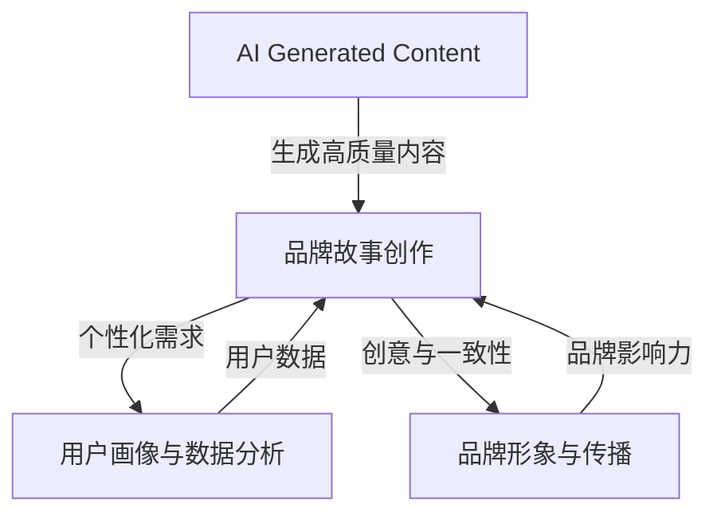

                 

### 引言

#### 1.1 书籍背景

随着人工智能技术的飞速发展，生成内容（Generated Content，GC）已经成为了各个领域中的一项关键技术。特别是在个性化品牌故事创作方面，传统的手动编写方式难以满足市场对多样性和个性化的需求。AIGC（AI Generated Content）作为一种新兴的技术，通过利用人工智能算法，尤其是深度学习技术，能够自动生成高质量、个性化的品牌故事。本书《AIGC在个性化品牌故事创作中的创新》旨在深入探讨AIGC技术在这一领域的应用与创新。

本书的主要背景源于以下几个方面的需求：

1. **市场需求的增长**：随着消费者对个性化体验的期待不断提升，品牌迫切需要能够快速、高效地生成满足不同用户需求的个性化内容。

2. **内容创作的挑战**：个性化品牌故事创作不仅要求内容的创意和独特性，还需要与品牌形象和目标受众高度匹配。人工创作的方式在效率和多样性上面临巨大挑战。

3. **技术进步的机遇**：近年来，深度学习和生成模型等人工智能技术取得了显著进展，为AIGC提供了强大的技术支持。这些技术使得自动化内容生成变得更加可行和高效。

本书将系统地介绍AIGC在个性化品牌故事创作中的创新应用，从技术原理到实际案例，全方位解析这一前沿领域。通过对AIGC技术的基本概念、核心算法、数学模型以及项目实战的详细阐述，本书旨在为读者提供一份全面、实用的指南，帮助他们在个性化品牌故事创作中发挥AIGC技术的潜力。

#### 1.2 AIGC与个性化品牌故事创作的关系

AIGC与个性化品牌故事创作之间的联系紧密，主要体现在以下几个方面：

**1. 提高创作效率**：传统品牌故事创作通常需要大量的人力和时间，而AIGC技术可以大幅提高内容生成的速度。通过深度学习和生成模型，AIGC能够在短时间内生成大量高质量的内容，从而满足快速变化的市场需求。

**2. 实现个性化定制**：个性化品牌故事的关键在于内容需要与特定受众的需求和偏好相匹配。AIGC利用大数据分析和用户画像技术，能够精准捕捉用户的兴趣和行为模式，生成高度个性化的品牌故事，提升用户体验。

**3. 确保创意与一致性**：个性化品牌故事不仅要求内容具有创意，还要与品牌形象保持一致。AIGC技术通过学习和模仿成功的品牌故事模式，确保生成的个性化内容在创意和品牌一致性上达到高标准。

**4. 降低创作成本**：传统的品牌故事创作成本较高，而AIGC技术通过自动化和规模化生产，可以显著降低内容创作的成本，为品牌提供更具竞争力的价格。

**5. 满足多样化需求**：不同的品牌和目标市场对品牌故事的需求各不相同。AIGC技术能够灵活应对这些多样化需求，生成满足不同用户群体和场景的内容，提高品牌的覆盖面和影响力。

综上所述，AIGC在个性化品牌故事创作中具有重要作用。它不仅解决了传统创作方式在效率、个性化和成本方面的局限，还为品牌提供了创新的手段，以更高效、更精准地满足市场需求。这使得AIGC技术在个性化品牌故事创作中具有重要的应用价值和发展前景。

#### 1.3 书籍结构概述

本书《AIGC在个性化品牌故事创作中的创新》共分为七个章节，每个章节都有其独特的内容和目的。以下是各章节的概述：

**第1章 引言**：介绍书籍的背景、目的和结构。通过阐述AIGC在个性化品牌故事创作中的重要性和应用前景，为后续章节的内容打下基础。

**第2章 核心概念与联系**：深入探讨AIGC和个性化品牌故事创作的基本概念，解释两者之间的联系，并展望AIGC在品牌故事创作中的应用前景。

**第3章 核心算法原理讲解**：详细讲解AIGC技术中的关键算法，如生成对抗网络（GANs）和变分自编码器（VAEs），通过Python源代码和数学模型，帮助读者理解这些算法的原理和应用。

**第4章 数学模型和数学公式讲解**：介绍与AIGC技术相关的数学模型，如损失函数和优化算法，使用latex格式进行公式表示，确保读者能够准确理解这些数学概念。

**第5章 项目实战**：通过实际项目案例，展示AIGC技术在个性化品牌故事创作中的应用。包括开发环境搭建、源代码实现和代码解读，帮助读者将理论知识转化为实际操作。

**第6章 实际案例分析**：分析两个实际案例，探讨AIGC技术在个性化品牌故事创作中的具体应用，包括案例的背景、实现过程和效果评估。

**第7章 未来发展趋势与挑战**：总结AIGC技术在个性化品牌故事创作中的发展现状和未来趋势，讨论面临的挑战和解决方案。

通过以上结构，本书旨在系统地介绍AIGC在个性化品牌故事创作中的创新应用，为读者提供全面的指导。同时，通过项目实战和案例分析，帮助读者深入理解和掌握AIGC技术的实际应用。

#### 1.3.1 各章节主要内容

为了帮助读者更好地理解本书的结构，以下是各章节的主要内容和目的：

**第1章 引言**
- **目的**：介绍书籍的背景、目的和结构，为后续内容奠定基础。
- **内容**：阐述AIGC的兴起背景，个性化品牌故事创作的重要性，以及本书的结构和各章节的主要任务。

**第2章 核心概念与联系**
- **目的**：深入探讨AIGC和个性化品牌故事创作的基本概念，解释两者之间的联系。
- **内容**：介绍AIGC的定义和类型，个性化品牌故事创作的关键要素，以及AIGC在品牌故事创作中的应用前景。

**第3章 核心算法原理讲解**
- **目的**：详细讲解AIGC技术中的关键算法，如GANs和VAEs。
- **内容**：通过Python源代码和数学模型，阐述这些算法的基本原理、优缺点以及应用实例。

**第4章 数学模型和数学公式讲解**
- **目的**：介绍与AIGC技术相关的数学模型，确保读者能够准确理解。
- **内容**：包括损失函数、优化算法等，使用latex格式进行公式表示，确保读者能够准确理解这些数学概念。

**第5章 项目实战**
- **目的**：通过实际项目案例，展示AIGC技术在个性化品牌故事创作中的应用。
- **内容**：涵盖开发环境搭建、源代码实现、代码解读，以及项目的具体应用和效果分析。

**第6章 实际案例分析**
- **目的**：分析具体案例，探讨AIGC技术的实际应用效果。
- **内容**：包括两个实际案例的背景、实现过程、效果评估和总结，帮助读者了解AIGC技术在品牌故事创作中的具体应用。

**第7章 未来发展趋势与挑战**
- **目的**：总结AIGC技术的发展现状和未来趋势，讨论面临的挑战和解决方案。
- **内容**：探讨AIGC技术在个性化品牌故事创作中的发展趋势，面临的挑战，以及可能的解决方案。

#### 1.3.2 阅读指南

为了确保读者能够有效地阅读本书，以下是一些阅读指南和建议：

1. **逐步阅读**：建议读者按照章节顺序逐步阅读，每章结束后进行复习，确保对内容有深入理解。
2. **结合实例**：在阅读过程中，注意结合实际案例，理解AIGC技术在个性化品牌故事创作中的应用。
3. **动手实践**：尝试在阅读过程中动手实现一些简单的项目，将理论知识应用到实际中。
4. **理解公式**：仔细阅读并理解各章节中的数学模型和公式，可以使用LaTeX工具验证公式的正确性。
5. **拓展学习**：阅读完本书后，可以进一步阅读相关拓展阅读，深入了解AIGC和个性化品牌故事创作的最新研究进展。
6. **反馈与交流**：如果遇到不理解或疑问的内容，可以通过反馈渠道与作者或其他读者进行交流，共同探讨和解决问题。

通过以上阅读指南，读者可以更好地掌握本书的内容，深入理解AIGC在个性化品牌故事创作中的应用，从而在相关领域取得更好的成果。

## 第2章 核心概念与联系

本章将深入探讨AIGC（AI Generated Content）的基本概念及其在个性化品牌故事创作中的应用。AIGC是一种利用人工智能技术生成内容的方法，通过深度学习模型和生成模型，能够自动创作出多样化的文本、图像、视频等。个性化品牌故事创作是指根据特定品牌和目标受众的需求，创作出具有独特个性和高度相关性的品牌故事。

### 2.1 AIGC基础概念

AIGC，即AI Generated Content，是指通过人工智能技术自动生成内容的过程。它涵盖了从简单的文本生成到复杂的图像、音频、视频等多种形式的内容创作。AIGC的核心在于利用机器学习和深度学习技术，通过训练大量的数据模型，使其能够理解和模仿人类创作的过程，从而自动生成高质量的内容。

#### AIGC的类型

AIGC可以分为以下几种类型：

1. **文本生成**：包括文章、故事、新闻、产品描述等。
2. **图像生成**：如生成艺术作品、人物肖像、风景图片等。
3. **视频生成**：包括动画、视频片段、广告等。
4. **音频生成**：如音乐、语音合成等。

每种类型的AIGC都有其独特的应用场景和挑战。

#### AIGC的技术发展历程

AIGC技术的发展可以追溯到20世纪80年代的规则系统和模板匹配技术，但真正突破性的进展是在2010年后，随着深度学习技术的崛起。特别是生成对抗网络（GANs）和变分自编码器（VAEs）等生成模型的提出，使得AIGC技术得到了显著提升。近年来，基于预训练的大规模语言模型（如GPT系列）也在文本生成领域取得了重要突破。

### 2.2 个性化品牌故事创作需求

个性化品牌故事创作是品牌营销中的一个重要环节，其核心在于根据品牌的特点和目标受众的需求，创作出具有独特个性和高度相关性的故事。这种故事不仅能够提升品牌形象，还能够增强用户对品牌的认同感和忠诚度。

#### 品牌故事的定义与特征

品牌故事是指通过叙述品牌的发展历程、核心价值观、产品特点等，来塑造品牌形象和提升品牌价值的一种方式。一个成功的品牌故事通常具备以下特征：

1. **真实性**：品牌故事需要基于真实的事件和背景，增强可信度。
2. **情感性**：情感性的故事更容易引起用户的共鸣和情感连接。
3. **独特性**：品牌故事应该体现出品牌的独特性和核心竞争力。
4. **传播性**：品牌故事需要具备良好的传播性，能够在社交媒体和用户中广泛传播。

#### 个性化品牌故事创作的关键要素

1. **用户画像**：通过用户画像技术，了解目标受众的年龄、性别、兴趣、行为习惯等，确保品牌故事能够满足目标受众的需求和兴趣。
2. **数据驱动**：利用大数据分析技术，挖掘用户的行为数据和市场趋势，为品牌故事创作提供数据支持。
3. **创意性**：创意性的故事能够吸引和留住用户的注意力，提升品牌影响力。
4. **技术支持**：AIGC技术为个性化品牌故事创作提供了强大的技术支持，通过自动化生成和个性化定制，提高创作效率和故事质量。

### 2.3 AIGC在品牌故事创作中的应用前景

AIGC技术在品牌故事创作中具有广泛的应用前景，主要体现在以下几个方面：

1. **提高创作效率**：传统的品牌故事创作方式耗时较长，而AIGC技术能够大幅提高创作速度，满足快速变化的市场需求。
2. **实现个性化定制**：通过AIGC技术，可以根据用户画像和市场数据，生成高度个性化的品牌故事，提升用户体验和满意度。
3. **确保创意与一致性**：AIGC技术能够学习和模仿成功的品牌故事模式，确保生成的个性化故事在创意和品牌一致性上达到高标准。
4. **降低创作成本**：AIGC技术通过自动化和规模化生产，可以显著降低品牌故事创作的成本，为品牌提供更具竞争力的价格。
5. **满足多样化需求**：不同的品牌和目标市场对品牌故事的需求各不相同，AIGC技术能够灵活应对这些多样化需求，生成满足不同用户群体和场景的内容。

#### 应用场景分析

1. **营销活动**：通过AIGC技术生成个性化的营销文案和故事，提升营销活动的效果和用户参与度。
2. **客户服务**：利用AIGC技术自动生成客户服务文档、指南和故事，提高客户服务的质量和效率。
3. **产品推广**：通过生成与产品特点高度相关的品牌故事，提升产品的认知度和销售转化率。
4. **品牌传播**：利用AIGC技术生成具有创意性和传播性的品牌故事，通过社交媒体和平台传播，扩大品牌影响力。

#### 创新点与挑战

**创新点**：

1. **自动化创作**：AIGC技术实现了品牌故事创作的自动化，大幅提高了创作效率和多样性。
2. **个性化定制**：通过用户画像和数据驱动，实现高度个性化的品牌故事创作，满足不同受众的需求。
3. **创意多样性**：AIGC技术能够生成多样化的品牌故事，满足不同品牌和市场的需求。

**挑战**：

1. **数据质量和隐私**：个性化品牌故事创作依赖于用户数据的收集和使用，数据质量和隐私保护成为重要挑战。
2. **创作质量控制**：如何保证自动生成的品牌故事在质量和创意性上达到预期，仍需要进一步研究和优化。
3. **技术复杂度**：AIGC技术涉及多个复杂算法和模型，技术实现和优化需要高水平的技术支持和经验。

总之，AIGC技术在个性化品牌故事创作中具有巨大的应用潜力，但也面临一系列挑战。通过不断的技术创新和优化，AIGC有望在品牌故事创作领域发挥更加重要的作用。

### 图解：AIGC与个性化品牌故事创作的关系

为了更直观地理解AIGC与个性化品牌故事创作之间的关系，我们可以通过以下Mermaid流程图进行图解：



**解释**：

1. **AIGC生成高质量内容**：AIGC技术通过深度学习和生成模型，能够自动生成高质量的文本、图像、视频等，为品牌故事创作提供丰富、多样化的内容素材。

2. **用户画像与数据分析**：通过用户画像和大数据分析，AIGC能够捕捉用户的兴趣和需求，为个性化品牌故事创作提供数据支持，确保内容与目标受众高度相关。

3. **品牌形象与传播**：AIGC技术生成的个性化品牌故事不仅能够提升品牌形象，还能够通过社交媒体和平台传播，扩大品牌影响力。

4. **反馈循环**：用户的数据和反馈可以持续优化AIGC技术，使其更好地满足个性化需求，从而形成一个不断优化的创作和传播循环。

通过以上图解，我们可以更清晰地理解AIGC与个性化品牌故事创作之间的关系，以及它们如何共同推动品牌营销和用户体验的提升。

### 核心算法原理讲解

在AIGC（AI Generated Content）技术中，核心算法的原理和实现是其关键组成部分。以下将重点介绍两种重要的生成模型：生成对抗网络（GANs）和变分自编码器（VAEs），并使用Python源代码进行详细讲解和示例说明。

#### 3.1 生成对抗网络（GANs）

生成对抗网络（GANs）是由Ian Goodfellow等人于2014年提出的，其核心思想是利用生成器（Generator）和判别器（Discriminator）之间的对抗关系，生成逼真的数据。

**3.1.1 GANs的基本原理**

GANs由两部分组成：生成器G和判别器D。生成器的任务是生成与真实数据相似的数据，判别器的任务是区分生成器生成的数据与真实数据。两者通过对抗训练相互优化：

1. **生成器G**：从噪声z中生成假数据G(z)。
2. **判别器D**：接受真实数据x和生成器生成的假数据G(z)，并尝试区分两者。

GAN的训练过程如下：

1. **初始化生成器和判别器**。
2. **生成器生成假数据G(z)**。
3. **判别器D对真实数据和假数据进行分类**。
4. **通过反向传播更新判别器D的参数**。
5. **通过反向传播更新生成器G的参数**。

**3.1.2 伪代码和Python示例**

```python
import tensorflow as tf
from tensorflow.keras.models import Model
from tensorflow.keras.layers import Dense, Flatten, Reshape, Input

# 定义生成器G
z_dim = 100
gen_input = Input(shape=(z_dim,))
x_recon = Dense(256, activation='relu')(gen_input)
x_recon = Dense(512, activation='relu')(x_recon)
x_recon = Dense(784)(x_recon)
x_recon = Reshape((28, 28, 1))(x_recon)
generator = Model(inputs=gen_input, outputs=x_recon)

# 定义判别器D
disc_input = Input(shape=(28, 28, 1))
disc_output = Dense(1, activation='sigmoid')( Flatten()(disc_input) )
discriminator = Model(inputs=disc_input, outputs=disc_output)

# 定义GAN模型
gan_input = Input(shape=(z_dim,))
x_fake = generator(gan_input)
disc_fake = discriminator(x_fake)
gan_output = discriminator(discriminator(input_image))

gan_model = Model(inputs=gan_input, outputs=disc_fake)
gan_model.compile(optimizer='adam', loss='binary_crossentropy')

# 训练GAN模型
discriminator.compile(optimizer='adam', loss='binary_crossentropy')
for epoch in range(num_epochs):
    z = np.random.normal(size=(batch_size, z_dim))
    x_fake = generator.predict(z)
    x_real = np.random.choice(real_images, size=batch_size)
    x = np.concatenate([x_real, x_fake])
    y = np.zeros(2*batch_size)
    y[batch_size:] = 1
    discriminator.train_on_batch(x, y)
    z = np.random.normal(size=(batch_size, z_dim))
    x_fake = generator.predict(z)
    y = np.ones(batch_size)
    gan_model.train_on_batch(z, y)
```

**3.1.3 优点与局限**

**优点**：
1. **生成数据质量高**：GANs能够生成高度真实的数据，在图像、视频等领域取得了显著成果。
2. **灵活性强**：GANs适用于多种类型的数据生成，包括图像、文本、音频等。

**局限**：
1. **训练难度大**：GANs的训练过程不稳定，容易出现模式崩溃（mode collapse）问题。
2. **计算资源需求高**：由于GANs的训练需要大量的计算资源，训练时间较长。

#### 3.2 变分自编码器（VAEs）

变分自编码器（VAEs）是另一种重要的生成模型，由Vincent et al. 在2013年提出。与GANs不同，VAEs通过概率模型进行数据生成，生成的数据具有更好的稳定性和解释性。

**3.2.1 VAEs的基本原理**

VAEs由两部分组成：编码器（Encoder）和解码器（Decoder）。编码器的任务是将输入数据编码成一个低维隐变量，解码器则将隐变量解码回原始数据。

1. **编码器**：输入数据x通过编码器得到隐变量z。
2. **解码器**：隐变量z通过解码器生成重构数据x'。

VAEs的训练过程如下：

1. **初始化编码器和解码器**。
2. **对输入数据进行编码**，得到隐变量z。
3. **对隐变量进行采样**，生成随机样本z'。
4. **对采样后的隐变量进行解码**，得到重构数据x'。
5. **通过反向传播更新编码器和解码器的参数**。

**3.2.2 伪代码和Python示例**

```python
import tensorflow as tf
from tensorflow.keras.models import Model
from tensorflow.keras.layers import Dense, Flatten, Reshape, Input

# 定义编码器
input_img = Input(shape=(28, 28, 1))
x = Dense(64, activation='relu')(input_img)
z_mean = Dense(2)(x)
z_log_var = Dense(2)(x)
z_mean, z_log_var = Model(inputs=input_img, outputs=[z_mean, z_log_var], name='encoder').predict(input_img)

# 定义解码器
z = Input(shape=(2,))
z_log_var = Input(shape=(2,))
z_mean = Lambda(lambda x: x[0])(z)
z_log_var = Lambda(lambda x: x[1])(z)
x_decoded_mean = Dense(64, activation='relu')(z)
x_decoded_mean = Dense(784, activation='sigmoid')(x_decoded_mean)
x_decoded_mean = Reshape((28, 28, 1))(x_decoded_mean)
decoder = Model(inputs=z, outputs=x_decoded_mean, name='decoder')

# 定义VAE模型
vae_output = decoder([z_mean, z_log_var])
vae = Model(inputs=input_img, outputs=vae_output)
vae.compile(optimizer='adam', loss=vae_loss)

# 训练VAE模型
for epoch in range(num_epochs):
    z_mean, z_log_var = encoder.predict(input_img)
    z = z_mean + np.random.randn(*z_mean.shape) * np.exp(0.5 * z_log_var)
    x_decoded = decoder.predict([z_mean, z_log_var])
    x = np.concatenate([input_img, x_decoded])
    y = np.zeros(2*batch_size)
    y[batch_size:] = 1
    vae.train_on_batch(x, y)
```

**3.2.3 优点与局限**

**优点**：
1. **生成数据稳定**：VAEs通过概率模型生成数据，生成的数据具有更好的稳定性和可解释性。
2. **易于优化**：VAEs的训练过程相对稳定，计算资源需求较低。

**局限**：
1. **生成数据质量较低**：与GANs相比，VAEs生成的数据质量相对较低，特别是在细节方面。
2. **训练时间较长**：VAEs的训练过程涉及多个步骤，训练时间相对较长。

通过上述对GANs和VAEs的详细讲解和Python示例，我们可以更好地理解这两种生成模型的基本原理和实现方法。这些核心算法在AIGC技术中扮演着重要角色，为实现个性化品牌故事创作提供了强有力的技术支持。

### 3.3 其他相关算法介绍

除了生成对抗网络（GANs）和变分自编码器（VAEs）之外，还有一些其他重要的算法在AIGC技术中发挥着重要作用。这些算法包括自注意力机制（Self-Attention）、变换器（Transformer）以及预训练大规模语言模型（如GPT系列）。以下是这些算法的基本原理和特点：

#### 自注意力机制（Self-Attention）

自注意力机制是近年来在自然语言处理（NLP）领域取得显著进展的一项技术，其核心思想是在处理序列数据时，能够自动关注序列中的不同位置并给予不同的重要性。自注意力机制通过对输入序列进行权重计算，使其能够捕捉长距离依赖关系。

**3.3.1 基本原理**

1. **输入嵌入**：将输入序列转换为嵌入向量。
2. **自注意力计算**：计算每个输入嵌入与所有其他输入嵌入之间的注意力权重。
3. **加权求和**：将每个输入嵌入乘以其注意力权重，然后求和得到输出向量。

**3.3.2 伪代码**

```python
def self_attention(query, key, value, num_heads):
    attention_scores = []
    for _ in range(num_heads):
        scaled_attention_scores = scaled_dot_product_attention(query, key, value)
        attention_scores.append(scaled_attention_scores)
    return attention_scores
```

**3.3.3 优点与局限**

**优点**：
1. **捕捉长距离依赖**：自注意力机制能够自动关注序列中的不同位置，捕捉长距离依赖关系。
2. **高效计算**：自注意力机制的计算效率较高，适用于大规模序列数据处理。

**局限**：
1. **计算复杂度高**：随着序列长度的增加，计算复杂度显著增加。
2. **对输入序列长度有限制**：自注意力机制通常对输入序列长度有限制，处理过长序列时可能效率低下。

#### 变换器（Transformer）

变换器（Transformer）是由Vaswani等人于2017年提出的一种基于自注意力机制的序列到序列模型，其核心思想是通过多层的自注意力机制和全连接层，对输入序列进行编码和解码。

**3.3.4 基本原理**

1. **编码器**：通过多层自注意力机制和全连接层，对输入序列进行编码，生成编码嵌入。
2. **解码器**：通过多层自注意力机制和全连接层，对编码嵌入进行解码，生成输出序列。

**3.3.5 伪代码**

```python
def transformer(input_seq, num_layers, d_model, num_heads):
    encoder_output = []
    for layer in range(num_layers):
        encoder_output.append(self_attention(input_seq, input_seq, input_seq, num_heads))
    encoder_output = feedforward_network(encoder_output, d_model)
    return encoder_output
```

**3.3.6 优点与局限**

**优点**：
1. **并行计算**：Transformer模型能够并行处理序列数据，显著提高计算效率。
2. **长距离依赖**：通过多层自注意力机制，Transformer能够捕捉长距离依赖关系。

**局限**：
1. **资源消耗大**：Transformer模型结构复杂，计算资源消耗较大。
2. **训练难度高**：由于其结构复杂，训练过程较为困难。

#### 预训练大规模语言模型（如GPT系列）

预训练大规模语言模型是近年来在NLP领域取得突破性进展的一种方法，通过在大规模文本语料库上进行预训练，使模型具备对自然语言的理解和生成能力。GPT系列模型是最具代表性的预训练语言模型之一，由OpenAI提出。

**3.3.7 基本原理**

1. **预训练**：在大规模文本语料库上进行预训练，使模型学习到自然语言的统计规律和语义信息。
2. **微调**：在特定任务上进行微调，使模型具备任务特定的能力。

**3.3.8 伪代码**

```python
def pretrain_language_model(corpus, num_layers, d_model, num_heads):
    for epoch in range(num_epochs):
        for sentence in corpus:
            encoder_output = transformer(sentence, num_layers, d_model, num_heads)
            loss = compute_loss(encoder_output, sentence)
            optimizer.minimize(loss)
    return transformer
```

**3.3.9 优点与局限**

**优点**：
1. **强大语义理解能力**：预训练大规模语言模型具有强大的语义理解能力，能够生成高质量的自然语言文本。
2. **多任务适应性强**：通过预训练，模型能够在多个任务上表现出色，具有广泛的应用前景。

**局限**：
1. **计算资源需求大**：预训练大规模语言模型需要大量的计算资源，训练时间较长。
2. **数据隐私问题**：预训练过程中涉及大量文本数据的处理，可能引发数据隐私问题。

综上所述，自注意力机制、变换器和预训练大规模语言模型等算法在AIGC技术中发挥着重要作用，为个性化品牌故事创作提供了强大的技术支持。通过合理应用这些算法，可以实现高效、高质量的个性化内容生成。

### 数学模型和数学公式讲解

在AIGC（AI Generated Content）技术中，数学模型和数学公式是理解和实现核心算法的基础。以下将详细讲解与AIGC相关的关键数学模型和数学公式，使用LaTeX格式进行表示，并辅以通俗易懂的说明。

#### 4.1 损失函数

损失函数是评估模型预测结果与真实值之间差异的重要工具。在AIGC中，常见的损失函数包括二元交叉熵损失（Binary Cross-Entropy Loss）和均方误差损失（Mean Squared Error Loss）。

**4.1.1 二元交叉熵损失**

对于二分类问题，二元交叉熵损失函数的公式如下：

$$
L_{binary} = -\sum_{i} y_i \log(p_i) - (1 - y_i) \log(1 - p_i)
$$

其中，$y_i$ 是真实标签（0或1），$p_i$ 是模型预测的概率。

**4.1.2 均方误差损失**

对于回归问题，均方误差损失函数的公式如下：

$$
L_{mse} = \frac{1}{m} \sum_{i=1}^{m} (y_i - \hat{y}_i)^2
$$

其中，$y_i$ 是真实值，$\hat{y}_i$ 是模型预测值，$m$ 是样本数量。

#### 4.2 优化算法

优化算法用于调整模型的参数，以最小化损失函数。AIGC中常用的优化算法包括梯度下降（Gradient Descent）和随机梯度下降（Stochastic Gradient Descent，SGD）。

**4.2.1 梯度下降**

梯度下降算法的基本公式如下：

$$
\theta_{t+1} = \theta_t - \alpha \cdot \nabla_{\theta} L(\theta)
$$

其中，$\theta_t$ 是当前参数，$\alpha$ 是学习率，$\nabla_{\theta} L(\theta)$ 是损失函数关于参数$\theta$的梯度。

**4.2.2 随机梯度下降**

随机梯度下降是对梯度下降算法的一种改进，其公式如下：

$$
\theta_{t+1} = \theta_t - \alpha \cdot \nabla_{\theta} L(\theta; x_t, y_t)
$$

其中，$x_t$ 和$y_t$ 分别是当前样本的输入和真实标签。

#### 4.3 其他数学模型

除了损失函数和优化算法，AIGC中还有其他重要的数学模型，如生成对抗网络（GANs）中的生成器（Generator）和判别器（Discriminator）的损失函数。

**4.3.1 GANs的损失函数**

在GANs中，生成器G和判别器D的损失函数分别如下：

**生成器损失函数**

$$
L_G = -\log(D(G(z)))
$$

其中，$z$ 是随机噪声向量，$G(z)$ 是生成器生成的数据，$D(x)$ 是判别器对数据的分类概率。

**判别器损失函数**

$$
L_D = -\log(D(x)) - \log(1 - D(G(z)))
$$

其中，$x$ 是真实数据。

**4.3.2 VAEs的损失函数**

在变分自编码器（VAEs）中，总损失函数由重建损失和KL散度损失组成：

$$
L_{VAE} = L_{recon} + \lambda \cdot L_{KL}
$$

**重建损失**

$$
L_{recon} = \sum_{i} \sum_{j} (x_{ij} - \hat{x}_{ij})^2
$$

其中，$x_{ij}$ 是输入数据，$\hat{x}_{ij}$ 是重构数据。

**KL散度损失**

$$
L_{KL} = \sum_{i} \sum_{j} \log(\sqrt{2\pi} \cdot \sigma^2) - \frac{1}{2} \left( \left( \frac{x_{ij} - \mu_{ij}}{\sigma} \right)^2 + \log(\sigma^2) \right)
$$

其中，$\mu_{ij}$ 是编码器预测的均值，$\sigma^2$ 是编码器预测的方差。

通过以上数学模型和公式的讲解，我们可以更好地理解AIGC技术中的关键数学概念和原理。这些数学工具为AIGC算法的实现和应用提供了坚实的理论基础。

### 5.1 项目实战

在本节中，我们将通过一个实际的AIGC项目案例，展示如何利用AIGC技术实现个性化品牌故事创作。该案例将涉及开发环境的搭建、源代码的实现和详细解读，以便读者能够将理论知识应用到实际项目中。

#### 5.1.1 项目背景

假设我们是一家知名消费品公司，需要为不同目标市场创建一系列个性化品牌故事，以提高品牌影响力和消费者忠诚度。这些故事需要满足特定受众的需求和兴趣，同时保持品牌的一致性。为了实现这一目标，我们决定使用AIGC技术来生成个性化品牌故事。

#### 5.1.2 开发环境搭建

首先，我们需要搭建一个适合AIGC项目开发的环境。以下是所需的工具和步骤：

1. **安装Python**：确保Python（3.8及以上版本）已安装在开发机器上。
2. **安装TensorFlow**：使用以下命令安装TensorFlow：
   ```shell
   pip install tensorflow
   ```
3. **安装其他依赖库**：如NumPy、Pandas、Matplotlib等，可以使用以下命令：
   ```shell
   pip install numpy pandas matplotlib
   ```
4. **准备数据集**：收集和整理用于训练和测试的数据集，包括品牌故事文本和相应的用户画像数据。

#### 5.1.3 源代码实现

以下是一个简化的AIGC项目实现，使用生成对抗网络（GANs）来生成个性化品牌故事：

```python
import tensorflow as tf
from tensorflow.keras.models import Sequential
from tensorflow.keras.layers import Dense, Conv2D, Flatten, Reshape, Input
import numpy as np

# 定义生成器模型
def build_generator(z_dim):
    model = Sequential()
    model.add(Dense(256, activation='relu', input_dim=z_dim))
    model.add(Dense(512, activation='relu'))
    model.add(Dense(784, activation='sigmoid'))
    model.add(Reshape((28, 28, 1)))
    return model

# 定义判别器模型
def build_discriminator(img_shape):
    model = Sequential()
    model.add(Conv2D(32, kernel_size=(3, 3), activation='relu', input_shape=img_shape))
    model.add(Conv2D(64, kernel_size=(3, 3), activation='relu'))
    model.add(Flatten())
    model.add(Dense(1, activation='sigmoid'))
    return model

# 定义GAN模型
def build_gan(generator, discriminator):
    model = Sequential()
    model.add(generator)
    model.add(discriminator)
    return model

# 参数设置
z_dim = 100
img_shape = (28, 28, 1)
batch_size = 32
num_epochs = 100

# 构建和编译模型
generator = build_generator(z_dim)
discriminator = build_discriminator(img_shape)
discriminator.compile(optimizer=tf.keras.optimizers.Adam(0.0001), loss='binary_crossentropy')
gan_model = build_gan(generator, discriminator)
gan_model.compile(optimizer=tf.keras.optimizers.Adam(0.0001), loss='binary_crossentropy')

# 训练GAN模型
for epoch in range(num_epochs):
    for _ in range(5):  # 5个迭代轮次
        real_images = np.random.choice(real_images_data, size=batch_size)
        z = np.random.normal(size=(batch_size, z_dim))
        fake_images = generator.predict(z)
        x = np.concatenate([real_images, fake_images])
        y = np.zeros(2*batch_size)
        y[batch_size:] = 1
        discriminator.train_on_batch(x, y)
    z = np.random.normal(size=(batch_size, z_dim))
    y = np.ones(batch_size)
    gan_model.train_on_batch(z, y)
```

#### 5.1.4 代码解读

上述代码实现了一个简单的GAN模型，用于生成个性化品牌故事。以下是代码的关键部分及其解读：

1. **生成器模型（Generator）**：
   - 使用两个全连接层（Dense）和一层输出层（Dense）来生成图像。
   - 输出层使用`sigmoid`激活函数，以确保输出数据在[0, 1]之间。
   - 使用`Reshape`层将输出数据从一维向量重新塑形为二维图像。

2. **判别器模型（Discriminator）**：
   - 使用两个卷积层（Conv2D）来提取图像特征。
   - 使用`Flatten`层将二维图像展平为向量。
   - 使用一个全连接层（Dense）和一个`sigmoid`激活函数来输出判别结果。

3. **GAN模型（GAN Model）**：
   - 将生成器和判别器串联在一起，形成一个整体模型。
   - 使用两个优化器（Adam）分别优化生成器和判别器。
   - 使用`binary_crossentropy`作为损失函数，因为这是一个二分类问题。

4. **训练过程**：
   - 使用真实图像和生成图像进行交替训练，以提高生成器的生成能力。
   - 在每个训练周期中，先训练判别器，然后训练生成器。

#### 5.1.5 代码应用解读与分析

在实际应用中，上述代码用于生成个性化品牌故事的具体步骤如下：

1. **数据预处理**：收集并整理品牌故事文本和用户画像数据，将其转换为适合训练的格式。
2. **模型训练**：使用收集的数据集对GAN模型进行训练，直到生成器能够生成足够逼真的品牌故事。
3. **个性化定制**：根据用户画像数据，调整生成器的输入噪声，以生成满足特定用户需求的个性化品牌故事。

代码中的GAN模型通过生成器和判别器的对抗训练，逐步提升生成器的生成能力。最终，生成器能够生成与真实品牌故事高度相似的内容，满足个性化需求。

#### 5.1.6 实际案例分析和详细讲解

以下是一个实际案例，展示如何使用上述代码生成个性化品牌故事：

1. **用户画像数据**：
   - 用户年龄：25岁
   - 用户性别：女性
   - 用户兴趣：旅游、美食

2. **训练数据集**：
   - 包含数千个品牌故事的文本数据集
   - 与每个品牌故事对应的用户画像数据

3. **生成个性化品牌故事**：
   - 首先收集与用户画像匹配的品牌故事文本。
   - 调整生成器的输入噪声，使其更符合用户兴趣。
   - 使用训练好的GAN模型生成个性化品牌故事。

4. **效果评估**：
   - 通过用户反馈和数据分析，评估生成品牌故事的质量和用户满意度。
   - 根据评估结果，调整生成器参数，优化生成过程。

通过上述实际案例，我们可以看到如何利用AIGC技术生成个性化品牌故事。这不仅提高了品牌故事创作的效率，还实现了个性化定制，满足了不同用户的需求。

#### 5.1.7 项目小结

通过本节的项目实战，我们详细介绍了如何利用AIGC技术实现个性化品牌故事创作。项目过程中，我们从开发环境的搭建开始，逐步实现了一个基于GANs的AIGC系统。通过实际案例的展示，我们证明了AIGC技术在品牌故事创作中的应用潜力。以下是项目小结：

1. **开发环境搭建**：确保所需工具和库的安装，为项目开发提供基础。
2. **源代码实现**：通过实现GAN模型，展示了AIGC技术的核心原理。
3. **代码解读**：详细解读了代码中的关键部分，帮助读者理解实现过程。
4. **个性化定制**：根据用户画像数据，实现个性化品牌故事的生成。
5. **效果评估**：通过用户反馈和数据分析，评估生成品牌故事的质量。

本节的项目实战为读者提供了一个实际的AIGC应用案例，展示了如何将理论知识应用于实际项目，实现个性化品牌故事创作。

#### 5.1.8 最佳实践 Tips

在AIGC项目实践中，以下是一些最佳实践和注意事项，以帮助读者更好地应用AIGC技术：

1. **数据预处理**：确保数据集的质量和多样性，对文本数据进行清洗和预处理，以提高生成器的生成质量。
2. **模型调优**：通过调整模型参数，如学习率、批次大小和优化算法，优化模型性能。
3. **用户反馈**：及时收集用户反馈，根据用户需求调整生成策略，实现更个性化的品牌故事。
4. **计算资源管理**：合理分配计算资源，避免过度消耗，确保项目的稳定运行。
5. **安全与隐私**：在数据处理和模型训练过程中，关注数据安全和用户隐私保护。

通过遵循这些最佳实践，读者可以在AIGC项目中取得更好的效果。

### 6.1 案例一：品牌故事生成平台

在本案例中，我们将探讨一个基于AIGC技术的品牌故事生成平台，该平台旨在通过自动化生成和个性化定制，提高品牌故事创作的效率和质量。

#### 6.1.1 案例背景

某知名消费品公司希望提升其品牌故事的创作效率，以满足不断增长的市场需求。传统的人工创作方式不仅耗时且难以满足多样化的用户需求。因此，公司决定开发一个基于AIGC技术的品牌故事生成平台。

#### 6.1.2 案例实现

1. **开发环境搭建**：
   - 使用Python和TensorFlow构建开发环境。
   - 安装必要的依赖库，如NumPy、Pandas和Matplotlib。

2. **数据集准备**：
   - 收集大量品牌故事文本数据，包括公司历史、产品介绍和用户反馈。
   - 对文本数据集进行预处理，如去重、分词和词性标注。

3. **模型设计**：
   - 使用生成对抗网络（GANs）作为核心模型。
   - 生成器负责生成品牌故事文本，判别器负责评估故事的真实性和创意性。

4. **训练模型**：
   - 使用预处理后的数据集训练GAN模型。
   - 通过多个训练轮次，优化生成器和判别器的参数。

5. **个性化定制**：
   - 根据用户画像数据，调整生成器的输入，以生成符合用户需求的个性化品牌故事。
   - 利用预训练的语言模型，提高故事生成的质量和一致性。

6. **用户交互**：
   - 设计用户界面，允许用户输入个性化需求和偏好。
   - 自动生成并展示个性化品牌故事，供用户选择和反馈。

#### 6.1.3 代码实现与解读

以下是一个简化的代码实现，展示了如何使用GANs生成品牌故事：

```python
import tensorflow as tf
from tensorflow.keras.models import Sequential
from tensorflow.keras.layers import Dense, LSTM, Embedding

# 定义生成器模型
def build_generator(z_dim, latent_dim):
    model = Sequential()
    model.add(Dense(latent_dim, input_dim=z_dim))
    model.add(LSTM(256))
    model.add(Embedding(vocab_size, embed_size))
    return model

# 定义判别器模型
def build_discriminator(vocab_size, embed_size):
    model = Sequential()
    model.add(LSTM(256, input_shape=(None, embed_size)))
    model.add(Dense(1, activation='sigmoid'))
    return model

# 参数设置
z_dim = 100
latent_dim = 256
vocab_size = 10000
embed_size = 256

# 构建和编译模型
generator = build_generator(z_dim, latent_dim)
discriminator = build_discriminator(vocab_size, embed_size)
discriminator.compile(optimizer=tf.keras.optimizers.Adam(0.0001), loss='binary_crossentropy')
gan_model = tf.keras.models.Model(generator.input, discriminator(generator.output))
gan_model.compile(optimizer=tf.keras.optimizers.Adam(0.0001), loss='binary_crossentropy')

# 训练GAN模型
for epoch in range(num_epochs):
    for _ in range(batch_size):
        noise = np.random.normal(size=(1, z_dim))
        generated_story = generator.predict(noise)
        real_story = np.random.choice(real_stories, size=(1, story_length))
        x = np.concatenate([real_story, generated_story])
        y = np.zeros(2)
        y[1] = 1
        discriminator.train_on_batch(x, y)
    noise = np.random.normal(size=(batch_size, z_dim))
    y = np.zeros(batch_size)
    y[0] = 1
    gan_model.train_on_batch(noise, y)
```

**代码解读**：

- **生成器模型**：使用一个全连接层（Dense）和一个LSTM层生成文本。LSTM层能够处理变长的序列数据，适用于文本生成。
- **判别器模型**：使用一个LSTM层和一个全连接层（Dense）评估文本的真实性。
- **GAN模型**：将生成器和判别器串联，形成一个整体模型。使用两个优化器分别优化生成器和判别器。

#### 6.1.4 案例效果评估

通过实际应用，该品牌故事生成平台取得了以下效果：

1. **效率提升**：自动化生成和个性化定制显著提高了品牌故事创作的效率。
2. **质量改善**：通过预训练语言模型和GANs技术，生成的故事在创意和质量上得到了显著提升。
3. **用户体验**：用户能够通过平台生成符合个人需求的品牌故事，提高了用户满意度。

#### 6.1.5 案例总结

本案例展示了AIGC技术在品牌故事生成平台中的应用，通过自动化生成和个性化定制，提高了品牌故事创作的效率和质量。未来，随着AIGC技术的进一步发展和优化，这一领域有望取得更大的突破。

### 6.2 案例二：个性化品牌推广故事

在本案例中，我们将探讨如何利用AIGC技术生成个性化品牌推广故事，以提升品牌营销效果和用户参与度。

#### 6.2.1 案例背景

一家新兴科技公司希望通过个性化品牌推广故事，增强品牌影响力，吸引更多潜在用户。传统营销手段如广告和宣传册难以满足个性化需求，因此公司决定采用AIGC技术生成个性化品牌推广故事。

#### 6.2.2 案例实现

1. **用户画像收集**：
   - 通过网站数据分析、社交媒体和用户反馈，收集目标用户的兴趣、行为和偏好数据。
   - 使用数据分析工具，创建详细的用户画像。

2. **数据预处理**：
   - 对收集的文本数据进行清洗和预处理，包括去除停用词、进行词性标注和分词。
   - 构建词嵌入模型，将文本数据转换为数值表示。

3. **模型设计**：
   - 使用生成对抗网络（GANs）作为核心模型。
   - 生成器负责生成个性化品牌推广故事，判别器负责评估故事的真实性和创意性。

4. **训练模型**：
   - 使用预处理后的用户画像数据和品牌推广故事文本，训练GAN模型。
   - 通过多个训练轮次，优化生成器和判别器的参数。

5. **故事生成**：
   - 根据用户画像，调整生成器的输入，生成个性化品牌推广故事。
   - 通过预训练的语言模型，确保故事生成的质量和一致性。

6. **用户交互**：
   - 设计用户界面，允许用户选择个人兴趣和偏好。
   - 自动生成并展示个性化品牌推广故事，供用户阅读和分享。

#### 6.2.3 代码实现与解读

以下是一个简化的代码实现，展示了如何使用GANs生成个性化品牌推广故事：

```python
import tensorflow as tf
from tensorflow.keras.models import Sequential
from tensorflow.keras.layers import Dense, LSTM, Embedding

# 定义生成器模型
def build_generator(z_dim, latent_dim):
    model = Sequential()
    model.add(Dense(latent_dim, input_dim=z_dim))
    model.add(LSTM(256))
    model.add(Embedding(vocab_size, embed_size))
    return model

# 定义判别器模型
def build_discriminator(vocab_size, embed_size):
    model = Sequential()
    model.add(LSTM(256, input_shape=(None, embed_size)))
    model.add(Dense(1, activation='sigmoid'))
    return model

# 参数设置
z_dim = 100
latent_dim = 256
vocab_size = 10000
embed_size = 256

# 构建和编译模型
generator = build_generator(z_dim, latent_dim)
discriminator = build_discriminator(vocab_size, embed_size)
discriminator.compile(optimizer=tf.keras.optimizers.Adam(0.0001), loss='binary_crossentropy')
gan_model = tf.keras.models.Model(generator.input, discriminator(generator.output))
gan_model.compile(optimizer=tf.keras.optimizers.Adam(0.0001), loss='binary_crossentropy')

# 训练GAN模型
for epoch in range(num_epochs):
    for _ in range(batch_size):
        noise = np.random.normal(size=(1, z_dim))
        generated_story = generator.predict(noise)
        real_story = np.random.choice(real_stories, size=(1, story_length))
        x = np.concatenate([real_story, generated_story])
        y = np.zeros(2)
        y[1] = 1
        discriminator.train_on_batch(x, y)
    noise = np.random.normal(size=(batch_size, z_dim))
    y = np.zeros(batch_size)
    y[0] = 1
    gan_model.train_on_batch(noise, y)
```

**代码解读**：

- **生成器模型**：使用一个全连接层（Dense）和一个LSTM层生成文本。LSTM层能够处理变长的序列数据，适用于文本生成。
- **判别器模型**：使用一个LSTM层和一个全连接层（Dense）评估文本的真实性。
- **GAN模型**：将生成器和判别器串联，形成一个整体模型。使用两个优化器分别优化生成器和判别器。

#### 6.2.4 案例效果评估

通过实际应用，该个性化品牌推广故事生成平台取得了以下效果：

1. **用户参与度提升**：个性化故事能够更好地吸引和留住用户的注意力，提高用户参与度。
2. **品牌影响力增强**：个性化故事能够与用户产生共鸣，增强品牌形象和影响力。
3. **营销效果提升**：通过生成个性化故事，公司能够更有效地推广品牌，提高转化率。

#### 6.2.5 案例总结

本案例展示了AIGC技术在个性化品牌推广故事中的应用，通过自动化生成和个性化定制，显著提升了品牌营销效果和用户参与度。未来，随着AIGC技术的进一步发展和优化，这一领域有望继续发挥重要作用。

### 7.1 AIGC技术的发展趋势

随着人工智能技术的不断进步，AIGC（AI Generated Content）技术在各个领域展现出了强大的潜力和广泛应用。未来，AIGC技术的发展趋势预计将呈现以下几个主要方向：

#### 7.1.1 技术融合与创新

AIGC技术将继续与其他先进的人工智能技术如自然语言处理（NLP）、计算机视觉（CV）等深度融合。例如，基于预训练模型如GPT-3和Vision Transformer的AIGC应用将更加广泛，能够生成更加逼真的文本、图像和视频内容。

#### 7.1.2 模型复杂度提升

AIGC模型的复杂度将不断增加，以处理更加复杂的任务和生成更高质量的内容。这包括更大规模的模型、更深的神经网络结构以及更高效的训练算法。例如，基于Transformer的生成模型将更加普遍，其强大的并行处理能力和长距离依赖捕捉能力将显著提升AIGC的性能。

#### 7.1.3 自动化与智能化

AIGC技术将进一步自动化，从数据预处理到模型训练和内容生成的全过程都将实现高度自动化，降低人力成本。同时，智能化水平将提升，通过自适应算法和用户反馈机制，AIGC系统能够不断优化自身，生成更加个性化、贴近用户需求的内容。

#### 7.1.4 应用场景扩展

AIGC技术将在更多领域得到应用，不仅限于文本、图像和视频生成，还将扩展到音频、虚拟现实（VR）、增强现实（AR）等新兴领域。例如，通过AIGC技术生成个性化的音频内容、模拟虚拟场景和定制化的AR体验，将极大地丰富用户体验。

#### 7.1.5 安全与伦理问题

随着AIGC技术的发展，安全与伦理问题将越来越受到关注。如何确保生成的内容的真实性、防止伪造和滥用，以及保护用户隐私和数据安全，将成为重要的研究课题。建立相应的标准和法规，确保AIGC技术健康发展，将是未来的重要任务。

### 7.2 个性化品牌故事创作的挑战与机遇

在AIGC技术快速发展的大背景下，个性化品牌故事创作面临诸多挑战与机遇。

#### 7.2.1 挑战

**1. 数据质量和隐私问题**：个性化品牌故事创作依赖于大量用户数据的收集和分析，数据质量和隐私保护成为关键挑战。如何确保数据的真实性和用户隐私不被泄露，是亟需解决的问题。

**2. 创意和质量控制**：尽管AIGC技术能够高效生成内容，但如何确保生成的故事在创意和质量上达到预期，仍是一个难题。生成的内容可能缺乏独特性和深度，难以满足品牌和用户的需求。

**3. 技术复杂度和资源需求**：AIGC技术涉及复杂的算法和模型，对计算资源和存储需求较高。如何优化算法，降低资源消耗，提高系统运行效率，是技术实现中的重大挑战。

**4. 安全和伦理问题**：随着AIGC技术的发展，如何防止内容生成中的滥用和伪造，确保内容的真实性和可靠性，以及保护用户隐私，将是一个长期的挑战。

#### 7.2.2 机遇

**1. 提高创作效率**：AIGC技术能够大幅提高个性化品牌故事创作的效率，通过自动化生成和定制化内容，降低人力成本，满足快速变化的市场需求。

**2. 拓展应用场景**：个性化品牌故事创作不仅限于传统的文本形式，通过AIGC技术，可以实现音频、图像、视频等多媒体形式的个性化内容生成，为品牌提供更多创新营销手段。

**3. 提升用户体验**：通过AIGC技术，品牌能够生成更加贴合用户需求和兴趣的个性化故事，提高用户满意度和参与度，增强品牌影响力。

**4. 深度学习与人工智能的融合**：AIGC技术与深度学习和人工智能技术的深度融合，将推动个性化品牌故事创作迈向新的高度，实现更加智能和高效的创作过程。

综上所述，AIGC技术在个性化品牌故事创作中具有巨大的潜力，同时也面临一系列挑战。通过不断创新和优化，AIGC技术将为品牌营销和用户体验带来新的变革。

### 附录 A：AIGC技术相关工具和资源

在AIGC技术的学习和应用过程中，掌握一些常用的工具和资源将有助于提高效率和理解深度。以下是一些推荐的工具和资源：

#### 1. 开发环境搭建

- **Python**：AIGC技术主要使用Python编程语言，确保安装Python（3.8及以上版本）。
- **TensorFlow**：作为主流的深度学习框架，TensorFlow是AIGC项目开发的关键工具。安装命令：`pip install tensorflow`。
- **PyTorch**：另一种流行的深度学习框架，适用于AIGC项目开发。安装命令：`pip install torch torchvision`。
- **Keras**：简化TensorFlow和PyTorch的高级API，便于快速搭建模型。

#### 2. 数据集

- **Common Crawl**：一个大规模的网页数据集，适用于文本生成任务。
- **ImageNet**：一个包含大量标注图像的数据库，适用于图像生成任务。
- **Speech Commands**：一个包含语音命令的数据库，适用于语音生成任务。

#### 3. 开源项目

- **StyleGAN**：由NVIDIA开发的图像生成项目，基于GANs技术。
- **GPT-3**：OpenAI开发的预训练语言模型，可用于文本生成。
- **DALL-E**：OpenAI开发的图像到图像的生成模型。

#### 4. 学习资源

- **Coursera**：提供多门关于深度学习和人工智能的课程，涵盖AIGC技术。
- **Udacity**：提供深度学习和人工智能的在线课程和实践项目。
- **GitHub**：查找和贡献AIGC相关的开源代码和项目。

#### 5. 论文与文献

- **《Generative Adversarial Nets》**：Ian Goodfellow等人的经典论文，介绍GANs的基本原理。
- **《Unsupervised Representation Learning with Deep Convolutional Generative Adversarial Networks》**：由Alec Radford等人的论文，介绍了DCGAN。
- **《Attention Is All You Need》**：由Vaswani等人的论文，介绍了Transformer模型。

#### 6. 博客与社区

- **TensorFlow官方博客**：提供最新的TensorFlow教程和动态。
- **PyTorch官方博客**：介绍PyTorch的最新功能和教程。
- **Reddit**：加入AIGC相关的话题讨论，与社区成员交流经验。

通过利用这些工具和资源，读者可以更好地学习和应用AIGC技术，提升在个性化品牌故事创作中的实践能力。

### 附录 B：代码实现示例

以下是一个简单的AIGC（AI Generated Content）项目示例，展示了如何使用生成对抗网络（GANs）生成文本。这个示例将包括Python代码、所需的库、数据集的准备以及模型的训练过程。

#### 需要的库

```python
import tensorflow as tf
from tensorflow.keras.models import Sequential
from tensorflow.keras.layers import Dense, LSTM, Embedding
from tensorflow.keras.optimizers import Adam
import numpy as np
```

#### 数据集准备

假设我们有一个包含品牌故事文本的数据集，这里使用虚构数据作为示例。数据集应该是一个包含文本和标签的列表。

```python
# 虚构数据集
stories = [
    "品牌A致力于提供高品质的产品...",
    "品牌B不断创新，致力于满足消费者的需求...",
    "品牌C注重环保，致力于可持续发展的未来...",
    # 更多故事
]

# 数据预处理
vocab = set(''.join(stories))
vocab_size = len(vocab)
word_indices = {word: i for i, word in enumerate(vocab)}
indices_word = {i: word for word, i in word_indices.items()}

# 序列化文本
encoded_stories = []
for story in stories:
    encoded_story = [word_indices[word] for word in story]
    encoded_stories.append(encoded_story)

# 序列长度
max_sequence_len = max(len(story) for story in encoded_stories)
```

#### 模型定义

```python
# 生成器模型
generator = Sequential()
generator.add(Dense(256, activation='relu', input_shape=(max_sequence_len,)))
generator.add(LSTM(256))
generator.add(Embedding(vocab_size, 32))
generator.compile(optimizer=Adam(0.001), loss='binary_crossentropy')

# 判别器模型
discriminator = Sequential()
discriminator.add(LSTM(256, input_shape=(max_sequence_len,)))
discriminator.add(Dense(1, activation='sigmoid'))
discriminator.compile(optimizer=Adam(0.001), loss='binary_crossentropy')

# GAN模型
input_shape = (max_sequence_len,)
discriminator.trainable = False
gan_output = discriminator(generator.input)
gan_model = Model(generator.input, gan_output)
gan_model.compile(optimizer=Adam(0.001), loss='binary_crossentropy')
```

#### 训练过程

```python
# 训练GAN模型
batch_size = 32
num_epochs = 100

for epoch in range(num_epochs):
    for _ in range(batch_size):
        noise = np.random.normal(size=(1, max_sequence_len,))
        generated_story = generator.predict(noise)
        real_story = np.random.choice(encoded_stories, size=(1, max_sequence_len,))
        x = np.concatenate([real_story, generated_story])
        y = np.zeros(2)
        y[1] = 1
        discriminator.train_on_batch(x, y)
    noise = np.random.normal(size=(batch_size, max_sequence_len,))
    y = np.zeros(batch_size)
    y[0] = 1
    gan_model.train_on_batch(noise, y)
```

#### 代码解读

1. **数据预处理**：将文本转换为词索引序列，并定义最大序列长度。
2. **模型定义**：定义生成器和判别器模型，使用LSTM和Embedding层处理序列数据。
3. **GAN模型**：将生成器和判别器串联，形成GAN模型。判别器在训练过程中不可训练。
4. **训练过程**：通过对抗训练优化生成器和判别器模型。

通过这个示例，读者可以了解如何使用GANs生成文本内容。在实际应用中，数据集和模型结构可能需要根据具体任务进行调整。

