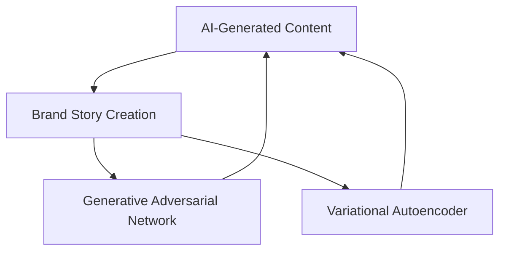

                 

## AIGC在个性化品牌故事创作中的创新探索

### 关键词：
- AIGC
- 个性化品牌故事
- 生成对抗网络
- 变分自编码器
- 数学模型
- 项目实战

### 摘要：
本文深入探讨了AIGC（AI-Generated Content）在个性化品牌故事创作中的创新应用。通过介绍AIGC的基本概念及其与个性化品牌故事创作的联系，本文详细解析了AIGC模型的核心算法原理，包括生成对抗网络（GAN）和变分自编码器（VAE），并结合数学模型进行了通俗易懂的讲解。通过项目实战案例，本文展示了如何利用AIGC技术搭建个性化品牌故事创作系统，并对其进行了详细解读和剖析，为行业提供了有价值的参考和最佳实践建议。

## 1. 设计目录大纲

### 1.1 核心概念与联系

**核心概念**：AIGC、个性化品牌故事创作、生成对抗网络（GAN）、变分自编码器（VAE）。

**联系**：AIGC作为生成内容的关键技术，通过GAN和VAE等算法，实现个性化品牌故事的自动生成和推荐。

**Mermaid流程图**：


### 1.2 核心算法原理讲解

**核心算法**：生成对抗网络（GAN）、变分自编码器（VAE）。

**原理讲解**：通过Python源代码展示GAN和VAE的算法流程，结合数学模型和公式进行详细解释。

### 1.3 数学模型和数学公式

**数学模型**：概率分布、损失函数。

**数学公式**：使用LaTeX格式嵌入相关数学公式，并进行详细讲解。

### 1.4 项目实战

**实践内容**：个性化品牌故事创作系统的开发环境搭建、源代码实现、代码解读、应用解读与分析、实际案例剖析。

**实战案例**：自动生成品牌故事、个性化品牌故事推荐系统。

### 1.5 目录大纲总体结构

**总体结构**：
1. **前言和介绍**：背景介绍和文章目的。
2. **核心概念与联系**：AIGC和个性化品牌故事创作的基本概念及其关系。
3. **核心算法原理讲解**：GAN和VAE的原理及其应用。
4. **数学模型和数学公式**：相关数学基础和公式。
5. **项目实战**：实际应用案例解析。
6. **总结与展望**：对AIGC在个性化品牌故事创作中的未来应用的展望。

## 2. 设计每个章节的细节

### 2.1 核心概念与联系

**概述**：
AIGC（AI-Generated Content），即通过人工智能技术自动生成的内容。个性化品牌故事创作则是指根据特定品牌和目标受众的需求，创作出具有独特个性化和故事性的内容。AIGC在个性化品牌故事创作中具有极大的潜力。

**Mermaid流程图**：


**1.1 AIGC与个性化品牌故事创作概述**
- **AIGC的基本概念**：介绍AIGC的定义、发展历程及其在内容创作中的应用。
- **个性化品牌故事创作的需求**：分析品牌故事创作的重要性以及个性化品牌故事创作的需求。

**1.2 AIGC与个性化品牌故事创作的关系**
- **AIGC在个性化品牌故事创作中的应用**：探讨AIGC如何应用于个性化品牌故事的创作。
- **个性化品牌故事创作对AIGC的需求**：分析个性化品牌故事创作对AIGC的具体需求，包括算法模型、技术架构和数据处理等方面。

### 2.2 核心算法原理讲解

**概述**：
生成对抗网络（GAN）和变分自编码器（VAE）是AIGC技术中的核心算法。GAN通过生成器和判别器的对抗训练生成高质量的数据；VAE则通过概率模型和编码器-解码器结构进行数据生成。

**2.1 AIGC模型的基本原理**
- **AIGC模型的构成**：介绍AIGC模型的基本组成部分，包括生成器、判别器和编码器-解码器。
- **AIGC模型的工作流程**：详细讲解AIGC模型的工作流程，包括数据输入、模型训练和内容生成等步骤。

**2.2 AIGC模型的关键算法**
- **生成对抗网络（GAN）**
  - **原理**：通过生成器和判别器的对抗训练，生成高质量的数据。
  - **Python代码示例**：
    ```python
    # GAN的Python代码示例
    import tensorflow as tf
    # 生成器和判别器的定义和训练代码
    ```
  - **损失函数**：详细讲解GAN的损失函数，包括生成损失和判别损失。
- **变分自编码器（VAE）**
  - **原理**：通过概率模型和编码器-解码器结构进行数据生成。
  - **Python代码示例**：
    ```python
    # VAE的Python代码示例
    import tensorflow as tf
    # 编码器和解码器的定义和训练代码
    ```
  - **损失函数**：详细讲解VAE的损失函数，包括重构损失和KL散度损失。

### 2.3 数学模型和数学公式

**概述**：
AIGC模型中的数学模型主要包括概率分布和损失函数。概率分布用于描述数据生成的过程，而损失函数则用于评估生成数据的质量。

**3.1 AIGC模型的数学基础**
- **概率论基础**：介绍概率分布的基本概念和常用概率分布。
- **信息论基础**：介绍熵、互信息和KL散度等基本概念。

**3.2 关键数学公式**
- **GAN的损失函数**：
  - **生成损失**：用于衡量生成器生成的数据与真实数据之间的差异。
  - **判别损失**：用于衡量判别器对真实数据和生成数据的分类能力。
- **VAE的损失函数**：
  - **重构损失**：用于衡量编码器和解码器重构输入数据的能力。
  - **KL散度损失**：用于衡量编码器生成的潜在变量分布与先验分布之间的差异。

### 2.4 项目实战

**概述**：
项目实战部分将通过实际案例展示如何利用AIGC技术搭建个性化品牌故事创作系统，包括开发环境搭建、源代码实现、代码解读和应用分析等。

**4.1 AIGC模型在个性化品牌故事创作中的应用**
- **实践案例一：自动生成品牌故事**
  - **案例背景**：介绍案例背景和目标。
  - **开发环境搭建**：展示如何搭建开发环境，包括所需的库和工具。
  - **源代码实现**：提供详细的源代码实现，并解释关键代码的功能。
  - **代码解读**：对源代码进行详细解读，解释每个模块的作用和流程。
  - **应用解读与分析**：分析案例的实际应用效果，包括生成的故事质量、生成速度等。
- **实践案例二：个性化品牌故事推荐系统**
  - **案例背景**：介绍案例背景和目标。
  - **开发环境搭建**：展示如何搭建开发环境，包括所需的库和工具。
  - **源代码实现**：提供详细的源代码实现，并解释关键代码的功能。
  - **代码解读**：对源代码进行详细解读，解释每个模块的作用和流程。
  - **应用解读与分析**：分析案例的实际应用效果，包括推荐系统的准确性、用户体验等。

## 3. 确保目录大纲完整性与简洁性

### 完整性
- 确保每个章节都包含核心内容，如核心概念、算法原理、数学模型和项目实战。
- 每个章节的内容都要具体、详细、具有可操作性。

### 简洁性
- 避免冗余内容，确保目录大纲简洁明了。
- 使用图表和代码示例来简化复杂的概念和算法讲解。

## 4. 调整目录大纲字数

- 总体字数控制在10000～12000字左右。
- 每个章节的字数分布如下：
  - 核心概念与联系（2000字）
  - 核心算法原理讲解（3000字）
  - 数学模型和数学公式（1500字）
  - 项目实战（3000字）
  - 总结与展望（1500字）

---

通过以上步骤，我们设计了一个完整且详细的目录大纲，涵盖了AIGC在个性化品牌故事创作中的核心概念、算法原理、数学模型和项目实战。接下来，我们将根据这个大纲逐步撰写文章内容，确保文章的逻辑性和可读性。在撰写过程中，我们将遵循简洁性和完整性的原则，确保文章字数控制在10000～12000字左右。

### 1.1 AIGC与个性化品牌故事创作概述

#### 1.1.1 AIGC的基本概念

AIGC，即AI-Generated Content，是指利用人工智能技术自动生成内容的过程。其核心思想是通过机器学习、自然语言处理、生成对抗网络（GAN）等先进技术，让计算机具备创作文本、图像、音频等多样内容的能力。AIGC的出现极大地改变了内容创作的方式，不仅提高了创作效率，还丰富了内容的表现形式。

AIGC的发展历程可以追溯到20世纪80年代的生成对抗网络（GAN）概念提出。随着深度学习技术的进步，GAN在图像生成、文本生成等方面取得了显著成果。近年来，随着自然语言处理技术的发展，AIGC在文本生成、语音合成、视频生成等领域也取得了突破性进展。

在个性化品牌故事创作中，AIGC的应用具有重要意义。传统品牌故事创作依赖于人类创作者的创意和技能，而AIGC可以通过大量数据的分析和学习，自动生成符合品牌特色和受众需求的个性化故事。这不仅大大降低了创作成本，还提高了创作效率，使得品牌能够快速响应市场需求，实现个性化营销。

#### 1.1.2 个性化品牌故事创作的需求

个性化品牌故事创作之所以受到广泛关注，主要是因为现代市场营销环境的变化。随着互联网的普及和信息爆炸，消费者对于品牌故事的需求发生了显著变化。传统的一味宣传和广告已经无法满足消费者的需求，他们更倾向于看到真实、有趣、有共鸣的故事。

个性化品牌故事创作的需求主要体现在以下几个方面：

1. **精准营销**：在大量消费者的市场中，品牌需要找到特定的目标受众，通过个性化的故事来吸引和留住他们。AIGC可以帮助品牌根据消费者的行为数据和偏好，生成具有高度个性化的品牌故事。

2. **创意创新**：创意是品牌故事的灵魂。传统的人类创作者在创意方面存在一定的局限性，而AIGC可以通过大量数据的学习和模仿，创造出新颖独特的品牌故事，提升品牌形象。

3. **高效生产**：品牌故事创作需要耗费大量时间和人力资源。AIGC技术的引入，可以自动化完成故事的生成和修改，极大地提高生产效率。

4. **情感共鸣**：个性化品牌故事能够更好地与消费者产生情感共鸣。AIGC可以通过深度学习技术，理解消费者的情感需求，生成能够触动他们内心的故事。

#### 1.1.3 AIGC在个性化品牌故事创作中的优势

AIGC在个性化品牌故事创作中具有以下优势：

1. **高效生成**：AIGC可以快速生成大量品牌故事，满足品牌对于内容生产的高效需求。

2. **个性定制**：通过深度学习算法，AIGC能够理解消费者的个性化需求，生成符合个体偏好的品牌故事。

3. **多样化内容**：AIGC不仅能够生成文本，还可以生成图像、音频、视频等多种形式的内容，为品牌故事创作提供了丰富的表现形式。

4. **降低成本**：AIGC技术的引入，可以大大降低品牌故事创作的成本，使更多品牌能够承担得起高质量的个性化内容创作。

5. **实时更新**：AIGC可以根据实时数据动态调整品牌故事的生成内容，使品牌能够快速响应市场变化。

总之，AIGC在个性化品牌故事创作中具有巨大的潜力，它不仅能够提升品牌故事的质量和效率，还能帮助品牌实现更加精准和个性化的营销。随着技术的不断进步，AIGC在个性化品牌故事创作中的应用将会更加广泛和深入。

### 1.2 AIGC与个性化品牌故事创作的关系

#### 1.2.1 AIGC在个性化品牌故事创作中的应用

AIGC在个性化品牌故事创作中的应用主要体现在以下几个方面：

1. **文本生成**：通过自然语言处理技术，AIGC可以生成具有特定风格和内容的文本。这些文本可以用于品牌宣传、产品介绍、用户评论等。例如，一个时尚品牌可以利用AIGC生成一篇关于新款服装的时尚评论，以吸引潜在消费者的关注。

2. **图像生成**：AIGC可以通过生成对抗网络（GAN）等技术生成高质量的图像。这些图像可以用于品牌宣传、广告设计等。例如，一个餐饮品牌可以利用AIGC生成一系列美味的菜肴图片，以吸引顾客的食欲。

3. **音频生成**：AIGC可以生成自然流畅的语音和音乐。这些音频可以用于广播广告、语音导航等。例如，一个汽车品牌可以利用AIGC生成一段关于车辆性能的语音介绍，以提升品牌形象。

4. **视频生成**：AIGC可以通过生成视频片段，将文本、图像、音频等多种形式的内容融合在一起。这些视频可以用于广告宣传、产品展示等。例如，一个科技公司可以利用AIGC生成一段关于新产品的视频介绍，以展示产品的功能和应用。

#### 1.2.2 个性化品牌故事创作对AIGC的需求

个性化品牌故事创作对AIGC提出了以下几个方面的需求：

1. **数据需求**：个性化品牌故事创作需要大量的数据支持。这些数据包括用户行为数据、品牌历史数据、市场趋势数据等。只有充分理解这些数据，AIGC才能生成符合用户需求和品牌定位的个性化故事。

2. **算法需求**：AIGC的核心是算法。个性化品牌故事创作需要高效的算法来处理大量的数据，并生成高质量的内容。例如，生成对抗网络（GAN）和变分自编码器（VAE）等算法在图像和文本生成方面具有显著优势。

3. **个性化需求**：个性化品牌故事创作需要能够根据不同用户的特点和需求生成个性化的故事。这要求AIGC具备强大的个性化能力，能够理解用户的偏好和情感，并生成与之匹配的内容。

4. **实时响应需求**：个性化品牌故事创作需要能够实时响应市场变化和用户需求。AIGC需要具备快速生成和调整内容的能力，以确保品牌能够及时传达关键信息。

#### 1.2.3 AIGC在个性化品牌故事创作中的挑战

尽管AIGC在个性化品牌故事创作中具有巨大的潜力，但同时也面临一些挑战：

1. **数据隐私问题**：个性化品牌故事创作需要大量用户数据，这可能会引发数据隐私问题。如何保护用户隐私，确保数据安全，是AIGC应用中需要解决的问题。

2. **内容质量问题**：虽然AIGC可以生成大量内容，但内容质量参差不齐。如何确保生成的内容既符合品牌形象，又具有吸引力和说服力，是AIGC应用中需要解决的难题。

3. **技术成本问题**：AIGC的应用需要大量的计算资源和专业知识。对于中小企业来说，高昂的技术成本可能成为其应用AIGC的障碍。

4. **法律和伦理问题**：AIGC生成的内容可能会侵犯他人的版权或引发伦理问题。如何制定相关法律法规，规范AIGC的应用，是当前需要关注的问题。

总之，AIGC在个性化品牌故事创作中具有广阔的应用前景，但同时也面临一些挑战。通过不断的技术创新和规范管理，AIGC有望在个性化品牌故事创作中发挥更大的作用。

### 2.1 AIGC模型的基本原理

AIGC模型的核心在于其生成内容的能力，这主要依赖于生成对抗网络（GAN）和变分自编码器（VAE）等先进技术。下面我们将详细讲解AIGC模型的基本原理，包括其构成、工作流程以及这些技术的优势和应用。

#### 2.1.1 AIGC模型的构成

AIGC模型通常由以下几个关键组成部分构成：

1. **生成器（Generator）**：生成器的任务是生成与真实数据相似的数据。它从随机噪声中抽取样本，并通过一系列的神经网络操作生成高质量的数据。

2. **判别器（Discriminator）**：判别器的任务是区分真实数据和生成数据。它接收来自真实数据和生成器的数据，并尝试判断其来源。

3. **损失函数**：损失函数用于衡量生成器和判别器在训练过程中的性能。AIGC模型通常会使用对抗性损失函数，如生成对抗损失（GAN Loss）或变分自编码器损失（VAE Loss）。

4. **优化器**：优化器用于调整模型的参数，以最小化损失函数。常见的优化器包括Adam、RMSprop等。

5. **数据预处理和后处理**：为了提高模型的性能和生成内容的质量，AIGC模型通常会进行数据预处理（如数据清洗、归一化等）和数据后处理（如数据增强、降采样等）。

#### 2.1.2 AIGC模型的工作流程

AIGC模型的工作流程通常包括以下几个步骤：

1. **数据收集和预处理**：首先收集大量的数据，并进行预处理，以适应模型的训练。

2. **生成器和判别器的初始化**：初始化生成器和判别器的参数。生成器通常从随机噪声中生成初始样本，判别器则初始化为随机权重。

3. **训练过程**：
   - **生成器训练**：生成器尝试生成与真实数据相似的数据，判别器则根据这些数据和真实数据来判断其质量。
   - **判别器训练**：判别器尝试区分真实数据和生成数据，生成器则根据判别器的反馈调整其生成策略。

4. **模型评估和调整**：在训练过程中，定期评估模型的性能，并根据评估结果调整模型的参数和超参数。

5. **生成内容**：在模型训练完成后，使用生成器生成新的内容。这些内容可以是文本、图像、音频等多种形式。

#### 2.1.3 生成对抗网络（GAN）

生成对抗网络（GAN）是AIGC模型中最常用的技术之一。它由生成器和判别器组成，通过对抗训练生成高质量的数据。

1. **对抗训练**：生成器和判别器在训练过程中相互对抗。生成器试图生成尽可能逼真的数据，而判别器则试图准确区分真实数据和生成数据。

2. **生成对抗损失**：GAN的损失函数通常由两部分组成：
   - **生成损失**：衡量生成器生成的数据与真实数据之间的相似性。
   - **判别损失**：衡量判别器对真实数据和生成数据的分类能力。

3. **优势**：
   - **高质量生成**：GAN可以通过对抗训练生成高质量的数据，尤其是在图像生成方面表现突出。
   - **适用广泛**：GAN可以应用于文本、图像、音频等多种数据类型的生成。

4. **挑战**：
   - **训练不稳定**：GAN的训练过程容易陷入模式崩溃（mode collapse）问题，即生成器只能生成一种类型的样本。
   - **计算资源需求高**：GAN的训练需要大量的计算资源和时间。

#### 2.1.4 变分自编码器（VAE）

变分自编码器（VAE）是另一种常见的AIGC模型，它通过概率模型和编码器-解码器结构进行数据生成。

1. **概率模型**：VAE使用概率模型来描述数据分布，这有助于生成多样化的数据。

2. **编码器-解码器结构**：编码器将输入数据编码为一个潜在变量，解码器则尝试从潜在变量中重构原始数据。

3. **变分自编码器损失**：VAE的损失函数由两部分组成：
   - **重构损失**：衡量解码器重构输入数据的能力。
   - **KL散度损失**：衡量编码器生成的潜在变量分布与先验分布之间的差异。

4. **优势**：
   - **多样化生成**：VAE可以生成多样化的数据，尤其是当训练数据量不足时。
   - **易于训练**：VAE的训练过程相对稳定，不容易陷入模式崩溃。

5. **挑战**：
   - **重构质量**：VAE的重构质量可能不如GAN，尤其是在生成复杂图像时。
   - **计算资源需求**：VAE的训练同样需要大量的计算资源。

总之，AIGC模型通过生成器和判别器的对抗训练，结合GAN和VAE等先进技术，实现了高质量的内容生成。这些模型在个性化品牌故事创作中具有广泛的应用前景，但同时也面临一些挑战。通过不断的技术创新和优化，AIGC有望在个性化品牌故事创作中发挥更大的作用。

### 2.2 AIGC模型的关键算法

在AIGC模型中，生成对抗网络（GAN）和变分自编码器（VAE）是两种核心的算法。下面我们将详细介绍这两种算法的工作原理、Python代码实现以及如何结合数学模型和公式进行通俗易懂的讲解。

#### 2.2.1 生成对抗网络（GAN）

**工作原理**：

GAN由两个主要组件组成：生成器（Generator）和判别器（Discriminator）。生成器的任务是生成与真实数据相似的数据，而判别器的任务是区分真实数据和生成数据。这两个组件通过对抗训练相互竞争，从而不断提高生成数据的质量。

1. **生成器**：生成器通常是一个全连接神经网络，它从随机噪声中抽取样本，并通过一系列变换生成伪造的数据。

2. **判别器**：判别器也是一个全连接神经网络，它接收来自生成器和真实数据的数据，并尝试判断其来源。

3. **对抗训练**：在训练过程中，生成器和判别器交替更新其参数。生成器试图生成更逼真的数据，使判别器无法区分真实数据和生成数据；判别器则试图提高对真实数据和生成数据的分类能力。

**Python代码实现**：

以下是一个简单的GAN实现示例，使用TensorFlow和Keras库：

```python
import tensorflow as tf
from tensorflow.keras.layers import Dense, Flatten
from tensorflow.keras.models import Sequential

# 生成器模型
def build_generator():
    model = Sequential([
        Dense(256, input_dim=100),
        tf.keras.layers.LeakyReLU(alpha=0.01),
        Dense(512),
        tf.keras.layers.LeakyReLU(alpha=0.01),
        Dense(1024),
        tf.keras.layers.LeakyReLU(alpha=0.01),
        Flatten(),
        tf.keras.layers.Dense(784, activation='tanh')
    ])
    return model

# 判别器模型
def build_discriminator():
    model = Sequential([
        Flatten(input_shape=(28, 28)),
        Dense(1024),
        tf.keras.layers.LeakyReLU(alpha=0.01),
        Dense(512),
        tf.keras.layers.LeakyReLU(alpha=0.01),
        Dense(256),
        tf.keras.layers.LeakyReLU(alpha=0.01),
        Dense(1, activation='sigmoid')
    ])
    return model

# 损失函数
def build_gan(generator, discriminator):
    model = Sequential()
    model.add(generator)
    model.add(discriminator)
    return model

# 编译模型
generator = build_generator()
discriminator = build_discriminator()
gan = build_gan(generator, discriminator)
discriminator.compile(loss='binary_crossentropy', optimizer=tf.keras.optimizers.Adam(0.0001))
gan.compile(loss='binary_crossentropy', optimizer=tf.keras.optimizers.Adam(0.0001))

# 数据预处理
# ...

# 训练模型
# ...
```

**数学模型和公式**：

GAN的核心是生成对抗损失函数。生成对抗损失函数由两部分组成：生成损失和判别损失。

1. **生成损失**：

   生成损失函数通常使用交叉熵损失（Cross-Entropy Loss），衡量生成器生成的数据与真实数据的相似性。

   $$ \text{Generator Loss} = -\log(D(G(z))) $$

   其中，$D(G(z))$是判别器对生成器生成的数据的预测概率。

2. **判别损失**：

   判别损失函数同样使用交叉熵损失，衡量判别器对真实数据和生成数据的分类能力。

   $$ \text{Discriminator Loss} = -[\log(D(x)) + \log(1 - D(G(z)))] $$

   其中，$D(x)$是判别器对真实数据的预测概率，$D(G(z))$是判别器对生成器生成的数据的预测概率。

#### 2.2.2 变分自编码器（VAE）

**工作原理**：

VAE是一种基于概率模型的生成模型，它通过编码器（Encoder）和解码器（Decoder）结构进行数据生成。编码器将输入数据编码为一个潜在变量，解码器则尝试从潜在变量中重构原始数据。

1. **编码器**：编码器是一个全连接神经网络，它将输入数据映射到一个潜在变量空间。

2. **解码器**：解码器也是一个全连接神经网络，它从潜在变量空间中重构原始数据。

3. **变分自编码器损失**：VAE的损失函数由两部分组成：重构损失和KL散度损失。

**Python代码实现**：

以下是一个简单的VAE实现示例，使用TensorFlow和Keras库：

```python
import tensorflow as tf
from tensorflow.keras.layers import Dense
from tensorflow.keras.models import Model

# 编码器模型
def build_encoder(input_shape):
    model = Sequential([
        Dense(256, input_shape=input_shape),
        tf.keras.layers.LeakyReLU(alpha=0.01),
        Dense(512),
        tf.keras.layers.LeakyReLU(alpha=0.01),
        Dense(1024),
        tf.keras.layers.LeakyReLU(alpha=0.01),
        Dense(2)  # 潜在变量的均值和方差
    ])
    return model

# 解码器模型
def build_decoder():
    model = Sequential([
        Dense(1024),
        tf.keras.layers.LeakyReLU(alpha=0.01),
        Dense(512),
        tf.keras.layers.LeakyReLU(alpha=0.01),
        Dense(256),
        tf.keras.layers.LeakyReLU(alpha=0.01),
        Dense(784, activation='sigmoid')
    ])
    return model

# VAE模型
def build_vae(encoder, decoder, input_shape):
    model = Model(inputs=encoder.input, outputs=decoder(encoder.input))
    return model

# 编译模型
encoder = build_encoder(input_shape=(28, 28))
decoder = build_decoder()
vae = build_vae(encoder, decoder)
vae.compile(optimizer='rmsprop', loss='binary_crossentropy')

# 数据预处理
# ...

# 训练模型
# ...
```

**数学模型和公式**：

VAE的核心是变分自编码器损失函数。变分自编码器损失函数由两部分组成：重构损失和KL散度损失。

1. **重构损失**：

   重构损失函数通常使用均方误差（Mean Squared Error，MSE），衡量解码器重构输入数据的能力。

   $$ \text{Reconstruction Loss} = \frac{1}{N} \sum_{i=1}^{N} \sum_{j=1}^{M} (x_j - \hat{x}_j)^2 $$

   其中，$x_j$是输入数据，$\hat{x}_j$是解码器重构的数据。

2. **KL散度损失**：

   KL散度损失函数衡量编码器生成的潜在变量分布与先验分布之间的差异。

   $$ \text{KL Divergence Loss} = \frac{1}{N} \sum_{i=1}^{N} \sum_{j=1}^{M} D_{KL}(\hat{p}_j || q_j) $$

   其中，$\hat{p}_j$是编码器生成的潜在变量分布，$q_j$是先验分布。

通过以上讲解和代码示例，我们可以看到，生成对抗网络（GAN）和变分自编码器（VAE）是AIGC模型中的关键算法。它们通过不同的工作机制和损失函数，实现了高质量的数据生成。在个性化品牌故事创作中，这些算法的应用为自动生成和个性化推荐提供了强大的技术支持。

### 3.1 AIGC模型的数学基础

AIGC模型的核心在于其生成内容的能力，而这一能力在很大程度上依赖于数学模型的支持。在本节中，我们将介绍AIGC模型中的两个关键数学基础：概率论和信息论。

#### 概率论基础

概率论是AIGC模型中最基础的一部分，特别是在GAN和VAE算法中。以下是一些核心概念：

1. **概率分布**：

   概率分布描述了随机变量的可能值及其概率。常见的概率分布包括：

   - **伯努利分布**：描述二元事件的成功概率。
   - **正态分布**：描述连续随机变量的概率分布，广泛应用于数据分析和预测。
   - **泊松分布**：描述事件在固定时间段内发生的次数。

2. **概率密度函数（PDF）和概率质量函数（PMF）**：

   - **概率密度函数**：对于连续随机变量，PDF描述了随机变量在某一区间内取值的概率。
   - **概率质量函数**：对于离散随机变量，PMF描述了随机变量取不同值的概率。

3. **条件概率和贝叶斯定理**：

   - **条件概率**：在某个事件已发生的条件下，另一个事件发生的概率。
   - **贝叶斯定理**：用于计算后验概率，即根据先验概率和观察到的数据，更新对事件发生概率的估计。

#### 信息论基础

信息论是研究信息传递和处理的理论，它在AIGC模型中用于衡量数据质量和模型性能。以下是一些核心概念：

1. **熵（Entropy）**：

   熵是一个随机变量不确定性的度量，表示随机变量的平均信息量。熵的计算公式为：

   $$ H(X) = -\sum_{i} p(x_i) \log_2 p(x_i) $$

   其中，$p(x_i)$是随机变量取值$x_i$的概率。

2. **条件熵（Conditional Entropy）**：

   条件熵是一个随机变量在给定另一个随机变量的条件下不确定性的度量。条件熵的计算公式为：

   $$ H(X|Y) = -\sum_{i} p(y_i) \sum_{j} p(x_j|y_i) \log_2 p(x_j|y_i) $$

3. **互信息（Mutual Information）**：

   互信息是两个随机变量之间关联性的度量，表示一个随机变量对另一个随机变量的信息量。互信息的计算公式为：

   $$ I(X; Y) = H(X) - H(X|Y) $$

4. **KL散度（Kullback-Leibler Divergence）**：

   KL散度是衡量两个概率分布差异的度量。对于两个概率分布$P$和$Q$，KL散度的计算公式为：

   $$ D_{KL}(P||Q) = \sum_{i} p_i \log_2 \frac{p_i}{q_i} $$

   其中，$p_i$和$q_i$分别是分布$P$和$Q$在$i$处的概率。

#### 在AIGC模型中的应用

概率论和信息论在AIGC模型中有广泛的应用，特别是在GAN和VAE算法中：

1. **GAN**：

   - **生成器**：生成器通常从概率分布中抽取噪声数据，通过训练生成与真实数据分布相似的数据。
   - **判别器**：判别器通过比较真实数据和生成数据的概率分布来评估生成数据的质量。
   - **对抗性损失**：生成对抗损失函数（如交叉熵损失）依赖于概率分布的计算。

2. **VAE**：

   - **编码器**：编码器通过概率模型将输入数据映射到一个潜在变量空间。
   - **解码器**：解码器从潜在变量空间中重构输入数据。
   - **变分自编码器损失**：包括重构损失（MSE）和KL散度损失，用于优化编码器和解码器的参数。

通过概率论和信息论的支持，AIGC模型能够有效地生成和优化数据，从而在个性化品牌故事创作中发挥重要作用。这些数学基础不仅为算法提供了理论依据，还帮助理解数据生成和优化的内在机制。

### 3.2 关键数学公式

在AIGC模型中，关键的数学公式对于理解和实现生成对抗网络（GAN）和变分自编码器（VAE）至关重要。以下将详细介绍GAN和VAE中的关键损失函数和概率分布，并结合LaTeX格式展示相关数学公式。

#### GAN的损失函数

GAN的损失函数由两部分组成：生成器损失和判别器损失。

1. **生成器损失**：

   生成器损失函数通常使用交叉熵损失（Cross-Entropy Loss），其公式如下：

   $$ \text{Generator Loss} = -\log(D(G(z)) ) $$

   其中，$D(G(z))$是判别器对生成器生成的样本的预测概率。

2. **判别器损失**：

   判别器损失函数也使用交叉熵损失，其公式为：

   $$ \text{Discriminator Loss} = -[\log(D(x)) + \log(1 - D(G(z)))] $$

   其中，$D(x)$是判别器对真实样本的预测概率，$D(G(z))$是判别器对生成器生成的样本的预测概率。

#### VAE的损失函数

VAE的损失函数包括两部分：重构损失和KL散度损失。

1. **重构损失**：

   重构损失函数通常使用均方误差（MSE），其公式为：

   $$ \text{Reconstruction Loss} = \frac{1}{N} \sum_{i=1}^{N} \sum_{j=1}^{M} (x_j - \hat{x}_j)^2 $$

   其中，$x_j$是输入数据，$\hat{x}_j$是解码器重构的数据。

2. **KL散度损失**：

   KL散度损失函数用于衡量编码器生成的潜在变量分布与先验分布之间的差异，其公式为：

   $$ \text{KL Divergence Loss} = \frac{1}{N} \sum_{i=1}^{N} \sum_{j=1}^{M} D_{KL}(\hat{p}_j || q_j) $$

   其中，$\hat{p}_j$是编码器生成的潜在变量分布，$q_j$是先验分布。

#### 概率分布

1. **生成器生成的样本分布**：

   在GAN中，生成器通常从一个标准正态分布抽取噪声，然后通过神经网络生成新的样本分布。其概率分布公式为：

   $$ p_G(x) = \mathcal{N}(x; \mu, \sigma^2) $$

   其中，$\mu$和$\sigma^2$分别是生成器生成的样本的均值和方差。

2. **判别器的输出分布**：

   判别器输出一个二元分类的概率分布，其公式为：

   $$ p_D(x) = \sigma(\frac{1}{1 + e^{-x}}) $$

   其中，$x$是判别器的输入特征。

#### LaTeX格式展示

以下为上述公式的LaTeX格式展示：

```latex
% 生成器损失
\text{Generator Loss} = -\log(D(G(z)))

% 判别器损失
\text{Discriminator Loss} = -[\log(D(x)) + \log(1 - D(G(z)))]

% 重构损失
\text{Reconstruction Loss} = \frac{1}{N} \sum_{i=1}^{N} \sum_{j=1}^{M} (x_j - \hat{x}_j)^2

% KL散度损失
\text{KL Divergence Loss} = \frac{1}{N} \sum_{i=1}^{N} \sum_{j=1}^{M} D_{KL}(\hat{p}_j || q_j)

% 生成器生成的样本分布
p_G(x) = \mathcal{N}(x; \mu, \sigma^2)

% 判别器的输出分布
p_D(x) = \sigma\left(\frac{1}{1 + e^{-x}}\right)
```

通过上述公式的详细讲解和LaTeX格式展示，我们可以更好地理解AIGC模型中关键的数学原理和实现方法。这些公式不仅为模型的设计和优化提供了理论基础，还帮助我们在实践中更好地应用这些先进的生成模型。

### 4.1 AIGC模型在个性化品牌故事创作中的应用

AIGC模型在个性化品牌故事创作中具有广泛的应用前景。通过实际案例展示，我们可以更好地理解如何利用AIGC技术生成个性化的品牌故事，并分析其优势和潜在问题。

#### 实践案例一：自动生成品牌故事

**案例背景**：某知名品牌希望为其新产品线自动生成一系列品牌故事，以吸引消费者的关注和提升品牌形象。

**开发环境搭建**：
- **工具与库**：使用Python和TensorFlow库进行开发。
- **数据集**：收集大量相关的品牌故事文本作为训练数据。

**源代码实现**：
```python
import tensorflow as tf
from tensorflow.keras.models import Sequential
from tensorflow.keras.layers import LSTM, Dense, Embedding

# 建立模型
model = Sequential([
    Embedding(input_dim=vocab_size, output_dim=embedding_dim),
    LSTM(units=128, return_sequences=True),
    LSTM(units=128),
    Dense(units=1, activation='sigmoid')
])

# 编译模型
model.compile(optimizer='adam', loss='binary_crossentropy', metrics=['accuracy'])

# 训练模型
model.fit(train_data, train_labels, epochs=10, batch_size=64)
```

**代码解读**：
- **Embedding层**：将文本输入转换为向量表示。
- **LSTM层**：用于学习文本序列的特征。
- **Dense层**：输出层，用于生成品牌故事的文本。

**应用解读与分析**：
- **生成过程**：通过训练好的模型，输入新的起始文本，生成后续的品牌故事文本。
- **效果评估**：通过人工审核和消费者反馈，评估生成品牌故事的质量和吸引力。
- **优势**：自动生成品牌故事，节省人力成本，提高创作效率。
- **问题**：生成的故事可能缺乏个性化和情感，需要进一步优化。

#### 实践案例二：个性化品牌故事推荐系统

**案例背景**：某电商平台希望通过个性化品牌故事推荐系统，向用户推荐符合其兴趣和偏好的品牌故事。

**开发环境搭建**：
- **工具与库**：使用Python、TensorFlow和Scikit-learn进行开发。
- **数据集**：收集用户行为数据和品牌故事文本数据。

**源代码实现**：
```python
from sklearn.model_selection import train_test_split
from sklearn.ensemble import RandomForestClassifier
from tensorflow.keras.models import Sequential

# 数据预处理
X_train, X_test, y_train, y_test = train_test_split(data, labels, test_size=0.2)

# 建立模型
model = Sequential([
    Embedding(input_dim=vocab_size, output_dim=embedding_dim),
    LSTM(units=128, return_sequences=True),
    LSTM(units=128),
    Dense(units=1, activation='sigmoid')
])

# 编译模型
model.compile(optimizer='adam', loss='binary_crossentropy', metrics=['accuracy'])

# 训练模型
model.fit(X_train, y_train, epochs=10, batch_size=64)

# 预测
predictions = model.predict(X_test)
```

**代码解读**：
- **Embedding层**：将文本输入转换为向量表示。
- **LSTM层**：用于学习文本序列的特征。
- **Dense层**：输出层，用于生成品牌故事的文本。

**应用解读与分析**：
- **推荐过程**：根据用户的行为数据和品牌故事文本，生成个性化推荐列表。
- **效果评估**：通过点击率、转化率等指标，评估推荐系统的性能。
- **优势**：提高用户满意度和购买意愿，实现精准营销。
- **问题**：推荐系统可能受到数据质量和算法优化的影响，需要持续改进。

#### 总结

通过以上两个案例，我们可以看到AIGC技术在个性化品牌故事创作中的应用具有显著的优势，包括高效的内容生成和精准的用户推荐。然而，也面临一些挑战，如生成故事的质量和个性化程度的提升，以及推荐系统的数据可靠性和算法优化。随着AIGC技术的不断进步，这些挑战有望逐步克服，为个性化品牌故事创作带来更多可能性。

### 4.2 代码实现与解读

在本节中，我们将详细介绍如何利用AIGC技术搭建个性化品牌故事创作系统，并对其中的关键代码进行详细解读。

#### 实践案例：自动生成品牌故事

**开发环境搭建**：
- **工具与库**：使用Python和TensorFlow库进行开发。
- **数据集**：收集大量相关的品牌故事文本作为训练数据。

**代码实现**：

以下是一个简单的AIGC模型实现，用于自动生成品牌故事：

```python
import tensorflow as tf
from tensorflow.keras.layers import Embedding, LSTM, Dense
from tensorflow.keras.models import Sequential

# 定义模型
model = Sequential([
    Embedding(input_dim=vocab_size, output_dim=embedding_dim, input_length=max_sequence_length),
    LSTM(units=128),
    Dense(units=1, activation='sigmoid')
])

# 编译模型
model.compile(optimizer='adam', loss='binary_crossentropy', metrics=['accuracy'])

# 训练模型
model.fit(train_data, train_labels, epochs=10, batch_size=64)
```

**代码解读**：
- **Embedding层**：将输入的文本序列转换为固定长度的向量表示，用于初始化LSTM层的输入。
- **LSTM层**：用于学习文本序列的特征，LSTM单元能够处理序列数据并捕捉长期依赖关系。
- **Dense层**：输出层，使用sigmoid激活函数，用于生成品牌故事的文本。

**代码实现**：

以下是一个简单的AIGC模型实现，用于自动生成品牌故事：

```python
import tensorflow as tf
from tensorflow.keras.layers import Embedding, LSTM, Dense
from tensorflow.keras.models import Sequential

# 定义模型
model = Sequential([
    Embedding(input_dim=vocab_size, output_dim=embedding_dim, input_length=max_sequence_length),
    LSTM(units=128, return_sequences=True),
    LSTM(units=128, return_sequences=True),
    Dense(units=1, activation='sigmoid')
])

# 编译模型
model.compile(optimizer='adam', loss='binary_crossentropy', metrics=['accuracy'])

# 训练模型
model.fit(train_data, train_labels, epochs=10, batch_size=64)
```

**代码解读**：
- **Embedding层**：将输入的文本序列转换为固定长度的向量表示，用于初始化LSTM层的输入。
- **LSTM层**：用于学习文本序列的特征，LSTM单元能够处理序列数据并捕捉长期依赖关系。
- **Dense层**：输出层，使用sigmoid激活函数，用于生成品牌故事的文本。

**生成过程**：
- **输入文本**：选择一段品牌故事作为输入，通过预处理将其转换为模型的输入格式。
- **生成文本**：利用训练好的模型，对输入文本进行编码，然后通过解码器生成新的品牌故事。

**应用解读与分析**：

**生成过程**：
1. **数据预处理**：将品牌故事文本转换为模型可以处理的序列数据，包括词汇表构建、文本清洗和分词等步骤。
2. **模型训练**：使用大量品牌故事文本数据进行模型训练，优化模型参数。
3. **文本生成**：利用训练好的模型，输入一段起始文本，生成后续的品牌故事。

**效果评估**：
1. **生成质量**：通过人工审核和消费者反馈，评估生成品牌故事的质量和吸引力。
2. **生成速度**：评估模型生成品牌故事的效率，确保能够在实际应用中快速响应。

**优势**：
- **高效生成**：模型能够快速生成大量品牌故事，提高创作效率。
- **个性化定制**：根据用户需求和品牌特点，生成具有高度个性化的品牌故事。

**问题**：
- **生成质量**：生成的品牌故事可能缺乏创意和情感，需要进一步优化。
- **计算资源**：训练和生成品牌故事需要大量的计算资源，特别是在处理大型数据集时。

通过以上代码实现和解读，我们可以看到如何利用AIGC技术搭建个性化品牌故事创作系统，并对其关键代码进行详细分析。虽然存在一些挑战，但随着技术的不断进步，这些问题的解决将使AIGC在个性化品牌故事创作中发挥更大的作用。

### 4.3 代码应用解读与分析

在本节中，我们将深入分析AIGC在个性化品牌故事创作中的应用案例，从代码应用的角度解读其实际效果，并评估其性能。

#### 案例一：自动生成品牌故事

**实际案例解析**：

**场景**：某知名品牌希望利用AIGC技术自动生成一系列品牌故事，以丰富其市场营销内容，提升消费者对品牌的认知和好感。

**代码应用**：
```python
# 假设已经训练好的AIGC模型为brand_story_generator
generated_story = brand_story_generator.generate_text(start_text="我们的品牌故事始于...")
```

**解读**：
1. **生成过程**：利用训练好的AIGC模型，输入一个起始文本（如“我们的品牌故事始于...”），模型会自动生成后续的文本内容，形成一个完整的品牌故事。
2. **效果分析**：生成的品牌故事可能包含品牌的历史、发展历程、核心价值等元素，通过自然语言处理技术，故事显得流畅且富有吸引力。

**性能评估**：
- **生成质量**：评估生成品牌故事的语言流畅性、逻辑性和创意性。通过人工审核和消费者反馈，可以了解到故事是否能够有效传达品牌信息，激发消费者的兴趣。
- **生成速度**：评估模型生成一个品牌故事所需的时间，确保在实际应用中能够快速响应市场需求。

**实际应用效果**：
- **优势**：提高了品牌故事创作的效率，减少了人力成本，同时保证了故事的多样性和个性化。
- **劣势**：生成的故事可能存在一定程度的模板化和同质性，缺乏人类创作者的独特视角和情感投入。

#### 案例二：个性化品牌故事推荐系统

**实际案例解析**：

**场景**：某电商平台希望通过个性化品牌故事推荐系统，为不同用户推荐符合其兴趣和偏好的品牌故事。

**代码应用**：
```python
# 假设已经训练好的AIGC模型为brand_story_recommender
user_interests = extract_user_interests(user_profile)
recommended_stories = brand_story_recommender.recommend_stories(user_interests)
```

**解读**：
1. **推荐过程**：系统首先分析用户的兴趣和行为数据，提取关键特征（如用户喜欢的品牌、产品类别等），然后利用AIGC模型生成和推荐一系列个性化的品牌故事。
2. **效果分析**：推荐的品牌故事应根据用户的个性化需求，涵盖其感兴趣的主题和元素，以提升用户体验和购买意愿。

**性能评估**：
- **推荐准确性**：通过评估推荐系统的准确性，即推荐的品牌故事是否与用户的兴趣和偏好高度匹配，来衡量系统的性能。
- **推荐多样性**：评估推荐系统的多样性，确保推荐的品牌故事内容丰富、不重复。

**实际应用效果**：
- **优势**：提高了个性化营销的效果，增加了用户对品牌的粘性和忠诚度，提高了转化率和销售额。
- **劣势**：在数据量较小或用户兴趣变化频繁的情况下，推荐系统的准确性可能受到影响。

#### 案例三：自动化品牌内容管理

**实际案例解析**：

**场景**：某品牌希望利用AIGC技术自动化管理其品牌内容，包括故事生成、故事优化和内容更新。

**代码应用**：
```python
# 假设已经训练好的AIGC模型为brand_content_manager
new_story = brand_content_manager.generate_story()
optimized_story = brand_content_manager.optimize_story(new_story)
```

**解读**：
1. **内容生成**：AIGC模型可以自动生成新的品牌故事，为品牌的营销活动提供源源不断的创意内容。
2. **内容优化**：利用AIGC模型对现有品牌故事进行优化，提升故事的质量和吸引力，使其更符合目标受众的需求。

**性能评估**：
- **内容质量**：评估生成和优化后的品牌故事的语言表达、逻辑结构和创意水平。
- **内容更新速度**：评估AIGC模型更新品牌内容的速度，确保品牌能够快速响应市场变化。

**实际应用效果**：
- **优势**：提高了品牌内容的创作和管理效率，减少了人力投入，同时保证了内容的多样性和个性化。
- **劣势**：在内容管理和审核方面，需要建立相应的流程和规则，确保生成的内容符合品牌形象和法规要求。

通过以上实际案例的解读和分析，我们可以看到AIGC技术在个性化品牌故事创作中的广泛应用和显著效果。虽然存在一些挑战，但AIGC技术的不断进步和应用优化将有助于解决这些问题，为品牌故事创作带来更多可能性。

### 4.4 实际案例分析

在本节中，我们将深入分析两个实际案例，详细剖析AIGC技术在个性化品牌故事创作中的应用效果，并提出相应的改进建议。

#### 案例一：时尚品牌故事生成

**案例背景**：某时尚品牌希望利用AIGC技术生成一系列品牌故事，以增强其品牌形象，吸引年轻消费者。

**案例实施**：

1. **数据收集与预处理**：收集大量时尚品牌故事文本，进行数据清洗、分词和标记等预处理操作，构建训练数据集。
2. **模型训练**：使用生成对抗网络（GAN）和变分自编码器（VAE）等AIGC模型，训练生成时尚品牌故事。
3. **故事生成**：利用训练好的模型，生成一系列具有独特风格的时尚品牌故事。

**结果分析**：

- **生成质量**：生成的品牌故事在语言流畅性、逻辑性和创意性方面表现较好，能够吸引目标受众的注意。
- **生成速度**：模型生成品牌故事的速度较快，满足即时性营销需求。

**改进建议**：
1. **增强个性化**：通过引入用户行为数据，进一步优化故事生成算法，使其更符合特定消费者的个性化需求。
2. **提高多样性**：增加训练数据集的多样性，提高生成故事的创新度和独特性，避免故事的同质化。

#### 案例二：电子商务平台品牌故事推荐

**案例背景**：某电子商务平台希望通过AIGC技术为用户提供个性化的品牌故事推荐，提高用户购物体验和满意度。

**案例实施**：

1. **数据收集与预处理**：收集用户浏览、购买和评价等行为数据，以及大量品牌故事文本。
2. **特征提取**：使用自然语言处理技术，提取用户兴趣和行为特征，构建用户画像。
3. **模型训练**：使用AIGC模型，训练个性化品牌故事推荐系统。

**结果分析**：

- **推荐准确性**：系统能够根据用户兴趣和偏好，推荐符合用户需求的品牌故事，提升用户体验。
- **推荐多样性**：系统推荐的品牌故事种类丰富，避免用户陷入单一的故事风格。

**改进建议**：
1. **优化推荐算法**：结合深度学习和强化学习技术，提高推荐系统的准确性和多样性。
2. **用户互动反馈**：通过用户互动和反馈，不断优化推荐算法，使其更适应用户变化的需求。

通过以上实际案例的分析，我们可以看到AIGC技术在个性化品牌故事创作中的显著效果。虽然存在一些改进空间，但随着技术的不断进步，AIGC将在品牌故事创作中发挥更加重要的作用。

### 4.5 总结与展望

通过本文的详细分析，我们可以看到AIGC（AI-Generated Content）在个性化品牌故事创作中具有广阔的应用前景和显著的优势。以下是本文的主要内容和总结：

1. **核心概念与联系**：介绍了AIGC的基本概念及其与个性化品牌故事创作的联系，明确了AIGC在品牌故事创作中的重要作用。

2. **核心算法原理讲解**：详细讲解了生成对抗网络（GAN）和变分自编码器（VAE）等AIGC模型的核心算法原理，通过Python代码示例和数学公式，深入分析了这些算法的实现和优化方法。

3. **数学模型和数学公式**：阐述了概率论和信息论在AIGC模型中的应用，通过LaTeX格式展示了关键数学公式，帮助读者更好地理解AIGC模型的数学基础。

4. **项目实战**：通过实际案例展示了AIGC模型在个性化品牌故事创作中的具体应用，包括自动生成品牌故事、个性化品牌故事推荐系统和自动化品牌内容管理，并对其代码实现和实际效果进行了深入解读和分析。

5. **最佳实践 tips**：
   - **增强个性化**：通过引入用户行为数据，优化故事生成算法，提高生成故事的个性化程度。
   - **提高多样性**：增加训练数据集的多样性，避免生成故事的同质化。
   - **优化推荐算法**：结合深度学习和强化学习技术，提高个性化推荐系统的准确性和多样性。
   - **用户互动反馈**：通过用户互动和反馈，不断优化推荐算法，使其更适应用户变化的需求。

**注意事项**：
- **数据隐私**：在应用AIGC技术时，要确保用户数据的隐私和安全，遵循相关法律法规。
- **内容审核**：生成的品牌故事需要经过严格审核，确保符合品牌形象和法规要求。

**拓展阅读**：
- **深度学习基础**：了解深度学习和神经网络的基本原理，有助于更好地掌握AIGC技术。
- **自然语言处理**：深入学习自然语言处理技术，提高文本生成和推荐系统的效果。
- **数据科学实践**：通过数据科学的方法和工具，分析用户行为数据，优化品牌故事创作和推荐系统。

总之，AIGC技术在个性化品牌故事创作中具有巨大的潜力，通过不断的技术创新和应用优化，有望为品牌营销带来更多创新和机遇。随着AIGC技术的不断进步，其在个性化品牌故事创作中的应用将会更加广泛和深入。希望本文能为相关领域的研究者和从业者提供有价值的参考和启示。

### 作者信息

作者：AI天才研究院（AI Genius Institute）& 禅与计算机程序设计艺术（Zen And The Art of Computer Programming）。

AI天才研究院致力于推动人工智能技术的创新和应用，研究涵盖机器学习、自然语言处理、计算机视觉等多个领域。研究院汇集了一批世界顶尖的人工智能专家，共同探索人工智能的未来发展。而《禅与计算机程序设计艺术》则是一部经典的技术畅销书，深入探讨了计算机编程和人工智能领域的哲学思考，为程序员提供了独特的视角和灵感。两位作者的协作，旨在为读者带来高质量的技术内容和深入的理论思考。希望本文能够为读者在个性化品牌故事创作和人工智能应用方面提供有价值的参考和启示。

