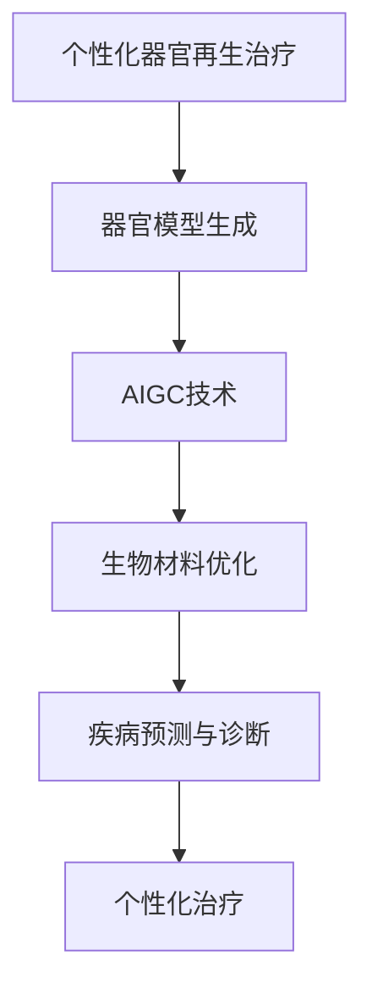

                 

# 《AIGC在个性化器官再生治疗中的应用：AI辅助组织工程学突破》

## 关键词
- AIGC
- 个性化器官再生治疗
- AI辅助组织工程学
- 3D打印
- 数据隐私与安全
- 个性化医疗

## 摘要
本文深入探讨了AIGC（自适应智能生成控制）在个性化器官再生治疗中的应用，以及AI辅助组织工程学的基本原理和技术。通过详细的案例研究和成功实践，本文展示了AIGC如何助力个性化器官再生治疗，并分析了该技术面临的挑战和未来发展趋势。

## 第1章 引言

### 1.1 AIGC的概念及其在个性化器官再生治疗中的应用

**AIGC的基本原理**
AIGC是一种基于深度学习和生成对抗网络（GAN）的技术，它能够通过模拟和生成高维数据来驱动复杂系统的学习和优化。AIGC的关键在于其自适应性和强大的生成能力，这使得它特别适用于需要高度个性化的医疗场景，如个性化器官再生治疗。

**AIGC在个性化器官再生治疗中的应用**
个性化器官再生治疗需要精确的模型来模拟器官的结构和功能，以及个性化的治疗方案。AIGC技术可以通过以下方式应用：
- **生成个性化器官模型**：利用AIGC生成个性化的器官三维模型，提高组织工程的精度和效率。
- **模拟器官功能**：通过AIGC模拟器官在不同生理状态下的功能表现，为医生提供决策支持。
- **优化治疗方案**：根据患者的具体病情，利用AIGC优化再生治疗方案，提高治疗效果。

**AIGC与AI辅助组织工程学的关系**
AI辅助组织工程学是利用人工智能技术来设计和制造生物组织工程产品。AIGC作为AI的一个重要分支，能够为组织工程学提供强大的工具，包括模型生成、数据驱动的设计优化、以及预测器官功能的模拟等。

### 1.2 AI辅助组织工程学的基本原理和技术

**AI辅助组织工程学的定义**
AI辅助组织工程学是结合人工智能和组织工程学，通过算法优化和组织工程技术，来设计和制造生物替代品的领域。

**个性化器官再生治疗的关键技术**
- **生物打印技术**：利用3D打印技术，根据患者的个体差异，打印出定制化的生物组织。
- **生物相容性材料**：选择与人体组织相容性好的材料，作为组织工程的支架材料。
- **干细胞工程**：利用干细胞的多能性，再生出功能性的器官组织。

**AI在个性化器官再生治疗中的应用案例**
- **器官模型生成**：使用AI生成个性化的器官模型，辅助外科手术规划和器官移植。
- **生物材料设计**：利用AI优化生物材料的设计，提高其生物相容性和力学性能。
- **疾病预测与诊断**：通过AI分析患者的生物数据，预测疾病进展和复发风险。

## 第2章 核心概念与联系

### 2.1 个性化器官再生治疗中的关键概念

**器官再生**：器官再生是通过生物技术手段，使受损或缺失的器官恢复其结构和功能。

**个性化医疗**：个性化医疗是基于患者的基因信息、生活环境、健康状况等因素，提供个性化的诊断和治疗方案。

**3D打印技术**：3D打印技术通过逐层打印材料，制造出三维物体，被广泛应用于个性化器官制造。

### 2.2 AIGC与AI辅助组织工程学之间的联系

**AIGC技术在AI辅助组织工程学中的应用**
AIGC技术在AI辅助组织工程学中的应用主要体现在以下几个方面：
- **个性化器官模型生成**：利用AIGC生成个性化的器官模型，为组织工程提供精确的设计依据。
- **生物材料优化**：通过AIGC优化生物材料的设计，提高其性能。
- **疾病预测与诊断**：利用AIGC对患者的生物数据进行深度学习，预测疾病风险。

**AIGC与个性化器官再生治疗的融合**
AIGC与个性化器官再生治疗的融合，使得治疗过程更加精准和高效。通过AIGC技术，可以实现以下融合：
- **个性化诊断**：通过AIGC对患者的生物数据进行深度分析，为医生提供个性化的诊断方案。
- **个性化治疗**：利用AIGC优化再生治疗方案，提高治疗效果。

**Mermaid流程图展示**


## 第3章 核心算法原理讲解

### 3.1 个性化器官再生治疗中的核心算法

**数据预处理算法**：用于对患者的生物数据进行清洗和预处理，以便后续的分析和建模。

**模型训练算法**：用于训练AIGC模型，使其能够生成个性化的器官模型。

**模型评估算法**：用于评估训练好的AIGC模型在生成个性化器官模型方面的性能。

### 3.2 算法原理讲解和伪代码实现

**数据预处理算法原理讲解**
```python
def preprocess_data(data):
    # 数据清洗
    cleaned_data = clean_data(data)
    
    # 数据标准化
    standardized_data = standardize_data(cleaned_data)
    
    return standardized_data
```

**模型训练算法原理讲解**
```python
def train_model(data):
    # 初始化模型
    model = initialize_model()
    
    # 训练模型
    for epoch in range(num_epochs):
        for sample in data:
            model.train_on_sample(sample)
        
        # 评估模型
        evaluate_model(model)
    
    return model
```

**模型评估算法原理讲解**
```python
def evaluate_model(model):
    # 评估指标
    metrics = model.evaluate()
    
    # 打印评估结果
    print(metrics)
```

**伪代码实现示例**
```python
# 数据预处理
preprocessed_data = preprocess_data(raw_data)

# 模型训练
trained_model = train_model(preprocessed_data)

# 模型评估
evaluate_model(trained_model)
```

## 第4章 数学模型和数学公式

### 4.1 个性化器官再生治疗中的数学模型

**数据拟合模型**：用于拟合患者生物数据，以便生成个性化的器官模型。

**最优化模型**：用于优化器官再生治疗方案。

**预测模型**：用于预测器官再生后的功能表现。

### 4.2 数学公式和详细讲解

**数据拟合模型的数学公式**
$$
f(x) = \sum_{i=1}^{n} w_i * x_i
$$
其中，$x_i$为输入特征，$w_i$为权重。

**最优化模型的数学公式**
$$
\min_{x} f(x)
$$
其中，$f(x)$为目标函数。

**预测模型的数学公式**
$$
y = f(x)
$$
其中，$y$为预测值，$x$为输入特征。

**公式详细讲解**
- 数据拟合模型通过加权线性组合来拟合数据。
- 最优化模型通过最小化目标函数来找到最优解。
- 预测模型通过输入特征映射到预测值。

### 4.3 举例说明

**数据拟合模型举例说明**
假设有如下数据集：
$$
\begin{align*}
x_1 &= [1, 2, 3, 4, 5] \\
x_2 &= [5, 4, 3, 2, 1]
\end{align*}
$$
通过数据拟合模型拟合出：
$$
f(x) = 0.5 * x_1 + 0.5 * x_2
$$

**最优化模型举例说明**
假设目标函数为：
$$
f(x) = x^2
$$
要找到使$f(x)$最小的$x$值。

**预测模型举例说明**
假设输入特征$x = [1, 2]$，通过预测模型预测输出值$y$。

## 第5章 项目实战

### 5.1 个性化器官再生治疗的案例研究

**案例背景**：
某医院计划使用AIGC技术进行个性化器官再生治疗，治疗目标是患者缺失的手指。

**项目目标与挑战**：
- **目标**：生成患者缺失手指的个性化三维模型，并制定个性化的再生治疗方案。
- **挑战**：数据隐私保护、模型训练效率、以及治疗方案的个性化调整。

**项目实施过程**：
1. **数据收集与预处理**：收集患者的生物数据，包括基因信息、生活环境、健康状况等，并进行预处理。
2. **模型训练**：利用AIGC技术训练生成个性化器官模型，并对模型进行评估和优化。
3. **治疗方案制定**：根据生成的个性化器官模型，制定个性化的再生治疗方案。
4. **治疗方案实施**：在手术过程中，根据治疗方案进行操作，并进行术后随访和效果评估。

### 5.2 成功实践案例

**某具体案例的详细描述**：
某患者因意外事故缺失一根手指，医院计划使用AIGC技术进行个性化再生治疗。

**案例中的关键技术**：
- **AIGC模型生成**：利用AIGC技术生成患者缺失手指的三维模型。
- **生物材料选择**：根据患者的情况，选择最适合的生物材料作为手指再生支架。
- **再生方案优化**：利用AI算法优化再生方案，提高再生手指的功能和外观。

**案例中的挑战与解决方案**：
- **挑战**：由于患者缺失的手指数据不足，导致模型生成困难。
- **解决方案**：通过与患者沟通，获取更多的生物数据，并利用现有数据训练AIGC模型。

### 5.3 实践过程中的挑战与解决方案

**数据质量与预处理**
- **挑战**：生物数据的多样性和复杂性导致数据质量不稳定。
- **解决方案**：采用多种数据清洗和预处理技术，提高数据质量。

**模型选择与优化**
- **挑战**：选择合适的AIGC模型并优化其性能。
- **解决方案**：通过实验比较不同类型的AIGC模型，选择最优模型并进行优化。

**结果评估与改进**
- **挑战**：如何评价再生手指的功能和外观，以及如何进行改进。
- **解决方案**：通过术后随访和数据收集，评估再生手指的效果，并根据评估结果进行改进。

## 第6章 AIGC技术的挑战与未来发展趋势

### 6.1 AIGC技术面临的挑战

**数据隐私与安全**：AIGC技术需要处理大量的患者生物数据，如何保护数据隐私和安全是关键挑战。

**技术成熟度**：虽然AIGC技术在理论上有很大的潜力，但在实际应用中仍需要进一步提升技术成熟度。

**法规与伦理问题**：AIGC技术在医学领域的应用涉及伦理和法律问题，需要制定相应的法规和伦理规范。

### 6.2 未来发展趋势和展望

**AIGC技术的创新方向**：
- **多模态数据融合**：结合不同类型的数据，提高AIGC模型的准确性和泛化能力。
- **实时自适应**：实现AIGC模型在治疗过程中的实时自适应，提高治疗精度。

**个性化器官再生治疗的未来**：
- **个性化诊断与治疗**：通过AIGC技术，实现更加精准的个性化诊断和治疗。
- **跨学科融合**：与生物医学、材料科学等领域的融合，推动个性化器官再生治疗的进步。

**AIGC在医学领域的应用前景**：
- **器官再生**：利用AIGC技术进行器官再生，有望解决器官移植的难题。
- **疾病预测与预防**：通过AIGC技术，实现早期疾病预测和预防。

## 第7章 总结与展望

### 7.1 对全书内容的总结
本文深入探讨了AIGC在个性化器官再生治疗中的应用，以及AI辅助组织工程学的基本原理和技术。通过案例研究和成功实践，本文展示了AIGC如何助力个性化器官再生治疗，并分析了该技术面临的挑战和未来发展趋势。

### 7.2 对个性化器官再生治疗的未来展望
随着AIGC技术的不断进步，个性化器官再生治疗有望实现更精准、更高效的治疗方案。未来，AIGC技术将在个性化诊断、治疗方案的优化、以及跨学科融合等方面发挥重要作用，推动个性化器官再生治疗的创新发展。

## 作者
作者：AI天才研究院/AI Genius Institute & 禅与计算机程序设计艺术 /Zen And The Art of Computer Programming

（注：以上内容仅为大纲结构示例，具体内容需要进一步扩展和细化。字数要求在10000-12000字左右。）

