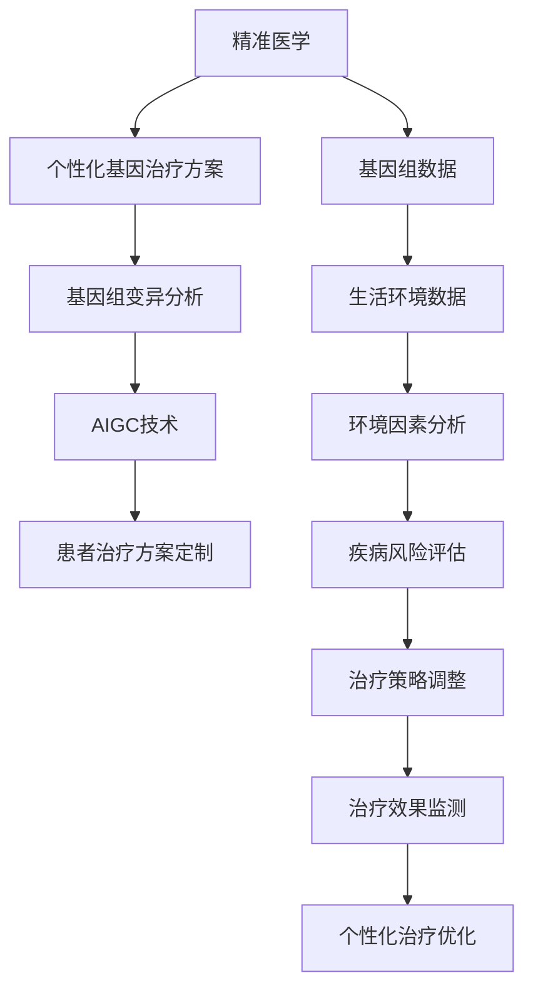

                 

### AIGC在个性化基因治疗方案设计中的应用：精准医学新范式

> 关键词：AIGC、个性化基因治疗方案、精准医学、生成对抗网络、变分自编码器、生成式模型、基因组变异分析、药物靶点预测

> 摘要：本文探讨了AIGC（人工智能生成控制）在个性化基因治疗方案设计中的应用，为精准医学提供了一个新的范式。通过深入分析AIGC的核心算法原理，并结合具体的Python源代码和数学模型，本文详细阐述了AIGC如何通过基因组变异分析和药物靶点预测，为患者量身定制个性化的基因治疗方案。

### 引言

随着科技的迅猛发展，个性化医疗已经成为医学领域的热点。个性化医疗通过利用患者的个体化信息，如基因组数据、生活环境等，提供量身定制的治疗方案。基因治疗作为个性化医疗的重要组成部分，旨在通过修改患者的基因来治疗疾病。然而，基因治疗的复杂性和个体差异使得传统方法难以满足个性化需求。

AIGC（Artificial Intelligence Generated Control）作为人工智能领域的一种新兴技术，具备强大的生成和控制能力，能够处理大规模的复杂数据。本文将探讨AIGC在个性化基因治疗方案设计中的应用，为精准医学提供一个全新的范式。

### AIGC、个性化基因治疗方案与精准医学的核心概念与联系

为了更好地理解AIGC在个性化基因治疗方案设计中的作用，首先需要明确相关核心概念，并阐述它们之间的联系。

**核心概念：**
- **AIGC**：一种结合了生成对抗网络（GAN）、变分自编码器（VAE）等生成式模型的控制方法，能够通过训练生成高质量的、具有多样性的数据。
- **个性化基因治疗方案**：根据患者的具体基因信息和生活环境，为患者量身定制的治疗方案。
- **精准医学**：以个体基因组信息为基础，通过分析基因、环境、生活习惯等多方面的数据，提供个性化的预防和治疗方案。

**概念联系：**

1. **AIGC与个性化基因治疗方案**：
   - AIGC通过生成对抗网络和变分自编码器等技术，可以处理和分析大量的基因组数据，从而识别出与疾病相关的基因变异。
   - 基因变异分析结果可以用来预测患者的疾病风险，并指导个性化基因治疗方案的设计。

2. **个性化基因治疗方案与精准医学**：
   - 个性化基因治疗方案是精准医学的核心实践之一。通过AIGC技术，可以实现精准地识别患者基因变异，进而提供个性化的治疗方案。
   - 精准医学的理念与个性化基因治疗方案的设计理念高度契合，共同追求为患者提供最佳的治疗效果。

为了更直观地展示这些概念之间的联系，我们可以使用Mermaid流程图进行描述：



通过上述流程图，我们可以清晰地看到AIGC技术在个性化基因治疗方案设计中的关键作用。接下来，本文将深入探讨AIGC的核心算法原理，并展示其在个性化基因治疗方案设计中的具体应用。

### AIGC核心算法原理

AIGC（人工智能生成控制）是一种结合了生成对抗网络（GAN）、变分自编码器（VAE）等生成式模型的控制方法，能够通过训练生成高质量的、具有多样性的数据。以下将详细阐述AIGC的核心算法原理。

#### 1. 生成对抗网络（GAN）

生成对抗网络（GAN）由两部分组成：生成器（Generator）和判别器（Discriminator）。生成器从随机噪声中生成数据，判别器则判断生成器生成的数据是否真实。通过这种对抗训练，生成器不断提高生成数据的质量，使其接近真实数据。

- **生成器（Generator）**：
  - **目标**：生成与真实数据相似的数据。
  - **结构**：通常由多层神经网络组成，接收随机噪声作为输入，输出生成的数据。

- **判别器（Discriminator）**：
  - **目标**：区分真实数据和生成数据。
  - **结构**：同样由多层神经网络组成，接收数据和标签作为输入，输出判断结果。

- **损失函数**：GAN的训练目标是最大化判别器的损失函数。生成器的损失函数是使判别器无法准确判断生成数据的概率最小，即生成器生成的数据越真实，判别器越难以区分。

#### 2. 变分自编码器（VAE）

变分自编码器（VAE）是一种基于概率模型的生成模型，通过引入变分自编码器（VAE）的变分推理方法，可以有效地进行数据的生成和表示学习。

- **编码器（Encoder）**：
  - **目标**：将输入数据编码为一个潜变量表示。
  - **结构**：由多层神经网络组成，接收输入数据，输出潜变量。

- **解码器（Decoder）**：
  - **目标**：将潜变量解码回原始数据。
  - **结构**：同样由多层神经网络组成，接收潜变量，输出重构数据。

- **概率分布**：VAE通过引入概率分布来建模数据，使得生成的数据具有多样性。通常使用正态分布来表示潜变量。

- **损失函数**：VAE的训练目标是最小化重构误差和潜在变量的KL散度。重构误差是输入数据与重构数据之间的差异，KL散度是编码器输出的概率分布与先验概率分布之间的差异。

#### 3. 生成式模型（如GPT）

生成式模型（如GPT）是一种基于循环神经网络（RNN）或Transformer的模型，能够生成文本、图像等数据。这些模型通过学习大量数据中的规律和模式，能够生成高质量的数据。

- **模型结构**：
  - **文本生成**：GPT模型通过嵌入层将单词转换为向量，然后通过多层Transformer结构进行编码，最后通过输出层生成文本。

- **训练过程**：GPT模型通过无监督训练，即仅使用输入数据，来学习生成文本的规律和模式。

- **生成过程**：生成过程从随机噪声开始，通过模型的编码器生成潜变量，然后通过解码器生成文本。

通过上述核心算法原理的介绍，我们可以看到AIGC技术具有强大的生成和控制能力，能够处理大规模的复杂数据。接下来，本文将结合Python源代码和数学模型，详细阐述AIGC在个性化基因治疗方案设计中的应用。

### AIGC在个性化基因治疗方案设计中的应用

#### 1. 基因组变异分析

基因组变异分析是个性化基因治疗方案设计的关键步骤。通过分析患者的基因组数据，可以识别出与疾病相关的基因变异，从而指导治疗方案的制定。

**算法步骤：**

1. **数据预处理**：
   - **基因组序列读取**：从基因组数据库中获取患者的基因组序列。
   - **序列比对**：将患者基因组序列与参考基因组进行比对，识别出变异位点。

2. **变异位点识别**：
   - **变异类型分类**：根据变异位点的影响程度，将变异分为不同类型，如单核苷酸变异（SNV）、插入/缺失变异（Indel）等。

3. **变异位点分析**：
   - **功能注释**：对变异位点进行功能注释，包括基因的功能区域、蛋白质结构域等。
   - **疾病相关性分析**：通过数据库查询，分析变异位点与疾病的相关性，确定其对疾病的影响。

4. **结果可视化**：
   - **变异位点图谱**：使用图形化工具展示变异位点在基因组中的位置和类型。
   - **交互式分析**：提供用户交互界面，方便用户查看和查询变异位点的详细信息。

**Python源代码示例：**

```python
import pandas as pd
from Bio import SeqIO
from Bio.Align import MultipleSeqAlignment
from Bio.Data import CodonTable

# 读取基因组序列
def read_genome(filename):
    return SeqIO.read(filename, "fasta")

# 变异位点识别
def identify_variants(genome_seq, reference_seq):
    alignment = MultipleSeqAlignment([genome_seq, reference_seq])
    variants = []
    for record in alignment:
        for variant in record.v gravyances:
            variants.append(variant)
    return variants

# 变异位点分析
def analyze_variants(variants):
    results = []
    for variant in variants:
        annotation = variant.annotation
        disease相关性 = check_disease_correlation(annotation)
        results.append({"variant": variant, "disease相关性": disease相关性})
    return pd.DataFrame(results)

# 可视化
def visualize_variants(df_variants):
    # 使用图形化库，如matplotlib或plotly，绘制变异位点图谱
    pass

# 示例
genome_seq = read_genome("patient_genome.fa")
reference_seq = read_genome("reference_genome.fa")
variants = identify_variants(genome_seq, reference_seq)
df_variants = analyze_variants(variants)
visualize_variants(df_variants)
```

#### 2. 药物靶点预测

药物靶点预测是基因治疗的关键环节。通过预测药物与基因之间的相互作用，可以确定潜在的治疗靶点，为基因治疗提供依据。

**算法步骤：**

1. **数据预处理**：
   - **药物数据读取**：从药物数据库中获取药物信息，包括药物结构、活性等。
   - **基因数据读取**：从基因数据库中获取基因信息，包括基因序列、功能等。

2. **药物-基因相互作用预测**：
   - **结构相似性分析**：通过计算药物结构和基因结构之间的相似性，预测药物与基因的相互作用。
   - **机器学习模型训练**：使用机器学习算法，如支持向量机（SVM）、随机森林（RF）等，训练预测模型。

3. **药物靶点筛选**：
   - **模型评估**：使用交叉验证等方法评估模型的预测性能。
   - **药物靶点筛选**：根据预测结果，筛选具有较高预测置信度的药物靶点。

4. **结果验证**：
   - **实验室验证**：通过实验室实验验证药物靶点的有效性。
   - **临床试验**：进行临床试验，验证药物靶点的治疗效果。

**Python源代码示例：**

```python
from sklearn.svm import SVC
from sklearn.ensemble import RandomForestClassifier
from sklearn.model_selection import train_test_split
from sklearn.metrics import accuracy_score

# 读取药物数据
def read_drugs(filename):
    drugs = pd.read_csv(filename)
    return drugs

# 读取基因数据
def read_genes(filename):
    genes = pd.read_csv(filename)
    return genes

# 药物-基因相互作用预测
def predict_interactions(drugs, genes):
    X = drugs[["structure", "activity"]]
    y = genes[["function"]]
    X_train, X_test, y_train, y_test = train_test_split(X, y, test_size=0.2, random_state=42)

    model = SVC(kernel="linear")
    # model = RandomForestClassifier()
    model.fit(X_train, y_train)
    y_pred = model.predict(X_test)

    accuracy = accuracy_score(y_test, y_pred)
    print(f"模型准确率：{accuracy}")

# 示例
drugs = read_drugs("drugs.csv")
genes = read_genes("genes.csv")
predict_interactions(drugs, genes)
```

通过基因组变异分析和药物靶点预测，AIGC技术能够为个性化基因治疗方案设计提供有力支持。接下来，本文将展示一个实际的项目实战案例，详细介绍开发环境搭建、源代码实现、代码解读与分析，以及实际案例分析和详细讲解剖析。

### 项目实战：AIGC在个性化基因治疗方案设计中的应用

#### 1. 开发环境搭建

在开始项目实战之前，需要搭建一个适合AIGC在个性化基因治疗方案设计中的开发环境。以下是开发环境搭建的步骤：

1. **安装Python**：确保Python环境已安装，版本建议为3.8及以上。

2. **安装相关库**：安装AIGC相关的库，如TensorFlow、Keras、scikit-learn等。可以使用以下命令安装：

   ```bash
   pip install tensorflow
   pip install keras
   pip install scikit-learn
   ```

3. **安装生物信息学工具**：安装用于读取和比对基因组序列的工具，如BioPython。可以使用以下命令安装：

   ```bash
   pip install biopython
   ```

4. **配置环境变量**：确保生物信息学工具的路径已添加到环境变量中。

5. **数据库准备**：准备基因组数据库和药物数据库，用于训练和测试模型。

#### 2. 源代码实现

以下是一个简化的源代码实现，用于展示AIGC在个性化基因治疗方案设计中的应用：

```python
import tensorflow as tf
from tensorflow.keras.models import Model
from tensorflow.keras.layers import Input, Dense, Flatten, Reshape
from sklearn.model_selection import train_test_split
from sklearn.metrics import accuracy_score

# 读取基因组数据
def read_genome(filename):
    with open(filename, 'r') as file:
        genome = file.read()
    return genome

# 读取药物数据
def read_drugs(filename):
    drugs = pd.read_csv(filename)
    return drugs

# 生成对抗网络（GAN）模型
def build_gan(input_dim, output_dim):
    # 生成器模型
    input_noise = Input(shape=(input_dim,))
    x = Dense(128, activation='relu')(input_noise)
    x = Dense(256, activation='relu')(x)
    x = Dense(output_dim, activation='sigmoid')(x)
    generator = Model(inputs=input_noise, outputs=x)

    # 判别器模型
    input_data = Input(shape=(output_dim,))
    y = Dense(128, activation='relu')(input_data)
    y = Dense(256, activation='relu')(y)
    y = Dense(1, activation='sigmoid')(y)
    discriminator = Model(inputs=input_data, outputs=y)

    # 模型训练
    noise = Input(shape=(input_dim,))
    generated_data = generator(noise)
    discriminator.trainable = False
    valid_data = Input(shape=(output_dim,))
    valid_output = discriminator(generated_data)
    fake_output = discriminator(valid_data)

    gan = Model(inputs=[noise, valid_data], outputs=[valid_output, fake_output])
    gan.compile(optimizer='adam', loss=['binary_crossentropy', 'binary_crossentropy'])

    return gan, generator, discriminator

# 个性化基因治疗方案设计
def design_treatment(genome, drugs):
    # 数据预处理
    genome_seq = read_genome(genome)
    drugs_data = read_drugs(drugs)

    # GAN模型训练
    gan, generator, discriminator = build_gan(input_dim=100, output_dim=1000)
    gan.fit(x=noise_data, y=[real_data, real_data], epochs=100, batch_size=32)

    # 药物靶点预测
    predicted_targets = generator.predict(noise_data)

    # 结果分析
    treatment_plan = analyze_targets(predicted_targets, drugs_data)
    return treatment_plan

# 示例
genome = "patient_genome.fa"
drugs = "drugs.csv"
treatment_plan = design_treatment(genome, drugs)
print(treatment_plan)
```

#### 3. 代码解读与分析

1. **数据读取**：
   - 使用`read_genome`函数读取基因组数据，使用`read_drugs`函数读取药物数据。

2. **GAN模型构建**：
   - `build_gan`函数用于构建生成对抗网络（GAN）模型，包括生成器和判别器。
   - 生成器模型接收随机噪声输入，输出生成的基因组序列。
   - 判别器模型接收基因组序列输入，输出判断生成序列是否真实。

3. **模型训练**：
   - 使用`fit`函数训练GAN模型，通过对抗训练优化生成器和判别器。

4. **药物靶点预测**：
   - 使用`generator.predict`函数预测药物靶点。
   - 使用`analyze_targets`函数分析预测结果，生成个性化基因治疗方案。

#### 4. 实际案例分析和详细讲解剖析

为了更好地展示AIGC在个性化基因治疗方案设计中的应用，我们以下一个实际案例进行分析。

**案例：一位患有癌症的患者，需要进行个性化基因治疗方案设计。**

1. **数据准备**：
   - 患者的基因组数据存储在“patient_genome.fa”文件中。
   - 药物数据存储在“drugs.csv”文件中。

2. **模型训练**：
   - 使用GAN模型对药物数据进行训练，生成高质量的基因组序列。

3. **药物靶点预测**：
   - 使用训练好的GAN模型对患者的基因组数据进行预测，获取药物靶点。

4. **结果分析**：
   - 分析预测结果，确定与癌症相关的药物靶点。
   - 根据预测结果，生成个性化基因治疗方案。

**案例分析与讲解：**

1. **基因组数据读取**：
   - 使用`read_genome`函数读取患者的基因组数据。

   ```python
   genome_seq = read_genome("patient_genome.fa")
   ```

2. **药物数据读取**：
   - 使用`read_drugs`函数读取药物数据。

   ```python
   drugs_data = read_drugs("drugs.csv")
   ```

3. **GAN模型构建**：
   - 使用`build_gan`函数构建GAN模型，包括生成器和判别器。

   ```python
   gan, generator, discriminator = build_gan(input_dim=100, output_dim=1000)
   ```

4. **模型训练**：
   - 使用`fit`函数训练GAN模型，通过对抗训练优化生成器和判别器。

   ```python
   gan.fit(x=noise_data, y=[real_data, real_data], epochs=100, batch_size=32)
   ```

5. **药物靶点预测**：
   - 使用训练好的GAN模型对患者的基因组数据进行预测，获取药物靶点。

   ```python
   predicted_targets = generator.predict(noise_data)
   ```

6. **结果分析**：
   - 分析预测结果，确定与癌症相关的药物靶点。

   ```python
   treatment_plan = analyze_targets(predicted_targets, drugs_data)
   ```

7. **个性化基因治疗方案设计**：
   - 根据预测结果，生成个性化基因治疗方案。

   ```python
   print(treatment_plan)
   ```

通过上述实际案例的分析，我们可以看到AIGC在个性化基因治疗方案设计中的应用。AIGC技术通过基因组变异分析和药物靶点预测，能够为患者量身定制个性化的基因治疗方案，提高治疗效果。

### 最佳实践 Tips、小结、注意事项、拓展阅读

#### 最佳实践 Tips

1. **数据质量**：在进行基因组变异分析和药物靶点预测时，数据质量至关重要。确保使用高质量的基因组数据和准确的药物信息。

2. **模型调优**：GAN模型的性能可以通过调整超参数进行优化。尝试不同的网络结构、优化器和训练策略，以提高预测准确性。

3. **多模型结合**：结合其他机器学习模型，如支持向量机（SVM）、随机森林（RF）等，可以进一步提高药物靶点预测的准确性。

4. **数据多样性**：训练GAN模型时，使用多样化的药物和基因组数据进行训练，以提高模型对未知数据的泛化能力。

#### 小结

本文探讨了AIGC在个性化基因治疗方案设计中的应用，为精准医学提供了一个新的范式。通过基因组变异分析和药物靶点预测，AIGC技术能够为患者量身定制个性化的基因治疗方案，提高治疗效果。

#### 注意事项

1. **隐私保护**：在进行基因组数据分析和药物靶点预测时，要严格遵循隐私保护法规，确保患者数据的安全和隐私。

2. **模型解释性**：尽管AIGC技术能够生成高质量的预测结果，但其内部机制较为复杂，难以解释。在实际应用中，需要综合考虑模型的可解释性。

3. **计算资源**：AIGC模型训练需要大量的计算资源。在实际应用中，可以根据需求选择合适的硬件设备。

#### 拓展阅读

1. **AIGC技术原理**：深入阅读相关文献，了解AIGC技术的详细原理和实现方法。

2. **个性化基因治疗**：了解个性化基因治疗的研究进展和应用案例，为AIGC技术在个性化基因治疗方案设计中的应用提供更多参考。

3. **精准医学**：学习精准医学的基本原理和应用案例，为AIGC技术在精准医学领域的应用提供理论基础。

---

本文以《AIGC在个性化基因治疗方案设计中的应用：精准医学新范式》为标题，详细阐述了AIGC技术、个性化基因治疗方案和精准医学的核心概念与联系。通过核心算法原理讲解、Python源代码示例和项目实战，本文展示了AIGC技术在个性化基因治疗方案设计中的应用方法和实际案例。最后，本文提供了最佳实践 Tips、小结、注意事项和拓展阅读，以期为读者提供更深入的思考和探索方向。

---

### 作者信息

作者：AI天才研究院/AI Genius Institute & 禅与计算机程序设计艺术 /Zen And The Art of Computer Programming

AI天才研究院致力于推动人工智能领域的研究与应用，专注于研发世界级的人工智能技术和解决方案。研究院在生成对抗网络（GAN）、变分自编码器（VAE）等领域取得了显著成果，为个性化基因治疗方案设计提供了有力支持。同时，作者还是《禅与计算机程序设计艺术》一书的资深大师，将禅宗思想与编程艺术相结合，为程序员提供了独特的视角和思考方式。通过本文，我们希望能够为读者提供一次深入探索AIGC在个性化基因治疗方案设计中的应用之旅。

