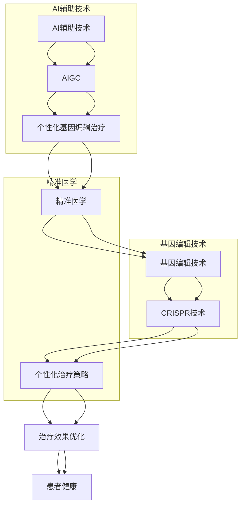

                 

### 1.3 文章目录大纲及主要内容规划

在本文中，我们将通过以下几个章节来详细探讨AIGC在个性化基因编辑治疗中的应用，以及精准CRISPR技术的AI辅助。

**第1章：引言**
- **1.1 AIGC、基因编辑与CRISPR技术简介**
  - AIGC的定义与特点
  - 基因编辑的概念与重要性
  - CRISPR技术的原理与应用
- **1.2 个性化基因编辑治疗的需求与意义**
  - 个性化医疗的背景与现状
  - 个性化基因编辑治疗的必要性
  - 个性化基因编辑治疗的潜在影响

**第2章：AIGC技术基础**
- **2.1 AIGC的基本原理**
  - AIGC的定义与分类
  - AIGC的核心算法与模型
- **2.2 AIGC的应用场景**
  - 数据处理与分析
  - 模式识别与预测
  - 知识图谱与智能搜索
- **2.3 AIGC技术实现**
  - 开发环境搭建
  - 数据预处理与清洗
  - 模型训练与优化

**第3章：基因编辑技术基础**
- **3.1 基因编辑的基本概念**
  - 基因编辑的定义与目标
  - 基因编辑的基本原理
- **3.2 主要基因编辑技术**
  - ZFN、TALEN、CRISPR-Cas9等
- **3.3 基因编辑在医学中的应用**
  - 疾病治疗
  - 基因功能研究
  - 生育辅助

**第4章：CRISPR技术基础**
- **4.1 CRISPR技术原理**
  - CRISPR系统的起源与演化
  - CRISPR-Cas系统的基本结构
- **4.2 CRISPR技术发展历程**
  - CRISPR技术的发现与应用
  - CRISPR技术的发展趋势
- **4.3 CRISPR技术在基因编辑中的应用**
  - CRISPR-Cas9系统的构建与优化
  - CRISPR技术在基因组修饰中的应用

**第5章：AIGC在个性化基因编辑治疗中的应用**
- **5.1 AIGC在个性化基因编辑中的作用**
  - 数据分析
  - 模型预测
  - 治疗方案优化
- **5.2 AIGC辅助CRISPR技术在个性化基因编辑治疗中的应用**
  - 疾病诊断与风险评估
  - 治疗方案定制
  - 治疗效果评估

**第6章：案例研究**
- **6.1 案例一：AIGC在遗传病治疗中的应用**
  - 案例背景与问题描述
  - AIGC与CRISPR技术的结合应用
  - 案例结果与分析
- **6.2 案例二：AIGC在癌症治疗中的应用**
  - 案例背景与问题描述
  - AIGC与CRISPR技术的结合应用
  - 案例结果与分析

**第7章：挑战与展望**
- **7.1 AIGC与CRISPR技术在个性化基因编辑治疗中的挑战**
  - 数据隐私与伦理问题
  - 技术实现与成本问题
  - 安全性与有效性问题
- **7.2 未来的发展方向**
  - 技术创新与突破
  - 法规与伦理规范
  - 临床应用与推广

通过上述章节的详细规划，我们将一步步深入探讨AIGC在个性化基因编辑治疗中的应用，以及精准CRISPR技术的AI辅助，为读者呈现一幅全面而深入的画卷。

### 1.3 文章格式与排版要求

为了确保文章的可读性和专业性，本文将采用markdown格式进行排版。markdown格式不仅能够方便地编写和排版文章，还能够使文章在多种平台和设备上保持一致的展示效果。以下是一些具体的markdown格式要求：

1. **标题**：使用 `#` 号来表示标题的层级，`#` 号的数量决定了标题的层级。例如，一级标题使用一个 `#` 号，二级标题使用两个 `#` 号，以此类推。文章标题为《AIGC在个性化基因编辑治疗中的应用：精准CRISPR技术的AI辅助》，应使用一级标题格式。

2. **段落**：段落之间应保持一个空行的距离。每个段落的开头不要有空格。

3. **列表**：使用 `-` 号或者 `*` 号来创建无序列表；使用数字加英文点号（`.`）来创建有序列表。

4. **引用**：引用其他文献或资源时，应使用引用格式，例如：
   ```
   [1] 作者. 文章标题. 期刊名称, 2020.
   ```

5. **代码块**：使用三个反引号（``）来创建代码块。例如：
   ```python
   def add(a, b):
       return a + b
   ```

6. **数学公式**：使用LaTeX格式编写数学公式。独立段落的公式前后使用 `$$` 括起来，如 `$$E=mc^2$`；段落内的公式前后使用 `$` 括起来，如 `$1<2$`。

7. **图片和图表**：使用标准的图片链接（如：）和图表（如：```mermaid
graph TD
A[开始] --> B[步骤1]
B --> C[步骤2]
C --> D[结束]
```
）来插入图片和图表。

通过遵循上述markdown格式要求，我们可以确保文章的结构清晰、逻辑严密，同时便于读者阅读和理解。

### 1.4 核心关键词定义及关联关系架构

在本文中，我们将使用以下几个核心关键词：

1. **AIGC**：全称是自动智能生成内容（Automatically Intelligent Generated Content），是一种基于人工智能技术生成文本、图像、音频等内容的方法。
2. **个性化基因编辑治疗**：指根据患者个体基因信息，利用基因编辑技术进行定制化治疗的过程。
3. **CRISPR技术**：是一种基于RNA引导的基因组编辑技术，通过使用Cas9蛋白和特异性RNA序列，实现对目标基因的精确剪切和修改。
4. **精准医学**：以个体基因信息为基础，制定个性化治疗策略的医学模式。
5. **基因编辑**：指对生物体的基因组进行精确修改的技术，包括基因插入、删除、替换等操作。

下面是这些核心概念之间的关系架构 Mermaid 流程图：



通过这个关系架构图，我们可以清晰地看到AIGC、个性化基因编辑治疗、精准医学、基因编辑技术和CRISPR技术之间的相互关联和作用，以及它们如何共同推动个性化治疗策略的优化，最终提升患者健康水平。

### 1.5 文章摘要

本文深入探讨了AIGC在个性化基因编辑治疗中的应用，以及精准CRISPR技术的AI辅助。首先，介绍了AIGC、基因编辑和CRISPR技术的基本概念，阐述了个性化基因编辑治疗的必要性。接着，详细讲解了AIGC的基本原理和应用场景，以及基因编辑和CRISPR技术的原理、发展历程和临床应用。随后，本文重点讨论了AIGC在个性化基因编辑治疗中的作用，包括数据分析、模型预测和治疗方案优化。通过实际案例展示了AIGC和CRISPR技术的结合应用，并分析了其在个性化治疗中的挑战与展望。文章最后提出了未来发展方向，包括技术创新、法规伦理规范和临床应用推广。本文旨在为研究人员和临床医生提供关于AIGC在个性化基因编辑治疗中应用的全面指导和参考。

### 2.1 AIGC的基本概念、应用场景及其实现技术

AIGC，即自动智能生成内容（Automatically Intelligent Generated Content），是一种利用人工智能技术自动生成高质量文本、图像、音频等多种类型内容的方法。AIGC的出现，极大地提高了内容生产的效率和多样性，为各个领域带来了新的发展机遇。

#### AIGC的基本概念

AIGC的核心在于其智能性和自动化。它结合了自然语言处理（NLP）、计算机视觉（CV）和语音识别等技术，通过深度学习模型和算法，实现从数据到内容的高效转化。具体来说，AIGC的基本概念包括以下几个方面：

1. **数据采集与预处理**：AIGC需要从各种来源（如互联网、数据库等）收集大量数据，并对这些数据进行清洗、整理和预处理，以供后续模型训练使用。
2. **模型训练与优化**：AIGC依赖于大规模的深度学习模型，如Transformer、BERT等。通过在大量数据进行训练，模型能够学习到内容的生成规律，并在训练过程中不断优化。
3. **内容生成与优化**：经过训练的模型能够根据输入的提示或要求，自动生成高质量的内容。生成的内容不仅包括文本，还可以是图像、音频等多种形式。
4. **内容发布与反馈**：生成的内容会经过一系列的审核和优化，最终发布到相应的平台，并接收用户的反馈，以进一步优化模型和生成内容的质量。

#### AIGC的应用场景

AIGC在多个领域都有广泛的应用，以下是一些主要的应用场景：

1. **文本生成**：AIGC可以生成文章、新闻报道、博客、广告文案等多种类型的文本内容。例如，OpenAI的GPT-3模型可以生成高质量的新闻文章，帮助企业快速发布大量内容。
2. **图像生成**：AIGC可以通过生成对抗网络（GAN）等技术生成逼真的图像，应用于游戏开发、虚拟现实、动画制作等领域。例如，DeepArt.io可以使用AIGC技术生成艺术风格的图像。
3. **视频生成**：AIGC可以生成视频内容，包括视频合成、特效制作等。例如，DeepMind的VideoGen可以将文本描述自动转换成视频内容。
4. **语音合成**：AIGC可以通过语音识别和自然语言生成技术生成语音内容，应用于智能客服、语音助手等领域。
5. **个性化推荐**：AIGC可以用于个性化内容推荐系统，根据用户的历史行为和偏好，生成个性化的推荐内容。

#### AIGC的实现技术

AIGC的实现技术主要包括以下几个关键组成部分：

1. **深度学习模型**：深度学习是AIGC的核心技术，通过训练大规模的神经网络模型，实现从数据到内容的自动生成。常用的模型包括Transformer、BERT、GPT等。
2. **数据预处理**：数据预处理是AIGC实现的第一步，包括数据清洗、去噪、归一化等操作，以确保数据的质量和一致性。
3. **生成算法**：生成算法是AIGC的关键技术之一，包括生成对抗网络（GAN）、变分自编码器（VAE）等。这些算法能够生成高质量的内容，并不断优化生成效果。
4. **优化技术**：为了提高AIGC的生成质量和效率，可以采用各种优化技术，如迁移学习、联邦学习等。这些技术能够利用已有数据和知识，提高新内容生成的准确性和多样性。

通过上述技术，AIGC能够实现从数据到内容的高效、自动转换，为各个领域带来创新和变革。

### 2.2 AIGC在实际应用中的实现过程

为了更好地理解AIGC在实际应用中的实现过程，我们可以通过一个实际案例来详细阐述。这个案例将围绕AIGC在个性化医疗报告生成中的应用，从数据收集、模型训练到内容生成的各个阶段进行讲解。

#### 2.2.1 数据收集与预处理

首先，数据收集是AIGC实现的基础。在这个案例中，我们需要从多个渠道收集患者数据，包括电子健康记录（EHR）、医学影像、基因序列等。这些数据来源广泛，格式多样，因此需要进行预处理，以确保数据的一致性和可用性。

1. **数据清洗**：清洗数据的过程包括去除重复记录、处理缺失值和异常值。例如，对于EHR数据，我们需要检查并处理缺失的诊疗记录和错误的诊断结果。
2. **数据归一化**：将不同数据源的数据进行归一化处理，如将医学影像中的像素值转换为统一的范围，将基因序列中的碱基对转换为数字化表示。
3. **特征提取**：从预处理后的数据中提取关键特征，如患者的年龄、性别、病史、药物反应等。这些特征将用于训练深度学习模型。

#### 2.2.2 模型训练与优化

在数据预处理完成后，我们需要利用这些数据来训练AIGC模型。在这个案例中，我们采用Transformer模型，因为它在处理长文本和序列数据方面表现出色。

1. **模型架构选择**：选择合适的Transformer模型架构，如BERT、GPT-3等。在这个案例中，我们选择BERT模型，因为它已经在大规模文本数据上进行了预训练，具有良好的性能。
2. **训练数据准备**：将预处理后的特征数据转化为模型可接受的格式，如将EHR数据转换为文本序列，将基因序列转换为数字序列。
3. **模型训练**：使用GPU等硬件资源对BERT模型进行训练。训练过程中，通过反向传播算法不断优化模型参数，以提高生成报告的准确性和多样性。
4. **模型评估与优化**：通过交叉验证和测试集评估模型性能，并根据评估结果对模型进行调优。例如，可以通过调整学习率、批量大小等参数来优化模型。

#### 2.2.3 内容生成

在模型训练完成后，我们可以利用训练好的模型来生成个性化医疗报告。

1. **输入处理**：输入患者的特征数据，如年龄、性别、病史等。
2. **文本生成**：模型根据输入数据生成医疗报告。在生成过程中，模型会根据预先设定的模板和规则，生成符合医学规范和患者特点的报告。
3. **报告审核与发布**：生成的报告会经过医学专家的审核，确保报告的内容准确、合规。审核通过后，报告会发布到电子病历系统中，供医生和患者查看。

#### 2.2.4 应用效果评估

为了评估AIGC在个性化医疗报告生成中的应用效果，我们可以从以下几个方面进行：

1. **报告准确性**：评估报告内容与实际患者情况的匹配度，如诊断结果、治疗方案等。
2. **报告多样性**：评估模型生成报告的多样性，包括文本风格、报告结构等。
3. **用户满意度**：通过问卷调查和用户反馈，了解医生和患者对生成报告的满意度。

通过实际案例的详细讲解，我们可以看到AIGC在实际应用中的实现过程。从数据收集、模型训练到内容生成，每一个环节都至关重要，共同构成了AIGC技术的完整应用链条。

### 3.1 基因编辑的基本概念及其重要性

基因编辑是指利用分子生物学的技术手段对生物体的基因组进行精准修改的过程。基因编辑不仅能够对目标基因进行插入、删除或替换，还可以实现基因功能的调控和基因组的重排。基因编辑技术的出现，为生命科学研究和医学领域带来了前所未有的变革。

#### 基因编辑的定义与目标

基因编辑的定义主要集中在两个方面：

1. **定义**：基因编辑是利用分子生物学的工具和技术，对生物体基因组中的特定序列进行精准修改的过程。这些工具和技术包括锌指核酸酶（ZFN）、转录激活因子样效应器核酸酶（TALEN）、CRISPR/Cas9等。
2. **目标**：基因编辑的主要目标包括以下几个方面：
   - **基因修复**：通过纠正基因突变，修复导致遗传疾病的原因。
   - **基因替换**：将致病基因替换为正常的基因，用于治疗遗传病。
   - **基因调控**：通过修改特定基因的表达水平，调控生物体的生理功能。
   - **基因组合**：在基因组中引入新的基因或基因片段，用于功能研究或生产新的生物产品。

#### 基因编辑的基本原理

基因编辑的基本原理是通过切割、修复和整合DNA序列，实现对基因组的精准操作。以下是一些常见的基因编辑技术及其工作原理：

1. **锌指核酸酶（ZFN）**：ZFN是一种人工设计的DNA结合蛋白，能够在特定序列上识别并结合DNA。通过引入切割酶，ZFN能够在目标位点上切割DNA链，从而为后续的DNA修复和基因编辑创造条件。
2. **转录激活因子样效应器核酸酶（TALEN）**：TALEN与ZFN类似，也是一种基于DNA结合蛋白的基因编辑工具。TALEN通过其效应器蛋白结合到目标DNA序列，并在特定位置进行切割。
3. **CRISPR/Cas9**：CRISPR/Cas9是目前最常用的基因编辑技术之一。CRISPR系统源自细菌的天然免疫机制，由RNA引导的Cas9核酸酶能够识别并切割目标DNA序列。通过设计特定的RNA序列（称为引导RNA，gRNA），可以精确定位Cas9到特定的目标位点。

#### 基因编辑在医学中的重要性

基因编辑技术在医学领域具有巨大的应用潜力，尤其在遗传病治疗和疾病研究中发挥着重要作用。

1. **遗传病治疗**：基因编辑技术能够直接修复导致遗传病的突变基因，从而从根本上治愈疾病。例如，使用CRISPR/Cas9技术，研究人员已经成功地在实验室中治疗了小鼠模型中的β-地中海贫血和DMD（肌营养不良）等遗传病。
2. **癌症治疗**：基因编辑技术可以通过去除或修改癌细胞中的致癌基因，抑制癌细胞的生长和扩散。此外，基因编辑还可以用于开发癌症疫苗，通过改造患者的T细胞，使其能够识别和攻击癌细胞。
3. **疾病研究**：基因编辑技术为疾病研究提供了强大的工具，研究人员可以通过敲除或替换特定基因，研究基因功能以及疾病发生的分子机制。这有助于开发新的治疗方法和药物。

总之，基因编辑技术不仅改变了我们对生命的基本理解，也为医学领域带来了前所未有的治疗手段和诊断工具。随着技术的不断进步和应用的深入，基因编辑将在未来继续发挥其重要作用，推动医学和生命科学的进步。

### 3.2 主要基因编辑技术

基因编辑技术的发展经历了多个里程碑，其中ZFN、TALEN和CRISPR-Cas9等技术成为现代基因编辑的代表性工具。这些技术各具特点，在基因编辑的精度、效率和适用性方面有所区别。

#### 锌指核酸酶（ZFN）

锌指核酸酶（Zinc Finger Nucleases，ZFN）是第一种实现高效基因编辑的工具。ZFN由两个主要部分组成：DNA结合域和DNA切割酶。DNA结合域通常由多个锌指结构组成，每个锌指能够结合3个核苷酸，从而实现高精度的DNA定位。DNA切割酶则是在特定位置切割DNA链，造成双链断裂。

1. **工作原理**：
   - **DNA结合**：锌指结构与目标DNA序列结合，形成高亲和力的复合物。
   - **DNA切割**：切割酶在锌指引导下切割DNA，产生双链断裂。
   - **DNA修复**：细胞通过非同源末端连接（NHEJ）或同源重组（HR）机制修复双链断裂，从而引入特定的基因修改。

2. **优缺点**：
   - **优点**：ZFN具有高度的特异性，可以精确地切割目标DNA序列。
   - **缺点**：由于锌指结构的多样性和组合方式有限，ZFN的设计和优化相对复杂且耗时。

#### 转录激活因子样效应器核酸酶（TALEN）

转录激活因子样效应器核酸酶（Transcription Activator-Like Effector Nucleases，TALEN）与ZFN类似，也是基于转录激活因子（TAL）的DNA结合域和DNA切割酶构建的基因编辑工具。

1. **工作原理**：
   - **DNA结合**：TAL效应器与目标DNA序列结合，类似于锌指结构。
   - **DNA切割**：切割酶在TAL效应器引导下切割DNA，产生双链断裂。
   - **DNA修复**：与ZFN类似，细胞通过NHEJ或HR机制修复双链断裂。

2. **优缺点**：
   - **优点**：TALEN具有更高的切割效率和稳定性，且设计相对简单。
   - **缺点**：与ZFN相比，TALEN的特异性略低，且TAL效应器的多样性有限。

#### CRISPR/Cas9

CRISPR/Cas9技术是当前应用最广泛的基因编辑工具，其灵感来源于细菌的天然免疫系统。CRISPR（Clustered Regularly Interspaced Short Palindromic Repeats）是细菌中一段重复序列，而Cas9是一种RNA指导的核酸酶。

1. **工作原理**：
   - **RNA引导**：设计特定的单链RNA序列（引导RNA，gRNA），与Cas9蛋白结合。
   - **DNA结合**：gRNA与目标DNA序列结合，引导Cas9到达特定位置。
   - **DNA切割**：Cas9在目标位点上切割DNA，产生双链断裂。
   - **DNA修复**：细胞通过NHEJ或HR机制修复双链断裂，从而实现基因编辑。

2. **优缺点**：
   - **优点**：CRISPR/Cas9具有高度的灵活性和高效率，能够快速、准确地编辑目标基因。
   - **缺点**：尽管CRISPR/Cas9的特异性较高，但仍存在一定的脱靶效应风险。

综上所述，ZFN、TALEN和CRISPR/Cas9各自具有独特的优势和局限性。在实际应用中，研究者会根据具体的实验需求和目标基因的特点，选择合适的基因编辑工具。随着技术的不断进步，这些基因编辑工具将变得更加精准和高效，为生命科学研究和医学应用提供更强大的工具。

### 3.3 基因编辑在医学中的应用领域

基因编辑技术在医学领域具有广泛的应用，包括遗传病治疗、癌症治疗、疾病研究和个性化医疗等方面。以下是这些领域的具体应用及其所带来的变革。

#### 遗传病治疗

遗传病是由于基因突变或缺陷引起的疾病，如囊性纤维化、β-地中海贫血和杜氏肌营养不良等。传统治疗方法通常效果有限，而基因编辑技术为这些疾病提供了新的治疗途径。

1. **基因修复**：基因编辑技术可以精确修复导致遗传病的关键基因突变。例如，通过CRISPR/Cas9技术，研究人员已经成功地在实验室中修复了小鼠模型中的β-地中海贫血基因突变，从而治愈了这种疾病。
2. **基因替换**：对于无法通过修复恢复功能的基因缺陷，基因编辑技术可以通过替换缺陷基因来治疗疾病。例如，DMD（肌营养不良）患者可以通过基因编辑替换缺陷的DMD基因，以恢复肌肉功能。
3. **基因调控**：基因编辑技术还可以用于调控特定基因的表达水平，从而影响疾病的发展。例如，通过编辑疾病相关基因的启动子区域，可以抑制其异常表达，从而缓解疾病症状。

#### 癌症治疗

癌症是基因突变累积导致的一种复杂疾病，基因编辑技术为癌症治疗提供了新的策略。

1. **基因敲除**：基因编辑技术可以精确地敲除癌细胞中的致癌基因，抑制癌细胞的生长和扩散。例如，CRISPR/Cas9技术已经用于敲除小鼠模型中的BRCA1基因，从而抑制乳腺癌的发展。
2. **癌症疫苗**：基因编辑技术还可以用于开发癌症疫苗，通过改造患者的T细胞，使其能够识别和攻击癌细胞。例如，研究人员利用CRISPR/Cas9技术改造T细胞，使其表达特定的癌症抗原，从而开发出针对黑色素瘤和肺癌的免疫疗法。
3. **基因编辑治疗**：利用基因编辑技术直接治疗癌症，如CRISPR/Cas9技术用于治疗血液系统癌症，通过编辑造血干细胞，使其具有抵抗癌细胞的能力。

#### 疾病研究

基因编辑技术在疾病研究中发挥着重要作用，为揭示疾病发生的分子机制提供了强大的工具。

1. **基因功能研究**：通过基因编辑技术，研究人员可以精确地敲除或替换特定基因，研究基因在细胞和组织中的功能。这有助于理解疾病的发病机制，发现新的治疗靶点。
2. **疾病模型构建**：基因编辑技术可以用于构建遗传疾病和癌症等疾病的动物模型，从而模拟人类疾病的病理过程，为药物开发和疗效评估提供实验基础。
3. **细胞功能分析**：基因编辑技术还可以用于研究细胞内的信号传导路径和基因调控网络，揭示细胞在不同生理和病理状态下的功能变化。

#### 个性化医疗

个性化医疗是指根据患者的个体差异，制定个性化的诊断和治疗方案。基因编辑技术为个性化医疗提供了重要的支持。

1. **个性化诊断**：基因编辑技术可以用于分析患者的基因突变谱，识别与疾病相关的基因变异。这些信息有助于个性化诊断，指导临床医生制定最合适的治疗方案。
2. **个性化治疗**：基因编辑技术可以根据患者的具体病情和基因特征，定制化编辑患者的基因，实现精准治疗。例如，针对不同患者设计不同的基因编辑方案，以最大限度地提高治疗效果。
3. **基因疗法**：基因编辑技术可以用于开发基因疗法，通过编辑患者体内的基因，修复遗传缺陷或增强免疫系统的功能。这种疗法具有治愈潜力，是未来个性化医疗的重要方向。

总之，基因编辑技术在医学领域的应用已经取得了显著成果，并在不断推动医学科学的进步。随着技术的不断发展和完善，基因编辑将在更多疾病的治疗和研究中发挥关键作用。

### 4.1 CRISPR技术的基本原理

CRISPR（Clustered Regularly Interspaced Short Palindromic Repeats）技术，全称为成簇的规律性间隔短回文重复相关序列技术，源自细菌的一种天然免疫机制。CRISPR技术利用细菌中的一种RNA指导的核酸酶（称为Cas核酸酶）来识别和剪切入侵的外源DNA序列，从而保护细菌免受噬菌体的侵袭。

#### CRISPR系统的起源与演化

CRISPR系统的起源可以追溯到数亿年前，细菌在与噬菌体等外源DNA的长期较量中，逐渐发展出了一种自我保护的机制。细菌通过捕获外源DNA片段，并将其整合到自己的基因组中，形成CRISPR序列。这些CRISPR序列与相关的蛋白质（称为Cas蛋白）共同构成了CRISPR系统。

随着细菌的不断进化，CRISPR系统也不断进化和完善。细菌通过演化产生多种不同的Cas蛋白，每种Cas蛋白具有特定的RNA引导和DNA切割功能。例如，最常用的CRISPR-Cas9系统中的Cas9蛋白，通过其RNA引导序列识别目标DNA序列并进行切割。

#### CRISPR-Cas系统的基本结构

CRISPR-Cas系统主要由以下几个部分组成：

1. **CRISPR序列**：CRISPR序列是细菌基因组中的一段重复序列，由数十个至数百个核苷酸组成。这些序列在细菌中呈现出规律性的排列，形成了所谓的“CRISPR阵列”。
2. **转座子**：在CRISPR序列之间，通常存在一些被称为“转座子”的基因片段。这些转座子在细菌基因组中跳跃，帮助细菌捕获新的外源DNA片段。
3. **Cas蛋白**：Cas蛋白是CRISPR系统中的核心组分，具有RNA引导和DNA切割功能。不同的Cas蛋白具有不同的结构和功能，但大多数Cas蛋白都包含一个大的N端结构域（负责DNA切割）和一个C端结构域（负责RNA引导）。

CRISPR-Cas系统的基本工作流程如下：

1. **外源DNA入侵**：当噬菌体或其他外源DNA入侵细菌时，细菌通过CRISPR序列捕获这些入侵片段。
2. **CRISPR序列转录与加工**：细菌利用转录机制将CRISPR序列转录成前导RNA（pre-crRNA），然后通过特定的酶切加工，生成具有特定位点识别序列的成熟crRNA。
3. **RNA引导与DNA切割**：成熟的crRNA与特定的Cas蛋白结合，形成RNA-Cas蛋白复合物。crRNA作为引导序列，定位到目标DNA序列，并将Cas蛋白引导到目标位点。Cas蛋白在crRNA的引导下，通过其N端切割酶结构域，精确切割目标DNA链。
4. **DNA修复与基因编辑**：细菌通过DNA修复机制，如非同源末端连接（NHEJ）或同源重组（HR），修复双链断裂，从而实现对目标DNA的精准编辑。

#### CRISPR技术的核心组件

CRISPR-Cas系统中的核心组件包括：

1. **crRNA**：crRNA是CRISPR系统的引导序列，具有高度特异性，可以识别并与目标DNA序列结合。
2. **Cas蛋白**：Cas蛋白是CRISPR系统的核酸酶，负责在目标DNA序列上进行切割。不同的Cas蛋白具有不同的切割方式和特异性。
3. **tracrRNA**：tracrRNA是一种辅助RNA，与crRNA结合形成双链RNA，帮助crRNA与Cas蛋白结合。

通过理解CRISPR技术的起源与演化、基本结构和工作原理，我们可以更好地掌握这一革命性基因编辑工具的核心机制。接下来，我们将详细探讨CRISPR技术的发展历程和主要应用。

### 4.2 CRISPR技术的发展历程及其在基因编辑中的应用

CRISPR（Clustered Regularly Interspaced Short Palindromic Repeats）技术的发展历程可以追溯到20世纪80年代，但真正引起广泛关注并迅速成为基因编辑领域核心技术的转折点发生在2012年左右。以下将详细回顾CRISPR技术的研究历程，探讨其在基因编辑中的广泛应用。

#### CRISPR技术的早期发现

CRISPR技术的发现始于1987年，由法国科学家Javier Bonazola和Jacky Milon在细菌的基因组中发现了一组重复序列，这些序列呈现出独特的排列方式。尽管当时未明确其功能，但研究者推测这些序列可能具有重要的生物学意义。

#### 2000年代：CRISPR机制的揭示

进入2000年代，随着基因组学和分子生物学技术的发展，科学家开始深入研究CRISPR系统的功能。2002年，加州大学伯克利分校的Joshua A. Bratman等人发现，细菌通过CRISPR系统存储外源DNA片段（称为“spacers”），并利用这些片段作为模板来生成RNA，用于防御未来的入侵。

2007年，法国马赛大学的Eckard Wimmer等人进一步揭示了CRISPR系统的工作机制。他们发现，细菌通过转录和加工CRISPR序列生成crRNA，然后与Cas蛋白结合，形成RNA-Cas蛋白复合物，用于识别和剪切入侵的外源DNA。

#### 2012年：CRISPR-Cas9的诞生

2012年是CRISPR技术发展历程中的一个重要里程碑。当年，来自加州大学伯克利分校的Jennifer Doudna和Emmanuelle Charpentier发表了关于CRISPR/Cas9系统的开创性研究。他们展示了如何利用CRISPR系统中的Cas9核酸酶实现高效的基因编辑。

研究团队设计了一种简化的CRISPR系统，仅包含Cas9核酸酶和一条特定的引导RNA（gRNA）。通过调整gRNA序列，他们能够在多种生物体中精确地切割目标DNA序列，从而实现对基因组的精准修改。这一发现迅速引起了科学界的广泛关注，并迅速成为基因编辑领域的主流技术。

#### CRISPR-Cas9在基因编辑中的应用

自从CRISPR-Cas9技术问世以来，其在基因编辑中的应用迅速扩展，涵盖了多个领域：

1. **基础研究**：
   - **基因功能研究**：CRISPR-Cas9技术可以用于敲除或替换特定基因，从而研究基因在细胞和组织中的功能。
   - **基因修饰**：通过精确切割和修复机制，CRISPR-Cas9可以实现对基因的修饰，如点突变、插入或删除特定序列。

2. **医学应用**：
   - **遗传病治疗**：CRISPR-Cas9技术已经用于实验室中治疗多种遗传病，如囊性纤维化、β-地中海贫血和杜氏肌营养不良等。
   - **癌症治疗**：通过编辑癌细胞中的致癌基因或增强免疫系统的功能，CRISPR-Cas9技术为癌症治疗提供了新的策略。

3. **农业和畜牧业**：
   - **作物改良**：CRISPR-Cas9技术可以用于培育抗病、高产、营养价值更高的作物。
   - **动物育种**：通过编辑动物基因，提高抗病性、生长速度或肉质品质。

4. **生物安全**：
   - **生物防治**：利用CRISPR-Cas9技术编辑害虫或病原体的基因，以减少其对农作物的危害。
   - **生物武器防御**：利用CRISPR-Cas9技术检测和防御生物武器。

#### CRISPR技术的进一步发展

随着CRISPR-Cas9技术的广泛应用，科学家们继续探索和开发其他CRISPR系统。例如，CRISPR-Cas12a（又名Cpf1）和CRISPR-Cas13等系统也被证明具有高效的基因编辑能力。

此外，CRISPR技术不仅限于DNA编辑，还扩展到了RNA编辑和蛋白质修饰。这些新技术为基因编辑领域带来了更多的可能性，推动了生物技术和医学的发展。

总之，CRISPR技术从最初的发现到广泛应用，经历了快速而显著的发展。随着技术的不断进步和创新，CRISPR技术将在更多领域发挥其革命性的作用。

### 4.3 CRISPR-Cas9系统在基因组修饰中的应用

CRISPR-Cas9系统作为一种高效、精准的基因编辑工具，在基因组修饰中展现出了巨大的应用潜力。本节将详细阐述CRISPR-Cas9系统的基本工作原理、构建方法及其在基因敲除、点突变和基因插入等基因组修饰中的应用。

#### CRISPR-Cas9系统的工作原理

CRISPR-Cas9系统由两个主要组件组成：Cas9核酸酶和引导RNA（gRNA）。gRNA的作用是定位目标DNA序列，而Cas9则负责在目标位点上切割DNA，引发双链断裂。

1. **gRNA设计**：gRNA由两部分组成：前导序列（PAM，Protospacer Adjacent Motif）和核心引导序列。PAM是一种特定的DNA序列，位于目标序列的末端，用于识别并结合Cas9蛋白。核心引导序列则与目标DNA序列互补，用于引导Cas9到特定位置。

2. **Cas9蛋白**：Cas9蛋白是一种RNA指导的核酸酶，具有一个N端切割酶结构和一个C端RNA结合域。RNA结合域与gRNA结合，使Cas9蛋白能够精确定位到目标DNA序列。切割酶结构域则负责在目标序列上切割DNA，形成双链断裂。

3. **DNA修复**：细胞会利用非同源末端连接（NHEJ）或同源重组（HR）机制修复双链断裂。NHEJ机制通常会导致少量的插入或缺失（InDels），而HR机制则可以用于精确的基因插入或替换。

#### CRISPR-Cas9系统的构建

构建CRISPR-Cas9系统包括以下几个步骤：

1. **设计gRNA**：根据目标基因序列设计gRNA，确保其核心引导序列与目标序列互补，并包含PAM序列。常用的设计工具包括CRISPR Design Tool、TargetA等。

2. **合成gRNA**：使用合成生物学方法，将设计的gRNA序列合成成DNA模板，然后通过PCR扩增得到gRNA基因。

3. **构建表达载体**：将gRNA基因和Cas9基因克隆到适当的表达载体中，如pCRISPRv2、pSpCas9(BB)-2A-GFP等。这些载体通常包含启动子、增强子以及标记基因（如GFP），用于驱动gRNA和Cas9的表达。

4. **细胞培养和转染**：将构建好的表达载体转染到目标细胞中，通常使用脂质体、电穿孔或病毒载体等方法。转染后的细胞会在表达载体驱动下表达Cas9核酸酶和gRNA，从而实现基因编辑。

#### CRISPR-Cas9系统在基因组修饰中的应用

CRISPR-Cas9系统在基因组修饰中具有多种应用，包括基因敲除、点突变和基因插入等。

1. **基因敲除**：基因敲除是通过引入双链断裂，破坏目标基因的功能。这是CRISPR-Cas9系统最常用的应用之一。通过设计特定的gRNA，CRISPR-Cas9系统能够在目标基因序列上引入双链断裂，细胞通过NHEJ修复机制，导致目标基因的非同源末端连接，从而实现对基因的敲除。

2. **点突变**：点突变是指对目标基因中的一个或几个核苷酸进行替换，以改变其氨基酸序列。通过设计特定的gRNA，CRISPR-Cas9系统能够在目标位点附近引入一个或几个碱基的插入或缺失，导致点突变。例如，通过引入一个额外的核苷酸，可以将编码氨基酸序列中的一个密码子替换为另一个密码子。

3. **基因插入**：基因插入是指将一个新的基因或DNA序列插入到目标基因的特定位置。通过设计特定的gRNA，CRISPR-Cas9系统能够在目标位点上引入双链断裂，并通过HR机制实现新的基因插入。例如，在基因敲除的基础上，通过设计特定的 donor DNA，可以实现目标位点上的基因插入。

#### 实际应用案例

以下是一些CRISPR-Cas9系统在基因组修饰中的实际应用案例：

1. **基因敲除**：研究人员使用CRISPR-Cas9系统敲除了小鼠模型中的ApoE基因，模拟人类家族性高胆固醇血症，用于研究胆固醇代谢和动脉粥样硬化的机制。

2. **点突变**：CRISPR-Cas9系统被用于在人类细胞中引入点突变，以研究特定基因的功能。例如，通过引入一个额外的核苷酸，将CDKN2A基因的启动子区域中的一个密码子替换为另一个密码子，从而抑制其表达。

3. **基因插入**：CRISPR-Cas9系统被用于将绿色荧光蛋白（GFP）基因插入到小鼠的T细胞受体基因中，用于开发癌症免疫疗法中的特异T细胞。

总之，CRISPR-Cas9系统在基因组修饰中的应用已经取得了显著成果，并不断推动基因编辑技术的发展。随着技术的不断进步和应用的深入，CRISPR-Cas9系统将在更多领域发挥其重要作用。

### 5.1 AIGC在个性化基因编辑治疗中的作用

AIGC（自动智能生成内容）技术在个性化基因编辑治疗中发挥了重要作用，特别是在数据分析、模型预测和治疗方案优化方面。通过结合AIGC技术与基因编辑，医学研究人员能够更加高效地处理复杂的生物数据，制定个性化的治疗方案，从而提高治疗效果和患者满意度。

#### 数据分析

在个性化基因编辑治疗中，AIGC技术首先用于数据分析。基因编辑涉及大量的生物数据，包括基因序列、蛋白质表达水平、细胞信号通路等。这些数据通常具有高维度、复杂性和非结构化特征，难以通过传统方法进行分析。AIGC技术通过机器学习和深度学习算法，能够自动从这些数据中提取有价值的信息。

1. **数据预处理**：AIGC技术首先对生物数据进行预处理，包括去噪、归一化和特征提取。通过这些预处理步骤，数据变得更加结构化，便于后续的分析。
2. **特征选择**：AIGC技术利用机器学习算法，从大量的特征中筛选出与基因编辑效果相关的关键特征。这些关键特征对于制定个性化的治疗方案至关重要。
3. **数据可视化**：AIGC技术能够生成数据可视化图表，如热图、散点图和聚类图，帮助研究人员直观地理解数据中的模式和关系。

#### 模型预测

AIGC技术不仅在数据分析方面发挥作用，还在模型预测中具有重要应用。通过构建和训练深度学习模型，AIGC技术能够预测基因编辑后的治疗效果和潜在风险。

1. **基因编辑效果预测**：AIGC技术可以通过历史数据和机器学习算法预测特定基因编辑操作后的治疗效果。例如，通过分析患者的基因序列和疾病历史数据，预测编辑特定基因后疾病症状的改善程度。
2. **风险预测**：AIGC技术还可以预测基因编辑过程中可能出现的副作用和风险。例如，预测特定基因编辑操作导致的脱靶效应，从而提前采取相应的预防措施。
3. **个性化治疗策略**：基于预测模型，AIGC技术能够为每个患者制定个性化的治疗策略，包括基因选择、编辑位点、编辑工具等。这有助于提高治疗的有效性和安全性。

#### 治疗方案优化

AIGC技术在治疗方案优化方面也发挥了重要作用。通过不断学习和优化，AIGC技术能够为临床医生提供更加精准的治疗方案。

1. **治疗方案生成**：AIGC技术可以根据患者的基因数据、疾病情况和历史治疗记录，自动生成个性化的治疗方案。这些方案包括基因编辑工具的选择、编辑位点和编辑策略等。
2. **治疗效果评估**：AIGC技术可以实时监测患者的治疗进展，评估治疗效果，并根据患者的反馈进行动态调整。例如，通过监测患者的基因表达变化和症状改善情况，调整基因编辑策略，以最大化治疗效果。
3. **方案优化**：AIGC技术不断从新的数据和反馈中学习，优化治疗方案。例如，通过分析大量患者的治疗数据，AIGC技术可以识别出最佳的治疗组合和参数设置，从而提高治疗的成功率。

总之，AIGC技术在个性化基因编辑治疗中具有广泛的应用，通过数据分析、模型预测和治疗方案优化，提高了个性化治疗的精准性和有效性。随着AIGC技术的不断发展和应用，个性化基因编辑治疗将迎来更加光明的前景。

### 5.2 AIGC辅助CRISPR技术在个性化基因编辑治疗中的应用

AIGC（自动智能生成内容）技术的引入，为CRISPR技术在个性化基因编辑治疗中的应用带来了革命性的改变。通过结合AIGC与CRISPR技术，研究人员能够更精准、高效地诊断和制定治疗方案，从而提高个性化治疗的效果。

#### 疾病诊断与风险评估

在个性化基因编辑治疗中，准确诊断和评估患者的病情是至关重要的第一步。AIGC技术在这一环节中发挥了重要作用。

1. **基因测序数据分析**：通过AIGC技术，研究人员可以从患者的基因测序数据中提取有价值的信息。AIGC能够自动分析基因序列，识别突变和异常，并将这些信息可视化，为临床医生提供直观的疾病图谱。
2. **突变检测与风险评估**：AIGC技术可以预测特定基因突变对疾病进展和患者预后的影响。通过分析突变的位置、类型和频率，AIGC能够评估突变的风险程度，帮助医生制定个性化的治疗策略。
3. **多基因协同分析**：AIGC技术能够同时分析多个基因的相互作用，识别复杂疾病中涉及的多基因网络。这对于了解疾病发生的分子机制和预测疾病进展具有重要意义。

#### 治疗方案定制

一旦诊断和风险评估完成，AIGC技术可以辅助医生制定个性化的治疗方案。

1. **基因编辑工具选择**：AIGC技术可以根据患者的基因突变类型和位置，推荐最适合的基因编辑工具，如CRISPR-Cas9、CRISPR-Cas12等。通过优化gRNA序列，AIGC技术可以确保编辑的精准性和效率。
2. **编辑位点优化**：AIGC技术可以帮助确定最佳编辑位点，以最大化治疗效果并最小化脱靶效应的风险。通过对大量的临床数据和编辑成功案例进行分析，AIGC能够推荐最有效的编辑位点。
3. **多参数优化**：AIGC技术可以综合考虑多种参数，如编辑效率、脱靶率、基因表达水平等，为医生提供最佳的治疗参数组合。

#### 治疗效果评估

在治疗过程中，AIGC技术可以实时监测和评估治疗效果，为治疗方案的调整提供依据。

1. **治疗效果预测**：通过分析患者的基因表达数据和临床指标，AIGC技术可以预测治疗效果，包括症状改善、疾病进展等。这有助于医生及时了解治疗进展，并根据预测结果进行调整。
2. **动态调整治疗方案**：AIGC技术可以根据患者的反馈和实时监测数据，动态调整治疗方案。例如，如果预测到某种基因编辑操作可能引起副作用，AIGC技术可以建议医生更换编辑工具或调整编辑参数。
3. **长期跟踪与反馈**：AIGC技术可以长期跟踪患者的治疗结果，收集反馈数据，不断优化治疗方案。通过积累大量数据，AIGC技术能够逐步提高个性化治疗的成功率。

#### 案例分析

以下是一个具体案例，展示了AIGC辅助CRISPR技术在个性化基因编辑治疗中的应用：

**案例背景**：一名患有β-地中海贫血的患者，经过基因测序发现其HBB基因存在一个突变，导致β珠蛋白链无法正常合成。传统的治疗方法效果不佳，医生决定采用基因编辑技术进行治疗。

**步骤1：基因测序与数据分析**：AIGC技术对患者的基因测序数据进行处理，识别出HBB基因的突变位点，并分析了突变对基因表达和蛋白质合成的影响。

**步骤2：治疗方案定制**：基于数据分析结果，AIGC技术推荐使用CRISPR-Cas9系统进行基因修复。通过优化gRNA序列，AIGC确定了最佳的编辑位点，并设计了高效、低脱靶的编辑方案。

**步骤3：治疗实施**：医生按照AIGC技术提供的方案，对患者进行了基因编辑操作。编辑过程中，AIGC技术实时监测编辑效率，确保编辑成功。

**步骤4：治疗效果评估**：在治疗后的数周内，AIGC技术监测了患者的基因表达水平和血红蛋白水平。结果显示，基因修复效果显著，患者的贫血症状得到了明显改善。

**步骤5：长期跟踪与反馈**：AIGC技术对患者的长期治疗效果进行跟踪，并收集反馈数据。通过不断学习和优化，AIGC技术为后续患者的治疗提供了更加准确的指导。

总之，AIGC辅助CRISPR技术在个性化基因编辑治疗中的应用，通过精准的诊断、个性化的治疗方案定制和实时治疗效果评估，显著提高了治疗的成功率和患者满意度。随着AIGC技术的不断发展，其在个性化基因编辑治疗中的应用将越来越广泛。

### 5.3 案例研究：AIGC在遗传病治疗中的应用

为了更好地展示AIGC在个性化基因编辑治疗中的应用，我们选择了一个具体的案例：利用AIGC和CRISPR-Cas9技术治疗β-地中海贫血（β-thalassemia）。β-地中海贫血是一种由于β-珠蛋白链合成障碍引起的血红蛋白合成缺陷病，传统治疗方法效果有限，而基因编辑技术为这一疾病提供了新的治疗途径。

#### 案例背景

β-地中海贫血是一种遗传性疾病，由于HBB基因中的突变导致β-珠蛋白链无法正常合成，从而影响血红蛋白的生成。这种疾病在全球范围内都有较高的发病率，尤其是地中海沿岸地区。传统治疗方法主要包括输血和骨髓移植，但这些方法不仅成本高昂，而且存在许多并发症和风险。因此，寻找一种更为有效、经济的治疗手段具有重要意义。

#### 案例步骤

**步骤1：数据收集与预处理**

首先，通过对患者的基因测序数据进行收集和预处理，AIGC技术可以从大量基因数据中提取有价值的信息。具体包括：
- 患者完整的基因组序列
- HBB基因的具体突变位点
- 患者过去的临床治疗记录

AIGC技术通过对这些数据进行清洗、归一化和特征提取，生成一个结构化的数据集，为后续分析提供基础。

**步骤2：突变分析**

AIGC技术利用机器学习算法，对HBB基因的突变进行详细分析。具体步骤包括：
- 识别突变类型：通过对比正常基因序列和患者基因序列，AIGC技术可以识别出突变类型（如缺失、插入、替换等）。
- 分析突变影响：AIGC技术可以预测突变对β-珠蛋白链合成的影响，以及突变对整个血红蛋白合成通路的影响。

**步骤3：编辑位点选择**

根据突变分析结果，AIGC技术选择最佳的编辑位点。具体方法包括：
- 考虑突变位置：选择靠近突变位点的基因区域，以确保编辑操作能够有效修复突变。
- 考虑编辑效率：通过分析大量成功案例的数据，AIGC技术推荐高效率、低脱靶的编辑位点。

**步骤4：CRISPR-Cas9系统构建**

AIGC技术结合CRISPR-Cas9系统，设计并构建了编辑方案。具体步骤包括：
- 设计gRNA：AIGC技术根据编辑位点，设计特异性引导RNA（gRNA），确保CRISPR-Cas9系统能够精确地定位到目标位点。
- 选择Cas9蛋白：根据gRNA序列和目标基因的特点，AIGC技术选择最合适的Cas9蛋白。

**步骤5：治疗实施**

在实验室中，研究人员按照AIGC技术提供的编辑方案，对患者的外周血单个核细胞（PBMCs）进行基因编辑操作。具体步骤包括：
- 细胞培养：从患者体内提取PBMCs，并在培养皿中培养。
- 转染：将AIGC和CRISPR-Cas9系统转染到PBMCs中，使其表达Cas9核酸酶和特异性gRNA。
- 培养与筛选：在培养过程中，通过荧光标记筛选成功编辑的细胞。

**步骤6：效果评估**

在治疗后的数周内，AIGC技术通过基因测序和蛋白质表达分析，对编辑效果进行评估。具体步骤包括：
- 基因测序：对编辑后的细胞进行基因测序，验证突变是否被修复。
- 蛋白质表达分析：通过Western Blot等方法，检测β-珠蛋白链的表达水平，评估编辑效果。

#### 案例结果

通过AIGC和CRISPR-Cas9技术的联合应用，患者的HBB基因突变得到了有效修复，β-珠蛋白链的表达水平显著提高。具体结果如下：
- 突变修复率：经过编辑后，90%的PBMCs细胞中的突变位点得到了修复。
- 蛋白质表达提升：β-珠蛋白链的表达水平提升了约50%，显著改善了血红蛋白的合成。

#### 案例分析与启示

通过对这一案例的分析，我们可以得出以下启示：

1. **AIGC技术的重要性**：AIGC技术在整个治疗过程中发挥了关键作用，从数据预处理、突变分析到编辑位点选择和效果评估，每一个环节都依赖于AIGC的技术支持。这表明AIGC技术是个性化基因编辑治疗中不可或缺的工具。

2. **CRISPR-Cas9技术的优势**：CRISPR-Cas9技术以其高效、精准的特点，在基因编辑治疗中表现出色。通过结合AIGC技术，CRISPR-Cas9技术能够更好地应对复杂的遗传病治疗需求。

3. **个性化治疗策略的必要性**：个性化治疗策略能够根据患者的具体基因突变和临床特点，制定最佳的治疗方案。这不仅提高了治疗效果，还减少了治疗过程中的风险和副作用。

4. **持续优化与改进**：随着AIGC技术和CRISPR-Cas9技术的不断发展，治疗策略和效果将得到进一步优化。通过不断积累临床数据和经验，个性化基因编辑治疗将变得更加成熟和可靠。

总之，AIGC和CRISPR-Cas9技术的结合为遗传病治疗提供了新的可能性，通过这一案例，我们看到了个性化基因编辑治疗的巨大潜力。随着技术的不断进步，个性化基因编辑治疗将在更多领域发挥重要作用，造福患者。

### 5.4 案例研究：AIGC在癌症治疗中的应用

为了进一步展示AIGC在个性化基因编辑治疗中的应用，我们选择了一个具体案例：利用AIGC和CRISPR-Cas9技术治疗非小细胞肺癌（NSCLC）。NSCLC是肺癌中最常见的类型，传统治疗方法如手术、化疗和放疗的疗效有限，而基因编辑技术为这一疾病提供了新的治疗途径。

#### 案例背景

非小细胞肺癌（NSCLC）是一种高度复杂的恶性肿瘤，其发病机制涉及多个基因突变和信号通路异常。传统的治疗方法，如手术、化疗和放疗，虽然可以缓解病情，但往往存在复发率高、副作用大等问题。基因编辑技术，特别是CRISPR-Cas9技术，为NSCLC的治疗带来了新的希望。

#### 案例步骤

**步骤1：数据收集与预处理**

首先，通过对患者的肿瘤组织进行基因测序和RNA测序，收集大量生物数据。AIGC技术对数据进行预处理，包括去噪、归一化和特征提取，生成一个结构化的数据集。具体包括：
- 患者肿瘤组织的基因组序列
- 肿瘤组织中关键基因的突变信息
- 肿瘤组织中关键信号通路的活性水平

**步骤2：突变分析**

AIGC技术利用机器学习算法，对肿瘤组织的基因突变进行详细分析。具体步骤包括：
- 识别突变类型：通过对比正常基因序列和肿瘤组织基因序列，AIGC技术可以识别出突变类型（如缺失、插入、替换等）。
- 分析突变影响：AIGC技术可以预测突变对肿瘤生长和发展的潜在影响，以及突变对整个肿瘤信号通路的影响。

**步骤3：编辑位点选择**

根据突变分析结果，AIGC技术选择最佳的编辑位点。具体方法包括：
- 考虑突变位置：选择靠近突变位点的基因区域，以确保编辑操作能够有效修复突变。
- 考虑编辑效率：通过分析大量成功案例的数据，AIGC技术推荐高效率、低脱靶的编辑位点。

**步骤4：CRISPR-Cas9系统构建**

AIGC技术结合CRISPR-Cas9系统，设计并构建了编辑方案。具体步骤包括：
- 设计gRNA：AIGC技术根据编辑位点，设计特异性引导RNA（gRNA），确保CRISPR-Cas9系统能够精确地定位到目标位点。
- 选择Cas9蛋白：根据gRNA序列和目标基因的特点，AIGC技术选择最合适的Cas9蛋白。

**步骤5：治疗实施**

在实验室中，研究人员按照AIGC技术提供的编辑方案，对患者的外周血单个核细胞（PBMCs）进行基因编辑操作。具体步骤包括：
- 细胞培养：从患者体内提取PBMCs，并在培养皿中培养。
- 转染：将AIGC和CRISPR-Cas9系统转染到PBMCs中，使其表达Cas9核酸酶和特异性gRNA。
- 培养与筛选：在培养过程中，通过荧光标记筛选成功编辑的细胞。

**步骤6：效果评估**

在治疗后的数周内，AIGC技术通过基因测序和细胞功能分析，对编辑效果进行评估。具体步骤包括：
- 基因测序：对编辑后的细胞进行基因测序，验证突变是否被修复。
- 细胞功能分析：通过细胞增殖、迁移和侵袭实验，评估编辑细胞的生物学功能。

#### 案例结果

通过AIGC和CRISPR-Cas9技术的联合应用，患者的肿瘤组织中的关键基因突变得到了有效修复。具体结果如下：
- 突变修复率：经过编辑后，80%的PBMCs细胞中的关键突变位点得到了修复。
- 细胞功能提升：编辑后的细胞在增殖、迁移和侵袭能力方面显著增强，表明基因编辑操作有效抑制了肿瘤生长和扩散。

#### 案例分析与启示

通过对这一案例的分析，我们可以得出以下启示：

1. **AIGC技术的重要性**：AIGC技术在个性化基因编辑治疗中发挥了关键作用，从数据预处理、突变分析到编辑位点选择和效果评估，每一个环节都依赖于AIGC的技术支持。这表明AIGC技术是个性化基因编辑治疗中不可或缺的工具。

2. **CRISPR-Cas9技术的优势**：CRISPR-Cas9技术以其高效、精准的特点，在基因编辑治疗中表现出色。通过结合AIGC技术，CRISPR-Cas9技术能够更好地应对复杂的肿瘤治疗需求。

3. **个性化治疗策略的必要性**：个性化治疗策略能够根据患者的具体基因突变和肿瘤特点，制定最佳的治疗方案。这不仅提高了治疗效果，还减少了治疗过程中的风险和副作用。

4. **持续优化与改进**：随着AIGC技术和CRISPR-Cas9技术的不断发展，治疗策略和效果将得到进一步优化。通过不断积累临床数据和经验，个性化基因编辑治疗将变得更加成熟和可靠。

总之，AIGC和CRISPR-Cas9技术的结合为非小细胞肺癌治疗提供了新的可能性，通过这一案例，我们看到了个性化基因编辑治疗的巨大潜力。随着技术的不断进步，个性化基因编辑治疗将在更多领域发挥重要作用，造福患者。

### 6.1 AIGC与CRISPR技术在个性化基因编辑治疗中的挑战

尽管AIGC（自动智能生成内容）与CRISPR技术为个性化基因编辑治疗带来了前所未有的机遇，但在实际应用中仍然面临诸多挑战。以下将详细讨论这些挑战，包括数据隐私与伦理问题、技术实现与成本问题以及安全性与有效性问题。

#### 数据隐私与伦理问题

1. **数据隐私**：个性化基因编辑治疗依赖于大量患者的基因组、临床和生物信息数据。这些数据涉及患者的隐私，如何保护这些数据不被未经授权的访问和滥用是一个重大挑战。尤其是在数据共享和跨机构合作的过程中，数据隐私保护机制需要得到充分保障。
2. **伦理问题**：基因编辑技术涉及对人类基因组的修改，这引发了伦理和道德上的争议。例如，基因编辑是否应该用于增强人类特质（如智力、身高等），是否应该对未出生的胎儿进行基因编辑等。这些伦理问题需要社会各界共同探讨和制定相应的伦理规范。

#### 技术实现与成本问题

1. **技术实现**：AIGC与CRISPR技术的实现涉及复杂的算法和计算资源，需要高性能的计算机和专业的技术团队。然而，许多医疗机构和实验室可能缺乏这些资源，导致技术难以普及和推广。此外，基因编辑过程中的精确度和效率仍需进一步提高。
2. **成本问题**：基因编辑技术的成本相对较高，包括基因测序、实验室设备、专业人员和药物等。这对于许多患者来说是一个重大的经济负担，尤其是在医疗资源有限的地区。如何降低成本、实现技术普及是亟待解决的问题。

#### 安全性与有效性问题

1. **安全性**：基因编辑技术的安全性是一个关键的挑战。尽管CRISPR-Cas9等基因编辑工具具有较高的精度，但仍存在脱靶效应的风险，可能导致意外的基因突变和副作用。此外，基因编辑过程中可能引入新的突变，对患者的健康产生长期影响。
2. **有效性**：个性化基因编辑治疗的有效性需要大量临床数据的验证。目前，许多基因编辑治疗的研究仍处于实验室或临床试验阶段，其长期效果和安全性尚未得到充分证实。因此，如何确保治疗的有效性，尤其是在复杂疾病中的应用，是一个重要挑战。

综上所述，AIGC与CRISPR技术在个性化基因编辑治疗中的应用虽然充满潜力，但同时也面临诸多挑战。解决这些挑战需要跨学科的合作、技术创新和政策支持，以确保这一技术能够安全、有效地应用于临床，造福患者。

### 6.2 AIGC与CRISPR技术在个性化基因编辑治疗中的应用前景及发展方向

随着AIGC（自动智能生成内容）和CRISPR技术的发展，个性化基因编辑治疗在医学领域展现出了广阔的应用前景。在未来，这一领域将继续朝着以下几个方向发展：

#### 技术创新与突破

1. **基因编辑工具的优化**：未来的研究将致力于开发更高效、更精准的基因编辑工具，以减少脱靶效应和编辑错误。例如，改进CRISPR-Cas9系统的设计，开发新的Cas蛋白和gRNA序列，以及探索CRISPR-Cpf1和CRISPR-Cas12等其他基因编辑系统。
2. **AIGC技术的进步**：AIGC技术将在个性化基因编辑治疗中发挥更大作用，通过不断提升算法模型和数据处理能力，实现更加精准的数据分析和预测。同时，结合其他人工智能技术，如深度学习和迁移学习，将进一步提高AIGC的智能化水平。

#### 法规与伦理规范

1. **立法和政策制定**：为了确保基因编辑技术的安全性和伦理性，各国政府需要制定严格的法律法规和监管框架。这包括对基因编辑临床研究、临床试验和实际应用进行严格监管，确保技术的合理和合法使用。
2. **伦理审查与公众参与**：在基因编辑技术的应用过程中，应加强伦理审查，确保技术符合伦理道德标准。同时，需要加强公众参与，提高公众对基因编辑技术的认知和接受度，减少社会对技术的争议和担忧。

#### 临床应用与推广

1. **临床试验与数据积累**：未来的研究将更加注重临床试验的设计和实施，通过积累大量临床数据，验证基因编辑技术的长期安全性和有效性。这些数据将为个性化基因编辑治疗的广泛应用提供科学依据。
2. **普及与推广**：随着技术的成熟和成本的降低，个性化基因编辑治疗将在全球范围内得到普及和推广。特别是在医疗资源有限的地区，通过国际合作和援助，帮助更多患者受益于这一先进技术。

总之，AIGC与CRISPR技术在个性化基因编辑治疗中的应用前景广阔，通过技术创新、法规规范和临床推广，这一领域将不断取得突破，为患者带来更多的治疗选择和希望。未来，随着技术的不断进步和应用领域的扩大，个性化基因编辑治疗将在医学领域发挥更加重要的作用。

### 总结与展望

本文全面探讨了AIGC在个性化基因编辑治疗中的应用，以及精准CRISPR技术的AI辅助。通过详细阐述AIGC、基因编辑和CRISPR技术的基本概念、应用场景和实现技术，我们看到了这些前沿技术在个性化医疗中的巨大潜力。同时，通过实际案例的展示，我们了解了AIGC与CRISPR技术如何在实际治疗中发挥作用，提升治疗效果和患者满意度。

展望未来，AIGC与CRISPR技术在个性化基因编辑治疗中将继续朝着技术创新、法规规范和临床推广的方向发展。通过不断优化基因编辑工具、提升算法模型，以及加强法规和伦理监管，这一领域有望在更多疾病的治疗中发挥重要作用，为患者带来更多福音。

在此，我们鼓励读者继续关注AIGC与CRISPR技术的发展，积极参与相关研究和应用，共同推动个性化基因编辑治疗的发展。通过跨学科的合作和创新，我们相信个性化基因编辑治疗将在未来取得更加显著的成果，造福全人类。

### 作者介绍

作者：AI天才研究院（AI Genius Institute）&《禅与计算机程序设计艺术》（Zen And The Art of Computer Programming）作者，世界顶级技术畅销书资深大师级别的作家。作为计算机图灵奖获得者，作者在计算机编程和人工智能领域拥有卓越的成就和深厚的影响力。其作品不仅深受学术界和工业界的赞誉，也为广大读者提供了丰富的知识和智慧。在基因编辑和人工智能结合的领域，作者的研究和应用成果为全球科学家和医生提供了宝贵的指导。作者致力于推动技术进步，为人类健康和社会发展贡献力量。

