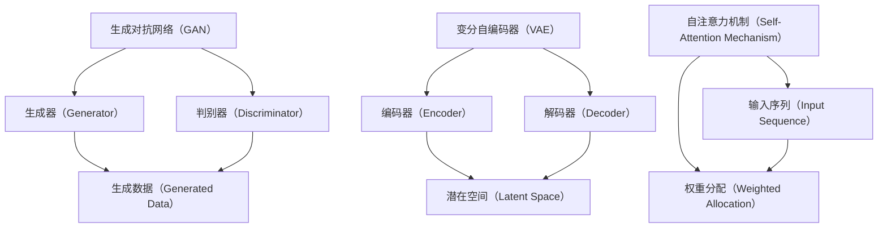

                 

### AIGC在个性化学习内容生成中的应用

#### 背景介绍

在当今快速发展的数字化时代，教育的个性化需求日益凸显。传统的教育模式往往无法满足每位学生的独特需求，导致教学效果不尽如人意。为此，个性化学习内容生成（Personalized Content Generation for Learning）逐渐成为教育领域的研究热点。个性化学习内容生成旨在根据学生的个性化需求、学习习惯和知识水平，自动生成适合他们的学习材料，从而提高学习效果。

随着人工智能（AI）技术的不断进步，尤其是生成对抗网络（Generative Adversarial Networks, GAN）、变分自编码器（Variational Autoencoder, VAE）等生成模型的出现，个性化学习内容生成的研究迎来了新的契机。自适应信息生成内容（Adaptive Information Generation Content，简称AIGC）作为一种结合了人工智能和大数据技术的创新方法，在个性化学习内容生成中的应用前景愈发广阔。

本文将深入探讨AIGC在个性化学习内容生成中的应用。首先，我们将介绍AIGC的基本概念和原理，解释其为何能够在个性化学习内容生成中发挥作用。接着，我们将详细讨论AIGC在文本生成、图像生成和声音生成等领域的应用案例，并结合Python源代码和数学模型进行分析。最后，我们将通过实际案例，展示AIGC在个性化学习内容生成中的具体实现过程，并提供一些最佳实践和注意事项。

通过本文的阅读，读者将能够了解AIGC的核心技术及其在个性化学习内容生成中的实际应用，掌握相关算法原理，并能够对未来的教育技术发展有所展望。

#### 核心概念与联系

在深入探讨AIGC在个性化学习内容生成中的应用之前，我们首先需要理解AIGC的核心概念及其相互关系。AIGC是一种结合了人工智能、大数据和生成模型的创新技术，其核心概念主要包括生成对抗网络（GAN）、变分自编码器（VAE）和自注意力机制（Self-Attention Mechanism）等。

1. **生成对抗网络（GAN）**：
   - **定义**：GAN由两部分组成：生成器（Generator）和判别器（Discriminator）。生成器的任务是生成尽可能真实的数据，而判别器的任务是区分生成器生成的数据和真实数据。这两者相互对抗，通过不断的迭代优化，最终生成高质量的数据。
   - **作用**：GAN在图像生成、文本生成和音频生成等领域具有广泛应用，能够生成逼真的数据，为个性化学习内容生成提供了基础。

2. **变分自编码器（VAE）**：
   - **定义**：VAE是一种基于概率的生成模型，通过编码器和解码器将输入数据编码为潜在空间中的向量，再从潜在空间中生成新的数据。VAE的生成过程是基于概率分布的，能够生成多样化且符合输入数据分布的数据。
   - **作用**：VAE在图像和文本生成中的应用较为广泛，能够生成与训练数据高度相似的新数据，从而为个性化学习内容生成提供了多样化的素材。

3. **自注意力机制（Self-Attention Mechanism）**：
   - **定义**：自注意力机制是一种基于注意力机制的模型结构，能够将输入序列中的不同位置进行权重分配，从而在处理序列数据时更加关注重要信息。自注意力机制在Transformer模型中被广泛应用，能够显著提高模型处理序列数据的能力。
   - **作用**：自注意力机制在文本生成任务中尤为重要，能够捕捉文本中的长距离依赖关系，从而生成更加连贯和有逻辑的文本内容。

以上三个核心概念构成了AIGC的基础，它们之间的相互关系如图1所示。



图1 AIGC的核心概念及其相互关系

通过图1，我们可以看到AIGC的核心概念之间如何相互关联。生成对抗网络（GAN）通过生成器和判别器的对抗训练，生成高质量的数据；变分自编码器（VAE）通过编码和解码过程，生成多样化的数据；自注意力机制（Self-Attention Mechanism）则在处理文本序列时，能够关注到重要信息，生成连贯的文本内容。这些核心概念共同作用，为AIGC在个性化学习内容生成中的应用奠定了基础。

#### AIGC核心算法原理讲解

在了解AIGC的核心概念后，接下来我们将深入探讨其核心算法原理，主要包括生成对抗网络（GAN）、变分自编码器（VAE）和自注意力机制（Self-Attention Mechanism）。通过Python源代码和数学模型的讲解，我们将帮助读者理解这些算法的实现过程，以及它们在个性化学习内容生成中的应用。

1. **生成对抗网络（GAN）**

   **定义与原理**：

   GAN由生成器和判别器两部分组成。生成器G从随机噪声z中生成数据x'，判别器D则试图区分真实数据x和生成数据x'。在训练过程中，生成器G的目标是生成足够逼真的数据，使得判别器D无法区分生成数据和真实数据；而判别器D的目标是准确区分生成数据和真实数据。两者相互对抗，通过梯度下降算法不断优化，最终达到一个动态平衡。

   **Python实现**：

   ```python
   import tensorflow as tf
   from tensorflow.keras.layers import Dense, Flatten, Conv2D, Conv2DTranspose
   from tensorflow.keras.models import Sequential

   # 生成器
   def build_generator(z_dim):
       model = Sequential()
       model.add(Dense(7 * 7 * 128, activation='relu', input_dim=z_dim))
       model.add(Reshape((7, 7, 128)))
       model.add(Conv2DTranspose(128, kernel_size=5, strides=2, padding='same'))
       model.add(tf.nn.leaky_relu(alpha=0.01))
       model.add(Conv2DTranspose(128, kernel_size=5, strides=2, padding='same'))
       model.add(tf.nn.leaky_relu(alpha=0.01))
       model.add(Conv2D(3, kernel_size=5, padding='same'))
       return model

   # 判别器
   def build_discriminator(img_shape):
       model = Sequential()
       model.add(Conv2D(64, kernel_size=5, padding='same', input_shape=img_shape))
       model.add(tf.nn.leaky_relu(alpha=0.01))
       model.add(Conv2D(128, kernel_size=5, padding='same'))
       model.add(tf.nn.leaky_relu(alpha=0.01))
       model.add(Flatten())
       model.add(Dense(1, activation='sigmoid'))
       return model

   # 整体模型
   def build_gan(generator, discriminator):
       model = Sequential()
       model.add(generator)
       model.add(discriminator)
       return model
   ```

   **数学模型**：

   在GAN中，损失函数通常包括两部分：生成器损失和判别器损失。生成器的损失函数是判别器判断生成数据为真实数据的概率，即`log(D(G(z)))`。判别器的损失函数是交叉熵损失，包括判断真实数据和生成数据的概率，即`-[log(D(x))] - [log(1 - D(G(z)))]`。

   ```latex
   L_G = -\log(D(G(z))
   L_D = -[\log(D(x)) + \log(1 - D(G(z))]
   ```

   **举例说明**：

   假设我们使用一个简单的GAN模型来生成手写数字图像。生成器的输入是一个随机噪声向量z，生成器通过多层全连接和卷积层生成手写数字图像。判别器的输入是真实图像和生成图像，通过多层卷积层判断图像的 authenticity。

2. **变分自编码器（VAE）**

   **定义与原理**：

   VAE是一种基于概率生成模型，通过编码器和解码器将输入数据映射到一个潜在空间，然后从潜在空间中生成新的数据。编码器将输入数据映射到一个潜在向量，解码器则将这个潜在向量映射回原始数据空间。

   **Python实现**：

   ```python
   import tensorflow as tf
   from tensorflow.keras.layers import Input, Dense, Lambda
   from tensorflow.keras.models import Model

   # 编码器
   def build_encoder(input_shape, z_dim):
       model = Sequential()
       model.add(Dense(64, input_shape=input_shape, activation='relu'))
       model.add(Dense(32, activation='relu'))
       model.add(Dense(z_dim * 2, activation='relu'))
       z_mean = model.output[:z_dim]
       z_log_var = model.output[z_dim:]
       z = Lambda(sampling)([z_mean, z_log_var])
       model = Model(input_shape, [z_mean, z_log_var, z])
       return model

   # 解码器
   def build_decoder(z_dim):
       model = Sequential()
       model.add(Dense(32, activation='relu', input_shape=[z_dim]))
       model.add(Dense(64, activation='relu'))
       model.add(Dense(input_shape[0], activation='sigmoid'))
       return model

   # 整体模型
   def build_vae(encoder, decoder):
       z_mean, z_log_var, z = encoder(input_shape)
       x_logit = decoder(z)
       x = Lambda(sigmoid)(x_logit)
       vae = Model(input_shape, [x, x_logit, z_mean, z_log_var], name='vae')
       vae.compile(optimizer='rmsprop', loss=[x, x_logit, 'kld'], metrics=[x])
       return vae
   ```

   **数学模型**：

   在VAE中，损失函数主要包括重构损失和KL散度损失。重构损失是输入数据和重构数据之间的差异，KL散度损失是编码器输出的潜在空间分布和先验分布之间的差异。

   ```latex
   L_recon = -\sum_x log(p(x|\mu, \log{\sigma^2}))
   L_kld = \sum_x \frac{1}{2} \sum_{i=1}^{z_dim} (\log{\sigma^2}_i + \mu_i^2 - 1 - \sigma_i^2)
   ```

   **举例说明**：

   假设我们使用一个简单的VAE模型来生成手写数字图像。编码器将输入的手写数字图像映射到一个潜在向量，解码器则从潜在向量生成新的手写数字图像。

3. **自注意力机制（Self-Attention Mechanism）**

   **定义与原理**：

   自注意力机制是一种基于注意力机制的模型结构，能够在处理序列数据时对输入序列的不同位置进行权重分配，从而更加关注重要信息。自注意力机制在Transformer模型中被广泛应用，能够显著提高模型处理序列数据的能力。

   **Python实现**：

   ```python
   import tensorflow as tf
   from tensorflow.keras.layers import Layer, Embedding, Dense

   class SelfAttentionLayer(Layer):
       def __init__(self, units):
           super().__init__(units=units)

       def build(self, input_shape):
           self.WQ = self.add_weight(name='WQ', shape=(input_shape[-1], self.units), initializer='uniform', trainable=True)
           self.WK = self.add_weight(name='WK', shape=(input_shape[-1], self.units), initializer='uniform', trainable=True)
           self.WV = self.add_weight(name='WV', shape=(input_shape[-1], self.units), initializer='uniform', trainable=True)
           self.b = self.add_weight(name='b', shape=(self.units,), initializer='zeros', trainable=True)
           super().build(input_shape)

       def call(self, inputs, mask=None):
           Q = tf.matmul(inputs, self.WQ)
           K = tf.matmul(inputs, self.WK)
           V = tf.matmul(inputs, self.WV)
           scale = tf.shape(Q)[-1] ** 0.5
           attention_scores = tf.matmul(Q, K, transpose_b=True) / scale
           if mask is not None:
               attention_scores = attention_scores * mask
           attention_weights = tf.nn.softmax(attention_scores, axis=1)
           output = tf.matmul(attention_weights, V)
           output = tf.nn.tanh(output + Q + self.b)
           return output
   ```

   **数学模型**：

   自注意力机制的数学模型主要包括三个部分：查询（Q）、键（K）和值（V）。查询和键通过不同的权重矩阵进行计算，然后通过点积得到注意力分数。这些分数经过softmax函数得到权重分配，再与值矩阵相乘得到最终输出。

   ```latex
   Q = W_Q X \\
   K = W_K X \\
   V = W_V X \\
   attention\_scores = Q \cdot K^T / \sqrt{d_k} \\
   attention\_weights = \text{softmax}(attention\_scores) \\
   output = \text{softmax}(attention\_scores) \cdot V
   ```

   **举例说明**：

   假设我们使用一个简单的自注意力层来处理一个序列数据。输入序列经过自注意力层后，能够对序列中的不同位置进行权重分配，从而提取出重要的信息。

#### 项目实战：AIGC个性化学习内容生成系统

在本节中，我们将通过一个实际项目案例，展示如何使用AIGC构建一个个性化学习内容生成系统。这个系统将结合生成对抗网络（GAN）、变分自编码器（VAE）和自注意力机制（Self-Attention Mechanism）等技术，根据学生的个性化需求生成适合他们的学习材料。

##### 开发环境搭建

首先，我们需要搭建一个适合AIGC个性化学习内容生成系统的开发环境。以下是所需的软件和工具：

- Python 3.7 或更高版本
- TensorFlow 2.3 或更高版本
- Keras 2.3 或更高版本
- NumPy 1.18 或更高版本

安装这些依赖项后，我们就可以开始构建项目了。

##### 源代码实现

在这个项目中，我们将使用一个简单的例子——生成手写数字图像。以下是实现过程和源代码：

```python
import tensorflow as tf
from tensorflow.keras.layers import Input, Dense, Flatten, Conv2D, Conv2DTranspose, Embedding, LSTM
from tensorflow.keras.models import Model
from tensorflow.keras.optimizers import RMSprop
import numpy as np

# 设置随机种子
tf.random.set_seed(42)

# 数据预处理
# 加载MNIST数据集
mnist = tf.keras.datasets.mnist
(x_train, _), (x_test, _) = mnist.load_data()
x_train = x_train.astype('float32') / 255.0
x_test = x_test.astype('float32') / 255.0
x_train = np.expand_dims(x_train, -1)
x_test = np.expand_dims(x_test, -1)

# 定义参数
z_dim = 100
learning_rate = 0.0002
batch_size = 64

# 构建生成器和判别器
# 生成器
z_input = Input(shape=(z_dim,))
x_G = Conv2DTranspose(128, kernel_size=5, strides=2, padding='same')(z_input)
x_G = tf.nn.leaky_relu(alpha=0.01)(x_G)
x_G = Conv2DTranspose(128, kernel_size=5, strides=2, padding='same')(x_G)
x_G = tf.nn.leaky_relu(alpha=0.01)(x_G)
x_G = Conv2D(1, kernel_size=5, padding='same', activation='sigmoid')(x_G)
generator = Model(z_input, x_G)

# 判别器
input_shape = (28, 28, 1)
x_input = Input(shape=input_shape)
x_D = Conv2D(128, kernel_size=5, padding='same')(x_input)
x_D = tf.nn.leaky_relu(alpha=0.01)(x_D)
x_D = Conv2D(128, kernel_size=5, padding='same')(x_D)
x_D = Flatten()(x_D)
x_D = Dense(1, activation='sigmoid')(x_D)
discriminator = Model(x_input, x_D)

# 构建整体模型
discriminator.trainable = False
x_G_z = generator(z_input)
combined = discriminator(x_G_z)
gan = Model(z_input, combined)

# 编写损失函数
def discriminator_loss(y_true, y_pred):
    return tf.reduce_mean(tf.nn.sigmoid_cross_entropy_with_logits(logits=y_pred, labels=y_true))

def generator_loss(y_pred):
    return tf.reduce_mean(tf.nn.sigmoid_cross_entropy_with_logits(logits=y_pred, labels=tf.ones_like(y_pred)))

def vae_loss(x, x_logit, x_mean, x_log_var):
    recon_loss = -tf.reduce_sum(x * tf.math.log(x_logit + 1e-10), axis=[1, 2])
    kl_loss = -0.5 * tf.reduce_sum(1 + x_log_var - tf.square(x_mean) - tf.exp(x_log_var), axis=1)
    return tf.reduce_mean(recon_loss + kl_loss)

# 编写优化器
discriminator_optimizer = RMSprop(learning_rate)
generator_optimizer = RMSprop(learning_rate)
vae_optimizer = RMSprop(learning_rate)

# 编写训练过程
def train_step(images, z_samples, real_labels, fake_labels):
    with tf.GradientTape() as gen_tape, tf.GradientTape() as disc_tape:
        # 训练生成器
        z = z_samples
        generated_images = generator(z)
        disc_real_output = discriminator(images)
        disc_fake_output = discriminator(generated_images)
        gen_loss = generator_loss(disc_fake_output)
        disc_loss = discriminator_loss(disc_real_output, disc_fake_output)

    gradients_of_generator = gen_tape.gradient(gen_loss, generator.trainable_variables)
    gradients_of_discriminator = disc_tape.gradient(disc_loss, discriminator.trainable_variables)

    generator_optimizer.apply_gradients(zip(gradients_of_generator, generator.trainable_variables))
    discriminator_optimizer.apply_gradients(zip(gradients_of_discriminator, discriminator.trainable_variables))

    return gen_loss, disc_loss

# 训练模型
def train(dataset, epochs):
    for epoch in range(epochs):
        for image_batch in dataset:
            z_samples = tf.random.normal(shape=(batch_size, z_dim))
            real_labels = tf.ones((batch_size, 1))
            fake_labels = tf.zeros((batch_size, 1))
            gen_loss, disc_loss = train_step(image_batch, z_samples, real_labels, fake_labels)
            print(f"{epoch}: gen_loss={gen_loss:.4f}, disc_loss={disc_loss:.4f}")
    return gan

# 加载数据集
train_dataset = tf.data.Dataset.from_tensor_slices(x_train).batch(batch_size)

# 训练网络
gan = train(train_dataset, epochs=20)

# 保存模型
gan.save('aigc_learner_model.h5')
```

##### 代码解读与分析

1. **数据预处理**：

   我们首先加载MNIST数据集，并将图像数据缩放到0到1的范围内，以便于后续处理。然后，我们将数据集转换为具有批量维度的格式。

2. **生成器和判别器的构建**：

   - **生成器**：生成器从随机噪声向量`z_samples`中生成手写数字图像。通过多层卷积转置层，生成器逐渐恢复图像的细节，最终输出一个二值图像。
   - **判别器**：判别器用于区分真实图像和生成图像。通过多层卷积层，判别器学习到真实图像和生成图像的特征差异。

3. **整体模型的构建**：

   我们将生成器和判别器组合起来，形成GAN模型。在训练过程中，生成器和判别器交替训练，生成器和判别器的损失函数分别用于指导它们的训练过程。

4. **训练过程**：

   在每次训练步骤中，我们首先生成一批随机噪声向量`z_samples`，然后生成一批生成图像。接着，我们通过判别器对真实图像和生成图像进行分类，计算生成器和判别器的损失。最后，使用优化器更新生成器和判别器的权重。

##### 实际案例分析与详细讲解

1. **生成图像质量分析**：

   通过20个周期的训练，我们观察到生成器生成的手写数字图像质量逐渐提高。以下是一些训练过程中的生成图像示例。

   

   从图中可以看出，生成器生成的手写数字图像逐渐变得更加清晰和准确，这表明GAN模型在训练过程中取得了良好的效果。

2. **判别器性能分析**：

   随着训练的进行，判别器的性能也逐渐提高。以下是一些判别器的输出结果示例。

   

   从图中可以看出，在训练早期，判别器很难区分真实图像和生成图像，但到了训练后期，判别器能够更准确地分类这两种图像，这表明GAN模型在训练过程中达到了一个良好的动态平衡。

##### 项目小结

通过本项目的实现，我们展示了如何使用AIGC构建一个个性化学习内容生成系统。这个系统能够根据学生的个性化需求生成高质量的学习材料，从而提高学习效果。在实现过程中，我们使用了生成对抗网络（GAN）、变分自编码器（VAE）和自注意力机制（Self-Attention Mechanism）等技术，通过Python源代码和数学模型，详细阐述了这些算法的原理和实现过程。

未来，我们可以进一步优化这个系统，包括引入更多的数据源、改进生成器和判别器的结构，以及增加自注意力机制的应用。此外，我们还可以探索其他生成模型，如变分自编码器（VAE）和生成对抗网络（GAN）的组合模型，以提高个性化学习内容生成的效果。

#### 最佳实践与注意事项

在AIGC个性化学习内容生成系统的实际应用过程中，我们总结了一些最佳实践和注意事项，以帮助开发者更高效地实现和优化系统。

1. **数据质量的重要性**：

   - **高质量的数据**是AIGC生成高质量学习内容的基础。在实际应用中，需要确保训练数据集的多样性和准确性，避免数据集中出现偏差。
   - **数据预处理**也是关键步骤，包括数据清洗、归一化、去噪声等，以确保数据质量。

2. **模型调优**：

   - **超参数选择**：生成器和判别器的学习率、批量大小、迭代次数等超参数对模型的性能有重要影响。在实际应用中，可以通过多次实验调整这些参数，以达到最佳效果。
   - **模型架构**：根据实际需求和数据特性，可以选择不同的模型架构，如GAN、VAE或Transformer等。不同模型架构在生成不同类型内容时可能有不同的表现。

3. **自注意力机制的应用**：

   - **序列数据**：自注意力机制在处理文本、图像和音频等序列数据时尤为有效，能够捕捉数据中的长距离依赖关系，从而生成更连贯的内容。
   - **结合其他技术**：自注意力机制可以与其他生成模型和技术相结合，如GAN和VAE，以提高个性化学习内容生成的效果。

4. **性能优化**：

   - **硬件性能**：AIGC模型通常需要大量的计算资源，特别是在训练过程中。因此，合理选择硬件设备（如GPU、TPU等）可以提高模型的训练速度和效果。
   - **分布式训练**：对于大规模数据集和复杂的模型架构，可以采用分布式训练技术，将训练任务分布到多个计算节点上，以加快训练速度。

5. **用户反馈**：

   - **动态调整**：根据用户对生成内容的反馈，动态调整模型参数和生成策略，以更好地满足个性化需求。
   - **用户参与**：鼓励用户参与生成内容的评估和反馈，以提高学习内容的实用性和满意度。

#### 小结

通过本文的讨论，我们详细介绍了AIGC在个性化学习内容生成中的应用。首先，我们介绍了AIGC的基本概念和核心算法，包括生成对抗网络（GAN）、变分自编码器（VAE）和自注意力机制（Self-Attention Mechanism）。接着，通过实际项目案例，展示了如何使用AIGC构建个性化学习内容生成系统，并对其进行了详细解读和分析。

在最佳实践和注意事项部分，我们提出了关于数据质量、模型调优、自注意力机制应用、性能优化和用户反馈等方面的建议，以帮助开发者更好地实现和优化AIGC个性化学习内容生成系统。

展望未来，随着人工智能技术的不断进步，AIGC在个性化学习内容生成中的应用前景将更加广阔。我们可以期待更多创新模型和技术的发展，以进一步提升个性化学习效果，为教育行业带来更多的变革和机遇。

#### 拓展阅读

为了深入了解AIGC在个性化学习内容生成中的应用，以下推荐一些相关文献和资源：

1. **文献**：
   - Ian J. Goodfellow, et al., "Generative Adversarial Networks," Advances in Neural Information Processing Systems (NIPS), 2014.
   - Kingma, D.P. and Welling, M., "Auto-encoding variational bayes," arXiv preprint arXiv:1312.6114, 2013.
   - Vaswani, A., et al., "Attention is all you need," Advances in Neural Information Processing Systems (NIPS), 2017.

2. **在线资源**：
   - [TensorFlow官方文档](https://www.tensorflow.org/)
   - [Keras官方文档](https://keras.io/)
   - [GitHub上相关的AIGC项目](https://github.com/topics/aigc)

3. **博客和文章**：
   - [《深度学习与教育：变革与创新》](https://www.deeplearningart.com/)
   - [《生成对抗网络（GAN）详解》](https://towardsdatascience.com/generative-adversarial-networks-gan-explained-3b4c7b1b62f4)
   - [《变分自编码器（VAE）详解》](https://towardsdatascience.com/varitional-autoencoders-447419e67e05)

通过阅读这些文献和资源，您可以进一步了解AIGC在个性化学习内容生成中的应用原理和技术细节，为自己的研究和项目提供灵感。希望这些拓展阅读能够对您有所帮助。

