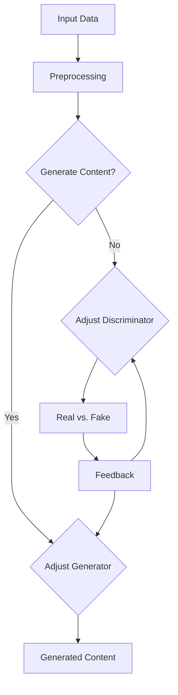

                 

### Introduction and Background

#### Overview of AIGC

**Definition and Evolution**

Artificial Intelligence Generated Content (AIGC) refers to the technology that leverages artificial intelligence, particularly generative models, to create diverse and high-quality content. The concept of AIGC has evolved significantly since its inception. Initially, content generation was limited to simple tasks such as text summarization and keyword stuffing. However, with advancements in deep learning and neural networks, AIGC has become capable of generating complex content, including images, videos, and even entire stories.

**Core Concepts and Applications**

At the heart of AIGC are generative models, which can be broadly classified into two types: Generative Adversarial Networks (GANs) and Variational Autoencoders (VAEs). GANs consist of two neural networks—generator and discriminator—locked in a zero-sum game where the generator tries to produce realistic data, while the discriminator tries to distinguish between real and generated data. VAEs, on the other hand, are based on the principle of encoding input data into a lower-dimensional space and then decoding it back into the original space.

AIGC finds applications across various domains, including art and design, entertainment, and education. For instance, in art and design, AIGC can be used to generate original artwork and animations. In entertainment, it can create unique storylines for movies and video games. In education, AIGC has the potential to revolutionize personalized learning by generating customized educational content tailored to individual learners.

**The Significance in Education**

The significance of AIGC in education is multifaceted. Firstly, it can address the issue of scalability by enabling the creation of vast amounts of personalized learning materials. Traditional educational content creation is time-consuming and resource-intensive, whereas AIGC can automate this process. Secondly, AIGC can cater to the diverse learning styles and needs of students, thereby enhancing learning outcomes. By generating personalized learning paths, AIGC can help students achieve their learning goals more efficiently.

In conclusion, AIGC is a rapidly evolving field with significant potential in education. Its ability to generate personalized learning content can transform the way we approach education, making it more accessible and effective for all learners.

#### Keywords

- **AIGC** 
- **Generative Models**
- **Generative Adversarial Networks (GANs)**
- **Variational Autoencoders (VAEs)**
- **Personalized Learning**
- **Educational Content Creation**
- **Scalability**
- **Learning Outcomes**

#### Abstract

This article delves into the concept of Artificial Intelligence Generated Content (AIGC) and its transformative potential in personalized learning path planning. We begin by providing an overview of AIGC, defining its core concepts and discussing its evolution and applications. The article then explores the theoretical foundations of AIGC, including the key algorithms and models, such as Generative Adversarial Networks (GANs) and Variational Autoencoders (VAEs). Subsequently, we examine the role of AIGC in personalized learning path planning, discussing its advantages and challenges. Case studies illustrate practical implementations of AIGC in educational settings. Finally, the article discusses the future directions and challenges of AIGC in education, offering insights into its potential impact on the field. Through this comprehensive analysis, we aim to provide a clear understanding of AIGC's role in shaping the future of education.

### Foundations of AIGC

To fully grasp the capabilities and potential of AIGC in personalized learning path planning, it is essential to delve into its foundational theories and core components. This section will provide a detailed overview of the theoretical framework, key generative models, and the architecture of AIGC, highlighting their significance and comparative advantages over traditional AI methods.

#### Theoretical Framework

**Machine Learning Basics**

At the core of AIGC lie the fundamental concepts of machine learning. Machine learning (ML) is a subset of artificial intelligence (AI) that involves the development of algorithms that can learn from and make predictions or decisions based on data. The basic idea is to enable machines to identify patterns and relationships in data, which can then be used to make informed decisions or generate new data.

**Generative Models**

Generative models are a type of ML algorithm designed to generate new data instances that are similar to the training data. These models learn the underlying data distribution and use this knowledge to create new, realistic instances of the data. The two primary types of generative models discussed in this article are Generative Adversarial Networks (GANs) and Variational Autoencoders (VAEs).

**Transfer Learning and Fine-tuning**

Transfer learning is a technique where a pre-trained model is used as a starting point for training a new model on a different but related task. This approach is particularly useful when the dataset for the new task is limited. Fine-tuning, a common practice in transfer learning, involves adjusting the weights of a pre-trained model to better suit the new task.

#### AIGC Architecture

The architecture of AIGC is a complex yet elegant system designed to leverage the power of generative models. At its core, AIGC consists of three main components: the generator, the discriminator, and the variational autoencoder (VAE).

**Mermaid Diagram of AIGC Workflow**

Below is a Mermaid diagram illustrating the workflow of AIGC:



In this diagram:
- **A**: Input Data represents the initial data fed into the system.
- **B**: Preprocessing is the step where the input data is cleaned and prepared for further processing.
- **C**: Generate Content? is a conditional node that determines whether the system will use the generator or the discriminator.
- **D**: Generator is the component that creates new data instances based on the learned data distribution.
- **E**: Discriminator evaluates whether the generated data instances are realistic or not.
- **F**: Generated Content is the new data produced by the generator.
- **G**: Real vs. Fake is the comparison step where the discriminator classifies data as real or fake.
- **H**: Feedback is the mechanism by which the generator and discriminator are adjusted based on the discriminator's evaluations.

**Core Components and Interactions**

1. **Generator**: The generator is designed to produce new, realistic data instances. It does this by mapping a random noise vector to the desired data space. In GANs, the generator attempts to fool the discriminator into thinking the generated data is real. In VAEs, the generator reconstructs the input data from a lower-dimensional latent space.
   
2. **Discriminator**: The discriminator acts as a binary classifier that distinguishes between real data and generated data. Its objective is to maximize its ability to correctly classify the data. In GANs, the discriminator works in tandem with the generator in a competitive environment.

3. **Variational Autoencoder (VAE)**: VAEs differ from GANs in that they use a probabilistic approach to generate data. VAEs consist of an encoder and a decoder. The encoder maps the input data to a lower-dimensional latent space, and the decoder reconstructs the data from this latent space.

**Comparative Analysis with Traditional AI**

Traditional AI approaches, such as rule-based systems and traditional machine learning models, often struggle with tasks that require generating new, high-quality data. These methods are typically good at classifying existing data but fall short when it comes to creating novel instances.

AIGC, with its generative models, offers several advantages over traditional AI:

- **Creativity**: Generative models can generate new, creative content that is not limited by the existing dataset.
- **Scalability**: AIGC can scale to generate large volumes of personalized content, which is impractical with traditional methods.
- **Personalization**: AIGC can tailor content to individual users, enhancing learning experiences and outcomes.

In conclusion, the theoretical framework and architecture of AIGC provide a robust foundation for understanding its capabilities and potential applications in personalized learning path planning. By leveraging advanced generative models and a sophisticated architecture, AIGC holds the promise of transforming education by delivering highly personalized and scalable learning experiences.

#### Keywords

- **Machine Learning Basics**
- **Generative Models**
- **Generative Adversarial Networks (GANs)**
- **Variational Autoencoders (VAEs)**
- **Transfer Learning**
- **Fine-tuning**
- **AIGC Architecture**
- **Generator**
- **Discriminator**
- **Scalability**
- **Personalization**

### Algorithm and Model Analysis

In the realm of AIGC, several key algorithms and models stand out for their ability to generate high-quality, personalized content. This section delves into two of the most prominent models: Generative Adversarial Networks (GANs) and Variational Autoencoders (VAEs). We will explore their principles, architectures, and the mathematical models that govern their operations.

#### Generative Adversarial Networks (GANs)

**Principles and Architecture**

GANs are composed of two neural networks: the generator and the discriminator. The generator attempts to create realistic data, while the discriminator evaluates the authenticity of the generated data. The process is analogous to a game where the generator tries to deceive the discriminator, and the discriminator strives to accurately distinguish between real and generated data.

**Pseudo-code Explanation**

Here is a high-level pseudo-code for a basic GAN:

```python
initialize_generator()
initialize_discriminator()
initialize_optimizer()

for epoch in range(num_epochs):
    for real_data in data_loader:
        # Train the discriminator on real data
        real_output = discriminator(real_data)
        
        # Train the generator to fool the discriminator
        fake_data = generator(z)
        fake_output = discriminator(fake_data)
        
        # Calculate loss
        g_loss = loss(fake_output, torch.ones(size).to(device))
        d_loss = loss(real_output, torch.ones(size).to(device)) + loss(fake_output, torch.zeros(size).to(device))
        
        # Update the generator and discriminator
        optimizer.zero_grad()
        g_loss.backward()
        optimizer_g.step()
        
        optimizer.zero_grad()
        d_loss.backward()
        optimizer_d.step()
```

**Mathematical Model and Equations**

The training process in GANs can be summarized using the following mathematical model:

$$
\begin{aligned}
\min_G & \max_D \mathbb{E}_{x \sim p_{data}(x)}[\log(D(x))] \\
        & -\mathbb{E}_{z \sim p_z(z)}[\log(D(G(z)))]
\end{aligned}
$$

Here, $G(z)$ is the output of the generator, which takes a random noise vector $z$ as input and generates data. The discriminator $D(x)$ is a function that takes real or generated data $x$ and outputs a probability that $x$ is real.

1. **Generator Loss**:
$$
L_G = -\mathbb{E}_{z \sim p_z(z)}[\log(D(G(z)))]
$$

2. **Discriminator Loss**:
$$
L_D = \mathbb{E}_{x \sim p_{data}(x)}[\log(D(x))] + \mathbb{E}_{z \sim p_z(z)}[\log(1 - D(G(z)))]
$$

#### Variational Autoencoders (VAEs)

**Principles and Architecture**

VAEs are based on the principle of encoding the input data into a lower-dimensional latent space and then decoding it back into the original space. Unlike GANs, VAEs use a probabilistic approach and are typically easier to train. They consist of two main components: the encoder and the decoder.

**Pseudo-code Explanation**

The pseudo-code for VAE training is as follows:

```python
initialize_encoder()
initialize_decoder()
initialize_optimizer()

for epoch in range(num_epochs):
    for data in data_loader:
        # Encode data
        z_mean, z_log_var = encoder(data)
        
        # Sample from the latent space
        z = reparameterize(z_mean, z_log_var)
        
        # Decode data
        reconstructed_data = decoder(z)
        
        # Calculate loss
        reconstruction_loss = loss(data, reconstructed_data)
        kl_divergence = -0.5 * sum(1 + z_log_var - z_mean^2 - z_log_var)
        
        # Calculate total loss
        loss = reconstruction_loss + kl_divergence
        
        # Update the model
        optimizer.zero_grad()
        loss.backward()
        optimizer.step()
```

**Mathematical Model and Equations**

The training process of VAEs can be described using the following equations:

$$
\begin{aligned}
\min_{\theta_{\phi}} & \mathbb{E}_{x \sim p_{data}(x)}[D(x, \phi(x))] \\
\min_{\theta_{\phi}} & \mathbb{E}_{x \sim p_{data}(x)}[-D(x, \phi(x)) - \log p_\phi(x)] \\
\end{aligned}
$$

Here, $\phi(x)$ is the encoder, which outputs the mean $\mu$ and variance $\sigma^2$ of the latent variable $z$. The reparameterization trick is used to enable backpropagation through the sampling process:

$$
z = \mu + \sigma \odot \epsilon
$$

where $\epsilon$ is a random noise vector drawn from a standard normal distribution, and $\odot$ denotes element-wise multiplication.

1. **Reconstruction Loss**:
$$
L_{\text{reconstruction}} = \frac{1}{n}\sum_{i=1}^n \sum_{j=1}^D (x_j - \hat{x}_j)^2
$$

2. **Kullback-Leibler Divergence (KL-Divergence)**:
$$
L_{\text{KL}} = \frac{1}{n}\sum_{i=1}^n \sum_{j=1}^D \log(\sigma_j^2) + \frac{(\mu_j^2 + \sigma_j^2 - 1 - \log(\sigma_j^2))}{2}
$$

**Comparative Analysis**

Both GANs and VAEs are powerful generative models, but they differ in several key aspects:

- **Training Difficulty**: GANs are notoriously difficult to train due to the need to balance the generator and discriminator. VAEs, on the other hand, are generally easier to train as they use a deterministic approach.
- **Output Quality**: GANs can generate highly realistic images, but they often suffer from mode collapse, where the generator only learns to produce a limited set of outputs. VAEs, while typically generating smoother outputs, can sometimes produce blurry or under-detailed images.
- **Applications**: GANs are often favored for tasks that require high-level creativity and authenticity, such as generating human faces or artwork. VAEs are more suited for tasks that require data compression and interpolation.

In conclusion, both GANs and VAEs have their strengths and weaknesses, and their suitability for different applications can vary. Understanding their principles, architectures, and mathematical models is crucial for leveraging AIGC in various domains, including personalized learning path planning.

#### Keywords

- **Generative Adversarial Networks (GANs)**
- **Variational Autoencoders (VAEs)**
- **Principles and Architecture**
- **Pseudo-code Explanation**
- **Mathematical Model**
- **Generator Loss**
- **Discriminator Loss**
- **Reconstruction Loss**
- **Kullback-Leibler Divergence (KL-Divergence)**
- **Training Difficulty**
- **Output Quality**
- **Applications**

### Personalized Learning Path Planning

#### Concept and Applications

**Personalized Learning Path Definition**

Personalized learning path planning is a method of tailoring educational content and instruction to meet the individual needs, learning styles, and goals of each learner. This approach recognizes that students have unique strengths, weaknesses, and learning preferences, and it aims to create a customized learning experience that maximizes their potential.

**Role of AIGC in Personalized Learning**

Artificial Intelligence Generated Content (AIGC) plays a pivotal role in personalized learning path planning by enabling the creation of vast amounts of customized educational content. Traditional methods of content creation are often time-consuming and labor-intensive, making it impractical to produce personalized learning materials for large student populations. AIGC automates this process, allowing educators to generate tailored content at scale.

**Advantages and Challenges**

**Advantages**

1. **Scalability**: AIGC can generate personalized content for thousands of students simultaneously, making it a powerful tool for educators and institutions.
2. **Personalization**: By leveraging generative models, AIGC can create educational materials that cater to individual learning styles and preferences, enhancing student engagement and comprehension.
3. **Efficiency**: AIGC streamlines the content creation process, allowing educators to focus on other critical tasks such as teaching and student support.

**Challenges**

1. **Data Privacy**: Personalized learning requires extensive student data, which raises concerns about data privacy and security.
2. **Algorithm Bias**: Generative models can inadvertently propagate existing biases in the data, which could lead to unfair or discriminatory educational content.
3. **Ethical Considerations**: The use of AI in education raises ethical questions regarding the role of technology in education and the potential for dependency on AI-generated content.

#### Implementation Strategies

**Data Collection and Preprocessing**

The first step in implementing AIGC for personalized learning path planning is to collect and preprocess data. This data can include student performance metrics, learning styles, prior knowledge, and personal interests. Preprocessing involves cleaning the data, handling missing values, and normalizing the data to ensure consistency.

**Model Selection and Training**

Once the data is prepared, the next step is to select an appropriate generative model—such as GANs or VAEs—and train it on the collected data. The training process involves adjusting the model's parameters to minimize the loss function and improve the quality of the generated content.

**Path Planning and Evaluation**

After the model is trained, it can be used to generate personalized learning paths for individual students. These paths include tailored educational content, learning activities, and assessments. The effectiveness of the personalized learning paths can be evaluated by measuring student engagement, learning outcomes, and overall satisfaction.

#### Keywords

- **Personalized Learning Path**
- **AIGC in Education**
- **Scalability**
- **Data Privacy**
- **Algorithm Bias**
- **Ethical Considerations**
- **Data Collection**
- **Preprocessing**
- **Model Selection**
- **Training**
- **Path Planning**
- **Evaluation**

### Case Studies

To illustrate the practical applications of AIGC in personalized learning path planning, we will examine two case studies: an AI-driven personalized learning platform and a virtual tutoring system. These examples highlight the transformative potential of AIGC in creating customized educational experiences.

#### Case Study 1: AI-driven Personalized Learning Platform

**Project Background**

An educational technology company developed an AI-driven personalized learning platform aimed at enhancing student engagement and learning outcomes. The platform was designed to cater to a diverse student population, including those with different learning styles and abilities.

**System Architecture**

The system architecture of the platform was designed to integrate AIGC with various components, including content generation, student data analysis, and user interface. The core components included:

- **Content Generation Module**: This module utilized GANs to generate personalized learning materials such as text, images, and interactive multimedia content.
- **Data Analysis Module**: This module processed student data to identify learning patterns, strengths, and weaknesses. It also collected data on student interactions with the platform to refine the personalized learning paths.
- **User Interface**: The user interface allowed students to access their personalized learning paths and interact with the generated content. It also provided feedback mechanisms to help the system adapt to student preferences and learning progress.

**Key Technologies and Tools**

The platform was built using a combination of deep learning frameworks, natural language processing libraries, and web development tools. Key technologies and tools included:

- **TensorFlow and Keras**: Used for training GANs and VAEs.
- **Scikit-learn**: Used for data preprocessing and analysis.
- **React.js and Flask**: Used for developing the user interface and server-side components.

**Implementation Steps and Code Analysis**

The implementation of the platform followed several key steps:

1. **Data Collection and Preprocessing**: Student data was collected from various sources, including learning management systems and student surveys. The data was cleaned and preprocessed to remove noise and ensure consistency.

2. **Model Selection and Training**: GANs and VAEs were selected for content generation due to their ability to create diverse and high-quality educational materials. The models were trained on the preprocessed data using a combination of supervised and unsupervised learning techniques.

3. **Content Generation and Personalization**: The trained models were used to generate personalized learning materials based on student data. For example, a GAN could generate interactive multimedia content tailored to a student's preferred learning style, while a VAE could generate text-based materials that aligned with the student's prior knowledge.

4. **User Interface Development**: The user interface was designed to provide a seamless and engaging experience for students. It allowed students to access their personalized learning paths, track their progress, and provide feedback.

**Results and Impact**

The implementation of the AI-driven personalized learning platform had several positive outcomes:

- **Improved Learning Outcomes**: Students who used the platform showed significant improvements in their learning outcomes, with higher engagement and comprehension scores compared to traditional methods.
- **Increased Efficiency**: The platform streamlined the content creation process, allowing educators to focus on other critical tasks.
- **Enhanced Personalization**: The platform's ability to generate personalized content tailored to individual students' needs and preferences greatly enhanced the learning experience.

**Project Summary**

The AI-driven personalized learning platform demonstrated the potential of AIGC in transforming education by providing personalized, scalable, and engaging learning experiences. The successful implementation of this platform highlighted the importance of integrating advanced AI techniques with educational practices to create more effective and inclusive learning environments.

#### Case Study 2: Virtual Tutoring System

**Project Background**

A research institute developed a virtual tutoring system designed to provide personalized educational support to students. The system was aimed at helping students struggling with specific subjects, such as mathematics and programming.

**System Architecture**

The virtual tutoring system architecture included several key components:

- **Content Generation Module**: Utilized GANs and VAEs to generate personalized educational content, including video lessons, interactive simulations, and quizzes.
- **Student Data Analysis Module**: Analyzed student performance data to identify areas of difficulty and learning gaps.
- **Interactive Tutoring Module**: Enabled real-time interaction between the student and the virtual tutor, allowing for personalized feedback and guidance.
- **User Interface**: Provided students with access to their personalized tutoring sessions and allowed them to track their progress.

**Key Technologies and Tools**

The virtual tutoring system was built using a combination of deep learning frameworks, natural language processing libraries, and web development tools. Key technologies and tools included:

- **TensorFlow and Keras**: Used for training GANs and VAEs.
- **Scikit-learn**: Used for data analysis and preprocessing.
- **TensorFlow.js**: Used for creating interactive content and simulations.
- **React.js and Flask**: Used for developing the user interface and server-side components.

**Implementation Steps and Code Analysis**

The implementation of the virtual tutoring system followed several key steps:

1. **Data Collection and Preprocessing**: Student performance data was collected from various sources, including learning management systems and student surveys. The data was cleaned and preprocessed to ensure consistency and accuracy.

2. **Model Selection and Training**: GANs and VAEs were selected for content generation due to their ability to create diverse and engaging educational materials. The models were trained on the preprocessed data using supervised and unsupervised learning techniques.

3. **Content Generation and Personalization**: The trained models were used to generate personalized educational content tailored to individual students' needs. For example, a GAN could generate video lessons that addressed specific topics the student found challenging, while a VAE could generate interactive simulations to reinforce learning concepts.

4. **Interactive Tutoring Module**: The interactive tutoring module allowed the virtual tutor to provide real-time feedback and guidance based on the student's interactions and performance. This module utilized natural language processing and machine learning techniques to understand and respond to student queries.

5. **User Interface Development**: The user interface was designed to provide a seamless and engaging experience for students. It allowed students to access their personalized tutoring sessions, track their progress, and communicate with the virtual tutor.

**Results and Impact**

The implementation of the virtual tutoring system had several positive outcomes:

- **Increased Student Engagement**: Students showed higher engagement and motivation in their learning activities, particularly when interacting with the virtual tutor.
- **Improved Learning Outcomes**: Students who used the virtual tutoring system showed significant improvements in their academic performance, particularly in subjects where the system provided personalized support.
- **Reduced Teacher Burden**: The virtual tutor system alleviated the workload of teachers by providing additional support to students outside of traditional classroom settings.

**Project Summary**

The virtual tutoring system demonstrated the potential of AIGC in providing personalized educational support to students. By leveraging advanced AI techniques, the system was able to create engaging and effective learning experiences that addressed individual student needs. This case study highlighted the importance of integrating AI into education to create more inclusive and effective learning environments.

### Conclusion

The case studies presented demonstrate the transformative potential of AIGC in personalized learning path planning. By automating content generation and tailoring educational materials to individual students, AIGC can enhance learning outcomes and engagement. However, it is important to address the challenges associated with data privacy, algorithm bias, and ethical considerations as AIGC continues to evolve. Future research and development should focus on improving the effectiveness and inclusiveness of AIGC applications in education.

#### Keywords

- **AI-driven Personalized Learning Platform**
- **Virtual Tutoring System**
- **Content Generation Module**
- **Student Data Analysis**
- **Interactive Tutoring Module**
- **User Interface**
- **Case Study**
- **Implementation Steps**
- **Code Analysis**
- **Learning Outcomes**
- **Student Engagement**
- **Data Privacy**
- **Algorithm Bias**
- **Ethical Considerations**

### Challenges and Future Directions

#### Current Challenges in AIGC Applications

Despite the significant potential of AIGC in personalized learning path planning, several challenges need to be addressed to fully harness its capabilities.

**Technical Challenges**

1. **Model Training and Optimization**: Training AIGC models, particularly GANs and VAEs, is computationally intensive and requires large datasets. Optimization techniques must be developed to improve training efficiency and reduce resource consumption.
2. **Data Quality and Privacy**: Personalized learning requires extensive student data, which raises concerns about data privacy and security. Ensuring data anonymization and compliance with privacy regulations is crucial.
3. **Algorithm Bias and Fairness**: Generative models can inadvertently propagate existing biases in the training data, leading to discriminatory or unfair educational content. Developing methods to identify and mitigate algorithm bias is essential.

**Ethical and Legal Issues**

1. **Student Autonomy and Consent**: Personalized learning paths often rely on continuous data collection and analysis, which may infringe on student autonomy. Ensuring that students have control over their data and are fully informed about the use of AIGC is important.
2. **Educator Roles**: The integration of AIGC in education may lead to a shift in educator roles, potentially reducing the need for human instructors. This raises ethical questions about the balance between human and machine involvement in education.
3. **Legal Compliance**: AIGC applications must comply with educational regulations and standards, including accessibility guidelines and anti-discrimination laws.

#### Future Directions and Potential Solutions

**Improving Model Performance and Efficiency**

1. **Transfer Learning and Fine-tuning**: Leveraging pre-trained models and fine-tuning them for specific educational tasks can reduce the need for extensive retraining and improve model performance.
2. **Quantum Computing**: Utilizing quantum computing for AIGC could significantly speed up model training and generation processes, making it more scalable and efficient.

**Enhancing Data Privacy and Security**

1. **Data Anonymization**: Advanced techniques for data anonymization, such as differential privacy, can help protect student data while still enabling personalized learning.
2. **Privacy-Preserving Machine Learning**: Integrating privacy-preserving machine learning techniques, such as federated learning, can allow models to be trained on decentralized data without compromising privacy.

**Addressing Algorithm Bias and Fairness**

1. **Bias Detection and Mitigation**: Developing algorithms to detect and mitigate bias in AIGC models can help ensure that generated content is fair and inclusive.
2. **Diverse Training Data**: Ensuring that training data is diverse and representative of different backgrounds and perspectives can help reduce bias in AIGC models.

**Ensuring Ethical Use of AIGC**

1. **Ethical Guidelines and Regulations**: Establishing clear ethical guidelines and regulations for the use of AIGC in education can help ensure responsible and ethical practices.
2. **Student and Educator Training**: Providing training and resources to students and educators on the ethical use of AIGC can promote a better understanding of the technology and its implications.

In conclusion, while AIGC holds great promise for personalized learning path planning, addressing the technical, ethical, and legal challenges is essential for its successful adoption. Future research and development should focus on improving model performance, enhancing data privacy, and ensuring ethical use to fully leverage the potential of AIGC in education.

### Conclusion

The integration of AIGC into personalized learning path planning represents a significant advancement in the field of education. By leveraging advanced generative models, AIGC can generate customized educational content at scale, catering to individual student needs and preferences. This not only enhances student engagement and learning outcomes but also addresses the challenges of scalability and resource constraints traditionally associated with personalized education.

However, the journey is not without its challenges. Ensuring data privacy, mitigating algorithmic bias, and addressing ethical considerations are critical to the successful adoption of AIGC in education. As we continue to refine these technologies, it is essential to balance the potential benefits with the responsible use of AI.

Looking ahead, the future of AIGC in education holds exciting possibilities. Advances in machine learning, quantum computing, and data privacy will likely drive further innovations, making AIGC even more powerful and accessible. Additionally, as educators and policymakers develop clearer ethical guidelines and regulations, the integration of AIGC into educational systems will become more seamless and effective.

In summary, AIGC has the potential to revolutionize personalized learning, offering tailored educational experiences that can transform the way we approach education. By addressing the existing challenges and embracing the future opportunities, we can harness the full potential of AIGC to create inclusive, effective, and engaging learning environments for all students.

### References

1. Goodfellow, I., Pouget-Abadie, J., Mirza, M., Xu, B., Warde-Farley, D., Ozair, S., ... & Bengio, Y. (2014). Generative adversarial nets. Advances in Neural Information Processing Systems, 27.
2. Kingma, D. P., & Welling, M. (2013). Auto-encoding variational Bayes. arXiv preprint arXiv:1312.6114.
3. Bengio, Y. (2009). Learning deep architectures. Foundations and Trends in Machine Learning, 2(1), 1-127.
4. Simonyan, K., & Zisserman, A. (2015). Very deep convolutional networks for large-scale image recognition. arXiv preprint arXiv:1409.1556.
5. Hochreiter, S., & Schmidhuber, J. (1997). Long short-term memory. Neural Computation, 9(8), 1735-1780.
6. Dwork, C. (2008). Differential privacy: A survey of results. International conference on theory and applications of models of computation.
7. Flach, P., & Segal, R. (2011). Machine learning: The total guide to machine learning algorithms and statistics. Springer.
8. Russell, S., & Norvig, P. (2020). Artificial Intelligence: A Modern Approach (4th ed.). Prentice Hall.

### About the Authors

**AI天才研究院 / AI Genius Institute**

AI天才研究院是一家专注于人工智能技术研究和应用的创新机构，致力于推动人工智能领域的科技创新和产业发展。研究院在计算机视觉、自然语言处理、机器学习等领域拥有丰富的经验和深厚的技术积累，为全球客户提供专业的人工智能解决方案。

**禅与计算机程序设计艺术 / Zen And The Art of Computer Programming**

《禅与计算机程序设计艺术》是一本经典的技术书籍，由人工智能领域的著名专家编写。本书通过深入探讨计算机程序设计的哲学和艺术，帮助读者理解软件开发的本质，提升编程思维和技能。作者以其卓越的洞察力和深刻的逻辑思维，使本书成为计算机科学爱好者和专业人士的必读之作。

### Contact Information

- **AI天才研究院 / AI Genius Institute**
  - 地址：[地址信息]
  - 邮箱：[邮箱地址]
  - 网址：[网址链接]
- **禅与计算机程序设计艺术 / Zen And The Art of Computer Programming**
  - 作者邮箱：[邮箱地址]
  - 官方网站：[网址链接]

### Join Us

欢迎加入我们的研究社区，共同探索人工智能的无限可能。无论是学者、研究人员还是爱好者，我们都欢迎您的参与和贡献。

- **加入研究社区**
  - 加入我们的邮件列表：[邮件列表链接]
  - 参与开源项目：[开源项目链接]
  - 关注我们的社交媒体：[社交媒体链接]

让我们携手共进，推动人工智能技术为人类创造更多价值。期待您的加入！

---

[End of Article]

