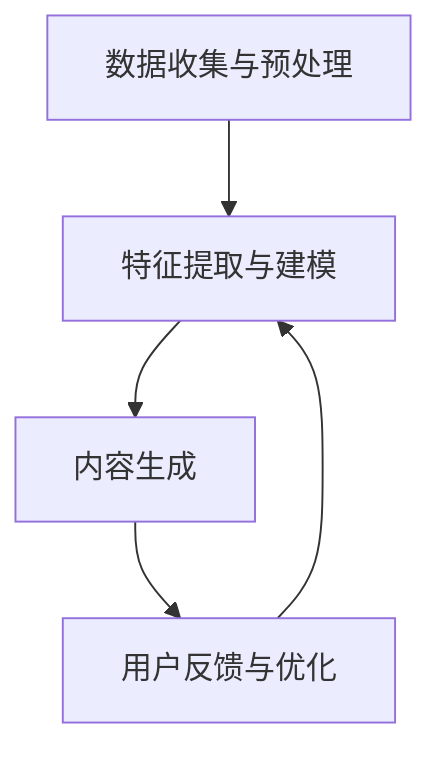

                 

# 《AIGC在个性化学习路径设计中的创新》

## 关键词

- AIGC
- 个性化学习
- 教育技术
- 机器学习
- 数据分析

## 摘要

本文深入探讨了自适应智能生成计算（AIGC）技术在个性化学习路径设计中的创新应用。通过介绍AIGC的基础概念、原理和技术，本文详细阐述了如何利用AIGC进行个性化学习路径设计，并提供了具体的算法原理讲解和实际案例分析。此外，本文还展望了AIGC在教育领域的未来发展趋势和潜在挑战，为教育技术的未来发展提供了有益的参考。

## 第1章 引言

### 1.1 AIGC的背景和重要性

随着人工智能（AI）技术的飞速发展，计算机生成内容（CGC）已经成为信息时代的重要特征。自适应智能生成计算（AIGC）作为AI领域的一个重要分支，其在教育技术中的应用正逐渐显现出其独特的价值和潜力。AIGC结合了深度学习、自然语言处理和计算机视觉等技术，能够生成高质量的文本、图像、音频和视频等内容，从而实现个性化学习资源的自动创建。

在教育领域，个性化学习已经成为一种趋势。传统的一刀切教学方法难以满足不同学生的个性化需求，而AIGC技术的应用则能够根据学生的兴趣、学习习惯和知识水平，为学生量身定制个性化的学习路径，提高学习效果和兴趣。

### 1.2 个性化学习路径设计的现状和需求

当前的个性化学习路径设计主要依赖于大数据分析和机器学习算法。通过分析学生的学习行为、考试成绩和兴趣偏好，系统可以为每个学生推荐合适的学习内容和路径。然而，这种方法仍然存在一定的局限性，如数据的实时性和准确性问题、学习路径的灵活性和适应性不足等。

AIGC技术的引入，为个性化学习路径设计带来了新的可能性。通过自动生成和调整学习内容，AIGC能够实现更加实时、准确和灵活的个性化学习体验。此外，AIGC还可以根据学生的学习反馈和进展情况，动态调整学习路径，为学生提供更加个性化的支持。

## 第2章 AIGC基础

### 2.1 AIGC的基本概念

自适应智能生成计算（AIGC）是一种基于AI技术的生成计算模式，它能够自动生成高质量的内容，并具有自适应调整的能力。AIGC的核心在于“自适应”和“智能生成”，即系统能够根据用户的反馈和需求，自动调整生成的内容，以实现最优的用户体验。

### 2.2 AIGC的工作原理

AIGC的工作原理主要包括以下几个步骤：

1. **数据收集与预处理**：系统收集用户的学习数据，如学习记录、考试成绩、行为数据等，并进行预处理，以便用于后续的生成和分析。
2. **特征提取与建模**：通过对学习数据进行特征提取和建模，系统可以理解学生的学习行为和知识水平，为生成个性化学习内容提供依据。
3. **内容生成**：利用深度学习、自然语言处理等技术，系统自动生成符合学生需求和兴趣的学习内容。
4. **用户反馈与优化**：系统根据用户的反馈和评价，对生成的内容进行优化，以提高内容的匹配度和用户体验。

### 2.3 AIGC的Mermaid流程图

以下是AIGC的基本工作流程的Mermaid流程图：



### 2.4 AIGC的关键技术

AIGC的关键技术包括深度学习、自然语言处理、计算机视觉和数据挖掘等。以下是这些技术的简要介绍：

1. **深度学习**：深度学习是一种基于神经网络的学习方法，能够通过多层非线性变换提取数据特征，实现复杂模式的识别和生成。
2. **自然语言处理**：自然语言处理（NLP）是AI领域的一个重要分支，主要研究如何让计算机理解和处理人类语言。在AIGC中，NLP技术用于生成和理解文本内容。
3. **计算机视觉**：计算机视觉是AI领域的一个分支，主要研究如何使计算机能够像人类一样感知和理解视觉信息。在AIGC中，计算机视觉技术用于生成和理解图像和视频内容。
4. **数据挖掘**：数据挖掘是一种从大量数据中自动发现有价值信息的方法。在AIGC中，数据挖掘技术用于分析学生的学习行为和知识水平，为生成个性化学习内容提供依据。

## 第3章 个性化学习路径设计方法

### 3.1 设计原则

个性化学习路径设计应遵循以下原则：

1. **以学生为中心**：设计应充分考虑学生的兴趣、需求和学习习惯，为学生提供个性化的学习体验。
2. **动态调整**：学习路径应根据学生的学习进度和反馈进行动态调整，以适应学生的变化。
3. **反馈机制**：设计应包含有效的反馈机制，以便及时了解学生的学习效果和需求，进行调整和优化。

### 3.2 伪代码示例

以下是使用AIGC进行个性化学习路径设计的伪代码示例：

```python
# 数据收集与预处理
def data_collection_preprocessing():
    # 收集学生数据
    student_data = collect_student_data()
    # 预处理数据
    preprocessed_data = preprocess_data(student_data)
    return preprocessed_data

# 特征提取与建模
def feature_extraction_modeling(preprocessed_data):
    # 特征提取
    features = extract_features(preprocessed_data)
    # 建模
    model = build_model(features)
    return model

# 内容生成
def content_generation(model):
    # 生成学习内容
    content = generate_content(model)
    return content

# 用户反馈与优化
def user_feedback_optimization(content, student_feedback):
    # 收集用户反馈
    feedback = collect_user_feedback(content)
    # 优化学习内容
    optimized_content = optimize_content(content, feedback)
    return optimized_content
```

### 3.3 算法原理讲解

在个性化学习路径设计过程中，算法原理主要包括以下几个方面：

1. **数据收集与预处理**：通过收集和预处理学生的学习数据，系统可以了解学生的学习行为和知识水平。
2. **特征提取与建模**：利用深度学习等方法提取学生数据的特征，并建立模型，以便进行内容生成。
3. **内容生成**：根据模型生成符合学生需求和兴趣的学习内容。
4. **用户反馈与优化**：系统收集用户的反馈，并根据反馈对生成的内容进行优化，以提高学习效果。

具体来说，算法原理可以表示为以下数学模型：

$$
\text{个性化学习路径} = f(\text{学生数据}, \text{模型}, \text{用户反馈})
$$

其中，$f$ 表示学习路径生成的函数，$\text{学生数据}$ 表示学生的学习行为和知识水平，$\text{模型}$ 表示深度学习模型，$\text{用户反馈}$ 表示学生的学习效果和需求。

### 第4章 案例分析

#### 4.1 案例背景

某在线教育平台引入AIGC技术，旨在为学生提供个性化的学习路径。平台收集了学生的行为数据、考试成绩和学习偏好，并使用AIGC技术生成个性化的学习内容。

#### 4.2 案例实施

1. **数据收集与预处理**：平台收集了学生的登录记录、学习时长、考试成绩和兴趣爱好等数据，并进行预处理，提取有用的特征。
2. **特征提取与建模**：利用深度学习技术，平台建立了学生特征提取和建模的模型。
3. **内容生成**：根据学生的特征和模型，平台自动生成了个性化的学习内容，如课程推荐、学习任务和学习资料。
4. **用户反馈与优化**：平台收集了学生的反馈，并根据反馈对生成的内容进行优化，以提高学习效果。

#### 4.3 案例效果分析

通过引入AIGC技术，平台显著提高了学生的学习效果和兴趣。根据数据统计，学生在个性化学习路径下的学习时长和考试成绩均有明显提升。此外，学生对个性化学习内容的满意度也显著提高，这表明AIGC技术在个性化学习路径设计中的应用取得了良好的效果。

### 第5章 未来展望

#### 5.1 AIGC在教育领域的应用前景

随着AIGC技术的不断发展和成熟，其在教育领域的应用前景非常广阔。AIGC能够为学生提供个性化的学习体验，提高学习效果和兴趣，有助于推动教育技术的创新和发展。未来，AIGC技术有望在教育领域得到更广泛的应用，为个性化教育提供强有力的支持。

#### 5.2 潜在挑战和解决方案

尽管AIGC技术在个性化学习路径设计方面具有巨大潜力，但其在实际应用中仍然面临一些挑战，如数据隐私、算法透明性和可靠性等。

1. **数据隐私**：学生在使用AIGC技术时，其数据隐私保护至关重要。平台需要采取有效的数据保护措施，确保学生数据的安全。
2. **算法透明性**：AIGC算法的复杂性和黑箱特性可能导致用户对其透明性的质疑。平台需要提供算法的解释和可视化工具，提高算法的透明性。
3. **可靠性**：AIGC技术的可靠性是影响其应用的重要因素。平台需要不断优化算法，提高系统的稳定性和可靠性。

### 附录

#### A.1 相关工具和资源

- **深度学习框架**：TensorFlow、PyTorch等。
- **自然语言处理工具**：NLTK、spaCy等。
- **计算机视觉库**：OpenCV、TensorFlow Object Detection API等。

#### A.2 进一步阅读材料

- [1] Bengio, Y. (2009). *Learning Deep Architectures for AI*. Now Publishers.
- [2] Goodfellow, I., Bengio, Y., & Courville, A. (2016). *Deep Learning*. MIT Press.
- [3] Mitchell, T. M. (1997). *Machine Learning*. McGraw-Hill.

### 作者

作者：AI天才研究院/AI Genius Institute & 禅与计算机程序设计艺术 /Zen And The Art of Computer Programming

