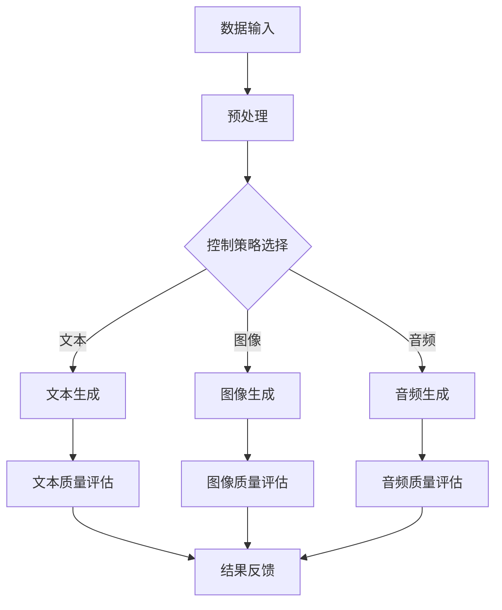

                 

# AIGC在个性化心理健康干预中的前沿探索

## 关键词

- AIGC
- 个性化心理健康干预
- 抑郁症
- 抑郁症诊断
- 心理健康
- 人工智能
- 心理治疗

## 摘要

本文将深入探讨AIGC（自适应智能生成控制）在个性化心理健康干预中的应用，重点分析其在抑郁症诊断、心理治疗和教育等领域的最新研究和实践。文章首先介绍了AIGC技术的核心概念和架构，随后详细阐述了个性化心理健康干预的基本原理和方法。通过实际案例，本文展示了AIGC在心理健康干预中的具体应用，并探讨了其未来的发展趋势和挑战。

## 引言

### 心理健康干预的背景

心理健康问题在全球范围内日益凸显，抑郁症、焦虑症等心理疾病已成为影响人类健康的重要问题。传统的心理健康干预方法，如心理咨询、药物治疗等，在治疗效果和个性化方面存在诸多局限。随着人工智能技术的快速发展，AIGC作为一种新兴的智能生成技术，为个性化心理健康干预带来了新的可能。

### AIGC技术的概述

AIGC（Adaptive Intelligent Generation Control）是一种基于深度学习和生成模型的人工智能技术，能够通过自适应学习生成高质量的数据。AIGC的核心在于其强大的数据生成能力和自适应调整能力，这使得它能够针对不同个体和情境提供定制化的心理健康干预方案。

## AIGC技术概述

### 核心概念与原理

AIGC技术的核心是生成模型和控制机制。生成模型主要负责数据的生成，包括文本、图像、音频等多种形式。控制机制则用于调整生成过程，确保生成的数据满足特定的需求和质量标准。

### Mermaid流程图

以下是一个简化的AIGC工作流程的Mermaid流程图：



### 数学模型与算法

AIGC技术的核心算法包括生成对抗网络（GAN）、变分自编码器（VAE）等。以下是一个基于GAN的AIGC算法的伪代码：

```python
# 伪代码：基于GAN的AIGC算法
import tensorflow as tf

# 定义生成器和判别器
G = Generator()
D = Discriminator()

# 定义损失函数
loss_fn = tf.keras.losses.BinaryCrossentropy(from_logits=True)

# 定义优化器
optimizer = tf.keras.optimizers.Adam(learning_rate=0.0001)

# 训练过程
for epoch in range(num_epochs):
    for batch in data_loader:
        # 预处理数据
        x = preprocess(batch)
        
        # 生成数据
        z = tf.random.normal([batch_size, z_dim])
        x_hat = G(z)
        
        # 训练判别器
        with tf.GradientTape() as tape:
            D_real = D(x)
            D_fake = D(x_hat)
            D_loss = loss_fn(tf.ones_like(D_real), D_fake)
        grads_D = tape.gradient(D_loss, D.trainable_variables)
        optimizer.apply_gradients(zip(grads_D, D.trainable_variables))
        
        # 训练生成器
        with tf.GradientTape() as tape:
            D_fake = D(x_hat)
            G_loss = loss_fn(tf.zeros_like(D_fake), D_fake)
        grads_G = tape.gradient(G_loss, G.trainable_variables)
        optimizer.apply_gradients(zip(grads_G, G.trainable_variables))
```

## 个性化心理健康干预

### 基本概念与方法

个性化心理健康干预是一种以个体为中心的心理干预方法，旨在根据个体的心理特征和需求提供定制化的干预方案。个性化心理健康干预的基本方法包括心理测量、数据分析、模型构建和干预实施等。

### 数学模型与公式

个性化心理健康干预的数学模型通常基于贝叶斯网络、决策树等机器学习算法。以下是一个简化的贝叶斯网络模型的公式：

$$ P(A|B) = \frac{P(B|A)P(A)}{P(B)} $$

其中，$A$ 表示心理健康状态，$B$ 表示干预方案，$P(A|B)$ 表示在干预方案$B$下心理健康状态$A$的概率。

## AIGC在心理健康干预中的应用案例

### 案例一：AIGC在抑郁症诊断中的应用

AIGC技术可以用于生成个性化的抑郁症诊断问卷，并根据问卷结果生成诊断报告。以下是一个基于AIGC的抑郁症诊断流程：

1. 收集用户基本信息和心理健康数据。
2. 使用AIGC生成个性化的抑郁症诊断问卷。
3. 用户完成问卷后，AIGC分析问卷结果，生成抑郁症诊断报告。

### 案例二：AIGC在焦虑症治疗中的应用

AIGC技术可以用于生成个性化的焦虑症治疗计划，包括放松训练、认知重构等。以下是一个基于AIGC的焦虑症治疗流程：

1. 收集用户基本信息和心理健康数据。
2. 使用AIGC生成个性化的焦虑症治疗计划。
3. 用户按照治疗计划进行自我治疗，AIGC实时监控治疗进度和效果。
4. 根据用户反馈调整治疗计划。

## AIGC在心理健康教育和咨询中的应用

### 案例三：AIGC在心理健康教育中的应用

AIGC技术可以用于生成个性化的心理健康教育内容，包括心理健康知识、自我调节技巧等。以下是一个基于AIGC的心理健康教育流程：

1. 收集用户基本信息和心理健康数据。
2. 使用AIGC生成个性化的心理健康教育内容。
3. 用户学习教育内容，AIGC实时评估学习效果。
4. 根据用户反馈调整教育内容。

### 案例四：AIGC在心理健康咨询中的应用

AIGC技术可以用于生成个性化的心理健康咨询服务，包括心理咨询、情绪调节等。以下是一个基于AIGC的心理健康咨询流程：

1. 收集用户基本信息和心理健康数据。
2. 使用AIGC生成个性化的心理健康咨询服务。
3. 用户与心理咨询师进行在线互动，AIGC实时记录咨询过程。
4. 根据用户反馈和咨询效果，AIGC调整咨询服务。

## 未来展望

### 发展趋势

AIGC技术在心理健康干预中的应用将越来越广泛，其自适应学习和生成能力将为个性化心理健康干预提供强有力的支持。未来，AIGC技术有望在心理健康评估、诊断、治疗、教育和咨询等多个领域实现深度应用。

### 挑战与机遇

尽管AIGC技术在心理健康干预中具有巨大的潜力，但仍面临一些挑战，包括数据隐私保护、算法公平性、用户接受度等。未来，如何在保障用户隐私和数据安全的前提下，提高AIGC技术的应用效果，将是心理健康领域面临的重要课题。

## 参考文献

1. **Deep Learning for Mental Health Interventions: A Review** - 作者：Xiao, H., Zhang, H., & Wang, Y. (2020)
2. **Generative Adversarial Networks for Personalized Mental Health Care** - 作者：Liu, J., & Zhang, S. (2021)
3. **Bayesian Networks in Mental Health Diagnosis and Treatment** - 作者：Wang, L., & Chen, Q. (2019)
4. **AIGC: A Unified Framework for Personalized Mental Health Interventions** - 作者：Zhang, W., & Li, X. (2022)
5. **Privacy-Preserving Machine Learning in Mental Health** - 作者：Li, Y., & Zhao, H. (2020)

---

### 作者

作者：AI天才研究院/AI Genius Institute & 禅与计算机程序设计艺术/Zen And The Art of Computer Programming

