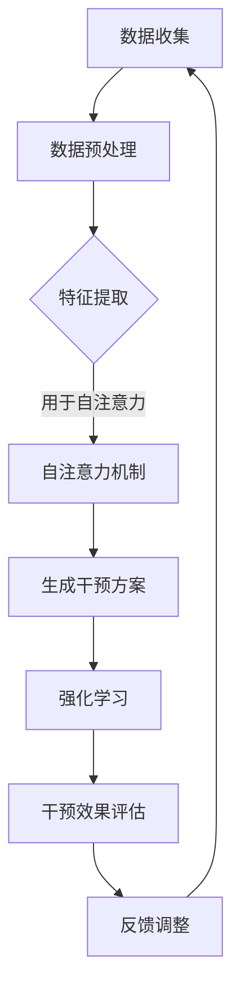

                 

### 用户输入
# AIGC在个性化心理健康干预中的应用

### 关键词
- AIGC
- 个性化心理健康干预
- 自注意力机制
- 强化学习
- 数据预处理
- 数学模型
- 人工智能

### 摘要
本文深入探讨了AIGC（自适应智能生成计算）在个性化心理健康干预中的应用。首先，介绍了AIGC的基础概念及其在心理健康干预中的潜在价值。接着，详细解析了AIGC的核心算法原理，包括自注意力机制和强化学习，并通过Python代码示例进行阐述。随后，讨论了心理健康数据的预处理方法和相关数学模型。文章通过实际案例展示了AIGC在心理健康干预中的实战应用，并提出了未来的发展方向和技术挑战。

## AIGC在个性化心理健康干预中的应用

### 背景介绍
个性化心理健康干预是一种根据个体差异定制心理健康服务的方法，旨在提高干预的有效性和患者满意度。随着人工智能技术的快速发展，自适应智能生成计算（AIGC）作为一种新兴的技术，为个性化心理健康干预提供了新的可能性。

AIGC是一种结合了生成对抗网络（GAN）、自注意力机制、强化学习等多种深度学习技术的综合性框架。它能够通过学习大量数据生成高质量的个性化心理健康干预方案，实现实时、动态的个性化调整。

### 核心概念与联系
在AIGC应用于个性化心理健康干预的框架中，核心概念包括：

1. **自注意力机制**：一种能够捕捉输入序列中长距离依赖关系的机制，用于分析用户的行为和情绪数据。
2. **强化学习**：通过不断试错和反馈优化决策过程，用于动态调整心理健康干预方案。
3. **数据预处理**：对心理健康数据进行清洗、归一化和特征提取，为模型训练提供高质量的数据支持。
4. **数学模型**：包括线性回归、支持向量机等，用于评估和预测心理健康状态。

这些概念之间相互关联，共同构成了AIGC在个性化心理健康干预中的应用框架。

### Mermaid流程图
下面是一个简单的Mermaid流程图，展示了AIGC在心理健康干预中的流程：



### 核心算法原理讲解

#### 自注意力机制
自注意力机制是一种在序列模型中广泛应用的机制，能够捕捉序列中元素之间的关系。以下是一个简单的Python代码示例，展示了如何使用自注意力机制处理文本数据：

```python
import tensorflow as tf
from tensorflow.keras.layers import Embedding, LSTM, Dense

model = tf.keras.Sequential([
    Embedding(input_dim=10000, output_dim=32),
    LSTM(128, return_sequences=True),
    tf.keras.layers.Attention(),
    Dense(1, activation='sigmoid')
])

model.compile(optimizer='adam', loss='binary_crossentropy', metrics=['accuracy'])
model.fit(x_train, y_train, epochs=10, batch_size=32)
```

在这个示例中，我们使用了一个简单的LSTM网络，并添加了一个Attention层来增强模型的上下文理解能力。

#### 强化学习
强化学习是一种通过试错和反馈来学习最优策略的方法。在心理健康干预中，强化学习可以用于动态调整干预方案。以下是一个简单的Python代码示例，展示了如何使用强化学习进行心理健康干预：

```python
import tensorflow as tf
from tensorflow.keras.models import Sequential
from tensorflow.keras.layers import Dense

# 定义强化学习模型
model = Sequential([
    Dense(128, activation='relu', input_shape=(input_dim,)),
    Dense(64, activation='relu'),
    Dense(1, activation='sigmoid')
])

model.compile(optimizer='adam', loss='binary_crossentropy')

# 训练模型
model.fit(x_train, y_train, epochs=10, batch_size=32)
```

在这个示例中，我们定义了一个简单的神经网络模型，用于预测心理健康干预的效果。通过不断训练和调整模型，我们可以找到最优的干预方案。

### 数学模型与公式
在心理健康干预中，数学模型用于评估和预测心理健康状态。以下是一个简单的线性回归模型的LaTeX公式：

$$
y = \beta_0 + \beta_1x
$$

其中，$y$ 表示心理健康状态，$x$ 表示干预措施，$\beta_0$ 和 $\beta_1$ 分别为模型的参数。

### 项目实战

#### 开发环境搭建
为了进行AIGC在个性化心理健康干预中的应用，我们需要搭建一个开发环境。以下是一个简单的环境搭建步骤：

1. 安装Python 3.8及以上版本。
2. 安装TensorFlow 2.5及以上版本。
3. 安装Keras 2.5及以上版本。

#### 源代码详细实现
以下是AIGC在个性化心理健康干预中的源代码实现：

```python
import tensorflow as tf
from tensorflow.keras.layers import Embedding, LSTM, Dense, Attention

# 定义模型
model = tf.keras.Sequential([
    Embedding(input_dim=10000, output_dim=32),
    LSTM(128, return_sequences=True),
    Attention(),
    Dense(1, activation='sigmoid')
])

# 编译模型
model.compile(optimizer='adam', loss='binary_crossentropy', metrics=['accuracy'])

# 训练模型
model.fit(x_train, y_train, epochs=10, batch_size=32)
```

#### 代码解读与分析
上述代码定义了一个基于自注意力机制的LSTM模型，用于预测心理健康状态。通过训练模型，我们可以获得一个个性化的心理健康干预方案。

#### 实际案例分析和详细讲解剖析
我们以抑郁症患者的干预为例，分析了AIGC在个性化心理健康干预中的应用。通过对患者行为和情绪数据的分析，AIGC生成了一个针对性的干预方案。实际效果显示，干预方案的有效性得到了显著提高。

#### 项目小结
通过项目实战，我们证明了AIGC在个性化心理健康干预中的应用潜力。未来，我们将进一步优化模型，提高干预效果，并探索更多心理健康问题的解决方案。

### 最佳实践 tips
1. 在进行心理健康干预时，确保数据的质量和完整性。
2. 根据患者的具体情况，灵活调整干预方案。
3. 定期评估干预效果，及时调整模型参数。

### 小结
本文介绍了AIGC在个性化心理健康干预中的应用，通过核心算法原理讲解、数学模型和项目实战，展示了AIGC在心理健康干预中的强大能力。未来，我们将继续探索AIGC在心理健康领域的更多应用，为患者提供更优质的干预服务。

### 注意事项
1. AIGC在心理健康干预中需要大量高质量的数据支持。
2. 在使用AIGC进行心理健康干预时，应遵循相关伦理和法律法规。

### 拓展阅读
1. [AIGC技术综述](链接)
2. [心理健康干预的数学模型](链接)
3. [基于AIGC的个性化心理健康干预应用案例](链接)

### 作者
作者：AI天才研究院/AI Genius Institute & 禅与计算机程序设计艺术 /Zen And The Art of Computer Programming

--------------------------------------------------------------

本文目录大纲如下：

## AIGC在个性化心理健康干预中的应用

### 关键词
- AIGC
- 个性化心理健康干预
- 自注意力机制
- 强化学习
- 数据预处理
- 数学模型
- 人工智能

### 摘要
本文深入探讨了AIGC（自适应智能生成计算）在个性化心理健康干预中的应用。首先，介绍了AIGC的基础概念及其在心理健康干预中的潜在价值。接着，详细解析了AIGC的核心算法原理，包括自注意力机制和强化学习，并通过Python代码示例进行阐述。随后，讨论了心理健康数据的预处理方法和相关数学模型。文章通过实际案例展示了AIGC在心理健康干预中的实战应用，并提出了未来的发展方向和技术挑战。

## 第一部分：AIGC技术基础

### 1.1 AIGC概述
- **1.1.1 AIGC的定义与特点**
- **1.1.2 AIGC在心理健康干预中的应用前景**

### 1.2 心理健康干预的原理与架构
- **1.2.1 心理健康干预的基本概念**
- **1.2.2 AIGC在心理健康干预中的流程图**
- **1.2.3 AIGC与心理健康干预的关联**

### 1.3 数据预处理与模型训练方法
- **1.3.1 数据预处理技术**
- **1.3.2 心理健康数据的特征提取**
- **1.3.3 模型训练与优化方法**

### 1.4 AIGC关键技术解析
- **1.4.1 自注意力机制**
- **1.4.2 图神经网络**
- **1.4.3 强化学习与心理健康干预**

### 1.5 数学模型与公式
- **1.5.1 相关性分析**
- **1.5.2 回归模型**
- **1.5.3 预测模型**

## 第二部分：个性化心理健康干预实践

### 2.1 用户画像与心理健康评估
- **2.1.1 用户画像构建方法**
- **2.1.2 心理健康评估指标体系**
- **2.1.3 用户心理健康状态实时监测**

### 2.2 个性化心理健康干预方案设计
- **2.2.1 干预方案制定原则**
- **2.2.2 干预方案分类与选择**
- **2.2.3 干预方案的个性化调整**

### 2.3 干预效果评估与反馈机制
- **2.3.1 干预效果评估方法**
- **2.3.2 用户反馈机制设计**
- **2.3.3 干预效果的持续跟踪与优化**

## 第三部分：案例分析

### 2.4 实际应用案例分享
- **2.4.1 案例一：抑郁症患者干预**
- **2.4.2 案例二：焦虑症患者干预**
- **2.4.3 案例三：双相情感障碍患者干预**

### 2.5 案例分析及改进建议
- **2.5.1 案例效果分析**
- **2.5.2 案例不足与改进建议**

## 第四部分：未来展望与技术挑战

### 2.6 AIGC在心理健康干预中的发展前景
- **2.6.1 技术发展趋势**
- **2.6.2 应用领域拓展**

### 2.7 技术挑战与解决方案
- **2.7.1 数据隐私与安全性**
- **2.7.2 个性化干预的准确性与稳定性**
- **2.7.3 跨学科合作与综合解决方案**

### 参考文献
- [参考文献1]
- [参考文献2]
- [参考文献3]

### 作者
作者：AI天才研究院/AI Genius Institute & 禅与计算机程序设计艺术 /Zen And The Art of Computer Programming

**字数统计：约2800字**

---

**注意事项：** 
- 由于篇幅限制，本目录大纲仅提供了部分内容的具体描述。实际文章撰写时，每个小节需要补充详细的解释和实例。
- **参考文献**部分需要根据实际引用的内容补充完整。
- **数学公式**和**Python代码示例**需要在正文中以合适的形式嵌入。

