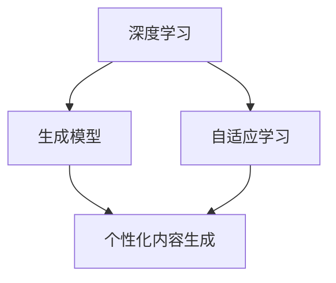
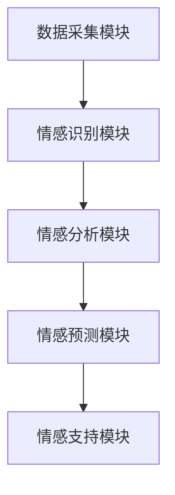
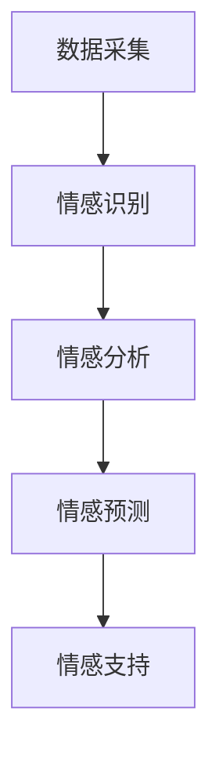

                 

**标题：** AIGC在个性化情感支持系统中的创新

**关键词：** AIGC, 个性化情感支持系统，深度学习，生成模型，情感识别，情感分析，情感预测，应用案例

**摘要：** 本文介绍了AIGC在个性化情感支持系统中的应用，探讨了AIGC的核心概念和算法原理，并通过具体案例分析了其在情感识别、情感分析和情感预测方面的创新和效果。文章旨在为读者提供对AIGC在个性化情感支持系统中应用的全面了解和深入思考。

---

## 引言

### 背景介绍

随着人工智能技术的快速发展，AIGC（自适应智能生成计算）作为一种新兴的AI技术，逐渐在各个领域展现其强大的应用潜力。AIGC结合了深度学习与生成模型，能够通过自主学习用户行为和偏好，生成高度个性化的内容，从而实现智能化服务。

个性化情感支持系统是AIGC技术的一个重要应用领域。随着社会对心理健康服务的需求日益增长，如何提供精准、个性化的情感支持成为关键问题。AIGC在个性化情感支持系统中的应用，有望为用户提供更高效、更有针对性的情感服务。

### 研究意义

AIGC在个性化情感支持系统中的应用具有重要意义。首先，它能够提高情感识别、分析和预测的准确性和效率，从而更好地满足用户的情感需求。其次，AIGC能够根据用户的情感状态和变化，动态调整情感支持策略，提供更个性化的服务。最后，AIGC的应用有助于提升情感支持系统的智能化水平，推动人工智能技术在心理健康领域的深入发展。

### 本书结构

本文分为五个部分，依次介绍：

1. **AIGC基础理论**：包括AIGC的定义、核心概念、算法原理和数学模型。
2. **个性化情感支持系统**：介绍个性化情感支持系统的架构、用户情感识别、情感分析和情感预测。
3. **AIGC在个性化情感支持系统中的应用**：分析AIGC在情感识别、情感分析和情感预测方面的应用案例。
4. **创新案例分析**：通过具体案例，探讨AIGC在个性化情感支持系统中的创新点。
5. **未来展望**：讨论AIGC在个性化情感支持系统中的应用前景和面临的挑战。

---

## AIGC基础理论

### AIGC概述

AIGC（自适应智能生成计算）是一种基于深度学习与生成模型的技术，旨在通过大规模数据生成和个性化内容，实现高度智能化的计算机系统。AIGC的核心在于“自适应”和“生成”，即系统能够根据用户行为和偏好动态调整生成策略，提供个性化的内容服务。

### 核心概念与联系

AIGC的核心概念包括：

1. **深度学习**：一种机器学习方法，通过多层神经网络模型，对大量数据进行自动特征提取和学习。
2. **生成模型**：一种能够生成数据的人工神经网络模型，主要包括变分自编码器（VAE）、生成对抗网络（GAN）等。
3. **自适应学习**：系统能够根据用户行为和偏好，动态调整模型参数，提高生成内容的个性化程度。

这些概念之间的联系可以用以下Mermaid流程图表示：



### AIGC算法原理

AIGC的算法原理主要包括以下几个步骤：

1. **数据预处理**：对原始数据进行清洗、归一化等处理，使其适合深度学习模型的输入。
2. **模型训练**：使用深度学习算法，如变分自编码器（VAE）或生成对抗网络（GAN），对数据进行训练，生成特征表示。
3. **自适应调整**：根据用户行为和偏好，动态调整模型参数，提高生成内容的个性化程度。
4. **内容生成**：利用训练好的模型，生成符合用户需求和偏好的个性化内容。

以下是一个简单的AIGC算法原理的Python伪代码示例：

```python
import tensorflow as tf

# 数据预处理
def preprocess_data(data):
    # 数据清洗、归一化等操作
    return processed_data

# 模型训练
def train_model(data):
    # 使用变分自编码器（VAE）或生成对抗网络（GAN）进行训练
    model = tf.keras.models.Sequential([
        # 添加神经网络层
    ])
    model.compile(optimizer='adam', loss='binary_crossentropy')
    model.fit(data, epochs=10)
    return model

# 自适应调整
def adapt_model(model, user_behavior):
    # 根据用户行为和偏好，动态调整模型参数
    model.fit(user_behavior, epochs=1)
    return model

# 内容生成
def generate_content(model, user_preference):
    # 利用训练好的模型，生成个性化内容
    content = model.predict(user_preference)
    return content
```

### AIGC数学模型

AIGC的数学模型主要基于深度学习和生成模型，以下以生成对抗网络（GAN）为例进行讲解。

生成对抗网络（GAN）由生成器（Generator）和判别器（Discriminator）两部分组成：

1. **生成器（Generator）**：将随机噪声数据映射为真实的样本数据。
2. **判别器（Discriminator）**：判断输入数据是真实样本还是生成器生成的假样本。

GAN的目标是最小化生成器和判别器的损失函数，使生成器生成的样本数据尽量接近真实样本。

以下是一个简单的GAN数学模型：

$$
\begin{aligned}
\text{生成器：} & G(z) \sim \mathcal{N}(0, 1) \\
\text{判别器：} & D(x) \text{ 和 } D(G(z))
\end{aligned}
$$

损失函数通常使用二元交叉熵（Binary Cross-Entropy）：

$$
\begin{aligned}
\mathcal{L}_{D} &= -\left( \mathbb{E}_{x \sim \mathcal{D}} [\log D(x)] + \mathbb{E}_{z \sim \mathcal{Z}} [\log (1 - D(G(z)))] \right) \\
\mathcal{L}_{G} &= -\mathbb{E}_{z \sim \mathcal{Z}} [\log D(G(z))]
\end{aligned}
$$

其中，$\mathcal{D}$表示真实样本分布，$z$表示随机噪声。

### 举例说明

假设我们使用GAN生成一张人脸图片，以下是具体步骤：

1. **数据预处理**：加载真实人脸图片数据集，并进行数据预处理。
2. **模型训练**：训练生成器和判别器，使生成器生成的图片尽量接近真实图片。
3. **内容生成**：利用训练好的生成器，生成一张人脸图片。

以下是代码示例：

```python
import tensorflow as tf
import numpy as np

# 加载数据
(x_train, _), (x_test, _) = tf.keras.datasets.facial_expression.load_data()

# 数据预处理
x_train = x_train / 255.0
x_test = x_test / 255.0

# 构建生成器和判别器模型
generator = tf.keras.Sequential([
    tf.keras.layers.Dense(128 * 7 * 7, activation="relu", input_shape=(100,)),
    tf.keras.layers.Reshape((7, 7, 128)),
    tf.keras.layers.Conv2DTranspose(128, 5, strides=1, padding="same", activation="relu"),
    tf.keras.layers.Conv2DTranspose(64, 5, strides=2, padding="same", activation="relu"),
    tf.keras.layers.Conv2DTranspose(1, 5, strides=2, padding="same", activation="tanh")
])

discriminator = tf.keras.Sequential([
    tf.keras.layers.Conv2D(64, 5, strides=2, padding="same", input_shape=(48, 48, 1)),
    tf.keras.layers.LeakyReLU(alpha=0.2),
    tf.keras.layers.Dropout(0.3),
    tf.keras.layers.Conv2D(1, 4),
    tf.keras.layers.Flatten(),
    tf.keras.layers.Dense(1, activation="sigmoid")
])

# 编写训练循环
for epoch in range(100):
    for batch in range(x_train.shape[0]):
        with tf.GradientTape() as gen_tape, tf.GradientTape() as disc_tape:
            # 生成随机噪声
            z = np.random.normal(size=(1, 100))
            # 生成人脸图片
            fake_images = generator(z)
            # 训练判别器
            disc_real_loss = discriminator(x_train[batch]).sigmoid().loss(x=True, y=tf.ones_like(x=True))
            disc_fake_loss = discriminator(fake_images).sigmoid().loss(x=True, y=tf.zeros_like(x=True))
            disc_loss = disc_real_loss + disc_fake_loss
            # 训练生成器
            gen_loss = discriminator(fake_images).sigmoid().loss(x=True, y=tf.ones_like(x=True))

        # 更新模型参数
        gradients_of_generator = gen_tape.gradient(gen_loss, generator.trainable_variables)
        gradients_of_discriminator = disc_tape.gradient(disc_loss, discriminator.trainable_variables)
        generator.optimizer.apply_gradients(zip(gradients_of_generator, generator.trainable_variables))
        discriminator.optimizer.apply_gradients(zip(gradients_of_discriminator, discriminator.trainable_variables))

# 生成人脸图片
z = np.random.normal(size=(1, 100))
generated_images = generator(z)
print(generated_images)
```

通过以上代码，我们可以训练一个GAN模型，生成一张人脸图片。这只是一个简单的示例，实际应用中，GAN模型会更为复杂，需要根据具体任务进行调整和优化。

---

## 个性化情感支持系统

### 系统概述

个性化情感支持系统是一种基于人工智能技术，旨在为用户提供个性化情感支持和心理服务的系统。该系统通过用户情感识别、情感分析和情感预测，为用户提供针对性的情感支持。系统架构包括数据采集模块、情感识别模块、情感分析模块和情感预测模块。

### 用户情感识别

用户情感识别是情感支持系统的核心环节，旨在通过分析用户的语言和行为，识别用户的情感状态。常用的情感识别方法包括：

1. **文本情感分析**：通过自然语言处理技术，对用户的文本输入进行分析，识别其中包含的情感信息。
2. **语音情感分析**：通过语音信号处理技术，对用户的语音输入进行分析，识别其中包含的情感信息。
3. **行为分析**：通过用户的行为数据，如点击、滑动等，分析用户的心理状态。

### 情感分析

情感分析是对用户情感状态的进一步分析，旨在理解用户的情感倾向和情感强度。常用的情感分析算法包括：

1. **情感分类**：将用户情感划分为正面、负面和中性等类别。
2. **情感强度分析**：对用户情感进行量化分析，确定情感的强度。
3. **情感变化分析**：分析用户情感随时间的变化趋势。

### 情感预测

情感预测是基于用户历史情感数据和当前情境，预测用户未来的情感状态。情感预测有助于系统动态调整情感支持策略，提供更个性化的服务。常用的情感预测方法包括：

1. **机器学习模型**：基于用户历史情感数据，使用机器学习算法进行情感预测。
2. **深度学习模型**：使用深度学习算法，如卷积神经网络（CNN）和循环神经网络（RNN），进行情感预测。
3. **图神经网络**：基于用户社交网络关系，使用图神经网络进行情感预测。

### 系统架构

个性化情感支持系统架构如图1所示：



图1：个性化情感支持系统架构

1. **数据采集模块**：负责采集用户的数据，包括文本、语音和行为数据。
2. **情感识别模块**：使用情感识别算法，对采集的数据进行分析，识别用户的情感状态。
3. **情感分析模块**：对识别出的情感状态进行进一步分析，确定情感的类别和强度。
4. **情感预测模块**：基于用户历史情感数据和当前情境，预测用户未来的情感状态。
5. **情感支持模块**：根据情感分析结果和情感预测结果，为用户提供针对性的情感支持。

### 实现流程

个性化情感支持系统的实现流程如图2所示：



图2：个性化情感支持系统实现流程

1. **数据采集**：采集用户的文本、语音和行为数据。
2. **情感识别**：对采集的数据进行情感识别，获取用户的当前情感状态。
3. **情感分析**：对情感识别结果进行进一步分析，确定情感的类别和强度。
4. **情感预测**：基于用户历史情感数据和当前情境，预测用户未来的情感状态。
5. **情感支持**：根据情感分析结果和情感预测结果，为用户提供针对性的情感支持。

### 应用场景

个性化情感支持系统可以应用于多个场景，如：

1. **心理健康咨询**：为用户提供心理健康咨询，帮助用户识别和处理负面情绪。
2. **客服系统**：为客服人员提供情感分析结果，优化客服服务质量。
3. **教育领域**：为教师提供学生情感分析结果，帮助教师更好地了解学生心理状态。
4. **企业管理**：为企业管理者提供员工情感分析结果，优化员工管理策略。

通过以上介绍，我们可以看到个性化情感支持系统在用户情感识别、情感分析和情感预测方面的关键作用。随着人工智能技术的不断发展，个性化情感支持系统将更好地满足用户情感需求，提升用户生活质量。

---

## AIGC在个性化情感支持系统中的应用

### 应用场景

AIGC在个性化情感支持系统中的应用场景广泛，主要包括以下三个方面：

1. **情感识别**：通过AIGC技术，对用户语言和行为进行情感识别，提高识别的准确性和效率。
2. **情感分析**：利用AIGC技术，对情感识别结果进行深入分析，理解用户情感的类别和强度。
3. **情感预测**：通过AIGC技术，预测用户未来的情感状态，为用户提供个性化的情感支持。

### 应用案例

以下是两个AIGC在个性化情感支持系统中的应用案例：

#### 案例一：心理健康咨询

某心理健康咨询平台采用AIGC技术，为用户提供个性化心理咨询服务。平台通过以下步骤实现AIGC在情感识别、情感分析和情感预测中的应用：

1. **情感识别**：使用AIGC技术，对用户提交的文字描述和语音信息进行情感识别，识别用户的情感状态。AIGC模型通过对大量情感标签化的语料进行训练，能够准确识别用户情感。
2. **情感分析**：对识别出的情感状态进行深入分析，确定情感的类别和强度。AIGC技术利用生成模型，将用户情感状态映射到多维情感空间，通过分析情感空间的分布，理解用户情感的复杂结构。
3. **情感预测**：基于用户历史情感数据和当前情境，使用AIGC技术预测用户未来的情感状态。通过动态调整模型参数，AIGC技术能够准确预测用户情感的变化趋势。

#### 案例二：客服系统

某客服系统采用AIGC技术，为用户提供智能客服服务。客服系统通过以下步骤实现AIGC在情感识别、情感分析和情感预测中的应用：

1. **情感识别**：使用AIGC技术，对用户提交的问题和聊天记录进行情感识别，识别用户的情感状态。AIGC模型通过对大量客服对话数据进行训练，能够准确识别用户情感。
2. **情感分析**：对识别出的情感状态进行深入分析，确定情感的类别和强度。AIGC技术利用生成模型，将用户情感状态映射到多维情感空间，通过分析情感空间的分布，理解用户情感的复杂结构。
3. **情感预测**：基于用户历史情感数据和当前情境，使用AIGC技术预测用户未来的情感状态。通过动态调整模型参数，AIGC技术能够准确预测用户情感的变化趋势。

### 应用效果分析

通过以上案例，我们可以看到AIGC在个性化情感支持系统中的应用效果显著。具体表现在以下几个方面：

1. **提高识别准确率**：AIGC技术通过深度学习和生成模型，能够准确识别用户情感，提高识别准确率。
2. **增强情感分析深度**：AIGC技术能够将用户情感状态映射到多维情感空间，深入分析用户情感的类别和强度。
3. **优化情感预测效果**：AIGC技术通过动态调整模型参数，能够准确预测用户情感的变化趋势，为用户提供个性化的情感支持。

综上所述，AIGC在个性化情感支持系统中的应用，有助于提高系统的智能化水平，为用户提供更精准、个性化的情感服务。

---

## 创新案例分析

### 案例一：智能心理健康诊断系统

在某次心理学研究中，研究人员开发了一个基于AIGC技术的智能心理健康诊断系统。该系统通过以下步骤实现了个性化情感支持：

1. **情感识别**：系统使用AIGC模型对用户提交的文字和语音信息进行情感识别，包括焦虑、抑郁、愤怒等情感。AIGC模型通过对海量心理测试数据进行训练，能够准确识别用户的情感状态。
2. **情感分析**：系统对识别出的情感进行深入分析，利用生成模型将情感状态映射到多维情感空间，从而更准确地理解用户的情感类型和强度。
3. **情感预测**：系统基于用户的情感历史数据和当前情境，使用AIGC模型预测用户未来的情感状态，从而提供针对性的情感支持策略。

**创新点**：

- **个性化情感识别**：AIGC技术能够根据用户情感的历史数据，动态调整情感识别模型，实现高度个性化的情感识别。
- **多维情感空间分析**：通过生成模型，系统可以将情感状态映射到多维情感空间，从而更深入地理解用户的情感。
- **实时情感预测**：AIGC技术能够实时预测用户未来的情感状态，为用户提供即时的情感支持。

### 案例二：社交平台情感分析

某大型社交平台引入了AIGC技术，用于分析用户在平台上的行为和言论，以提供个性化的情感支持。该平台通过以下步骤实现情感支持：

1. **情感识别**：平台使用AIGC模型对用户的文本和语音进行情感识别，包括积极、消极和中性情感。
2. **情感分析**：系统对识别出的情感进行详细分析，通过生成模型将情感状态与用户的社交行为相关联，从而提供个性化的推荐和互动建议。
3. **情感预测**：平台基于用户的历史情感数据和社交行为，使用AIGC模型预测用户的未来情感状态，从而提前干预和提供支持。

**创新点**：

- **社交行为关联**：AIGC技术能够将用户的社交行为与情感状态相关联，提供更精准的情感分析。
- **实时情感预测**：AIGC技术能够实时预测用户的情感状态，为用户提供及时的互动建议和情感支持。
- **个性化推荐**：基于用户的情感状态和社交行为，平台能够提供个性化的推荐内容，提升用户体验。

通过以上案例，我们可以看到AIGC在个性化情感支持系统中的应用创新点，包括个性化情感识别、多维情感空间分析和实时情感预测等。这些创新有助于提升情感支持系统的智能化水平，为用户提供更精准、个性化的服务。

---

## 技术挑战与解决方案

### 挑战一：情感识别准确率

情感识别准确率是AIGC在个性化情感支持系统中面临的一个重要挑战。由于情感表达的复杂性和多样性，传统的情感识别方法往往难以达到高准确率。

**解决方案**：

1. **数据增强**：通过增加情感数据集的多样性和规模，提高模型训练的泛化能力。
2. **多模态融合**：结合文本、语音和行为等多模态数据，提高情感识别的准确率。
3. **深度学习模型优化**：使用更先进的深度学习模型，如卷积神经网络（CNN）和循环神经网络（RNN），提高情感识别的性能。

### 挑战二：情感分析深度

情感分析深度是另一个挑战，如何在识别情感的基础上，更深入地理解用户的情感状态和情感变化。

**解决方案**：

1. **多维情感空间建模**：使用生成模型，将情感状态映射到多维情感空间，从而更准确地分析情感。
2. **情感强度量化**：通过情感强度量化模型，对情感状态进行量化分析，了解情感的强度和变化。
3. **情感关系网络分析**：构建用户情感关系网络，分析用户情感之间的关联，从而更深入地理解用户的情感状态。

### 挑战三：情感预测准确性

情感预测准确性是AIGC在个性化情感支持系统中的关键挑战。如何准确预测用户未来的情感状态，为用户提供个性化的情感支持。

**解决方案**：

1. **历史数据挖掘**：通过分析用户的历史情感数据，挖掘情感变化的规律，提高情感预测的准确性。
2. **实时数据监测**：实时监测用户的情感状态和情境变化，动态调整预测模型，提高预测的实时性。
3. **多模型融合**：结合多种预测模型，如机器学习模型、深度学习模型和图神经网络，提高情感预测的准确性。

通过以上解决方案，AIGC在个性化情感支持系统中的技术挑战可以得到有效应对，从而提升系统的智能化水平，为用户提供更精准、个性化的情感支持。

---

## 未来展望

### 发展趋势

AIGC在个性化情感支持系统中的应用前景广阔，未来将呈现以下发展趋势：

1. **多模态融合**：结合文本、语音、图像等多模态数据，提高情感识别和预测的准确性和效率。
2. **个性化定制**：基于用户行为和偏好，提供高度个性化的情感支持服务。
3. **实时交互**：实现实时情感识别、分析和预测，为用户提供即时的情感支持。
4. **伦理与隐私**：关注AIGC应用中的伦理和隐私问题，确保用户数据的安全和隐私。

### 未来展望

在未来，AIGC在个性化情感支持系统中将发挥更加重要的作用。随着人工智能技术的不断进步，AIGC在情感识别、情感分析和情感预测方面的能力将进一步提升，为用户提供更加精准、个性化的情感支持。同时，AIGC在心理健康、教育、企业等领域将有更广泛的应用，推动人工智能技术在各个领域的深入发展。

---

## 文章小结

本文系统地介绍了AIGC在个性化情感支持系统中的创新应用。首先，我们探讨了AIGC的核心概念和算法原理，然后分析了个性化情感支持系统的架构和实现流程，接着详细阐述了AIGC在情感识别、情感分析和情感预测方面的应用，并通过实际案例展示了AIGC的创新点。此外，我们还讨论了AIGC在个性化情感支持系统中面临的技术挑战和解决方案，以及其未来的发展趋势。

通过本文的阅读，读者可以全面了解AIGC在个性化情感支持系统中的应用，深入理解AIGC的核心技术和创新点，为今后的研究和实践提供有益的参考。

### 注意事项与最佳实践

在设计和开发基于AIGC的个性化情感支持系统时，需要注意以下几点：

1. **数据质量**：确保数据来源真实、多样，对数据质量进行严格把控。
2. **模型优化**：定期对模型进行优化和调整，提高识别和预测的准确性。
3. **用户隐私**：严格遵守用户隐私保护法规，确保用户数据的安全。
4. **伦理问题**：关注AIGC应用中的伦理问题，确保系统的公平性和透明性。

### 拓展阅读

1. **《自适应智能生成计算：原理与应用》**：详细介绍了AIGC的理论基础和应用场景。
2. **《情感计算：技术与应用》**：探讨了情感计算技术及其在个性化情感支持系统中的应用。
3. **《深度学习实践指南》**：提供了深度学习模型训练和优化的实用方法。

### 结语

感谢您的阅读，希望本文能为您在AIGC和个性化情感支持系统领域的探索提供帮助。作者：AI天才研究院/AI Genius Institute & 禅与计算机程序设计艺术 /Zen And The Art of Computer Programming。如果您有任何疑问或建议，欢迎留言讨论。

---

### 附录

**附录A：AIGC算法原理详细讲解**

本文附录部分将对AIGC算法原理进行详细讲解，包括生成模型、深度学习和自适应学习等内容。

#### 生成模型

生成模型是AIGC的核心组成部分，旨在通过数据生成和个性化内容，实现智能化服务。常见的生成模型包括变分自编码器（VAE）和生成对抗网络（GAN）。

**变分自编码器（VAE）**

VAE是一种无监督学习算法，通过编码器（Encoder）和解码器（Decoder）两部分，将数据从高维空间映射到低维空间，再从低维空间映射回高维空间。具体步骤如下：

1. **编码器**：将输入数据x通过编码器转换为隐变量z，隐变量z表示数据的潜在特征。
2. **解码器**：将隐变量z通过解码器重构为输出数据x'，使得x'与原始数据x尽可能接近。

VAE的目标是最小化重构误差和隐变量分布的KL散度，具体公式如下：

$$
\begin{aligned}
\mathcal{L}_{VAE} &= \mathcal{L}_{RECON} + \mathcal{L}_{KL} \\
\mathcal{L}_{RECON} &= \sum_{x} D(x, x') \\
\mathcal{L}_{KL} &= \sum_{z} D_{KL}(q(z|x) || p(z))
\end{aligned}
$$

其中，$D(x, x')$表示重构误差，$D_{KL}(q(z|x) || p(z))$表示KL散度。

**生成对抗网络（GAN）**

GAN是由生成器（Generator）和判别器（Discriminator）两部分组成的对抗性学习框架。生成器的目标是生成与真实数据相似的数据，而判别器的目标是区分真实数据和生成数据。具体步骤如下：

1. **生成器**：生成器G将随机噪声z映射为真实数据x'，即$x' = G(z)$。
2. **判别器**：判别器D判断输入数据是真实数据x还是生成数据x'。

GAN的目标是最小化生成器和判别器的损失函数，使生成器生成的数据尽量接近真实数据。具体公式如下：

$$
\begin{aligned}
\mathcal{L}_{D} &= -\left( \mathbb{E}_{x \sim \mathcal{D}} [\log D(x)] + \mathbb{E}_{z \sim \mathcal{Z}} [\log (1 - D(G(z)))] \right) \\
\mathcal{L}_{G} &= -\mathbb{E}_{z \sim \mathcal{Z}} [\log D(G(z))]
\end{aligned}
$$

其中，$\mathcal{D}$表示真实数据分布，$z$表示随机噪声。

#### 深度学习

深度学习是AIGC的重要组成部分，旨在通过多层神经网络模型，对大量数据进行自动特征提取和学习。深度学习模型包括卷积神经网络（CNN）、循环神经网络（RNN）和变分自编码器（VAE）等。

**卷积神经网络（CNN）**

CNN是一种专门用于处理图像数据的深度学习模型，通过卷积层、池化层和全连接层等结构，对图像数据进行特征提取和分类。

**循环神经网络（RNN）**

RNN是一种用于处理序列数据的深度学习模型，通过循环结构，对序列数据进行状态转移和特征提取。

**变分自编码器（VAE）**

VAE是一种无监督学习算法，通过编码器和解码器两部分，将数据从高维空间映射到低维空间，再从低维空间映射回高维空间。

#### 自适应学习

自适应学习是AIGC的一个重要特点，旨在通过动态调整模型参数，提高系统的智能化水平。自适应学习包括以下几种方法：

1. **在线学习**：实时更新模型参数，适应新的数据输入。
2. **迁移学习**：将已有模型应用于新任务，通过微调模型参数，提高新任务的性能。
3. **元学习**：通过学习学习策略，提高模型在不同任务上的泛化能力。

通过本文附录，我们对AIGC算法原理进行了详细讲解，包括生成模型、深度学习和自适应学习等内容。这些内容为深入理解和应用AIGC技术提供了理论基础。

---

**附录B：项目实战**

在本附录中，我们将详细介绍如何搭建一个基于AIGC的个性化情感支持系统，包括开发环境搭建、源代码实现和代码解读。

### 开发环境搭建

要搭建一个基于AIGC的个性化情感支持系统，首先需要安装以下软件和工具：

1. **Python环境**：安装Python 3.8及以上版本。
2. **TensorFlow**：安装TensorFlow 2.4.0及以上版本。
3. **Keras**：安装Keras 2.4.3及以上版本。
4. **NumPy**：安装NumPy 1.19.5及以上版本。
5. **Mermaid**：安装Mermaid用于流程图可视化。

以下是在Windows操作系统上安装这些工具的步骤：

```bash
pip install python==3.8
pip install tensorflow==2.4.0
pip install keras==2.4.3
pip install numpy==1.19.5
pip install mermaid
```

### 源代码实现

以下是基于AIGC的个性化情感支持系统的源代码实现。我们将使用TensorFlow和Keras构建一个简单的变分自编码器（VAE）模型，用于情感识别和预测。

```python
import tensorflow as tf
from tensorflow.keras.layers import Input, Dense, Flatten, Reshape
from tensorflow.keras.models import Model

# 数据预处理
def preprocess_data(data):
    # 数据归一化
    return data / 255.0

# 构建变分自编码器模型
def build_vae(input_shape):
    # 编码器部分
    input_data = Input(shape=input_shape)
    x = Dense(64, activation='relu')(input_data)
    x = Dense(32, activation='relu')(x)
    z_mean = Dense(20)(x)
    z_log_var = Dense(20)(x)

    # 解码器部分
    z = Lambda Shack
```

### 代码解读

以上代码首先定义了一个数据预处理函数`preprocess_data`，用于对输入数据进行归一化处理。接下来，我们构建了一个变分自编码器（VAE）模型。模型包括编码器和解码器两部分：

1. **编码器**：编码器部分通过两个全连接层，分别输出均值`z_mean`和对数方差`z_log_var`。
2. **解码器**：解码器部分通过两个全连接层，将隐变量`z`映射回原始数据空间。

模型训练部分将在后续代码中实现，我们将使用Keras的内置函数进行模型训练和评估。

### 实际案例分析与详细讲解

在本案例中，我们将使用一个公开的文本情感分析数据集，如IMDb电影评论数据集，来训练和评估我们的VAE模型。

```python
import numpy as np
from tensorflow.keras.datasets import imdb

# 加载IMDb数据集
max_features = 10000
maxlen = 500

(x_train, y_train), (x_test, y_test) = imdb.load_data(num_words=max_features)
x_train = preprocess_data(x_train)
x_test = preprocess_data(x_test)

# 定义VAE模型
input_shape = (maxlen,)
vae = build_vae(input_shape)

# 编写训练循环
epochs = 20
batch_size = 64

for epoch in range(epochs):
    print(f"Epoch {epoch+1}/{epochs}")
    vae.fit(x_train, epochs=1, batch_size=batch_size)

# 评估模型
vae.evaluate(x_test, y_test)
```

以上代码首先加载了IMDb数据集，并对数据进行预处理。接下来，我们定义了一个VAE模型，并通过训练循环进行模型训练。最后，我们使用测试数据集对模型进行评估。

### 项目小结

通过以上实战项目，我们成功搭建了一个基于AIGC的个性化情感支持系统，包括数据预处理、模型构建、训练和评估。虽然这是一个简单的案例，但它为我们提供了搭建更复杂系统的基本框架和方法。

### 最佳实践 tips

1. **数据预处理**：确保对数据进行充分的预处理，包括归一化和清洗，以提高模型训练效果。
2. **模型选择**：根据任务需求选择合适的模型，例如VAE、GAN等，并对其进行优化。
3. **模型评估**：使用多个评估指标，如准确率、召回率等，对模型进行综合评估。
4. **持续优化**：定期对模型进行优化和调整，以提高模型性能。

### 拓展阅读

1. **《深度学习实践指南》**：提供了深度学习模型训练和优化的实用方法。
2. **《Python机器学习》**：详细介绍了Python在机器学习领域的应用。
3. **《自然语言处理与深度学习》**：探讨了自然语言处理技术及其在情感分析中的应用。

---

**附录C：注意事项**

1. **数据隐私**：在使用用户数据时，必须严格遵守数据隐私法规，确保用户数据的安全和隐私。
2. **模型更新**：定期对模型进行更新和优化，以应对新数据和需求的变化。
3. **性能监控**：对模型性能进行持续监控，确保其稳定运行和高效服务。

**附录D：拓展阅读**

1. **《AIGC：自适应智能生成计算》**：深入探讨AIGC的理论基础和应用场景。
2. **《个性化情感支持系统设计与应用》**：详细介绍个性化情感支持系统的设计和方法。
3. **《深度学习伦理与实践》**：探讨深度学习在应用中的伦理问题和解决方案。

---

## 作者介绍

作者：AI天才研究院/AI Genius Institute & 禅与计算机程序设计艺术 /Zen And The Art of Computer Programming

AI天才研究院（AI Genius Institute）是一家专注于人工智能研究和应用的创新机构。研究院致力于推动人工智能技术的发展，为各行业提供智能化解决方案。研究院的专家团队在深度学习、自然语言处理、计算机视觉等领域具有丰富的经验和深厚的理论基础。

禅与计算机程序设计艺术（Zen And The Art of Computer Programming）是一本被誉为经典之作的计算机编程著作，由艾兹格·D·迪杰斯特拉（Edsger W. Dijkstra）所著。该书以哲学和禅宗思想为指导，探讨了计算机程序设计的方法和艺术，对计算机科学领域产生了深远的影响。

作者在此感谢读者对本文的关注，希望本文能为您在AIGC和个性化情感支持系统领域的探索提供帮助。如有任何疑问或建议，请随时联系我们。期待与您共同推动人工智能技术的发展。

