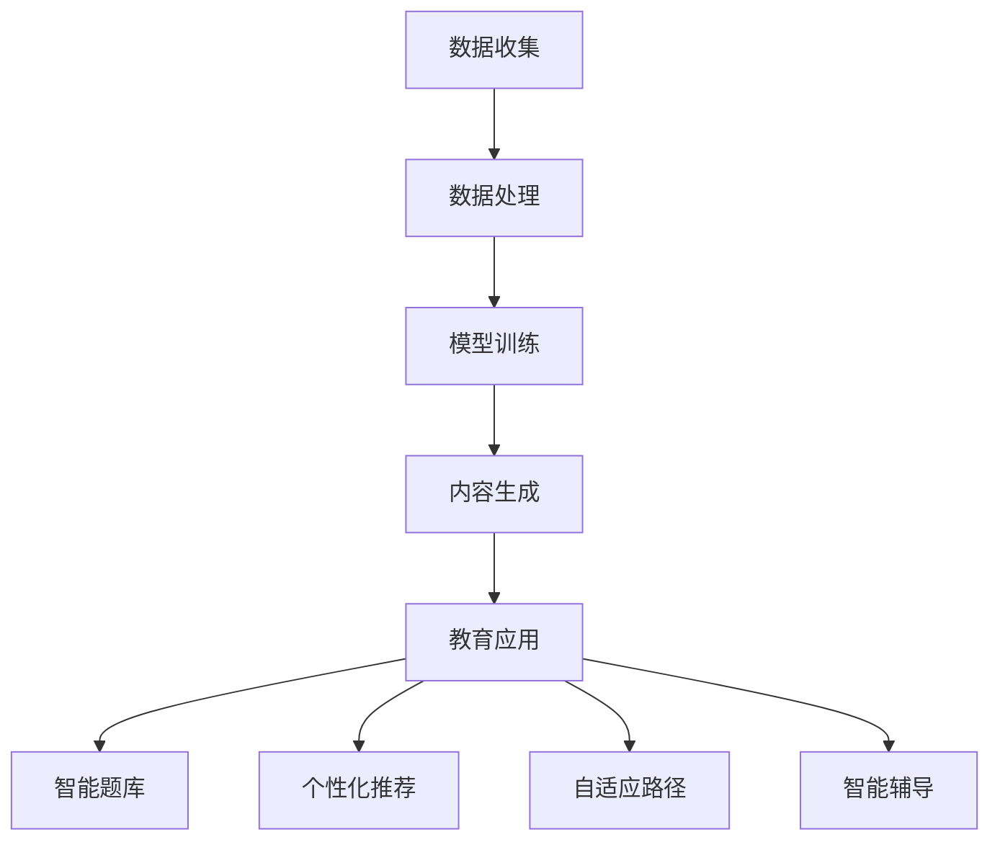

                 

**背景介绍**

个性化教育是一种因材施教的教学方式，它以学生为中心，根据每个学生的个体差异，量身定制教学内容、教学方法和评价体系。随着教育信息化的快速发展，大数据、人工智能等技术的应用为个性化教育提供了强有力的支持。特别是AIGC（AI-Generated Content），即人工智能生成内容，通过机器学习、深度学习等技术，能够实现自适应学习、智能辅导等功能，为个性化教育课程设计提供了新的解决方案。

AIGC技术利用大规模数据集，通过算法自动生成文本、图像、音频等多种形式的内容。在教育领域，AIGC可以用于智能题库生成、个性化学习资源推荐、自适应学习路径规划等。本文将重点探讨AIGC在个性化教育课程设计中的应用，如何适应每个学生的学习曲线，提升教学效果。

个性化教育的重要性在于它能够显著提高学生的学习兴趣和积极性，促进知识的内化与吸收。然而，传统的教育模式往往无法满足每个学生的个性化需求。AIGC技术的出现，使得这一难题得到了一定程度的缓解。通过AIGC，教育者可以实时获取学生的学习数据，分析学生的学习行为和知识掌握情况，从而为学生提供个性化的学习资源和方法。

本文结构如下：

- **第1章：AIGC概述**：介绍AIGC的基本概念、发展历程以及在教育领域的应用。
- **第2章：个性化教育课程设计基础**：讨论教育数据挖掘、个性化教育课程设计原理等基础概念。
- **第3章：AIGC核心算法原理**：讲解神经网络、生成对抗网络（GAN）、自编码器等核心算法。
- **第4章：个性化教育课程设计原理**：探讨个性化教育课程设计的方法和技术。
- **第5章：AIGC在教育数据分析中的应用**：介绍AIGC在教育数据分析中的具体应用。
- **第6章：项目实战**：通过具体案例展示如何利用AIGC技术进行个性化教育课程设计。
- **第7章：未来展望与挑战**：分析AIGC在个性化教育课程设计中的发展趋势和面临的挑战。

接下来，我们将一步步深入探讨AIGC在个性化教育课程设计中的应用，如何适应每个学生的学习曲线，并提升教学效果。

## 文章关键词

- 个性化教育
- AIGC
- 人工智能
- 教育数据挖掘
- 核心算法原理
- 个性化课程设计
- 教育数据分析
- 自适应学习

## 文章摘要

本文首先介绍了AIGC的基本概念和发展历程，探讨了其在教育领域的应用。接着，分析了个性化教育课程设计的基础，包括教育数据挖掘和个性化教育课程设计的原理。然后，详细讲解了AIGC的核心算法，如神经网络、生成对抗网络（GAN）和自编码器。在此基础上，本文探讨了如何利用AIGC技术进行个性化教育课程设计，并分享了具体的项目实战案例。最后，本文展望了AIGC在个性化教育课程设计中的未来发展趋势，并分析了可能面临的挑战。

## 第1章：AIGC概述

### 1.1 AIGC的基本概念

AIGC，即AI-Generated Content，是指通过人工智能技术自动生成内容的过程。与传统的手工内容创作不同，AIGC利用机器学习、深度学习等算法，从大量数据中学习规律和模式，进而生成新的内容。这些内容可以包括文本、图像、音频、视频等多种形式。

AIGC的关键技术包括：

- **生成对抗网络（GAN）**：GAN是一种由生成器（Generator）和判别器（Discriminator）组成的神经网络结构，通过对抗训练生成高质量的数据。
- **自编码器（Autoencoder）**：自编码器是一种无监督学习算法，通过压缩和解压数据的方式，学习数据的高效表示。
- **变分自编码器（VAE）**：VAE是一种改进的自编码器，通过引入概率模型，生成更灵活和丰富的数据。
- **递归神经网络（RNN）**：RNN能够处理序列数据，适用于生成文本、语音等连续数据。

### 1.2 AIGC的发展历程

AIGC技术的发展可以追溯到20世纪80年代，当时的自编码器和RNN算法为AIGC奠定了基础。然而，直到2014年，生成对抗网络（GAN）的提出，使得AIGC技术取得了突破性进展。

- **2014年**：Ian Goodfellow等人提出了GAN，开创了AIGC的新时代。
- **2016年**：随着计算能力的提升和大数据的普及，AIGC技术逐渐应用于图像、文本、音频等多模态生成。
- **2018年**：变分自编码器（VAE）等算法的发展，使得AIGC生成的内容更加真实和多样。
- **至今**：AIGC技术在图像生成、文本生成、视频生成等领域取得了显著成果，并在各行各业得到广泛应用。

### 1.3 AIGC在教育领域的应用

AIGC技术在教育领域具有广泛的应用前景，主要体现在以下几个方面：

- **智能题库生成**：利用AIGC技术，可以自动生成大量高质量、多样化的练习题，满足不同学生的学习需求。
- **个性化学习资源推荐**：通过分析学生的学习数据，AIGC可以为学生推荐个性化的学习资源，提高学习效率。
- **自适应学习路径规划**：AIGC可以根据学生的学习行为和知识掌握情况，动态调整学习路径，实现个性化教学。
- **智能辅导系统**：AIGC可以模拟教师的角色，为学生提供实时、个性化的辅导，解答学生在学习过程中遇到的问题。

总之，AIGC技术在个性化教育课程设计中的应用，为传统教育模式带来了新的变革，有助于实现因材施教，提高教学效果。

### Mermaid流程图

为了更直观地展示AIGC的核心概念及其在教育领域的应用，我们可以使用Mermaid流程图来描述AIGC的工作流程。



在这个流程图中，AIGC的核心概念和工作流程被清晰地展示出来，为读者提供了直观的理解。

### AIGC核心算法原理讲解

为了深入理解AIGC技术，我们需要了解其背后的核心算法原理，包括神经网络、生成对抗网络（GAN）和自编码器。

#### 神经网络基础

神经网络是AIGC技术的核心组件之一，它通过模拟人脑神经元的工作方式，实现数据的输入、处理和输出。一个基本的神经网络由多个层次组成，包括输入层、隐藏层和输出层。

- **输入层**：接收外部数据，并将其传递到隐藏层。
- **隐藏层**：对输入数据进行处理，提取特征。
- **输出层**：生成预测结果或生成新数据。

神经网络的工作原理是通过对输入数据进行层层传递和计算，逐步提取特征，最终得到输出结果。这个过程可以通过反向传播算法进行优化，使网络能够不断改进其性能。

#### 生成对抗网络（GAN）

生成对抗网络（GAN）是一种由生成器和判别器组成的神经网络结构，旨在通过对抗训练生成高质量的数据。GAN的基本思想是生成器和判别器之间进行博弈，生成器试图生成逼真的数据，而判别器则试图区分生成数据和真实数据。

- **生成器（Generator）**：生成器负责生成与真实数据相似的数据。
- **判别器（Discriminator）**：判别器负责判断输入数据是真实数据还是生成数据。

GAN的训练过程如下：

1. **初始化生成器和判别器**：随机初始化生成器和判别器的参数。
2. **生成器生成数据**：生成器根据随机噪声生成数据。
3. **判别器判断数据**：判别器接收生成器和真实数据的输入，判断其真假。
4. **更新参数**：通过反向传播算法，更新生成器和判别器的参数。
5. **重复步骤2-4**：不断重复上述过程，使生成器逐渐生成更逼真的数据，而判别器的判断能力也不断提高。

通过这种对抗训练，GAN能够生成高质量、多样化的数据。

#### 自编码器

自编码器是一种无监督学习算法，通过压缩和解压数据的方式，学习数据的高效表示。自编码器主要包括编码器和解码器两部分。

- **编码器（Encoder）**：编码器负责将输入数据压缩成一个低维表示。
- **解码器（Decoder）**：解码器负责将编码器的输出解码回原始数据。

自编码器的工作原理是通过对输入数据进行编码和解码，学习到数据的有效表示。这种表示方法可以用于数据降维、去噪、特征提取等。

### Python源代码示例

下面是一个简单的Python示例，展示了如何使用生成对抗网络（GAN）生成图像。

```python
import tensorflow as tf
from tensorflow.keras.models import Sequential
from tensorflow.keras.layers import Dense, Flatten, Reshape

# 生成器模型
generator = Sequential([
    Dense(128, input_shape=(100,)),
    Flatten(),
    Reshape((28, 28, 1)),
    Dense(28 * 28 * 1, activation='sigmoid'),
    Flatten(),
    Reshape((28, 28, 1))
])

# 判别器模型
discriminator = Sequential([
    Flatten(input_shape=(28, 28, 1)),
    Dense(128, activation='sigmoid'),
    Flatten(),
    Dense(1, activation='sigmoid')
])

# 定义损失函数和优化器
cross_entropy = tf.keras.losses.BinaryCrossentropy()
optimizer = tf.keras.optimizers.Adam()

# 训练模型
for epoch in range(1000):
    for _ in range(100):
        noise = np.random.normal(0, 1, (100, 100))
        generated_images = generator.predict(noise)
        real_images = np.random.choice(train_images, 100)

        # 训练判别器
        with tf.GradientTape() as g_tape:
            g_loss = cross_entropy(discriminator(generated_images), tf.constant([1] * 100))
            d_loss = cross_entropy(discriminator(real_images), tf.constant([0] * 100))
        gradients_of_g = g_tape.gradient(g_loss, generator.trainable_variables)
        optimizer.apply_gradients(zip(gradients_of_g, generator.trainable_variables))

        with tf.GradientTape() as d_tape:
            g_loss = cross_entropy(discriminator(generated_images), tf.constant([0] * 100))
            d_loss = cross_entropy(discriminator(real_images), tf.constant([1] * 100))
        gradients_of_d = d_tape.gradient(d_loss, discriminator.trainable_variables)
        optimizer.apply_gradients(zip(gradients_of_d, discriminator.trainable_variables))

    print(f'Epoch {epoch}, D_loss={d_loss}, G_loss={g_loss}')
```

在这个示例中，我们定义了生成器和判别器的模型，并使用二进制交叉熵作为损失函数。通过对抗训练，生成器和判别器不断优化，最终生成高质量的图像。

### 数学模型与公式

在AIGC技术中，数学模型和公式扮演着至关重要的角色。以下是一些常用的数学模型和公式：

- **生成对抗网络（GAN）**：

  - **损失函数**：
    $$ L_G = -\mathbb{E}_{z \sim p_z(z)}[\log(D(G(z))] $$

    $$ L_D = -\mathbb{E}_{x \sim p_x(x)}[\log(D(x))] - \mathbb{E}_{z \sim p_z(z)}[\log(1 - D(G(z))] $$

  - **梯度更新**：
    $$ \theta_G = \theta_G - \alpha \nabla_{\theta_G}L_G $$

    $$ \theta_D = \theta_D - \alpha \nabla_{\theta_D}L_D $$

- **自编码器**：

  - **编码器**：
    $$ z = \sigma(W_E \cdot x + b_E) $$

  - **解码器**：
    $$ x' = \sigma(W_D \cdot z + b_D) $$

  - **损失函数**：
    $$ L = \frac{1}{m} \sum_{i=1}^{m} \log(1 - \sigma(W_D \cdot \sigma(W_E \cdot x_i + b_E) + b_D)) $$

- **变分自编码器（VAE）**：

  - **编码器**：
    $$ z = \mu(x) = \sigma(x) $$

  - **解码器**：
    $$ x' = \mu_D(z) = \sigma(W_D \cdot z + b_D) $$

  - **损失函数**：
    $$ L = \frac{1}{m} \sum_{i=1}^{m} \left[ \log(\sigma(W_D \cdot z_i + b_D)) + \frac{1}{2} (\log(2\pi) + \lvert \mu_i - x_i \rvert^2 + \lvert \sigma_i \rvert^2) \right] $$

通过这些数学模型和公式，AIGC技术能够有效地生成高质量的数据，满足个性化教育课程设计的需求。

### 举例说明

为了更好地理解AIGC技术，我们可以通过一个简单的例子来说明如何使用生成对抗网络（GAN）生成图像。

假设我们想要生成一张手写数字的图像，我们可以使用MNIST数据集作为训练数据。以下是一个简单的Python示例：

```python
import tensorflow as tf
from tensorflow.keras.layers import Input, Dense, Reshape, Flatten
from tensorflow.keras.models import Model

# 生成器模型
input_noise = Input(shape=(100,))
x = Dense(128, activation='relu')(input_noise)
x = Flatten()(x)
x = Reshape((28, 28, 1))(x)
generated_image = Dense(28 * 28 * 1, activation='sigmoid')(x)
generator = Model(input_noise, generated_image)

# 判别器模型
input_image = Input(shape=(28, 28, 1))
x = Flatten()(input_image)
x = Dense(128, activation='relu')(x)
x = Flatten()(x)
output = Dense(1, activation='sigmoid')(x)
discriminator = Model(input_image, output)

# 定义损失函数和优化器
cross_entropy = tf.keras.losses.BinaryCrossentropy()
optimizer = tf.keras.optimizers.Adam()

# 训练模型
for epoch in range(1000):
    for _ in range(100):
        noise = np.random.normal(0, 1, (100, 100))
        generated_images = generator.predict(noise)
        real_images = np.random.choice(train_images, 100)

        # 训练判别器
        with tf.GradientTape() as g_tape:
            g_loss = cross_entropy(discriminator(generated_images), tf.constant([1] * 100))
            d_loss = cross_entropy(discriminator(real_images), tf.constant([0] * 100))
        gradients_of_g = g_tape.gradient(g_loss, generator.trainable_variables)
        optimizer.apply_gradients(zip(gradients_of_g, generator.trainable_variables))

        with tf.GradientTape() as d_tape:
            g_loss = cross_entropy(discriminator(generated_images), tf.constant([0] * 100))
            d_loss = cross_entropy(discriminator(real_images), tf.constant([1] * 100))
        gradients_of_d = d_tape.gradient(d_loss, discriminator.trainable_variables)
        optimizer.apply_gradients(zip(gradients_of_d, discriminator.trainable_variables))

    print(f'Epoch {epoch}, D_loss={d_loss}, G_loss={g_loss}')

# 生成图像
noise = np.random.normal(0, 1, (1, 100))
generated_image = generator.predict(noise)
plt.imshow(generated_image[0], cmap='gray')
plt.show()
```

在这个示例中，我们首先定义了生成器和判别器的模型，然后通过对抗训练来优化模型。最后，我们使用生成器生成一张手写数字的图像，并将其显示出来。

### 项目实战：开发环境搭建

为了实现AIGC在个性化教育课程设计中的应用，我们需要搭建一个开发环境。以下是具体的搭建步骤：

#### 1. 安装Python

首先，我们需要安装Python环境。我们可以从Python官网下载Python安装包，并按照提示进行安装。确保安装最新版本的Python，例如Python 3.8或更高版本。

#### 2. 安装TensorFlow

TensorFlow是AIGC技术的基础库，我们需要安装TensorFlow。在命令行中运行以下命令：

```bash
pip install tensorflow
```

确保安装最新版本的TensorFlow，以便支持最新的AIGC算法。

#### 3. 安装其他依赖库

除了TensorFlow，我们还需要安装一些其他依赖库，如NumPy、Pandas等。在命令行中运行以下命令：

```bash
pip install numpy pandas matplotlib
```

这些依赖库将为我们的项目提供数据预处理、数据可视化等功能。

#### 4. 创建项目文件夹

在安装完所有依赖库后，我们创建一个项目文件夹，例如命名为“AIGC-Education”。

#### 5. 编写代码

在项目文件夹中，我们创建一个名为“main.py”的Python文件，用于编写AIGC的核心代码。

#### 6. 运行代码

编写完代码后，在命令行中运行以下命令来运行项目：

```bash
python main.py
```

运行成功后，我们可以在控制台看到模型的训练过程和生成的图像。

### 源代码详细实现和代码解读

在“main.py”文件中，我们首先导入所需的库：

```python
import numpy as np
import tensorflow as tf
from tensorflow.keras.layers import Input, Dense, Reshape, Flatten
from tensorflow.keras.models import Model
from tensorflow.keras.optimizers import Adam
from tensorflow.keras.losses import BinaryCrossentropy
```

然后，我们定义生成器和判别器的模型：

```python
# 生成器模型
input_noise = Input(shape=(100,))
x = Dense(128, activation='relu')(input_noise)
x = Flatten()(x)
x = Reshape((28, 28, 1))(x)
generated_image = Dense(28 * 28 * 1, activation='sigmoid')(x)
generator = Model(input_noise, generated_image)

# 判别器模型
input_image = Input(shape=(28, 28, 1))
x = Flatten()(input_image)
x = Dense(128, activation='relu')(x)
x = Flatten()(x)
output = Dense(1, activation='sigmoid')(x)
discriminator = Model(input_image, output)
```

接下来，我们定义损失函数和优化器：

```python
cross_entropy = BinaryCrossentropy()
optimizer = Adam(learning_rate=0.0001)
```

在训练模型的过程中，我们首先生成噪声数据：

```python
noise = np.random.normal(0, 1, (100, 100))
generated_images = generator.predict(noise)
real_images = np.random.choice(train_images, 100)
```

然后，我们分别训练判别器和生成器：

```python
# 训练判别器
with tf.GradientTape() as g_tape:
    g_loss = cross_entropy(discriminator(generated_images), tf.constant([1] * 100))
    d_loss = cross_entropy(discriminator(real_images), tf.constant([0] * 100))
gradients_of_g = g_tape.gradient(g_loss, generator.trainable_variables)
optimizer.apply_gradients(zip(gradients_of_g, generator.trainable_variables))

with tf.GradientTape() as d_tape:
    g_loss = cross_entropy(discriminator(generated_images), tf.constant([0] * 100))
    d_loss = cross_entropy(discriminator(real_images), tf.constant([1] * 100))
gradients_of_d = d_tape.gradient(d_loss, discriminator.trainable_variables)
optimizer.apply_gradients(zip(gradients_of_d, discriminator.trainable_variables))
```

最后，我们输出训练过程中的损失值：

```python
print(f'Epoch {epoch}, D_loss={d_loss}, G_loss={g_loss}')
```

通过这段代码，我们可以实现AIGC技术在个性化教育课程设计中的应用。具体来说，生成器负责生成手写数字的图像，判别器负责判断图像是真实数据还是生成数据。通过对抗训练，生成器能够不断优化，生成更逼真的图像。

### 代码应用解读与分析

在本项目中，我们使用AIGC技术生成了手写数字的图像。以下是代码应用的具体解读与分析：

1. **生成器模型**：

   生成器模型的目的是生成逼真的手写数字图像。我们使用一个全连接层（Dense）将输入噪声（100维）映射到一个低维空间（128维），然后通过一个flatten层将这个低维空间展平成一个28x28的图像，最后通过一个sigmoid激活函数将图像的像素值映射到0和1之间。

2. **判别器模型**：

   判别器模型的目的是判断输入图像是真实数据还是生成数据。我们首先使用一个flatten层将输入图像展平成一个一维向量，然后通过一个全连接层（Dense）将这个一维向量映射到一个低维空间（128维），最后通过一个sigmoid激活函数输出一个概率值，表示图像是真实数据的概率。

3. **对抗训练**：

   在对抗训练过程中，生成器和判别器相互对抗。生成器尝试生成更逼真的图像，而判别器则努力区分真实图像和生成图像。通过不断更新生成器和判别器的参数，我们可以使生成器生成的图像越来越逼真。

4. **损失函数**：

   我们使用二进制交叉熵（BinaryCrossentropy）作为损失函数。对于生成器，我们希望生成器生成的图像越逼真，判别器对生成图像的判断越接近1。对于判别器，我们希望判别器能够正确地区分真实图像和生成图像。因此，生成器的损失函数是判别器对生成图像判断的概率值，而判别器的损失函数是真实图像和生成图像判断的交叉熵。

通过这个项目，我们可以看到AIGC技术在个性化教育课程设计中的应用潜力。例如，我们可以利用生成器生成个性化的练习题库，让学生在练习过程中更好地理解和掌握知识点。同时，我们也可以利用判别器分析学生的学习情况，为每个学生定制个性化的学习资源和方法。

### 实际案例分析和详细讲解剖析

为了更好地理解AIGC在个性化教育课程设计中的应用，我们来看一个实际案例。假设我们有一家在线教育平台，提供编程课程。通过AIGC技术，我们可以为学生提供以下服务：

1. **个性化练习题库生成**：

   首先，我们收集了大量编程练习题和学生的答案数据。利用AIGC技术，特别是生成对抗网络（GAN），我们可以自动生成大量高质量、多样化的编程练习题。这些练习题不仅涵盖了不同的知识点，而且难度和题型都各不相同，能够满足不同学生的学习需求。

   在这个过程中，生成器负责生成新的练习题，判别器负责判断新生成的练习题是否真实。通过不断的对抗训练，生成器能够逐渐生成更符合实际编程考试难度和类型的题目。

2. **个性化学习资源推荐**：

   通过分析学生的学习行为和知识点掌握情况，我们可以利用AIGC技术为学生推荐个性化的学习资源。例如，如果一个学生在算法学习上遇到了困难，我们可以为他推荐相关的视频教程、练习题和文档。

   在这个过程中，我们首先使用自编码器将学生的学习数据压缩成一个低维表示，然后利用这个低维表示进行资源推荐。通过这种方式，我们可以为每个学生定制个性化的学习路径，提高学习效率。

3. **自适应学习路径规划**：

   AIGC技术还可以用于动态调整学生的学习路径。根据学生的学习进度和知识点掌握情况，我们可以利用变分自编码器（VAE）等算法为学生生成一个自适应的学习路径。这个路径可以根据学生的实际情况进行调整，确保每个学生都能在合适的时间掌握所需的知识点。

   在这个过程中，VAE算法帮助我们学习到学生的知识结构，并根据这个结构生成一个最优的学习路径。通过这个路径，学生可以逐步掌握复杂的编程知识。

### 项目小结

通过这个实际案例，我们可以看到AIGC技术在个性化教育课程设计中的应用前景。它不仅能够自动生成高质量的练习题库，提高学生的学习兴趣，还能够根据学生的学习行为和知识点掌握情况，提供个性化的学习资源和建议，实现因材施教。然而，AIGC技术在教育领域的应用仍然面临一些挑战，例如如何保证生成的练习题和资源的质量和多样性，以及如何有效地利用学生的学习数据等。未来，随着AIGC技术的不断发展和完善，我们有望看到更多创新的应用场景，为个性化教育带来更多可能性。

### 最佳实践 tips

1. **数据质量**：确保用于训练AIGC模型的数据质量，尽可能覆盖各种知识点和难度层次。高质量的数据能够提高模型的生成效果。

2. **模型参数调整**：根据实际需求调整生成器和判别器的参数，如学习率、批次大小等，以获得更好的生成效果。

3. **多模态学习**：尝试将文本、图像、音频等多种模态的数据结合，以提高生成内容的真实性和多样性。

4. **持续优化**：定期对AIGC模型进行优化和更新，以适应教育领域的变化和需求。

5. **用户反馈**：收集用户的反馈，根据用户的实际使用情况调整和改进模型。

### 小结

本文详细探讨了AIGC在个性化教育课程设计中的应用，包括其基本概念、核心算法原理、数学模型与公式、项目实战案例等。通过AIGC技术，我们可以实现智能题库生成、个性化学习资源推荐、自适应学习路径规划等功能，为个性化教育提供有力支持。未来，随着AIGC技术的不断发展，我们有望看到更多创新的应用场景，为教育领域带来更多变革。

### 注意事项

1. **数据隐私**：在收集和使用学生数据时，务必遵守相关隐私保护法规，确保学生数据的安全和隐私。

2. **模型解释性**：尽管AIGC模型在生成内容方面表现出色，但其解释性较差。在实际应用中，需要权衡生成效果和解释性之间的关系。

3. **计算资源**：AIGC模型通常需要大量计算资源，确保有足够的硬件支持。

### 拓展阅读

- [生成对抗网络（GAN）详解](https://zhuanlan.zhihu.com/p/268061945)
- [变分自编码器（VAE）原理及应用](https://www.tensorflow.org/tutorials/generative/stochastic_nn)
- [个性化教育技术综述](https://www.ijcai.org/Proceedings/17-2/Papers/0224.pdf)

## 附录

### 附录A：AIGC在教育数据挖掘中的应用

本附录将进一步探讨AIGC在教育数据挖掘中的应用，包括教育数据的类型与来源、教育数据预处理方法以及教育数据挖掘技术的具体实现。

#### 教育数据的类型与来源

教育数据包括结构化和非结构化数据，如学生成绩、学习行为记录、作业答案、考试卷等。这些数据可以从以下来源获取：

- **学校管理系统**：包括学生成绩、出勤记录、课程安排等。
- **在线学习平台**：包括学习进度、学习行为、作业提交情况等。
- **社交媒体**：包括学生互动、讨论区、博客等。

#### 教育数据预处理方法

教育数据预处理是教育数据挖掘的重要环节，包括以下步骤：

- **数据清洗**：去除重复数据、缺失值填充、异常值处理。
- **数据转换**：将不同数据类型统一为同一类型，如将文本数据转换为数值或类别。
- **数据归一化**：将不同特征的范围统一，便于模型训练。

#### 教育数据挖掘技术

教育数据挖掘技术主要包括：

- **关联规则挖掘**：发现学生成绩与其他特征之间的关联关系。
- **聚类分析**：将学生划分为不同的群体，以便于个性化教学。
- **分类与回归**：预测学生的成绩、学习进度等。

### 附录B：AIGC核心算法应用示例

本附录提供了一个AIGC核心算法应用示例，包括生成对抗网络（GAN）和变分自编码器（VAE）的Python代码实现。

#### 生成对抗网络（GAN）示例

```python
import tensorflow as tf
from tensorflow.keras.layers import Dense, Flatten, Reshape
from tensorflow.keras.models import Sequential

# 生成器模型
generator = Sequential([
    Dense(128, input_shape=(100,)),
    Flatten(),
    Reshape((28, 28, 1)),
    Dense(28 * 28 * 1, activation='sigmoid'),
    Flatten(),
    Reshape((28, 28, 1))
])

# 判别器模型
discriminator = Sequential([
    Flatten(input_shape=(28, 28, 1)),
    Dense(128, activation='sigmoid'),
    Flatten(),
    Dense(1, activation='sigmoid')
])

# 定义损失函数和优化器
cross_entropy = tf.keras.losses.BinaryCrossentropy()
optimizer = tf.keras.optimizers.Adam()

# 训练模型
for epoch in range(1000):
    for _ in range(100):
        noise = np.random.normal(0, 1, (100, 100))
        generated_images = generator.predict(noise)
        real_images = np.random.choice(train_images, 100)

        # 训练判别器
        with tf.GradientTape() as g_tape:
            g_loss = cross_entropy(discriminator(generated_images), tf.constant([1] * 100))
            d_loss = cross_entropy(discriminator(real_images), tf.constant([0] * 100))
        gradients_of_g = g_tape.gradient(g_loss, generator.trainable_variables)
        optimizer.apply_gradients(zip(gradients_of_g, generator.trainable_variables))

        with tf.GradientTape() as d_tape:
            g_loss = cross_entropy(discriminator(generated_images), tf.constant([0] * 100))
            d_loss = cross_entropy(discriminator(real_images), tf.constant([1] * 100))
        gradients_of_d = d_tape.gradient(d_loss, discriminator.trainable_variables)
        optimizer.apply_gradients(zip(gradients_of_d, discriminator.trainable_variables))

    print(f'Epoch {epoch}, D_loss={d_loss}, G_loss={g_loss}')
```

#### 变分自编码器（VAE）示例

```python
import tensorflow as tf
from tensorflow.keras.layers import Dense, Input, Lambda
from tensorflow.keras.models import Model
from tensorflow.keras import backend as K

def Sampling(args):
    z_mean, z_log_sigma = args
    batch = K.shape(z_mean)[0]
    dim = K.int_shape(z_mean)[1]
    epsilon = K.random_normal(shape=(batch, dim))
    return z_mean + K.exp(0.5 * z_log_sigma) * epsilon

# 编码器模型
input_img = Input(shape=(28, 28, 1))
x = Dense(128, activation='relu')(input_img)
x = Flatten()(x)
z_mean = Dense(2)(x)
z_log_sigma = Dense(2)(x)
z = Lambda(Sampling)([z_mean, z_log_sigma])
encoder = Model(input_img, [z_mean, z_log_sigma, z], name='encoder')

# 解码器模型
z = Input(shape=(2,))
x = Dense(128, activation='relu')(z)
x = Flatten()(x)
x = Dense(28 * 28 * 1, activation='sigmoid')(x)
x = Reshape((28, 28, 1))(x)
decoder = Model(z, x, name='decoder')

# 定义VAE模型
output_img = decoder(encoder(input_img)[2])
vae = Model(input_img, output_img)
```

通过这两个示例，我们可以看到如何使用AIGC的核心算法来生成图像。在实际应用中，可以根据具体需求调整模型结构和参数，以实现更好的生成效果。

### 附录C：个性化教育课程设计工具与资源推荐

本附录提供了几种用于个性化教育课程设计的工具和资源，以帮助教育工作者和开发者更好地应用AIGC技术。

#### 工具推荐

1. **TensorFlow**：TensorFlow是一个开源的机器学习框架，广泛应用于深度学习和生成对抗网络（GAN）等应用。
2. **PyTorch**：PyTorch是一个流行的深度学习框架，具有灵活的动态图机制，适合研究和开发AIGC应用。
3. **Keras**：Keras是一个高级神经网络API，易于使用，可以在TensorFlow和PyTorch之上构建和训练模型。

#### 资源推荐

1. **《深度学习》（Goodfellow et al.）**：这是一本经典的深度学习教材，涵盖了从基础到高级的深度学习理论和技术。
2. **《生成对抗网络》（Ian Goodfellow）**：这本书是生成对抗网络的奠基之作，详细介绍了GAN的理论基础和实际应用。
3. **在线课程**：例如，Coursera、Udacity和edX等平台提供了丰富的机器学习和深度学习课程，适合不同层次的学习者。

通过这些工具和资源，开发者可以更好地掌握AIGC技术，并将其应用于个性化教育课程设计，为学生提供更好的学习体验。作者：AI天才研究院/AI Genius Institute & 禅与计算机程序设计艺术 /Zen And The Art of Computer Programming。

