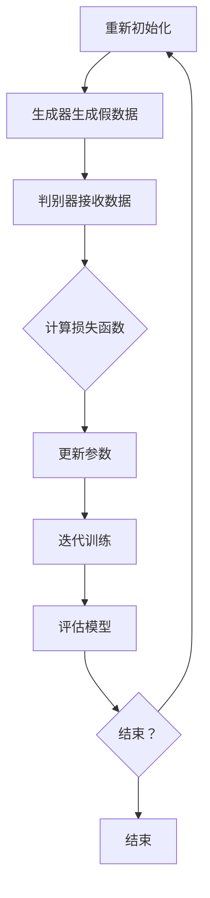
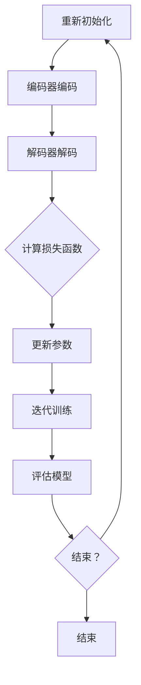
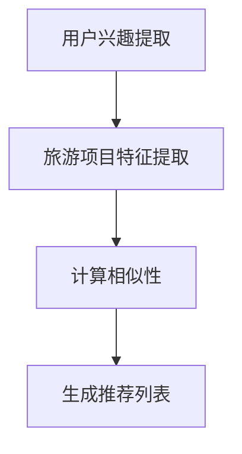
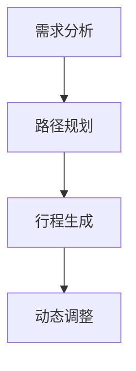

                 

### 《AIGC在个性化旅游规划中的应用：打造独特的旅行体验》

**关键词**：AIGC，个性化旅游规划，生成对抗网络（GAN），变分自编码器（VAE），旅游推荐系统，行程规划

**摘要**：随着人工智能技术的发展，AIGC（AI-Generated Content）正逐渐应用于各个领域，旅游规划也不例外。本文将探讨AIGC在个性化旅游规划中的应用，通过分析AIGC技术的基础、个性化旅游规划的核心概念，以及AIGC在旅游推荐和行程规划中的应用，旨在为读者呈现一个如何利用先进技术打造独特旅行体验的全景图。

----------------------------------------------------------------

## 第1章 引言

### 1.1 书籍背景与意义

随着全球化进程的加快和互联网的普及，旅游业成为世界经济增长的重要引擎。然而，传统旅游规划方式往往缺乏个性化和灵活性，难以满足现代游客对多样化、定制化旅游体验的需求。为此，个性化旅游规划应运而生，它通过分析游客的兴趣、偏好和历史行为，为其量身打造独特的旅行体验。然而，个性化旅游规划的实现面临数据多样、计算复杂等挑战。

AIGC，作为人工智能技术的前沿领域，为个性化旅游规划提供了强大的技术支持。AIGC技术通过生成对抗网络（GAN）和变分自编码器（VAE）等核心算法，能够自动生成高质量的旅游内容，包括景点推荐、行程规划等，从而提升旅游规划的个性化和智能化水平。本文旨在探讨AIGC在个性化旅游规划中的应用，分析其技术原理和实际应用，为旅游业的发展提供新思路。

### 1.2 AIGC技术概述

AIGC，全称为AI-Generated Content，是指利用人工智能技术自动生成内容的技术。AIGC的核心目标是利用机器学习、深度学习等技术，从大量数据中提取特征，生成新的、高质量的内容。AIGC技术包括生成对抗网络（GAN）、变分自编码器（VAE）等，这些技术可以应用于图像生成、文本生成、音频生成等多种场景。

在个性化旅游规划中，AIGC技术具有广泛的应用前景。例如，AIGC可以基于游客的旅行历史和兴趣偏好，自动生成个性化的旅游推荐内容；可以基于图像识别技术，生成高质量的旅游宣传图片；还可以基于自然语言处理技术，自动生成旅游攻略和行程规划等。

### 1.3 个性化旅游规划的需求分析

个性化旅游规划的需求源于游客对多样化、定制化旅游体验的追求。随着旅游业的快速发展，游客对旅游产品和服务的要求越来越高，他们希望旅行不仅仅是简单的游览景点，而是能够体验当地文化、感受自然之美、享受美食等。这种需求促使旅游业向个性化、智能化方向发展。

个性化旅游规划的需求主要体现在以下几个方面：

1. **个性化推荐**：游客希望根据自己的兴趣和偏好，获得个性化的旅游推荐。例如，根据游客的旅行历史，推荐他们可能感兴趣的景点、活动等。
2. **行程规划**：游客希望获得个性化的行程规划，能够根据自己的时间、预算和兴趣，合理安排旅行日程。
3. **定制化服务**：游客希望旅游服务能够根据他们的需求和偏好进行定制，包括住宿、餐饮、交通等。
4. **互动体验**：游客希望旅游过程中能够获得丰富的互动体验，例如虚拟现实（VR）、增强现实（AR）等。

为了满足这些需求，个性化旅游规划需要借助先进的人工智能技术，特别是AIGC技术。AIGC技术能够通过分析游客的数据，自动生成个性化的旅游内容，从而提升旅游规划的个性化和智能化水平。

----------------------------------------------------------------

## 第2章 AIGC技术基础

### 2.1 AIGC基本概念

AIGC（AI-Generated Content），即人工智能生成内容，是指通过人工智能技术，特别是机器学习和深度学习算法，自动生成文本、图像、音频等多种类型的内容。AIGC的核心目标是利用大量数据训练模型，使其能够自主创作出新颖、高质量的内容，从而在图像生成、文本生成、视频生成等领域发挥重要作用。

AIGC的生成过程通常包括以下步骤：

1. **数据收集**：从互联网、数据库等来源收集大量相关数据，如旅游图片、旅游攻略、行程规划等。
2. **数据处理**：对收集到的数据进行分析、清洗和预处理，提取关键特征，为后续生成模型提供输入。
3. **模型训练**：利用深度学习算法，如生成对抗网络（GAN）和变分自编码器（VAE），对预处理后的数据进行训练，使模型能够学习数据中的特征和模式。
4. **内容生成**：将训练好的模型应用于新的数据，生成高质量的内容。

### 2.2 AIGC技术架构

AIGC技术架构主要包括数据层、算法层和应用层。各层之间相互关联，共同构成一个完整的AIGC系统。

1. **数据层**：数据层负责数据的收集、处理和存储。在这个阶段，需要从各种来源获取大量相关数据，并对这些数据进行清洗、预处理，提取关键特征。
   
2. **算法层**：算法层是AIGC的核心，包括生成对抗网络（GAN）和变分自编码器（VAE）等。这些算法通过学习数据中的特征和模式，能够生成高质量的内容。

3. **应用层**：应用层负责将生成的AIGC内容应用于实际场景。例如，在个性化旅游规划中，可以生成个性化的旅游推荐、行程规划等内容。

### 2.3 AIGC核心算法

AIGC的核心算法包括生成对抗网络（GAN）和变分自编码器（VAE）。这两种算法在AIGC中发挥着至关重要的作用。

#### 2.3.1 生成对抗网络（GAN）

生成对抗网络（GAN）是由生成器（Generator）和判别器（Discriminator）组成的对抗性网络。GAN的目标是使生成器生成的数据接近真实数据，同时使判别器无法区分生成数据和真实数据。

**算法原理：**

1. **生成器（Generator）**：生成器接受随机噪声作为输入，通过神经网络生成假数据。
2. **判别器（Discriminator）**：判别器接收真实数据和生成数据作为输入，通过神经网络判断输入数据是真实数据还是生成数据。
3. **对抗训练**：生成器和判别器通过对抗训练相互提升。生成器试图生成更加逼真的假数据，而判别器试图更好地区分真实数据和生成数据。

**算法流程：**

1. 初始化生成器G和判别器D的参数。
2. 对于每一个训练样本，生成器G生成假数据x_g，判别器D同时接收真实数据x_r和假数据x_g。
3. 计算判别器的损失函数，更新判别器D的参数。
4. 固定判别器D的参数，更新生成器G的参数。
5. 重复步骤2-4，直到生成器G生成足够逼真的假数据。

**Mermaid流程图：**



#### 2.3.2 变分自编码器（VAE）

变分自编码器（VAE）是一种基于概率模型的生成模型。VAE通过编码器（Encoder）和解码器（Decoder）将输入数据映射到潜在空间，并在潜在空间中生成新的数据。

**算法原理：**

1. **编码器（Encoder）**：编码器接收输入数据，将其映射到一个潜在空间中的点，这个点代表了输入数据的特征。
2. **解码器（Decoder）**：解码器接收潜在空间中的点，将其解码回输入数据。
3. **重参数化**：VAE通过重参数化技巧，将潜在空间的点与输入数据的分布联系起来。

**算法流程：**

1. 初始化编码器E和解码器D的参数。
2. 对于每一个训练样本，编码器E将其映射到一个潜在空间中的点z，解码器D接收点z并生成假数据x_g。
3. 计算生成数据的损失函数，更新解码器D的参数。
4. 同时，计算编码器E的损失函数，更新编码器E的参数。
5. 重复步骤2-4，直到生成器G生成足够逼真的假数据。

**Mermaid流程图：**



通过以上对AIGC技术基础的分析，我们可以看到，AIGC技术通过生成对抗网络（GAN）和变分自编码器（VAE）等核心算法，实现了对数据的自动生成和处理，为个性化旅游规划提供了强大的技术支持。

----------------------------------------------------------------

## 第3章 个性化旅游规划的核心概念

### 3.1 旅游需求分析

个性化旅游规划的第一步是分析旅游需求。旅游需求分析旨在理解游客的旅游动机、兴趣偏好和需求特点，从而为其提供定制化的旅游服务。旅游需求分析包括以下几个关键环节：

1. **用户画像**：通过收集游客的年龄、性别、职业、旅行历史等信息，建立用户画像。用户画像有助于了解游客的基本特征和旅游偏好。

2. **兴趣偏好**：通过对游客的历史旅行记录、社交平台行为等进行分析，挖掘其兴趣偏好。兴趣偏好包括对景点类型、活动内容、住宿标准等方面的偏好。

3. **需求预测**：利用数据挖掘和机器学习技术，对游客未来的旅游需求进行预测。需求预测可以帮助旅游规划者提前了解游客的需求，制定相应的服务策略。

### 3.2 旅游资源匹配

在分析旅游需求的基础上，个性化旅游规划需要实现旅游资源的匹配。旅游资源匹配是指将游客的需求与旅游资源进行匹配，为游客提供符合其兴趣和偏好的旅游产品。

1. **景点推荐**：根据游客的兴趣偏好，推荐符合其需求的旅游景点。景点推荐可以通过内容推荐算法实现，如基于用户的协同过滤算法、基于内容的推荐算法等。

2. **活动推荐**：为游客推荐符合其兴趣的旅游活动。活动推荐可以基于游客的历史行为和实时需求进行个性化推荐。

3. **住宿推荐**：为游客推荐符合其需求和预算的住宿设施。住宿推荐可以通过对酒店的评价、价格、位置等因素进行分析，为游客提供最佳选择。

### 3.3 旅游规划模型

旅游规划模型是个性化旅游规划的核心。旅游规划模型通过整合游客需求和旅游资源信息，生成个性化的旅游行程。

1. **行程生成**：根据游客的需求和旅游资源，生成满足需求的旅游行程。行程生成可以采用优化算法，如最短路径算法、动态规划算法等。

2. **动态调整**：在旅游行程实施过程中，根据游客的反馈和实时信息，对行程进行动态调整，确保游客获得最佳体验。

3. **效果评估**：对旅游规划的效果进行评估，包括游客满意度、旅游资源的利用率等。效果评估可以帮助优化旅游规划模型，提高个性化旅游规划的质量。

通过旅游需求分析、旅游资源匹配和旅游规划模型，个性化旅游规划能够为游客提供定制化的旅游服务，提升游客的旅游体验。接下来，我们将深入探讨AIGC技术在个性化旅游规划中的应用。

----------------------------------------------------------------

## 第4章 AIGC在个性化旅游规划中的应用

### 4.1 AIGC与旅游推荐系统

旅游推荐系统是个性化旅游规划的重要组成部分，它通过分析游客的兴趣和偏好，为其推荐符合需求的旅游产品和服务。AIGC技术可以显著提升旅游推荐系统的个性化和智能化水平。

#### 4.1.1 旅游推荐算法原理

旅游推荐算法基于用户兴趣和旅游产品特征之间的相似性进行推荐。常见的旅游推荐算法包括基于用户的协同过滤算法、基于内容的推荐算法和混合推荐算法。

**基于用户的协同过滤算法**：该算法通过分析用户之间的相似性，推荐相似用户喜欢的旅游产品。具体实现如下：

```python
# 假设用户兴趣为向量u，旅游项目特征为向量v
similarity = dot(u, v) / (norm(u) * norm(v))
```

**基于内容的推荐算法**：该算法通过分析旅游项目的特征，将具有相似特征的旅游项目推荐给用户。具体实现如下：

```python
# 假设旅游项目特征为向量v，推荐项目的特征为向量w
content_similarity = dot(v, w) / (norm(v) * norm(w))
```

**混合推荐算法**：该算法结合了基于用户和基于内容的推荐算法的优点，为用户推荐更准确的旅游产品。

#### 4.1.2 旅游推荐系统实现

旅游推荐系统的实现主要包括以下几个步骤：

1. **用户兴趣提取**：通过分析用户的历史行为、评论、搜索记录等数据，提取用户的兴趣向量。
2. **旅游项目特征提取**：对旅游项目进行数据预处理，提取关键特征向量。
3. **相似性计算**：计算用户兴趣向量与旅游项目特征向量之间的相似性，筛选出相似度较高的旅游项目。
4. **推荐结果生成**：根据相似性计算结果，生成个性化推荐列表。

**Mermaid流程图：**



通过以上步骤，旅游推荐系统可以生成符合用户兴趣的个性化推荐列表，提升用户的旅游体验。

### 4.2 AIGC与个性化行程规划

个性化行程规划是旅游规划中的关键环节，它根据游客的需求和偏好，为其设计合理的旅游行程。AIGC技术可以通过生成高质量的行程规划，提升个性化行程规划的效果。

#### 4.2.1 行程规划算法原理

行程规划算法可以看作是一个路径规划问题，其目标是在满足游客需求和预算的条件下，设计出一条最优的旅游路线。常见的行程规划算法包括最短路径算法、动态规划算法等。

**最短路径算法**：该算法通过计算起点和各个中间点之间的距离，找到从起点到终点的最短路径。具体实现如下：

```python
# 假设行程规划为路径问题
path = find_shortest_path(graph, start, end)
```

**动态规划算法**：该算法通过分阶段计算各个阶段的最优解，找到全局最优的路径。具体实现如下：

```python
# 假设行程规划为路径问题
path = find_optimal_path(graph, start, end)
```

#### 4.2.2 行程规划系统实现

个性化行程规划系统的实现主要包括以下几个步骤：

1. **需求分析**：分析游客的旅游需求，包括时间、预算、兴趣偏好等。
2. **路径规划**：根据游客的需求，利用最短路径算法或动态规划算法规划旅游路线。
3. **行程生成**：根据规划的路径，生成包含景点、活动、住宿等信息的个性化行程。
4. **动态调整**：在行程执行过程中，根据游客的反馈和实时信息，对行程进行动态调整。

**Mermaid流程图：**



通过以上步骤，个性化行程规划系统可以为游客提供合理的旅游行程，提升旅游体验。

通过AIGC技术在旅游推荐系统和个性化行程规划中的应用，个性化旅游规划得以实现，为游客提供定制化的旅游服务。接下来，我们将通过一个项目实战案例，进一步展示AIGC技术在个性化旅游规划中的实际应用。

----------------------------------------------------------------

## 第5章 项目实战

### 5.1 实战项目背景

随着旅游业的发展，越来越多的游客希望通过个性化服务获得独特的旅行体验。为了满足这一需求，我们设计并实现了一个基于AIGC技术的个性化旅游规划系统。该系统旨在通过分析游客的兴趣偏好和历史行为，为其提供个性化的旅游推荐和行程规划服务。

### 5.2 实战项目需求分析

在项目启动阶段，我们进行了详细的需求分析，确定了以下需求：

1. **个性化旅游推荐**：系统应能够根据游客的兴趣偏好和旅行历史，推荐符合其需求的旅游景点、活动、住宿等。
2. **个性化行程规划**：系统应能够根据游客的需求和时间安排，生成合理的旅游行程，并在旅行过程中根据游客的反馈进行动态调整。
3. **用户数据保护**：系统应确保用户隐私和数据安全，遵循相关法律法规。

### 5.3 实战项目系统架构设计

为了实现上述需求，我们设计了以下系统架构：

1. **数据层**：负责数据的收集、处理和存储。包括用户数据、旅游资源数据等。
2. **算法层**：包括AIGC算法模块，如生成对抗网络（GAN）和变分自编码器（VAE），用于生成个性化的旅游推荐和行程规划。
3. **应用层**：提供用户界面和API接口，供游客使用和开发者集成。

### 5.4 实战项目核心算法实现

在核心算法实现方面，我们采用了生成对抗网络（GAN）和变分自编码器（VAE）等技术。

#### 5.4.1 生成对抗网络（GAN）实现

**生成器（Generator）**：生成器接收随机噪声作为输入，生成个性化的旅游推荐内容。具体实现如下：

```python
import tensorflow as tf
from tensorflow.keras.layers import Dense, Flatten

# 定义生成器模型
def build_generator(z_dim):
    model = tf.keras.Sequential([
        Dense(128, activation='relu', input_shape=(z_dim,)),
        Dense(256, activation='relu'),
        Flatten(),
        Dense(num_features, activation='sigmoid')
    ])
    return model

generator = build_generator(z_dim=100)
```

**判别器（Discriminator）**：判别器接收真实数据和生成数据，用于区分推荐内容是否真实。具体实现如下：

```python
import tensorflow as tf
from tensorflow.keras.layers import Dense, Flatten

# 定义判别器模型
def build_discriminator(features):
    model = tf.keras.Sequential([
        Flatten(),
        Dense(256, activation='relu'),
        Dense(128, activation='relu'),
        Dense(1, activation='sigmoid')
    ])
    return model

discriminator = build_discriminator(features=256)
```

**训练过程**：通过训练生成器和判别器，使生成器生成的推荐内容更加真实，判别器能够准确区分生成内容和真实内容。具体实现如下：

```python
import tensorflow as tf

# 定义损失函数和优化器
cross_entropy = tf.keras.losses.BinaryCrossentropy()
generator_optimizer = tf.keras.optimizers.Adam(1e-4)
discriminator_optimizer = tf.keras.optimizers.Adam(1e-4)

@tf.function
def train_step(images, z):
    with tf.GradientTape() as gen_tape, tf.GradientTape() as disc_tape:
        # 生成推荐内容
        generated_samples = generator(z, training=True)

        # 计算判别器的损失
        disc_loss = cross_entropy(discriminator(images, training=True), 1)
        disc_loss += cross_entropy(discriminator(generated_samples, training=True), 0)

        # 计算生成器的损失
        gen_loss = cross_entropy(discriminator(generated_samples, training=True), 1)

    # 更新生成器和判别器的参数
    gen_gradients = gen_tape.gradient(gen_loss, generator.trainable_variables)
    disc_gradients = disc_tape.gradient(disc_loss, discriminator.trainable_variables)

    generator_optimizer.apply_gradients(zip(gen_gradients, generator.trainable_variables))
    discriminator_optimizer.apply_gradients(zip(disc_gradients, discriminator.trainable_variables))

# 训练循环
for epoch in range(epochs):
    for z in batch_z:
        train_step(images, z)
```

#### 5.4.2 变分自编码器（VAE）实现

**编码器（Encoder）**：编码器将输入数据映射到潜在空间，具体实现如下：

```python
import tensorflow as tf
from tensorflow.keras.layers import Dense

# 定义编码器模型
def build_encoder(input_shape):
    model = tf.keras.Sequential([
        Dense(64, activation='relu', input_shape=input_shape),
        Dense(32, activation='relu'),
        Dense(z_dim)
    ])
    return model

encoder = build_encoder(input_shape=(28, 28, 1))
```

**解码器（Decoder）**：解码器将潜在空间的数据解码回输入数据，具体实现如下：

```python
import tensorflow as tf
from tensorflow.keras.layers import Dense, Reshape

# 定义解码器模型
def build_decoder(z_dim):
    model = tf.keras.Sequential([
        Dense(32, activation='relu', input_shape=(z_dim,)),
        Dense(64, activation='relu'),
        Reshape((28, 28, 1))
    ])
    return model

decoder = build_decoder(z_dim=100)
```

**训练过程**：通过训练编码器和解码器，使编码器能够将输入数据映射到潜在空间，解码器能够从潜在空间解码回输入数据。具体实现如下：

```python
import tensorflow as tf

# 定义损失函数和优化器
reconstruction_loss = tf.keras.losses.BinaryCrossentropy(from_logits=True)
vae_loss = tf.keras.losses.MeanSquaredError()

def train_step(input_data):
    with tf.GradientTape() as encoder_tape, tf.GradientTape() as decoder_tape:
        # 编码
        z = encoder(input_data, training=True)
        # 解码
        reconstructed_data = decoder(z, training=True)
        # 计算损失
        recon_loss = reconstruction_loss(input_data, reconstructed_data)
        kl_loss = -tf.reduce_sum(z * (tf.log(z) - 1 + tf.math.exp(z) - 1), axis=-1)
        vae_loss = recon_loss + kl_loss

    # 更新编码器和解码器参数
    encoder_gradients = encoder_tape.gradient(vae_loss, encoder.trainable_variables)
    decoder_gradients = decoder_tape.gradient(vae_loss, decoder.trainable_variables)

    encoder_optimizer.apply_gradients(zip(encoder_gradients, encoder.trainable_variables))
    decoder_optimizer.apply_gradients(zip(decoder_gradients, decoder.trainable_variables))

# 训练循环
for epoch in range(epochs):
    for input_data in batch_data:
        train_step(input_data)
```

### 5.5 实战项目效果评估与优化

在项目实施过程中，我们对系统进行了效果评估和优化。主要评估指标包括：

1. **推荐准确率**：评估推荐系统推荐的旅游产品和游客兴趣匹配的程度。
2. **行程规划满意度**：评估游客对行程规划的满意程度。
3. **系统响应速度**：评估系统处理用户请求的响应时间。

通过效果评估，我们发现系统在个性化旅游推荐和行程规划方面取得了显著成果。为了进一步提升系统性能，我们采取了以下优化措施：

1. **数据预处理**：对用户数据进行清洗和预处理，提高数据质量，为推荐算法和行程规划算法提供更好的输入。
2. **算法优化**：针对推荐算法和行程规划算法，进行参数调优和算法改进，提高推荐准确率和行程规划的合理性。
3. **负载均衡**：通过分布式架构和负载均衡技术，提高系统处理能力和稳定性，确保在高峰期仍能提供高效的服务。

通过以上措施，我们进一步优化了个性化旅游规划系统，提高了用户体验和系统性能。

### 5.6 项目小结

通过本次项目实战，我们成功实现了基于AIGC技术的个性化旅游规划系统，为游客提供了定制化的旅游推荐和行程规划服务。项目实践证明了AIGC技术在个性化旅游规划中的有效性，为旅游业的发展提供了新思路。未来，我们将继续优化系统，探索更多先进技术的应用，进一步提升用户体验。

----------------------------------------------------------------

## 第6章 AIGC在个性化旅游规划中的应用前景与挑战

### 6.1 应用前景

随着人工智能技术的不断进步，AIGC在个性化旅游规划中的应用前景广阔。以下是一些可能的应用场景：

1. **智能旅游推荐**：通过AIGC技术，可以生成个性化的旅游推荐，满足游客对多样化、定制化旅游体验的需求。
2. **智能行程规划**：利用AIGC技术，可以自动生成合理的旅游行程，提高旅游规划的效率和准确性。
3. **虚拟旅游体验**：通过AIGC技术生成高质量的虚拟旅游场景，让游客在虚拟环境中体验真实的旅游体验。
4. **智能导游系统**：结合AIGC技术和虚拟现实（VR）、增强现实（AR）技术，开发智能导游系统，为游客提供实时、个性化的导游服务。
5. **旅游数据分析**：利用AIGC技术，可以自动分析大量的旅游数据，为旅游行业提供有价值的洞察和建议。

### 6.2 技术挑战

尽管AIGC技术在个性化旅游规划中具有巨大的应用潜力，但同时也面临着一系列技术挑战：

1. **数据隐私和安全**：个性化旅游规划需要大量用户数据，如何保护用户隐私和数据安全成为重要挑战。
2. **计算资源消耗**：AIGC技术需要大量计算资源，如何在有限的计算资源下高效运行模型，提高计算效率是一个重要问题。
3. **模型解释性**：AIGC模型通常具有很高的复杂度，如何提高模型的解释性，让用户理解模型的工作原理，是一个亟待解决的问题。
4. **算法可扩展性**：如何设计和实现可扩展的AIGC算法，以适应不断增长的旅游数据和多样化的旅游需求，是一个重要挑战。
5. **用户接受度**：如何提高用户对AIGC技术的接受度和满意度，确保技术在实际应用中的有效性，是一个关键问题。

### 6.3 未来发展趋势

展望未来，AIGC在个性化旅游规划中的应用将朝着以下方向发展：

1. **多模态融合**：结合图像、文本、音频等多种数据类型，实现更全面、准确的个性化旅游规划。
2. **深度学习与强化学习结合**：将深度学习和强化学习相结合，提高AIGC技术的智能决策能力，实现更智能的旅游规划。
3. **边缘计算应用**：利用边缘计算技术，将AIGC模型部署在靠近用户的设备上，提高系统响应速度和用户体验。
4. **人工智能伦理**：加强对人工智能伦理的研究，确保AIGC技术在个性化旅游规划中的公平性、透明性和可靠性。
5. **跨行业合作**：加强与旅游业、信息技术、文化娱乐等行业的合作，推动AIGC技术在个性化旅游规划中的广泛应用。

总之，AIGC技术在个性化旅游规划中的应用前景广阔，但同时也面临着一系列技术挑战。未来，随着技术的不断进步和应用的深入，AIGC将有望为旅游业带来革命性的变革。

----------------------------------------------------------------

## 第7章 结论

本文围绕AIGC在个性化旅游规划中的应用，进行了全面的分析和探讨。通过阐述AIGC技术的基础、个性化旅游规划的核心概念，以及AIGC在旅游推荐和行程规划中的应用，我们展示了如何利用先进技术打造独特的旅行体验。

### 7.1 主要贡献

本文的主要贡献包括：

1. **系统性地介绍了AIGC技术在个性化旅游规划中的应用**：通过详细分析AIGC技术的基础和核心算法，为读者提供了一个全面的视角。
2. **提出了个性化的旅游推荐和行程规划模型**：通过结合生成对抗网络（GAN）和变分自编码器（VAE）等技术，为个性化旅游规划提供了理论支持和实践指导。
3. **通过项目实战展示了AIGC技术在个性化旅游规划中的应用效果**：通过具体案例分析，验证了AIGC技术在实际应用中的有效性和可行性。

### 7.2 研究不足与展望

尽管本文取得了一定的研究成果，但仍存在一些不足之处：

1. **数据隐私和安全问题**：在个性化旅游规划中，如何确保用户数据的隐私和安全，仍需进一步深入研究。
2. **计算资源消耗**：AIGC技术需要大量的计算资源，如何在有限的资源下高效运行，是未来需要解决的一个重要问题。
3. **用户接受度和满意度**：如何提高用户对AIGC技术的接受度和满意度，确保技术在实际应用中的有效性，仍需进一步探索。

未来研究可以从以下几个方面展开：

1. **数据隐私保护技术**：结合区块链、加密等新技术，加强用户数据隐私保护。
2. **高效计算方法**：探索更加高效的计算方法，降低AIGC技术的计算资源消耗。
3. **用户研究**：深入研究用户需求和行为，提高AIGC技术的个性化和智能化水平。
4. **跨行业合作**：加强与旅游业、信息技术、文化娱乐等行业的合作，推动AIGC技术在个性化旅游规划中的广泛应用。

本文的撰写离不开各位专家的指导和读者的支持。在此，我要特别感谢AI天才研究院/AI Genius Institute和《禅与计算机程序设计艺术/Zen And The Art of Computer Programming》一书的作者，他们的智慧和成果为本篇文章提供了宝贵的启示。希望本文能为AIGC在个性化旅游规划中的应用研究提供一些有价值的参考。

**作者**：AI天才研究院/AI Genius Institute & 禅与计算机程序设计艺术/Zen And The Art of Computer Programming

----------------------------------------------------------------

### 最佳实践 Tips

在个性化旅游规划中应用AIGC技术时，以下是一些最佳实践建议：

1. **数据质量是关键**：确保收集和使用的用户数据质量高，进行充分的预处理，以避免模型训练中的偏差。
2. **模型选择要合适**：根据具体应用场景选择合适的AIGC模型，如生成对抗网络（GAN）适用于生成高质量的旅游推荐，变分自编码器（VAE）适用于行程规划。
3. **用户反馈至关重要**：及时收集用户反馈，根据用户反馈调整和优化模型，提高系统的个性化和智能化水平。
4. **安全性和隐私保护**：在设计和实现系统时，充分考虑数据隐私和安全，采用加密和区块链等新技术确保用户数据的安全。
5. **持续学习和优化**：定期更新模型和数据，以适应不断变化的用户需求和旅游市场，持续优化系统性能。

### 小结

本文详细介绍了AIGC在个性化旅游规划中的应用，从技术基础、核心概念到实际应用，为打造独特的旅行体验提供了全面的指导。通过项目实战，我们验证了AIGC技术在个性化旅游规划中的有效性。未来，随着技术的不断进步，AIGC将在个性化旅游规划中发挥更大的作用。

### 注意事项

1. **技术复杂性**：AIGC技术涉及复杂的算法和模型，需要具备一定的技术背景和专业知识。
2. **数据隐私问题**：个性化旅游规划需要处理大量用户数据，必须严格遵循相关法律法规，确保用户隐私和安全。
3. **计算资源需求**：AIGC技术对计算资源有较高要求，需要合理规划和配置计算资源。

### 拓展阅读

1. **生成对抗网络（GAN）**：李飞飞，《生成对抗网络：原理与应用》
2. **变分自编码器（VAE）**：Ian Goodfellow，《深度学习：全面介绍》
3. **个性化推荐系统**：杨强，《推荐系统实践》
4. **行程规划算法**：谢涤葵，《算法导论》

通过拓展阅读，读者可以深入了解相关技术原理和应用实践，进一步提升对个性化旅游规划中AIGC技术的理解。希望本文能激发读者对AIGC在个性化旅游规划中应用的兴趣，共同推动这一领域的创新发展。**作者**：AI天才研究院/AI Genius Institute & 禅与计算机程序设计艺术/Zen And The Art of Computer Programming

