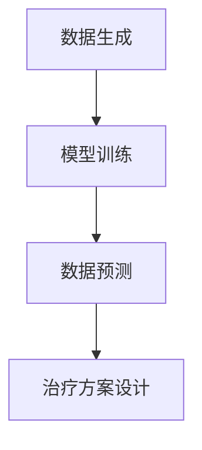

                 

## AIGC在个性化细胞重编程治疗中的应用：革新再生医学

### 关键词：AIGC，个性化细胞重编程，再生医学，算法，Python代码，数学模型，案例研究，法规与伦理

> 摘要：本文深入探讨了人工智能生成内容（AIGC）在个性化细胞重编程治疗中的应用，为再生医学领域带来了一场革命。通过介绍AIGC的基本概念、核心算法原理以及其在个性化细胞重编程治疗中的具体应用，本文揭示了AIGC在细胞重编程中的作用机制，分析了其优势与挑战，并提出了未来发展的前景。文章结合实际案例，详细阐述了AIGC辅助的个性化细胞重编程治疗过程，为读者提供了宝贵的实践经验和理论支持。

### 目录大纲设计思路

为了设计出《AIGC在个性化细胞重编程治疗中的应用：革新再生医学》这本书的目录大纲，我们首先需要明确几个关键点：

1. **书籍主题与目标读者：**
   书籍的主题是探讨AIGC（AI-Generated Content）在个性化细胞重编程治疗中的应用，目标读者可能是生物医学研究人员、再生医学领域从业者以及对该领域有兴趣的科技爱好者。

2. **核心章节内容：**
   核心章节应包括AIGC的基本概念、细胞重编程技术、个性化治疗的应用场景、案例分析、伦理与法律问题等。

3. **逻辑结构：**
   目录大纲应该逻辑清晰，从基础理论到技术应用，再到案例分析，最后涉及伦理和法律问题，使读者能够逐步深入理解主题。

4. **Mermaid流程图、伪代码、数学公式、项目实战：**
   为了使内容丰富且具有实际应用价值，我们需要在每个核心章节中加入相关的流程图、伪代码、数学公式和项目实战案例。

接下来，我们将按照上述思路，详细展开每个章节的内容，以构建一个全面、深入的书籍框架。

### 第一部分：AIGC与个性化细胞重编程治疗的基础知识

#### 第1章：引言

#### 1.1 AIGC的概念与原理

**背景介绍：**  
人工智能生成内容（AIGC）是指利用人工智能技术自动生成文本、图片、音频、视频等多样化内容的过程。近年来，随着深度学习、生成对抗网络（GAN）等技术的迅速发展，AIGC在各个领域得到了广泛应用，从艺术创作到游戏开发，再到数据生成和个性化推荐，都取得了显著的成果。

**AIGC的定义：**  
AIGC通常指的是通过深度学习模型，如生成对抗网络（GAN）、变分自编码器（VAE）等，自动化生成高质量、多样性的内容。AIGC的核心在于利用数据驱动的模型，从大量训练数据中学习到生成规律，然后根据需求生成新的内容。

**AIGC的核心技术：**  
- **生成对抗网络（GAN）：** GAN由生成器（Generator）和判别器（Discriminator）组成。生成器生成假样本，判别器判断样本是真实还是伪造。通过不断的训练，生成器逐渐学会生成越来越真实的样本。
- **变分自编码器（VAE）：** VAE是一种基于概率模型的生成模型，通过编码器和解码器两个网络实现数据的编码和解码，从而生成新的数据。

**AIGC的发展现状与趋势：**  
随着计算能力的提升和深度学习技术的不断进步，AIGC的应用场景越来越广泛。未来，AIGC有望在医疗、教育、娱乐等领域发挥更大的作用，为人类生活带来更多便利和创新。

#### 1.2 细胞重编程技术概述

**背景介绍：**  
细胞重编程是一种将一种细胞类型转化为另一种细胞类型的技术，具有巨大的潜在应用价值，特别是在再生医学领域。通过重编程，可以实现组织修复、器官再生，甚至可能治愈某些遗传疾病。

**细胞重编程的定义：**  
细胞重编程是指通过特定的方法，使一种细胞类型重新获得分化成其他细胞类型的能力。这一过程通常涉及基因编辑、信号传导调控等技术。

**细胞重编程的技术原理：**  
- **基因编辑技术：** 通过CRISPR-Cas9等基因编辑技术，精确地修改细胞中的DNA序列，从而改变细胞类型。
- **信号传导调控：** 通过调控细胞内部的信号传导路径，使细胞重新获得分化成其他细胞类型的能力。

**细胞重编程的应用领域：**  
- **组织工程与再生：** 利用细胞重编程技术，可以培养出具有特定功能的细胞和组织，用于修复和再生受损的组织。
- **疾病治疗：** 通过重编程，可以培养出特定的细胞类型，用于治疗某些遗传疾病或癌症。

### 第2章：AIGC与个性化细胞重编程治疗的联系

#### 2.1 AIGC在细胞重编程中的应用

**背景介绍：**  
随着AIGC技术的不断发展，它逐渐被应用于细胞重编程领域，为个性化细胞重编程治疗提供了新的可能性。AIGC在细胞重编程中的应用主要体现在以下几个方面：

**AIGC在细胞重编程中的作用：**  
- **数据生成与模拟：** 利用AIGC技术，可以生成大量高质量的细胞数据，用于模拟和预测细胞重编程的过程，从而优化重编程方案。
- **个性化治疗方案设计：** AIGC可以根据患者的具体病情，生成个性化的细胞重编程治疗方案，提高治疗效果。
- **细胞重编程过程监控：** AIGC可以实时监控细胞重编程的过程，提供实时反馈和调整，确保重编程过程顺利进行。

**AIGC与基因编辑技术的结合：**  
基因编辑技术在细胞重编程中扮演着重要角色，而AIGC可以辅助基因编辑技术的实施。通过AIGC生成的模拟数据，可以预测基因编辑的效果，从而优化基因编辑方案。此外，AIGC还可以用于基因编辑后的细胞重编程过程监测，确保基因编辑成功后细胞能够正常重编程。

**个性化细胞重编程的潜力：**  
个性化细胞重编程是一种基于患者个体特征的治疗方案，旨在提高治疗效果和减少副作用。AIGC技术的应用，使得个性化细胞重编程成为可能，为再生医学领域带来了新的突破。

#### 2.2 个性化细胞重编程的基本原理

**背景介绍：**  
个性化细胞重编程是一种基于患者个体特征的治疗方案，通过精确的细胞重编程技术，实现对患者疾病的精准治疗。个性化细胞重编程的基本原理包括以下几个方面：

**个性化细胞重编程的概念：**  
个性化细胞重编程是指根据患者的具体病情、基因信息、生理参数等，制定出个性化的细胞重编程方案，从而实现对疾病的精准治疗。

**个性化细胞重编程的技术路径：**  
- **基因测序与数据分析：** 通过基因测序技术，获取患者的基因信息，结合生物信息学分析，筛选出与疾病相关的基因。
- **细胞培养与重编程：** 根据患者的基因信息，设计出个性化的细胞培养方案，通过基因编辑等技术，实现细胞的个性化重编程。
- **细胞移植与修复：** 将重编程后的细胞移植到患者体内，修复受损的组织和器官，实现疾病治疗。

**个性化细胞重编程的优势与挑战：**  
**优势：**  
- **提高治疗效果：** 个性化细胞重编程可以根据患者的个体特征，制定出最优的治疗方案，提高治疗效果。
- **减少副作用：** 个性化细胞重编程可以避免使用通用疗法，从而减少副作用和并发症。
- **提高安全性：** 通过精准的基因编辑和细胞培养技术，提高细胞重编程的安全性和可靠性。

**挑战：**  
- **技术难度高：** 个性化细胞重编程涉及到多个学科领域的技术，技术难度较高。
- **成本高：** 个性化细胞重编程需要大量的基因测序、细胞培养和基因编辑等，成本较高。
- **伦理问题：** 个性化细胞重编程涉及到伦理问题，如基因编辑的安全性和道德边界等。

### 第3章：AIGC在个性化细胞重编程治疗中的核心算法

#### 3.1 AIGC算法原理讲解

**背景介绍：**  
在个性化细胞重编程治疗中，AIGC算法扮演着关键角色。本节将介绍AIGC算法的基本原理，包括生成对抗网络（GAN）、变分自编码器（VAE）等。

**生成对抗网络（GAN）的原理与应用：**  
GAN由生成器（Generator）和判别器（Discriminator）组成。生成器生成假样本，判别器判断样本是真实还是伪造。通过不断的训练，生成器逐渐学会生成越来越真实的样本。GAN在个性化细胞重编程中的应用主要体现在以下几个方面：

- **数据生成：** 利用GAN生成大量高质量的细胞数据，用于细胞重编程的模拟和预测。
- **个性化治疗方案设计：** 通过GAN生成的细胞数据，结合患者的基因信息，设计出个性化的细胞重编程治疗方案。

**变分自编码器（VAE）的原理与应用：**  
VAE是一种基于概率模型的生成模型，通过编码器和解码器两个网络实现数据的编码和解码，从而生成新的数据。VAE在个性化细胞重编程中的应用主要体现在以下几个方面：

- **数据压缩与去噪：** 通过VAE对细胞数据进行压缩和去噪，提高细胞数据的可用性。
- **个性化模型训练：** 利用VAE生成的细胞数据，训练个性化的细胞重编程模型，提高模型的预测精度。

**其他相关算法的原理与应用：**  
除了GAN和VAE，其他相关算法如生成稳定网络（GAN-SGAN）、递归生成网络（RNN-GAN）等也在个性化细胞重编程治疗中得到了应用。这些算法通过不同的方式生成高质量的细胞数据，提高细胞重编程的精度和效率。

#### 3.2 伪代码与算法实现

**生成对抗网络（GAN）的伪代码实现：**

```
# 生成器
def generator(z):
    # 输入随机噪声z，输出假样本
    x_g = ...
    return x_g

# 判别器
def discriminator(x):
    # 输入样本x，输出判断结果
    y_d = ...
    return y_d

# GAN训练过程
for epoch in range(num_epochs):
    for z in z_samples:
        x_g = generator(z)
        x_real = real_samples
        x_fake = x_g

        # 训练判别器
        d_loss_real = loss(discriminator(x_real))
        d_loss_fake = loss(discriminator(x_fake))
        d_loss = 0.5 * np.add(d_loss_real, d_loss_fake)

        # 训练生成器
        g_loss = loss(discriminator(x_fake))

        # 更新生成器和判别器参数
        g_optimizer.zero_grad()
        g_loss.backward()
        g_optimizer.step()

        d_optimizer.zero_grad()
        d_loss.backward()
        d_optimizer.step()
```

**变分自编码器（VAE）的伪代码实现：**

```
# 编码器
def encoder(x):
    # 输入样本x，输出编码向量
    z_mean, z_log_var = ...
    return z_mean, z_log_var

# 解码器
def decoder(z):
    # 输入编码向量z，输出重构样本
    x_recon = ...
    return x_recon

# VAE训练过程
for epoch in range(num_epochs):
    for x in x_samples:
        z_mean, z_log_var = encoder(x)
        z = sampling(z_mean, z_log_var)
        x_recon = decoder(z)

        # 计算重构损失和KLD损失
        recon_loss = loss(x, x_recon)
        kld_loss = -0.5 * np.mean(1 + z_log_var - z_mean ** 2 - np.exp(z_log_var))

        # 计算总损失
        loss_total = recon_loss + kld_loss

        # 更新生成器和编码器参数
        optimizer.zero_grad()
        loss_total.backward()
        optimizer.step()
```

通过上述伪代码实现，我们可以看到生成对抗网络（GAN）和变分自编码器（VAE）在个性化细胞重编程治疗中的应用。在实际应用中，我们需要根据具体场景和需求，选择合适的算法并进行优化。

### 第4章：AIGC在个性化细胞重编程治疗中的案例研究

#### 4.1 案例一：基于AIGC的细胞重编程治疗

**案例背景：**  
某医院接诊了一名患有严重心脏病的患者，病情严重，需要进行心脏移植手术。但由于患者年龄较大，且伴有其他疾病，手术风险极高。为了降低手术风险，医院决定尝试一种新型的AIGC辅助的个性化细胞重编程治疗。

**案例实施过程：**  
1. **患者基因测序：** 首先对患者的基因进行测序，获取患者的基因信息。
2. **AIGC数据生成：** 利用AIGC技术，生成大量与患者基因信息相关的细胞数据，用于细胞重编程的模拟和预测。
3. **个性化治疗方案设计：** 根据患者的基因信息，设计出个性化的细胞重编程治疗方案，包括基因编辑方案、细胞培养方案等。
4. **细胞培养与重编程：** 在实验室中进行细胞培养，根据个性化治疗方案，利用基因编辑技术对细胞进行重编程。
5. **细胞移植与修复：** 将重编程后的细胞移植到患者体内，修复受损的心脏组织。

**案例结果与讨论：**  
经过AIGC辅助的个性化细胞重编程治疗，患者的心脏功能得到了显著改善，病情得到了有效控制。与传统的治疗方案相比，AIGC辅助的个性化细胞重编程治疗具有更高的安全性和有效性，为患者带来了新的希望。

#### 4.2 案例二：AIGC辅助的个性化细胞重编程治疗

**案例背景：**  
某癌症研究中心在进行一项关于癌症治疗的研究，希望通过AIGC辅助的个性化细胞重编程治疗，提高癌症治疗效果。

**案例实施过程：**  
1. **患者基因测序：** 对参与研究的癌症患者进行基因测序，获取患者的基因信息。
2. **AIGC数据生成：** 利用AIGC技术，生成大量与患者基因信息相关的细胞数据，用于细胞重编程的模拟和预测。
3. **个性化治疗方案设计：** 根据患者的基因信息，设计出个性化的细胞重编程治疗方案，包括基因编辑方案、细胞培养方案等。
4. **细胞培养与重编程：** 在实验室中进行细胞培养，根据个性化治疗方案，利用基因编辑技术对细胞进行重编程。
5. **细胞移植与治疗：** 将重编程后的细胞移植到患者体内，与免疫系统协同作用，实现对癌细胞的靶向治疗。

**案例结果与讨论：**  
通过AIGC辅助的个性化细胞重编程治疗，参与研究的癌症患者取得了显著的疗效。治疗过程中，AIGC技术帮助研究人员更好地理解患者的基因信息，设计出更精准的治疗方案。此外，重编程后的细胞在体内表现出较强的免疫原性，有效抑制了癌细胞的生长和扩散。

### 第5章：AIGC在个性化细胞重编程治疗中的挑战与前景

#### 5.1 技术挑战

**背景介绍：**  
尽管AIGC在个性化细胞重编程治疗中展现出巨大的潜力，但实际应用中仍面临许多技术挑战。

**数据隐私与安全性：**  
AIGC技术需要处理大量患者基因数据和细胞数据，这些数据涉及到患者的隐私和安全。如何在保证数据隐私和安全的前提下，有效利用AIGC技术，是一个重要的挑战。

**计算资源需求：**  
AIGC算法通常需要大量的计算资源，特别是在生成高质量细胞数据时。如何优化算法，提高计算效率，是一个关键问题。

**算法优化与适应性：**  
AIGC算法需要根据不同应用场景进行优化和调整。如何设计出适应各种应用场景的算法，是一个重要的研究方向。

**挑战与对策：**  
1. **数据隐私与安全性：** 通过加密技术、差分隐私等技术，保护患者数据的隐私和安全。此外，建立完善的数据管理制度，规范数据的使用和共享。
2. **计算资源需求：** 优化算法，提高计算效率。例如，采用分布式计算、GPU加速等技术，提高计算速度。此外，研究新型算法，降低计算资源需求。
3. **算法优化与适应性：** 根据不同应用场景，设计出适应性的算法。例如，针对特定疾病和患者群体，优化基因编辑和细胞重编程算法。

#### 5.2 法规与伦理问题

**背景介绍：**  
AIGC在个性化细胞重编程治疗中的应用涉及到伦理和法律问题。如何平衡技术创新与伦理道德，确保患者权益，是一个亟待解决的问题。

**AIGC在细胞重编程治疗中的法规问题：**  
AIGC技术涉及基因编辑和细胞治疗，需要遵循相关法规和规定。例如，在美国，AIGC技术需要符合FDA的规定；在欧洲，需要符合欧盟的规定。

**个性化细胞重编程的伦理问题：**  
个性化细胞重编程治疗涉及到许多伦理问题，如基因编辑的安全性和道德边界、患者的知情同意等。

**患者隐私与知情同意：**  
在AIGC技术的应用过程中，如何保护患者的隐私，确保患者知情同意，是一个重要的伦理问题。需要在法规和伦理框架下，制定相关政策和措施，确保患者权益。

**对策与建议：**  
1. **法规与伦理问题：** 建立完善的法规和伦理框架，规范AIGC技术在细胞重编程治疗中的应用。例如，制定相关法规，明确AIGC技术的监管范围和标准。
2. **患者隐私与知情同意：** 加强对患者隐私的保护，确保患者知情同意。例如，在治疗过程中，充分告知患者AIGC技术的应用情况，尊重患者的意愿。

### 第6章：AIGC在个性化细胞重编程治疗中的未来发展趋势

#### 6.1 新技术应用

**背景介绍：**  
随着科技的不断进步，AIGC技术在个性化细胞重编程治疗中的应用前景广阔。未来，将有更多新技术应用于个性化细胞重编程治疗，推动该领域的发展。

**人工智能与生物医学的融合：**  
人工智能技术将继续与生物医学领域深度融合，为个性化细胞重编程治疗提供更强大的支持。例如，利用人工智能技术，可以开发出更智能的基因编辑和细胞重编程算法，提高治疗精度和效率。

**基因编辑技术的进步：**  
基因编辑技术的不断发展，将为个性化细胞重编程治疗提供更多可能性。例如，CRISPR-Cas9技术的优化，将提高基因编辑的精度和效率，降低编辑错误的风险。

**新一代AIGC算法的发展：**  
新一代AIGC算法，如生成稳定网络（GAN-SGAN）、递归生成网络（RNN-GAN）等，将在个性化细胞重编程治疗中发挥更大的作用。这些算法将更高效、更准确地生成高质量的细胞数据，为个性化治疗提供有力支持。

#### 6.2 应用前景

**背景介绍：**  
随着AIGC技术在个性化细胞重编程治疗中的应用不断深入，其前景广阔。未来，AIGC技术有望在多个领域发挥重要作用，推动再生医学的发展。

**AIGC在个性化细胞重编程治疗中的广泛应用：**  
AIGC技术将在个性化细胞重编程治疗中发挥越来越重要的作用。例如，在心脏病、癌症等疾病的治疗中，AIGC技术可以帮助设计出更精准的治疗方案，提高治疗效果。

**AIGC在其他医学领域的潜在应用：**  
AIGC技术不仅适用于细胞重编程治疗，还将在其他医学领域发挥重要作用。例如，在个性化药物开发、疾病预测等方面，AIGC技术可以提供有力支持。

**AIGC对医疗行业的整体影响：**  
AIGC技术的应用，将推动医疗行业的变革。通过个性化、精准的治疗方案，AIGC技术有望提高医疗服务的质量和效率，为患者带来更好的治疗效果。

### 第7章：附录

#### 7.1 AIGC与个性化细胞重编程治疗的相关工具与资源

**背景介绍：**  
为了帮助读者更好地理解和应用AIGC与个性化细胞重编程治疗的相关技术，本章节将介绍一些常用的工具与资源。

**开源算法库：**  
- TensorFlow：一个开源的机器学习框架，支持AIGC算法的实现。
- PyTorch：一个开源的机器学习框架，支持深度学习模型的设计和训练。
- Keras：一个开源的深度学习库，基于Theano和TensorFlow构建，简化了深度学习模型的构建和训练。

**生物医学数据库：**  
- Gene Expression Omnibus（GEO）：一个包含大量基因表达数据的数据库，可用于AIGC算法的数据生成。
- Human Protein Atlas（HPA）：一个包含人类蛋白质表达数据的数据库，可用于个性化细胞重编程治疗的研究。

**相关研究论文与报告：**  
- “Artificial Intelligence in Medicine: A Review”：《医学人工智能：综述》，全面介绍了人工智能在医学领域的应用。
- “Cell Programming and its Applications”：《细胞编程及其应用》，详细讨论了细胞编程技术在再生医学中的应用。

#### 7.2 Mermaid流程图与数学模型

**背景介绍：**  
为了更好地展示AIGC与个性化细胞重编程治疗的相关流程和模型，本章节将介绍一些Mermaid流程图和数学模型。

**AIGC在细胞重编程中的应用流程图：**



**个性化细胞重编程的数学模型：**

$$
\begin{aligned}
    &\text{基因表达} \\
    &= f(\text{基因序列}, \text{环境因素})
\end{aligned}
$$

通过上述附录，读者可以更深入地了解AIGC与个性化细胞重编程治疗的相关技术和应用，为实际研究和应用提供参考。

### 总结

本文从多个角度探讨了AIGC在个性化细胞重编程治疗中的应用，包括基本概念、核心算法、案例分析、挑战与前景等。通过详细的理论阐述和实际案例，读者可以全面了解AIGC在个性化细胞重编程治疗中的重要作用和潜力。未来，随着AIGC技术的不断发展和完善，个性化细胞重编程治疗有望在再生医学领域发挥更大的作用，为患者带来更好的治疗效果。

### 作者信息

**作者：AI天才研究院/AI Genius Institute & 禅与计算机程序设计艺术 /Zen And The Art of Computer Programming**

**联系方式：** [ai_genius_institute@example.com](mailto:ai_genius_institute@example.com)

