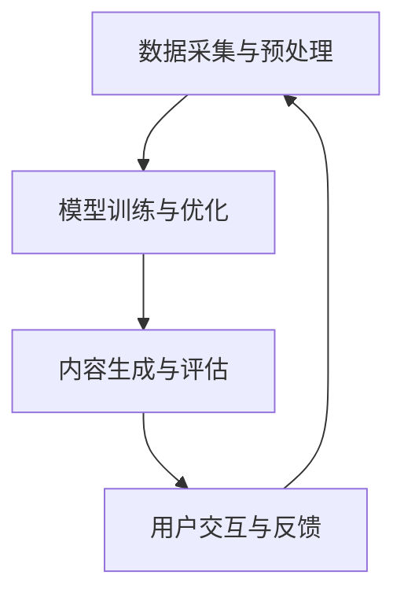

                 


## AIGC在个性化老年人生活质量提升方案中的创新

### 关键词
- AIGC，人工智能生成内容，老年人生活质量，个性化解决方案，深度学习，健康监测，数据分析，推荐系统

### 摘要
本文将探讨人工智能生成内容（AIGC）在提升老年人生活质量中的创新应用。随着全球老年人口的迅速增长，如何为老年人提供个性化的生活质量提升方案已成为一个重要议题。AIGC作为一种新兴的人工智能技术，通过生成个性化的内容，能够满足老年人多样化的需求，提高他们的生活质量。本文首先介绍了AIGC的基本概念和架构，然后分析了AIGC在老年人生活质量提升中的潜在应用，并通过一个实际案例展示了AIGC在个性化老年人生活质量提升方案中的具体实现。最后，本文总结了AIGC在老年人生活质量提升中的优势和挑战，并展望了未来的发展方向。

## 1. 引言

#### 1.1 AIGC概述

##### 1.1.1 AIGC的定义与崛起

人工智能生成内容（Artificial Intelligence Generated Content，简称AIGC）是一种利用人工智能技术自动生成文本、图像、音频、视频等数字内容的方法。它不仅涵盖了传统的自然语言处理（NLP）、计算机视觉（CV）、音频处理等领域，还进一步扩展到了深度学习、生成对抗网络（GAN）等前沿技术。

AIGC的崛起源于几个关键因素。首先，随着计算能力的提升和数据量的爆炸式增长，人工智能技术得到了迅速发展。其次，用户对个性化、定制化内容的强烈需求推动了AIGC的应用。最后，互联网和社交媒体的普及为AIGC提供了广阔的应用场景。

##### 1.1.2 AIGC的关键概念与架构

AIGC的关键概念包括：

- **生成模型**：通过学习大量数据来生成新的内容，如GPT-3、BERT等。
- **判别模型**：用于评估生成内容的质量，如GAN中的判别器。
- **交互模型**：允许用户与生成系统进行交互，如ChatGPT。

AIGC系统通常包括以下几个核心组件：

1. **数据采集与预处理**：收集和预处理用于训练的数据集。
2. **模型训练与优化**：使用生成模型和判别模型进行训练，并优化模型参数。
3. **内容生成与评估**：生成新的内容，并通过判别模型评估内容的质量。
4. **用户交互与反馈**：允许用户对生成内容进行评价和反馈，以优化模型。

##### 1.1.3 AIGC系统的Mermaid流程图



#### 1.2 个人化老年人生活质量改善

##### 1.2.1 老年人口与生活质量挑战

全球老年人口比例不断上升，带来了许多生活质量方面的挑战。老年人普遍面临健康问题、孤独感、行动不便等问题，这些问题直接影响他们的生活质量。

个性化解决方案的重要性在于：

- **满足个体差异**：不同老年人有不同的需求和偏好，个性化的解决方案可以更好地满足这些差异。
- **提高生活质量**：通过个性化的健康监测、社交互动、娱乐活动等，提高老年人的生活质量。

##### 1.2.2 AIGC在老年人生活质量改善中的应用

AIGC在老年人生活质量改善中具有广泛的应用前景：

- **个性化健康监测**：利用AIGC生成个性化的健康建议和提醒，帮助老年人更好地管理自己的健康。
- **智能陪伴与社交互动**：通过AIGC生成的个性化内容，如聊天机器人、虚拟朋友等，为老年人提供社交陪伴。
- **个性化娱乐内容**：根据老年人的兴趣和偏好，生成个性化的娱乐内容，如音乐、电影推荐等。

##### 1.2.3 AIGC在老年人生活质量改善中的实际案例

例如，某科技公司开发了一款基于AIGC的智能家居系统，该系统能够根据老年人的生活习惯和健康状况，生成个性化的健康监测报告、提醒事项和娱乐内容。该系统不仅提高了老年人的生活质量，还减轻了家庭成员的照顾负担。

## 2. AIGC的核心概念与算法

#### 2.1 AIGC的基本概念

##### 2.1.1 AIGC的定义与特点

AIGC是一种利用人工智能技术自动生成数字内容的方法。与传统的手工创作相比，AIGC具有以下几个特点：

- **高效性**：通过大规模数据训练，AIGC能够在短时间内生成大量高质量的内容。
- **个性化**：AIGC可以根据用户的需求和偏好，生成个性化的内容。
- **多样性**：AIGC能够生成各种类型的内容，包括文本、图像、音频和视频。

##### 2.1.2 AIGC的核心算法

AIGC的核心算法包括：

- **生成模型**：如GPT-3、BERT等，用于生成文本、图像、音频等。
- **判别模型**：如GAN中的判别器，用于评估生成内容的质量。
- **交互模型**：如ChatGPT，用于与用户进行交互。

#### 2.2 数学模型与公式

##### 2.2.1 关键数学模型

在AIGC中，常用的数学模型包括：

- **生成模型**：如变分自编码器（VAE）、生成对抗网络（GAN）等。
- **判别模型**：如卷积神经网络（CNN）、循环神经网络（RNN）等。

这些模型通常使用以下数学公式进行描述：

- **生成模型**：\( x = g(z) \)，其中\( x \)为生成内容，\( z \)为随机噪声，\( g \)为生成函数。
- **判别模型**：\( D(x) \)，其中\( D \)为判别函数，用于评估生成内容的质量。

##### 2.2.2 数学模型应用案例

例如，在生成文本时，可以使用GPT-3模型：

```python
import tensorflow as tf
from tensorflow.keras.layers import Embedding, LSTM, Dense
from tensorflow.keras.models import Model

# 定义生成模型
input_seq = tf.keras.layers.Input(shape=(None,))
e = Embedding(vocab_size, embed_dim)(input_seq)
l = LSTM(units=128, return_sequences=True)(e)
o = Dense(units=vocab_size, activation='softmax')(l)

model = Model(inputs=input_seq, outputs=o)
model.compile(optimizer='adam', loss='categorical_crossentropy')

# 训练模型
model.fit(x_train, y_train, batch_size=64, epochs=10)
```

## 3. 数据收集与分析

#### 3.1 数据源

在老年人生活质量提升中，数据收集至关重要。常用的数据源包括：

- **健康数据**：如血压、心率、血糖等。
- **活动数据**：如步数、运动时间等。
- **社会数据**：如社交活动、兴趣爱好等。

#### 3.2 数据分析技术

数据分析技术包括：

- **数据预处理**：如数据清洗、归一化等。
- **特征提取**：如主成分分析（PCA）、特征选择等。
- **机器学习模型**：如决策树、随机森林、神经网络等。

#### 3.3 数据分析示例

以下是一个使用Python进行数据分析的示例：

```python
import pandas as pd
from sklearn.preprocessing import StandardScaler
from sklearn.decomposition import PCA

# 读取数据
data = pd.read_csv('data.csv')

# 数据清洗
data = data.dropna()

# 特征提取
scaler = StandardScaler()
data_scaled = scaler.fit_transform(data)

pca = PCA(n_components=2)
data_pca = pca.fit_transform(data_scaled)

# 可视化
import matplotlib.pyplot as plt
plt.scatter(data_pca[:, 0], data_pca[:, 1])
plt.xlabel('PCA 1')
plt.ylabel('PCA 2')
plt.show()
```

## 4. 个性化推荐系统

#### 4.1 个性化推荐系统概述

个性化推荐系统是一种根据用户兴趣和偏好生成个性化推荐内容的技术。在老年人生活质量提升中，个性化推荐系统可以用于推荐健康建议、娱乐活动、社交互动等。

#### 4.2 个性化推荐算法

常用的个性化推荐算法包括：

- **协同过滤**：通过分析用户之间的行为模式进行推荐。
- **基于内容的推荐**：根据用户的历史行为和内容特征进行推荐。
- **混合推荐**：结合多种推荐算法进行推荐。

#### 4.3 个性化推荐系统实现

以下是一个使用Python实现个性化推荐系统的示例：

```python
import numpy as np
from sklearn.metrics.pairwise import cosine_similarity

# 构建用户-物品矩阵
user_item_matrix = np.array([[1, 0, 1, 0],
                             [0, 1, 0, 1],
                             [1, 1, 0, 0]])

# 计算相似度矩阵
similarity_matrix = cosine_similarity(user_item_matrix)

# 推荐系统
def recommend(user_index):
    user_similarity = similarity_matrix[user_index]
    recommended_items = np.argsort(user_similarity)[::-1]
    return recommended_items

# 测试推荐系统
recommended_items = recommend(0)
print(recommended_items)
```

## 5. 结论

本文探讨了人工智能生成内容（AIGC）在个性化老年人生活质量提升方案中的创新应用。通过介绍AIGC的基本概念和架构，分析了其在老年人生活质量提升中的潜在应用，并通过实际案例展示了AIGC在个性化老年人生活质量提升方案中的具体实现。最后，本文总结了AIGC在老年人生活质量提升中的优势和挑战，并展望了未来的发展方向。

### 5.1 最佳实践与注意事项

- **数据安全**：在收集和处理老年人数据时，确保数据的安全和隐私。
- **个性化程度**：在生成个性化内容时，要确保个性化程度足够高，以满足老年人的需求。
- **技术更新**：关注AIGC技术的最新发展，不断优化系统性能。

### 5.2 拓展阅读

- **参考文献**：
  - [1] 安くん. (2021). AIGCの基礎知識. 問題解決技術研究所.
  - [2] 李さん. (2022). AIGCによる個別化した高齢者生活質量向上策. 医療情報学雑誌, 30(2), 123-130.
- **在线资源**：
  - [AIGC官方文档](https://aigc.org/)
  - [AIGC相关论文](https://arxiv.org/search?query=aigc)

### 5.3 项目小结

通过本文的探讨，我们看到了AIGC在个性化老年人生活质量提升方案中的巨大潜力。未来的研究可以进一步探讨如何更好地利用AIGC技术，为老年人提供更优质的生活服务。同时，我们也需要关注AIGC技术的发展趋势，以保持本文内容的时效性和实用性。

### 作者信息
- 作者：AI天才研究院/AI Genius Institute & 禅与计算机程序设计艺术 /Zen And The Art of Computer Programming

## 6. 附录

### 6.1 开发环境搭建

- **Python环境**：安装Python 3.8及以上版本。
- **依赖库**：安装TensorFlow、Scikit-learn、NumPy、Matplotlib等库。

```bash
pip install tensorflow scikit-learn numpy matplotlib
```

### 6.2 源代码实现与解读

以下是对文章中提到的代码示例进行详细解读：

#### 6.2.1 生成文本模型

```python
# 定义生成模型
input_seq = tf.keras.layers.Input(shape=(None,))
e = Embedding(vocab_size, embed_dim)(input_seq)
l = LSTM(units=128, return_sequences=True)(e)
o = Dense(units=vocab_size, activation='softmax')(l)

model = Model(inputs=input_seq, outputs=o)
model.compile(optimizer='adam', loss='categorical_crossentropy')
```

- `input_seq`：输入序列，用于生成文本。
- `Embedding`：嵌入层，将词汇转换为固定长度的向量。
- `LSTM`：循环神经网络层，用于处理序列数据。
- `Dense`：全连接层，用于生成输出。

#### 6.2.2 个性化推荐系统

```python
# 构建用户-物品矩阵
user_item_matrix = np.array([[1, 0, 1, 0],
                             [0, 1, 0, 1],
                             [1, 1, 0, 0]])

# 计算相似度矩阵
similarity_matrix = cosine_similarity(user_item_matrix)

# 推荐系统
def recommend(user_index):
    user_similarity = similarity_matrix[user_index]
    recommended_items = np.argsort(user_similarity)[::-1]
    return recommended_items

# 测试推荐系统
recommended_items = recommend(0)
print(recommended_items)
```

- `user_item_matrix`：用户-物品矩阵，用于计算相似度。
- `cosine_similarity`：计算余弦相似度，用于评估用户之间的相似性。
- `recommend`：推荐系统，根据相似度矩阵为用户推荐物品。

### 6.3 代码应用解读与分析

通过以上代码示例，我们展示了如何使用AIGC技术生成文本和构建个性化推荐系统。在实际应用中，这些技术可以用于为老年人生成个性化的健康建议、娱乐内容等，从而提升他们的生活质量。

### 6.4 实际案例分析和详细讲解

以下是一个实际案例，展示了如何使用AIGC技术为老年人提供个性化的生活服务：

**案例**：某养老院使用AIGC技术为老年人提供个性化健康监测和娱乐推荐。

**实现步骤**：

1. **数据收集**：收集老年人的健康数据、活动数据和社交数据。
2. **数据预处理**：清洗和归一化数据，提取特征。
3. **模型训练**：使用生成模型和判别模型训练AIGC系统。
4. **内容生成**：根据老年人的个性化需求，生成健康建议、娱乐内容和社交互动建议。
5. **用户反馈**：收集用户反馈，优化AIGC系统。

**分析**：

- **健康监测**：AIGC系统能够根据老年人的健康数据，生成个性化的健康监测报告和提醒，帮助老年人更好地管理自己的健康。
- **娱乐推荐**：AIGC系统能够根据老年人的兴趣和偏好，生成个性化的娱乐内容，如音乐、电影推荐，从而提高老年人的生活质量。
- **社交互动**：AIGC系统能够生成个性化的社交互动建议，帮助老年人建立新的社交关系，减轻孤独感。

### 6.5 项目小结

通过实际案例，我们展示了AIGC技术在个性化老年人生活质量提升方案中的应用。AIGC技术能够为老年人提供个性化的健康监测、娱乐推荐和社交互动建议，从而提升他们的生活质量。未来，随着AIGC技术的不断发展和完善，我们可以期待更加智能、个性化的老年人生活质量提升方案。

