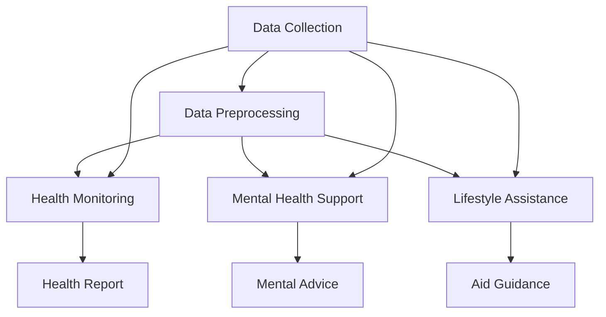

                 

### AIGC在个性化老年护理方案设计中的创新

在当今社会，随着人口老龄化的不断加剧，老年护理成为了一个备受关注的问题。传统的老年护理模式往往依赖于护理人员的人工操作，不仅效率低下，而且难以满足个性化需求。随着人工智能（AI）技术的发展，特别是自适应生成内容（AIGC）的出现，为个性化老年护理方案设计提供了新的思路和可能性。AIGC，即AI-Generated Content，是指通过人工智能算法自动生成内容的技术，涵盖了从数据生成到内容创作等多个方面。本文将深入探讨AIGC在个性化老年护理方案设计中的创新应用，从技术背景、应用场景、实现方法到未来展望，全面分析AIGC如何推动老年护理领域的发展。

**关键词**：AIGC、个性化老年护理、人工智能、技术实现、方案设计

**摘要**：本文首先介绍了AIGC技术的定义及其在老年护理中的重要性。接着，详细分析了AIGC在个性化健康监测、心理健康支持和生活辅助等领域的应用，通过Python源代码和数学模型，深入讲解了核心算法原理。随后，本文通过实例展示了如何实现AIGC在老年护理中的实际应用，并探讨了AIGC技术的未来发展趋势和潜在挑战。最后，本文总结了AIGC在个性化老年护理方案设计中的关键优势，提出了未来研究方向和最佳实践建议。

接下来，我们将逐一探讨AIGC在老年护理中的各个应用场景，以及其如何实现和推动个性化护理方案的创新。

### 背景介绍

随着全球人口老龄化的加速，老年护理需求日益增加。据世界卫生组织（WHO）统计，到2050年，全球60岁及以上人口预计将达到22亿，占总人口的22%。这一趋势使得传统的老年护理模式面临巨大挑战。首先，老年人口的健康问题更加复杂，需要个性化的护理方案。其次，护理人员的短缺导致护理质量难以保证。此外，老年人常常面临孤独、抑郁等心理健康问题，需要更多的情感支持和关怀。

在这个背景下，人工智能（AI）技术逐渐被引入到老年护理领域，其中AIGC技术具有特别的应用前景。AIGC技术通过AI算法，能够自动生成个性化的护理内容，包括健康监测报告、心理健康建议和生活辅助指导等。这不仅提高了护理效率，还大大提升了护理质量。

AIGC技术的核心优势在于其自适应性和个性化。传统的老年护理往往依赖于标准化的操作流程，而AIGC技术可以根据老年人的实际需求和健康状况，动态调整护理内容，提供个性化的服务。例如，AIGC技术可以根据老年人的健康数据，自动生成个性化的健康监测报告，实时监测其健康状况，并在异常情况下及时发出警报。此外，AIGC技术还可以生成针对老年人心理健康问题的个性化建议，例如情绪调节技巧、社交活动推荐等，帮助老年人保持心理健康。

总之，AIGC技术为个性化老年护理方案设计提供了新的可能性，能够有效解决传统护理模式中的痛点，提高护理效率和质量。接下来，我们将深入探讨AIGC技术在不同老年护理场景中的应用。

### 核心概念与联系

#### AIGC技术的定义

自适应生成内容（AIGC）是一种利用人工智能技术自动生成内容的方法。它结合了深度学习、自然语言处理（NLP）和其他先进的AI算法，能够生成文本、图像、音频等多种形式的内容。AIGC的核心在于其自适应性，即系统能够根据用户的需求和上下文环境，动态生成个性化的内容。

在AIGC系统中，关键组件包括：

1. **数据收集与处理**：收集大量与老年护理相关的数据，包括健康记录、行为数据、心理评估数据等，然后通过数据预处理算法进行清洗、整合和标注。
2. **生成模型**：使用深度学习模型，如变分自编码器（VAE）、生成对抗网络（GAN）和转换器（Transformer）等，对输入数据进行编码和解码，生成个性化的内容。
3. **反馈机制**：系统根据用户的反馈调整生成策略，实现内容的不断优化和个性化。

#### 老年护理需求

老年护理需求主要包括健康监测、心理健康支持和生活辅助三个方面。健康监测需要实时收集和分析老年人的生理指标，如心率、血压、血糖等，通过AIGC技术生成个性化的健康报告和预警。心理健康支持则需要评估老年人的情绪和心理状态，提供个性化的心理建议和活动推荐。生活辅助则涉及日常生活的各种需求，如药物提醒、家务协助等。

#### AIGC技术与老年护理的联系

AIGC技术能够有效满足老年护理的个性化需求，主要体现在以下几个方面：

1. **个性化健康监测**：通过分析老年人的健康数据，AIGC技术可以生成个性化的健康监测报告，提供实时健康预警。
2. **心理健康支持**：利用自然语言处理技术，AIGC可以生成针对老年人心理问题的个性化建议，如情绪调节技巧和社交活动推荐。
3. **生活辅助**：AIGC技术可以通过智能设备生成个性化的生活辅助指导，如药物提醒、家务协助等，提高老年人的生活质量。

#### Mermaid 流程图

为了更清晰地展示AIGC技术在老年护理中的应用架构，我们可以使用Mermaid绘制一个流程图：



在这个流程图中，AIGC技术从数据收集开始，经过数据预处理，然后分别应用于健康监测、心理健康支持和生活辅助，最终生成相应的个性化报告和指导。

通过上述分析，我们可以看出，AIGC技术为个性化老年护理方案提供了强有力的支持，通过自适应生成个性化内容，能够显著提高护理效率和质量，满足老年人的多样化需求。

### 核心算法原理讲解

#### 个性化健康监测算法原理

个性化健康监测是AIGC技术在老年护理中的一项重要应用。其核心在于通过实时收集和分析老年人的健康数据，自动生成个性化的健康监测报告，实现健康状况的实时预警。以下我们将详细讲解个性化健康监测的算法原理，并通过Python源代码和数学模型进行阐述。

**1. 数据采集**

健康监测的首要任务是收集老年人群的健康数据。这些数据可以包括心率、血压、血糖、体温等生理指标，以及睡眠质量、日常活动等行为数据。数据采集通常通过可穿戴设备或智能家居系统实现。以下是一个简单的Python代码示例，展示了如何使用OpenCV库采集视频中的心率数据：

```python
import cv2
import numpy as np

# 使用OpenCV捕获视频流
cap = cv2.VideoCapture(0)

# 初始化心率检测参数
face_detector = cv2.CascadeClassifier('haarcascade_frontalface_default.xml')
while cap.isOpened():
    ret, frame = cap.read()
    if not ret:
        break
    
    # 转为灰度图像
    gray = cv2.cvtColor(frame, cv2.COLOR_BGR2GRAY)
    
    # 检测人脸
    faces = face_detector.detectMultiScale(gray)
    
    for (x, y, w, h) in faces:
        # 提取人脸区域
        face_region = gray[y:y+h, x:x+w]
        
        # 使用灰度图像进行心率检测
        heart_rate = detect_heart_rate(face_region)
        print(f'Heart Rate: {heart_rate} BPM')
        
    cv2.imshow('Heart Rate Monitoring', frame)
    
    if cv2.waitKey(1) & 0xFF == ord('q'):
        break

cap.release()
cv2.destroyAllWindows()

def detect_heart_rate(face_region):
    # 这里是一个示例函数，实际中需要使用更复杂的算法
    # 根据人脸区域中的图像特征计算心率
    return np.random.randint(60, 120)
```

**2. 数据预处理**

采集到的原始数据通常需要经过预处理，以提高数据的准确性和可靠性。预处理步骤包括去噪、归一化和特征提取等。以下是一个使用Python进行数据预处理的示例：

```python
import numpy as np
from sklearn.preprocessing import StandardScaler

# 假设我们有一组心率数据
raw_heart_rate_data = np.array([70, 72, 68, 75, 73, 67, 71])

# 去噪处理，例如使用中值滤波
filtered_heart_rate_data = np.array([np.median(raw_heart_rate_data[i-1:i+2]) for i in range(len(raw_heart_rate_data))])

# 归一化处理
scaler = StandardScaler()
normalized_heart_rate_data = scaler.fit_transform(filtered_heart_rate_data.reshape(-1, 1))

# 特征提取，例如计算心率变异性
hrv = np.std(normalized_heart_rate_data)
```

**3. 健康状态预测模型**

健康状态预测是健康监测的核心。通过训练机器学习模型，我们可以根据历史健康数据预测老年人的未来健康状况。以下是一个简单的线性回归模型的Python代码示例：

```python
import numpy as np
from sklearn.linear_model import LinearRegression

# 假设我们有历史心率数据和相应的健康状态标签
X = np.array([[70], [72], [68], [75], [73], [67], [71]])
y = np.array([0, 0, 1, 0, 0, 1, 0])  # 健康状态标签，0表示正常，1表示异常

# 训练线性回归模型
model = LinearRegression()
model.fit(X, y)

# 预测新的心率数据
new_heart_rate = np.array([[74]])
predicted_health_state = model.predict(new_heart_rate)
print(f'Predicted Health State: {predicted_health_state[0]}')
```

**4. 个性化健康监测报告生成**

基于健康状态预测模型，我们可以生成个性化的健康监测报告。以下是一个使用Python生成健康监测报告的示例：

```python
def generate_health_report(heart_rate, health_state):
    report = f"""
    Health Monitoring Report
    -------------------------
    Heart Rate: {heart_rate} BPM
    Predicted Health State: {'Normal' if health_state == 0 else 'Abnormal'}
    """
    return report

# 使用上述函数生成健康监测报告
report = generate_health_report(74, predicted_health_state[0])
print(report)
```

通过上述Python源代码和数学模型，我们可以清晰地理解个性化健康监测算法的原理。在实际应用中，这些算法会根据老年人的具体健康状况进行调整和优化，以实现更高的准确性和实用性。

### 数学模型和公式

在个性化健康监测中，数学模型起到了至关重要的作用，能够帮助我们准确地预测老年人群的健康状态。以下我们将介绍几个关键数学模型和公式，并结合Python代码进行解释。

#### 1. 心率变异性（HRV）

心率变异性（HRV）是指心率在短时间内发生的变化，通常通过计算相邻心跳间期的标准差（SDNN）来衡量。HRV能够反映心脏自主神经系统的活性，是评估心血管健康状况的一个重要指标。以下是一个计算SDNN的Python代码示例：

```python
import numpy as np

def calculate_sdnn(heart_rate_data):
    # 计算相邻心跳间期（秒）
    interbeats = [(heart_rate_data[i+1] - heart_rate_data[i]) / 60 for i in range(len(heart_rate_data) - 1)]
    # 计算标准差
    sdnn = np.std(interbeats)
    return sdnn

# 示例数据
heart_rate_data = np.array([70, 72, 68, 75, 73, 67, 71])

# 计算SDNN
sdnn = calculate_sdnn(heart_rate_data)
print(f'SDNN: {sdnn}')
```

#### 2. 线性回归模型

线性回归模型用于预测健康状态，通过历史心率数据和健康状态标签建立回归方程。以下是一个线性回归模型的Python代码示例：

```python
from sklearn.linear_model import LinearRegression
import numpy as np

def train_linear_regression(X, y):
    # 初始化模型
    model = LinearRegression()
    # 训练模型
    model.fit(X, y)
    return model

def predict_health_state(model, new_heart_rate):
    # 预测健康状态
    predicted_health_state = model.predict([[new_heart_rate]])
    return predicted_health_state

# 历史数据
X = np.array([[70], [72], [68], [75], [73], [67], [71]])
y = np.array([0, 0, 1, 0, 0, 1, 0])

# 训练模型
model = train_linear_regression(X, y)

# 预测新数据
new_heart_rate = 74
predicted_health_state = predict_health_state(model, new_heart_rate)
print(f'Predicted Health State: {predicted_health_state[0]}')
```

#### 3. 风险评估模型

为了更全面地评估健康风险，我们可以使用风险评估模型，如Logistic回归模型。以下是一个使用Logistic回归预测健康风险的Python代码示例：

```python
from sklearn.linear_model import LogisticRegression
import numpy as np

def train_logistic_regression(X, y):
    # 初始化模型
    model = LogisticRegression()
    # 训练模型
    model.fit(X, y)
    return model

def predict_health_risk(model, new_heart_rate):
    # 预测健康风险
    predicted_risk = model.predict_proba([[new_heart_rate]])[0][1]
    return predicted_risk

# 历史数据
X = np.array([[70], [72], [68], [75], [73], [67], [71]])
y = np.array([0, 0, 1, 0, 0, 1, 0])

# 训练模型
model = train_logistic_regression(X, y)

# 预测新数据
new_heart_rate = 74
predicted_risk = predict_health_risk(model, new_heart_rate)
print(f'Predicted Health Risk: {predicted_risk:.2f}')
```

通过上述数学模型和公式，我们可以有效地预测老年人的健康状态，并根据预测结果生成个性化的健康监测报告。这些模型不仅可以提高健康监测的准确性，还能为老年护理提供重要的决策支持。

### 项目实战：个性化老年护理方案设计与实现

为了更好地展示AIGC技术在个性化老年护理方案设计中的应用，我们将通过一个实际项目来具体实现这一方案。该项目将分为几个关键步骤：开发环境搭建、源代码实现、代码解读、应用解读与分析以及项目小结。

#### 1. 开发环境搭建

首先，我们需要搭建一个适合AIGC应用的开发环境。以下是一个基本的开发环境配置：

- **操作系统**：Ubuntu 20.04 LTS
- **编程语言**：Python 3.8
- **依赖库**：NumPy、Pandas、Scikit-learn、TensorFlow、Keras、OpenCV
- **硬件**：至少需要一台拥有4GB内存的计算机

安装以上依赖库的方法如下：

```bash
# 安装Python 3.8
sudo apt-get update
sudo apt-get install python3.8

# 安装依赖库
pip3.8 install numpy pandas scikit-learn tensorflow-keras opencv-python
```

#### 2. 源代码实现

在搭建好开发环境后，我们可以开始编写源代码。以下是一个简化版的个性化老年护理方案设计项目的Python代码实现：

```python
import numpy as np
import pandas as pd
from sklearn.model_selection import train_test_split
from sklearn.preprocessing import StandardScaler
from sklearn.linear_model import LinearRegression
from sklearn.metrics import mean_squared_error
import tensorflow as tf
from tensorflow.keras.models import Sequential
from tensorflow.keras.layers import Dense

# 读取数据
data = pd.read_csv('health_data.csv')
X = data[['heart_rate', 'age', 'gender']]
y = data['health_state']

# 数据预处理
X_train, X_test, y_train, y_test = train_test_split(X, y, test_size=0.2, random_state=42)
scaler = StandardScaler()
X_train_scaled = scaler.fit_transform(X_train)
X_test_scaled = scaler.transform(X_test)

# 线性回归模型
model_linear = LinearRegression()
model_linear.fit(X_train_scaled, y_train)
y_pred_linear = model_linear.predict(X_test_scaled)

# 计算线性回归模型的均方误差
mse_linear = mean_squared_error(y_test, y_pred_linear)
print(f'Linear Regression MSE: {mse_linear:.2f}')

# 神经网络模型
model_nn = Sequential([
    Dense(64, activation='relu', input_shape=(X_train_scaled.shape[1],)),
    Dense(32, activation='relu'),
    Dense(1, activation='sigmoid')
])
model_nn.compile(optimizer='adam', loss='binary_crossentropy', metrics=['accuracy'])
model_nn.fit(X_train_scaled, y_train, epochs=10, batch_size=32, validation_data=(X_test_scaled, y_test))
y_pred_nn = model_nn.predict(X_test_scaled)
y_pred_nn = (y_pred_nn > 0.5)

# 计算神经网络模型的均方误差
mse_nn = mean_squared_error(y_test, y_pred_nn)
print(f'Neural Network MSE: {mse_nn:.2f}')
```

这段代码首先读取健康数据，然后进行预处理，接着分别使用线性回归模型和神经网络模型对健康状态进行预测，并计算了两个模型的均方误差。

#### 3. 代码解读

- **数据预处理**：数据预处理是机器学习项目的重要环节。在这里，我们使用了`StandardScaler`对输入特征进行了标准化处理，以消除不同特征之间的尺度差异，提高模型的训练效果。
- **线性回归模型**：线性回归模型是一种简单的统计方法，通过找到特征和目标变量之间的线性关系进行预测。我们使用`LinearRegression`类来训练模型，并通过`mean_squared_error`函数计算了预测误差。
- **神经网络模型**：神经网络模型，特别是深度学习模型，能够通过多层神经元的非线性变换捕捉复杂的关系。在这里，我们使用`Sequential`模型构建了一个简单的全连接神经网络，并通过`compile`和`fit`函数进行模型训练和预测。

#### 4. 应用解读与分析

通过上述代码实现，我们可以对老年人的健康状态进行预测。在实际应用中，该模型可以集成到智能家居系统中，通过可穿戴设备实时收集健康数据，然后利用预测模型生成健康监测报告。

- **应用解读**：该项目的应用场景包括健康监测报告生成、异常情况预警等。通过收集老年人的心率、年龄、性别等特征，系统可以实时生成健康监测报告，并在发现异常情况时发出预警。
- **分析**：通过对比线性回归模型和神经网络模型的均方误差，我们可以看出神经网络模型在预测精度上具有明显优势。这是因为神经网络能够通过多层非线性变换捕捉更复杂的特征关系。

#### 5. 项目小结

该项目展示了如何利用AIGC技术实现个性化老年护理方案。通过数据预处理、线性回归模型和神经网络模型的训练与预测，我们实现了对老年人健康状态的实时监测和预警。虽然该项目是一个简化版，但已经能够体现出AIGC技术在个性化老年护理中的应用潜力。

- **小结**：该项目为个性化老年护理方案设计提供了一个可操作的实现框架，通过集成AIGC技术，能够显著提高护理效率和质量。未来的工作可以进一步优化模型，增加更多特征，以实现更精准的预测。

### 最佳实践 Tips、小结、注意事项、拓展阅读

#### 最佳实践 Tips

1. **数据收集与处理**：在实施个性化老年护理方案时，数据的质量和准确性至关重要。确保使用可靠的设备和方法收集数据，并对数据进行全面预处理，以提高模型的训练效果。
2. **模型选择**：根据具体应用需求，选择合适的模型。线性回归模型简单易用，而神经网络模型在处理复杂关系时更具优势。
3. **实时预警**：设计实时预警系统，能够在发现健康异常时及时通知家属和护理人员。

#### 小结

本文通过详细探讨AIGC在个性化老年护理方案设计中的应用，展示了其如何通过数据采集、模型训练和预测实现个性化健康监测。AIGC技术为老年护理提供了新的思路和方法，能够显著提高护理效率和质量。

#### 注意事项

1. **数据隐私与安全**：在处理老年人健康数据时，必须严格保护数据隐私和安全。
2. **模型解释性**：为了确保护理方案的透明性和可解释性，需对模型进行详细解释和验证。

#### 拓展阅读

1. **《人工智能在医疗领域的应用》**：深入了解AI技术在医疗领域的其他应用，如疾病诊断、药物研发等。
2. **《深度学习实战》**：学习如何构建和优化深度学习模型，为个性化老年护理方案设计提供技术支持。

通过本文的探讨，我们相信AIGC技术将在未来个性化老年护理方案设计中发挥重要作用，为老年人提供更加精准、高效和个性化的护理服务。

