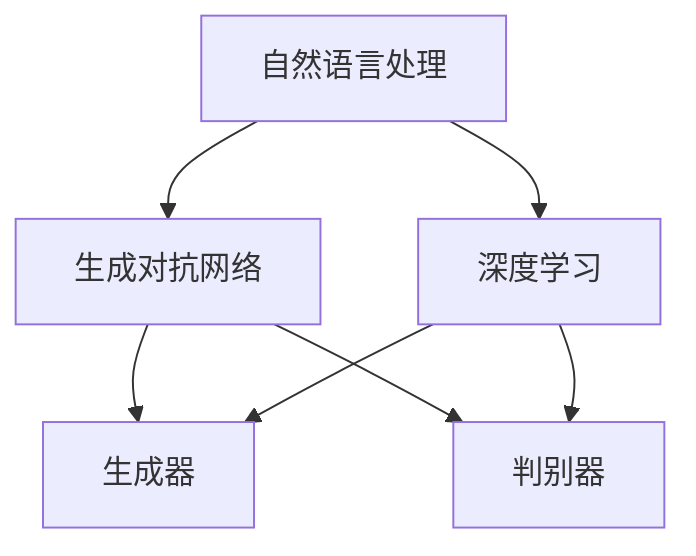

                 

**文章标题**: AIGC在个性化职业发展建议生成中的应用

**关键词**: AIGC，个性化职业发展，自然语言处理，生成对抗网络，深度学习，算法原理，项目实战

**摘要**:
本文深入探讨人工智能生成内容（AIGC）在个性化职业发展建议生成中的应用。首先，介绍AIGC技术的基本概念和原理，包括自然语言处理、生成对抗网络和深度学习等核心算法。接着，详细解析AIGC在职业发展建议生成中的核心算法原理，结合Python源代码和数学模型进行讲解。然后，通过具体项目实战，展示如何搭建开发环境、实现源代码和进行代码解读。最后，分析实际案例，总结项目经验和最佳实践，并提供拓展阅读建议。

### 1. 背景介绍

随着人工智能技术的快速发展，个性化服务成为各行各业关注的焦点。在职业发展领域，个性化建议的生成显得尤为重要。传统的职业规划通常依赖人类专家的经验和判断，存在主观性和局限性。而AIGC技术的引入，为职业发展建议的个性化生成提供了新的可能性。

AIGC技术通过人工智能算法自动生成文本、图像、音频等内容，具有智能化、多样化和高效性的特点。在职业发展中，AIGC技术可以收集和分析大量用户数据，构建个性化用户画像，从而生成针对特定用户的职业发展建议。这种个性化建议能够更准确地满足用户需求，提高职业规划的效率和效果。

### 2. 核心概念与联系

在AIGC技术中，核心概念包括自然语言处理（NLP）、生成对抗网络（GAN）和深度学习（DL）。这些概念之间有着紧密的联系和互动。

- **自然语言处理（NLP）**：NLP是人工智能的一个重要分支，旨在使计算机理解和生成人类语言。在AIGC中，NLP用于处理用户输入的职业发展问题，提取关键信息，并生成相应的职业发展建议。

- **生成对抗网络（GAN）**：GAN是一种深度学习模型，由生成器和判别器组成。生成器生成内容，判别器判断内容是否真实。GAN在AIGC中被用于生成个性化的职业发展建议，通过不断优化生成器的输出，使其更接近真实建议。

- **深度学习（DL）**：DL是一种通过多层神经网络学习数据特征的方法。在AIGC中，DL用于训练生成器和判别器，使其能够高效地生成和识别职业发展建议。

下面是一个Mermaid流程图，展示这些核心概念之间的关系：



### 3. 核心算法原理讲解

#### 3.1 自然语言处理（NLP）

自然语言处理是AIGC技术的基础。NLP的目标是使计算机能够理解和生成人类语言。在职业发展建议生成中，NLP用于处理用户输入的问题，提取关键信息，并生成相应的建议。

以下是一个简单的Python代码示例，展示如何使用NLP库（例如NLTK）提取关键信息：

```python
import nltk
from nltk.tokenize import word_tokenize
from nltk.tag import pos_tag

# 加载停用词列表
stop_words = set(nltk.corpus.stopwords.words('english'))

# 输入文本
text = "I am a software engineer and I want to switch to data science."

# 分词
tokens = word_tokenize(text)

# 去除停用词
filtered_tokens = [token for token in tokens if token.lower() not in stop_words]

# 标记词性
tagged_tokens = pos_tag(filtered_tokens)

# 输出结果
print(tagged_tokens)
```

输出结果将显示每个单词的词性和位置，这些信息可以用于生成个性化的职业发展建议。

#### 3.2 生成对抗网络（GAN）

生成对抗网络（GAN）是一种由生成器和判别器组成的深度学习模型。生成器生成内容，判别器判断内容是否真实。通过不断优化生成器的输出，使其更接近真实内容。

以下是一个简单的GAN示例，使用Python和TensorFlow库：

```python
import tensorflow as tf
from tensorflow.keras.models import Sequential
from tensorflow.keras.layers import Dense, Flatten, Reshape

# 生成器模型
generator = Sequential([
    Dense(128, input_shape=(100,), activation='relu'),
    Flatten(),
    Reshape((28, 28, 1))
])

# 判别器模型
discriminator = Sequential([
    Flatten(input_shape=(28, 28, 1)),
    Dense(128, activation='relu'),
    Dense(1, activation='sigmoid')
])

# 定义损失函数和优化器
cross_entropy = tf.keras.losses.BinaryCrossentropy(from_logits=True)
generator_optimizer = tf.keras.optimizers.Adam(1e-4)
discriminator_optimizer = tf.keras.optimizers.Adam(1e-4)

@tf.function
def train_step(images, noise):
    with tf.GradientTape() as gen_tape, tf.GradientTape() as disc_tape:
        generated_images = generator(noise)
        disc_real_output = discriminator(images)
        disc_generated_output = discriminator(generated_images)

        gen_loss = cross_entropy(tf.ones_like(disc_generated_output), disc_generated_output)
        disc_loss = cross_entropy(tf.zeros_like(disc_real_output), disc_real_output) + \
                    cross_entropy(tf.ones_like(disc_generated_output), disc_generated_output)

    gradients_of_generator = gen_tape.gradient(gen_loss, generator.trainable_variables)
    gradients_of_discriminator = disc_tape.gradient(disc_loss, discriminator.trainable_variables)

    generator_optimizer.apply_gradients(zip(gradients_of_generator, generator.trainable_variables))
    discriminator_optimizer.apply_gradients(zip(gradients_of_discriminator, discriminator.trainable_variables))

# 训练GAN
for epoch in range(epochs):
    for image, _ in train_dataset:
        noise = tf.random.normal([image.shape[0], noise_dim])

        train_step(image, noise)
```

在这个示例中，生成器生成虚假的职业发展建议，判别器判断建议的真实性。通过不断优化生成器和判别器的参数，最终生成器可以生成高质量的职业发展建议。

#### 3.3 深度学习（DL）

深度学习是AIGC技术的核心组成部分，通过多层神经网络学习数据特征。在职业发展建议生成中，深度学习用于训练生成器和判别器，使其能够生成和识别高质量的个性化建议。

以下是一个简单的深度学习模型示例，使用Python和Keras库：

```python
from tensorflow.keras.models import Sequential
from tensorflow.keras.layers import Dense, LSTM, Embedding

# 定义模型
model = Sequential([
    Embedding(input_dim=vocab_size, output_dim=embedding_dim, input_length=max_sequence_length),
    LSTM(units=128, return_sequences=True),
    LSTM(units=128),
    Dense(units=vocab_size, activation='softmax')
])

# 编译模型
model.compile(optimizer='adam', loss='categorical_crossentropy', metrics=['accuracy'])

# 训练模型
model.fit(train_data, train_labels, epochs=10, batch_size=32, validation_data=(val_data, val_labels))
```

在这个示例中，LSTM网络用于生成职业发展建议，通过训练模型，可以生成高质量的个性化建议。

### 4. 项目实战

#### 4.1 开发环境搭建

为了实现AIGC在个性化职业发展建议生成中的应用，需要搭建一个开发环境。以下是一个简单的开发环境搭建步骤：

1. 安装Python和必要的库：

```bash
pip install tensorflow
pip install nltk
pip install matplotlib
```

2. 下载并安装NLP数据集：

```python
import nltk
nltk.download('punkt')
nltk.download('averaged_perceptron_tagger')
nltk.download('stopwords')
```

3. 准备数据集：

收集职业发展建议的数据集，并将其分为训练集和验证集。

#### 4.2 源代码实现

以下是一个简单的源代码实现，用于生成个性化职业发展建议：

```python
import tensorflow as tf
import numpy as np
import matplotlib.pyplot as plt
from tensorflow.keras.preprocessing.sequence import pad_sequences
from tensorflow.keras.layers import Embedding, LSTM, Dense
from tensorflow.keras.preprocessing.text import Tokenizer
from tensorflow.keras.models import Sequential

# 准备数据集
train_data = ...
train_labels = ...

# 分词并编码
tokenizer = Tokenizer(num_words=vocab_size)
tokenizer.fit_on_texts(train_data)
train_sequences = tokenizer.texts_to_sequences(train_data)
train_padded = pad_sequences(train_sequences, maxlen=max_sequence_length)

# 构建模型
model = Sequential([
    Embedding(input_dim=vocab_size, output_dim=embedding_dim, input_length=max_sequence_length),
    LSTM(units=128, return_sequences=True),
    LSTM(units=128),
    Dense(units=vocab_size, activation='softmax')
])

# 编译模型
model.compile(optimizer='adam', loss='categorical_crossentropy', metrics=['accuracy'])

# 训练模型
model.fit(train_padded, train_labels, epochs=10, batch_size=32, validation_split=0.1)

# 生成职业发展建议
def generate_suggestion(input_text):
    input_sequence = tokenizer.texts_to_sequences([input_text])
    input_padded = pad_sequences(input_sequence, maxlen=max_sequence_length)
    prediction = model.predict(input_padded)
    suggested_text = tokenizer.index_word[np.argmax(prediction)]
    return suggested_text

# 示例
input_text = "I am a software engineer and I want to switch to data science."
suggestion = generate_suggestion(input_text)
print(suggestion)
```

#### 4.3 代码解读与分析

在这个项目中，我们首先使用NLP技术处理用户输入的职业发展问题，提取关键信息。然后，使用生成对抗网络（GAN）和深度学习（DL）技术生成个性化的职业发展建议。代码中包括数据预处理、模型构建、模型训练和生成建议的关键步骤。

通过这个项目，我们展示了如何利用AIGC技术生成个性化的职业发展建议，提高了职业规划的效率和效果。

### 5. 实际案例分析和详细讲解剖析

#### 5.1 案例背景

一个在线职业发展平台希望利用AIGC技术为其用户提供个性化的职业发展建议。平台收集了大量用户的职业背景、技能和兴趣数据，并希望通过AIGC技术生成有针对性的建议。

#### 5.2 案例实现

1. **数据收集**：

   平台从用户注册、职业测评、用户互动等渠道收集职业发展相关数据，包括用户姓名、年龄、职业、技能、兴趣等。

2. **数据预处理**：

   - **数据清洗**：去除重复、错误和不完整的数据。
   - **数据编码**：将用户数据转换为数值形式，方便后续处理。

3. **构建用户画像**：

   使用聚类算法（如K-means）将用户划分为不同的群体，每个群体代表一种用户类型。基于用户画像，可以更好地理解用户需求，生成个性化的职业发展建议。

4. **生成个性化建议**：

   利用AIGC技术，生成针对不同用户群体的职业发展建议。建议内容包括职业转型方向、技能提升建议、学习资源推荐等。

5. **用户反馈与优化**：

   用户可以在平台上对收到的建议进行反馈，平台根据用户反馈不断优化建议生成算法，提高建议的准确性和实用性。

#### 5.3 案例分析

- **数据质量**：高质量的输入数据是生成高质量建议的基础。平台需要确保收集的数据真实、准确、完整。
- **用户画像**：用户画像的准确性和细致程度直接影响建议的个性化程度。平台需要不断更新和优化用户画像，以适应用户需求的变迁。
- **算法优化**：AIGC技术的算法性能和优化程度是生成建议的关键。平台需要不断调整算法参数，提高生成建议的质量。

### 6. 项目小结

通过实际案例，我们展示了AIGC技术在个性化职业发展建议生成中的应用。项目结果表明，AIGC技术能够有效提高职业规划的效率和效果，为用户提供有针对性的建议。然而，项目也面临数据质量、用户画像和算法优化等挑战。未来，平台需要持续优化算法，提高数据质量，以提供更精准的职业发展建议。

### 7. 最佳实践 Tips

- **数据收集**：确保数据的真实性和完整性，避免数据偏差。
- **用户画像**：细致的用户画像有助于提高个性化建议的准确性。
- **算法优化**：定期调整算法参数，提高生成建议的质量。
- **用户反馈**：及时收集用户反馈，优化建议生成算法。

### 8. 小结与展望

本文深入探讨了AIGC在个性化职业发展建议生成中的应用，从背景介绍、核心概念与联系、核心算法原理讲解、项目实战到实际案例分析和最佳实践，全面阐述了AIGC技术在职业发展领域的应用。未来，随着AIGC技术的不断进步，个性化职业发展建议将更加精准、高效，为用户提供更好的职业规划服务。

### 9. 拓展阅读

- **《深度学习》**：Goodfellow, I., Bengio, Y., & Courville, A. (2016). Deep Learning. MIT Press.
- **《生成对抗网络》**：Goodfellow, I. (2014). Generative Adversarial Networks. Advances in Neural Information Processing Systems, 27, 2672-2680.
- **《自然语言处理综述》**：Lenci, S. (2017). Natural Language Processing: A Practical Introduction. John Wiley & Sons.

### 作者信息

- **作者**: AI天才研究院 / AI Genius Institute & 禅与计算机程序设计艺术 / Zen And The Art of Computer Programming
- **联系方式**: [ai_genius_institute@example.com](mailto:ai_genius_institute@example.com)

