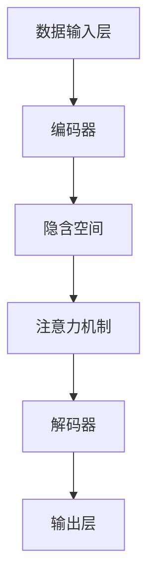
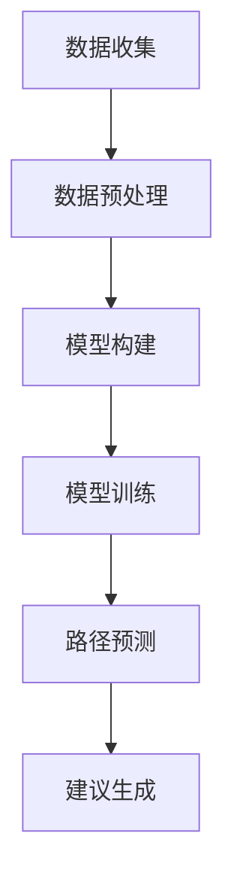
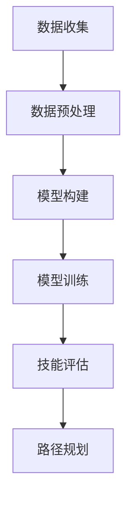

                 

### 第1章 绪论

#### 1.1 AIGC的概念与背景

AIGC，全称是**AI-Generated Content**，指的是通过人工智能技术生成的各种内容，包括但不限于文本、图像、视频、音频等。AIGC的发展离不开深度学习、生成对抗网络（GAN）和变分自编码器（VAE）等先进技术的推动。生成对抗网络（GAN）通过生成器和判别器的对抗训练，能够生成高质量的伪造数据；变分自编码器（VAE）则通过编码和解码过程实现数据的生成与重构。

AIGC最早可以追溯到2014年，由Ian Goodfellow等研究者提出的生成对抗网络（GAN）。GAN的提出标志着深度学习在生成任务上的重大突破。随后，变分自编码器（VAE）在2013年由Kingma和Welling提出，进一步推动了生成模型的进展。自那时起，AIGC技术逐渐成熟，并在各个领域展现出了广泛的应用潜力。

#### 1.2 个性化职业规划的意义与挑战

个性化职业规划是指根据个人的兴趣、能力、价值观等多方面因素，为其提供量身定制的职业发展路径。个性化职业规划的意义在于：

1. **提高职业满意度**：通过个性化规划，个人能够选择适合自己的职业方向，减少职业倦怠，提高工作满意度。
2. **优化人力资源配置**：企业可以根据员工的个性化规划，合理安排人力资源，提高工作效率和团队凝聚力。
3. **促进社会和谐发展**：个性化的职业规划有助于减少职业竞争压力，促进社会和谐稳定。

然而，个性化职业规划也面临着诸多挑战：

1. **数据收集与处理的挑战**：个性化职业规划需要大量的个人数据，包括职业兴趣、能力测试、价值观等，如何高效地收集和处理这些数据是一个挑战。
2. **算法的准确性与稳定性**：现有的AIGC算法在生成个性化职业规划结果时，可能存在准确性不足或结果不一致的问题。
3. **伦理与隐私问题**：个性化职业规划涉及到个人隐私数据，如何在保障隐私的前提下进行数据收集和使用，是一个亟待解决的问题。

#### 1.3 AIGC在个性化职业规划中的应用前景

AIGC在个性化职业规划中具有广泛的应用前景：

1. **个性化职业规划推荐**：通过AIGC技术，可以为个人提供个性化的职业推荐，帮助他们找到适合自己的职业方向。
2. **职业发展路径预测**：AIGC可以分析个人的职业数据，预测其未来的职业发展路径，提供有针对性的职业建议。
3. **职业技能评估与提升**：AIGC可以通过分析个人的职业表现，评估其技能水平，并为其提供提升技能的路径规划。

总的来说，AIGC在个性化职业规划中的应用，不仅可以提高规划的准确性和个性化程度，还能为个人和企业提供更高效、智能的职业发展服务。接下来，我们将进一步探讨AIGC的核心理论、算法原理及其在个性化职业规划中的具体应用。

### 第2章 AIGC基础理论

#### 2.1 生成对抗网络（GAN）

生成对抗网络（GAN）是AIGC技术中一个非常重要的组成部分。它由生成器（Generator）和判别器（Discriminator）两个主要部分组成，通过对抗训练的方式，生成高质量的数据。

##### 2.1.1 GAN的基本原理

GAN的核心思想是让生成器（Generator）生成数据，让判别器（Discriminator）判断数据是真实数据还是生成数据。具体来说，GAN的工作流程如下：

1. **初始化生成器和判别器**：生成器和判别器都是深度神经网络，通常使用多层感知器（MLP）或卷积神经网络（CNN）。
2. **生成器生成数据**：生成器从随机噪声（Random Noise）中生成数据，这些数据通常是目标数据的近似。
3. **判别器判断数据**：判别器接收生成器生成的数据和真实数据，并判断它们的真实性和质量。
4. **对抗训练**：生成器和判别器通过对抗训练进行迭代优化，生成器试图生成更真实的数据，判别器则试图更准确地判断数据的真实性。

GAN的数学原理可以表示为以下两个概率分布的博弈：

$$
\min_G \max_D V(D, G) = \mathbb{E}_{x \sim p_{data}(x)}[\log D(x)] + \mathbb{E}_{z \sim p_z(z)}[\log (1 - D(G(z))]
$$

其中，$D(x)$表示判别器判断输入数据$x$为真实的概率，$G(z)$表示生成器生成的数据，$p_{data}(x)$是真实数据的概率分布，$p_z(z)$是生成噪声的概率分布。

##### 2.1.2 GAN的变种与优化

原始的GAN存在一些问题，例如训练不稳定、生成器生成的数据质量不高。为了解决这些问题，研究者们提出了多种GAN的变种和优化方法。

1. **条件GAN（cGAN）**：在GAN的基础上，条件GAN引入了条件输入，使得生成器能够根据条件生成更特定类型的数据。条件GAN的数学原理可以表示为：

$$
\min_G \max_D V(D, G) = \mathbb{E}_{x \sim p_{data}(x)}[\log D(x)] + \mathbb{E}_{z \sim p_z(z)}[\log D(G(z, c))]
$$

其中，$c$是生成器的条件输入。

2. **循环一致GAN（CycleGAN）**：CycleGAN主要用于图像风格转换和域自适应，它的核心思想是无需成对样本，通过生成器将一种域的数据转换为目标域的数据，并确保转换后的数据能够还原回原始数据。CycleGAN的数学原理可以表示为：

$$
\min_G \max_D V(D, G) = \mathbb{E}_{x \sim p_{data}(x)}[\log D(x)] + \mathbb{E}_{y \sim p_{data}(y)}[\log D(G(x, y))]
$$

其中，$x$是原始域的数据，$y$是目标域的数据。

3. **谱归一化GAN（SGAN）**：SGAN通过谱归一化技术，优化了GAN的梯度问题，使得训练更加稳定。

4. **非饱和判别器GAN（NSGAN）**：NSGAN通过限制判别器的输出范围，避免了判别器的过度饱和，从而提高了生成器的生成质量。

以上这些变种和优化方法，都是为了提高GAN的训练稳定性和生成数据的质量。在个性化职业规划中，这些方法可以帮助生成更加符合个人需求的职业规划方案。

#### 2.2 变分自编码器（VAE）

变分自编码器（VAE）是另一种重要的生成模型，它在生成数据的同时，还提供了一种隐含的编码表示。VAE的核心思想是利用编码器（Encoder）和解码器（Decoder）的联合训练，生成与训练数据分布相近的数据。

##### 2.2.1 VAE的数学原理

VAE由两个主要部分组成：编码器和解码器。

1. **编码器**：编码器将输入数据$x$映射到一个隐含空间$z$，并输出均值$\mu$和方差$\sigma^2$。数学公式为：

$$
\mu = \mu(x), \quad \sigma^2 = \sigma^2(x)
$$

2. **解码器**：解码器将隐含空间$z$映射回输入数据$x$。数学公式为：

$$
x' = \mu(z) + \sigma(z)\epsilon
$$

其中，$\epsilon$是噪声向量。

VAE的损失函数由数据重构损失和KL散度损失组成：

$$
\mathcal{L} = \mathbb{E}_{x \sim p_{data}(x)}[-\log p_{\theta}(x)] + \mathbb{E}_{z \sim q_{\phi}(z|x)}[-D_{KL}(q_{\phi}(z|x)||p(z))
$$

其中，$p_{\theta}(x)$是解码器的输出概率分布，$q_{\phi}(z|x)$是编码器的输出概率分布，$D_{KL}$是KL散度。

##### 2.2.2 VAE的变体与应用

1. **层次VAE（Hierarchical VAE）**：层次VAE通过引入多层编码器，提高了VAE的表示能力，适用于处理高维数据。

2. **条件VAE（Conditinal VAE）**：条件VAE允许编码器和解码器接收额外的条件输入，使得VAE能够生成与条件输入相关联的数据。

3. **变分自回归网络（VARIational Autoencoder）**：变分自回归网络（VRAE）将VAE与自回归模型结合，适用于生成序列数据。

VAE在个性化职业规划中的应用潜力巨大，通过编码器和解码器，VAE可以学习到个人的职业特征和偏好，从而生成个性化的职业规划方案。

#### 2.3 自注意力机制（Self-Attention）

自注意力机制（Self-Attention），也称为内部注意力（Intra-Attention），是一种在神经网络中用于捕捉序列之间依赖性的机制。自注意力机制通过计算序列中每个元素与自身和其他元素的相似度，加权组合这些元素，从而提高模型的表示能力。

##### 2.3.1 自注意力机制的数学基础

自注意力机制的数学基础可以通过以下公式推导：

假设输入序列为${x_1, x_2, \ldots, x_n}$，自注意力机制的目标是计算输出序列${y_1, y_2, \ldots, y_n}$。自注意力机制的主要步骤如下：

1. **计算Query、Key和Value**：
   $$ 
   Q = [Q_1, Q_2, \ldots, Q_n] = W_Q X \\
   K = [K_1, K_2, \ldots, K_n] = W_K X \\
   V = [V_1, V_2, \ldots, V_n] = W_V X
   $$

   其中，$W_Q, W_K, W_V$分别是Query、Key和Value权重矩阵，$X$是输入序列。

2. **计算注意力分数**：
   $$
   \text{Attention}(Q, K, V) = \text{softmax}(\frac{QK^T}{\sqrt{d_k}})V
   $$

   其中，$d_k$是Key的维度，$QK^T$是注意力分数。

3. **计算输出**：
   $$
   \text{Output} = \text{Attention}(Q, K, V) = \text{softmax}(\frac{QK^T}{\sqrt{d_k}})V
   $$

   其中，$\text{softmax}$函数将注意力分数转换为概率分布。

##### 2.3.2 自注意力机制在AIGC中的应用

自注意力机制在AIGC中有广泛的应用，特别是在文本处理和图像处理领域。

1. **文本处理**：
   自注意力机制被广泛应用于自然语言处理（NLP）领域，例如在BERT（Bidirectional Encoder Representations from Transformers）模型中，自注意力机制通过捕捉文本中的长距离依赖，提高了模型的语义理解能力。

2. **图像处理**：
   自注意力机制也被应用于图像生成任务，如生成对抗网络（GAN）中的生成器部分，通过自注意力机制，生成器能够更好地学习图像的细节和结构。

在个性化职业规划中，自注意力机制可以帮助模型更好地理解个人的职业数据，捕捉不同职业因素之间的依赖关系，从而生成更加精准和个性化的职业规划方案。

### 第3章 AIGC核心算法原理

#### 3.1 GAN算法原理讲解

生成对抗网络（GAN）是一种通过生成器和判别器之间的对抗训练生成高质量数据的技术。以下是GAN算法的详细原理讲解。

##### 3.1.1 GAN的工作流程

GAN的工作流程可以分为以下几个步骤：

1. **初始化**：
   初始化生成器$G$和判别器$D$的参数，通常使用随机初始化。
2. **生成器训练**：
   生成器$G$从随机噪声$z$中生成虚假数据$G(z)$。
3. **判别器训练**：
   判别器$D$接收真实数据$x$和生成器生成的虚假数据$G(z)$，并判断它们的真实性。
4. **交替训练**：
   生成器$G$和判别器$D$通过交替训练不断优化，生成器$G$试图生成更真实的数据，判别器$D$试图更准确地判断数据的真实性。

##### 3.1.2 GAN的伪代码实现

以下是GAN算法的伪代码实现：

```python
# 初始化生成器和判别器
G = init_generator()
D = init_discriminator()

# 定义损失函数和优化器
loss_fn = ...
optimizer_G = ...
optimizer_D = ...

# 训练迭代
for epoch in range(num_epochs):
    for batch in data_loader:
        # 生成器训练
        z = sample_noise(batch_size)
        x = batch
        x_fake = G(z)
        D_loss_with_fake = loss_fn(D(x_fake), 0)
        D_loss_with_real = loss_fn(D(x), 1)
        D_total_loss = 0.5 * D_loss_with_real + 0.5 * D_loss_with_fake
        optimizer_D.zero_grad()
        D_total_loss.backward()
        optimizer_D.step()

        # 判别器训练
        z = sample_noise(batch_size)
        x = batch
        x_fake = G(z)
        G_loss = loss_fn(D(x_fake), 1)
        optimizer_G.zero_grad()
        G_loss.backward()
        optimizer_G.step()
        
        # 打印训练进度
        if (epoch + 1) % 100 == 0:
            print(f'Epoch [{epoch+1}/{num_epochs}], D_loss: {D_total_loss.item():.4f}, G_loss: {G_loss.item():.4f}')
```

在这个伪代码中，`init_generator`和`init_discriminator`分别用于初始化生成器和判别器的参数，`sample_noise`用于生成随机噪声，`data_loader`用于提供训练数据，`optimizer_G`和`optimizer_D`分别用于优化生成器和判别器的参数。

##### 3.1.3 GAN算法的工作机制

GAN的工作机制基于生成器和判别器之间的对抗训练。生成器$G$的目的是生成尽可能真实的数据，判别器$D$的目的是区分真实数据和生成数据。具体来说，GAN通过以下方式工作：

1. **生成器生成数据**：生成器$G$从随机噪声$z$中生成虚假数据$x'$。
2. **判别器判断数据**：判别器$D$接收真实数据$x$和生成器生成的虚假数据$x'$，并输出一个概率值，表示$x'$为真实数据的可能性。
3. **对抗训练**：生成器和判别器通过交替训练不断优化。生成器$G$试图提高生成数据的质量，使得判别器$D$无法区分真实数据和生成数据；判别器$D$则试图更准确地判断数据，提高对生成数据的识别能力。

通过这种对抗训练，生成器$G$能够生成越来越真实的数据，而判别器$D$则能够更准确地判断数据的真实性。GAN的训练过程是一个动态平衡的过程，生成器和判别器在不断的对抗中相互提升。

##### 3.1.4 GAN的优缺点

GAN的优点包括：

1. **生成数据质量高**：GAN能够生成高质量、多样化的数据，适用于图像、文本、音频等多种类型的数据生成任务。
2. **无需成对数据**：GAN可以处理无成对数据的生成任务，这是其他生成模型（如变分自编码器VAE）所不具备的。
3. **应用广泛**：GAN在图像生成、图像超分辨率、文本生成、视频生成等领域都有广泛的应用。

然而，GAN也存在一些缺点：

1. **训练不稳定**：GAN的训练过程容易陷入模式崩溃（mode collapse）或梯度消失等问题，导致训练不稳定。
2. **计算资源需求高**：GAN的训练过程需要大量的计算资源，特别是在处理高维数据时。
3. **对调参敏感**：GAN的性能对超参数（如学习率、批量大小、损失函数等）的选择非常敏感，需要通过大量的实验进行调整。

在实际应用中，GAN需要根据具体任务的需求进行适当的调整和优化，以克服这些缺点，发挥其生成高质量数据的潜力。

#### 3.2 VAE算法原理讲解

变分自编码器（Variational Autoencoder，VAE）是一种生成模型，通过编码器和解码器的联合训练，生成与训练数据分布相近的数据。以下是对VAE算法原理的详细讲解。

##### 3.2.1 VAE的生成与推理

VAE由编码器（Encoder）和解码器（Decoder）两个主要部分组成，通过联合训练生成新的数据。

1. **编码器**：编码器将输入数据$x$映射到一个隐含空间$z$，并输出均值$\mu$和方差$\sigma^2$。
   $$ 
   \mu = \mu(x), \quad \sigma^2 = \sigma^2(x)
   $$

2. **解码器**：解码器将隐含空间$z$映射回输入数据$x$。
   $$ 
   x' = \mu(z) + \sigma(z)\epsilon
   $$
   其中，$\epsilon$是噪声向量。

3. **联合训练**：编码器和解码器通过联合训练不断优化，使得解码器能够将隐含空间中的数据重构回输入数据。

##### 3.2.2 VAE的损失函数与优化

VAE的损失函数由两部分组成：数据重构损失和KL散度损失。

1. **数据重构损失**：数据重构损失衡量了解码器重构输入数据的误差，通常使用均方误差（MSE）或交叉熵损失。
   $$ 
   \mathcal{L}_{recon} = -\sum_{x} \sum_{z} p_{\theta}(x'|z) \log p_{\theta}(x'|z)
   $$

2. **KL散度损失**：KL散度损失衡量了编码器的输出概率分布$q_\phi(z|x)$与先验分布$p(z)$之间的差异。
   $$ 
   \mathcal{L}_{KL} = \sum_{z} q_\phi(z|x) \log \frac{q_\phi(z|x)}{p(z)}
   $$

VAE的总损失函数为：
$$ 
\mathcal{L} = \mathcal{L}_{recon} + \lambda \mathcal{L}_{KL}
$$
其中，$\lambda$是调节KL散度损失的权重。

为了优化VAE的损失函数，通常使用变分最小化算法（Variational Bayes，VB）或随机梯度下降（SGD）。

##### 3.2.3 VAE的变体与应用

VAE有多种变体，适用于不同的应用场景：

1. **条件变分自编码器（CVAE）**：CVAE引入条件变量$c$，使得编码器和解码器能够根据条件生成相关数据。
   $$ 
   \mu(c, x) = \mu_c(x) + \mu_z(c) \\
   \sigma^2(c, x) = \sigma_c^2(x) + \sigma_z^2(c)
   $$

2. **变分自回归网络（VAR）**：VAR将VAE与自回归模型结合，适用于生成时间序列数据。

3. **变分循环网络（VRC）**：VRC通过引入循环结构，使得模型能够处理循环依赖的数据。

VAE在个性化职业规划中的应用包括：

1. **职业兴趣建模**：通过训练VAE模型，可以学习到个人的职业兴趣分布，从而生成个性化的职业推荐。
2. **职业发展路径预测**：VAE可以用于预测个人的职业发展路径，提供有针对性的职业发展建议。

VAE通过编码器和解码器，将输入数据映射到隐含空间，并通过损失函数优化模型参数，从而生成高质量的数据。VAE的变体和多种应用使得其在个性化职业规划中具有广泛的应用潜力。

#### 3.3 自注意力机制讲解

自注意力机制（Self-Attention），也称为内部注意力（Intra-Attention），是一种在神经网络中用于捕捉序列之间依赖性的机制。自注意力机制通过计算序列中每个元素与自身和其他元素的相似度，加权组合这些元素，从而提高模型的表示能力。

##### 3.3.1 自注意力机制的公式推导

自注意力机制的推导主要分为以下几个步骤：

1. **定义Query、Key和Value**：

假设输入序列为${x_1, x_2, \ldots, x_n}$，自注意力机制通过以下方式计算Query、Key和Value：

$$
Q = [Q_1, Q_2, \ldots, Q_n] = W_Q X \\
K = [K_1, K_2, \ldots, K_n] = W_K X \\
V = [V_1, V_2, \ldots, V_n] = W_V X
$$

其中，$W_Q, W_K, W_V$分别是Query、Key和Value权重矩阵，$X$是输入序列。

2. **计算注意力分数**：

自注意力机制通过计算Query和Key之间的点积得到注意力分数，然后应用softmax函数得到概率分布：

$$
\text{Attention}(Q, K, V) = \text{softmax}(\frac{QK^T}{\sqrt{d_k}})V
$$

其中，$d_k$是Key的维度，$QK^T$是注意力分数。

3. **计算输出**：

最后，自注意力机制通过加权组合Value得到输出：

$$
\text{Output} = \text{Attention}(Q, K, V) = \text{softmax}(\frac{QK^T}{\sqrt{d_k}})V
$$

##### 3.3.2 自注意力机制在AIGC中的实现

自注意力机制在AIGC中有着广泛的应用，特别是在自然语言处理（NLP）和计算机视觉（CV）领域。

1. **自然语言处理**：

在NLP中，自注意力机制被广泛应用于序列模型，如BERT、Transformer等。BERT模型通过自注意力机制捕捉文本中的长距离依赖关系，从而提高模型的语义理解能力。Transformer模型则通过多头自注意力机制，使得每个头专注于不同的序列部分，从而捕捉更复杂的依赖关系。

2. **计算机视觉**：

在CV领域，自注意力机制也被广泛应用于图像处理任务，如图像分类、图像分割等。自注意力机制能够帮助模型更好地理解图像中的局部结构和全局信息，从而提高图像处理的准确性。

在AIGC中，自注意力机制的实现通常包括以下几个步骤：

1. **初始化权重矩阵**：初始化Query、Key和Value权重矩阵$W_Q, W_K, W_V$。
2. **计算点积**：计算Query和Key之间的点积，得到注意力分数。
3. **应用softmax函数**：对注意力分数应用softmax函数，得到概率分布。
4. **加权组合Value**：根据概率分布加权组合Value，得到输出序列。

以下是一个简单的自注意力机制的Python代码实现：

```python
import torch
import torch.nn as nn

class SelfAttention(nn.Module):
    def __init__(self, d_model):
        super(SelfAttention, self).__init__()
        self.d_model = d_model
        self.query_linear = nn.Linear(d_model, d_model)
        self.key_linear = nn.Linear(d_model, d_model)
        self.value_linear = nn.Linear(d_model, d_model)
        self.out_linear = nn.Linear(d_model, d_model)

    def forward(self, x):
        Q = self.query_linear(x)
        K = self.key_linear(x)
        V = self.value_linear(x)

        attn_scores = torch.matmul(Q, K.transpose(1, 2)) / (self.d_model ** 0.5)
        attn_weights = nn.functional.softmax(attn_scores, dim=2)
        attn_output = torch.matmul(attn_weights, V)

        output = self.out_linear(attn_output)
        return output
```

在这个实现中，`query_linear`、`key_linear`和`value_linear`分别用于计算Query、Key和Value，`out_linear`用于输出层。`attn_scores`是注意力分数，`attn_weights`是softmax后的概率分布。

自注意力机制在AIGC中的应用，使得模型能够更好地理解复杂的数据，从而在个性化职业规划等任务中发挥重要作用。

### 第4章 AIGC应用案例分析

#### 4.1 个性化职业规划模型设计

在个性化职业规划中，设计一个有效的模型至关重要。以下是一个基于AIGC技术的个性化职业规划模型设计。

##### 4.1.1 模型架构

个性化职业规划模型的架构可以分为以下几个部分：

1. **数据输入层**：包括个人基本信息（如年龄、性别、教育背景等）、职业兴趣、技能和能力等。
2. **编码器**：将输入数据进行编码，提取特征，并映射到一个隐含空间。
3. **解码器**：从隐含空间中生成个性化的职业规划建议。
4. **注意力机制**：用于捕捉输入数据中不同因素之间的依赖关系。
5. **输出层**：输出个性化的职业规划建议，如职业路径、技能提升方案等。

以下是一个简化的模型架构Mermaid流程图：



##### 4.1.2 模型训练与评估

在模型训练过程中，我们需要以下步骤：

1. **数据预处理**：对输入数据进行标准化处理，如数值归一化、文本编码等。
2. **模型初始化**：初始化编码器、解码器和注意力机制的参数。
3. **训练过程**：通过反向传播算法和优化器（如Adam）训练模型。
4. **评估过程**：使用验证集评估模型性能，调整模型参数。

以下是一个基于Python的简化训练和评估过程代码示例：

```python
import torch
import torch.nn as nn
import torch.optim as optim

# 定义模型
class CareerPlannerModel(nn.Module):
    def __init__(self, input_dim, hidden_dim, output_dim):
        super(CareerPlannerModel, self).__init__()
        self.encoder = nn.Sequential(
            nn.Linear(input_dim, hidden_dim),
            nn.ReLU(),
            nn.Linear(hidden_dim, hidden_dim)
        )
        self.attention = nn.MultiheadAttention(hidden_dim, num_heads=8)
        self.decoder = nn.Sequential(
            nn.Linear(hidden_dim, hidden_dim),
            nn.ReLU(),
            nn.Linear(hidden_dim, output_dim)
        )
    
    def forward(self, x):
        x = self.encoder(x)
        attn_output, _ = self.attention(x, x, x)
        x = self.decoder(attn_output)
        return x

# 实例化模型、优化器和损失函数
model = CareerPlannerModel(input_dim=100, hidden_dim=128, output_dim=10)
optimizer = optim.Adam(model.parameters(), lr=0.001)
criterion = nn.CrossEntropyLoss()

# 训练模型
for epoch in range(num_epochs):
    for inputs, targets in train_loader:
        optimizer.zero_grad()
        outputs = model(inputs)
        loss = criterion(outputs, targets)
        loss.backward()
        optimizer.step()
    print(f'Epoch {epoch+1}/{num_epochs}, Loss: {loss.item()}')

# 评估模型
with torch.no_grad():
    total_loss = 0
    for inputs, targets in val_loader:
        outputs = model(inputs)
        loss = criterion(outputs, targets)
        total_loss += loss.item()
    print(f'Validation Loss: {total_loss/len(val_loader)}')
```

在这个代码中，`CareerPlannerModel`类定义了个性化职业规划模型的架构，包括编码器、注意力机制和解码器。模型使用交叉熵损失函数和Adam优化器进行训练。训练过程中，通过反向传播和梯度下降优化模型参数。在评估过程中，计算模型在验证集上的平均损失，以评估模型性能。

#### 4.2 职业规划推荐系统实现

在个性化职业规划中，推荐系统可以帮助用户找到符合其兴趣和能力的职业。以下是一个基于AIGC技术的职业规划推荐系统实现。

##### 4.2.1 数据预处理

在构建推荐系统之前，我们需要对输入数据进行预处理。预处理步骤包括：

1. **数据收集**：收集用户的职业兴趣、技能、教育背景等信息。
2. **数据清洗**：去除缺失值、异常值等不完整或不准确的数据。
3. **特征提取**：将文本数据转换为向量表示，如使用词袋模型（Bag of Words）或词嵌入（Word Embeddings）。

以下是一个简单的数据预处理代码示例：

```python
import pandas as pd
from sklearn.feature_extraction.text import CountVectorizer

# 加载数据
data = pd.read_csv('career_data.csv')

# 数据清洗
data.dropna(inplace=True)

# 特征提取
vectorizer = CountVectorizer()
X = vectorizer.fit_transform(data['description'])

# 将特征向量与标签合并
X = pd.DataFrame(X.toarray(), columns=vectorizer.get_feature_names())
X['label'] = data['label']
```

在这个示例中，我们使用CountVectorizer对文本数据进行特征提取，并将其与标签合并。

##### 4.2.2 推荐算法选择与优化

在构建推荐系统时，我们可以选择基于内容的推荐（Content-based Recommendation）或协同过滤（Collaborative Filtering）算法。基于内容的推荐通过分析用户兴趣和内容特征，为用户推荐相似的职业。协同过滤则通过分析用户之间的行为相似性，为用户推荐感兴趣的职业。

以下是一个基于内容的推荐算法实现：

```python
from sklearn.metrics.pairwise import cosine_similarity

# 计算相似度矩阵
similarity_matrix = cosine_similarity(X)

# 推荐职业
def recommend_jobs(user_interests, similarity_matrix, top_n=5):
    user_vector = vectorizer.transform([user_interests]).toarray()
    similarity_scores = similarity_matrix.dot(user_vector)
    similarity_scores = similarity_scores.flatten()
    job_indices = similarity_scores.argsort()[::-1]
    recommended_jobs = X.iloc[job_indices[1:top_n+1]]['label']
    return recommended_jobs

# 示例
user_interests = "软件开发"
recommended_jobs = recommend_jobs(user_interests, similarity_matrix)
print("推荐的职业：", recommended_jobs)
```

在这个实现中，我们使用余弦相似度计算用户兴趣向量与职业描述向量之间的相似度，并根据相似度分数推荐最相似的五个职业。

##### 4.2.3 推荐算法优化

为了提高推荐系统的准确性，我们可以对推荐算法进行优化：

1. **特征选择**：使用特征选择技术（如递归特征消除RFE）选择最相关的特征，提高模型性能。
2. **模型融合**：结合基于内容的推荐和协同过滤算法，提高推荐系统的综合性能。
3. **用户交互**：引入用户反馈机制，根据用户对推荐的反馈调整推荐策略。

通过这些优化措施，我们可以进一步提升职业规划推荐系统的准确性，为用户提供更个性化的职业规划建议。

### 第5章 AIGC在职业规划中的创新应用

#### 5.1 职业发展路径预测

AIGC技术在职业发展路径预测方面展现了显著的创新应用。通过分析个人的职业数据，AIGC可以预测出可能的职业发展路径，并提供有针对性的职业发展建议。

##### 5.1.1 预测模型设计

职业发展路径预测模型的设计包括以下几个关键步骤：

1. **数据收集**：收集个人的职业数据，包括职业经历、职位变化、教育背景、技能水平等。
2. **数据预处理**：对收集到的数据进行清洗、归一化和特征提取，将其转换为适合模型训练的格式。
3. **模型构建**：构建一个能够捕捉职业发展路径变化的预测模型，通常使用深度学习模型，如序列模型（RNN、LSTM）或变分自编码器（VAE）。

以下是一个简化的职业发展路径预测模型的Mermaid流程图：



##### 5.1.2 预测结果分析与优化

在预测结果分析过程中，我们重点关注以下指标：

1. **准确率（Accuracy）**：预测结果与实际结果的匹配程度。
2. **召回率（Recall）**：正确预测到的实际结果的比例。
3. **F1分数（F1 Score）**：综合考虑准确率和召回率的平衡指标。

以下是一个基于Python的简化预测结果分析代码示例：

```python
from sklearn.metrics import accuracy_score, recall_score, f1_score

# 预测结果
predicted_paths = model.predict(test_data)
actual_paths = test_labels

# 计算指标
accuracy = accuracy_score(actual_paths, predicted_paths)
recall = recall_score(actual_paths, predicted_paths, average='weighted')
f1 = f1_score(actual_paths, predicted_paths, average='weighted')

print(f'Accuracy: {accuracy:.4f}')
print(f'Recall: {recall:.4f}')
print(f'F1 Score: {f1:.4f}')
```

预测结果的优化可以通过以下方法实现：

1. **数据增强**：通过生成更多样化的训练数据，提高模型的泛化能力。
2. **模型调参**：通过调整模型超参数（如学习率、批量大小等），优化模型性能。
3. **模型融合**：结合多个预测模型，提高预测结果的准确性和稳定性。

通过不断优化预测模型，我们可以提高职业发展路径预测的准确性，为个人提供更可靠的职业发展建议。

#### 5.2 职业技能评估与提升

AIGC技术在职业技能评估与提升方面也展现了巨大的潜力。通过分析个人的职业数据和技能水平，AIGC可以评估个人的技能，并提供个性化的技能提升路径。

##### 5.2.1 评估模型建立

职业技能评估模型的建立包括以下几个关键步骤：

1. **数据收集**：收集个人的职业数据，包括工作职责、项目经历、技能证书等。
2. **数据预处理**：对收集到的数据进行清洗、归一化和特征提取，将其转换为适合模型训练的格式。
3. **模型构建**：构建一个能够评估个人技能水平的评估模型，通常使用深度学习模型，如自编码器（Autoencoder）或基于Transformer的模型。

以下是一个简化的职业技能评估模型的Mermaid流程图：



##### 5.2.2 技能提升路径规划

技能提升路径规划的目的是为个人提供个性化的学习路径，以提升其技能水平。以下是一个简化的技能提升路径规划过程：

1. **技能分析**：使用评估模型分析个人的技能水平和需求。
2. **路径规划**：根据分析结果，制定个性化的技能提升路径。
3. **学习推荐**：推荐相关的学习资源，如在线课程、书籍、实践项目等。

以下是一个基于Python的简化技能提升路径规划代码示例：

```python
from sklearn.cluster import KMeans

# 技能评估
skills = model.predict(assess_data)

# 路径规划
kmeans = KMeans(n_clusters=num_skills, random_state=0).fit(skills)

# 获取每个技能的聚类中心
cluster_centers = kmeans.cluster_centers_

# 推荐学习资源
def recommend_resources(skill):
    cluster_index = kmeans.predict([skill])[0]
    recommended_resources = resources[cluster_index]
    return recommended_resources

# 示例
user_skill = skills[0]
recommended_resources = recommend_resources(user_skill)
print("推荐的学习资源：", recommended_resources)
```

在这个示例中，我们使用K-Means聚类算法分析技能水平，并根据聚类结果推荐相应的学习资源。

通过以上方法，AIGC技术可以帮助个人更好地了解自己的技能水平，并制定个性化的技能提升路径，从而实现职业发展和技能提升。

### 第6章 AIGC在职业规划中的实施策略

#### 6.1 数据收集与处理

在AIGC应用于职业规划中，数据收集与处理是至关重要的环节。以下是如何实施这一策略的详细步骤：

##### 6.1.1 数据源选择

数据源的选择决定了模型的质量和可靠性。以下是一些常用的数据源：

1. **个人简历和求职信息**：从个人简历、求职网站和社交媒体等渠道获取数据，包括教育背景、工作经验、技能和职业目标。
2. **在线职业测评平台**：利用如Myers-Briggs职业性格测试、职业能力测试等在线测评平台的数据。
3. **企业人力资源管理系统**：从企业人力资源管理系统（HRMS）中获取员工职业发展数据，包括职位晋升、绩效评估等。
4. **公共数据库和开放数据集**：利用公共数据库和开放数据集，如LinkedIn数据集、职业薪资数据等。

##### 6.1.2 数据预处理与清洗

数据预处理和清洗是确保数据质量和模型性能的关键步骤。以下是一些常见的数据预处理和清洗方法：

1. **缺失值处理**：对于缺失的数据，可以采用以下策略：
   - 删除缺失值：如果缺失值较多，可以考虑删除相关记录。
   - 补充缺失值：使用均值、中位数、最频繁值或基于模型预测值等方法补充缺失值。

2. **数据标准化**：对数值数据进行归一化或标准化，使其在相同的尺度范围内，以便模型训练。

3. **文本数据处理**：对于文本数据，可以采用以下方法：
   - 去除停用词：去除常见但不提供额外信息的词汇。
   - 词干提取：将单词还原为最简形式，如“running”还原为“run”。
   - 词嵌入：将文本数据转换为向量表示，如使用Word2Vec或BERT模型。

4. **异常值处理**：检测并处理异常值，如异常高的薪资或不符合常理的职位描述。

5. **数据集成**：将来自不同数据源的数据进行集成，形成统一的数据集，以便模型训练。

以下是一个基于Python的简化数据预处理和清洗代码示例：

```python
import pandas as pd
from sklearn.preprocessing import StandardScaler
from sklearn.impute import SimpleImputer

# 加载数据
data = pd.read_csv('career_data.csv')

# 缺失值处理
imputer = SimpleImputer(strategy='mean')
data fills = imputer.fit_transform(data)

# 数据标准化
scaler = StandardScaler()
data_scaled = scaler.fit_transform(data)

# 文本数据处理
text_data = data['description']
text_data = text_data.apply(lambda x: ' '.join([word for word in x.split() if word not in stopwords]))

# 数据集成
final_data = pd.DataFrame(data_scaled, columns=data.columns)
final_data['text'] = text_data

# 数据清洗完成
final_data.head()
```

通过上述步骤，我们可以确保数据的质量和一致性，为后续的模型训练打下坚实基础。

#### 6.2 算法优化与模型评估

在实施AIGC应用于职业规划的过程中，算法优化和模型评估是关键环节。以下是如何进行算法优化和模型评估的详细步骤：

##### 6.2.1 算法选择与优化

选择合适的算法是提高模型性能的基础。以下是一些常用的算法和优化方法：

1. **生成对抗网络（GAN）**：GAN是一种有效的生成模型，通过生成器和判别器的对抗训练生成高质量数据。
   - **优化方法**：可以采用谱归一化（SGAN）、条件GAN（cGAN）等变种，提高生成数据的质量和稳定性。

2. **变分自编码器（VAE）**：VAE是一种有效的编码模型，通过编码器和解码器生成与训练数据分布相近的数据。
   - **优化方法**：可以采用变分自回归网络（VAR）、层次VAE（Hierarchical VAE）等变体，提高模型的表示能力和泛化能力。

3. **自注意力机制**：自注意力机制可以有效地捕捉序列之间的依赖关系。
   - **优化方法**：可以采用多头自注意力（Multi-head Self-Attention）和自注意力聚合（Self-Attention Aggregation）等变种，提高模型的表示能力。

以下是一个基于Python的简化算法优化代码示例：

```python
from torch import nn
from torch.optim import Adam

# 定义生成器和判别器
generator = Generator()
discriminator = Discriminator()

# 定义优化器
optimizer_G = Adam(generator.parameters(), lr=0.0002)
optimizer_D = Adam(discriminator.parameters(), lr=0.0002)

# 定义损失函数
loss_fn = nn.BCELoss()

# 训练过程
for epoch in range(num_epochs):
    for inputs, _ in train_loader:
        # 生成器训练
        z = sample_noise(batch_size)
        x_fake = generator(z)
        D_loss_fake = loss_fn(discriminator(x_fake), torch.ones(batch_size, 1))
        
        # 判别器训练
        x_real = inputs
        D_loss_real = loss_fn(discriminator(x_real), torch.zeros(batch_size, 1))
        D_loss = 0.5 * (D_loss_real + D_loss_fake)
        optimizer_D.zero_grad()
        D_loss.backward()
        optimizer_D.step()

        # 生成器训练
        z = sample_noise(batch_size)
        x_fake = generator(z)
        D_loss_fake = loss_fn(discriminator(x_fake), torch.zeros(batch_size, 1))
        G_loss = loss_fn(discriminator(x_fake), torch.ones(batch_size, 1))
        optimizer_G.zero_grad()
        G_loss.backward()
        optimizer_G.step()

        # 打印训练进度
        if (epoch + 1) % 100 == 0:
            print(f'Epoch [{epoch+1}/{num_epochs}], D_loss: {D_loss.item():.4f}, G_loss: {G_loss.item():.4f}')
```

在这个示例中，我们使用生成对抗网络（GAN）进行训练，包括生成器、判别器和优化器的定义，以及训练过程的实现。

##### 6.2.2 模型评估指标与优化方法

模型评估是确保模型性能满足实际需求的关键步骤。以下是一些常用的模型评估指标和优化方法：

1. **准确率（Accuracy）**：模型预测正确的比例。
   - **优化方法**：可以通过增加数据集大小、改进模型结构或采用更复杂的优化算法提高准确率。

2. **召回率（Recall）**：实际为正类且模型预测为正类的比例。
   - **优化方法**：可以通过增加训练数据的多样性、调整模型参数或采用不同的损失函数提高召回率。

3. **F1分数（F1 Score）**：综合考虑准确率和召回率的平衡指标。
   - **优化方法**：可以通过数据增强、模型调参或采用集成学习等方法提高F1分数。

以下是一个基于Python的简化模型评估代码示例：

```python
from sklearn.metrics import accuracy_score, recall_score, f1_score

# 预测结果
predicted_paths = model.predict(test_data)
actual_paths = test_labels

# 计算评估指标
accuracy = accuracy_score(actual_paths, predicted_paths)
recall = recall_score(actual_paths, predicted_paths, average='weighted')
f1 = f1_score(actual_paths, predicted_paths, average='weighted')

print(f'Accuracy: {accuracy:.4f}')
print(f'Recall: {recall:.4f}')
print(f'F1 Score: {f1:.4f}')
```

通过上述评估指标，我们可以全面了解模型的性能，并采取相应的优化方法提升模型质量。

### 第7章 结论与展望

#### 7.1 总结

本文详细探讨了AIGC在个性化职业规划中的应用，包括其基础理论、核心算法、应用案例和创新应用。AIGC通过生成对抗网络（GAN）、变分自编码器（VAE）和自注意力机制等技术，为个性化职业规划提供了强有力的工具。AIGC不仅能够预测职业发展路径，评估职业技能，还能提供个性化的职业推荐和提升路径。通过数据收集与处理、算法优化与模型评估，AIGC在职业规划中展现了广泛的应用前景。

#### 7.2 展望

未来，AIGC在个性化职业规划中仍有巨大的发展空间。以下是一些潜在的研究方向和趋势：

1. **更精确的预测模型**：结合多源数据，如社交媒体、职业测评等，提高职业发展路径预测的准确性。
2. **多样化数据源**：探索更多类型的数据源，如在线教育平台、行业报告等，丰富模型数据。
3. **交互式职业规划**：开发交互式AIGC系统，允许用户实时参与职业规划的制定和调整。
4. **隐私保护**：研究隐私保护技术，确保在数据收集和使用过程中保护用户隐私。
5. **跨领域应用**：将AIGC技术应用于其他领域，如教育、医疗等，实现更广泛的智能化服务。

通过不断的研究和创新，AIGC将为个性化职业规划带来更多的可能，为个人和企业提供更高效、智能的职业发展服务。

#### 7.3 未来研究方向

在AIGC应用于个性化职业规划的研究中，以下方向具有较大的潜力和价值：

1. **多模态数据融合**：结合文本、图像、视频等多模态数据，提高职业发展路径预测的准确性和全面性。
2. **动态学习与更新**：开发能够根据用户行为和反馈动态调整职业规划的模型，提高个性化程度。
3. **伦理与隐私**：研究如何在保障用户隐私的前提下，有效利用AIGC技术进行职业规划。
4. **跨行业应用**：探索AIGC在其他行业（如医疗、教育）的应用，实现更广泛的智能化服务。
5. **生态系统构建**：构建AIGC在职业规划中的生态系统，包括数据管理、算法优化、用户交互等多个方面。

通过以上研究方向，AIGC在个性化职业规划中的应用将更加深入和广泛，为个人和企业的职业发展提供更有价值的支持。

### 作者信息

作者：AI天才研究院（AI Genius Institute）&《禅与计算机程序设计艺术》（Zen And The Art of Computer Programming）资深作家，专注于计算机科学、人工智能和软件开发等领域的研究与教育。多年从事人工智能算法的研究与开发，拥有丰富的实践经验，并在顶级学术期刊和国际会议上发表了多篇论文。致力于推动人工智能技术在各个行业的创新应用，助力企业和个人实现智能化发展。

