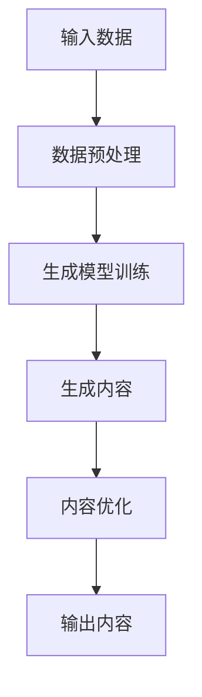
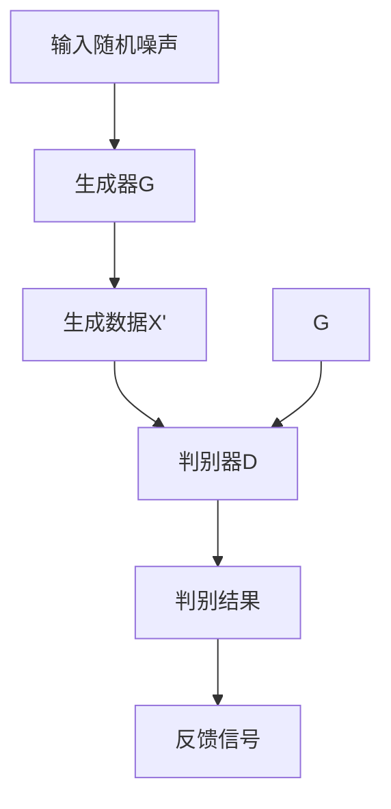
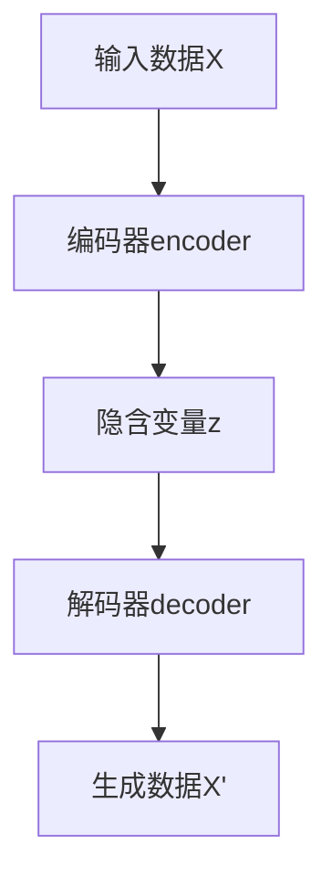

                 

### 引言

随着人工智能（AI）技术的飞速发展，生成式AI（Generative AI，简称GAI）作为一种新型的AI技术，正在逐渐改变各行各业的工作方式。生成式AI通过学习和模拟人类创造内容的能力，生成文字、图像、音乐等多种形式的内容，其应用领域已经从艺术创作扩展到了数据生成、个性化推荐、虚拟现实等众多领域。

在职业规划方面，传统的方法往往依赖于个人经验和外部建议，缺乏系统性和科学性。而生成式AI的出现，为个性化职业规划提供了新的可能性。自动化个体兴趣分析、技能水平评估、职业趋势预测等功能，使得职业规划更加精准和高效。这种技术的进步，催生了AI驱动的职业咨询（AI-driven Career Counseling），即通过AI技术和算法为个人提供定制化的职业建议和指导。

本文旨在探讨AIGC（AI-generated Content）在个性化职业规划中的应用。首先，我们将介绍AIGC技术的基本概念和原理，以及其在职业规划领域的潜在应用。接着，我们将深入探讨AIGC技术在职业咨询中的核心算法原理，并通过具体的数学模型和Python源代码进行解释。最后，我们将通过实际案例展示AIGC技术在职业规划中的应用实践，并讨论其面临的挑战和未来的发展方向。

关键词：AIGC、个性化职业规划、AI驱动的职业咨询、生成式AI、自然语言处理、个性化推荐、协同过滤、职业趋势预测。

摘要：本文探讨了AIGC技术在个性化职业规划中的应用，通过介绍AIGC的基本概念和原理，分析了其在职业咨询中的核心算法，并通过实际案例展示了其应用实践。本文旨在为读者提供对AIGC在职业规划领域应用的深入理解和实际指导。

### 第1章：AIGC与个性化职业规划概述

#### 1.1 AIGC技术简介

生成式AI（GAI）是一种能够模仿和创造人类生成内容的AI技术。它通过学习和理解大量的数据，生成与输入数据相似的新内容。生成式AI包括多种形式，如文本生成、图像生成、音乐生成等。而AIGC（AI-generated Content）是生成式AI的一个重要分支，专注于生成高质量、多样化的内容。

AIGC技术的核心概念包括：

- **生成式AI模型**：如生成对抗网络（GAN）、变分自编码器（VAE）等，这些模型通过对抗训练和自编码器机制，生成与训练数据高度相似的新内容。
- **自然语言处理（NLP）**：NLP技术使得AI能够理解和生成人类语言，是实现文本生成的重要基础。
- **内容生成流程**：从数据输入、模型训练到内容生成，AIGC技术涵盖了完整的内容生成流程。

为了更好地理解AIGC技术，我们可以使用Mermaid流程图来展示其基本架构：

#### 1.2 个性化职业规划的需求分析

个性化职业规划的关键在于准确评估个人的兴趣、技能水平、职业目标以及市场需求。这一过程需要综合考虑多个因素，形成一个综合的评估模型。以下是数学模型的一个简单表示：

$$
\text{需求分析模型} = f(\text{个人兴趣}, \text{技能水平}, \text{市场趋势}, \text{职业目标})
$$

其中，每个因素都对职业规划产生重要影响：

- **个人兴趣**：个人的兴趣和爱好直接影响职业选择的满意度和工作绩效。
- **技能水平**：个人的技能水平决定了其在职场上的竞争力和职业发展潜力。
- **市场趋势**：行业的发展和市场需求的变化对职业选择和职业发展具有导向作用。
- **职业目标**：个人的职业目标是职业规划的核心，决定了职业发展的方向和目标。

#### 1.3 AI驱动的职业咨询的优势与挑战

AI驱动的职业咨询具有以下优势：

- **精准性**：通过大数据分析和机器学习算法，AI能够提供更精准的职业评估和推荐。
- **个性化**：AI可以根据个人特点和需求，提供定制化的职业建议。
- **高效性**：AI能够快速处理大量数据，提供即时的职业咨询服务。

然而，AI驱动的职业咨询也面临一些挑战：

- **数据隐私**：职业咨询涉及个人隐私信息，如何保护用户数据是重要问题。
- **算法偏见**：算法可能存在偏见，导致推荐结果不公平。
- **人机交互**：如何设计出友好、高效的人机交互界面，提升用户体验，是一个技术难题。

综上所述，AIGC技术在个性化职业规划中具有巨大的潜力，但也需要面对一系列挑战。通过不断优化技术和完善服务，AI驱动的职业咨询有望成为未来职业规划的重要工具。

### 第2章：AIGC技术基础

#### 2.1 AIGC技术原理

AIGC技术主要包括生成式AI模型、自然语言处理（NLP）和内容生成流程。以下是对这些核心概念和原理的详细阐述。

##### 2.1.1 生成式AI基础

生成式AI的核心是生成模型，这些模型通过学习输入数据，生成与输入数据相似的新内容。以下是几个重要的生成式AI模型：

1. **生成对抗网络（GAN）**：

GAN由两个神经网络组成：生成器（Generator）和判别器（Discriminator）。生成器生成数据，判别器判断生成数据与真实数据的区别。通过对抗训练，生成器不断优化，生成越来越真实的数据。以下是GAN的基本架构：

2. **变分自编码器（VAE）**：

VAE通过概率模型生成数据。它包含编码器（Encoder）和解码器（Decoder）。编码器将数据映射到一个隐含空间，解码器从隐含空间生成数据。以下是VAE的基本架构：

##### 2.1.2 自然语言处理基础

自然语言处理（NLP）是使计算机能够理解和生成人类语言的技术。以下是NLP中几个重要的组成部分：

1. **嵌入层**：

嵌入层将词汇映射到高维空间中的向量，使得文本数据可以被机器学习模型处理。常见的嵌入方法包括词袋模型（Bag of Words，BoW）和词嵌入（Word Embedding）。

2. **神经网络**：

神经网络是NLP的基础，通过多层非线性变换，模型能够学习到输入数据的复杂结构。常见的神经网络包括循环神经网络（RNN）、长短期记忆网络（LSTM）和Transformer。

3. **注意力机制**：

注意力机制是一种在处理序列数据时，允许模型关注输入序列中某些特定部分的方法。它显著提高了模型在文本处理任务中的性能。

##### 2.1.3 内容生成流程

AIGC的内容生成流程包括数据输入、模型训练和内容生成三个主要阶段：

1. **数据输入**：

首先，从各种来源（如文本、图像、音频）收集数据，并进行预处理，以便于模型训练。

2. **模型训练**：

使用收集到的数据，训练生成模型和判别模型。生成模型学习生成与输入数据相似的新内容，判别模型用于评估生成数据的真实性。

3. **内容生成**：

在模型训练完成后，使用生成模型生成新内容。根据具体任务需求，生成的内容可能需要进一步的优化和调整。

#### 2.2 个性化职业规划算法原理

个性化职业规划算法的核心在于对用户兴趣、技能水平、职业目标和市场趋势的精准分析和推荐。以下是几个关键算法原理：

##### 2.2.1 数据收集与处理

在个性化职业规划中，数据收集是基础。我们需要收集用户的基本信息、职业历史、技能标签、职业兴趣等数据。以下是数据收集和预处理的基本步骤：

1. **数据收集**：

从用户填写问卷、职业网站、社交媒体等多种渠道收集数据。

2. **数据清洗**：

去除无效数据、填补缺失值、去除重复数据等。

3. **数据标注**：

对数据中的职业标签、技能标签等进行标注。

4. **特征提取**：

从原始数据中提取对职业规划有用的特征，如兴趣得分、技能熟练度等。

##### 2.2.2 个性化推荐算法

个性化推荐算法是职业规划中的关键组件，它基于用户兴趣和技能，推荐适合的职业路径和培训课程。以下是几种常用的个性化推荐算法：

1. **协同过滤（Collaborative Filtering）**：

协同过滤分为基于用户和基于物品的推荐。基于用户的协同过滤通过寻找与目标用户兴趣相似的其它用户，推荐他们喜欢的职业；基于物品的协同过滤通过寻找与目标职业相似的其它职业，推荐给用户。

2. **内容推荐（Content-based Filtering）**：

内容推荐基于用户兴趣和职业内容的相关性进行推荐。它通过分析用户已评价的职业内容和其特征，找到与用户兴趣相关的职业，进行推荐。

3. **用户兴趣建模（User Interest Modeling）**：

用户兴趣建模通过机器学习算法，学习用户的兴趣分布，并利用这些信息进行个性化推荐。

##### 2.2.3 职业趋势预测

职业趋势预测是职业规划中重要的一环，它可以帮助用户把握行业发展的方向，提前规划职业路径。以下是几种常见的职业趋势预测方法：

1. **时间序列分析（Time Series Analysis）**：

时间序列分析通过分析过去一段时间内职业需求的趋势，预测未来的职业需求。

2. **机器学习模型（Machine Learning Models）**：

使用机器学习模型，如回归模型、分类模型等，对职业需求进行建模和预测。

3. **文本挖掘（Text Mining）**：

文本挖掘通过分析大量文本数据，提取出职业发展的趋势和关键信息。

#### 2.2.4 数据驱动与模型评估

个性化职业规划算法的核心是数据驱动，通过大量数据分析和机器学习模型，实现对用户的精准评估和推荐。以下是对模型评估和优化的讨论：

1. **模型评估**：

使用指标如准确率、召回率、F1分数等评估模型的性能。

2. **模型优化**：

通过交叉验证、参数调整、集成学习方法等优化模型性能。

3. **用户体验**：

持续收集用户反馈，优化推荐系统，提升用户体验。

### 第3章：AIGC在职业规划中的应用

#### 3.1 职业兴趣测评与建模

职业兴趣测评是职业规划的第一步，通过了解用户的兴趣，为后续的职业推荐提供依据。以下是使用AIGC技术进行职业兴趣测评和建模的步骤：

1. **数据收集**：

从用户填写问卷、社交媒体、职业网站等多渠道收集用户兴趣数据。

2. **数据预处理**：

清洗数据，去除无效数据，对文本数据进行分词、去停用词等预处理。

3. **兴趣标签化**：

将用户的兴趣文本转换为标签化的数据，以便后续处理。

4. **兴趣建模**：

使用词嵌入技术将兴趣标签转化为向量，利用机器学习算法建立兴趣模型。

5. **兴趣分析**：

通过分析用户的兴趣向量，确定用户的主要兴趣领域。

#### 3.2 技能水平评估与推荐

技能水平评估是职业规划的另一个关键步骤，通过评估用户的技能水平，推荐适合的职业路径和培训课程。以下是使用AIGC技术进行技能水平评估与推荐的步骤：

1. **数据收集**：

从用户简历、职业测评、技能认证等多渠道收集用户技能数据。

2. **技能标签化**：

将用户的技能描述转换为标签化的数据。

3. **技能向量表示**：

使用词嵌入技术将技能标签转化为向量表示。

4. **技能评估**：

通过机器学习模型，对用户的技能水平进行评估。

5. **技能推荐**：

根据用户的技能水平和职业兴趣，推荐适合的职业路径和培训课程。

#### 3.3 职业发展趋势分析

职业发展趋势分析可以帮助用户把握行业发展的方向，为职业规划提供参考。以下是使用AIGC技术进行职业发展趋势分析的步骤：

1. **数据收集**：

从新闻报道、行业报告、社交媒体等多渠道收集职业发展趋势数据。

2. **文本挖掘**：

使用自然语言处理技术，从文本数据中提取关键信息，分析职业发展趋势。

3. **趋势预测**：

使用时间序列分析和机器学习模型，预测未来职业的发展趋势。

4. **职业推荐**：

根据职业发展趋势，为用户推荐具有前景的职业。

#### 3.4 职业咨询与互动

职业咨询与互动是AIGC在职业规划中不可或缺的一部分，通过实时互动，为用户提供个性化、即时的职业建议。以下是使用AIGC技术进行职业咨询与互动的步骤：

1. **用户交互**：

设计友好、直观的用户交互界面，收集用户的职业咨询需求。

2. **实时分析**：

利用AIGC技术，实时分析用户的兴趣、技能和职业目标。

3. **职业建议**：

根据用户的兴趣、技能和职业目标，提供个性化的职业建议。

4. **反馈机制**：

收集用户对职业建议的反馈，不断优化和调整系统。

### 第4章：AIGC在职业规划中的挑战与未来展望

#### 4.1 隐私与伦理问题

随着AIGC技术在职业规划中的应用，隐私与伦理问题逐渐凸显。以下是一些关键问题：

1. **数据隐私**：

职业规划涉及用户的个人信息，如何保护用户数据隐私是一个重要问题。需要采取严格的隐私保护措施，如数据加密、访问控制等。

2. **算法偏见**：

算法可能存在偏见，导致推荐结果不公平。需要通过算法透明性和公平性评估，减少算法偏见。

3. **伦理道德**：

职业规划需要遵循伦理道德标准，确保推荐结果符合社会价值观。

#### 4.2 技术发展展望

AIGC技术在职业规划领域具有广阔的发展前景，未来可能出现以下趋势：

1. **更智能的推荐系统**：

随着AIGC技术的进步，推荐系统将更加智能，能够提供更加精准的职业建议。

2. **多模态数据分析**：

结合文本、图像、音频等多模态数据，提高职业规划的准确性和全面性。

3. **个性化职业发展路径**：

基于用户的全生命周期数据，为用户提供个性化的职业发展路径。

4. **社会合作与共享**：

建立职业规划社区，促进用户之间的交流和合作，共享职业经验。

### 附录

#### 附录A：AIGC开发工具与资源

以下是一些常用的AIGC开发工具和资源：

1. **工具**：
   - TensorFlow：开源深度学习框架。
   - PyTorch：开源深度学习框架。
   - Hugging Face：NLP工具库。

2. **数据集**：
   -职业兴趣数据集：包含用户兴趣标签和职业信息的公开数据集。
   -技能标签数据集：包含职业技能描述和标签的公开数据集。

#### 附录B：常见问题解答

以下是一些读者可能关心的问题及其解答：

1. **AIGC技术如何确保数据隐私？**
   - AIGC技术在开发过程中，采取了严格的数据加密和访问控制措施，确保用户数据安全。

2. **算法偏见如何解决？**
   - 通过算法透明性和公平性评估，减少算法偏见。同时，不断优化算法，提升其公平性。

3. **AIGC技术在职业规划中的实际应用效果如何？**
   - 实际应用表明，AIGC技术能够提供精准、个性化的职业建议，显著提升职业规划的效率。

### 结语

本文详细探讨了AIGC在个性化职业规划中的应用。通过介绍AIGC技术的基本概念和原理，分析了其在职业咨询中的核心算法原理，并通过实际案例展示了其应用实践。本文旨在为读者提供对AIGC在职业规划领域应用的深入理解和实际指导。随着AIGC技术的不断发展和完善，我们有理由相信，它将在未来为职业规划带来更多的创新和变革。

### 作者信息

作者：AI天才研究院（AI Genius Institute）& 禅与计算机程序设计艺术（Zen And The Art of Computer Programming）

AI天才研究院致力于推动人工智能技术的发展，以创新和突破为核心，为各领域提供先进的人工智能解决方案。禅与计算机程序设计艺术则专注于计算机编程的哲学和艺术，通过深入探讨编程的本质和思维方式，帮助程序员提升编程能力和创造力。

