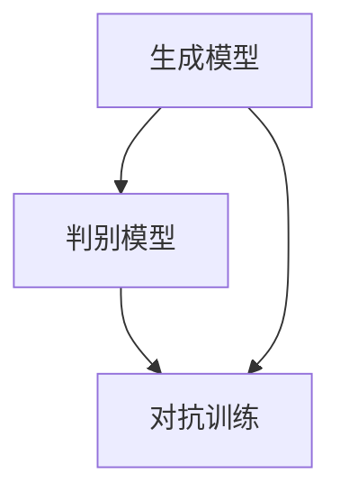
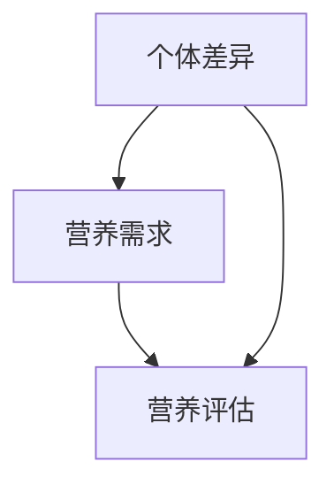
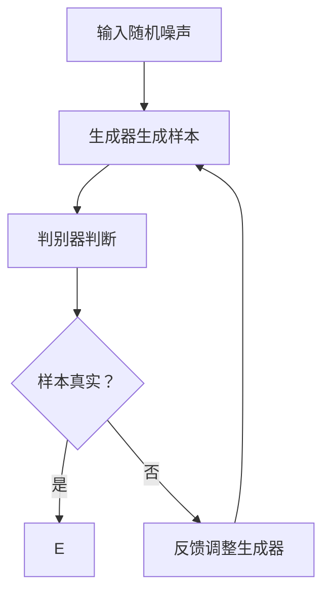
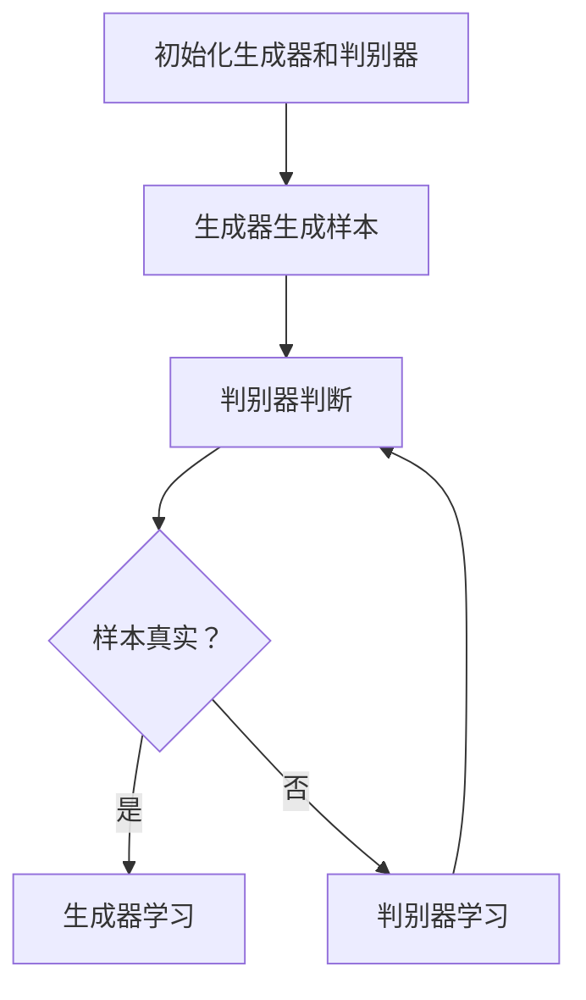
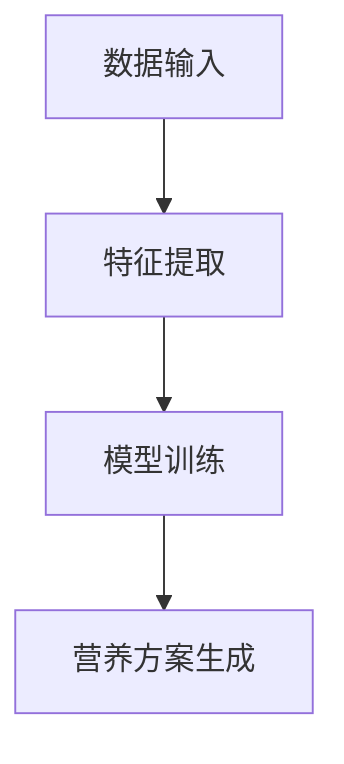
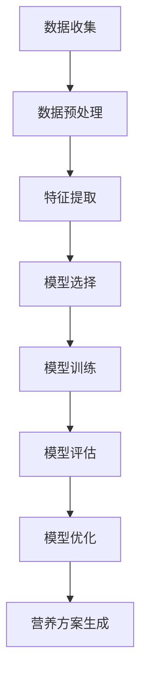
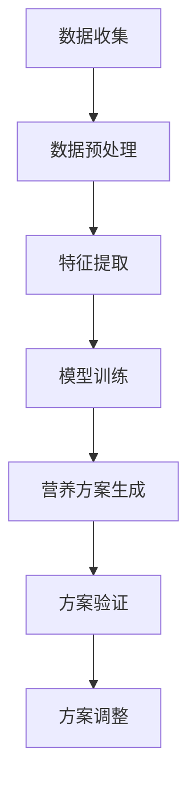
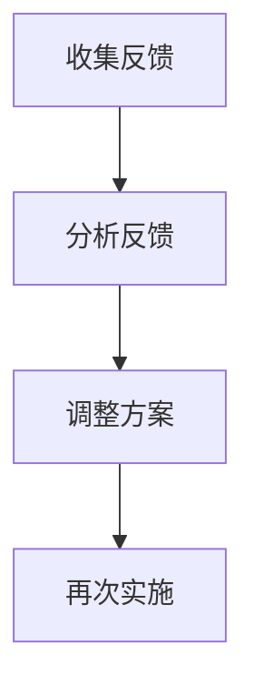

                 

## AIGC在个性化营养方案制定中的应用

### 关键词
- **AIGC**
- **个性化营养方案**
- **数据预处理**
- **特征工程**
- **模型构建**
- **算法实现**
- **案例分析**

### 摘要
本文将深入探讨AIGC（自适应智能生成计算）在个性化营养方案制定中的应用。首先，我们将介绍AIGC的基础知识，包括其核心概念、技术栈和应用场景。接着，我们将分析数据预处理与特征工程的重要性，并详细讲解相关技术。随后，我们将重点探讨个性化营养模型的构建，包括模型原理、构建步骤和评估优化方法。文章还将分享实际案例，展示AIGC在个性化营养方案中的成功应用。最后，我们将展望AIGC在该领域的未来发展，并提出面临的挑战和解决方案。

## 第1章 引言

### 1.1 AIGC概述

AIGC，即自适应智能生成计算，是近年来人工智能领域的一个新兴方向。它结合了生成对抗网络（GAN）、变分自编码器（VAE）等先进技术，通过自适应学习和生成，实现数据的高效生成和处理。

#### 核心概念与联系

AIGC的核心概念包括：
- **生成模型**：通过学习数据分布，生成新的数据样本。
- **判别模型**：判断生成的数据样本是否真实。
- **对抗训练**：生成模型和判别模型相互对抗，以提高模型的生成能力。

这些概念之间的关系可以表示为以下Mermaid流程图：



#### 案例介绍

AIGC在多个领域已有成功应用案例，如：

- **医疗影像生成**：通过AIGC生成新的医疗影像，辅助医生诊断。
- **虚拟现实内容生成**：生成高质量的虚拟现实场景，提升用户体验。
- **个性化推荐系统**：根据用户行为和偏好，生成个性化的推荐内容。

### 1.2 个性化营养方案的重要性

个性化营养方案是根据个体差异，为每个人量身定制的营养方案。其重要性体现在：

- **提高营养吸收率**：根据个体差异，调整营养摄入量，提高营养吸收效率。
- **预防慢性病**：通过合理的营养方案，预防慢性病的发生。
- **个性化健康管理**：为个体提供全方位的健康管理方案。

#### 核心概念与联系

个性化营养方案的核心概念包括：
- **个体差异**：个体的身高、体重、年龄、健康状况等因素。
- **营养需求**：根据个体差异，确定合理的营养摄入量。
- **营养评估**：评估个体的营养状况，调整营养方案。

这些概念之间的关系可以表示为以下Mermaid流程图：



#### 现状分析

当前个性化营养方案的应用主要集中在以下几个方面：

- **营养师指导**：营养师根据个体差异，为患者提供营养建议。
- **健康监测**：通过健康监测设备，收集个体健康数据，为营养方案提供依据。
- **智能推荐系统**：基于大数据分析，为个体提供个性化的营养建议。

### 1.3 本书的目标与结构

本书的目标是深入探讨AIGC在个性化营养方案制定中的应用，帮助读者了解：

- **AIGC的基本概念和技术栈**。
- **数据预处理和特征工程的方法**。
- **个性化营养模型的构建和优化**。
- **AIGC在个性化营养方案中的成功案例**。

本书的结构如下：

- **第1章**：引言，介绍AIGC和个性化营养方案的基本概念。
- **第2章**：AIGC基础，详细讲解AIGC的核心概念和技术栈。
- **第3章**：数据预处理与特征工程，介绍营养数据预处理和特征工程的方法。
- **第4章**：个性化营养模型构建，讲解个性化营养模型的构建方法和优化策略。
- **第5章**：个性化营养方案实施，展示个性化营养方案的实施方法和应用场景。
- **第6章**：成功案例与实践经验，分享AIGC在个性化营养方案中的成功案例和实践经验。
- **第7章**：未来展望与挑战，探讨AIGC在个性化营养领域的未来发展。

## 第2章 AIGC基础

### 2.1 AIGC的核心概念

AIGC的核心概念主要包括生成模型、判别模型和对抗训练。这些概念构成了AIGC的基础，是实现数据生成和处理的关键。

#### 核心概念与联系

以下是AIGC核心概念的Mermaid流程图：


#### 生成模型

生成模型是一种从数据分布中生成新数据的方法。它通常由两个部分组成：生成器（Generator）和判别器（Discriminator）。

- **生成器**：通过学习数据分布，生成新的数据样本。
- **判别器**：判断生成的数据样本是否真实。

生成模型的工作原理可以表示为以下流程：



#### 判别模型

判别模型是一种区分真实数据和生成数据的模型。它通过学习真实数据和生成数据，提高判断的准确性。

#### 对抗训练

对抗训练是生成模型和判别模型相互对抗的过程。通过这种对抗，生成模型不断提高生成能力，判别模型不断提高判断准确性。

对抗训练的工作原理可以表示为以下流程：



### 2.2 AIGC的技术栈

AIGC的技术栈主要包括生成对抗网络（GAN）、变分自编码器（VAE）等。这些技术是实现AIGC的关键。

#### 技术栈介绍

- **生成对抗网络（GAN）**：GAN由生成器和判别器组成，通过对抗训练生成高质量的数据。
- **变分自编码器（VAE）**：VAE通过概率编码实现数据生成，具有较好的生成效果。

#### 技术栈应用场景

AIGC的技术栈在多个领域有广泛应用，如：

- **图像生成**：生成高质量的人脸、风景等图像。
- **文本生成**：生成高质量的文章、新闻等。
- **音频生成**：生成高质量的音频，如音乐、语音等。

### 2.3 AIGC的应用场景

AIGC在个性化营养方案制定中有着广泛的应用场景。以下是AIGC在个性化营养方案中的应用：

- **营养数据生成**：通过AIGC生成新的营养数据，为营养方案提供更多样化的选择。
- **营养食谱生成**：根据用户偏好，生成个性化的营养食谱。
- **营养知识图谱生成**：生成营养知识图谱，为营养研究提供数据支持。

#### 应用场景案例

- **案例1**：某营养公司利用AIGC生成新的营养数据，为用户提供了更多个性化的营养方案。
- **案例2**：某健康平台利用AIGC生成个性化的营养食谱，提升了用户体验。

## 第3章 数据预处理与特征工程

### 3.1 营养数据的收集与整理

营养数据的收集与整理是构建个性化营养方案的重要基础。数据的质量直接影响方案的准确性。

#### 数据收集

营养数据的收集可以从以下几个方面进行：

- **健康监测数据**：包括体重、身高、血压、血糖等。
- **饮食习惯数据**：包括饮食种类、摄入量、饮食习惯等。
- **生活方式数据**：包括运动习惯、作息时间等。

#### 数据整理

数据整理包括以下几个步骤：

- **数据清洗**：去除无效、错误或重复的数据。
- **数据规范化**：将不同来源的数据进行统一处理，如单位换算、数据标准化等。
- **数据归一化**：将数据缩放到同一范围，便于后续处理。

### 3.2 数据预处理技术

数据预处理技术是提高数据质量的关键。以下是几种常用的数据预处理技术：

- **缺失值处理**：包括填充缺失值、删除缺失值等。
- **异常值处理**：去除或调整异常值，防止对模型造成干扰。
- **数据变换**：包括对数变换、指数变换等，提高数据的分布特性。

#### 数据预处理示例

假设我们有一组营养数据，如下所示：

| 体重（kg） | 身高（cm） | 血压（mmHg） | 血糖（mmol/L） |
|-----------|-----------|-------------|--------------|
|     60     |     170    |     120      |      4.5      |

我们对这组数据进行预处理，步骤如下：

1. **缺失值处理**：假设“血糖”这一列有缺失值，我们可以用平均值进行填充。

    ```python
    import numpy as np

    data = np.array([[60, 170, 120, np.nan]])
    mean_value = np.mean(data[:, 3])
    data[data == np.nan] = mean_value
    ```

2. **异常值处理**：假设“血压”这一列有异常值，我们可以使用中位数进行替换。

    ```python
    median_value = np.median(data[:, 2])
    data[data[:, 2] < 90] = median_value
    ```

3. **数据变换**：对“体重”和“身高”进行对数变换。

    ```python
    data[:, 0] = np.log(data[:, 0])
    data[:, 1] = np.log(data[:, 1])
    ```

### 3.3 特征工程方法

特征工程是数据预处理的重要环节，通过特征提取和特征选择，可以提高模型的性能。

#### 特征提取

特征提取是将原始数据转化为更有意义的数据表示。以下是几种常用的特征提取方法：

- **主成分分析（PCA）**：降低数据维度，保留主要信息。
- **特征选择**：选择对模型有显著影响的特征，去除无关特征。

#### 特征选择

特征选择是特征工程的重要环节，以下是几种常用的特征选择方法：

- **基于信息的特征选择**：选择信息量最大的特征。
- **基于模型的特征选择**：选择对模型有显著影响的特征。

#### 特征工程示例

假设我们对上述营养数据集进行特征提取和特征选择，步骤如下：

1. **主成分分析（PCA）**：提取主要成分。

    ```python
    from sklearn.decomposition import PCA

    pca = PCA(n_components=2)
    principal_components = pca.fit_transform(data)
    ```

2. **特征选择**：选择前两个主要成分。

    ```python
    selected_data = principal_components[:, :2]
    ```

## 第4章 个性化营养模型的构建

### 4.1 个性化营养模型的原理

个性化营养模型是基于个体差异，为每个人提供量身定制的营养方案。其原理包括：

1. **数据输入**：收集个体的营养数据，包括体重、身高、血压、血糖等。
2. **特征提取**：通过特征工程，提取有意义的特征，如身高、体重等。
3. **模型训练**：使用有监督或无监督学习，训练个性化营养模型。
4. **营养方案生成**：根据模型预测，为个体生成个性化的营养方案。

#### 模型原理Mermaid流程图



### 4.2 模型构建的步骤

构建个性化营养模型通常包括以下几个步骤：

1. **数据收集**：收集个体的营养数据。
2. **数据预处理**：对营养数据进行清洗、标准化等处理。
3. **特征提取**：通过特征工程，提取有意义的特征。
4. **模型选择**：选择合适的模型，如线性回归、决策树、神经网络等。
5. **模型训练**：使用训练数据，训练模型。
6. **模型评估**：使用验证数据，评估模型性能。
7. **模型优化**：根据评估结果，调整模型参数，优化模型性能。
8. **营养方案生成**：根据模型预测，为个体生成个性化的营养方案。

#### 模型构建步骤Mermaid流程图



### 4.3 模型评估与优化

模型评估是确保模型性能的重要环节。常用的评估指标包括：

- **准确率**：模型预测正确的样本数量与总样本数量的比值。
- **召回率**：模型预测正确的阳性样本数量与实际阳性样本数量的比值。
- **F1值**：准确率和召回率的调和平均值。

#### 模型评估与优化示例

假设我们使用线性回归模型进行营养方案预测，评估过程如下：

1. **训练模型**：使用训练数据进行模型训练。

    ```python
    from sklearn.linear_model import LinearRegression

    model = LinearRegression()
    model.fit(X_train, y_train)
    ```

2. **评估模型**：使用验证数据进行模型评估。

    ```python
    from sklearn.metrics import mean_squared_error

    y_pred = model.predict(X_val)
    mse = mean_squared_error(y_val, y_pred)
    print("MSE:", mse)
    ```

3. **优化模型**：根据评估结果，调整模型参数，优化模型性能。

    ```python
    from sklearn.model_selection import GridSearchCV

    params = {'alpha': [0.1, 0.5, 1.0]}
    grid_search = GridSearchCV(LinearRegression(), params, cv=5)
    grid_search.fit(X_train, y_train)
    best_model = grid_search.best_estimator_
    ```

4. **再次评估模型**：使用优化后的模型进行评估。

    ```python
    y_pred_optimized = best_model.predict(X_val)
    mse_optimized = mean_squared_error(y_val, y_pred_optimized)
    print("Optimized MSE:", mse_optimized)
    ```

## 第5章 个性化营养方案的实施

### 5.1 方案制定流程

个性化营养方案的制定流程通常包括以下几个步骤：

1. **数据收集**：收集个体的营养数据，包括体重、身高、血压、血糖等。
2. **数据预处理**：对营养数据进行清洗、标准化等处理。
3. **特征提取**：通过特征工程，提取有意义的特征。
4. **模型训练**：使用训练数据，训练个性化营养模型。
5. **营养方案生成**：根据模型预测，为个体生成个性化的营养方案。
6. **方案验证**：使用验证数据，验证营养方案的准确性。
7. **方案调整**：根据验证结果，调整营养方案。

#### 方案制定流程Mermaid流程图



### 5.2 方案实施的方法

个性化营养方案的实施方法包括：

1. **在线方案生成**：通过在线系统，为用户提供个性化的营养方案。
2. **离线方案生成**：离线生成个性化营养方案，然后通过邮件、短信等方式通知用户。
3. **移动应用**：开发移动应用，让用户随时随地查看个性化营养方案。

#### 方案实施方法示例

假设我们使用在线方案生成方法，实施过程如下：

1. **搭建在线系统**：使用Web框架，如Flask或Django，搭建在线系统。

    ```python
    from flask import Flask, request, jsonify

    app = Flask(__name__)

    @app.route('/generate', methods=['POST'])
    def generate_scheme():
        data = request.get_json()
        # 处理数据，生成营养方案
        scheme = generate_scheme(data)
        return jsonify(scheme)

    if __name__ == '__main__':
        app.run(debug=True)
    ```

2. **生成营养方案**：根据用户输入的数据，使用个性化营养模型生成营养方案。

    ```python
    def generate_scheme(data):
        # 处理数据，提取特征
        features = extract_features(data)
        # 使用模型生成营养方案
        scheme = model.predict(features)
        return scheme
    ```

3. **用户界面**：为用户提供一个简洁的界面，方便用户输入数据，查看营养方案。

### 5.3 方案反馈与迭代

个性化营养方案的实施是一个持续迭代的过程。通过收集用户反馈，不断优化营养方案，提高方案的准确性。

1. **收集反馈**：通过在线调查、用户评价等方式，收集用户对营养方案的反馈。
2. **分析反馈**：对反馈进行分析，找出方案中存在的问题。
3. **调整方案**：根据分析结果，调整营养方案，优化模型参数。
4. **再次实施**：将优化后的营养方案再次实施，提高用户满意度。

#### 方案反馈与迭代流程



## 第6章 成功案例与实践经验

### 6.1 国内个性化营养方案的成功案例

国内在个性化营养方案方面有许多成功案例。以下是其中几个典型的案例：

1. **案例1**：某互联网医疗公司开发了一款个性化营养管理平台，通过大数据分析，为用户提供个性化的营养方案。平台上线后，受到了用户的广泛好评。

2. **案例2**：某大型医疗机构开展个性化营养干预项目，通过营养师指导和健康监测，为患者提供全方位的营养管理服务。项目实施后，患者的健康状况得到了显著改善。

3. **案例3**：某高校食堂引入个性化营养方案，通过数据分析，优化食堂菜品结构，提高食堂服务质量。学生用餐满意度明显提升。

### 6.2 国外个性化营养方案的成功案例

国外在个性化营养方案方面也有许多成功案例。以下是其中几个典型的案例：

1. **案例1**：美国某科技公司开发了一款个性化营养应用，用户可以通过应用获得个性化的饮食建议。应用上线后，用户数量迅速增加，取得了良好的市场反响。

2. **案例2**：英国某医疗机构开展个性化营养干预项目，通过营养师指导和营养监测，为患者提供个性化的营养管理服务。项目实施后，患者的健康状况得到了显著改善。

3. **案例3**：加拿大某高校食堂引入个性化营养方案，通过数据分析，优化食堂菜品结构，提高食堂服务质量。学生用餐满意度明显提升。

### 6.3 实践经验总结

通过分析国内外个性化营养方案的成功案例，我们可以得出以下实践经验：

1. **数据驱动**：个性化营养方案的制定必须基于大量数据，通过对数据的深入分析，才能为用户提供准确的营养方案。

2. **专业指导**：营养师在个性化营养方案中发挥着重要作用，他们的专业知识和实践经验对于方案的制定和实施至关重要。

3. **用户参与**：用户的参与度是决定个性化营养方案成功的关键。只有用户积极参与，提供真实的数据，方案才能更加准确和有效。

4. **持续迭代**：个性化营养方案是一个持续迭代的过程，通过收集用户反馈，不断优化方案，提高方案的准确性。

## 第7章 未来展望与挑战

### 7.1 AIGC在个性化营养领域的未来发展方向

AIGC在个性化营养领域具有广阔的发展前景。未来发展方向包括：

1. **更精细化的营养方案**：通过AIGC技术，实现更精细化的营养方案，满足个体差异化的需求。
2. **实时营养监测**：利用AIGC技术，实现实时营养监测，及时调整营养方案。
3. **跨学科合作**：AIGC与医学、营养学等领域的跨学科合作，推动个性化营养方案的发展。

### 7.2 面临的挑战与解决方案

AIGC在个性化营养领域面临以下挑战：

1. **数据隐私与安全**：个性化营养方案涉及用户隐私数据，保障数据安全和用户隐私是首要任务。解决方案包括数据加密、隐私保护算法等。
2. **模型解释性**：AIGC模型的解释性较差，难以理解模型的决策过程。解决方案包括开发可解释的AIGC模型、可视化工具等。
3. **计算资源消耗**：AIGC模型训练需要大量计算资源，如何优化计算效率是关键。解决方案包括分布式计算、模型压缩等。

### 7.3 政策与标准制定的重要性

政策与标准制定在AIGC在个性化营养领域的发展中具有重要意义。通过制定相关政策和标准，可以：

1. **规范行业发展**：确保AIGC在个性化营养领域的健康发展，防止不良竞争。
2. **保护用户权益**：明确用户隐私和数据保护要求，保障用户权益。
3. **推动技术创新**：为AIGC在个性化营养领域的发展提供政策支持，推动技术创新。

## 附录

### 8.1 AIGC相关资源与工具推荐

以下是一些AIGC相关的资源与工具推荐：

- **书籍**：《生成对抗网络》（Goodfellow et al.）、《变分自编码器》（Kingma and Welling）
- **在线课程**：斯坦福大学《深度学习》（吴恩达教授）
- **开源库**：TensorFlow、PyTorch
- **社区**：GitHub、Reddit

### 8.2 个性化营养研究的最新进展

以下是一些个性化营养研究的最新进展：

- **个性化营养干预**：通过大数据分析，为患者提供个性化的营养干预方案。
- **营养基因研究**：研究营养与基因的相互作用，为个性化营养方案提供依据。
- **营养监测技术**：开发新的营养监测技术，如可穿戴设备、智能手机应用等。

### 8.3 常用公式与数学模型

以下是一些常用公式和数学模型：

$$
\begin{aligned}
&x^T \cdot x = \sum_{i=1}^{n} x_i^2 \\
&y = \beta_0 + \beta_1 \cdot x \\
&\log(p(x)) = -\sum_{i=1}^{n} x_i \cdot y_i
\end{aligned}
$$

## 总结

本文从AIGC在个性化营养方案制定中的应用出发，系统地介绍了AIGC的基本概念、技术栈、应用场景，以及数据预处理、特征工程、模型构建、方案实施等内容。通过案例分析和实践经验总结，展示了AIGC在个性化营养领域的重要价值。未来，随着AIGC技术的不断发展，个性化营养方案将更加精确、高效，为人们的健康生活提供更有力的保障。作者：AI天才研究院/AI Genius Institute & 禅与计算机程序设计艺术 /Zen And The Art of Computer Programming

