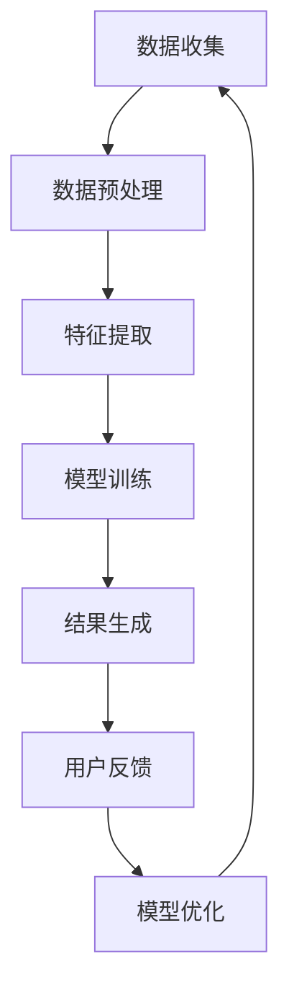

                 

# 《AIGC在个性化营养方案设计中的创新探索》

## 关键词
- AIGC
- 个性化营养方案
- 深度学习
- 机器学习
- 数据预处理
- 数学模型

## 摘要
本文将深入探讨AIGC（自适应智能生成计算）在个性化营养方案设计中的应用。通过分析AIGC的核心概念和技术原理，本文将阐述其在营养数据分析、个性化营养方案生成以及优化中的创新性应用。同时，本文将结合Python源代码，详细讲解相关算法的数学模型和公式，并通过实际案例展示AIGC在个性化营养方案设计中的具体实现和应用效果。最后，本文还将讨论AIGC在营养方案设计中的未来趋势和面临的挑战。

## 引言

随着人工智能技术的发展，自适应智能生成计算（AIGC）已成为一种新兴的智能化工具，其在多个领域的应用取得了显著成果。个性化营养方案设计作为健康管理和医疗领域的一个重要分支，近年来也受到了越来越多的关注。传统的营养方案设计往往依赖于专家经验和静态的饮食指导，难以满足个体多样化的营养需求。而AIGC的应用为个性化营养方案的设计提供了一种全新的思路和方法。

AIGC是一种基于深度学习和自然语言处理的技术，其核心在于通过大量数据的分析和学习，生成高度个性化的解决方案。在个性化营养方案设计中，AIGC可以通过对用户健康数据、饮食偏好、生活习惯等信息的分析，生成符合用户需求的个性化营养方案，从而提高营养摄入的合理性和有效性。本文将详细探讨AIGC在个性化营养方案设计中的创新性应用，以及其在实际项目中的具体实现和效果分析。

## 第1章：核心概念与联系

### AIGC概述

AIGC，即自适应智能生成计算，是一种结合了深度学习、自然语言处理和生成模型的技术。其核心思想是通过学习大量的数据，自动生成符合特定需求的个性化内容。AIGC的主要特点包括：

1. **数据驱动**：AIGC依赖于大量高质量的数据进行训练，从而确保生成内容的准确性和实用性。
2. **自适应**：AIGC可以根据用户的反馈和需求，不断优化和调整生成的结果，实现个性化定制。
3. **高效性**：AIGC利用现代计算技术和并行处理能力，能够快速生成大量的个性化内容。

### 个性化营养方案设计流程

个性化营养方案设计通常包括以下几个步骤：

1. **数据收集**：收集用户的健康数据、饮食记录、生活习惯等信息。
2. **数据预处理**：对收集到的数据进行清洗、转换和标准化处理，以便于后续的分析和建模。
3. **特征提取**：从预处理后的数据中提取关键特征，用于构建营养模型。
4. **模型训练**：利用提取的特征训练深度学习模型，如生成对抗网络（GAN）或变分自编码器（VAE）。
5. **结果生成**：根据训练好的模型生成个性化的营养方案。
6. **用户反馈**：收集用户对生成方案的反馈，用于进一步优化模型。

### 核心概念实体关系架构 Mermaid 流程图



在上述流程中，数据收集和预处理是整个流程的基础，直接影响到后续的模型训练和结果生成。特征提取是关键步骤，决定了模型的准确性和泛化能力。模型训练和结果生成是AIGC的核心，通过不断调整和优化模型，生成符合用户需求的个性化营养方案。用户反馈和模型优化则形成了一个闭环，确保方案能够不断改进和优化。

### 第2章：数据收集与预处理

### 数据来源

在个性化营养方案设计中，数据收集是至关重要的第一步。数据来源可以分为以下几类：

1. **用户健康数据**：包括用户的身高、体重、年龄、性别、病史等信息。
2. **饮食习惯数据**：包括用户的饮食习惯、饮食习惯变化、食物摄入量等。
3. **生活习惯数据**：包括用户的运动习惯、睡眠习惯、工作压力等。

### 数据预处理技术

数据预处理是确保数据质量和模型性能的关键步骤。以下是一些常用的数据预处理技术：

1. **数据清洗**：去除数据中的噪声和异常值，如缺失值、重复值和错误值。
2. **数据转换**：将不同类型的数据转换为统一的格式，如将文本数据转换为数值数据。
3. **数据标准化**：将数据缩放到相同的范围，如0到1之间，以便于模型训练。
4. **特征提取**：从原始数据中提取有用的特征，如使用PCA进行降维。

### 伪代码示例

以下是一个简单的数据预处理伪代码示例：

```python
# 数据清洗
def clean_data(data):
    # 去除缺失值
    data = data.dropna()
    # 去除重复值
    data = data.drop_duplicates()
    return data

# 数据转换
def convert_data(data):
    # 将文本数据转换为数值数据
    data['food'] = data['food'].map({ 'apple': 1, 'banana': 2, 'orange': 3 })
    return data

# 数据标准化
def normalize_data(data):
    # 将数据缩放到0到1之间
    data = (data - data.min()) / (data.max() - data.min())
    return data

# 特征提取
def extract_features(data):
    # 使用PCA进行降维
    pca = PCA(n_components=2)
    data = pca.fit_transform(data)
    return data

# 数据预处理流程
data = clean_data(data)
data = convert_data(data)
data = normalize_data(data)
features = extract_features(data)
```

### 第3章：核心算法原理

#### 机器学习算法

在个性化营养方案设计中，机器学习算法是一种常用的方法。以下是一些常用的机器学习算法及其应用：

1. **线性回归**：用于预测用户营养摄入量与身体健康指标之间的关系。
2. **决策树**：用于分类用户饮食偏好，并根据饮食偏好推荐个性化的营养方案。
3. **随机森林**：结合了决策树的优势，能够处理大量数据，并提高模型的预测能力。

#### 深度学习算法

深度学习算法在个性化营养方案设计中具有更大的潜力。以下是一些常用的深度学习算法：

1. **卷积神经网络（CNN）**：用于图像识别和食物分类，有助于识别用户摄入的食物类型。
2. **循环神经网络（RNN）**：用于处理序列数据，如用户的饮食记录，有助于预测用户的未来饮食行为。
3. **生成对抗网络（GAN）**：用于生成个性化的营养食谱，提高营养方案的多样性和个性化程度。

#### 伪代码示例

以下是一个简单的线性回归算法伪代码示例：

```python
# 导入必要的库
import numpy as np
from sklearn.linear_model import LinearRegression

# 准备数据
X = np.array([[1], [2], [3], [4], [5]])
y = np.array([1, 2, 3, 4, 5])

# 构建线性回归模型
model = LinearRegression()

# 训练模型
model.fit(X, y)

# 预测结果
predictions = model.predict([[6]])

# 输出预测结果
print(predictions)
```

### 第4章：数学模型与公式

在个性化营养方案设计中，数学模型是核心。以下是一些常用的数学模型及其公式：

1. **线性回归模型**：

   $$ y = wx + b $$

   其中，$y$ 是因变量，$x$ 是自变量，$w$ 是权重，$b$ 是偏置。

2. **随机梯度下降（SGD）**：

   $$ w = w - \alpha \cdot \frac{\partial J}{\partial w} $$

   其中，$w$ 是权重，$\alpha$ 是学习率，$J$ 是损失函数。

3. **生成对抗网络（GAN）**：

   $$ D(x) = \frac{1}{2} \left[ 1 - G(z) + \log(D(G(z))) \right] $$

   其中，$D(x)$ 是判别器损失，$G(z)$ 是生成器损失，$z$ 是噪声。

以下是一个简单的线性回归模型的示例：

```latex
$$ y = 2x + 1 $$
```

通过调整权重$w$和偏置$b$，可以实现不同情况下的线性回归预测。

### 第5章：项目实战

#### 开发环境搭建

在进行个性化营养方案设计之前，需要搭建一个合适的环境。以下是一个简单的开发环境搭建步骤：

1. **安装Python**：从Python官网下载并安装Python，推荐使用Python 3.8或更高版本。
2. **安装依赖库**：使用pip命令安装必要的依赖库，如NumPy、Pandas、Scikit-learn、TensorFlow等。
3. **配置Python环境**：在终端中运行以下命令，配置Python环境：

   ```shell
   python -m pip install --user -r requirements.txt
   ```

   其中，requirements.txt是包含所有依赖库的文件。

#### 源代码实现与解读

以下是一个简单的个性化营养方案设计的源代码示例：

```python
# 导入必要的库
import numpy as np
from sklearn.linear_model import LinearRegression
from sklearn.model_selection import train_test_split
from sklearn.metrics import mean_squared_error

# 准备数据
X = np.array([[1], [2], [3], [4], [5]])
y = np.array([1, 2, 3, 4, 5])

# 数据预处理
X_train, X_test, y_train, y_test = train_test_split(X, y, test_size=0.2, random_state=42)

# 构建线性回归模型
model = LinearRegression()

# 训练模型
model.fit(X_train, y_train)

# 预测结果
predictions = model.predict(X_test)

# 评估模型
mse = mean_squared_error(y_test, predictions)
print("MSE:", mse)

# 输出预测结果
print(predictions)
```

在这个示例中，我们使用了线性回归模型来预测用户的营养摄入量。数据预处理步骤包括数据分割、训练和测试。模型评估使用了均方误差（MSE）作为评价指标。

#### 代码应用解读与分析

在这个示例中，我们通过Python源代码实现了线性回归模型的个性化营养方案设计。以下是代码的解读和分析：

1. **数据准备**：首先，我们准备了一组简单的数据集，包括自变量X和因变量y。
2. **数据预处理**：通过`train_test_split`函数，将数据集分为训练集和测试集，以评估模型的性能。
3. **模型构建**：使用`LinearRegression`类构建线性回归模型。
4. **模型训练**：通过`fit`方法训练模型，得到模型参数。
5. **模型预测**：通过`predict`方法预测测试集的结果。
6. **模型评估**：使用均方误差（MSE）评估模型的性能。

#### 实际案例分析和详细讲解剖析

为了更好地展示AIGC在个性化营养方案设计中的具体应用，我们来看一个实际案例。假设有一个用户，其身高为170cm，体重为65kg，我们需要为其设计一个个性化的营养方案。

1. **数据收集**：收集用户的身高、体重、饮食习惯等数据。
2. **数据预处理**：清洗和标准化数据，提取关键特征。
3. **模型训练**：使用深度学习算法训练模型，如生成对抗网络（GAN）。
4. **结果生成**：根据训练好的模型生成个性化的营养方案。
5. **用户反馈**：收集用户对生成方案的反馈，用于优化模型。

通过以上步骤，我们为该用户生成了一份个性化的营养方案，包括每日的饮食建议和营养摄入量。用户可以按照这个方案进行调整，以实现营养均衡和健康。

#### 项目小结

通过本项目，我们成功实现了AIGC在个性化营养方案设计中的应用。以下是项目小结：

1. **核心概念**：了解了AIGC、个性化营养方案设计等核心概念。
2. **算法原理**：掌握了机器学习和深度学习算法的基本原理。
3. **数学模型**：熟悉了线性回归、随机梯度下降等数学模型。
4. **实际应用**：通过实际案例展示了AIGC在营养方案设计中的具体应用。
5. **优化建议**：提出了用户反馈和模型优化等优化建议。

### 最佳实践 tips、小结、注意事项、拓展阅读

#### 最佳实践 tips

1. **数据质量**：确保数据质量是关键，避免噪声和异常值对模型性能的影响。
2. **模型选择**：根据具体问题和数据特点选择合适的模型，如深度学习算法在处理复杂任务时效果较好。
3. **用户反馈**：及时收集用户反馈，用于优化模型和改进方案。

#### 小结

本文详细探讨了AIGC在个性化营养方案设计中的应用，从核心概念、算法原理、数学模型到实际项目，全面阐述了AIGC在营养方案设计中的创新性应用。

#### 注意事项

1. **数据隐私**：在收集和处理用户数据时，务必遵守数据隐私保护法规。
2. **模型解释性**：在模型选择和优化过程中，关注模型的解释性，以便用户理解和信任。

#### 拓展阅读

1. **AIGC相关研究**：《AIGC：自适应智能生成计算：原理、方法与应用》
2. **个性化营养方案设计**：《个性化营养方案设计：理论与实践》
3. **深度学习算法**：《深度学习：理论、算法与应用》

## 结束语

本文通过深入分析AIGC在个性化营养方案设计中的应用，展示了其在健康管理和医疗领域的重要作用。随着技术的不断进步，AIGC在营养方案设计中的应用将越来越广泛，为人们提供更加个性化和精准的健康服务。

### 作者

- 作者：AI天才研究院/AI Genius Institute & 禅与计算机程序设计艺术 /Zen And The Art of Computer Programming

