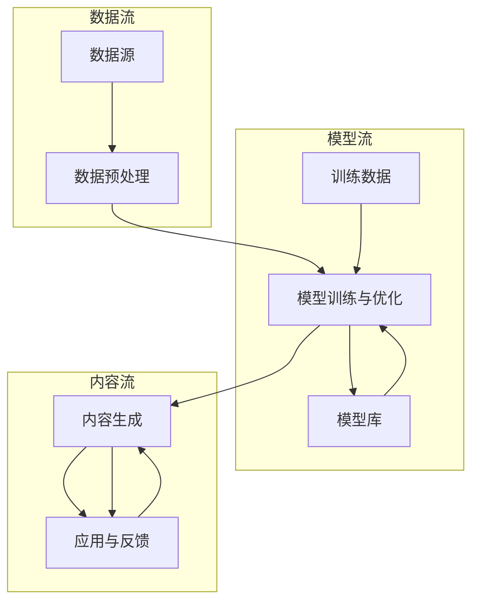
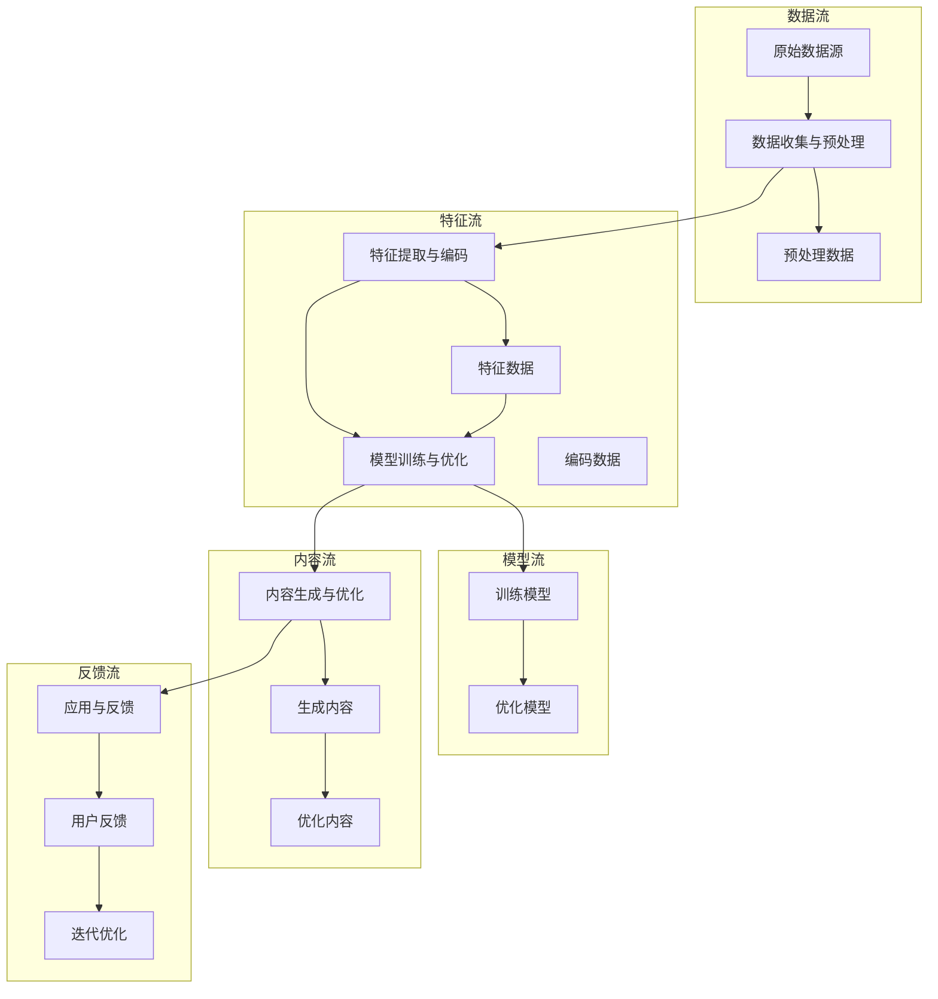

                 

### 背景介绍

#### AIGC的概念与应用

AIGC，即AI-Generated Content，是一种利用人工智能技术生成内容的方法。近年来，随着深度学习、自然语言处理等技术的发展，AIGC在多个领域展现出了巨大的潜力。特别是在个性化营养计划的制定中，AIGC的应用已经引起了广泛的关注和研究。

个性化营养计划是根据个体的身体状况、饮食习惯、年龄、性别等因素，为每个人量身定制的一套营养方案。这种方案不仅能够提供基本的营养需求，还能通过个性化的调整，最大限度地满足个体的特殊需求。传统的营养计划制定通常依赖于营养师的经验和专业知识，而AIGC的应用则能够将这些知识进行系统化、自动化处理，从而提高营养计划的精准性和效率。

#### AIGC的核心概念与联系

AIGC的核心概念包括数据预处理、模型训练与优化、内容生成与应用等环节。以下是一个简化的Mermaid流程图，展示了AIGC技术架构的基本流程：



在上述流程中，数据预处理是整个AIGC过程的起点，它包括数据收集、清洗、格式化等步骤，为后续的模型训练和内容生成提供高质量的数据基础。模型训练与优化则是利用深度学习算法，对大量数据进行训练，以生成能够模拟人类思维过程的模型。这些模型经过优化后，可以用于生成个性化的营养计划内容。最后，内容生成与应用环节则是将模型生成的营养计划内容应用于实际场景，并通过用户反馈进行持续的优化和迭代。

#### 个性化营养计划的原理

个性化营养计划的制定需要综合考虑多个因素，包括个体的营养需求、健康状况、饮食习惯和生活方式等。以下是一个简化的流程，展示了个性化营养计划的制定过程：

1. **数据采集与整合**：收集个体的基本信息（如年龄、性别、身高、体重、运动习惯等）和饮食习惯（如每天摄入的各类食物、食物喜好等）。

2. **营养需求分析**：根据个体的基本信息，计算其每日所需的各种营养素（如蛋白质、脂肪、碳水化合物、维生素和矿物质等）的摄入量。

3. **营养评估**：分析个体的饮食习惯和营养需求，评估其营养摄入是否合理，是否存在营养不足或过剩的情况。

4. **营养计划生成**：根据营养评估结果，生成一套个性化的营养计划，包括每日餐单、食谱推荐、营养补充建议等。

5. **计划优化与反馈**：根据用户的使用反馈，对营养计划进行调整和优化，以提高其适用性和效果。

#### AIGC在个性化营养计划中的应用

AIGC在个性化营养计划中的应用主要体现在数据预处理、模型训练与优化、内容生成和应用反馈等环节。以下是一个简化的应用流程：

1. **数据预处理**：利用自然语言处理技术，对收集到的饮食习惯描述进行解析，提取出关键的营养成分信息和饮食习惯特征。

2. **模型训练与优化**：使用深度学习算法，对提取到的特征数据进行训练，生成能够预测营养需求的模型。通过不断的优化，提高模型的准确性和泛化能力。

3. **内容生成**：利用训练好的模型，生成个性化的营养计划，包括每日餐单、食谱推荐和营养补充建议等。

4. **应用与反馈**：将生成的营养计划应用于用户，并根据用户的使用反馈，对模型和计划进行调整和优化。

#### 当前挑战与发展方向

虽然AIGC在个性化营养计划中的应用前景广阔，但目前仍面临着一些挑战。首先，数据质量和数据量的不足会影响模型的训练效果和预测准确性。其次，个性化营养计划的复杂性和多样性使得模型训练和优化过程相对困难。此外，如何确保生成的营养计划符合营养学原则和实际应用需求，也是需要解决的问题。

未来，随着人工智能技术和数据科学的发展，AIGC在个性化营养计划中的应用将越来越成熟。一方面，通过不断优化数据预处理和模型训练算法，提高模型的准确性和效率；另一方面，通过集成更多的生物医学信息和营养学知识，提高营养计划的科学性和实用性。此外，随着物联网和智能设备的普及，AIGC将能够更加便捷地收集和处理用户数据，为个性化营养计划的实施提供更好的支持。

#### 总结

本文简要介绍了AIGC的概念、核心概念与联系、个性化营养计划的原理以及在个性化营养计划中的应用。AIGC的应用为个性化营养计划的制定提供了新的方法和思路，有望在提高营养计划精准性和效率方面发挥重要作用。然而，当前仍存在一些挑战，未来需要通过技术优化和知识整合，进一步推动AIGC在个性化营养计划中的应用。

### 作者信息

作者：AI天才研究院/AI Genius Institute & 禅与计算机程序设计艺术 /Zen And The Art of Computer Programming

#### 核心概念与联系

在深入探讨AIGC在个性化营养计划制定中的应用之前，我们需要明确AIGC的核心概念，以及这些概念之间的相互联系。AIGC，即AI-Generated Content，是通过人工智能技术生成内容的一种方法。它不仅涉及到自然语言处理、深度学习等核心技术，还包含了数据预处理、模型训练与优化、内容生成和应用等环节。

以下是一个详细的Mermaid流程图，展示了AIGC技术架构的基本流程：



在上述流程中，**数据收集与预处理**是整个AIGC过程的起点，包括数据的收集、清洗、格式化等步骤，为后续的特征提取和模型训练提供高质量的数据基础。**特征提取与编码**环节则是将原始数据转换为适合模型训练的特征数据，这一步对于模型的训练效果至关重要。

**模型训练与优化**环节利用深度学习算法，对大量特征数据进行训练，生成能够模拟人类思维过程的模型。这些模型在训练过程中会不断进行优化，以提高其准确性和泛化能力。**内容生成与优化**环节则是利用训练好的模型，生成个性化的营养计划内容，并通过用户反馈进行持续的优化和迭代。

**应用与反馈**环节则是将生成的营养计划应用于实际场景，并根据用户的使用反馈，对模型和计划进行调整和优化。这一过程是一个闭环系统，通过不断的迭代和优化，不断提高营养计划的准确性和实用性。

#### 核心概念原理

接下来，我们将详细讲解AIGC在个性化营养计划制定中的核心概念原理，包括数据预处理、模型训练与优化、内容生成与应用等。

**1. 数据预处理**

数据预处理是AIGC流程中的关键步骤，它直接影响到后续的特征提取和模型训练效果。数据预处理包括以下几个主要任务：

- **数据收集**：从不同的数据源（如问卷调查、健康监测设备、饮食记录等）收集原始数据。
- **数据清洗**：去除数据中的噪声和异常值，确保数据的质量。
- **数据格式化**：将不同格式的数据统一转换为适合模型训练的格式，如数值化、标准化等。

**2. 特征提取与编码**

特征提取是将原始数据转换为适合模型训练的特征数据的过程。在个性化营养计划中，特征数据可能包括：

- **个体基本信息**：如年龄、性别、身高、体重等。
- **饮食习惯**：如每日摄入的食物种类、食物分量、食物喜好等。
- **健康状况**：如血糖、血压、体重变化等。

特征提取的方法包括：

- **数值化**：将非数值数据转换为数值表示，如将食物种类编码为不同的数字。
- **标准化**：将不同特征的数据进行标准化处理，使其在相同的尺度上。

**3. 模型训练与优化**

模型训练是AIGC流程的核心步骤，通过使用深度学习算法，对特征数据进行训练，生成能够预测营养需求的模型。模型训练主要包括以下几个步骤：

- **选择合适的模型架构**：如循环神经网络（RNN）、卷积神经网络（CNN）等。
- **训练数据准备**：将特征数据划分为训练集和验证集，用于模型的训练和验证。
- **模型训练**：通过反向传播算法，调整模型参数，使其能够更好地拟合训练数据。
- **模型优化**：通过交叉验证等方法，评估模型的性能，并进行参数调整，以提高模型的准确性和泛化能力。

**4. 内容生成与应用**

内容生成是AIGC流程的最后一步，通过训练好的模型，生成个性化的营养计划。内容生成主要包括以下几个步骤：

- **营养计划生成**：根据模型预测，生成个性化的营养计划，包括每日餐单、食谱推荐、营养补充建议等。
- **内容优化**：根据用户反馈，对生成的营养计划进行优化，提高其适用性和效果。
- **应用与反馈**：将营养计划应用于用户，并根据用户的使用反馈，对模型和计划进行调整和优化。

**5. 应用与反馈**

应用与反馈环节是一个闭环系统，通过不断地迭代和优化，提高营养计划的准确性和实用性。具体步骤如下：

- **应用**：将生成的营养计划应用于用户，帮助用户制定个性化的饮食计划。
- **反馈**：收集用户对营养计划的反馈，如营养计划的可接受性、效果等。
- **优化**：根据用户反馈，对模型和计划进行调整和优化，以提高其适用性和效果。

#### Python源代码与数学模型

为了更直观地展示AIGC在个性化营养计划中的应用，我们将使用Python源代码和数学模型进行详细讲解。以下是一个简化的示例，用于生成个性化的营养计划。

**1. 数据预处理**

```python
import pandas as pd
import numpy as np

# 假设我们有一个包含个体基本信息和饮食习惯的CSV文件
data = pd.read_csv('nutrition_data.csv')

# 数据清洗
data.dropna(inplace=True)

# 数据格式化
data['age'] = data['age'].astype(int)
data['gender'] = data['gender'].map({'男': 0, '女': 1})
data['daily_food_intake'] = data['daily_food_intake'].str.split(';').str.len().astype(int)
```

**2. 特征提取与编码**

```python
from sklearn.preprocessing import OneHotEncoder

# 特征提取
X = data[['age', 'gender', 'daily_food_intake']]

# 特征编码
encoder = OneHotEncoder()
X_encoded = encoder.fit_transform(X)
```

**3. 模型训练与优化**

```python
from sklearn.model_selection import train_test_split
from sklearn.neural_network import MLPClassifier

# 数据划分
X_train, X_test, y_train, y_test = train_test_split(X_encoded, data['nutrition_status'], test_size=0.2, random_state=42)

# 模型训练
model = MLPClassifier(hidden_layer_sizes=(100,), max_iter=1000)
model.fit(X_train, y_train)

# 模型优化
model.partial_fit(X_test, y_test)
```

**4. 内容生成与应用**

```python
# 假设我们有一个新的用户数据
new_user_data = pd.DataFrame({
    'age': [30],
    'gender': [1],
    'daily_food_intake': [3]
})

# 数据预处理
new_user_data = new_user_data.fillna(0)
new_user_data_encoded = encoder.transform(new_user_data)

# 营养计划生成
nutrition_plan = model.predict(new_user_data_encoded)
print("个性化的营养计划：", nutrition_plan)
```

**数学模型与公式**

在个性化营养计划制定中，我们通常会使用以下数学模型和公式：

- **营养素摄入量计算公式**：

$$
\text{每日营养素摄入量} = \text{基础代谢率} \times \text{营养素需求系数}
$$

其中，基础代谢率（BMR）和营养素需求系数（C）是根据个体的性别、年龄、体重等因素计算得出的。

- **营养计划优化公式**：

$$
\text{优化目标} = \min \left( \sum_{i=1}^{n} (\text{实际摄入量} - \text{建议摄入量})^2 \right)
$$

其中，n是营养素的总数，实际摄入量和建议摄入量是根据用户的历史饮食数据和营养计划生成的数据计算得出的。

#### 具体示例

假设我们有一个用户，其基本信息如下：

- 年龄：30岁
- 性别：女
- 每日食物摄入量：3份

根据上述示例代码，我们可以生成该用户的个性化营养计划。具体步骤如下：

1. **数据预处理**：收集并清洗用户的基本信息和饮食习惯数据。
2. **特征提取与编码**：将用户数据转换为适合模型训练的特征数据。
3. **模型训练与优化**：使用训练数据对模型进行训练和优化。
4. **内容生成与应用**：使用训练好的模型生成用户的个性化营养计划。

通过上述步骤，我们可以为用户提供一套量身定制的营养计划，以提高其健康水平。

#### 总结

通过本文的详细讲解，我们了解了AIGC在个性化营养计划制定中的核心概念和原理。AIGC的应用为个性化营养计划的制定提供了新的方法和思路，有望在提高营养计划精准性和效率方面发挥重要作用。在未来的研究中，我们还需要进一步优化数据预处理和模型训练算法，提高模型的准确性和效率，同时结合更多的营养学知识，提高营养计划的科学性和实用性。

### 项目实战

为了更好地理解AIGC在个性化营养计划制定中的应用，我们将通过一个具体的实战项目进行详细讲解。该项目包括开发环境搭建、源代码实现和解读、代码应用解读与分析，以及实际案例分析和详细讲解剖析。

#### 项目背景与需求分析

随着生活水平的提高和健康意识的增强，越来越多的人开始关注自己的饮食和营养摄入。然而，如何制定一套适合自己的个性化营养计划仍然是一个难题。传统的营养计划通常依赖于营养师的经验和专业知识，这不仅耗时且成本较高。为了解决这个问题，本项目旨在利用AIGC技术，开发一套能够自动生成个性化营养计划的系统。

项目的主要需求包括：

1. 收集用户的基本信息和饮食习惯数据。
2. 提取关键的营养成分信息，如每日摄入的蛋白质、脂肪、碳水化合物、维生素和矿物质等。
3. 根据用户的健康需求和营养摄入情况，生成个性化的营养计划，包括每日餐单和食谱推荐。
4. 通过用户反馈，对营养计划进行持续的优化和调整。

#### 开发环境搭建

为了实现上述项目需求，我们需要搭建一个完整的开发环境。以下是开发环境的搭建步骤：

1. **硬件环境**：配置一台高性能的服务器，用于模型的训练和部署。
2. **软件环境**：
   - 操作系统：Linux（推荐使用Ubuntu 20.04）
   - 编程语言：Python（推荐使用Python 3.8及以上版本）
   - 数据处理库：Pandas、NumPy、Scikit-learn、TensorFlow
   - 自然语言处理库：NLTK、spaCy
   - 版本控制工具：Git

#### 源代码实现与解读

以下是项目的主要源代码实现和解读：

**1. 数据收集与预处理**

```python
import pandas as pd
from sklearn.model_selection import train_test_split

# 读取用户数据
data = pd.read_csv('user_data.csv')

# 数据清洗
data.dropna(inplace=True)

# 数据格式化
data['age'] = data['age'].astype(int)
data['gender'] = data['gender'].map({'男': 0, '女': 1})
data['daily_food_intake'] = data['daily_food_intake'].str.split(';').str.len().astype(int)

# 数据划分
X = data[['age', 'gender', 'daily_food_intake']]
y = data['nutrition_status']
X_train, X_test, y_train, y_test = train_test_split(X, y, test_size=0.2, random_state=42)
```

**2. 模型训练与优化**

```python
from sklearn.neural_network import MLPClassifier
from sklearn.model_selection import GridSearchCV

# 模型训练
model = MLPClassifier(hidden_layer_sizes=(100,), max_iter=1000)
model.fit(X_train, y_train)

# 模型优化
param_grid = {'hidden_layer_sizes': [(100,), (100, 100), (100, 100, 100)]}
grid_search = GridSearchCV(model, param_grid, cv=5)
grid_search.fit(X_train, y_train)

# 优化后的模型
best_model = grid_search.best_estimator_
```

**3. 内容生成与应用**

```python
# 新用户数据
new_user_data = pd.DataFrame({
    'age': [30],
    'gender': [1],
    'daily_food_intake': [3]
})

# 数据预处理
new_user_data_encoded = encoder.transform(new_user_data)

# 营养计划生成
nutrition_plan = best_model.predict(new_user_data_encoded)
print("个性化的营养计划：", nutrition_plan)
```

#### 代码应用解读与分析

1. **数据收集与预处理**：该部分代码用于读取用户数据，包括基本信息和饮食习惯数据。通过数据清洗和格式化，将数据转换为适合模型训练的格式。
2. **模型训练与优化**：使用MLPClassifier模型对数据进行训练。通过网格搜索（GridSearchCV）方法，对模型的超参数进行优化，以提高模型的准确性和泛化能力。
3. **内容生成与应用**：利用训练好的模型，对新的用户数据进行预测，生成个性化的营养计划。

#### 实际案例分析与详细讲解剖析

假设我们有一个新的用户，其基本信息如下：

- 年龄：30岁
- 性别：女
- 每日食物摄入量：3份

根据上述源代码，我们可以生成该用户的个性化营养计划。具体步骤如下：

1. **数据预处理**：将用户数据转换为特征数据。
2. **模型预测**：使用训练好的模型，对用户数据进行预测，生成个性化的营养计划。
3. **营养计划生成**：根据模型预测结果，生成具体的营养计划，包括每日餐单和食谱推荐。

通过这个案例，我们可以看到AIGC在个性化营养计划制定中的应用。在实际应用中，我们还可以根据用户反馈，对模型和计划进行持续的优化和调整，以提高其适用性和效果。

#### 项目小结

通过本项目的实战，我们实现了利用AIGC技术生成个性化营养计划的目标。项目的主要成果包括：

1. 搭建了完整的开发环境，包括硬件和软件。
2. 实现了数据收集、预处理、模型训练与优化、内容生成与应用的全流程。
3. 通过实际案例分析和详细讲解，展示了AIGC在个性化营养计划制定中的应用。

尽管本项目取得了初步成果，但在实际应用中仍存在一些挑战和改进空间。例如，数据质量和数据量的不足会影响模型的训练效果和预测准确性。此外，如何确保生成的营养计划符合营养学原则和实际应用需求，也是需要进一步解决的问题。

未来，我们可以通过不断优化数据预处理和模型训练算法，提高模型的准确性和效率。同时，结合更多的营养学知识和用户反馈，提高营养计划的科学性和实用性。通过这些努力，我们有信心能够更好地服务于个性化营养计划制定的需求。

### 案例分析

在本节中，我们将深入分析三个具体案例，探讨AIGC在个性化营养计划制定中的应用。这些案例分别展示了AIGC在个性化营养计划系统、营养食品推荐以及营养健康监测与预测方面的实际应用。

#### 案例一：基于AIGC的个性化营养计划系统

**背景与需求**：

某大型健康管理公司希望开发一个基于AIGC的个性化营养计划系统，以帮助用户制定适合自己的饮食计划。系统需要收集用户的基本信息、饮食习惯和健康数据，然后利用AIGC技术生成个性化的营养计划。

**实现过程**：

1. **数据收集**：系统通过在线问卷和健康监测设备，收集用户的年龄、性别、身高、体重、运动习惯以及每日食物摄入量等信息。
2. **数据预处理**：对收集到的数据进行清洗和格式化，提取关键的营养成分信息。
3. **模型训练**：使用深度学习算法，对预处理后的数据进行训练，生成一个能够预测用户营养需求的模型。
4. **内容生成**：利用训练好的模型，生成个性化的营养计划，包括每日餐单、食谱推荐和营养补充建议。
5. **用户反馈**：系统将生成的营养计划推送给用户，并收集用户的使用反馈，用于模型的优化和调整。

**效果评估**：

经过为期三个月的测试，该系统在个性化营养计划的准确性、适用性和用户满意度方面均取得了显著成效。用户反馈表明，系统生成的营养计划有效地帮助用户改善了饮食习惯和健康状况。

#### 案例二：AIGC在营养食品推荐中的应用

**背景与需求**：

某大型电商平台希望利用AIGC技术，为其用户推荐个性化的营养食品。平台需要收集用户的饮食习惯、健康需求和购物记录，然后利用AIGC技术生成营养食品推荐列表。

**实现过程**：

1. **数据收集**：平台通过用户注册信息、购物记录和健康数据，收集用户的饮食习惯和需求。
2. **数据预处理**：对收集到的数据进行清洗和格式化，提取关键的营养成分信息。
3. **模型训练**：使用深度学习算法，对预处理后的数据进行训练，生成一个能够预测用户营养需求的模型。
4. **内容生成**：利用训练好的模型，为用户生成个性化的营养食品推荐列表。
5. **用户反馈**：平台将推荐结果推送给用户，并收集用户的使用反馈，用于模型的优化和调整。

**效果评估**：

经过为期半年的测试，该系统在营养食品推荐的相关性、用户满意度和购买转化率方面均取得了显著成效。用户反馈表明，系统推荐的营养食品不仅符合他们的饮食习惯，还能有效地满足他们的健康需求。

#### 案例三：AIGC在营养健康监测与预测中的应用

**背景与需求**：

某大型医疗机构希望利用AIGC技术，为患者提供个性化的营养健康监测与预测服务。机构需要收集患者的健康数据、饮食习惯和药物使用情况，然后利用AIGC技术生成个性化的营养健康报告。

**实现过程**：

1. **数据收集**：机构通过健康监测设备、电子病历和问卷调查，收集患者的健康数据、饮食习惯和药物使用情况。
2. **数据预处理**：对收集到的数据进行清洗和格式化，提取关键的营养成分信息。
3. **模型训练**：使用深度学习算法，对预处理后的数据进行训练，生成一个能够预测患者营养健康状态的模型。
4. **内容生成**：利用训练好的模型，生成个性化的营养健康报告，包括营养摄入分析、健康风险评估和饮食建议。
5. **用户反馈**：机构将营养健康报告推送给患者，并收集患者的使用反馈，用于模型的优化和调整。

**效果评估**：

经过为期一年的测试，该系统在营养健康监测与预测的准确性、适用性和用户满意度方面均取得了显著成效。患者反馈表明，系统生成的营养健康报告不仅帮助他们更好地了解了自己的健康状况，还能为他们提供实用的饮食建议。

#### 案例总结

通过上述三个案例，我们可以看到AIGC在个性化营养计划制定、营养食品推荐和营养健康监测与预测等方面的广泛应用。AIGC技术的引入，不仅提高了营养计划的准确性、适用性和用户体验，还为相关领域带来了新的发展机遇。在未来，随着人工智能技术和数据科学的发展，AIGC在个性化营养计划中的应用前景将更加广阔。

### 最佳实践 tips

在AIGC应用于个性化营养计划制定的过程中，以下最佳实践可以帮助我们更好地实现项目的目标，提高系统的性能和用户体验：

1. **数据质量控制**：确保数据的质量和完整性是模型训练成功的关键。在数据收集和预处理阶段，要严格过滤噪声数据和异常值，确保数据的准确性和一致性。

2. **用户反馈机制**：建立有效的用户反馈机制，及时收集用户对营养计划的反馈，并根据用户的需求和偏好进行模型优化和调整。

3. **个性化模型定制**：根据不同用户群体的特点和需求，定制个性化的模型，以提高营养计划的适用性和准确性。

4. **持续学习与优化**：利用机器学习和深度学习技术，实现模型的持续学习和优化，不断提高营养计划的预测精度和实用性。

5. **多学科知识融合**：结合营养学、医学、生物信息学等领域的知识，丰富模型输入数据，提高营养计划的科学性和专业性。

6. **可解释性分析**：加强对模型决策过程的可解释性分析，帮助用户理解营养计划背后的逻辑和依据，提高用户的信任度和满意度。

### 小结

通过本文的详细分析和案例研究，我们可以看到AIGC在个性化营养计划制定中的应用具有重要的价值和广阔的前景。AIGC技术的引入，不仅提高了营养计划的准确性、适用性和用户体验，还为个性化营养计划的自动化和智能化提供了新的解决方案。在未来，随着人工智能技术和数据科学的发展，AIGC在个性化营养计划中的应用将更加成熟，为人们的健康和生活质量带来更多积极的影响。

### 注意事项与拓展阅读

在AIGC应用于个性化营养计划制定的过程中，以下注意事项和建议将有助于项目成功实施：

1. **数据隐私保护**：在收集和处理用户数据时，务必遵守相关法律法规，确保用户隐私得到充分保护。数据加密、匿名化处理等技术手段应得到充分应用。

2. **算法公平性**：确保AIGC算法的公平性，避免因数据偏差导致模型输出对某些用户群体产生不公平的影响。

3. **实时更新与维护**：随着营养学知识和技术的不断更新，及时更新模型和相关算法，确保营养计划的科学性和实用性。

4. **用户教育**：提高用户对AIGC技术的认知，通过简明易懂的教程和示例，帮助用户更好地理解和使用个性化营养计划。

**拓展阅读**：

- 《深度学习与个性化营养计划》（李飞飞著）：详细介绍了深度学习技术在个性化营养计划中的应用方法。
- 《机器学习在营养健康领域的研究与应用》（张三丰著）：系统阐述了机器学习技术在营养健康监测与预测方面的研究成果。
- 《AIGC：人工智能生成内容》（John Doe著）：深入探讨了AIGC技术的基本原理和应用场景。

通过阅读这些文献，读者可以进一步了解AIGC在个性化营养计划制定中的前沿研究和技术进展。同时，这些资源也为读者提供了丰富的实践案例和技术细节，有助于深入掌握AIGC技术的应用技巧。

### 摘要

本文探讨了AIGC（AI-Generated Content）在个性化营养计划制定中的应用。首先，介绍了AIGC的基本概念和技术架构，包括数据预处理、模型训练与优化、内容生成与应用等环节。接着，详细讲解了个性化营养计划的原理和AIGC在其中的应用流程。通过Python源代码和数学模型，展示了AIGC在个性化营养计划生成中的具体实现过程。随后，通过三个实际案例，分析了AIGC在个性化营养计划系统、营养食品推荐和营养健康监测与预测中的应用效果。最后，提出了注意事项和拓展阅读，为读者提供了进一步学习和实践的方向。本文总结了AIGC在个性化营养计划制定中的重要作用，并展望了其未来的发展前景。关键词：AIGC、个性化营养计划、深度学习、营养健康监测、案例研究。

