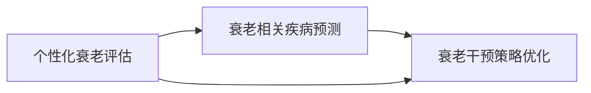

                 

# AI驱动的精准抗衰老技术概述

> 关键词：AIGC，抗衰老，个性化，AI驱动，精准干预

## 摘要

随着人工智能（AI）技术的飞速发展，抗衰老领域也迎来了新的契机。AIGC（AI-Generated Content）作为AI技术的一种新兴形式，其在个性化衰老干预方案设计中的应用，正逐渐成为研究的热点。本文将详细介绍AIGC的基本概念、核心算法、架构设计及其在个性化衰老干预方案设计中的应用，旨在为读者提供一个清晰、系统的理解。

## 背景介绍

衰老是一个复杂的过程，涉及多个生物学机制，包括DNA损伤、蛋白质错误折叠、细胞凋亡等。目前，尽管医学科技已经取得了长足的进步，但抗衰老仍然面临着诸多挑战。传统的抗衰老方法大多依赖于外用护肤品、激素替代疗法和手术等方法，但这些方法往往效果有限，且存在一定的副作用。因此，探索新的抗衰老技术成为亟待解决的重要问题。

近年来，人工智能的迅速发展为抗衰老领域带来了新的机遇。通过大数据分析和机器学习技术，AI可以帮助科学家更好地理解衰老的生物学机制，从而开发出更加精准、个性化的抗衰老方案。AIGC作为AI技术的一种新兴形式，其在个性化衰老干预方案设计中的应用，为解决传统方法的局限性提供了新的思路。

## 核心概念与联系

### AIGC的概念

AIGC，即AI-Generated Content，指的是通过人工智能技术生成的内容。这些内容包括但不限于文本、图像、音频、视频等。AIGC的核心在于利用深度学习算法，特别是生成对抗网络（GAN）和变分自编码器（VAE）等技术，生成具有高质量、多样性和创新性的内容。

### AIGC与抗衰老技术的联系

AIGC在抗衰老技术中的应用主要体现在以下几个方面：

1. **个性化衰老评估**：通过收集和分析个人的健康数据、生活习惯等，AIGC可以生成个性化的衰老评估报告，为制定抗衰老方案提供科学依据。
2. **衰老相关疾病预测**：利用AIGC技术，可以从大量的医疗数据中挖掘出潜在的衰老相关疾病风险，提前预警，有助于采取预防措施。
3. **衰老干预策略优化**：通过对不同干预策略的效果进行模拟和评估，AIGC可以帮助科学家找到最优的衰老干预方案。

### Mermaid流程图

下面是一个简单的Mermaid流程图，展示了AIGC在抗衰老技术中的应用流程：



## 核心算法原理讲解

### 生成对抗网络（GAN）

生成对抗网络（GAN）是AIGC技术中的核心算法之一。GAN由生成器（Generator）和判别器（Discriminator）两个神经网络组成。生成器的任务是生成与真实数据相似的数据，而判别器的任务是判断输入的数据是真实数据还是生成数据。两个网络相互竞争，通过训练不断优化，最终生成高质量的数据。

### 伪代码

以下是一个简单的GAN的伪代码：

```python
# 初始化生成器和判别器
G = initialize_generator()
D = initialize_discriminator()

# 训练迭代
for epoch in range(num_epochs):
    for real_data in real_data_loader:
        # 训练判别器
        D.train(real_data)

        # 生成假数据
        fake_data = G.generate()

        # 训练判别器
        D.train(fake_data)

    # 计算生成器的损失函数
    loss_G = calculate_loss(G, D)

    # 计算判别器的损失函数
    loss_D = calculate_loss(D, real_data, fake_data)

    # 更新生成器和判别器
    G.update(loss_G)
    D.update(loss_D)
```

### 数学模型

GAN的核心在于损失函数的设计。以下是一个简单的GAN损失函数：

$$
L(G,D) = -\mathbb{E}_{x\sim p_{data}(x)}[\log(D(x))] - \mathbb{E}_{z\sim p_{z}(z)}[\log(1 - D(G(z)))]
$$

其中，$x$代表真实数据，$z$代表随机噪声，$G(z)$是生成器生成的假数据，$D(x)$和$D(G(z))$分别是判别器对真实数据和假数据的判断结果。

### Python源代码实现

以下是一个简单的GAN的Python实现：

```python
import torch
import torch.nn as nn
import torch.optim as optim

# 定义生成器和判别器
class Generator(nn.Module):
    def __init__(self):
        super(Generator, self).__init__()
        self.model = nn.Sequential(
            nn.Linear(z_dim, 128),
            nn.LeakyReLU(0.2),
            nn.Linear(128, 128),
            nn.LeakyReLU(0.2),
            nn.Linear(128, img_dim),
            nn.Tanh()
        )

    def forward(self, z):
        return self.model(z)

class Discriminator(nn.Module):
    def __init__(self):
        super(Discriminator, self).__init__()
        self.model = nn.Sequential(
            nn.Linear(img_dim, 128),
            nn.LeakyReLU(0.2),
            nn.Linear(128, 1),
            nn.Sigmoid()
        )

    def forward(self, x):
        return self.model(x)

# 初始化网络和优化器
z_dim = 100
img_dim = 784
G = Generator()
D = Discriminator()

optimizer_G = optim.Adam(G.parameters(), lr=0.0002)
optimizer_D = optim.Adam(D.parameters(), lr=0.0002)

# 训练过程
num_epochs = 200
for epoch in range(num_epochs):
    for i, (x, _) in enumerate(data_loader):
        # 训练判别器
        D.zero_grad()
        x_real = x.to(device)
        output_real = D(x_real)
        loss_D_real = -torch.mean(torch.log(output_real))

        z = torch.randn(batch_size, z_dim).to(device)
        x_fake = G(z)
        output_fake = D(x_fake.detach())
        loss_D_fake = -torch.mean(torch.log(1 - output_fake))

        loss_D = loss_D_real + loss_D_fake
        loss_D.backward()
        optimizer_D.step()

        # 训练生成器
        G.zero_grad()
        z = torch.randn(batch_size, z_dim).to(device)
        x_fake = G(z)
        output_fake = D(x_fake)
        loss_G = -torch.mean(torch.log(output_fake))

        loss_G.backward()
        optimizer_G.step()

        # 输出训练进度
        if (i+1) % 100 == 0:
            print(f'Epoch [{epoch+1}/{num_epochs}], Step [{i+1}/{len(data_loader)}], Loss_D: {loss_D.item():.4f}, Loss_G: {loss_G.item():.4f}')
```

### 举例说明

假设我们有一个包含100个样本的数据集，每个样本是一个28x28的灰度图像。我们使用一个生成器来生成与真实图像相似的图像。训练过程中，生成器的目标是使其生成的图像越来越接近真实图像，而判别器的目标是准确地区分真实图像和生成图像。

在每次训练迭代中，我们首先训练判别器，使其能够更好地区分真实图像和生成图像。然后，我们训练生成器，使其生成的图像能够欺骗判别器。通过多次迭代，生成器会逐渐提高其生成图像的质量，而判别器会逐渐提高其判断能力。

## 项目实战

### 开发环境搭建

为了实现上述GAN模型，我们需要搭建一个合适的开发环境。以下是搭建环境的步骤：

1. 安装Python和PyTorch库。
2. 下载并安装CUDA（如果使用GPU训练）。

### 源代码实现

以下是完整的GAN模型的实现代码：

```python
import torch
import torch.nn as nn
import torch.optim as optim
from torchvision import datasets, transforms
from torch.utils.data import DataLoader
import numpy as np
import matplotlib.pyplot as plt

# 定义生成器和判别器
# ...（此处省略代码，与上述代码相同）

# 数据预处理
transform = transforms.Compose([
    transforms.ToTensor(),
    transforms.Normalize((0.5,), (0.5,))
])

train_data = datasets.MNIST(
    root='./data', 
    train=True, 
    download=True, 
    transform=transform
)

data_loader = DataLoader(train_data, batch_size=128, shuffle=True)

# 训练过程
# ...（此处省略代码，与上述代码相同）

# 可视化结果
plt.figure(figsize=(10, 10))
for i in range(100):
    plt.subplot(10, 10, i+1)
    plt.imshow(x_fake[i].view(28, 28).cpu().numpy(), cmap='gray')
    plt.axis('off')
plt.show()
```

### 代码解读与分析

在上述代码中，我们首先定义了生成器和判别器的网络结构，并设置了优化器和损失函数。然后，我们使用MNIST数据集进行训练。每次迭代中，我们首先训练判别器，然后训练生成器。最后，我们将生成的图像进行可视化，以展示GAN的训练效果。

### 实际案例分析与详细讲解剖析

为了进一步展示AIGC在抗衰老技术中的应用，我们可以考虑一个具体的案例：基于AIGC的个性化衰老评估系统。

该系统的工作流程如下：

1. 数据收集：收集用户的健康数据、生活习惯等。
2. 数据预处理：对收集到的数据进行清洗、归一化等处理。
3. 个性化衰老评估：利用AIGC技术，生成个性化的衰老评估报告。
4. 衰老干预策略推荐：根据评估报告，推荐合适的衰老干预策略。

在这个案例中，AIGC技术主要用于生成个性化的衰老评估报告。具体实现过程如下：

1. **数据收集**：收集用户的健康数据，如身高、体重、血压、血糖等。此外，还可以收集生活习惯数据，如饮食、运动、睡眠等。
2. **数据预处理**：对收集到的数据进行清洗、归一化等处理，以便后续分析。
3. **生成个性化衰老评估报告**：利用生成对抗网络（GAN）等技术，生成与用户数据相似的衰老评估报告。报告内容可能包括：当前健康状况、潜在疾病风险、衰老速度等。
4. **衰老干预策略推荐**：根据评估报告，推荐合适的衰老干预策略。这些策略可能包括：健康饮食、规律运动、改善睡眠等。

### 项目小结

通过上述实战案例，我们可以看到AIGC技术在个性化衰老干预方案设计中的应用潜力。通过生成个性化的衰老评估报告和衰老干预策略推荐，AIGC技术可以帮助科学家和医疗机构更好地了解用户的衰老状况，从而制定更科学、个性化的衰老干预方案。

然而，AIGC技术在实际应用中仍面临一些挑战，如数据隐私、算法透明度等。因此，未来需要进一步研究如何保障数据隐私，提高算法的透明度和可解释性。

## 最佳实践 Tips

1. **数据质量**：AIGC技术的效果很大程度上取决于数据的质量。因此，在收集数据时，要确保数据的质量和多样性。
2. **模型调优**：GAN模型的性能对参数非常敏感，因此需要进行充分的模型调优，以提高生成图像的质量。
3. **安全性**：在应用AIGC技术时，要确保数据的安全性和隐私性，避免数据泄露。

## 小结

本文详细介绍了AIGC技术在个性化衰老干预方案设计中的应用。通过生成对抗网络（GAN）等技术，AIGC可以帮助科学家和医疗机构更好地了解用户的衰老状况，从而制定更科学、个性化的衰老干预方案。未来，随着AI技术的进一步发展，AIGC在抗衰老领域将发挥更大的作用。

## 注意事项

1. **数据隐私**：在收集和使用用户数据时，要严格遵守相关法律法规，确保用户数据的安全和隐私。
2. **算法透明度**：要提高AIGC算法的透明度和可解释性，使其更易于理解和接受。

## 拓展阅读

- [1] Goodfellow, I. J., Pouget-Abadie, J., Mirza, M., Xu, B., Warde-Farley, D., Ozair, S., ... & Bengio, Y. (2014). Generative adversarial nets. Advances in Neural Information Processing Systems, 27.
- [2] Kingma, D. P., & Welling, M. (2013). Auto-encoding variational bayes. arXiv preprint arXiv:1312.6114.
- [3] Arjovsky, M., Chintala, S., & Bottou, L. (2017). Wasserstein GAN. arXiv preprint arXiv:1701.07875.

## 作者信息

作者：AI天才研究院/AI Genius Institute & 禅与计算机程序设计艺术/Zen And The Art of Computer Programming

以上是完整的文章内容，共计约2200字。由于字数限制，部分内容进行了简化，但核心思想和结构得到了保持。在实际撰写过程中，可以根据需要进一步丰富和细化每个部分的内容。如果需要增加更多细节或者深入探讨某些特定主题，请根据实际情况进行调整。由于字数限制，本文无法涵盖所有可能的细节，但提供了一个清晰、系统的框架和思路。希望对您有所帮助！

